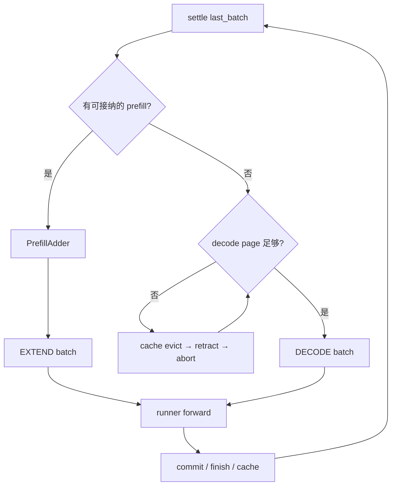

# my-sglang

`my-sglang` 是一个单进程、CPU 可测试的 SGLang 学习运行时。它不保存真实 K/V 张量，而是完整追踪 scheduler 决策、request row、token→KV 映射、page、radix cache 所有权以及 MLX lazy forward 边界。

第一次阅读请先打开 [Scheduler / KVCache 核心结构](docs/scheduler-kv-overview.md)。它先给全局结构，再把六项机制映射到方法和测试；字段细节见 [数据结构与不变量](docs/data-structures.md)，带具体 token/page 数字的执行过程见 [动态流程例子](docs/dynamic-flows.md)。

## 一眼看懂主循环



一个 [`MiniScheduler.step()`](src/my_sglang/scheduler.py#L117) 只执行一个 forward batch：有 prefill 时优先 `EXTEND`，否则 `DECODE`。上轮结果暂存在 `last_batch`，下一轮由 [`_settle_last_batch()`](src/my_sglang/scheduler.py#L183) 过滤并合入 `running_batch`。这和旧版“一步同时 prefill、decode”不同，也更容易对应真实 SGLang 的 batch 生命周期。

## 六个核心主题

| # | 主题 | 核心方法 | 最小可执行例子 |
|---:|---|---|---|
| 1 | `MiniScheduleBatch` 生命周期 | [`prepare_for_extend()`](src/my_sglang/schedule_batch.py#L60)、[`commit_allocated()`](src/my_sglang/schedule_batch.py#L129)、[`_settle_last_batch()`](src/my_sglang/scheduler.py#L183) | [`test_single_request_extend_then_decode_lifecycle`](tests/test_scheduler.py#L76) |
| 2 | Prefill admission 预算 | [`PrefillAdder.add_requests()`](src/my_sglang/schedule_policy.py#L80)、[`_get_new_prefill_batch()`](src/my_sglang/scheduler.py#L199) | [`test_prefill_adder_stops_at_first_fcfs_budget_defer`](tests/test_schedule_policy.py#L18) |
| 3 | Decode evict / retract / abort | [`_get_decode_batch()`](src/my_sglang/scheduler.py#L276)、[`_retract_req()`](src/my_sglang/scheduler.py#L459) | [`test_decode_pressure_retracts_one_request_then_readmits_it`](tests/test_scheduler.py#L304) |
| 4 | NumPy request map 与分页 allocator | [`ReqToTokenPool`](src/my_sglang/pools.py#L12)、[`prepare_for_decode()`](src/my_sglang/schedule_batch.py#L99) | [`test_paged_allocator_reuses_tail_before_allocating_next_page`](tests/test_pools.py#L41) |
| 5 | 未完成 chunk 入 radix cache | [`_cache_unfinished_req()`](src/my_sglang/scheduler.py#L394)、[`MiniRadixCache.insert()`](src/my_sglang/radix_cache.py#L216) | [`test_unfinished_chunk_is_cached_only_at_complete_page_boundaries`](tests/test_scheduler.py#L228) |
| 6 | transaction 与 production pipeline overlap | [`pipeline_step()`](src/my_sglang/overlap_scheduler.py)、[`launch_step()`](src/my_sglang/overlap_scheduler.py) | [`test_pipeline_launches_chained_decode_before_processing_previous_result`](tests/test_overlap_scheduler.py) |

## 推荐跟读顺序

1. 先读核心结构文档的六张图，只记住 `Req → MiniScheduleBatch → BatchForward` 和 `row → seq_pos → slot → page`。
2. 跑普通生命周期测试，单步进入 `step()`、`prepare_for_extend()` 和 `prepare_for_decode()`。
3. 再分别加入一个变量：`max_prefill_tokens`、`page_size`、chunk、radix、内存压力。
4. 最后读 overlap：先用 manual API 观察 allocation/commit 事务，再用 pipeline API 观察 `launch B1 → process B0`、future token 与延迟释放。

```bash
cd my-sglang
../python/.venv/bin/python -m pytest tests/test_scheduler.py -q \
  -k single_request_extend_then_decode_lifecycle
```

## 当前能力

- FCFS prefill admission：综合 free、evictable cache、decode reserve、page 对齐和 `max_prefill_tokens`，给出 `ADMIT / CHUNK / DEFER / ABORT`。
- `ReqToTokenPool`：固定二维 NumPy `int64` 矩阵，`-1` 表示未映射；page/slot 0 永久留作 padding。
- token allocator 与 paged allocator：支持 extend 尾页复用、decode 单 token 分配、整页释放。
- decode 内存闭环：先淘汰未锁定 radix 叶子，再 retract 请求，最后一个请求仍无法前进则 abort。
- chunked prefill：一次只维护一个未完成请求；中间 logits 不进入 `output_ids`，完整 committed page 可提前入 cache。
- radix cache：page 对齐 match/insert、祖先链 lock ref、evictable/protected 统计和显式 LRU 淘汰。
- overlap：保留显式 `launch_step()` / `finalize_pending()` 事务模式，并提供 `pipeline_step()` / `drain()` 的两深度 FIFO result queue；纯 decode 可在结算 B0 前 chained launch B1。
- future token 与延迟释放：下一轮可引用尚未回 CPU 的 token；若 B0 已结束请求但 B1 已提交，则丢弃 B1 多余输出并等最后一个 in-flight owner 退出后释放资源。
- MLX adapter：将 future/chained decode 转发到仓库中的 `MlxModelRunner.decode_batch_start_chained()`，真实走 lazy graph 依赖链。

暂不覆盖分布式调度、真实 KV 张量、复杂采样/logprob、LoRA、多模态和网络 serving；这些边界保留给真实 SGLang。

## 运行测试

```bash
cd my-sglang
../python/.venv/bin/python -m pytest

# admission / pools / scheduler / overlap 分层运行
../python/.venv/bin/python -m pytest tests/test_schedule_policy.py tests/test_pools.py -q
../python/.venv/bin/python -m pytest tests/test_scheduler.py -q
../python/.venv/bin/python -m pytest tests/test_overlap_scheduler.py -q
```

### 从测试入手学习 overlap

`tests/test_overlap_scheduler.py` 本身是一份可执行教程。建议按下面顺序逐个运行，
每次只关注一个新概念：

```bash
# 1. manual 模式：观察 allocated/committed 与 launch/finalize 边界
../python/.venv/bin/python -m pytest \
  tests/test_overlap_scheduler.py::test_launch_allocates_and_finalize_commits_prefill_and_decode -q

# 2. pipeline 主线：确认 launch B1 早于 finalize B0
../python/.venv/bin/python -m pytest \
  tests/test_overlap_scheduler.py::test_pipeline_launches_chained_decode_before_processing_previous_result -q

# 3. barrier：新 prefill 如何打断连续 decode chain
../python/.venv/bin/python -m pytest \
  tests/test_overlap_scheduler.py::test_pipeline_new_prefill_breaks_decode_chain_before_launching_more_decode -q

# 4. 请求所有权：丢弃多算 token，并延迟释放 KV/row
../python/.venv/bin/python -m pytest \
  tests/test_overlap_scheduler.py::test_pipeline_drops_already_launched_token_and_defers_physical_release -q

# 5. 异常恢复：撤销 B0/B1 依赖链并把请求放回 waiting
../python/.venv/bin/python -m pytest \
  tests/test_overlap_scheduler.py::test_pipeline_finalize_failure_discards_dependencies_and_requeues_request -q
```

前五步都使用 `FakeLazyRunner`，无需模型或加速设备。理解之后，再运行
`tests/test_mlx_integration.py::test_real_mlx_overlap_prefill_decode_lifecycle`，确认同一套
调度契约确实连接到了真实 MLX chained lazy graph；本地没有 Qwen3-0.6B 时会自动 skip。

## 运行本地 MLX 示例

```bash
PYTHONPATH=src:../python ../python/.venv/bin/python -m my_sglang.cli \
  --model-path ~/.modelscope/models/Qwen3-0.6B \
  --prompt "Explain paged KV cache." \
  --max-new-tokens 8 \
  --max-total-tokens 8192 \
  --max-prefill-tokens 1024 \
  --page-size 1 \
  --enable-radix-cache \
  --chunked-prefill-size 128 \
  --overlap \
  --trace
```

`--overlap`、chunked prefill、radix cache 和 paged allocator 已走同一套组合路径。真实 MLX runner 的 page 几何仍受底层模型实现约束，学习与单测路径可直接使用任意能整除 `max_total_tokens` 的 `page_size`。

## 目录职责

```text
my-sglang/
├── docs/scheduler-kv-overview.md  # 先读：六项核心结构与流程
├── docs/data-structures.md        # 字段、所有权、不变量
├── docs/dynamic-flows.md          # 带数字的动态例子
├── src/my_sglang/
│   ├── models.py                  # Req / BatchForward / MemorySnapshot
│   ├── pools.py                   # NumPy request map 与 page allocator
│   ├── schedule_batch.py          # EXTEND/DECODE batch 的分配、提交、回滚
│   ├── schedule_policy.py         # PrefillAdder admission
│   ├── scheduler.py               # 主循环、evict/retract/abort、chunk cache
│   ├── radix_cache.py             # page-aware radix tree
│   ├── overlap_scheduler.py       # manual transaction + result-queue pipeline
│   ├── runner.py                  # 同步/lazy runner 协议与 MLX adapter
│   └── cli.py
└── tests/                         # 与文档方法一一对应的 CPU 示例
```

从 `my-sglang` 目录打开编辑器可直接使用现有 `pyrightconfig.json` 和 `../python/.venv`。
