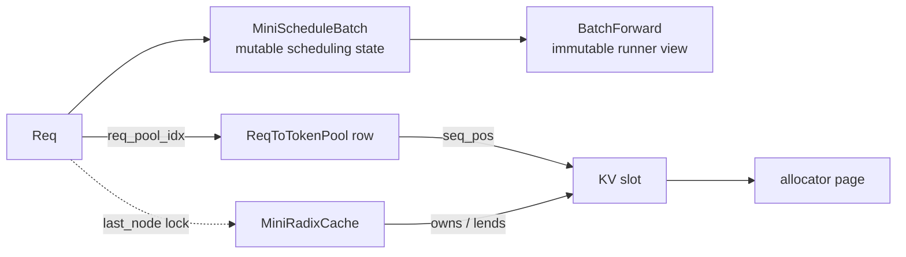
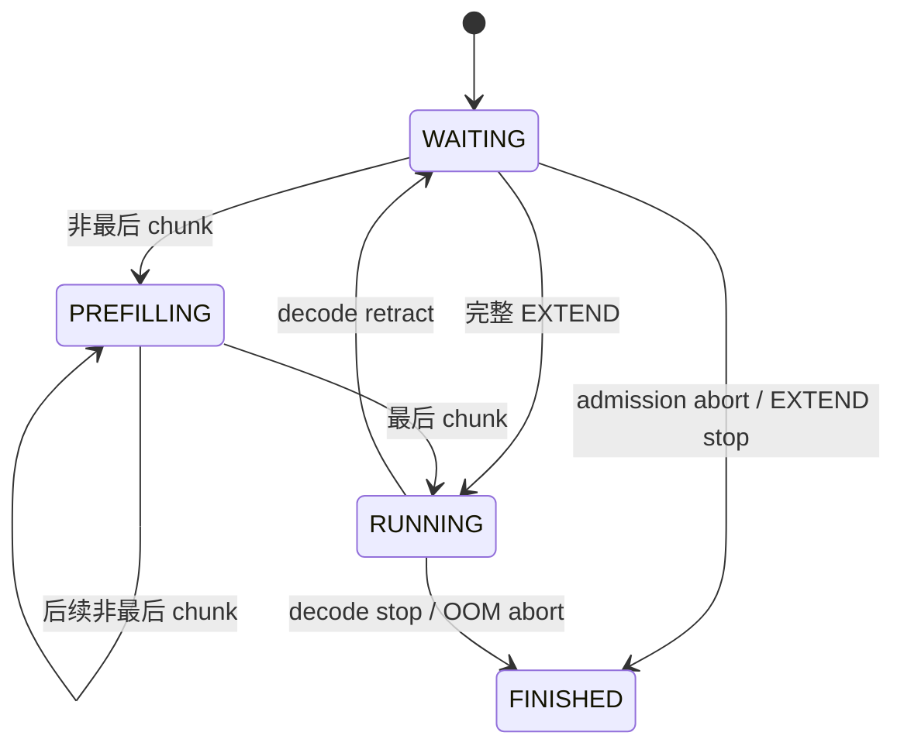
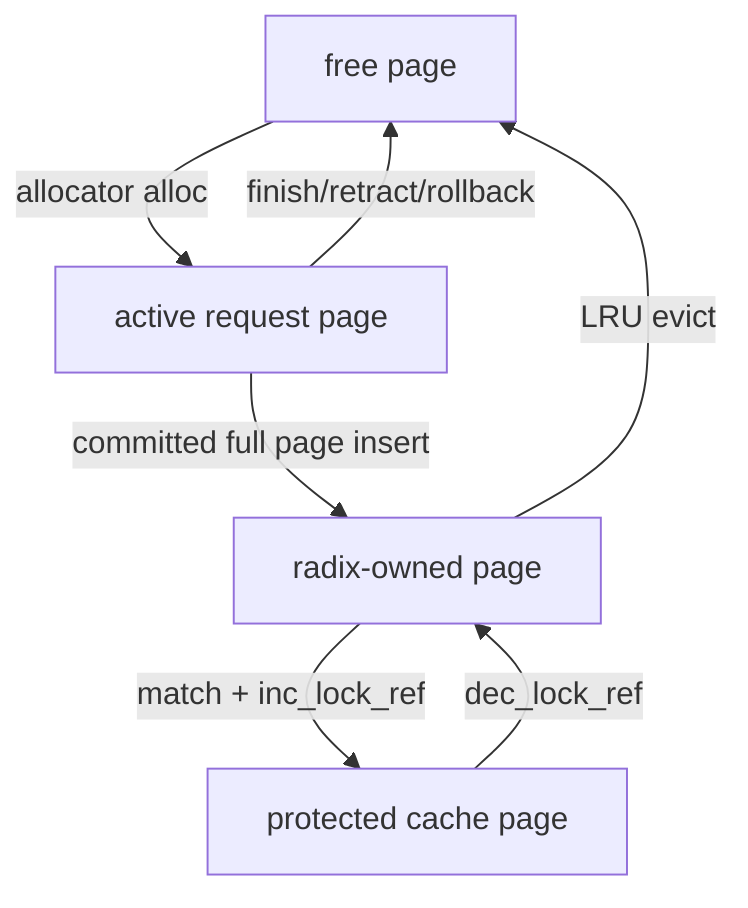

# 数据结构、所有权与不变量

先记住两条链：请求状态从 `Req` 进入可变 `MiniScheduleBatch`，最后变成给 runner 的不可变 `BatchForward`；KV 地址从 request row 和逻辑位置映射到 slot，再由 allocator 解释 slot 属于哪个 page。



<a id="req-state"></a>
## 1. `Req`：逻辑 token 与物理 KV 边界

[`Req`](../src/my_sglang/models.py#L34) 跨多个 step 存活。关键字段不是 slot 列表，而是长度边界和 `ReqToTokenPool` 行。

| 字段 | 含义 | 主要修改方法 |
|---|---|---|
| `origin_input_ids` / `output_ids` | 固定 prompt / 已向用户确认的生成 token | [`append_output()`](../src/my_sglang/models.py#L88) |
| `fill_ids` | prompt；retract 后为 prompt + 已生成 token，用来重建上下文 | [`reset_for_retract()`](../src/my_sglang/models.py#L119) |
| `req_pool_idx` | 二维映射矩阵中的活跃行 | [`_attach_new_request()`](../src/my_sglang/scheduler.py#L372) |
| `fill_len` / `extend_input_len` | 本轮计划计算到哪里 / 本轮 suffix 长度 | [`_get_new_prefill_batch()`](../src/my_sglang/scheduler.py#L199) |
| `kv_allocated_len` | 已有物理 slot；forward 可能尚未成功 | [`prepare_for_extend()`](../src/my_sglang/schedule_batch.py#L60) |
| `kv_committed_len` | forward 已成功的 KV 边界 | [`commit_allocated()`](../src/my_sglang/schedule_batch.py#L129) |
| `prefix_indices` / `last_node` | 从 radix cache 借用的 slot / 被锁住的终点节点 | [`_attach_new_request()`](../src/my_sglang/scheduler.py#L372) |
| `cache_protected_len` | 当前请求锁住的 cache prefix 长度 | [`_cache_unfinished_req()`](../src/my_sglang/scheduler.py#L394) |
| `retracted_stain` | 曾被 retract；再次 admission 时预留全部剩余输出 | [`_retract_req()`](../src/my_sglang/scheduler.py#L459) |

### 与标准 SGLang 的字段对照：先对齐职责，再看实现

标准 SGLang 的 [`Req`](../../python/sglang/srt/managers/schedule_batch.py#L666) 包含同一条
请求/KV/prefix 主链，但运行在真实设备 KV 和更完整的 serving 场景中。下表的“对应”
表示职责可对照，不表示两个对象可替换，也不表示生命周期完全一样。

| my-sglang | 标准 SGLang 当前字段/接口 | 对齐点 | 标准版额外边界 |
|---|---|---|---|
| `origin_input_ids` / `output_ids` | 同名字段 | 原始输入与追加生成 token | 还处理 unpadded 输入、多模态、session、采样与 logprob |
| `fill_ids` | `full_untruncated_fill_ids` + `get_fill_ids()` | 都表示本轮可用于 prefill 的逻辑序列 | 标准版可含 DLLM mask，并由刷新逻辑维护完整序列 |
| `fill_len` | `fill_len` | 本轮实际计划填充到的逻辑终点 | 标准版把完整序列与本轮可处理长度分开存储 |
| `req_pool_idx` | `req_pool_idx` | `(request row, sequence position) -> KV slot` 中的 row | 还可能同时管理 Mamba pool 和设备 tensor |
| `kv_allocated_len` / `kv_committed_len` | 同名字段 | 未确认分配与已成功 KV 的边界 | 标准版另有“已释放 committed / overallocated KV”的防重释放标记 |
| `prefix_indices` | `prefix_indices` | 复用 prefix 的 KV slot 序列 | 标准版为 device tensor，并可叠加 host cache 命中 |
| `extend_input_len` | `extend_input_len` | 本轮 EXTEND 仍须执行的 suffix token 数 | 标准版还会计算 logprob 的相对起点 |
| `last_node` / `cache_protected_len` | 同名字段 | radix 节点锁和受保护 prefix 长度 | 标准版还区分 host node、SWA 等 cache 路径 |
| `retracted_stain` | `retracted_stain` | 标记请求曾被 retract，需要按更保守条件重新 admission | 标准版还有 speculative decoding 等重试状态 |

```text
my-sglang:   保留 scheduler、slot、page、prefix 所有权这一条主干
标准 SGLang: 主干 + 真实 GPU KV + 多模态 + session + 分层 cache + 分布式/复杂调度
```

阅读标准实现时，可从 `Req` 的输入/KV 字段、prefix 字段和
[`get_fill_ids()`](../../python/sglang/srt/managers/schedule_batch.py#L1099) 三处回照本节；
不要把标准版新增字段倒灌进教学模型，除非要专门教学它解决的那个问题。

核心边界始终满足：

```text
0 <= cache_protected_len <= kv_committed_len <= kv_allocated_len
req_to_token[row, :kv_allocated_len] 都是 allocator 当前拥有的 slot
刚生成的最后一个 output token 尚未进入 KV
```

### 用一个请求把这些长度分开

假设 `prompt=[7,8]`，已经向调用方返回 `10`，并且下一轮 decode 已经
`allocate`、但 runner 尚未返回。此时不要把三个“长度”当成同一个概念：

| 观察项 | 值 | 为什么 |
|---|---:|---|
| `full_token_ids` | `[7,8,10]` | `10` 已经是确认输出 |
| `kv_committed_len` | `2` | 只有 prompt `[7,8]` 的 KV 已成功 forward |
| `kv_allocated_len` | `3` | 本轮正为输入 token `10` 预留 slot |
| `req_to_token[row, :3]` | `[2,3,4]` | slot `4` 可回滚，但还不能被 cache 当作稳定前缀 |

```text
逻辑 token:        [7, 8, 10]
KV 已确认:          [7, 8]
KV 已预留未确认:            [10]
                     ^ committed=2  ^ allocated=3
```

runner 成功后，`commit_allocated()` 才把 committed 推到 3；runner 抛异常则
`rollback_uncommitted()` 清掉位置 2 的映射，并把 `allocated` 拉回 2。这个例子
也是理解 overlap 中 `allocated > committed` 的最小模型。

状态机：



<a id="batch-forward"></a>
## 2. `MiniScheduleBatch` 与 `BatchForward`

[`MiniScheduleBatch`](../src/my_sglang/schedule_batch.py#L16) 是 scheduler 内部的可变对象，负责分配、映射、提交、回滚和 batch 过滤；[`BatchForward`](../src/my_sglang/models.py#L134) 是调用 runner 前生成的只读快照。

| 阶段 | 可变状态 | 方法 |
|---|---|---|
| schedule | `reqs / forward_mode / fill_len` 已确定 | [`_get_new_prefill_batch()`](../src/my_sglang/scheduler.py#L199) |
| allocate | 写 `req_to_token`，推进 `kv_allocated_len` | [`prepare_for_extend()`](../src/my_sglang/schedule_batch.py#L60)、[`prepare_for_decode()`](../src/my_sglang/schedule_batch.py#L99) |
| snapshot | 生成 runner 所需 tuple | [`to_forward_batch()`](../src/my_sglang/schedule_batch.py#L167) |
| success | `committed = allocated` | [`commit_allocated()`](../src/my_sglang/schedule_batch.py#L129) |
| failure | 清掉 committed 后的映射，只释放不共享的 page | [`rollback_uncommitted()`](../src/my_sglang/schedule_batch.py#L136) |
| next step | finished/chunked 过滤，或 merge 到 running | [`_settle_last_batch()`](../src/my_sglang/scheduler.py#L183) |

`BatchForward` 的第 0 维总与 `reqs` 对齐：

| 字段 | EXTEND | DECODE |
|---|---|---|
| `input_ids_by_req` | 未缓存 suffix / 当前 chunk | 每个请求最后一个逻辑 token |
| `out_cache_locs` | 本轮 suffix 的 slot | 每请求一个输入 slot |
| `seq_lens` | 当前 fill 终点 | 本轮输入写入后的长度 |
| `prefix_slot_ids_by_req` | radix 命中 | 通常为空 |
| `extend_lens` | suffix 长度 | 全 1 |

## 3. `ReqToTokenPool`：固定二维 NumPy 映射

[`ReqToTokenPool`](../src/my_sglang/pools.py#L12) 的 `req_to_token` 是形状 `(max_running_reqs, max_context_len)` 的 `np.int64` 数组，`-1` 表示未映射。

以 page size 2、请求行 0、prompt `[7,8,9]` 为例：

```text
page 0: slots [0,1]    reserved padding, never allocated
page 1: slots [2,3]    token 7,8
page 2: slots [4,5]    token 9, free tail

req_to_token[0, :3] = [2,3,4]
```

下一轮 decode 输入可直接复用 page 2 的尾 slot 5，不申请新 page。再下一轮才申请 page 3 的 slot 6。该行为由 [`test_paged_allocator_reuses_tail_before_allocating_next_page`](../tests/test_pools.py#L41) 固定。

allocator 的 `available_size/allocated_size` 按完整 page 计数，因此已分配 page 的空尾 slot 不会出现在 `available_size`，只能通过 `last_loc` 被同一序列继续利用。

### 三种“空闲”不要混淆

| 名称 | 例子 | 能否立刻给新请求使用 |
|---|---|---|
| allocator free page | page 3 从未分配或已完整释放 | 能 |
| 已分配 page 的尾 slot | page 2 的 slot 5 | 只能给持有 page 2 的同一请求续写 |
| radix evictable slot | cache 中无 lock 的完整 page | 先 LRU evict，再由 scheduler free，随后才能使用 |

所以“`available_size=0`”不必然表示完全无法执行：同一请求可能还能复用尾页；
反过来，“cache 有 slot”也不表示 allocator 已经空闲，必须先走淘汰和释放的所有权转移。

<a id="radix-tree"></a>
## 4. KV page 与 radix cache 所有权



[`MiniRadixCache.match_prefix()`](../src/my_sglang/radix_cache.py#L112) 和 [`insert()`](../src/my_sglang/radix_cache.py#L216) 都向下截断到完整 page。锁住命中终点时，[`inc_lock_ref()`](../src/my_sglang/radix_cache.py#L199) 会沿父链增加引用；释放时必须从同一终点 [`dec_lock_ref()`](../src/my_sglang/radix_cache.py#L207)。

- `protected_size()`：活跃请求正在借用，不能淘汰。
- `evictable_size()`：没有 lock，可计入 admission 可回收预算。
<a id="radix-lru"></a>

- [`evict(n)`](../src/my_sglang/radix_cache.py#L365)：按 LRU 删除未锁定叶子，返回 slot；真正 free page 的仍是 scheduler。

page 是释放粒度。`free_unshared_pages(candidate, protected)` 只释放与 `protected` 不共页的 candidate，防止 cache prefix 与请求尾部共享一页时误释放。

## 5. Admission 的 `MemoryBudget`

[`PrefillAdder`](../src/my_sglang/schedule_policy.py#L38) 在一次规划中维护：

```text
remaining_tokens
  = allocator.available_size
  + cache.evictable_size
  - running decode reserve

remaining_prefill_tokens = max_prefill_tokens
```

每个候选成本还包含 page 向上取整、输出预留和一页对齐余量。返回值语义：

| 结果 | 状态变化 |
|---|---|
| `ADMIT` | 完整 suffix 进入本轮 EXTEND |
| `CHUNK` | 只推进一段，成为唯一 `chunked_req` |
| `DEFER` | 保留 waiting；FCFS 不越过首个预算失败请求 |
| `ABORT` | 物理上连最小执行块都无法容纳，结束并给出原因 |

空系统首请求或正在继续的 chunk 有“物理可容纳”兜底，避免因为未来输出预留永久 defer；真正的后续压力由 decode evict/retract/abort 闭环处理。

## 6. 一组可以随时断言的不变量

[`MiniScheduler.assert_consistent()`](../src/my_sglang/scheduler.py#L546) 汇总检查：

```text
request rows: active + free == capacity，且集合不相交
KV pages: allocated + free == num_pages，page 0 不在两者中
每个活跃请求的已映射 slot 都属于 allocated page
committed 不领先 allocated
cache protected 不领先 committed
overlap pending 期间允许 allocated > committed
```

建议调试时同时打印 [`memory_snapshot()`](../src/my_sglang/scheduler.py#L532)：free、allocated、mapped、cache evictable/protected 和 decode reserve 能快速说明“内存去哪了”。
