# 数据结构、所有权与不变量

先记住两条链：请求状态从 `Req` 进入可变 `MiniScheduleBatch`，最后变成给 runner 的不可变 `ForwardBatch`；KV 地址从 request row 和逻辑位置映射到 slot，再由 allocator 解释 slot 属于哪个 page。


<a id="req-state"></a>
## 1. `Req`：逻辑 token 与物理 KV 边界

[`Req`](../src/my_sglang/models.py) 跨多个 step 存活。关键字段不是 slot 列表，而是长度边界和 `ReqToTokenPool` 行。

| 字段                                | 含义                                                                 | 主要修改方法                                                       |
| --------------------------------- | ------------------------------------------------------------------ | ------------------------------------------------------------ |
| `origin_input_ids` / `output_ids` | 固定 prompt / 已向用户确认的生成 token                                        | [`append_output()`](../src/my_sglang/models.py)              |
| `get_fill_ids()`                  | prompt；retract 后为 prompt + 已生成 token，用来重建上下文                       | [`reset_for_retract()`](../src/my_sglang/models.py)          |
| `req_pool_idx`                    | 二维映射矩阵中的活跃行                                                        | [`_attach_new_request()`](../src/my_sglang/scheduler.py)     |
| `extend_range`                    | 本轮 EXTEND 的请求内 `[start,end)` 区间                                       | [`_get_new_prefill_batch()`](../src/my_sglang/scheduler.py)  |
| `kv.kv_allocated_len`             | 已有物理 slot；forward 可能尚未成功                                           | [`prepare_for_extend()`](../src/my_sglang/schedule_batch.py) |
| `kv_committed_len`                | scheduler 已接受的 KV 边界；同步路径在 runner 返回后提交，overlap 路径在异步 launch 成功后提交 | [`commit_allocated()`](../src/my_sglang/schedule_batch.py)   |
| `prefix_indices` / `last_node`    | 从 radix cache 借用的 slot / 被锁住的终点节点                                  | [`_attach_new_request()`](../src/my_sglang/scheduler.py)     |
| `cache_protected_len`             | 当前请求锁住的 cache prefix 长度                                            | [`_cache_unfinished_req()`](../src/my_sglang/scheduler.py)   |
| `retracted_stain`                 | 曾被 retract；再次 admission 时预留全部剩余输出                                  | [`_retract_req()`](../src/my_sglang/scheduler.py)            |

### 与标准 SGLang 的 `Req` 全字段对照

标准 SGLang 的 [`Req`](../../python/sglang/srt/managers/schedule_batch.py) 包含同一条
请求/KV/prefix 主链，但运行在真实设备 KV 和更完整的 serving 场景中。下表的“对应”
表示职责可对照，不表示两个对象可替换，也不表示生命周期完全一样。

下面覆盖 [`my_sglang.models.Req`](../src/my_sglang/models.py) 的全部 dataclass
字段。标记“同名”时，可以直接拿字段名去标准 SRT 搜索；标记“职责对应”时，必须
注意对象层级或表示方式已经变化。

| my-sglang `Req` 字段 | 标准 SRT 当前字段/接口 | 关系 | 阅读标准代码时怎么理解 |
|---|---|---|---|
| `rid` | `Req.rid` | 同名 | 请求唯一标识 |
| `origin_input_ids` | `Req.origin_input_ids` | 同名 | 原始 prompt；标准版另有 `origin_input_ids_unpadded` |
| `sampling_params` | `Req.sampling_params` | 同名 | 标准类型位于 `srt/sampling/sampling_params.py`，配置更完整 |
| `eos_token_ids` | `Req.eos_token_ids` | 同名 | 模型 EOS 集合；不同于用户配置的 `sampling_params.stop_token_ids` |
| `output_ids` | `Req.output_ids` | 同名 | 都是 append-only 生成结果；标准版使用 `array("q")` |
| `status` | 无统一字段 | 教学专用 | 标准版由 waiting/running/chunked 容器、`finished_reason`、`is_retracted` 共同表达状态 |
| `req_pool_idx` | `Req.req_pool_idx` | 同名 | `(request row, sequence position) -> KV slot` 的稳定 row；标准 row 0 保留作 padding |
| `prefix_indices` | `Req.prefix_indices` | 同名 | cache 命中的设备 KV slot 序列；教学版为 NumPy |
| `last_node` | `Req.last_node` | 同名 | radix cache 当前锁住路径的终点节点 |
| `cache_protected_len` | `Req.cache_protected_len` | 同名 | 已交给 cache 且仍受请求保护的 prefix 长度 |
| `extend_range` | `Req.extend_range` | 同名同类型 | 都使用带 `start/end/length` 的 `Range` 表示本轮 EXTEND 区间 |
| `kv` | `Req.kv` | 同名同层级 | 都是 `ReqKvInfo`；教学版不实现 SWA，因而省略 `swa_evicted_seqlen` |
| `kv.kv_allocated_len` | `Req.kv.kv_allocated_len` | 同名同层级 | 已经分配物理 KV 的边界；教学 `ReqKvInfo` 只保留这一核心字段 |
| `kv_committed_len` | `Req.kv_committed_len` | 同名 | scheduler 已提交、可作为稳定历史使用的 KV 边界 |
| `retracted_stain` | `Req.retracted_stain` | 同名 | 是否曾 retract，用于更保守的再次 admission |
| `finished_reason` | `Req.finished_reason` | 同名同结构 | 都使用 `FINISH_MATCHED_TOKEN` / `FINISH_LENGTH` / `FINISH_ABORT` 对象 |

`SamplingParams` 的两个教学字段也要分开看：

| my-sglang | 标准 SRT | 说明 |
|---|---|---|
| `max_new_tokens` | `SamplingParams.max_new_tokens` | 同名 |
| `Req.eos_token_ids` | `Req.eos_token_ids` | 同名；模型 EOS 集合 |
| `SamplingParams.stop_token_ids` | `SamplingParams.stop_token_ids` | 同名；用户指定的 stop-token 集合 |

`Req` 的计算属性/方法不是额外状态，对照如下：

| my-sglang 计算属性 | 标准 SRT 对应写法 |
|---|---|
| `generated_count` | `len(req.output_ids)` |
| `full_untruncated_fill_ids` | `req.full_untruncated_fill_ids`；同名基础 generation 视图 |
| `get_fill_ids()` | `req.get_fill_ids()`；同名 |
| `last_token_id` | `req.get_fill_ids()[-1]`；overlap decode 通常直接来自 FutureMap |
| `remaining_new_tokens` | `req.sampling_params.max_new_tokens - len(req.output_ids)` |

```text
my-sglang:   保留 scheduler、slot、page、prefix 所有权这一条主干
标准 SGLang: 主干 + 真实 GPU KV + 多模态 + session + 分层 cache + 分布式/复杂调度
```

阅读标准实现时，可从 `Req` 的输入/KV 字段、prefix 字段和
[`get_fill_ids()`](../../python/sglang/srt/managers/schedule_batch.py) 三处回照本节；
不要把标准版新增字段倒灌进教学模型，除非要专门教学它解决的那个问题。

教学版的 `RequestStatus` 是显式状态机；标准 SRT 主要通过 waiting/running/
chunked 容器、`finished_reason`、`is_retracted` 等共同表示生命周期，没有一个
与此枚举一一对应的字段。

核心边界始终满足：

```text
0 <= cache_protected_len <= kv_committed_len <= kv.kv_allocated_len
req_to_token[row, :kv.kv_allocated_len] 都是 allocator 当前拥有的 slot
同步路径中，刚生成的最后一个 output token 尚未进入 KV
overlap 若已提交后继 batch，KV 边界可领先 CPU 已提交的 output_ids 一轮
```

### 用一个请求把这些长度分开

假设 `prompt=[7,8]`，已经向调用方返回 `10`，并且下一轮 decode 已经成功
enqueue 到 Fake CUDA。此时不要把三个“长度”当成同一个概念：

| 观察项 | 值 | 为什么 |
|---|---:|---|
| `full_untruncated_fill_ids` | `[7,8,10]` | `10` 已经是确认输出 |
| `kv_committed_len` | `3` | prompt `[7,8]` 和 decode 输入 `10` 已成功 enqueue |
| `kv.kv_allocated_len` | `3` | 本轮为输入 token `10` 预留的 slot 已提交 |
| `req_to_token[row, :3]` | `[102,103,104]` | 三个 slot 都已提交；只有完整 page 才能作为可复用 cache 前缀 |

```text
逻辑 token:        [7, 8, 10]
KV 已提交:          [7, 8, 10]
                     ^ committed=allocated=3
```

`commit_allocated()` 在 launch 成功后把 committed 推到 3。若 launch 失败，
`rollback_uncommitted()` 清掉新分配的位置 2 的映射，并把 `allocated` 拉回 2。Fake CUDA
pipeline 的关键是：KV 已提交不代表 `11` 已写入 `output_ids`；后者仍要等待
result queue 队首的 `copy_done`。

下图把同一个请求的逻辑 token、request row、二维 slot 映射和两个 KV 水位对齐到
相同的 `pos 0..2`。右侧的 FutureMap 仍只保存下一次 decode 输入，不保存输出历史。

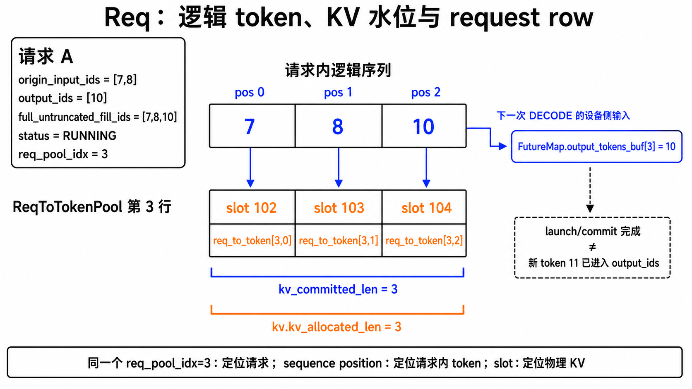

状态机：

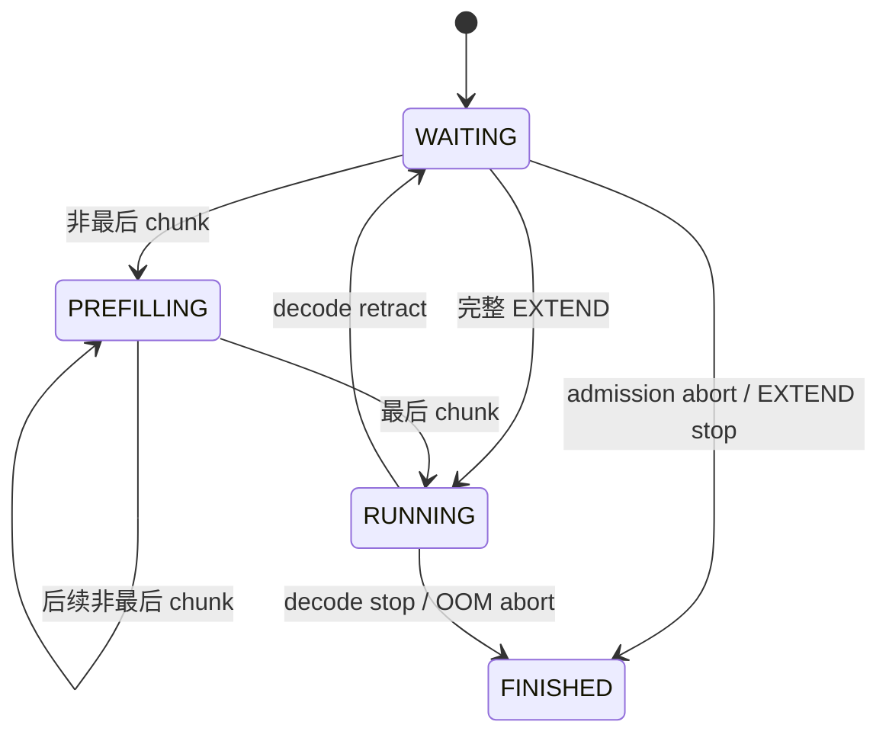

### 状态机怎么读：状态描述请求，`EXTEND` / `DECODE` 描述这一步 batch

最容易混淆的是把 `PREFILLING` 当作“只要在做 prefill 就会处于这个状态”。
这里不是这样：`RequestStatus` 是 `Req` 跨多个 `step()` 的状态；
`ForwardMode` 是**本次** runner 调用的模式。一个没有分块的普通 prompt 会经历一次
`EXTEND`，但结果立刻进入 `RUNNING`，根本不会停在 `PREFILLING`。

| 请求状态 | 人话含义 | 这一步可被调度成什么 batch | 进入条件 | 离开条件 | 持有资源 |
|---|---|---|---|---|---|
| `WAITING` | 排队等 admission，或被撤回后等待重建 KV | `EXTEND` | 新建 `Req`；或者 decode 内存紧张时 `retract` | admission 成功：完整 prompt 到 `RUNNING`，非最后 chunk 到 `PREFILLING`；物理上不可能执行时到 `FINISHED` | 新请求通常没有 row/KV；retract 后只保留逻辑 token，row、非缓存 KV 与 runner 状态已释放 |
| `PREFILLING` | 长 prompt 正在分块填充，尚不能生成/返回第一个 token | 下一次仍是 `EXTEND`，且该请求是唯一 `chunked_req` | 一个非最后 `EXTEND` chunk 成功 | 后续 chunk 不完整则保持；最后 chunk 成功后到 `RUNNING`，或因 EOS/长度上限到 `FINISHED` | request row、已完成的 KV；完整 page 可以提前进入 radix cache 并被锁住 |
| `RUNNING` | prompt 已处理完，已拿到第一个 output；之后逐 token decode | `DECODE`（把“上一个 output token”写入 KV） | 完整 `EXTEND` 成功且尚未停止；或最后一个 chunk 成功 | EOS/长度上限时到 `FINISHED`；被选为 retract victim 时回到 `WAITING` | active row、已确认 KV，以及可能锁住的 cache prefix |
| `FINISHED` | 终态，不再参与调度 | 不会进入 batch | EOS、长度上限、admission abort，或最后一个无法回收 KV 的请求 OOM abort | 无后继状态 | active row、请求私有 KV、runner 状态已释放；完整 page 可以由 radix cache 继续持有 |

可以把状态转换压缩成下面这四句话：

```text
短 prompt：       WAITING --一次完整 EXTEND--> RUNNING --DECODE...--> FINISHED
长 prompt：       WAITING --非最后 EXTEND--> PREFILLING --最后 EXTEND--> RUNNING
decode 内存紧张： RUNNING --retract（释放物理状态）--> WAITING --重新 EXTEND--> RUNNING
不能执行：        WAITING / RUNNING -------------------------------> FINISHED
```

`PREFILLING` 的关键不是“正在算 prompt”，而是“**prompt 还没有全部写进 KV，因而还不能产生第一个可返回 token**”。
`RUNNING` 的关键不是“GPU 此刻正在运行”，而是“请求已经具备逐 token decode 的资格”。

下图先把短请求和 chunked 请求放到同一时间轴：方框表示跨 step 的
`RequestStatus`，箭头表示本次 batch 的 `ForwardMode` 与输入。

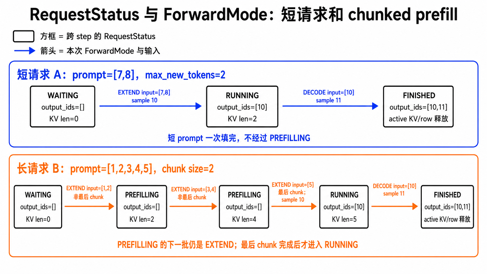

### 例子 A：短请求为什么跳过 `PREFILLING`

以下表描述同步 scheduler。设 `prompt=[7,8]`，`max_new_tokens=2`，runner 在 prefill 后返回 `10`，下一轮 decode 返回
`11`。未启用 chunked prefill，所以 prompt 一次就能处理完。

| `step()` | 调度的 `ForwardBatch.forward_mode` 与输入 | runner 新返回的 token | 请求状态（本 step 结束时） | `output_ids` | KV 边界（本 step 成功后） |
|---:|---|---:|---|---|---|
| 0（刚入队） | 无 | 无 | `WAITING` | `[]` | `allocated=committed=0` |
| 1 | `EXTEND`，输入 `[7,8]` | `10` | `RUNNING` | `[10]` | `[7,8]` 已写入 KV，`allocated=committed=2` |
| 2 | `DECODE`，输入 `[10]` | `11` | `FINISHED`（达到 2 个输出） | `[10,11]` | `[10]` 也已写入 KV，随后 active KV/row 被释放 |

注意 decode 的因果关系：第 2 步的输入是已在第 1 步返回的 `10`，模型在它的 KV
上下文上预测出 `11`。因此结束时最后生成的 `11` 已交给用户，却还没有被写入 KV；如果
它没有结束，请求会保持 `RUNNING`，下一次 `DECODE` 才把 `11` 作为输入写入 KV。

### 例子 B：长请求如何停在 `PREFILLING`

设 `prompt=[1,2,3,4,5]`，`chunked_prefill_size=2`，`max_new_tokens=2`。runner 对前两段
只完成 KV；只有最后一段才返回第一个 output。

| `step()` | `EXTEND` 输入 / 是否最后 chunk | `extend_range.end=kv_committed_len` | 状态（本 step 结束时） | `output_ids` | 为什么 |
|---:|---|---:|---|---|---|
| 1 | `[1,2]` / 否 | 2 | `PREFILLING` | `[]` | prompt 还有 `[3,4,5]`，返回的值不能作为用户 output。 |
| 2 | `[3,4]` / 否 | 4 | `PREFILLING` | `[]` | prompt 还剩 `[5]`；若 page size 为 2，此时 `[1,2,3,4]` 可作为完整 cache page。 |
| 3 | `[5]` / 是 | 5 | `RUNNING` | `[10]` | prompt 已完整处理，prefill 的返回值 `10` 才是第一个生成 token。 |
| 4 | `DECODE` 输入 `[10]` | 6 | `FINISHED` | `[10,11]` | decode 返回第二个 token `11`，达到长度上限。 |

如果第 3 步后发生 decode OOM，调度器可能选择这个请求做 `retract`：状态回到
`WAITING`，但 `output_ids=[10]` 不会丢。下次 admission 时，`get_fill_ids()` 已变为
`[1,2,3,4,5,10]`，它会重新走 `EXTEND` 来恢复上下文，而不是重新生成 `10`。

<a id="batch-forward"></a>
## 2. `FutureMap` 与 result queue：overlap 的两本新账

同步 scheduler 只要处理“本轮输入、KV、输出”。overlap 多出两本账：一份让下一轮
forward 继续跑，一份让 CPU 按顺序晚点提交结果。

`output_tokens_buf` 是长度为 `req_pool_size` 的一维数组。它的数组下标就是请求的
`req_pool_idx`（request row），不是请求在当前 batch 中的位置：

```text
FutureMap.output_tokens_buf[req.req_pool_idx] = 该请求下一次 decode 的输入 token
```

例如两个请求当前不在同一个 batch 位置，也仍然通过各自稳定的 request row 读写：

| 请求 | `req_pool_idx` | FutureMap 中的值 | 含义 |
|---|---:|---:|---|
| A | 3 | `output_tokens_buf[3] = 11` | A 下一次 decode 输入 11 |
| B | 7 | `output_tokens_buf[7] = 25` | B 下一次 decode 输入 25 |

假设请求 A 在请求池中的稳定行号是：

```text
A.req_pool_idx = 3
```

这个 `3` 会同时用于两张表，但两张表的维度、内容和用途都不同：

| 表 | 维度 | 查询 | 返回值 |
|---|---|---|---|
| `FutureMap.output_tokens_buf` | 一维：`[request_row]` | `[3]` | 一个 token，例如 `11` |
| `ReqToTokenPool.req_to_token` | 二维：`[request_row, sequence_position]` | `[3, 0:4]` | 一组物理 KV slot，例如 `[8,9,12,13]` |

设 A 的 prompt 是 `[1,2]`，已生成 `10,11`，B2 即将把 token `11` 作为输入：

```text
FutureMap.output_tokens_buf[3] = 11

逻辑序列位置                 0    1     2     3
对应输入 token               1    2    10    11
ReqToTokenPool 第 3 行 slot   8    9    12    13
```

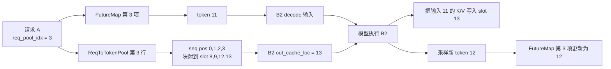

所以，`FutureMap.output_tokens_buf[3]` 回答“B2 的输入 token 是多少”，而
`req_to_token[3, 3]` 回答“这个输入 token 的 K/V 应写到哪个物理 slot”。两者
只是共享请求行号 `3`，并不保存同一种数据，也不会互相替代。

下图再加入 `result_queue`：绿色是无需等待 CPU 的设备侧 token relay，橙色是二维
KV slot 映射，蓝色是 CPU 严格 FIFO 的结果提交。同一个 token 11 会同时走设备侧
和 host 侧两条用途不同的路径。

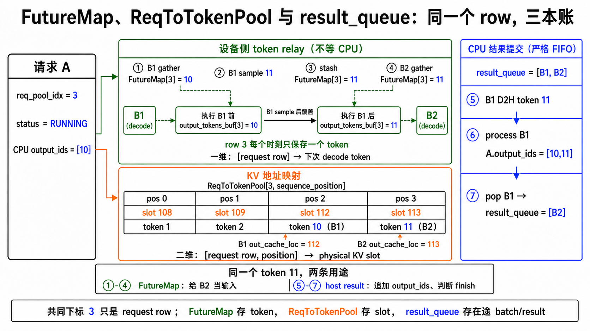

### Git 图式分镜：先交棒，再结账

下面三帧借用 Git graph 的主干、分支与提交点来表示时间关系；它们不是 Git 操作图。
时间从左向右，紫线表示设备侧 `FutureMap` token relay，蓝线表示 CPU 侧
`result_queue` FIFO 提交。每帧只有高亮部分表示当前动作，淡化节点只是保留前后
时序坐标。

第一帧：B1 在 forward stream 上采样出 `11`，随即 stash 到
`FutureMap[A.row]`。此时设备侧已经拥有后继 decode 的输入，CPU 尚不需要读到它。

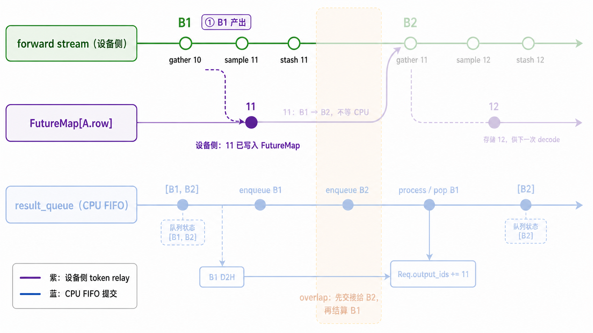

第二帧：scheduler 先把 B2 enqueue；B2 通过 `FutureMap` gather `11`。这一棒发生在
设备侧 FIFO 上，不依赖 `Req.output_ids`，而 B1 仍在 `result_queue` 等 CPU 结算。

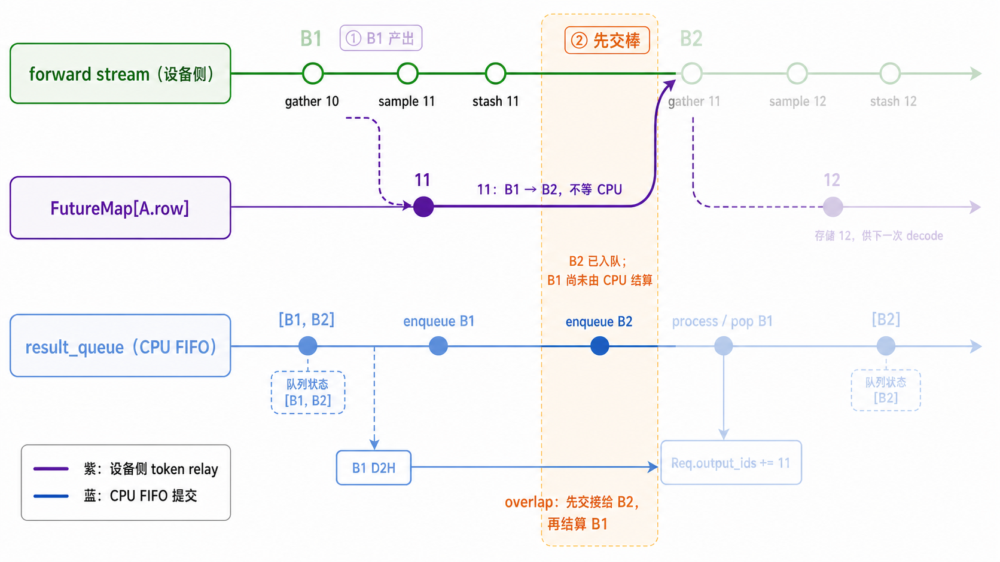

第三帧：CPU 等到 B1 的 D2H 完成后，才严格按 FIFO process/pop B1，把 `11`
追加到 `Req.output_ids`；B2 留在队列中，成为下一次要结算的队首。

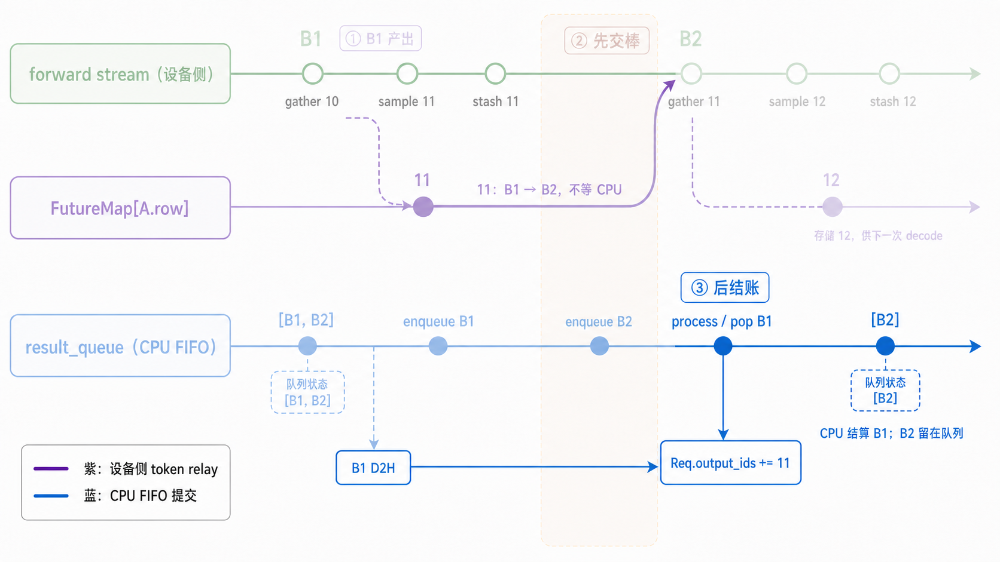

这就是两本账的换手差：`FutureMap` 的“交棒”服务于后继 forward，
`result_queue` 的“结账”服务于 CPU 有序确认；稳定 overlap 刻意让前者领先后者一拍。

| 对象 | 保存什么 | 何时写入 | 何时读取/清理 |
|---|---|---|---|
| `FutureMap` | 下一轮 decode 的 token 值与 valid bit | forward stream 的 sampling 后 | 后继 decode gather；无后继 relay 的非 `RUNNING` 结果、失败恢复或请求释放时 clear |
| `result_queue` | `ForwardBatch` 快照和 `FakeGenerationBatchResult` | 当前 batch enqueue 后 | CPU 严格 FIFO resolve/process/pop |
| `copy_done` | host buffer 是否可读的 event | copy stream 的 D2H 后 | 只在处理 queue 队首时 synchronize |

再次强调：`output_tokens_buf` 的下标是稳定的 `req_pool_idx`，不是会随 batch
重排的 batch position。详情见 [overlap 流水线](overlap-pipeline.md)。
教学版的 valid bit 和 `clear()` 是显式安全账，并在 gather 后立即失效；这对应
标准 SRT CI debug 的 consume-once 检查。标准生产路径不维护这个 bool，也不依赖
请求释放时 clear token buffer。

## 3. `MiniScheduleBatch` 与 `ForwardBatch`

[`MiniScheduleBatch`](../src/my_sglang/schedule_batch.py) 是 scheduler 内部的可变对象，负责分配、映射、提交、回滚和 batch 过滤；[`ForwardBatch`](../src/my_sglang/models.py) 是调用 runner 前生成的只读快照。

这两个对象也是两条学习主线的交接点：前者仍属于调度与资源管理，后者已经是模型执行输入。
如果已经能读懂下面的字段表，下一步可直接看
[从 ForwardBatch 到下一个 token](model-execution-bridge.md)，观察这些字段如何真正控制
embedding、RoPE、物理 K/V 读写、LM head 和 sampling。

| 阶段 | 可变状态 | 方法 |
|---|---|---|
| schedule | `reqs / forward_mode / extend_range` 已确定 | [`_get_new_prefill_batch()`](../src/my_sglang/scheduler.py) |
| allocate | 写 `req_to_token`，推进 `kv.kv_allocated_len` | [`prepare_for_extend()`](../src/my_sglang/schedule_batch.py)、[`prepare_for_decode()`](../src/my_sglang/schedule_batch.py) |
| snapshot | 生成 runner 所需 tuple | [`to_forward_batch()`](../src/my_sglang/schedule_batch.py) |
| success | `committed = allocated` | [`commit_allocated()`](../src/my_sglang/schedule_batch.py) |
| failure | 清掉 committed 后的映射，只释放不共享的 page | [`rollback_uncommitted()`](../src/my_sglang/schedule_batch.py) |
| next step | finished/chunked 过滤，或 merge 到 running | [`_settle_last_batch()`](../src/my_sglang/scheduler.py) |

`ForwardBatch` 里有两种不同的第 0 维，不能都理解成 request 维：

| 坐标轴 | 字段 | 长度 | 如何与 `reqs` 对应 |
|---|---|---:|---|
| request 维 | `req_pool_indices`、`seq_lens`、`extend_seq_lens`、`extend_range_starts`、`prefix_indices_by_req` | `batch_size = len(reqs)` | 下标 `i` 直接对应 `reqs[i]` |
| 展平 token 维 | `input_ids`、`out_cache_loc` | `sum(extend_seq_lens)` | 用每个请求的 `extend_seq_lens` 切片后再对应 `reqs[i]` |

例如 `reqs=(A,B)`，A 本轮 EXTEND 2 个 token，B 本轮 EXTEND 1 个 token。
先用 `extend_seq_lens=(2,1)` 算出每个请求在展平数组中的切片：

| `reqs` 下标 | 请求 | `extend_seq_lens[i]` | 展平切片 | `input_ids` 切片 | `out_cache_loc` 切片 |
|---:|---|---:|---|---|---|
| 0 | A | 2 | `[0:2]` | `(A0,A1)` | `(s0,s1)` |
| 1 | B | 1 | `[2:3]` | `(B0)` | `(s2)` |

展平后，每一个 token 位置都与一个 KV slot 一一对应：

| 展平 token 下标 | 属于哪个请求 | `input_ids` | `out_cache_loc` |
|---:|---|---|---|
| 0 | A | `A0` | `s0` |
| 1 | A | `A1` | `s1` |
| 2 | B | `B0` | `s2` |

下图把两张表画在一起：蓝色箭头表示 A 的切片 `[0:2]` 展开为 flat token 0、1；
橙色箭头表示 B 的切片 `[2:3]` 展开为 flat token 2。

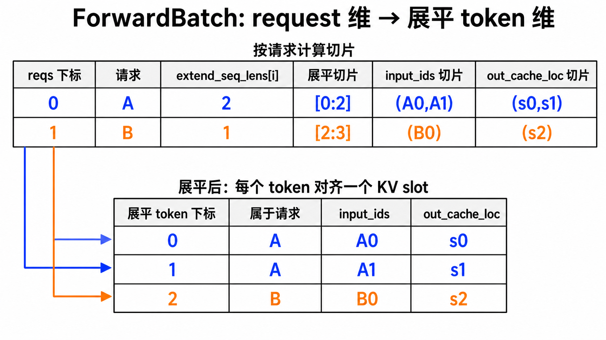

DECODE 时每个请求通常只有一个输入 token，即 `extend_seq_lens` 全为 1，此时两种
第 0 维长度碰巧相等；EXTEND 时通常不相等。

各字段在两种 forward mode 下的内容如下：

| 字段 | EXTEND | DECODE |
|---|---|---|
| `input_ids`（展平） | 未缓存 suffix / 当前 chunk | 每个请求最后一个逻辑 token |
| `out_cache_loc`（展平） | 本轮 suffix 的 slot | 每请求一个输入 slot |
| `seq_lens` | 当前 fill 终点 | 本轮输入写入后的长度 |
| `prefix_indices_by_req` | 每个请求的 radix 命中 slot，作为教学观察值 | 保留请求已有的 radix 命中观察值；runner 不依赖它 |
| `extend_seq_lens` | suffix 长度 | 全 1 |

下图把字段差异和坐标轴长度放在一起。EXTEND 示例中 request 维长度为 2、展平
token 维长度为 3；DECODE 示例中两者都是 2，只是因为每个请求恰好贡献一个 token。

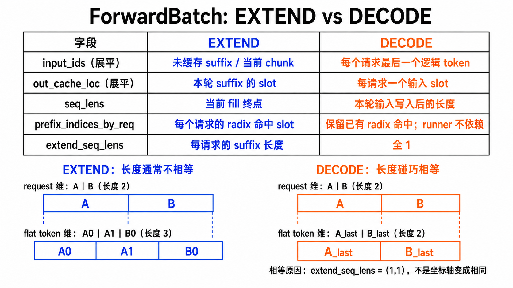

上一张图比较两种 mode；下面这张图专门解释三个字段如何配合：

```text
input_ids 中的每个 token
    -> 在同一展平下标读取 out_cache_loc
    -> 把该 token 的 K/V 写入对应物理 slot
    -> seq_lens 记录写入后该请求的总逻辑长度
```

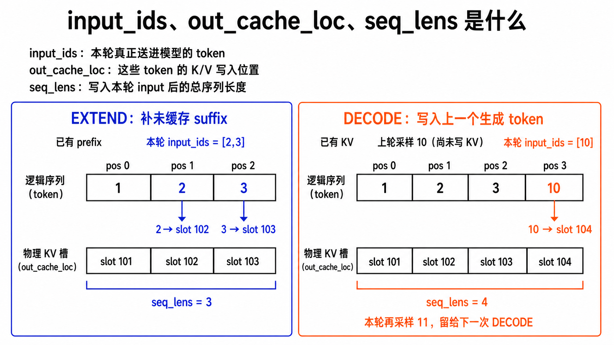

具体例子：A 的 prompt 是 `[1,2,3]`，radix cache 已命中 token `1 -> slot 101`；
B 的 prompt 是 `[7,8]`，已命中 `7 -> slot 107`。两者的 request row 分别是 3 和 7。

### EXTEND 例子

A 只需计算 suffix `[2,3]`，B 只需计算 suffix `[8]`：

| `ForwardBatch` 字段 | 值 | 怎么读 |
|---|---|---|
| `forward_mode` | `EXTEND` | 本轮补 prompt/cache 未覆盖的 suffix |
| `reqs` | `(A,B)` | request 维顺序 |
| `req_pool_indices` | `(3,7)` | A 使用 request row 3，B 使用 row 7 |
| `prefix_indices_by_req` | `((101,), (107,))` | A/B 各自已经复用的 prefix slot |
| `extend_seq_lens` | `(2,1)` | A 补 2 个 token，B 补 1 个 token |
| `extend_range_starts` | `(1,1)` | 两个请求都从各自逻辑位置 1 开始补 |
| `input_ids` | `(2,3,8)` | 按 A 的 `[2,3]`、B 的 `[8]` 展平 |
| `out_cache_loc` | `(102,103,108)` | token `2,3,8` 的 K/V 分别写入这些 slot |
| `seq_lens` | `(3,2)` | 本轮后 A/B 的总序列长度 |

假设这次 EXTEND 最后分别采样出首 token `10` 和 `20`，两个请求随后进入
`RUNNING`。

下图用蓝色追踪 A、橙色追踪 B，把 request 维字段、展平 token 维字段、KV slot
和采样结果连成一条完整路径。注意 cache 命中的 slot 101/107 已经存在，不属于
本轮新写入的 `out_cache_loc`。

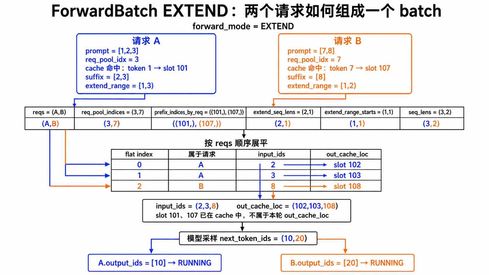

### DECODE 例子

下一轮每个请求只把自己的上一个输出 token 写入 KV：

| `ForwardBatch` 字段 | 值 | 怎么读 |
|---|---|---|
| `forward_mode` | `DECODE` | 本轮逐请求推进一个 token |
| `reqs` | `(A,B)` | request 维顺序不变 |
| `req_pool_indices` | `(3,7)` | 仍用稳定 request row，不用 batch 临时位置 |
| `prefix_indices_by_req` | `((101,), (107,))` | 仍可观察原 radix 命中；decode runner 不依赖它 |
| `extend_seq_lens` | `(1,1)` | 每个请求都只有一个 decode 输入 |
| `extend_range_starts` | `(3,2)` | A 从逻辑位置 3、B 从位置 2 继续 |
| `input_ids` | `(10,20)` | A/B 各自上一个生成 token；overlap 执行时从 FutureMap gather |
| `out_cache_loc` | `(104,109)` | token `10,20` 的 K/V 写入这些 slot |
| `seq_lens` | `(4,3)` | 写入 decode 输入后的总序列长度 |

这里 DECODE 的 `len(input_ids)=len(reqs)=2` 只是因为 `extend_seq_lens=(1,1)`；
它仍然使用展平 token 坐标，并没有换回 request 坐标。

### `MiniScheduleBatch` 全字段对照

标准 SRT 把 scheduler 工作单也叫 `ScheduleBatch`。教学版保留 `Mini` 前缀，避免
误认为它包含完整设备张量。以下覆盖教学 dataclass 的全部字段：

| my-sglang `MiniScheduleBatch` 字段 | 标准 SRT 当前字段/接口 | 字段作用 | 对齐关系 / 形状差异 |
|---|---|---|---|
| `reqs` | `ScheduleBatch.reqs` | 保存本轮参与 forward 的有序请求；这个顺序定义所有 request 维字段的下标 | 同名同职责 |
| `forward_mode` | `ScheduleBatch.forward_mode` | 决定本轮走 EXTEND 还是 DECODE 的准备、执行和结果处理分支 | 同名同职责 |
| `req_to_token_pool` | `ScheduleBatch.req_to_token_pool` | 查询和写入 `(request row, sequence position) -> KV slot` 映射 | 同名；教学版 NumPy 数组对应标准版设备 tensor pool |
| `token_to_kv_pool_allocator` | `ScheduleBatch.token_to_kv_pool_allocator` | 为本轮输入预留物理 KV slot/page；失败时负责回收未提交资源 | 同名同职责；教学版只管理整数 slot，不保存真实 K/V tensor |
| `tree_cache` | `ScheduleBatch.tree_cache` | 查找、锁定和缓存可复用的 prompt KV 前缀 | 同名同职责；教学版只实现基础 page-aware radix cache |
| `chunked_req` | `ScheduleBatch.chunked_req` | 标记当前 batch 中尚未完成 prompt 的唯一 chunked 请求，防止它提前进入 DECODE | 同名同职责；未分块时为 `None` |
| `input_ids` | `ScheduleBatch.prefill_input_ids_cpu` / `input_ids` | 保存本轮实际送入模型的 token；多个请求的 token 按 `reqs` 顺序展平 | 主字段与标准展平坐标对齐；教学版是 flat tuple，`input_ids_by_req` 只是切片视图 |
| `req_pool_indices` | `ScheduleBatch.req_pool_indices` | 为每个请求保存稳定 request row，用于访问 ReqToTokenPool 和 FutureMap | 同名 request 维字段；标准版另有 CPU mirror `req_pool_indices_cpu` |
| `out_cache_loc` | `ScheduleBatch.out_cache_loc` | 保存每个展平输入 token 的目标 KV slot；与 `input_ids` 逐 token 一一对应 | 同名同坐标系；教学版 flat NumPy array，标准版 flat device tensor |
| `seq_lens` | `ScheduleBatch.seq_lens` | 保存每个请求在本轮输入写入后的总序列长度，供 attention 边界和内存账本使用 | 同名 request 维字段 |
| `prefix_lens` | `ScheduleBatch.prefix_lens` | 保存每个请求本轮开始前已有 KV 的长度，也是新分配区间的起点 | 同名 request 维字段；基础路径数值含义一致 |
| `extend_lens` | `ScheduleBatch.extend_lens` / `Req.extend_range.length` | 保存每个请求本轮新增 token 数，并用于切分展平的 `input_ids/out_cache_loc` | 同名 request 维字段；也可由 `seq_lens - prefix_lens` 得到 |

### `ForwardBatch` 全字段对照

教学 `ForwardBatch` 是冻结快照；标准 SRT 的边界分成 scheduler 的
`ScheduleBatch.copy()` 和 model runner 的 `ForwardBatch`，所以不总是一字段对应一字段。

| my-sglang `ForwardBatch` 字段/属性 | 标准 SRT 当前字段/接口 | 字段作用 | 对齐关系 / 形状差异 |
|---|---|---|---|
| `forward_mode` | `ForwardBatch.forward_mode` | 告诉 runner 本次调用是 EXTEND 还是 DECODE，从而选择输入准备和模型执行分支 | 同名同职责 |
| `reqs` | `ScheduleBatch.reqs` | 冻结本轮请求顺序，供教学调度、trace 和结果归属使用 | 标准 `ForwardBatch` 不把完整 `Req` 作为核心模型输入；请求信息在初始化时被拆成 metadata |
| `input_ids` | `ForwardBatch.input_ids` | 保存 runner 快照中的展平模型输入；教学 overlap 的 DECODE 执行会按相同 request row 从 FutureMap gather 最新值 | 同名同坐标系；教学版 flat tuple，标准版 flat GPU tensor |
| `req_pool_indices` | `ForwardBatch.req_pool_indices` | 把 request 维下标映射到稳定 request row；用于 KV 映射访问和 overlap token relay | 同名 request 维字段 |
| `out_cache_loc` | `ForwardBatch.out_cache_loc` | 指定每个 `input_ids` token 的 K/V 写入哪个物理 slot | 同名展平 token 维字段；教学版 tuple，标准版 device tensor |
| `seq_lens` | `ForwardBatch.seq_lens` | 保存每个请求写入本轮输入后的总上下文长度，供 attention 读取历史 KV | 同名 request 维字段 |
| `prefix_indices_by_req` | `Req.prefix_indices` + `ReqToTokenPool.req_to_token` | 按请求保留 radix 命中的 prefix slot，方便教学观察 cache 复用 | 教学观察字段；标准 `ForwardBatch` 不携带同形状字段，prefix 已反映在 KV 映射和 metadata 中 |
| `extend_seq_lens` | `ForwardBatch.extend_seq_lens` | 保存每个请求本轮的 query/extend token 数，同时定义展平字段的切片边界 | 同名 request 维字段；DECODE 时通常全为 1 |
| `extend_range_starts` | `Req.extend_range.start` | 保存每个请求内部本轮 EXTEND 的绝对起点，用于还原 `[start,end)` 区间 | 教学观察字段；不要误映射到 batch-flat 坐标的 `ForwardBatch.extend_start_loc` |
| `contains_last_prefill_chunk` | `ScheduleBatch.contains_last_prefill_chunk` | 标记快照中的请求是否都已到最后一个 prefill chunk，便于观察何时可产生首 token | 同名但标准字段位于 `ScheduleBatch`；教学版把它带入冻结快照 |
| `batch_size`（计算属性） | `ForwardBatch.batch_size` | 返回 request 数，即 `len(reqs)` | 同名；教学版动态计算，标准版为核心字段 |
| `seq_lens_sum`（计算属性） | `ForwardBatch.seq_lens_sum` | 汇总 batch 中所有请求的序列长度，作为调度/执行统计值 | 同名；教学版由 `seq_lens` 动态求和 |
| `input_ids_by_req`（计算属性） | 无同名字段 | 根据 `extend_seq_lens` 把展平 `input_ids` 切回逐请求视图，便于教学和同步 Fake runner 使用 | 教学派生视图，不额外存储 token |
| `out_cache_loc_by_req`（计算属性） | 无同名字段 | 根据 `extend_seq_lens` 把展平 KV slot 切回逐请求视图 | 教学派生视图，不额外存储 slot |

最容易误读的两个字段：

```text
my extend_range_starts       = 每个请求内部的绝对 token 起点
SRT ForwardBatch.extend_start_loc = 各请求 EXTEND 数据在展平 input tensor 中的起点
```

它们都叫“start”，但坐标系不同，不能为了同名而强行合并。

### 其余核心对象字段速查

下面补齐从 scheduler 继续追到 pool、cache 和 overlap 时会遇到的字段。以下划线
开头的是内部实现账；它可能服务于一致性检查、所有权安全或可观测性，不一定只是
测试/trace 字段。

| my-sglang 对象与字段 | 标准 SRT 对应 | 字段作用 | 对齐关系 / 差异 |
|---|---|---|---|
| `ReqToTokenPool.size` | `ReqToTokenPool.size` | 定义最多能同时分配多少个 request row，也是 `free_slots` 的容量上限 | 同名；教学版 row 0 可分配，标准版额外保留 padding row 0 |
| `ReqToTokenPool.max_context_len` | 同名 | 定义二维映射每一行最多容纳多少个逻辑 token 位置 | 同名同职责 |
| `ReqToTokenPool.req_to_token` | 同名 | 保存 `(request row, sequence position) -> physical KV slot` 的核心二维映射 | 同名；教学版 NumPy 数组，标准版设备 tensor |
| `ReqToTokenPool.free_slots` | `ReqToTokenPool.free_slots` | 保存尚未分配的 request row；新请求 attach 时从这里领取一行，释放时归还 | 同名同职责；教学版使用 FIFO deque |
| `ReqToTokenPool._rid_to_idx` | 无 | 记录 `rid -> request row`，用于防止重复分配、释放定位和一致性检查 | 教学内部索引；标准主要由 `Req.req_pool_idx` 持有关系 |
| allocator `size` | allocator `size` | 定义 KV allocator 可管理的 token slot 总预算 | 同名同职责 |
| allocator `page_size` | 同名 | 定义一次分配、复用和释放的 page 粒度，并决定尾页是否还能继续写入 | 同名；非分页 allocator 的值为 1 |
| allocator `num_pages` | 由 `size/page_size` 得到 | 缓存总 page 数，供容量检查和 page 编号计算使用 | 教学版显式字段；标准可从容量和 page size 推导 |
| allocator `free_pages` | allocator `free_pages` | 保存当前可分配的 page/slot 编号，是新 KV 分配的直接来源 | 同名同职责；教学版 deque 对应标准 tensor |
| allocator `_allocated_pages` | 无独立同名集合 | 记录已经领取的 page，用于验证尾页复用合法性、防止重复释放和检查账本 | 教学内部断言账；标准主要从 free/release tensor 与 cache 所有权推导 |
| `MiniRadixCache.root_node` | `RadixCache.root_node` | radix tree 的哨兵入口；所有压缩 token 边都从它的 children 开始 | 同名同职责；根节点本身不代表真实 token |
| `MiniRadixCache.page_size` | `RadixCache.page_size` | 约束 prefix match、insert 和 eviction 只按完整 KV page 处理 | 同名同职责 |
| `MiniRadixCache.max_slots` | 无直接字段 | 限制教学 cache 最多托管多少个 slot，超过时触发 LRU 淘汰 | 教学容量开关；标准预算来自真实 allocator/cache 配置 |
| `TreeNode.key` | `TreeNode.key` (`RadixKey`) | 保存当前压缩边对应的连续 token 片段，用于前缀比较和分叉 | 同名；教学版 token tuple，标准版封装为 `RadixKey` |
| `TreeNode.value` | `TreeNode.value` | 保存与 `key` 等长、逐 token 对齐的物理 KV slot 片段 | 同名；教学版 slot tuple，标准版 tensor |
| `TreeNode.parent/children` | `TreeNode.parent/children` | 连接 radix tree 上下级；用于前缀遍历、节点拆分和沿祖先更新锁 | 同名树结构 |
| `TreeNode.last_access_time` | `TreeNode.last_access_time` | 记录节点最近命中/访问时间，供 LRU eviction 选择最旧叶子 | 同名同职责 |
| `TreeNode.lock_ref` | `TreeNode.lock_ref` | 统计活跃请求对该节点路径的保护引用；大于 0 时不能淘汰 | 同名同职责 |
| `FutureMap.output_tokens_buf` | `FutureMap.output_tokens_buf` | 按稳定 `req_pool_idx` 保存每个请求下一次 decode 的设备侧输入 token | 同名核心 relay buffer；每个 row 每个时刻只有一个标量 token |
| `FutureMap.valid` | CI 下 buffer 的 `-1` poison/invalidate | 标记某 row 是否有尚未消费的新 producer token；gather 后立即失效 | 教学显式 consume-once 安全账；标准生产路径无此 bool |
| `FakeGenerationBatchResult.next_token_ids` | `GenerationBatchResult.next_token_ids` | 保存 batch 中每个请求本轮采样出的 token；D2H 完成后变成 CPU 可读结果 | 同名；D2H 前后沿用同一字段，和标准 `copy_to_cpu()` 一致 |
| `FakeGenerationBatchResult.copy_done` | `GenerationBatchResult.copy_done` | 表示异步 D2H 是否完成；CPU 必须 synchronize 后才能读取 host token | 同名同职责的完成 event |
| `MiniScheduler.waiting_queue` | `Scheduler.waiting_queue` | 保存尚未获准 EXTEND 的新请求，以及 retract 后等待重建上下文的请求 | 同名同职责 |
| `MiniScheduler.running_batch` | `Scheduler.running_batch` | 保存已经完成 prompt、具备 DECODE 资格的活跃请求集合 | 同名同职责 |
| `MiniScheduler.chunked_req` | `Scheduler.chunked_req` | 保存唯一尚未完成 prompt 的 chunked 请求，使下一轮继续为它构造 EXTEND | 同名同职责；没有分块请求时为 `None` |
| `MiniScheduler.last_batch` | `Scheduler.last_batch` | 暂存上一轮 batch，下一次调度前过滤 finished/chunked 请求并合并回 running 集合 | 同名；教学版突出“下一轮 settle”过程 |
| `MiniScheduler.req_to_token_pool` | `Scheduler.req_to_token_pool` | scheduler 持有的共享 request-row 映射池，供所有 batch attach、prepare 和 release 使用 | 同名同职责 |
| `MiniScheduler.token_to_kv_pool_allocator` | `Scheduler.token_to_kv_pool_allocator` | scheduler 持有的共享 KV slot/page allocator，负责容量判断、分配、回收和 retract 降压 | 同名同职责 |
| `MiniScheduler.tree_cache` | `Scheduler.tree_cache` | scheduler 持有的共享 prefix cache，负责命中、pin、insert 和 eviction | 同名同职责；教学版未启用 radix cache 时为 `None` |
| `MiniScheduler.max_prefill_tokens` | `Scheduler.max_prefill_tokens` | 限制一次调度轮次最多接纳多少个 prefill/extend token | 同名预算上限 |
| `MiniScheduler.chunked_prefill_size` | `Scheduler.chunked_prefill_size` | 限制单个 chunked 请求一次 EXTEND 最多处理多少个 token | 同名 chunk 上限；未设置时 prompt 可一次完成 |
| `MiniScheduler.new_token_ratio` | `Scheduler.new_token_ratio_tracker.current` / `PrefillAdder.new_token_ratio` | 估算 running 请求未来 decode token 的预留比例，影响 prefill admission 是否安全 | 标准 scheduler 当前值放在 tracker，传给 adder 后职责同名 |
| `MiniOverlapScheduler.result_queue` | `Scheduler.result_queue` | FIFO 保存已 launch、尚未由 CPU process 的 batch/result；允许先提交 current 再处理 previous | 同名同职责；教学实现限制瞬时深度不超过 2 |
| `MiniOverlapScheduler.future_map` | `Scheduler.future_map` | 保存设备侧跨 batch token relay，使后继 decode 不必等待 CPU 更新 `output_ids` | 同名同职责；教学版只实现基础 generation token relay |
| `_inflight_refs` / `_deferred_finished` | 无一一对应字段 | 前者统计在途 job 对 Req 的 owner 数；后者保存已经 finished 但仍被在途 job 引用、暂不能释放的请求 | 教学内部资源安全账；标准由 result queue、batch/Req 状态和释放条件共同保证 |

准入结果不要按枚举名称硬对齐：

| my-sglang | 标准 SRT | 正确读法 |
|---|---|---|
| `AdmissionDecision` | 无同形状公开对象 | 教学版把一次 `PrefillAdder` 决策冻结下来便于测试 |
| `ADMIT/CHUNK/DEFER/ABORT` | `CONTINUE/NO_TOKEN/OTHER` + adder 状态 | 对齐“继续加入还是停止”的职责，不是枚举值映射 |
| `MemoryBudget.remaining_prefill_tokens` | `PrefillAdder.rem_input_tokens` | 本轮剩余 prefill token 预算 |
| `MemoryBudget.remaining_tokens` | `PrefillAdder.rem_total_tokens` 一类动态预算 | 职责对应；标准还叠加 page、cache 和运行请求 offset |

因此，阅读标准 SRT 时建议按下面的名字跳转：

```text
Req.extend_range
  -> ScheduleBatch.prepare_for_extend()
  -> ForwardBatch.extend_prefix_lens / extend_seq_lens
  -> ReqToTokenPool.req_to_token
  -> token_to_kv_pool_allocator
  -> FutureMap.output_tokens_buf（下一轮 decode）
```

## 4. `ReqToTokenPool`：固定二维 NumPy 映射

[`ReqToTokenPool`](../src/my_sglang/pools.py) 的 `req_to_token` 是形状 `(max_running_reqs, max_context_len)` 的 `np.int64` 数组，`-1` 表示未映射。

以 page size 2、请求行 0、prompt `[7,8,9]` 为例：

```text
page 0: slots [0,1]    reserved padding, never allocated
page 1: slots [2,3]    token 7,8
page 2: slots [4,5]    token 9, free tail

req_to_token[0, :3] = [2,3,4]
```

下图把二维数组直接展开：第 0 维选择稳定的 request row，第 1 维选择请求内逻辑
位置，单元格的值才是 physical KV slot。教学版的 request row 0 可以分配；它与
allocator 永不分配的 KV page 0 属于两个不同坐标空间。

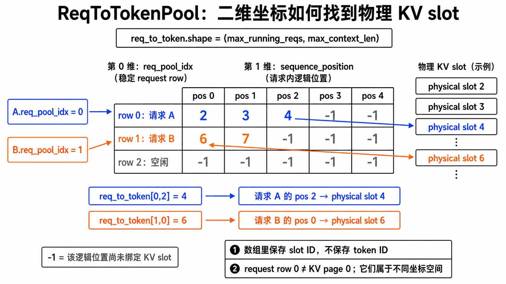

下一轮 decode 输入可直接复用 page 2 的尾 slot 5，不申请新 page。再下一轮才申请 page 3 的 slot 6。该行为由 [`test_paged_allocator_reuses_tail_before_allocating_next_page`](../tests/test_pools.py) 固定。

allocator 的 `available_size/allocated_size` 按完整 page 计数，因此已分配 page 的空尾 slot 不会出现在 `available_size`，只能通过 `last_loc` 被同一序列继续利用。

例如仍取 `page_size=2`，请求 A 的三个 token 已占用 slot `[2,3,4]`：

| page | slot | 当前归属 | 对 `available_size` 的影响 |
|---|---|---|---|
| page 1 | `[2,3]` | A 已写满 | 整页已分配，不可用 |
| page 2 | `[4,5]` | A 使用 `4`；`5` 是 A 的尾部空位 | page 2 已归 A，故 `5` **不**计入 available |
| page 3 | `[6,7]` | 完整空闲 | 贡献 `2` 个 available slot |

所以此刻 `available_size=2`，对应的是完整的 page 3，而不是“所有没写 token 的位置”。
若 A 下一轮 decode，scheduler 通过 `last_loc=4` 知道 A 的最后一个 slot 在 page 2，便可把
`5` 接着分给 A，且 `allocated_size` 仍不变；若是新请求 B，则必须从完整空闲的 page 3
拿 `[6,7]`，不能借 A 的 `5`。这是因为 allocator 按 page 分配/释放：让 A、B 共用 page 2，
将来释放 A 或 B 时就会错误地释放对方仍在使用的 page。

下图把 page 所有权和两个分支画在一起：A 可以根据 `last_loc=4` 续写自己的尾
slot 5；新请求 B 必须绕过 slot 5，从完整空闲的 page 3 领取 slot 6。

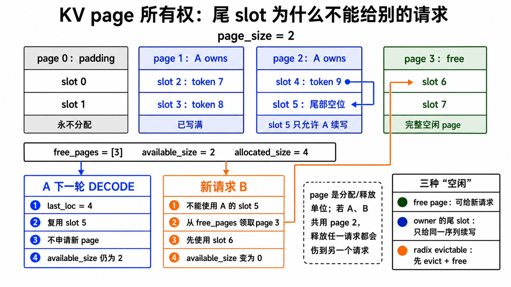

### 三种“空闲”不要混淆

| 名称 | 例子 | 能否立刻给新请求使用 |
|---|---|---|
| allocator free page | page 3 从未分配或已完整释放 | 能 |
| 已分配 page 的尾 slot | page 2 的 slot 5 | 只能给持有 page 2 的同一请求续写 |
| radix evictable slot | cache 中无 lock 的完整 page | 先 LRU evict，再由 scheduler free，随后才能使用 |

所以“`available_size=0`”不必然表示完全无法执行：同一请求可能还能复用尾页；
反过来，“cache 有 slot”也不表示 allocator 已经空闲，必须先走淘汰和释放的所有权转移。

<a id="radix-tree"></a>
## 5. KV page 与 radix cache 所有权

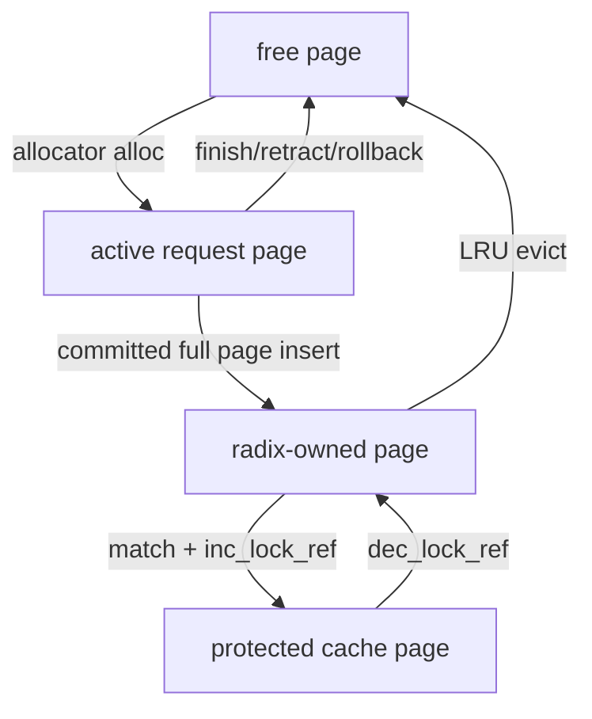

这张图里的“所有权”不是说 KV tensor 被复制或 page 有两个 allocator owner。一个 page
始终只有两种 allocator 状态：`free` 或 `allocated`。图中所谓“request-owned”与
“radix-owned”说的是：**谁决定这批已分配 slots 接下来能否释放、能否给其他请求复用**。
请求命中 cache 后，request row 仍会指向同一批 slot；它只是持有 cache 的 lock/ref，不能
自行释放它们。

| 图中状态 | allocator 看见的 page 状态 | 谁持有/管理 slot 的生命周期 | 请求 row 是否可指向它 | 能否立刻给新请求分配 | 下一步可能发生什么 |
|---|---|---|---|---|---|
| `free page` | `free` | 没有持有者 | 否 | 能，allocator 可分配整页 | 分配给某个请求；page 0 仅作 padding，不会走这条路径。 |
| `active request page` | `allocated` | 活跃请求的私有 KV；包括未满页尾部和尚未 committed 的预分配范围 | 是，`req_to_token[row, pos] -> slot` | 不能；即便尾 slot 尚未写入，也只能由同一请求续写 | scheduler commit 后变为 committed（同步路径在 runner 返回后，overlap 路径在 launch 成功后）；完整 page 可插入 cache，失败/rollback/retract/结束时可释放其非共享 page。 |
| `radix-owned page` | `allocated` | `MiniRadixCache` 保存 token-prefix → slot 的可复用映射，决定其是否可被 LRU 淘汰 | 可以；旧请求或新命中请求都可指向同一 slot | 不能；它仍是已分配 page | 新请求命中时加 lock/ref；没有 lock 时可被 LRU 淘汰。 |
| `protected cache page` | `allocated` | radix cache 仍是生命周期 owner；一个或多个活跃请求只是借用者 | 是 | 不能 | 所有借用请求结束/换节点后 `dec_lock_ref`；ref 归零后回到可驱逐 cache。 |
| `evictable cache page` | `allocated` | radix cache，且没有活跃请求借用 | 否（没有活跃请求），但未来请求仍可 prefix-hit | 不能直接分配；它只是“可回收预算” | LRU 选中后从 radix tree 删除，scheduler 再调用 allocator `free()`，才真正回到 `free page`。 |

这里的两个容易误解之处是：

- `protected` 不是一种新的物理 page，也不是 request 把 page 从 cache 手里拿走；它是
  `radix-owned page + lock_ref > 0`。
- `evictable_size()` 也不是 allocator 的 `available_size()`。前者必须先经过“从树中移除
  → 交给 allocator 释放”的所有权转移，才能成为后者。

### 例子：A 写入 prefix，B 命中并复用同一页

设 `page_size=2`。page 0 的 `[0,1]` 是 padding；可分配的 page 1、2、3 分别是
`[2,3]`、`[4,5]`、`[6,7]`。请求 A 先处理 token `[11,12,13]`：

| 时刻 | A 的逻辑位置 → slot | page 归属 / lock | 为什么 |
|---|---|---|---|
| A 刚完成 `[11,12]` | `0→2, 1→3` | page 1 已分配给 A | `[11,12]` 已 committed，且刚好占满一个 page。 |
| A 将完整 prefix 插入 radix tree 并 pin | 不变，仍是 `0→2, 1→3` | page 1：radix-owned + protected，`lock_ref=1` | tree 记录 `[11,12] → [2,3]`；A 的 row 继续引用这些 slot，但无权自行 free page 1。 |
| A 再处理 `13` | `2→4` | page 2：A 私有；page 1 状态不变 | page 2 的 slot 5 是尾部空位，只能由 A 续写，不能给别的请求使用。 |

此时请求 B 到达，prompt 是 `[11,12,99]`。它对 radix tree 的匹配和 suffix 分配如下：

| B 的阶段 | B 的逻辑位置 → slot | page 归属 / lock | 发生了什么 |
|---|---|---|---|
| `match_prefix([11,12,99])` | `0→2, 1→3` | page 1：radix-owned + protected，`lock_ref=2` | B 复用 A 已经算好的 KV；不会重新为 `[11,12]` 分配 page。 |
| 为 suffix `99` 分配 slot | `2→6` | page 3：B 私有 | B 不能使用 A 的 page 2 尾 slot 5，因此拿一个自己的整页；slot 7 留给 B 后续续写。 |

下图把写入、命中和释放放到同一条时间线上。A、B 的 request row 同时指向 page 1
的 slots `[2,3]`，表示复用同一份物理 KV，而不是复制；两者各自的非共享 suffix
仍分别留在 page 2 和 page 3。

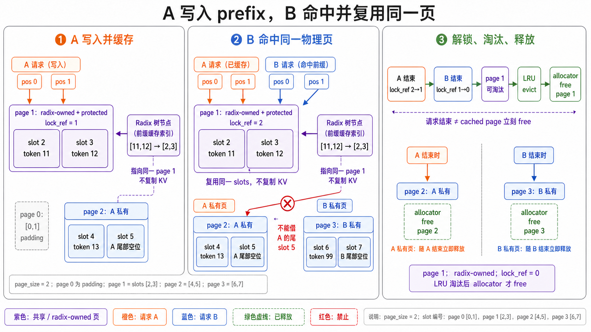

接下来按时间释放：

1. A 结束：A 对 page 1 的 lock 减一，`lock_ref=1`，因为 B 仍在使用，page 1 不能淘汰；
   A 私有的 page 2 没有 cache 保护，所以 allocator 可将其释放。
2. B 结束：B 的 lock 也减一，page 1 的 `lock_ref=0`，它变为 `evictable cache page`；B
   的不满 page 3 不是完整 cache prefix，直接释放。
3. 内存有压力时：LRU 从 radix tree 移除 `[11,12] → [2,3]`，并把这些 slots 交给
   allocator `free()`；只有这一步完成后，page 1 才重新出现在 `available_size()` 中。

因此，“请求结束”不等于“它曾经使用过的每个 page 都立刻 free”：完整、已缓存的 prefix
会留下来服务未来请求；私有 suffix、未满页尾部、rollback 的 overallocated 范围才随请求释放。

[`MiniRadixCache.match_prefix()`](../src/my_sglang/radix_cache.py) 和 [`insert()`](../src/my_sglang/radix_cache.py) 都向下截断到完整 page。锁住命中终点时，[`inc_lock_ref()`](../src/my_sglang/radix_cache.py) 会沿父链增加引用；释放时必须从同一终点 [`dec_lock_ref()`](../src/my_sglang/radix_cache.py)。

- `protected_size()`：活跃请求正在借用，不能淘汰。
- `evictable_size()`：没有 lock，可计入 admission 可回收预算。
<a id="radix-lru"></a>

- [`evict(n)`](../src/my_sglang/radix_cache.py)：按 LRU 删除未锁定叶子，返回 slot；真正 free page 的仍是 scheduler。

page 是释放粒度。`free_unshared_pages(candidate, protected)` 只释放与 `protected` 不共页的 candidate，防止 cache prefix 与请求尾部共享一页时误释放。

## 6. Admission 的 `MemoryBudget`

[`PrefillAdder`](../src/my_sglang/schedule_policy.py) 是每个 scheduling round 的 admission
规划器：它不立刻分配 KV，而是先以 `MemoryBudget` 判断 waiting/chunked 请求能否进入本轮
EXTEND。理解它时应先区分下面三类量；它们都以 token/slot 计数，但作用域和含义不同。

### 6.1 变量归纳：上限、请求进度与本轮账本

也可以把 admission 看成一次“先核对账户余额、再为每笔新工作付款”的预算审批：KV slot
是可支付的资产，running 请求未来 decode 是必须先留出的或有应付款，候选 prefill 是本轮
要批准的新支出。这个类比只解释预算关系，不表示真实的货币或可跨轮累积的额度。

| 分类 | 变量 | 作用域/来源 | 定义与作用 | 支付款项视角 |
|---|---|---|---|---|
| KV 物理容量 | `max_total_tokens` | scheduler 配置 | allocator 的 KV slot 总容量。 | KV 账户总授信；物理上限。 |
| 单请求生成上限 | `max_new_tokens` | `SamplingParams` | 单请求最多生成的 output token 数。 | 单笔最大未来付款承诺。 |
| prefill 吞吐上限 | `max_prefill_tokens` | scheduler 配置 | 本轮最多接纳的 EXTEND token 数。 | 本轮计算工作量支出上限。 |
| 预留比例 | `new_token_ratio` | scheduler 配置 | 正常请求的 decode 预留比例，默认 `0.5`。 | 未来承诺的准备金计提比例。 |
| 已生成量 | `len(output_ids)` | 请求运行状态 | 已确认的 output token 数。 | 已结算的输出。 |
| 剩余生成额度 | `remaining_new_tokens` | 请求运行状态 | `max_new_tokens - len(output_ids)`。 | 尚未结算的最大未来付款额。 |
| 本轮计算量 | `extend_len` | 候选的 `extend_range` | 本轮未命中 prefix 的 EXTEND token 数。 | 当前候选的计算工作量支出。 |
| KV 容量余额 | `remaining_tokens` | `MemoryBudget` | 扣除 decode 预留后可用的 KV 容量。 | 可审批新候选的 KV 可用余额。 |
| prefill 吞吐余额 | `remaining_prefill_tokens` | `MemoryBudget` | 本轮尚可接纳的 EXTEND token 数。 | 计算工作量账户的可用余额。 |

补充关系：`max_total_tokens` 同时是未设置 `max_prefill_tokens` 时的默认值，但两者分别约束
KV 物理容量和本轮计算量；`remaining_new_tokens` 是“还允许生成”的额度，并不表示本轮一定
生成；cache 命中的 prefix 不计入 `extend_len`；`remaining_prefill_tokens` 从
`max_prefill_tokens` 开始，每接纳一个候选即按其 `extend_len` 扣减。

`MemoryBudget` 中用于追溯 `remaining_tokens` 来源的字段如下：

| 字段 | 是否能直接花 | 含义 |
|---|---|---|
| `free_tokens` | 能 | allocator 当前直接可分配的 slot。 |
| `evictable_tokens` | 条件可用 | radix cache 中没有 lock 的 slot；真正分配前仍要先 evict 再 free。 |
| `protected_tokens` | 不能 | 被活跃请求锁住的 cache slot，只用于观察，不进入可花容量。 |
| `decode_reserved_tokens` | 已预留 | 所有 running 请求的未来 decode KV 预留之和；从可花容量中先扣除，避免新 prefill 挤掉 running decode。 |

### 6.2 本轮账本如何得到

每轮开始时，先从运行中的请求计算 decode 预留：

```text
reserve_ratio(req) = 1.0,  如果 req.retracted_stain
                   = new_token_ratio, 否则

decode_reserved_tokens
  = Σ page_round(ceil(req.remaining_new_tokens × reserve_ratio(req)))
```

曾发生 retract 的请求以 `1.0` 预留全部剩余输出，避免再次以乐观估算接纳。`page_round`
按 `page_size` 向上对齐，因为 allocator 按 page 分配。

```text
remaining_tokens
  = allocator.available_size
  + cache.evictable_size
  - decode_reserved_tokens

remaining_prefill_tokens = max_prefill_tokens
```

因此，`remaining_tokens` 与 `remaining_prefill_tokens` 是两道独立的 admission 门：

- `remaining_tokens` 是 **KV 容量门**。它把 allocator 直接空闲的 slot 和可以先淘汰
  cache 回收的 slot 都算作候选容量，再扣掉 running 请求未来 decode 的预留。
- `remaining_prefill_tokens` 是 **本轮吞吐门**。即使 KV 很充足，一轮也不能塞入超过
  `max_prefill_tokens` 的 prompt 计算量。

### 6.3 不同场景下各变量的作用

| 场景 | 关键量 | admission 的含义 |
|---|---|---|
| 系统刚启动，没有 running 请求 | `decode_reserved_tokens=0` | KV 余额只受 free/evictable 容量约束；接纳新请求后，仍要为它将来的输出预留。 |
| 有 running decode | `remaining_new_tokens`、`new_token_ratio`、`decode_reserved_tokens` | 先为旧请求的未来输出留下 KV，防止新 prefill 导致下一轮 decode 无法推进。比例越高越保守；比例越低 prefill 并发性更高，但更可能在后续出现 eviction、retract 或 abort。 |
| radix cache 命中 | `extend_len` | 命中的 prefix 不重算、不消耗本轮 prefill 吞吐；但 cache 的可淘汰部分只作为条件可用的 KV 容量。 |
| chunked prefill 的中间 chunk | `extend_len`、`remaining_prefill_tokens` | 只扣本 chunk 的计算量；尚未进入 decode，所以不为该新请求预留 output KV。 |
| 最后一个 chunk 或完整 prefill | `remaining_new_tokens`、候选 output reserve | 请求将进入 decode，候选成本要加上未来 output 的预留。 |

例如，running 请求还允许生成 5 个 token，`new_token_ratio=0.5`、`page_size=2` 时，
它贡献的预留为 `page_round(ceil(5 × 0.5)) = 4` 个 KV slot。这个比例不限制实际生成的
token 数；实际生成上限仍是 `max_new_tokens`。

### 6.4 Admission 如何使用账本

对每个候选请求，planner 先根据 radix cache 得到 `extend_range`，再按下面的近似成本检查：

```text
candidate_cost
  = page_round(extend_len)
  + page_round(ceil(remaining_new_tokens × reserve_ratio))  # 仅最后一个 chunk
  + 1 个 safety page
```

正常候选请求的 `reserve_ratio` 为 `new_token_ratio`；retract 后重试的请求为 `1.0`。
中间 chunk 尚不产生首个 output，故 output reserve 为 0。safety page 吸收 prompt/输出
交界处的 page 对齐需求，避免 admission 刚通过、下一步分配就无空间。

只有同时满足两道门才会接纳：

```text
candidate_cost <= remaining_tokens        # KV 容量门
extend_len     <= remaining_prefill_tokens # 本轮吞吐门
```

接纳后，账本只在本轮内更新：`remaining_tokens -= candidate_cost`，
`remaining_prefill_tokens -= extend_len`。若 KV 或吞吐余额不足，候选返回 `DEFER` 并留在
waiting 队列；FCFS 不允许后续请求越过首个 `DEFER`。若完整请求放不下但可切 chunk，则返回
`CHUNK`；物理上连最小执行块也无法容纳时才返回 `ABORT`。

### 6.5 手算一轮：A 完整准入，B 选择 CHUNK 或 DEFER

设 `page_size=2`、`new_token_ratio=0.5`、`max_prefill_tokens=6`。当前账面是：

```text
allocator free       = 12
cache evictable      = 4
running R 还可能生成 = 5 token
```

R 的 decode 预留先算 `ceil(5 × 0.5)=3`，再按 page size 2 向上对齐为 4。因此：

```text
decode_reserved_tokens      = 4
remaining_tokens            = 12 + 4 - 4 = 12
remaining_prefill_tokens    = 6
```
其中 `+4` 是必要时可从 cache 淘汰回收的容量.
`-4` 是扣掉 running 请求 R 的 decode_reserved_tokens

注意 `cache evictable=4` 只是“必要时可回收”，不是说这 4 个 slot 已经出现在
allocator free list；`protected_tokens` 则完全不进入这个加法。

候选 A 的 prompt 长度为 4，radix cache 已命中前 2 个 token，故本轮
`extend_range=[2,4)`、`extend=2`。设 A 的 `max_new_tokens=4`：

A 的 prompt 长度  = 4       # 输入 token，例如 [p0, p1, p2, p3]  

max_new_tokens   = 4       # 最多再生成 4 个 output token

这个例子中，cache 命中 prompt 前 2 个 token，所以本轮只需计算剩余 prompt：
而 max_new_tokens=4 用来估算 A 进入 decode 后可能需要的 output KV 预留：
output reserve = page_round(ceil(4 × new_token_ratio)) = 2

也就是说，A 的完整逻辑序列最多是 4 个 prompt token + 4 个生成 token；不是 max_new_tokens 等于 prompt 长度。

```text
extend cost    = page_round(2)             = 2
output reserve = page_round(ceil(4 × 0.5)) = 2
safety page                                  = 2
A total cost                                 = 6
即上面3个2相加
```

容量门检查 `6 <= 12`，吞吐门检查 `2 <= 6`，所以 A 返回 `ADMIT`。接纳后只改
这次规划的抽象余额：

```text
remaining_tokens         = 12 - 6 = 6
remaining_prefill_tokens =  6 - 2 = 4
```

接着看候选 B：prompt 长度为 4，没有 cache hit。

- 若配置 `chunked_prefill_size=2`，算法优先尝试非最后 chunk `[0,2)`。中间 chunk
  尚不产生首个 output，因此成本是 `extend 2 + output reserve 0 + safety 2 = 4`。
  容量门 `4 <= 6`、吞吐门 `2 <= 4` 都通过，返回 `CHUNK`；教学版随后停止继续选
  waiting 请求，因为一次只维护一个 `chunked_req`。
- 若未启用 chunk，B 必须尝试完整 `[0,4)`，成本是
  `extend 4 + output reserve 2 + safety 2 = 8`。它超过 KV 余额 6，返回 `DEFER`，
  本轮不扣预算并留在 waiting；FCFS 也不允许后面的请求越过 B。

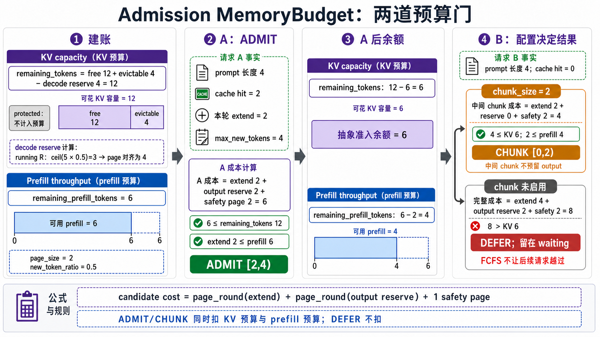

这个例子也解释了为什么“还有 6 个 KV slot”不等于“一定能接收长度 4 的 prompt”：
完整 prefill 还要同时支付 output reserve 和一页 safety margin，并通过独立的 prefill
吞吐预算。

每个候选成本还包含 page 向上取整、输出预留和一页对齐余量。返回值语义：

| 结果 | 状态变化 |
|---|---|
| `ADMIT` | 完整 suffix 进入本轮 EXTEND |
| `CHUNK` | 只推进一段，成为唯一 `chunked_req` |
| `DEFER` | 保留 waiting；FCFS 不越过首个预算失败请求 |
| `ABORT` | 物理上连最小执行块都无法容纳，结束并给出原因 |

空系统首请求或正在继续的 chunk 有“物理可容纳”兜底，避免因为未来输出预留永久 defer；真正的后续压力由 decode evict/retract/abort 闭环处理。

## 7. 一组可以随时断言的不变量

[`MiniScheduler.assert_consistent()`](../src/my_sglang/scheduler.py) 汇总检查：

```text
request rows: active + free == size，且集合不相交
KV pages: allocated + free == num_pages，page 0 不在两者中
每个活跃请求的已映射 slot 都属于 allocated page
committed 不领先 allocated
cache protected 不领先 committed
pipeline overlap 普通路径 launch 后 allocated == committed，CPU output/result 可滞后一批
result_queue 深度 <= 2，`_inflight_refs` 必须等于队列中按请求统计的引用数
逻辑 FINISHED 但尚有 in-flight owner 时允许暂缓 row/KV/runner 释放
```

建议调试时同时打印 [`memory_snapshot()`](../src/my_sglang/scheduler.py)：free、allocated、mapped、cache evictable/protected 和 decode reserve 能快速说明“内存去哪了”。
