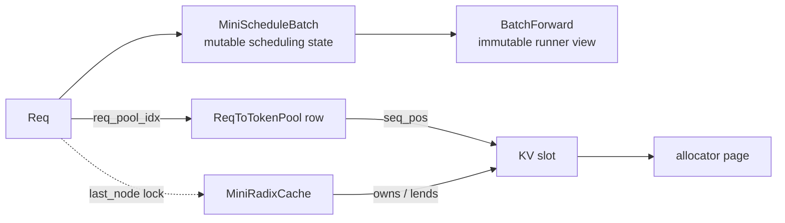
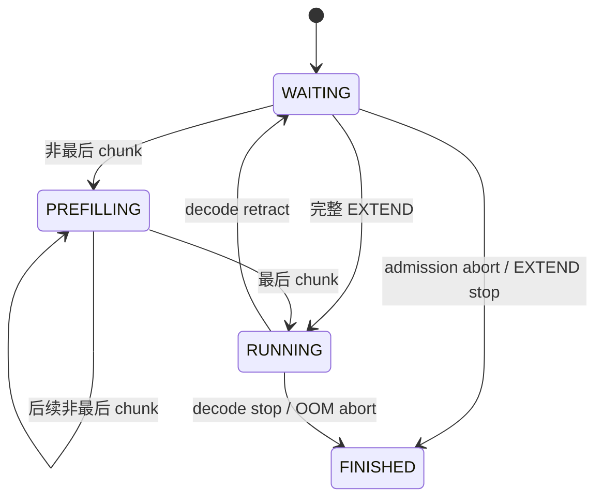
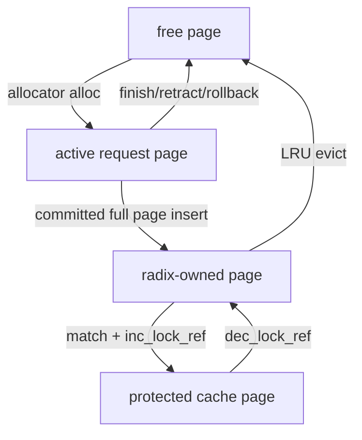

# 数据结构、所有权与不变量

先记住两条链：请求状态从 `Req` 进入可变 `MiniScheduleBatch`，最后变成给 runner 的不可变 `BatchForward`；KV 地址从 request row 和逻辑位置映射到 slot，再由 allocator 解释 slot 属于哪个 page。



<a id="req-state"></a>
## 1. `Req`：逻辑 token 与物理 KV 边界

[`Req`](../src/my_sglang/models.py#L34) 跨多个 step 存活。关键字段不是 slot 列表，而是长度边界和 `ReqToTokenPool` 行。

| 字段 | 含义 | 主要修改方法 |
|---|---|---|
| `origin_input_ids` / `output_ids` | 固定 prompt / 已向用户确认的生成 token | [`append_output()`](../src/my_sglang/models.py#L88) |
| `fill_ids` | prompt；retract 后为 prompt + 已生成 token，用来重建上下文 | [`reset_for_retract()`](../src/my_sglang/models.py#L119) |
| `req_pool_idx` | 二维映射矩阵中的活跃行 | [`_attach_new_request()`](../src/my_sglang/scheduler.py#L372) |
| `fill_len` / `extend_input_len` | 本轮计划计算到哪里 / 本轮 suffix 长度 | [`_get_new_prefill_batch()`](../src/my_sglang/scheduler.py#L199) |
| `kv_allocated_len` | 已有物理 slot；forward 可能尚未成功 | [`prepare_for_extend()`](../src/my_sglang/schedule_batch.py#L60) |
| `kv_committed_len` | forward 已成功的 KV 边界 | [`commit_allocated()`](../src/my_sglang/schedule_batch.py#L129) |
| `prefix_indices` / `last_node` | 从 radix cache 借用的 slot / 被锁住的终点节点 | [`_attach_new_request()`](../src/my_sglang/scheduler.py#L372) |
| `cache_protected_len` | 当前请求锁住的 cache prefix 长度 | [`_cache_unfinished_req()`](../src/my_sglang/scheduler.py#L394) |
| `retracted_stain` | 曾被 retract；再次 admission 时预留全部剩余输出 | [`_retract_req()`](../src/my_sglang/scheduler.py#L459) |

### 与标准 SGLang 的字段对照：先对齐职责，再看实现

标准 SGLang 的 [`Req`](../../python/sglang/srt/managers/schedule_batch.py#L666) 包含同一条
请求/KV/prefix 主链，但运行在真实设备 KV 和更完整的 serving 场景中。下表的“对应”
表示职责可对照，不表示两个对象可替换，也不表示生命周期完全一样。

| my-sglang | 标准 SGLang 当前字段/接口 | 对齐点 | 标准版额外边界 |
|---|---|---|---|
| `origin_input_ids` / `output_ids` | 同名字段 | 原始输入与追加生成 token | 还处理 unpadded 输入、多模态、session、采样与 logprob |
| `fill_ids` | `full_untruncated_fill_ids` + `get_fill_ids()` | 都表示本轮可用于 prefill 的逻辑序列 | 标准版可含 DLLM mask，并由刷新逻辑维护完整序列 |
| `fill_len` | `fill_len` | 本轮实际计划填充到的逻辑终点 | 标准版把完整序列与本轮可处理长度分开存储 |
| `req_pool_idx` | `req_pool_idx` | `(request row, sequence position) -> KV slot` 中的 row | 还可能同时管理 Mamba pool 和设备 tensor |
| `kv_allocated_len` / `kv_committed_len` | 同名字段 | 未确认分配与已成功 KV 的边界 | 标准版另有“已释放 committed / overallocated KV”的防重释放标记 |
| `prefix_indices` | `prefix_indices` | 复用 prefix 的 KV slot 序列 | 标准版为 device tensor，并可叠加 host cache 命中 |
| `extend_input_len` | `extend_input_len` | 本轮 EXTEND 仍须执行的 suffix token 数 | 标准版还会计算 logprob 的相对起点 |
| `last_node` / `cache_protected_len` | 同名字段 | radix 节点锁和受保护 prefix 长度 | 标准版还区分 host node、SWA 等 cache 路径 |
| `retracted_stain` | `retracted_stain` | 标记请求曾被 retract，需要按更保守条件重新 admission | 标准版还有 speculative decoding 等重试状态 |

```text
my-sglang:   保留 scheduler、slot、page、prefix 所有权这一条主干
标准 SGLang: 主干 + 真实 GPU KV + 多模态 + session + 分层 cache + 分布式/复杂调度
```

阅读标准实现时，可从 `Req` 的输入/KV 字段、prefix 字段和
[`get_fill_ids()`](../../python/sglang/srt/managers/schedule_batch.py#L1099) 三处回照本节；
不要把标准版新增字段倒灌进教学模型，除非要专门教学它解决的那个问题。

核心边界始终满足：

```text
0 <= cache_protected_len <= kv_committed_len <= kv_allocated_len
req_to_token[row, :kv_allocated_len] 都是 allocator 当前拥有的 slot
刚生成的最后一个 output token 尚未进入 KV
```

### 用一个请求把这些长度分开

假设 `prompt=[7,8]`，已经向调用方返回 `10`，并且下一轮 decode 已经
`allocate`、但 runner 尚未返回。此时不要把三个“长度”当成同一个概念：

| 观察项 | 值 | 为什么 |
|---|---:|---|
| `full_token_ids` | `[7,8,10]` | `10` 已经是确认输出 |
| `kv_committed_len` | `2` | 只有 prompt `[7,8]` 的 KV 已成功 forward |
| `kv_allocated_len` | `3` | 本轮正为输入 token `10` 预留 slot |
| `req_to_token[row, :3]` | `[2,3,4]` | slot `4` 可回滚，但还不能被 cache 当作稳定前缀 |

```text
逻辑 token:        [7, 8, 10]
KV 已确认:          [7, 8]
KV 已预留未确认:            [10]
                     ^ committed=2  ^ allocated=3
```

runner 成功 launch 后，`commit_allocated()` 把 committed 推到 3；runner 抛异常则
`rollback_uncommitted()` 清掉位置 2 的映射，并把 `allocated` 拉回 2。Fake CUDA
pipeline 也在 launch 成功后立即追平两者；“CPU result 尚未应用”由 result queue
和 `copy_done` 表达。

状态机：



### 状态机怎么读：状态描述请求，`EXTEND` / `DECODE` 描述这一步 batch

最容易混淆的是把 `PREFILLING` 当作“只要在做 prefill 就会处于这个状态”。
这里不是这样：`RequestStatus` 是 `Req` 跨多个 `step()` 的状态；
`ForwardMode` 是**本次** runner 调用的模式。一个没有分块的普通 prompt 会经历一次
`EXTEND`，但结果立刻进入 `RUNNING`，根本不会停在 `PREFILLING`。

| 请求状态 | 人话含义 | 这一步可被调度成什么 batch | 进入条件 | 离开条件 / 持有资源 |
|---|---|---|---|---|
| `WAITING` | 排队等 admission，或被撤回后等待重建 KV | `EXTEND` | 新建 `Req` 的初始状态；或者 decode 内存紧张时 `retract` | admission 成功：完整 prompt 直接到 `RUNNING`，非最后 chunk 到 `PREFILLING`；admission 判定物理上不可能时到 `FINISHED`。新请求通常还没有 row/KV；retract 后逻辑 token 保留，但 row、非缓存 KV 与 runner 状态已释放。 |
| `PREFILLING` | 长 prompt 正在分块填充，尚不能生成/返回第一个 token | 下一次仍是 `EXTEND`，且该请求是唯一 `chunked_req` | 一个 `EXTEND` chunk 成功，但它不是 `fill_ids` 的最后一段 | 后续 chunk 仍不完整则留在本状态；最后 chunk 成功后，拿到第一个 output，转 `RUNNING` 或（EOS/长度到达）`FINISHED`。已完成的 KV 会保留；只有完整 page 可提前放入并锁住 radix cache。 |
| `RUNNING` | prompt 已处理完，已拿到第一个 output；之后逐 token decode | `DECODE`（每个请求把“上一个 output token”写入 KV） | 完整 `EXTEND` 成功且尚未停止；或最后一个 chunk 成功 | decode 生成 EOS / 达到 `max_new_tokens`：`FINISHED`；decode 内存不足且被选为 victim：回到 `WAITING`，以后以 `prompt + 已生成 output` 重新 `EXTEND`。持有 active row、已确认 KV，以及可能锁住的 cache prefix。 |
| `FINISHED` | 终态，不再参与调度 | 不会进入 batch | EOS、长度上限、admission abort，或最后一个无法回收 KV 的请求 OOM abort | 无后继状态。正常完成时可缓存完整 page，但 active row、请求私有 KV、runner 状态都会释放。 |

可以把状态转换压缩成下面这四句话：

```text
短 prompt：       WAITING --一次完整 EXTEND--> RUNNING --DECODE...--> FINISHED
长 prompt：       WAITING --非最后 EXTEND--> PREFILLING --最后 EXTEND--> RUNNING
decode 内存紧张： RUNNING --retract（释放物理状态）--> WAITING --重新 EXTEND--> RUNNING
不能执行：        WAITING / RUNNING -------------------------------> FINISHED
```

`PREFILLING` 的关键不是“正在算 prompt”，而是“**prompt 还没有全部写进 KV，因而还不能产生第一个可返回 token**”。
`RUNNING` 的关键不是“GPU 此刻正在运行”，而是“请求已经具备逐 token decode 的资格”。

### 例子 A：短请求为什么跳过 `PREFILLING`

设 `prompt=[7,8]`，`max_new_tokens=2`，runner 在 prefill 后返回 `10`，下一轮 decode 返回
`11`。未启用 chunked prefill，所以 prompt 一次就能处理完。

| `step()` | 调度的 `BatchForward.mode` 与输入 | runner 新返回的 token | 请求状态（本 step 结束时） | `output_ids` | KV 边界（本 step 成功后） |
|---:|---|---:|---|---|---|
| 0（刚入队） | 无 | 无 | `WAITING` | `[]` | `allocated=committed=0` |
| 1 | `EXTEND`，输入 `[7,8]` | `10` | `RUNNING` | `[10]` | `[7,8]` 已写入 KV，`allocated=committed=2` |
| 2 | `DECODE`，输入 `[10]` | `11` | `FINISHED`（达到 2 个输出） | `[10,11]` | `[10]` 也已写入 KV，随后 active KV/row 被释放 |

注意 decode 的因果关系：第 2 步的输入是已在第 1 步返回的 `10`，模型在它的 KV
上下文上预测出 `11`。因此结束时最后生成的 `11` 已交给用户，却还没有被写入 KV；如果
它没有结束，请求会保持 `RUNNING`，下一次 `DECODE` 才把 `11` 作为输入写入 KV。

### 例子 B：长请求如何停在 `PREFILLING`

设 `prompt=[1,2,3,4,5]`，`chunked_prefill_size=2`，`max_new_tokens=2`。runner 对前两段
只完成 KV；只有最后一段才返回第一个 output。

| `step()` | `EXTEND` 输入 / 是否最后 chunk | `fill_len=kv_committed_len` | 状态（本 step 结束时） | `output_ids` | 为什么 |
|---:|---|---:|---|---|---|
| 1 | `[1,2]` / 否 | 2 | `PREFILLING` | `[]` | prompt 还有 `[3,4,5]`，返回的值不能作为用户 output。 |
| 2 | `[3,4]` / 否 | 4 | `PREFILLING` | `[]` | prompt 还剩 `[5]`；若 page size 为 2，此时 `[1,2,3,4]` 可作为完整 cache page。 |
| 3 | `[5]` / 是 | 5 | `RUNNING` | `[10]` | prompt 已完整处理，prefill 的返回值 `10` 才是第一个生成 token。 |
| 4 | `DECODE` 输入 `[10]` | 6 | `FINISHED` | `[10,11]` | decode 返回第二个 token `11`，达到长度上限。 |

如果第 3 步后发生 decode OOM，调度器可能选择这个请求做 `retract`：状态回到
`WAITING`，但 `output_ids=[10]` 不会丢。下次 admission 时，`fill_ids` 已变为
`[1,2,3,4,5,10]`，它会重新走 `EXTEND` 来恢复上下文，而不是重新生成 `10`。

<a id="batch-forward"></a>
## 2. `MiniScheduleBatch` 与 `BatchForward`

[`MiniScheduleBatch`](../src/my_sglang/schedule_batch.py#L16) 是 scheduler 内部的可变对象，负责分配、映射、提交、回滚和 batch 过滤；[`BatchForward`](../src/my_sglang/models.py#L134) 是调用 runner 前生成的只读快照。

| 阶段 | 可变状态 | 方法 |
|---|---|---|
| schedule | `reqs / forward_mode / fill_len` 已确定 | [`_get_new_prefill_batch()`](../src/my_sglang/scheduler.py#L199) |
| allocate | 写 `req_to_token`，推进 `kv_allocated_len` | [`prepare_for_extend()`](../src/my_sglang/schedule_batch.py#L60)、[`prepare_for_decode()`](../src/my_sglang/schedule_batch.py#L99) |
| snapshot | 生成 runner 所需 tuple | [`to_forward_batch()`](../src/my_sglang/schedule_batch.py#L167) |
| success | `committed = allocated` | [`commit_allocated()`](../src/my_sglang/schedule_batch.py#L129) |
| failure | 清掉 committed 后的映射，只释放不共享的 page | [`rollback_uncommitted()`](../src/my_sglang/schedule_batch.py#L136) |
| next step | finished/chunked 过滤，或 merge 到 running | [`_settle_last_batch()`](../src/my_sglang/scheduler.py#L183) |

`BatchForward` 的第 0 维总与 `reqs` 对齐：

| 字段 | EXTEND | DECODE |
|---|---|---|
| `input_ids_by_req` | 未缓存 suffix / 当前 chunk | 每个请求最后一个逻辑 token |
| `out_cache_locs` | 本轮 suffix 的 slot | 每请求一个输入 slot |
| `seq_lens` | 当前 fill 终点 | 本轮输入写入后的长度 |
| `prefix_slot_ids_by_req` | radix 命中 | 通常为空 |
| `extend_lens` | suffix 长度 | 全 1 |

## 3. `ReqToTokenPool`：固定二维 NumPy 映射

[`ReqToTokenPool`](../src/my_sglang/pools.py#L12) 的 `req_to_token` 是形状 `(max_running_reqs, max_context_len)` 的 `np.int64` 数组，`-1` 表示未映射。

以 page size 2、请求行 0、prompt `[7,8,9]` 为例：

```text
page 0: slots [0,1]    reserved padding, never allocated
page 1: slots [2,3]    token 7,8
page 2: slots [4,5]    token 9, free tail

req_to_token[0, :3] = [2,3,4]
```

下一轮 decode 输入可直接复用 page 2 的尾 slot 5，不申请新 page。再下一轮才申请 page 3 的 slot 6。该行为由 [`test_paged_allocator_reuses_tail_before_allocating_next_page`](../tests/test_pools.py#L41) 固定。

allocator 的 `available_size/allocated_size` 按完整 page 计数，因此已分配 page 的空尾 slot 不会出现在 `available_size`，只能通过 `last_loc` 被同一序列继续利用。

例如仍取 `page_size=2`，请求 A 的三个 token 已占用 slot `[2,3,4]`：

| page | slot | 当前归属 | 对 `available_size` 的影响 |
|---|---|---|---|
| page 1 | `[2,3]` | A 已写满 | 整页已分配，不可用 |
| page 2 | `[4,5]` | A 使用 `4`；`5` 是 A 的尾部空位 | page 2 已归 A，故 `5` **不**计入 available |
| page 3 | `[6,7]` | 完整空闲 | 贡献 `2` 个 available slot |

所以此刻 `available_size=2`，对应的是完整的 page 3，而不是“所有没写 token 的位置”。
若 A 下一轮 decode，scheduler 通过 `last_loc=4` 知道 A 的最后一个 slot 在 page 2，便可把
`5` 接着分给 A，且 `allocated_size` 仍不变；若是新请求 B，则必须从完整空闲的 page 3
拿 `[6,7]`，不能借 A 的 `5`。这是因为 allocator 按 page 分配/释放：让 A、B 共用 page 2，
将来释放 A 或 B 时就会错误地释放对方仍在使用的 page。

### 三种“空闲”不要混淆

| 名称 | 例子 | 能否立刻给新请求使用 |
|---|---|---|
| allocator free page | page 3 从未分配或已完整释放 | 能 |
| 已分配 page 的尾 slot | page 2 的 slot 5 | 只能给持有 page 2 的同一请求续写 |
| radix evictable slot | cache 中无 lock 的完整 page | 先 LRU evict，再由 scheduler free，随后才能使用 |

所以“`available_size=0`”不必然表示完全无法执行：同一请求可能还能复用尾页；
反过来，“cache 有 slot”也不表示 allocator 已经空闲，必须先走淘汰和释放的所有权转移。

<a id="radix-tree"></a>
## 4. KV page 与 radix cache 所有权



这张图里的“所有权”不是说 KV tensor 被复制或 page 有两个 allocator owner。一个 page
始终只有两种 allocator 状态：`free` 或 `allocated`。图中所谓“request-owned”与
“radix-owned”说的是：**谁决定这批已分配 slots 接下来能否释放、能否给其他请求复用**。
请求命中 cache 后，request row 仍会指向同一批 slot；它只是持有 cache 的 lock/ref，不能
自行释放它们。

| 图中状态 | allocator 看见的 page 状态 | 谁持有/管理 slot 的生命周期 | 请求 row 是否可指向它 | 能否立刻给新请求分配 | 下一步可能发生什么 |
|---|---|---|---|---|---|
| `free page` | `free` | 没有持有者 | 否 | 能，allocator 可分配整页 | 分配给某个请求；page 0 仅作 padding，不会走这条路径。 |
| `active request page` | `allocated` | 活跃请求的私有 KV；包括未满页尾部和尚未 committed 的预分配范围 | 是，`req_to_token[row, pos] -> slot` | 不能；即便尾 slot 尚未写入，也只能由同一请求续写 | forward 成功后变为 committed；完整 page 可插入 cache，失败/rollback/retract/结束时可释放其非共享 page。 |
| `radix-owned page` | `allocated` | `MiniRadixCache` 保存 token-prefix → slot 的可复用映射，决定其是否可被 LRU 淘汰 | 可以；旧请求或新命中请求都可指向同一 slot | 不能；它仍是已分配 page | 新请求命中时加 lock/ref；没有 lock 时可被 LRU 淘汰。 |
| `protected cache page` | `allocated` | radix cache 仍是生命周期 owner；一个或多个活跃请求只是借用者 | 是 | 不能 | 所有借用请求结束/换节点后 `dec_lock_ref`；ref 归零后回到可驱逐 cache。 |
| `evictable cache page` | `allocated` | radix cache，且没有活跃请求借用 | 否（没有活跃请求），但未来请求仍可 prefix-hit | 不能直接分配；它只是“可回收预算” | LRU 选中后从 radix tree 删除，scheduler 再调用 allocator `free()`，才真正回到 `free page`。 |

这里的两个容易误解之处是：

- `protected` 不是一种新的物理 page，也不是 request 把 page 从 cache 手里拿走；它是
  `radix-owned page + ref_count > 0`。
- `evictable_size()` 也不是 allocator 的 `available_size()`。前者必须先经过“从树中移除
  → 交给 allocator 释放”的所有权转移，才能成为后者。

### 例子：A 写入 prefix，B 命中并复用同一页

设 `page_size=2`。page 0 的 `[0,1]` 是 padding；可分配的 page 1、2、3 分别是
`[2,3]`、`[4,5]`、`[6,7]`。请求 A 先处理 token `[11,12,13]`：

| 时刻 | A 的逻辑位置 → slot | page 归属 / lock | 为什么 |
|---|---|---|---|
| A 刚完成 `[11,12]` | `0→2, 1→3` | page 1 已分配给 A | `[11,12]` 已 committed，且刚好占满一个 page。 |
| A 将完整 prefix 插入 radix tree 并 pin | 不变，仍是 `0→2, 1→3` | page 1：radix-owned + protected，`ref_count=1` | tree 记录 `[11,12] → [2,3]`；A 的 row 继续引用这些 slot，但无权自行 free page 1。 |
| A 再处理 `13` | `2→4` | page 2：A 私有；page 1 状态不变 | page 2 的 slot 5 是尾部空位，只能由 A 续写，不能给别的请求使用。 |

此时请求 B 到达，prompt 是 `[11,12,99]`。它对 radix tree 的匹配和 suffix 分配如下：

| B 的阶段 | B 的逻辑位置 → slot | page 归属 / lock | 发生了什么 |
|---|---|---|---|
| `match_prefix([11,12,99])` | `0→2, 1→3` | page 1：radix-owned + protected，`ref_count=2` | B 复用 A 已经算好的 KV；不会重新为 `[11,12]` 分配 page。 |
| 为 suffix `99` 分配 slot | `2→6` | page 3：B 私有 | B 不能使用 A 的 page 2 尾 slot 5，因此拿一个自己的整页；slot 7 留给 B 后续续写。 |

接下来按时间释放：

1. A 结束：A 对 page 1 的 lock 减一，`ref_count=1`，因为 B 仍在使用，page 1 不能淘汰；
   A 私有的 page 2 没有 cache 保护，所以 allocator 可将其释放。
2. B 结束：B 的 lock 也减一，page 1 的 `ref_count=0`，它变为 `evictable cache page`；B
   的不满 page 3 不是完整 cache prefix，直接释放。
3. 内存有压力时：LRU 从 radix tree 移除 `[11,12] → [2,3]`，并把这些 slots 交给
   allocator `free()`；只有这一步完成后，page 1 才重新出现在 `available_size()` 中。

因此，“请求结束”不等于“它曾经使用过的每个 page 都立刻 free”：完整、已缓存的 prefix
会留下来服务未来请求；私有 suffix、未满页尾部、rollback 的 overallocated 范围才随请求释放。

[`MiniRadixCache.match_prefix()`](../src/my_sglang/radix_cache.py#L112) 和 [`insert()`](../src/my_sglang/radix_cache.py#L216) 都向下截断到完整 page。锁住命中终点时，[`inc_lock_ref()`](../src/my_sglang/radix_cache.py#L199) 会沿父链增加引用；释放时必须从同一终点 [`dec_lock_ref()`](../src/my_sglang/radix_cache.py#L207)。

- `protected_size()`：活跃请求正在借用，不能淘汰。
- `evictable_size()`：没有 lock，可计入 admission 可回收预算。
<a id="radix-lru"></a>

- [`evict(n)`](../src/my_sglang/radix_cache.py#L365)：按 LRU 删除未锁定叶子，返回 slot；真正 free page 的仍是 scheduler。

page 是释放粒度。`free_unshared_pages(candidate, protected)` 只释放与 `protected` 不共页的 candidate，防止 cache prefix 与请求尾部共享一页时误释放。

## 5. Admission 的 `MemoryBudget`

[`PrefillAdder`](../src/my_sglang/schedule_policy.py#L38) 在一次规划中维护：

```text
remaining_tokens
  = allocator.available_size
  + cache.evictable_size
  - running decode reserve

remaining_prefill_tokens = max_prefill_tokens
```

每个候选成本还包含 page 向上取整、输出预留和一页对齐余量。返回值语义：

| 结果 | 状态变化 |
|---|---|
| `ADMIT` | 完整 suffix 进入本轮 EXTEND |
| `CHUNK` | 只推进一段，成为唯一 `chunked_req` |
| `DEFER` | 保留 waiting；FCFS 不越过首个预算失败请求 |
| `ABORT` | 物理上连最小执行块都无法容纳，结束并给出原因 |

空系统首请求或正在继续的 chunk 有“物理可容纳”兜底，避免因为未来输出预留永久 defer；真正的后续压力由 decode evict/retract/abort 闭环处理。

## 6. 一组可以随时断言的不变量

[`MiniScheduler.assert_consistent()`](../src/my_sglang/scheduler.py#L546) 汇总检查：

```text
request rows: active + free == capacity，且集合不相交
KV pages: allocated + free == num_pages，page 0 不在两者中
每个活跃请求的已映射 slot 都属于 allocated page
committed 不领先 allocated
cache protected 不领先 committed
pipeline overlap 普通路径 launch 后 allocated == committed，CPU output/result 可滞后一批
result_queue 深度 <= 2，inflight_ref_count 必须等于队列中对请求的引用数
逻辑 FINISHED 但尚有 in-flight owner 时允许暂缓 row/KV/runner 释放
```

建议调试时同时打印 [`memory_snapshot()`](../src/my_sglang/scheduler.py#L532)：free、allocated、mapped、cache evictable/protected 和 decode reserve 能快速说明“内存去哪了”。
