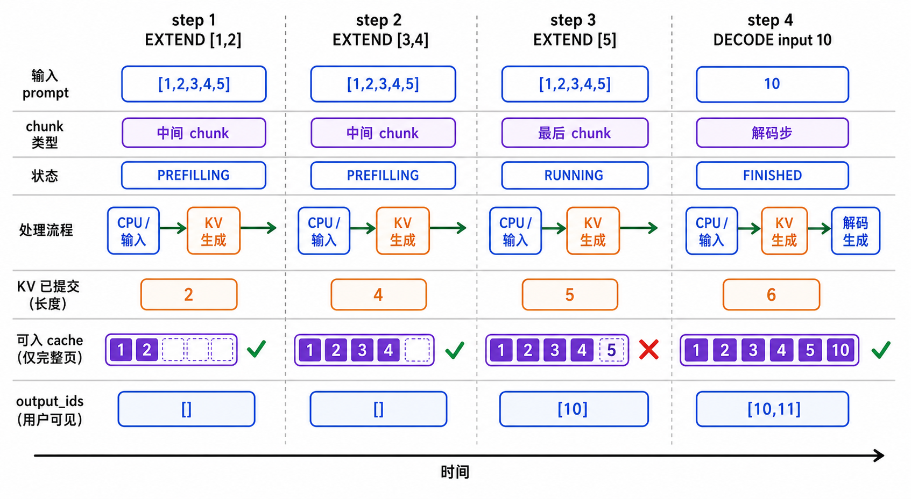
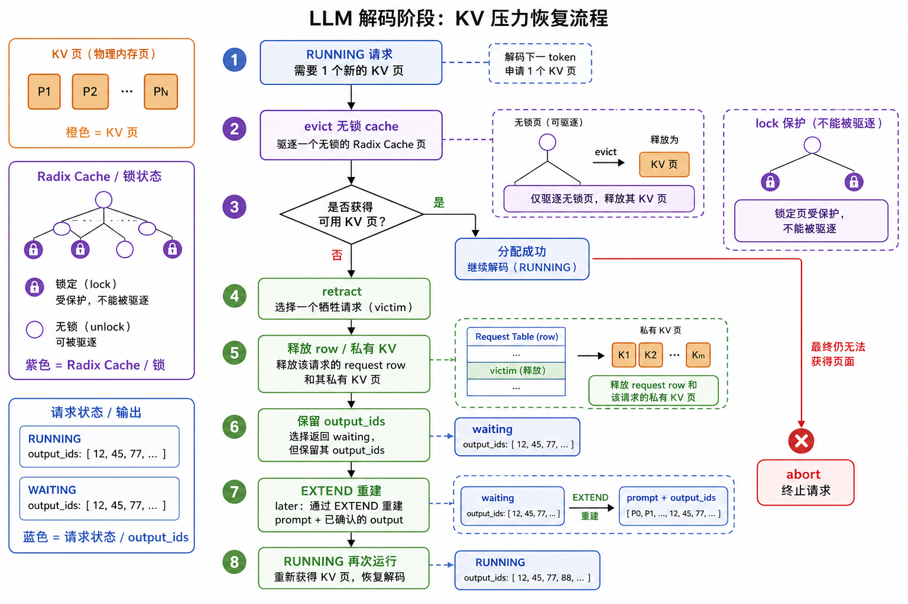

# 动态流程：请求遇到分支时还剩下什么

前两篇讲正常路径；这一页把最容易混淆的分支放回同一条生命周期。读图时每次只问四件事：
请求状态在哪里、CPU 是否已确认 token、row/KV 是否还被持有、cache 是否还能复用。

## 1. 同步和 overlap 的差别只在交接时刻


同步路径是“运行 B0 -> CPU 处理 B0 -> 创建 B1”；overlap 的稳定 decode 则是“先 enqueue
B1 -> 再等待并处理 B0”。两者都不让同一 forward stream 上的 B0、B1 并行执行：B1
只是已经排队，仍会在 B0 的 gather/sample/stash 后执行。关于 event 的精确依赖看
[overlap pipeline](overlap-pipeline.md)。

## 2. 长 prompt：只有最后一个 chunk 才有首 token

设 prompt 为 `[1,2,3,4,5]`，`chunked_prefill_size=2`。中间 chunk 的 runner 返回值
只是教学 runner 的计算结果，不能写入 `output_ids`；真正可见的首个 token 只来自最后
一段。



| step | 本轮输入 | 结束状态 | `output_ids` | 已提交 KV | 可做什么 |
|---:|---|---|---|---:|---|
| 1 | EXTEND `[1,2]` | `PREFILLING` | `[]` | 2 | 完整 page 可进入 radix cache；下一轮仍是 EXTEND |
| 2 | EXTEND `[3,4]` | `PREFILLING` | `[]` | 4 | 继续锁住请求 row，不允许 decode |
| 3 | EXTEND `[5]` | `RUNNING` | `[10]` | 5 | prompt 完成，首 token 才能对外确认 |
| 4 | DECODE 输入 `10` | `RUNNING` 或 `FINISHED` | `[10,11]` | 6 | `10` 写入 KV，`11` 是新输出 |

教学版一次最多保留一个 `chunked_req`，因此它天然形成 prefill barrier；标准 SRT 如何
把多个中间 chunk 放进流水线，见 [连续 prefill overlap](prefill-overlap.md)。

## 3. radix 命中：逻辑 prefix 借用，不是复制

新请求 B 的 prompt 若与已缓存请求 A 共享完整 page 前缀，B 会得到同一组 slot id；它只为
未命中的 suffix 分配新 page。`lock_ref` 保护这段 prefix，直到最后一个借用者释放。

```text
A 已缓存 [1,2,3,4] 的完整 page
B 请求 [1,2,3,4,9]

B 的 EXTEND range = [4,5)
B 不重算 [1,2,3,4]；只为 token 9 分配私有 page
```

cache 命中不消耗本轮的 `extend_len`，但它不是“免费且永远存在”：无 lock 的 cache page
可被 LRU 淘汰，正在被运行请求使用的 page 不能。slot/page/lock 的图示和释放顺序在
[数据结构的 radix 一节](data-structures.md#5-kv-page-与-radix-cache-所有权)。

## 4. decode 内存压力：evict、retract、abort 是三个层级

当 decode 需要新 page，scheduler 绝不直接覆盖正在使用的 slot。它按以下优先级降压：



| 阶段 | 释放什么 | 请求可否继续 | 为什么安全 |
|---|---|---|---|
| eviction | 无锁的 cache leaf page | 所有 active 请求继续 | 这些 page 没有活跃借用者 |
| retract | 一个 `RUNNING` 请求的 row、私有 KV、runner 状态 | 该请求以后从 waiting 重建 | 已确认 `output_ids` 不变，cache prefix 可复用 |
| abort | 最后一个仍无法分配 decode page 的请求 | 不继续 | 物理容量已经无法满足最小推进 |

被 retract 的请求会带上 `retracted_stain`。之后 admission 会按剩余生成量做更保守的
decode 预留，降低反复 retract 的概率；这不改变 `max_new_tokens`，只是改变新 prefill
能占用多少预算。

## 5. 失败恢复：确认过的 token 永远优先

同步 runner 在 commit 前失败时，未提交 slot 会回滚，等待请求仍留在队列。overlap 中的
失败更宽：所有 in-flight result 都要 discard，清 FutureMap、释放 affected 请求的物理
状态；但已严格 FIFO process 的 `output_ids` 保留。未完成请求 `reset_for_retract()` 后
重新进入 waiting，以“prompt + 已确认输出”做下一次 EXTEND。

```text
已 CPU process 的 token  -> 保留，绝不重采样
已 enqueue 但未 process  -> 不对用户可见，可丢弃
已预留但未可靠提交的 KV -> 回滚或随请求物理状态释放
```

这就是为什么文档一直把 `FutureMap`、result queue、`output_ids` 分开称为不同账本：
它们在失败时有不同的可信边界。

## 6. 看不懂时的最小验证

| 结论 | 测试 |
|---|---|
| 中间 chunk 没有早期 output | `test_chunked_prefill_has_one_unfinished_request_and_no_early_output` |
| 完整 page 才能作为未完成 chunk 的 cache | `test_unfinished_chunk_is_cached_only_at_complete_page_boundaries` |
| radix 复用与 LRU 淘汰 | `test_radix_cache_reuses_prefix_and_evicts_lru_for_new_admission` |
| retract 后重新 admission | `test_decode_pressure_retracts_one_request_then_readmits_it` |
| overlap 失败不会泄露 relay/row/KV | `test_pipeline_failure_clears_relay_and_requeues_unconfirmed_request` |
