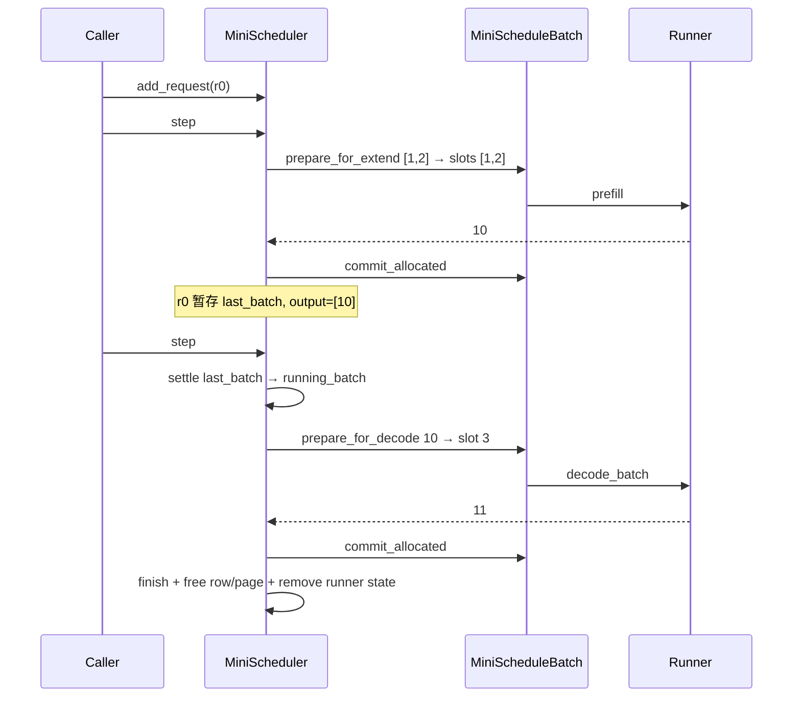
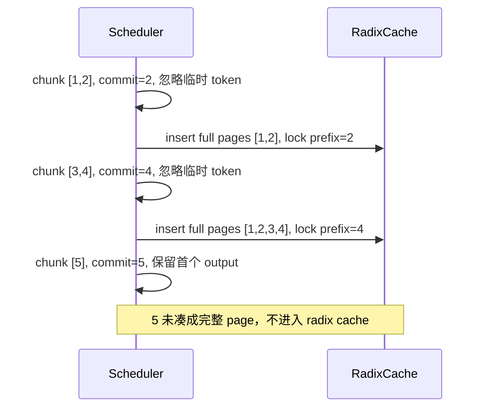
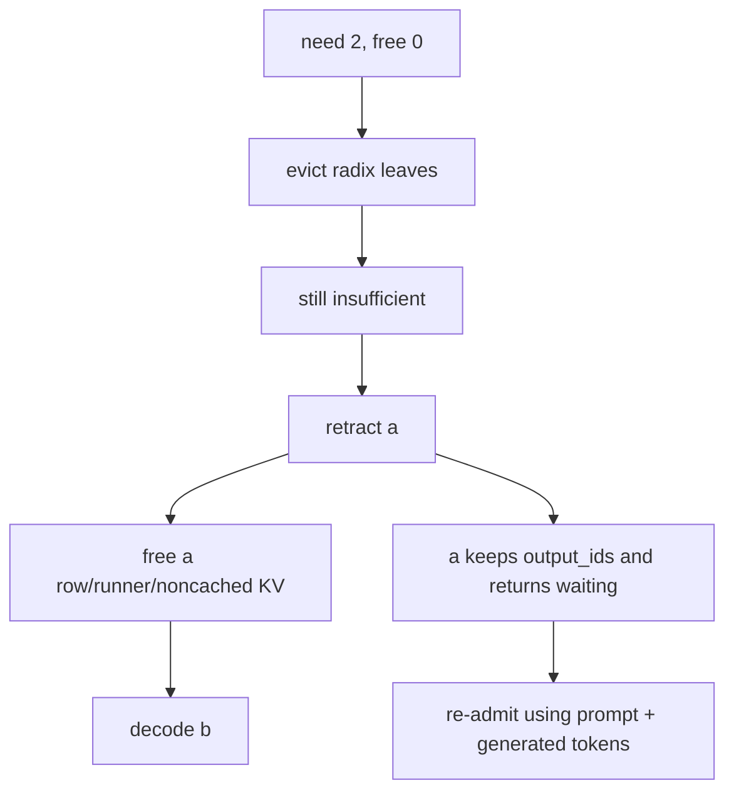
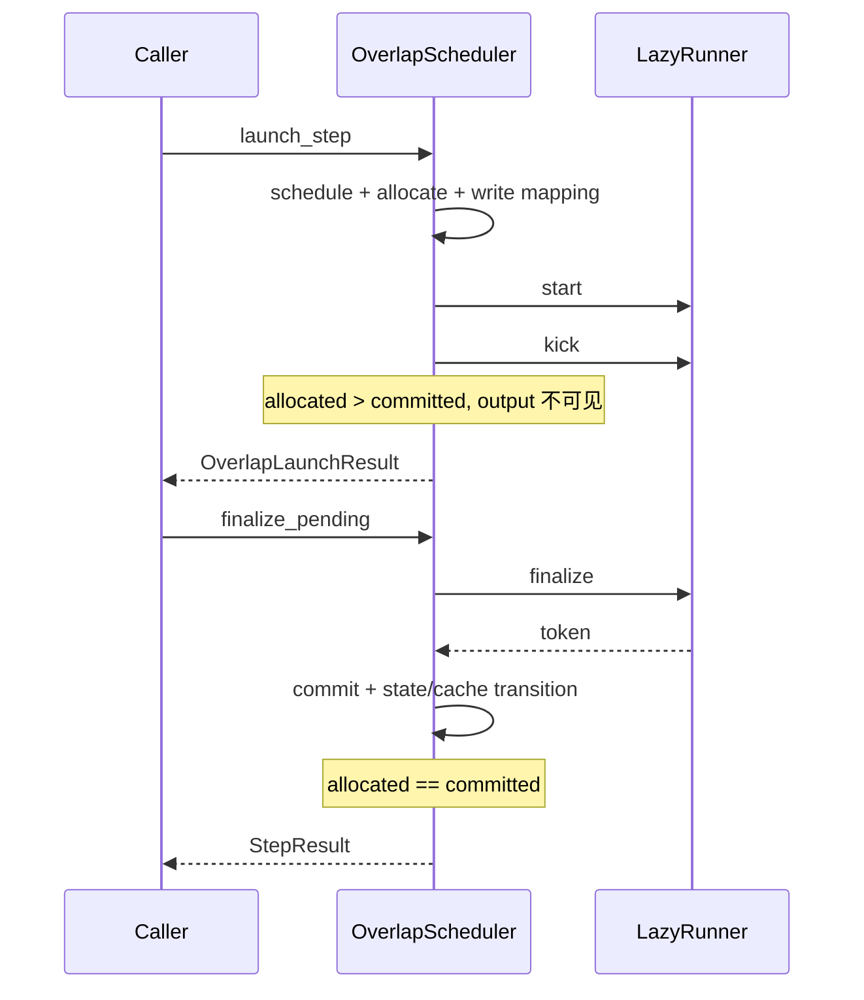
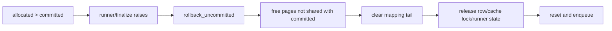

# 动态流程：跟着 token、row、slot 和 page 走

下面所有例子都能在 CPU FakeRunner 测试中复现。slot 0（分页时整个 page 0）保留作 padding，因此第一个可用 slot 从 1 或 `page_size` 开始。

## 1. 普通请求：EXTEND → DECODE → finish

对应 [`test_single_request_extend_then_decode_lifecycle`](../tests/test_scheduler.py#L76)：

```text
prompt [1,2], max_new_tokens=2
prefill -> 10
decode  -> 11
```



第一轮关键快照：

```text
req_pool_idx=0
req_to_token[0, :2]=[1,2]
kv_allocated_len=kv_committed_len=2
full_token_ids=[1,2,10]
```

`10` 刚生成，还没进 KV。第二轮 [`prepare_for_decode()`](../src/my_sglang/schedule_batch.py#L99) 才在逻辑位置 2 写 slot 3。runner 返回 `11` 后达到长度上限，[`_finish_req()`](../src/my_sglang/scheduler.py#L416) 释放资源。

### 为什么新 prefill 会推迟旧 decode

[`step()`](../src/my_sglang/scheduler.py#L117) 每轮只选一个 batch：[`_get_new_prefill_batch()`](../src/my_sglang/scheduler.py#L199) 成功就运行 EXTEND，只有它返回 `None` 才调用 [`_get_decode_batch()`](../src/my_sglang/scheduler.py#L276)。因此 waiting 请求会让已有 running 请求的 decode 延后一轮，见 [`test_prefill_priority_means_one_forward_batch_per_step`](../tests/test_scheduler.py#L102)。

## 2. Prefill admission：为什么只接纳第一个请求

配置：

```text
max_prefill_tokens=2
waiting: a=[1,2], b=[3,4]
new_token_ratio=0
```

[`PrefillAdder.add_requests()`](../src/my_sglang/schedule_policy.py#L80) 按 FCFS 处理：


`a` 进入 EXTEND，`b` 原位留在 waiting。cache prefix 会直接减少 suffix 成本，未锁定 cache 又能作为 evictable 容量；对应直接测试为 [`test_prefill_adder_stops_at_first_fcfs_budget_defer`](../tests/test_schedule_policy.py#L18) 和 [`test_cached_prefix_reduces_extend_length_and_cache_is_evictable_budget`](../tests/test_schedule_policy.py#L40)。

## 3. 分页 allocator：先吃尾页，再申请新页

配置 `page_size=2, max_total_tokens=6`：

```text
page 0 [0,1] reserved
extend length 3:
  allocate page 1 [2,3] + page 2 [4,5]
  map slots [2,3,4], slot 5 是已拥有的尾页空间

decode #1:
  last_loc=4 → reuse slot 5，不申请页

decode #2:
  last_loc=5 → allocate page 3，使用 slot 6
```

[`alloc_extend()`](../src/my_sglang/pools.py#L149) 先用 [`_tail_slots()`](../src/my_sglang/pools.py#L139)，再批量申请剩余页。`allocated_size` 在 prompt 后已经是 4，不会因为第一次 decode 增长；完整断言见 [`test_paged_allocator_reuses_tail_before_allocating_next_page`](../tests/test_pools.py#L41)。

<a id="chunked-flow"></a>
<a id="radix-flow"></a>
## 4. Chunked prefill 与未完成请求入树

配置 `prompt=[1,2,3,4,5]`、`chunk_size=2`、`page_size=2`：



[`_cache_unfinished_req()`](../src/my_sglang/scheduler.py#L394) 在每个非末 chunk forward 成功后运行：

1. `cacheable_len = floor(committed/page_size)*page_size`。
2. `insert(token prefix, old slots)`；释放 insert 自带的 LRU evicted slots。
3. 释放旧 lock，再 `match_prefix(..., pin=True)` 获取树中的规范 slot。
4. 重写二维映射，并只 free 不共享的重复页。

这使长 prompt 中已完成的整页可以被其他请求复用，也能被 admission 看见为 protected cache。末 chunk 完成并 finish 后只有 `[1,2,3,4]` 留在 cache，测试见 [`test_unfinished_chunk_is_cached_only_at_complete_page_boundaries`](../tests/test_scheduler.py#L228)。

## 5. Decode 压力：evict → retract → abort

例子中容量 4，两个请求各有 1-token prompt、已经生成 2 个 token：

```text
a mappings: 2 slots
b mappings: 2 slots
free pages: 0
next decode needs: 2 pages
```



[`_get_decode_batch()`](../src/my_sglang/scheduler.py#L276) 的 victim key 优先 retract 生成进度少、上下文长的请求。`a.output_ids` 不丢失，但 [`_retract_req()`](../src/my_sglang/scheduler.py#L459) 清理物理状态并设置 `retracted_stain=True`；再次 EXTEND 时 `fill_ids` 是 prompt + 已生成 token。完整过程见 [`test_decode_pressure_retracts_one_request_then_readmits_it`](../tests/test_scheduler.py#L304)。

如果只剩最后一个请求且 cache 也无法提供一页，scheduler 不会无限循环，而是 `finish_reason="abort"`，见 [`test_last_decode_request_is_aborted_when_no_page_can_be_reclaimed`](../tests/test_scheduler.py#L334)。

<a id="overlap-flow"></a>
## 6. Overlap：allocated 与 committed 的可观察窗口

[`MiniOverlapScheduler.launch_step()`](../src/my_sglang/overlap_scheduler.py#L83) 与 [`finalize_pending()`](../src/my_sglang/overlap_scheduler.py#L151) 是显式两阶段 API：



pending 存在时不能再次 launch，避免两个未确认 batch 同时改写同一请求。同步 [`step()`](../src/my_sglang/overlap_scheduler.py#L201) 只是 launch+finalize 便利封装。

组合测试 [`test_overlap_supports_chunked_radix_and_paged_allocator_together`](../tests/test_overlap_scheduler.py#L132) 同时打开 `page_size=2`、chunk、radix 和 overlap，逐轮验证：

```text
launch chunk 1: allocated=2, committed=0
finalize:       allocated=2, committed=2, cache protected=2
launch chunk 2: allocated=4, committed=2
finalize:       allocated=4, committed=4, cache protected=4
launch chunk 3: allocated=5, committed=4
finalize:       first output visible
launch decode:  allocated=6, committed=5（复用尾页）
```

## 7. Forward 异常如何回滚

allocation 发生在 runner 之前，所以失败时不能只把请求放回 waiting。normal 与 overlap 共用 [`_rollback_failed_batch()`](../src/my_sglang/scheduler.py#L478)：



[`test_runner_failure_rolls_back_allocated_but_uncommitted_kv`](../tests/test_scheduler.py#L178) 断言异常后 row 数、allocated page 数和请求长度边界全部回到 0。

<a id="runner-boundary"></a>
## Runner 边界

同步 scheduler 只依赖 [`RunnerProtocol`](../src/my_sglang/runner.py#L8) 的 `prefill / extend / decode_batch / remove_request`；overlap 增加 [`LazyRunnerProtocol`](../src/my_sglang/runner.py#L33) 的三段式方法。FakeRunner 固定返回 token，让上述例子只检验 scheduler；[`SglangMlxRunnerAdapter`](../src/my_sglang/runner.py#L78) 再把同一契约转发到真实 MLX runner。
