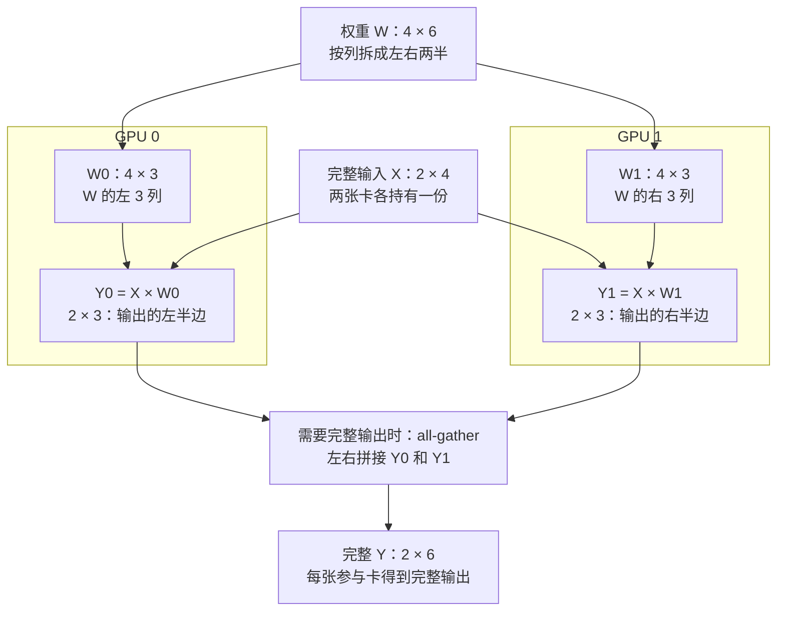
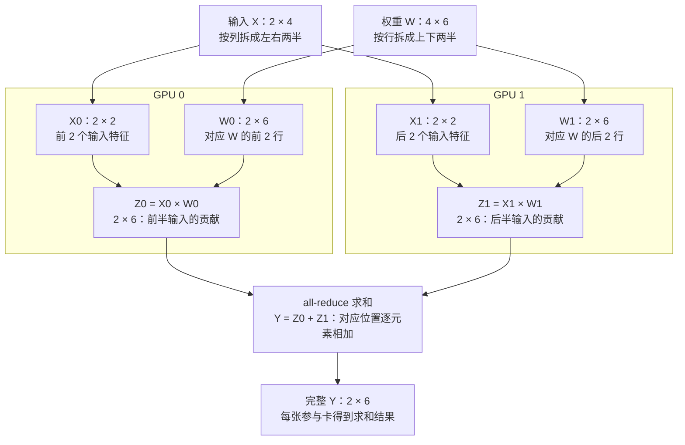
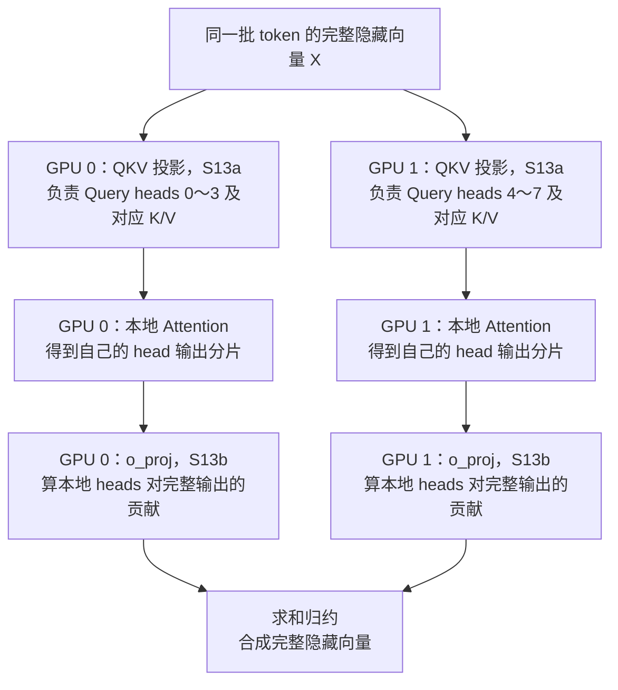
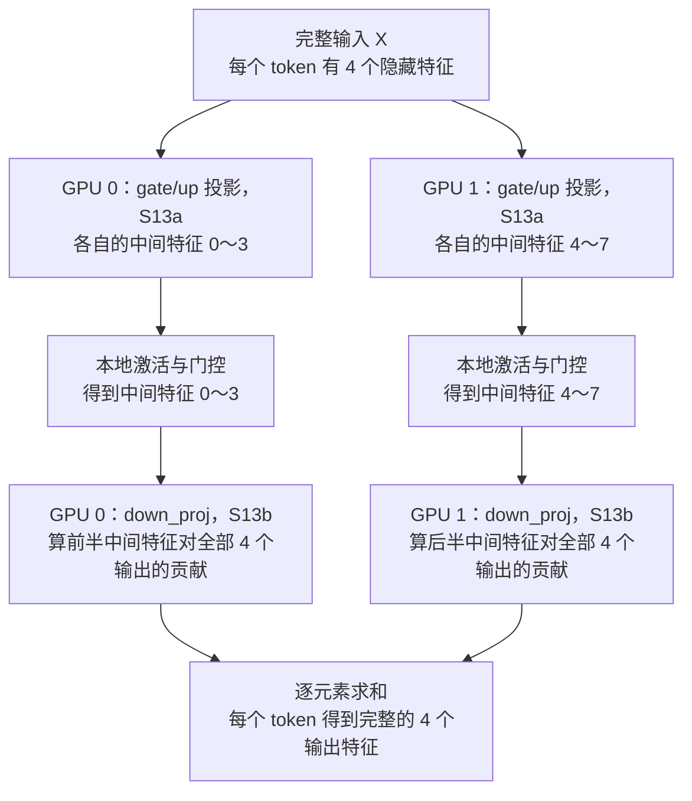

# 标准 SRT（六）：基础 TP 多卡与性能观察

[返回全局地图](README.md) · 上一页：[CUDA Graph](10-cuda-graph.md)

下一页：[贯穿实验：一条请求的状态账本](12-request-ledger.md)。

**TP 让多张 GPU 合作计算同一个模型调用；收益取决于计算减少量与通信成本。** 本篇放大总图 04，限定普通 dense Transformer 的基础 TP，暂不深入 PP、DP、MoE 或其他并行方式。源码基准为 `a5a7123f54`。

## 图 S12：一个服务的多个 TP rank

```text
同一组请求 / 一次模型调用
            |
       协调请求与执行
            |
       +----+----------------+
       v                     v
   rank 0 / GPU 0         rank 1 / GPU 1
   权重的一部分           权重的另一部分
       |                     |
       +---- 必要通信合并 -----+
                   |
              继续下一层
```

TP rank 不是两个互不相关的模型服务。相关 rank 必须对协作计算和通信形成一致安排，不能各自随意选择不同请求继续执行。

普通路径由相应入口 rank 接请求，再向参与 rank 广播；配置不同会改变通信组。证据：[RequestReceiver](../../../python/sglang/srt/managers/scheduler_components/request_receiver.py)、[Scheduler 进程启动](../../../python/sglang/srt/entrypoints/engine.py)。

## 图 S13：把矩阵乘拆成两种基本方式

下面采用源码注释的数学记法 `Y = XW`；不要直接将其列/行名称套到 PyTorch 权重底层存储维度。

用同一个例子对比：`X` 是 **2 行 × 4 列**，`W` 是 **4 行 × 6 列**，结果 `Y=XW` 是 **2 行 × 6 列**。2 行可以理解为两个 token，4 列是输入特征，6 列是输出特征；不是两条请求各分给一张卡。

### S13a：按输出维拆——各卡算不同的输出列，最后左右拼接

把 `W` 的 6 列分成左右两半。**两张卡都使用完整的 X，但使用不同的权重列。**



`Y0` 和 `Y1` 是**不同的输出列**，不能相加。如果下一层能直接使用分片，可以保留左右两半，暂不 all-gather。

### S13b：按输入维拆——各卡算同一输出的一部分贡献，最后逐元素相加

把 `X` 的 4 列分成左右两半，同时把 `W` 的 4 行分成上下两半，保持输入特征对应。**每张卡只算一半输入特征的贡献，但都得到 6 列的局部结果。**



例如某个输出位置本来要算 `x1×w1 + x2×w2 + x3×w3 + x4×w4`：GPU 0 算前两项，GPU 1 算后两项，加起来才是完整值。`Z0` 和 `Z1` 的形状都已经是 `2 × 6`，**相加后仍为 `2 × 6`，不是拼成 12 列**。

| 通信 | 大白话 | 对应上图 |
|---|---|---|
| all-gather | 把各卡不同片段收齐 | 合成完整输出特征 |
| all-reduce | 合并各卡对同一结果的部分贡献，并让参与者得到结果 | 将局部乘积相加 |

真实路径可推迟、融合或采用其他等价通信安排，不是每个线性层都无条件调用一次 all-gather 加一次 all-reduce。证据：[`ColumnParallelLinear`](../../../python/sglang/srt/layers/linear.py)、同文件 `RowParallelLinear`。

### S13 的实际应用：Attention 与 MLP 都把两种拆法配起来用

**按输出维拆，让各卡产生不同特征；按输入维拆，让各卡把这些特征对完整输出的贡献算出来，再求和。** 这里拆的是同一批 token 的特征维度，不是把不同请求分给不同 GPU。

| 模块 | 按输出维拆：S13a | 中间各卡独立计算 | 按输入维拆：S13b |
|---|---|---|---|
| Attention | `qkv_proj`：产生各卡负责的 Q/K/V head 分片 | 本地 heads 的 Attention | `o_proj`：计算本地 head 输出对完整隐藏向量的贡献 |
| MLP | `gate_up_proj`：产生各卡负责的中间特征分片 | 对对应的 gate/up 分片做激活和逐元素门控 | `down_proj`：计算本地中间特征对完整隐藏向量的贡献 |

#### Attention：分 heads 计算，再合并对输出的贡献

以 8 个 Query heads、TP=2 为例，先忽略 KV heads 复制等布局细节。两张卡处理相同的 token，但各自负责不同 heads。



`o_proj` 的每个输出特征都需要所有 head 输出的贡献。两张卡的局部投影结果具有相同输出形状，逐元素相加才得到完整值。

#### MLP：扩展出中间特征，再投影回隐藏维度

用教学尺寸举例：隐藏维度为 4，中间维度为 8，TP=2。gate 和 up 各有 8 个中间特征，每张卡各持有其中对应的 4 个；本地门控后仍得到 4 个中间特征。



例如某个输出特征，GPU 0 算出的贡献是 2，GPU 1 算出的贡献是 5，则该位置的完整值为 `2 + 5 = 7`。两张卡都产生 4 个局部输出值，相加后仍是 4 个值，不是拼成 8 个值。

**这两条链通常不需要在 S13a 后立即 all-gather。** Attention 可直接消费本地 head 分片，MLP 的激活与门控可直接消费本地中间特征；后续 S13b 也能接收分片。因此常见安排是：

```text
按输出维拆 → 保留分片 → 本地计算 → 按输入维拆 → 求和归约
```

S13a 图里的 all-gather 表示“下一步确实需要完整输出时”的选择，不是每次都必须执行。实际求和还可能由运行时推迟或融合。证据：[Llama 的 QKV / o_proj 与 gate_up_proj / down_proj 定义及调用](../../../python/sglang/srt/models/llama.py)、[`RowParallelLinear` 的归约逻辑](../../../python/sglang/srt/layers/linear.py)。

## KV 不一定随 TP 数严格等比分摊

| 普通示例 | 每 GPU 的 KV heads |
|---|---:|
| 总 KV heads=8，TP=2 | 4 |
| 总 KV heads=8，TP=8 | 1 |
| 总 KV heads=2，TP=4 | 不能理解成 0.5 个；此类布局涉及复制 |

当前 `get_num_kv_heads()` 在基础 TP 情形使用至少 1 个 head 的下界。因此 KV 字节数应按实际每设备 heads 计算；不能把单卡 KV 除以 TP 当作所有模型的固定规律。模型、后端与并行布局也有兼容约束。

证据：[`ModelConfig.get_num_kv_heads()`](../../../python/sglang/srt/configs/model_config.py)。单 token KV 的手算继续用[显存预算公式](07-standard-scheduling.md)。

## 图 S14：把性能放回请求时间线

```text
客户端发送 -> 输入处理 / 排队 -> prefill -> 传回首片段 -> 后续片段 ... -> 结束
|<--------------- 客户端首输出等待 ---------------->|
                                                     |<--片段间隔-->|

设备某轮：输入准备 -> 本地算子 / 历史KV读取 -> 必要通信 -> 输出交接
```

客户端片段不一定等于一个 token；服务内部指标的起止点也可能不同。做比较前先写明测量位置与统计单位。

| 想判断什么 | 最少需要的证据 | 不足以单独说明问题的现象 |
|---|---|---|
| 首输出慢在哪里 | 请求时间点、排队与 prefill 记录、输出链时间点 | 只有客户端总耗时 |
| TP 通信是否抵消收益 | 相同负载下各 rank 的计算与通信时间线 | “用了两张卡” |
| KV 是否成为容量压力 | 池占用、活跃/缓存页、retract 与准入情况 | 总显存使用率高 |
| Graph 是否有帮助 | 相同请求条件下执行路径和耗时对照 | Graph 初始化成功日志 |
| 吞吐改善是否伴随等待变差 | 吞吐及首输出/后续输出延迟分布一起看 | 单一平均 tokens/s |

标准源码的 TTFT 与输出间隔指标入口：[TokenizerManager](../../../python/sglang/srt/managers/tokenizer_manager.py)、[MetricsCollector](../../../python/sglang/srt/observability/metrics_collector.py)。

对比实验至少保持模型、输入输出长度、并发/到达方式、cache 冷热与采样条件可比；报告完成请求数和延迟分布，避免只挑最快一次。这里给出观察方法，不替代真实 GPU 性能实验。

## 合上文档自检

| 问题 | 答案要点 |
|---|---|
| TP=2 是否代表两条独立请求各在一张卡运行？ | 不代表；TP 的核心是合作执行同一模型计算。 |
| 两卡理论算力翻倍，单请求延迟一定减半吗？ | 不一定，有通信、内存访问和其他固定开销。 |
| KV heads 少于 TP 数时，还能机械除以 TP 吗？ | 不能，需考虑每卡至少一个 head 等实际分片/复制规则。 |

至此可以把启动、进程消息、单轮执行、Graph、多卡通信与请求可见延迟放回同一张全局图。
