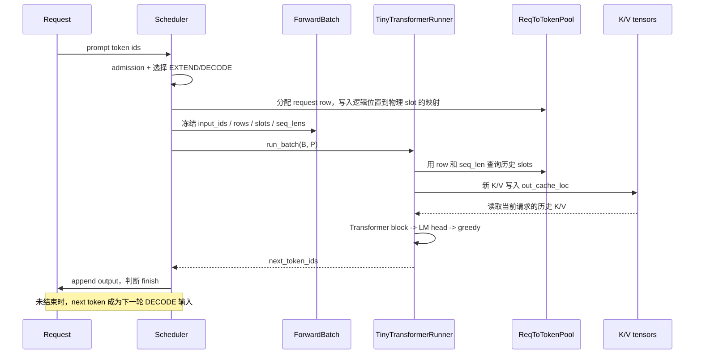
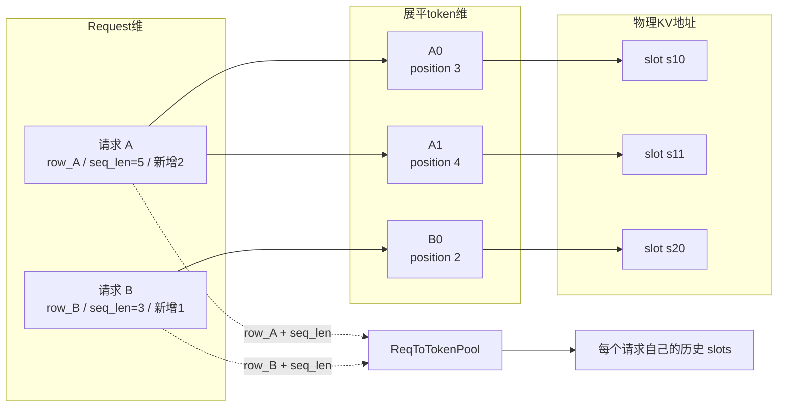
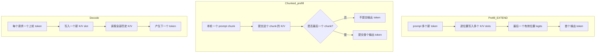

# 从 ForwardBatch 到下一个 token：两条主线的连接层

这篇文档连接两条学习主线：

- **SGLang 运行时主线**决定哪些请求本轮执行、组成什么 batch、使用哪些 KV slot。
- **Transformer 推理主线**接收 token 和 KV 映射，计算 hidden state、logits 与下一个 token。

两边不是两套互不相关的知识。它们在 `ForwardBatch -> ModelRunner` 这条边界上交接，再由
采样结果回到请求生命周期，形成循环。


## 1. 先看完整闭环



一句话读图：Scheduler 负责**组织工作和分配地址**，Transformer 负责**按这些地址计算**，
采样出的 token 又让 Scheduler 可以组织下一轮。

## 2. 三个对象在边界上各负责什么

| 对象 | 是否可变 | 负责什么 | 不负责什么 |
|---|---:|---|---|
| `MiniScheduleBatch` | 是 | admission 落地、row/KV 分配、提交和回滚 | 不执行模型数学 |
| `ForwardBatch` | 否 | 冻结本轮模型调用所需的 token、shape 和 slot 元数据 | 不拥有 KV tensor |
| `TinyTransformerRunner` | 内部状态可变 | 执行 Transformer、读写 K/V、产生 logits 和 token | 不决定哪个请求获准执行 |

同步接口刻意只有一个入口：

```python
run_batch(
    forward_batch: ForwardBatch,
    req_to_token_pool: ReqToTokenPool,
) -> list[int]
```

这比把 prefill、chunk extend 和 decode 拆成三套 runner API 更容易看清事实：三种情况最终都
是一次模型 forward，差别主要在输入 token 数量和已经存在的 KV 历史。

## 3. ForwardBatch 字段怎样变成模型行为

假设本轮有两个请求：A 新增两个 token，B 新增一个 token：

```text
reqs                 = (A, B)
extend_seq_lens      = (2, 1)
input_ids            = (A0, A1, B0)
out_cache_loc        = (s10, s11, s20)
req_pool_indices     = (row_A, row_B)
seq_lens             = (5, 3)
extend_range_starts  = (3, 2)
```



逐个字段读：

| 字段 | runner 怎样使用 |
|---|---|
| `input_ids` | 查 embedding；通过 `extend_seq_lens` 切回每个请求的输入片段 |
| `out_cache_loc` | 与 `input_ids` 同下标；当前 token 的 K/V 必须写到这个物理 slot |
| `req_pool_indices` | 找到请求在 `ReqToTokenPool` 中的稳定行号 |
| `seq_lens` | 确定本轮结束后该请求有多少个有效逻辑位置 |
| `extend_seq_lens` | 定义每个请求在展平 token 数组中占多长的切片 |
| `extend_range_starts` | 给新 token 恢复请求内绝对 position，供 RoPE 和历史范围使用 |
| `forward_mode` | 标记这次是 EXTEND 还是 DECODE，便于调度、trace 和结果处理 |

最重要的两条一一对应关系是：

```text
input_ids[flat_i]       -> out_cache_loc[flat_i]
reqs[req_i]             -> req_pool_indices[req_i] / seq_lens[req_i]
```

不能把 flat token 下标、batch 中的请求下标和稳定 request row 混成同一个坐标。

## 4. 教学 Transformer 内部真正计算什么

`TinyTransformerRunner` 使用固定随机种子的 NumPy 权重，执行一个完整的单层 decoder block：

```text
token id
  -> embedding
  -> RMSNorm
  -> Q / K / V projection
  -> 对 Q、K 应用 RoPE
  -> K/V 写入 out_cache_loc
  -> 根据 request row 读取 [0, position] 的历史 K/V
  -> causal self-attention
  -> output projection + residual
  -> RMSNorm -> SwiGLU -> residual
  -> Final RMSNorm -> tied LM head
  -> logits -> argmax
```

模型对一个请求的新 token 按 position 依次处理。处理 position `p` 时只读取逻辑区间
`[0, p]` 的 slots，所以它天然看不到未来位置；不需要再物化一张三角 causal mask。

模型默认配置很小：词表 256、hidden size 32、4 个 heads、SwiGLU 中间维度 64。它只用于
让数据关系可以运行和测试，不代表任何真实 LLM 的质量。

## 5. KV Cache 的三个视角

“KV Cache”在不同文档里容易像三个概念，其实是同一件事的三层表示：

| 视角 | 保存或回答什么 |
|---|---|
| Transformer 数学 | 每层、每个历史 token 的 key 和 value 向量 |
| Scheduler 资源管理 | 哪些 page/slot 空闲、私有、共享、可淘汰或已预留 |
| 连接层映射 | `(request row, sequence position) -> physical KV slot` |

连接关系是：

```text
request A 的逻辑 position 3
        ↓ ReqToTokenPool[row_A, 3]
physical slot 17
        ↓
key_cache[17] / value_cache[17]
```

Scheduler 可以移动或复用“地址所有权”，而 Transformer 只按映射读写向量。Radix cache
命中也不是复制 K/V：新请求的 request row 指向已经保存好 K/V 的相同物理 slots。

## 6. Prefill、chunked prefill 与 decode 的差别



| 模式 | 每请求本轮输入 | 本轮 KV 变化 | 采样结果怎样处理 |
|---|---|---|---|
| 完整 EXTEND | prompt/cache 未覆盖的 suffix | 为 suffix 写多个 slots | 提交首 token |
| 中间 chunk | prompt 的一段 | 提交这一段 slots | 结果被忽略，请求保持 `PREFILLING` |
| DECODE | 上一个生成 token | 每请求写一个 slot | 提交下一个 token |

注意因果方向：一次 decode 输入 token `10` 并生成 token `11`，本次写进 KV 的是 `10`；
`11` 要到下一次 decode 才成为模型输入并写进 KV。

## 7. Radix 完整命中为什么可能没有 input_ids

当前教学 scheduler 允许整个 prompt 都被 radix cache 命中：

```text
input_ids       = ()
out_cache_loc   = ()
seq_len         = prompt length
```

K/V 足以让未来 token 做 Attention，但要从 prompt 最后位置直接产生 logits，还需要最后的
hidden state。教学模型因此在每个物理 slot 旁保存该 token 的最终 hidden state；完整命中时
读取最后一个 slot 的 hidden state，再执行 Final RMSNorm 和 LM head。

这是为了闭合当前教学 scheduler 语义的明确选择。真实推理系统可能选择保留最后 token 重新
forward，或维护不同的 logits/hidden 缓存策略，不能把这里的辅助缓存当成统一生产接口。

## 8. Logits 怎样回到请求生命周期

LM head 为最后一个有效位置产生长度为 `vocab_size` 的 logits。教学模型只实现：

```text
next_token_id = argmax(logits)
```

runner 为 batch 中每个请求返回一个整数。Scheduler 随后：

1. 把 token 追加到 `Req.output_ids`；
2. 检查 EOS、stop token 和 `max_new_tokens`；
3. 未结束则把请求留给下一轮 DECODE；
4. 已结束则释放 request row 和不再受 cache 保护的 KV page。

temperature、top-k 和 top-p 的数学定义见
[Transformer 核心数学](transformer-math.md#math-sampling)。教学模型只使用 greedy，避免
随机采样掩盖 scheduler 和 KV 映射是否正确。

## 9. 运行并沿 trace 检查闭环

```bash
cd my-sglang
uv run my-sglang-generate \
  --input-ids 1,2 \
  --runner tiny \
  --max-new-tokens 3 \
  --trace
```

默认权重和输入下会输出：

```text
94,94,94
```

trace 中按顺序寻找：

```text
model:kv_write:pos=0:slot=1
model:kv_read:pos=0:slots=1
model:kv_write:pos=1:slot=2
model:kv_read:pos=1:slots=1,2
model:sample:extend:cli-0:94
model:kv_write:pos=2:slot=3
model:kv_read:pos=2:slots=1,2,3
model:sample:decode:cli-0:94
```

需要验证代码时，最小入口是：

- batch 准备：`MiniScheduleBatch.prepare_for_extend()` / `prepare_for_decode()`；
- 边界调用：`MiniScheduler._run_batch_sync()`；
- 模型与 KV：`TinyTransformerModel.forward_batch()` / `_forward_token()`；
- 闭环证据：`tests/test_tiny_transformer.py`。

## 10. 教学边界

这个闭环验证的是字段、shape、slot 和 token 因果，不验证生产性能。它刻意不实现：

- 真实 tokenizer 和训练权重；
- 多层模型、GQA/MQA、量化和复杂采样；
- GPU kernel、真实 CUDA stream 或分布式执行；
- 教学模型与 overlap scheduler 的组合。

真实 SGLang 的 ModelRunner、Attention backend 和 Sampler 会更复杂，但仍然要回答同一组问题：
本轮输入是什么、历史 KV 在哪里、新 K/V 写到哪里、哪些 logits 需要采样、结果怎样进入下一轮。
