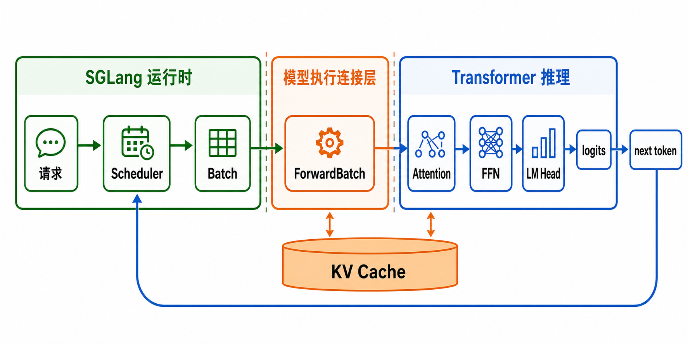
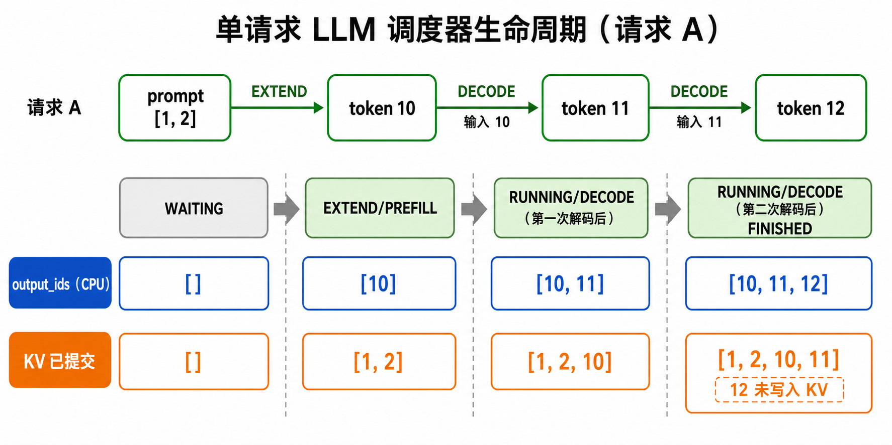

# 新人入门：30 分钟看懂一次生成

目标不是背类名，而是回答四个问题：请求在哪里、KV 放哪里、下一轮 token 从哪来、CPU 为什么可以晚一点处理结果。

整个项目有两条主线：左边的运行时负责排队、batch 和 KV 地址，右边的 Transformer 负责
把本轮 token 算成 logits。`ForwardBatch -> ModelRunner` 是中间的交接桥，采样出的 token
再回到请求状态，形成下一轮。



第一次阅读可以先把模型内部当作一个盒子；走完本页的请求生命周期后，再用
[模型执行连接层](model-execution-bridge.md)打开这个盒子。

## 先跑一个确定性例子

```bash
uv run my-sglang-generate \
  --input-ids 1,2 --token-ids 10,11,12,13 \
  --max-new-tokens 3 --overlap --trace
```

最后的标准输出是 `10,11,12`。trace 中只需先认出这些行（`B1/B2` 是连续 decode batch）：

```text
[GPU-FWD]  forward:sample:B0:[10]              # prefill B0 生成首 token 10
[CPU]      pipeline_process                     # 提交 10；请求才成为 RUNNING
[CPU]      forward:enqueue:forward+sample:B1    # 创建并提交 decode B1
[CPU]      forward:enqueue:forward+sample:B2    # 下一轮先把 B2 排到 B1 后面
[CPU]      event:sync:B1.copy_done              # 开始等待旧 decode B1
[GPU-FWD]  forward:gather:B1:[10]               # 执行 B1，从 FutureMap 读取 10
[GPU-FWD]  forward:sample:B1:[11]               # B1 生成 11 并 stash 到 FutureMap
[GPU-COPY] copy:d2h:B1:[11]                     # D2H 完成，CPU buffer 已有 11
[CPU]      event:sync:B2.copy_done              # 后续处理 B2 时继续等待
[GPU-FWD]  forward:gather:B2:[11]               # B2 读取 B1 stash 的 11
```

`GPU-FWD/GPU-COPY` 在这里指 Fake CUDA 的 forward/copy stream；在真实 SRT 中
分别对应 GPU 计算流和异步 D2H copy 流。

`enqueue` 只表示 CPU 已把任务提交到 stream，不表示 forward 已经执行。`event:sync`
记录的是 CPU 开始等待；Fake CUDA 随后只推进到该 event 所需的 stream 前缀。

## 用一个请求走完整生命周期

设 prompt 是 `[1,2]`，Fake 模型依次返回 `10,11,12`：

```text
请求 A

WAITING
  │ EXTEND: 输入 prompt [1,2]，生成 10
  ▼
RUNNING, output_ids=[10]
  │ DECODE: 输入 10，生成 11
  ▼
RUNNING, output_ids=[10,11]
  │ DECODE: 输入 11，生成 12
  ▼
FINISHED, output_ids=[10,11,12]
```

注意：一次 decode 的输入是“上一个已生成 token”，输出是“新的 token”。因此生成
`12` 的这次 forward 把 `11` 写入 KV。同步路径发现 `12` 已结束后不会再提交
后继 decode；overlap 可能已提前提交后继 batch，因此会临时把 `12` 当作输入写入
KV，再丢弃那一批多算的输出。



图中最值得反复确认的是两条不同的历史：`output_ids` 是已经交给调用方的生成结果，
只包含 `10,11,12`；KV 则保存用于预测下一 token 的输入历史，所以结束时是
`[1,2,10,11]`，不包含刚刚返回、也不会再被消费的 `12`。这不是遗漏，而是 decode
的因果方向。

## 再看 overlap 为什么成立

在当前教学实现中，首个 prefill B0 不直接与后继 decode relay：CPU 必须先
process B0，把 token 10 写进 `A.output_ids`，并把请求改成 `RUNNING`。然后 CPU
才创建第一个 decode B1。下面展开的是之后进入稳定连续 decode 的 overlap。

### Turn 2 结束：B1 只入队，还没有执行

```text
CPU request state                 Fake CUDA state
-----------------                 ---------------
A.status = RUNNING                forward_queue = [B1 forward]
A.output_ids = [10]               copy_queue    = [B1 D2H]
result_queue = [B1]               FutureMap[A.row] = 10
```

这里有两份 token 10：CPU 的 `output_ids[0]` 用于返回结果和判断结束；设备侧
`FutureMap[A.row]` 用作 B1 的输入。B1 已提交到 Fake stream，但此时尚未 gather。

### Turn 3：先提交 B2，再处理 B1

```text
时间  执行者      动作                                  关键状态
----  ----------  ------------------------------------  -----------------------
①     CPU         创建并 enqueue B2                    result_queue=[B1,B2]
②     CPU         synchronize(B1.copy_done)            CPU 阻塞等待 B1
③     GPU-FWD     执行 B1 gather                       读取 FutureMap=10
④     GPU-FWD     B1 forward/sample                    生成 token 11
⑤     GPU-FWD     B1 stash                             FutureMap[A.row]=11
⑥     GPU-COPY    B1 D2H，record B1.copy_done          host_buffer(B1)=11
⑦     CPU         等待结束，读取 B1 host buffer         得到 11
⑧     CPU         A.output_ids.append(11)，pop B1      result_queue=[B2]
```

在步骤 ① 中，B2 的 forward 已排在 B1 后面：

```text
forward_queue = [B1 gather/sample/stash, B2 gather/sample/stash]
```

但 `B1.copy_done` 只依赖 B1，所以步骤 ②～⑥只推进到 B1 完成，不会顺带执行 B2。
Turn 3 结束时，两边再次相差一拍：

```text
CPU:       A.output_ids = [10,11]
GPU relay: FutureMap[A.row] = 11     # 留给 B2
queue:     result_queue = [B2]
```

下一轮 CPU 还可能先 enqueue B3，再等待 `B2.copy_done`。等 B2 真正执行时，它的
gather 才读取 B1 stash 的 11。真实 CUDA 不需要 CPU 调用 `synchronize()` 才开始
工作，可能早已异步推进；但相同 forward stream 的 FIFO 始终保证
`B1 stash(11) -> B2 gather(11)`。

所以同一个 token 有两条用途：

| token 11 的去向 | 目的 | 是否需要等 CPU |
|---|---|---:|
| `FutureMap[A.row]` | 给 B2 当输入 | 否 |
| B1 的 host buffer | 追加到 `A.output_ids`、判断结束 | 是，等 `copy_done` |

## 文档阅读顺序；代码只在卡点时打开

| 顺序 | 读什么 | 只回答一个问题 |
|---:|---|---|
| 1 | [数据结构](data-structures.md) | 请求状态、row、KV 长度分别是什么？ |
| 2 | [Scheduler 与 KV 概览](scheduler-kv-overview.md) | 一轮调度如何选择和推进请求？ |
| 3 | [模型执行连接层](model-execution-bridge.md) | `ForwardBatch` 如何真的产生 K/V、logits 和 token？ |
| 4 | [Transformer 基础概念](transformer-concept.md) | 模型盒子内部怎样沿 block 计算？ |
| 5 | [动态流程](dynamic-flows.md) | chunk、cache、retract 后哪些东西仍存在？ |
| 6 | [overlap pipeline](overlap-pipeline.md) | 为什么 B1 先 launch、B0 后 process？ |
| 7 | [代码按需验证](code-reading-guide.md) | 只打开与当前疑问对应的一小段函数或测试。 |

第一轮只看单请求。理解后再增加一个变量：chunked prefill、radix cache、内存不足 retract、多个请求完成时的多算 token。
