# Overlap Scheduler：对齐 SGLang SRT 的核心结构与流程

本文描述当前 `my-sglang` 的 overlap 实现。主线对齐本仓库标准 SGLang SRT：

- 通用后端使用 pool-indexed `FutureMap` 中继设备侧 token；
- event-loop 每轮先调度并 launch 当前 batch，再 FIFO 处理上一 batch 的 CPU 结果；
- MLX 保留专用 lazy chained-decode 路径，因为 MLX 的依赖图和通用 CUDA/torch 路径不同；
- manual launch/finalize 被拆成独立 scheduler，只用来观察 KV transaction，不与生产流水混用。

对应源码：

- [`overlap_utils.py`](../src/my_sglang/overlap_utils.py)：`MiniFutureMap` 与 forward 输入解析；
- [`runner.py`](../src/my_sglang/runner.py)：`MiniBatchResult`、completion event 和 MLX adapter；
- [`overlap_scheduler.py`](../src/my_sglang/overlap_scheduler.py)：通用 event-loop、MLX specialization、FIFO result processing；
- [`test_overlap_scheduler.py`](../tests/test_overlap_scheduler.py)：全部流程的 CPU 可执行例子。

## 1. 先回答：多线程不是天然并行吗？

多个 CPU 线程只能说明 CPU 任务可能同时执行，不能消除数据依赖，也不能自动让 GPU 工作连续。

对两个不同请求 `req-A`、`req-B`，只要资源足够，它们可以放进同一个 batch 并行计算，也可以处在不同的流水阶段：

```text
req-A prefill ───────────────┐
                             ├─ 同一 GPU batch / 并行 kernel
req-B decode  ───────────────┘

CPU: 同时可以接收 req-C、组下一批、处理上一批结果
```

但同一个请求的 token 有严格的因果链：

```text
token[n] = sample(model(prompt, token[0:n]))
token[n+1] 必须读取 token[n]
```

所以不能把同一请求的 `decode n` 与 `decode n+1` 当成两个互不相关的 CPU 任务。Overlap 做的是：

1. 保留 `decode n → decode n+1` 的设备侧依赖；
2. 不等待 `token[n]` 先回到 Python `output_ids`；
3. 把 GPU 当前 batch 与 CPU 对上一 batch 的记账、finish、cache 处理重叠起来。

核心结论是：

```text
不同 req：可以 batch 并行，也可以流水并行
同一 req：decode 有因果依赖，只能通过 FutureMap/lazy graph 接力
CPU 多线程：能提供执行资源，但不会自动表达上述依赖或资源所有权
```

## 2. 三种执行模式

| 模式 | 类 / API | 在途结果 | KV commit | 用途 |
|---|---|---:|---|---|
| 同步 | `MiniScheduler.step()` | 0 | forward 成功后在同一调用提交 | 最简单的调度主线 |
| Manual | `MiniManualOverlapScheduler.launch_step()` / `finalize_pending()` | 最多 1 | finalize 成功才提交 | 观察 allocate/commit/rollback |
| 生产 overlap | `MiniOverlapScheduler.overlap_step()` | 稳态 1，turn 内可到 2 | launch 成功即提交普通 KV | 对齐 SRT event-loop |

Manual 不是生产 pipeline。它故意保留：

```text
launch 后:   kv_allocated_len > kv_committed_len
finalize 后: kv_allocated_len == kv_committed_len
```

生产 overlap 在 launch 成功后就令普通 KV 的 allocated/committed 水位相等；延迟的是 CPU token 可见性、finish/cache 处理和资源释放。

## 3. 为什么同一个请求要维护四组状态

先定义本文使用的记号：

```text
batch：Scheduler 在一次模型调用中打包到一起执行的一组请求
B0：前一批、较早 launch 的 batch
B1：B0 的后一批、较晚 launch 的 batch
```

`B0`、`B1` 只是为了说明先后顺序而起的名字，类似“第 0 批”和“第 1 批”，不是源码中的类名或固定变量。一个 batch 可以只有请求 A，也可以同时包含 A、B、C 等多个请求。

在本节的例子中：

```text
B0 = 请求 A 的 prefill batch，读取 prompt，生成第一个 token 10
B1 = 请求 A 的下一次 decode batch，读取 token 10，生成 token 11
```

这只是最容易观察 overlap 的例子。实际运行中，B0、B1 都可能是 prefill、extend 或 decode，两个 batch 包含的请求集合也不一定完全相同。真正重要的关系只有：B0 比 B1 早 launch，并且 B1 中的请求 A 依赖 B0 为 A 生成的 token。

先不要把“四条线”理解成四段先后执行的 pipeline。它们不是：

```text
错误理解：第一条线完成 -> 第二条线完成 -> 第三条线完成 -> 第四条线完成

正确理解：同一个时刻，从四个角度记录同一个请求当前走到了哪里
```

之所以需要四组状态，是因为 overlap 故意让“下一轮 GPU 计算”跑在“上一轮 CPU 结果处理”前面。

这里的 CPU 实际做了两类不同的工作：一类是准备并提交下一批，另一类是读取并处理上一批的结果。把 CPU、GPU 放在同一条时间轴上会更清楚：

```text
行为/动作       ① 提交 B0          ② B0 计算并产出 10       ③ 提交 B1             ④ B1 计算 / CPU 处理 B0       ⑤ 收尾
              |                  |                       |                     |                            |
CPU           prepare B0        不等待 B0 的 CPU token    prepare B1            _process_oldest(B0)          process B1
              launch B0   ----> 得到异步结果引用    ----> launch B1      ----> wait copy_done               丢弃多算的 11
                                                                                append 10 to output_ids       释放请求资源

GPU           B0 queued   ----> B0 forward / sampling    B1 queued       ----> B1 forward / sampling
                                      |                       ^                       |
                                      | write token 10        | read token 10         | write token 11
                                      +---- FutureMap row A ---+                       +---->

Time          ----------------------------------------------------------------------------------------------->
```

这张图要表达三个关键点：

1. CPU 调用 `launch B1` 以后，才调用 `_process_oldest(B0)`；这就是“下一轮提交跑在上一轮 CPU 结果处理前面”。
2. `launch B1` 只是把工作和依赖关系提交给 GPU，不代表 B1 可以越过 B0。GPU 必须等 B0 写出 `token 10`，B1 才能读取它。
3. B1 直接从设备侧的 `FutureMap` 或 backend handle 取得 `token 10`，不需要等待 CPU 先把 `10` 写入 `Req.output_ids`。

因此，真正被交叠起来的是：

```text
GPU：执行 B1
CPU：等待并处理 B0 的结果
```

没有 overlap 时，路径是：

```text
B0 GPU -> D2H -> CPU 更新 Req -> 准备 B1 -> B1 GPU
```

有 overlap 时，B0 的输出分成两条去路：

```text
                         +-> FutureMap -> B1 GPU
B0 GPU -> token 10 ------+
                         +-> D2H -> CPU 更新 Req
```

如果必须等 CPU 把 `10` 写入 `A.output_ids`，才能 launch B1，就没有 overlap 了。

### 3.1 先看一条完整主流程

假设请求 A 的 prompt 是 `[1, 2]`，并且最多只需要生成一个 token。B0 是 A 的 prefill batch，生成 token `10`：

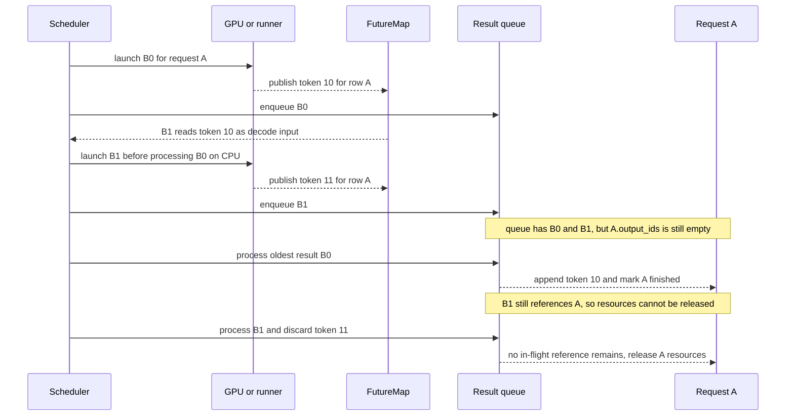

这里最关键的是 B1 launch 后、B0 被 CPU 处理前的这个瞬间：

```text
GPU 侧：B1 已经拿 token 10 开始计算
CPU 侧：A.output_ids 仍然是 []
```

二者同时成立不是错误，而是 overlap 要创造出来的时间窗口。

### 3.2 “四条线”其实是四本账

四条线更准确的叫法是“四本独立账本”。每本账回答一个不同的问题：

| 账本 | 它只回答什么问题 | 对应实现 | B1 刚 launch 时的值 |
|---|---|---|---|
| batch 执行账 | 哪些 batch 已经 launch，但还没完成 CPU 处理？ | `_result_queue`、`MiniBatchResult` | `[B0, B1]` |
| 下一轮输入账 | 请求 A 下一轮计算应该吃哪个 token？ | `FutureMap[A.req_pool_idx]` | B1 已读取 `10`；随后可写入 `11` |
| 请求逻辑账 | CPU 已经正式接纳了哪些输出？请求是否结束？ | `A.output_ids`、`A.status` | `output_ids=[]`，尚未判定结束 |
| 资源所有权账 | 还有几个已 launch 的 batch 在引用 A？ | `_inflight_refs[A]`、`_deferred_finished` | `2`，B0 和 B1 各持有一次 |

它们必须分开，是因为这些值在同一时刻本来就不相等：

```text
_result_queue        = [B0, B1]   # 两批都已经 launch
FutureMap[row_A]     = 11         # B1 又产生了下一个设备侧 token
A.output_ids         = []         # B0 还没有在 CPU 上提交
_inflight_refs[A]    = 2          # B0、B1 都仍然引用 A
```

这里的 `FutureMap[row_A] = 11` 不代表用户已经看到 `11`。它只表示设备计算链已经向前走到了 `11`。

### 3.3 四本账如何随主流程变化

下面这张表就是上一张时序图的状态展开。按行读即可，不需要再记另一套“里程碑”概念：

| 时刻 | 当前动作 | result queue | FutureMap A | A.output_ids / status | A 的 in-flight 引用 | 能否释放 A |
|---|---|---|---|---|---:|---|
| T0 | 尚未 launch | `[]` | 无值 | `[] / WAITING` | 0 | 否，请求还要运行 |
| T1 | B0 launch 完成 | `[B0]` | `10`，可供 B1 使用 | `[] / RUNNING` | 1 | 否 |
| T2 | B1 已 launch，B0 尚未 CPU process | `[B0, B1]` | `11`，B1 已经消费过 `10` | `[] / RUNNING` | 2 | 否 |
| T3 | FIFO process B0 | `[B1]` | `11` | `[10] / FINISHED` | 1 | 否，B1 仍引用 A |
| T4 | process B1；发现 A 已结束，丢弃 `11` | `[]` | 清除 | `[10] / FINISHED` | 0 | 是，释放 row、KV 和 runner state |

这张表表达了两个因果关系：

1. `FutureMap` 先让 B1 消费 `10`，所以 GPU 不必等待 B0 的 CPU process。
2. B0 process 后 A 虽然已经 `FINISHED`，但 B1 是提前 launch 的，仍持有 A，所以必须等 B1 出队才能释放资源。

这就是四本账存在的全部原因。它们不是为了描述四套调度算法，而是为了正确记录 overlap 造成的“设备已经向前走，CPU 和资源回收还落在后面”。

### 3.4 代码中的一次 overlap turn

通用 FutureMap 路径的一次稳定态 turn，可以简化成：

```text
1. 取 queue head B0，但暂时不处理它
2. 从 FutureMap 读取 B0 生成的 token，准备后继 B1
3. launch B1，并把 B1 放入 result queue
4. 再从队头取出 B0，等待它的 D2H completion event
5. 把 B0 token 写入 Req.output_ids，更新 finish 状态
6. B0 出队并减少 owner 计数；owner 为 0 时才释放资源
```

因此，每个 turn 的关键顺序是：

```text
launch successor first -> process oldest result second
```

这句话比“六个里程碑”更直接地概括了 pipeline 模式。

### 3.5 `copy_done` 和 KV 状态放在哪里

`copy_done` 属于 batch 执行账。`_process_oldest()` 调用 `resolve_cpu_tokens()` 时会等待它；等待完成只说明 CPU 可以读取 token，随后才会更新 `Req.output_ids`。

KV 则属于请求占用的物理资源。它有自己的 allocated/committed 水位，但“已经 committed”和“现在可以释放”仍是两回事：

| 状态 | KV 是否可供后继计算使用 | CPU 是否已提交 token | 是否可以释放 KV |
|---|---|---|---|
| B0 launch 成功 | 是 | 不一定 | 否 |
| B0 已 CPU process | 是 | 是 | 不一定，可能仍有 B1 owner |
| 请求 FINISHED 且 owner 为 0 | 不再需要 | 是 | 是 |

所以只需要记住：

```text
FutureMap 解决：下一轮拿什么 token 计算
copy_done 解决：CPU 什么时候能读取这批 token
Req 状态解决：token 是否已经正式提交、请求是否结束
owner 计数解决：row 和 KV 什么时候可以安全释放
```

## 4. 核心数据结构

先看对象之间的关系。实线表示持有或调用，虚线表示“通过稳定 row 关联”，不是 Python 对象引用：

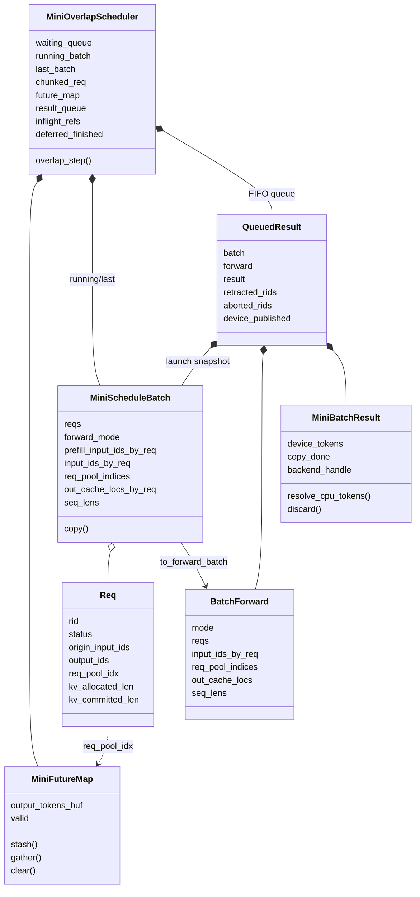

这里有三类“身份”，不要混淆：

| 身份 | 是否稳定 | 用途 |
|---|---|---|
| `rid` | 请求全生命周期稳定 | 对外标识、runner request state |
| `req_pool_idx` | request 处于 active 状态期间稳定 | FutureMap row、ReqToTokenPool row |
| batch position | 只在一个 batch snapshot 内稳定 | 对齐本 batch 的输入、输出和元数据 |

例如同一批请求重排后：

```text
B0.reqs              = [A, B]
B0.req_pool_indices  = [3, 7]
B0.device_tokens     = [101, 205]

FutureMap            = row 3 -> 101, row 7 -> 205

B1.reqs              = [B, A]
B1.req_pool_indices  = [7, 3]
B1.input_ids_by_req  = [(205,), (101,)]
```

### 4.1 `MiniFutureMap`

`MiniFutureMap` 是固定容量、按 request-pool row 索引的 token relay：

```text
req_pool_idx       output_tokens_buf       valid
0                  101                     true
1                  205                     true
2                  undefined               false
```

内部只有两个等长数组：

| 字段 | 类型 | 含义 |
|---|---|---|
| `output_tokens_buf` | `np.ndarray[int64]` | 每个 active row 的下一轮输入 token |
| `_valid` | `np.ndarray[bool]` | row 是否已经发布 token；防止读到释放前的旧值 |

接口及状态变化：

- `stash(indices, tokens)`：写 token，并将对应 `_valid` 置为 `True`；
- `gather(indices)`：按传入顺序读取；row 未发布时立即抛 `RuntimeError`，不会像 Java `Future.get()` 一样等待；
- `clear(index)`：token 重置为 `-1`、`_valid=False`，必须发生在 row 释放或复用前；
- `snapshot()`：测试和调试用，不参与调度。

单个 row 的生命周期：

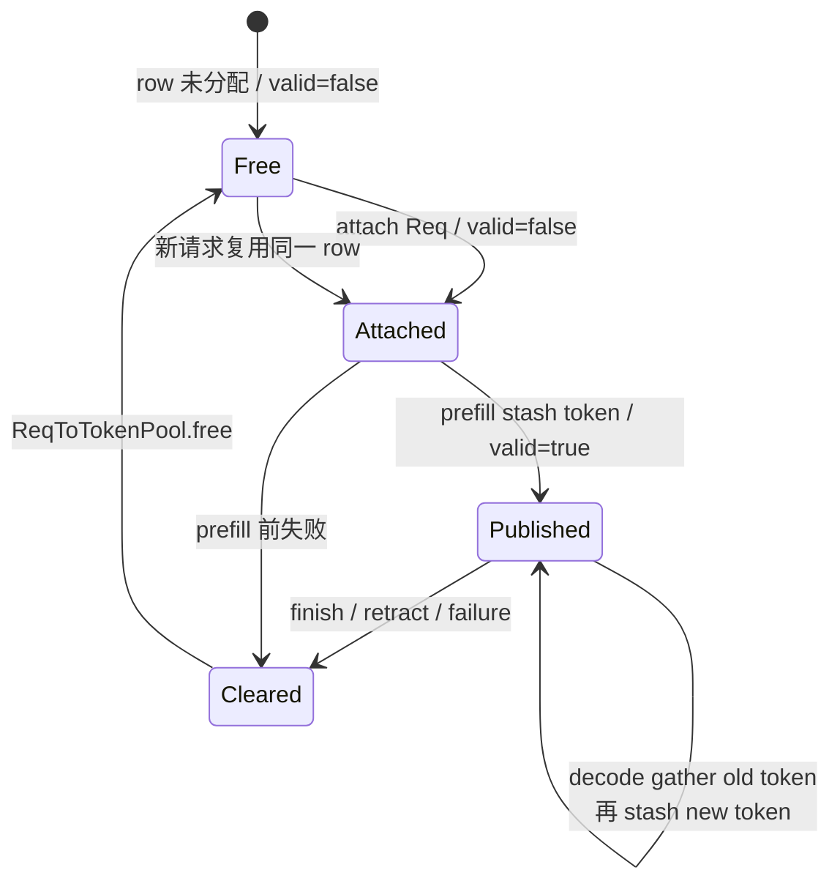

`gather()` 不清除值，因为正常 decode 会在同一轮 launch 后用新 token 覆盖它。真实 SRT 在 CI debug 模式可以额外 invalidate 来捕获重复消费；教学版通过请求生命周期和测试约束消费顺序。

为什么索引是 `req_pool_idx`，而不是 batch position：batch position 每轮都可能因为 prefill 插入、finish、retract 而改变；request row 在请求的活跃生命周期内稳定。

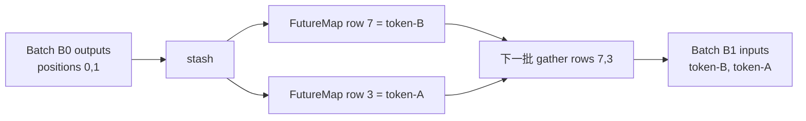

旧实现的 `FutureTokenRef(producer_job_id, output_index)` 已移除。当前结构更接近 SRT 的 device buffer：消费者只依赖稳定 pool row，不需要了解生产者 job id。

### 4.2 `Req`、`ReqToTokenPool` 与 KV allocator

Overlap 没有创造另一套 request 状态，而是在普通 `Req` 上把三种进度分开：

| 字段 | 含义 | overlap 中的写入时机 |
|---|---|---|
| `status` | `WAITING/PREFILLING/RUNNING/FINISHED` | admission、extend launch、FIFO result processing |
| `origin_input_ids` | 原始 prompt | 创建后不变 |
| `output_ids` | 已按 FIFO 确认、可以对用户可见的生成 token | `_process_oldest()` 中追加，不在 device stash 时追加 |
| `fill_ids` | prefill/replay 要恢复的逻辑序列 | retract 后变为 prompt + confirmed outputs |
| `req_pool_idx` | active request 的稳定 row | attach 时分配，最终 release 时清空 |
| `kv_allocated_len` | row 中已经预留的 KV 逻辑长度 | `prepare_for_extend/decode()` 推进 |
| `kv_committed_len` | 已成功 launch、可作为后继前缀的普通 KV 长度 | 生产 overlap launch 成功后推进 |

请求逻辑位置通过 `ReqToTokenPool` 映射到物理 KV slot：

```text
Req A: req_pool_idx = 3

ReqToTokenPool[row=3]
seq_pos:    0   1   2   3
slot:       8   9  14  15
token:      1   2  10  11
                             ^ token 12 是最新输出，尚未写入 KV
```

FutureMap 与 KV mapping 使用同一个 row，但保存的东西完全不同：

```text
ReqToTokenPool[row, seq_pos] -> KV slot
FutureMap[row]               -> 下一轮 decode token
```

allocator 负责“给本轮输入找物理位置”，FutureMap 负责“告诉本轮 decode 输入 token 是什么”。二者必须同时准备好才能构造 decode forward。

### 4.3 `MiniScheduleBatch` 与 `BatchForward`

`MiniScheduleBatch` 是调度器内部的可变对象，负责：

- request 组成与 forward mode；
- KV slot 分配与 row mapping；
- `seq_lens`、`prefix_lens`、chunk 边界；
- prefill CPU staging 或 decode FutureMap 输入的延迟解析。

字段可以按四组理解：

| 分组 | 字段 | 作用 |
|---|---|---|
| 请求组成 | `reqs`, `forward_mode`, `chunked_req` | 谁运行、运行 EXTEND 还是 DECODE |
| 输入来源 | `prefill_input_ids_by_req`, `input_ids_by_req`, `first_extend_by_req` | CPU staging、最终输入、首次 prefill/后续 extend 分流 |
| 稳定索引 | `req_pool_indices` | 对齐 FutureMap 和 ReqToTokenPool row |
| KV 元数据 | `out_cache_locs_by_req`, `seq_lens`, `prefix_lens`, `extend_lens`, `chunk_starts` | 本轮写哪些 slot、各长度边界 |
| Chunk 元数据 | `is_last_prefill_chunk` | 中间 chunk 不把 runner 返回值当用户 token |

EXTEND prepare 的数据变化：

```text
start  = req.kv_allocated_len
target = req.fill_len

prefill_input_ids_by_req = req.fill_ids[start:target]
out_cache_locs_by_req    = allocator.alloc_extend(start, target)
prefix_lens              = start
seq_lens                 = target
extend_lens              = target - start
```

DECODE prepare 的数据变化：

```text
start  = req.kv_allocated_len
target = start + 1

input_ids_by_req         = None          # 延迟到 forward 入口
req_pool_indices         = active rows
out_cache_locs_by_req    = 每个请求一个新 slot
prefix_lens              = start
seq_lens                 = start + 1
extend_lens              = 1
```

`BatchForward` 是交给 runner 的 frozen dataclass 快照。它的字段引用不能被替换，但其中的 `Req` 对象仍然共享且可变；runner 必须把 request 当作只读输入，真正的状态提交只能走 scheduler 的 FIFO process 路径。关键输入字段：

| 场景 | prepare 后 | `resolve_forward_inputs()` 后 |
|---|---|---|
| prefill / extend | `prefill_input_ids_by_req` 有值，`input_ids_by_req=None` | staging 移入 `input_ids_by_req` |
| decode | 两个输入字段都为 `None` | 按 `req_pool_indices` 从 FutureMap gather |
| MLX chained decode | scheduler 不做 FutureMap gather | 空 tuple 表示输入由 previous lazy handle 提供 |

`by_req` 表示外层位置始终和 `reqs` 对齐：

```text
reqs                       = [A, B]
prefill_input_ids_by_req   = [(A 的 suffix...), (B 的 suffix...)]
input_ids_by_req           = [(A 的最终输入...), (B 的最终输入...)]
out_cache_locs_by_req      = [(A 的 slots...),  (B 的 slots...)]
```

输入字段的三个值域：

| 值 | 含义 |
|---|---|
| `None` | 尚未解析，不能调用 `to_forward_batch()` |
| `((token,...),...)` | 显式输入已经就绪，可以交给普通 runner |
| `((),...)` | 仅用于 MLX chained decode；输入由 previous lazy handle 隐式提供 |

`first_extend_by_req[i]` 决定 runner adapter 对第 `i` 个请求走首次 `prefill` 还是后续 `extend`；它描述 backend request state 是否首次建立，不等价于“本 batch 是否是 EXTEND”。

`BatchForward` 的主要字段来自 `MiniScheduleBatch` 的逐项冻结：

| `BatchForward` 字段 | 来源 | runner 用途 |
|---|---|---|
| `mode` | `forward_mode` | 选择 EXTEND/DECODE 路径 |
| `reqs` | `reqs` tuple | rid、fill metadata、后端 request state |
| `input_ids_by_req` | 已解析输入 | 模型本轮真正消费的 token |
| `req_pool_indices` | row array | request-pool/FutureMap 稳定索引 |
| `out_cache_locs` | slot arrays | 本轮输入 KV 写入位置 |
| `seq_lens` | sequence targets | attention 序列长度 |
| `prefix_slot_ids_by_req` | `Req.prefix_indices` | radix prefix 复用 |
| `extend_lens/chunk_starts` | batch length arrays | EXTEND 边界 |
| `is_last_prefill_chunk_by_req` | chunk flags | 是否将返回 token 提交为首个 output |
| `first_extend_by_req` | admission 时记录 | prefill/extend backend 分流 |

两个快照的职责不同：

| 对象 | 为什么需要 |
|---|---|
| `BatchForward` | runner 输入不可变；记录实际送进模型的 token/slot/长度 |
| `batch.copy()` | CPU 结果回来时仍需知道当时的 `seq_lens`、chunk 标记和 request 顺序 |

`batch.copy()` 对 NumPy 元数据做复制，但仍共享 `Req`、pool、allocator 和 radix cache：

```text
独立：reqs list、row array、slot arrays、length arrays、chunk flags
共享：Req objects、ReqToTokenPool、KV allocator、tree cache
```

因此 snapshot 能抵抗后续 batch filter/merge，却仍能把结果提交到同一个 request 对象。

### 4.4 `MiniBatchResult`

一次已 launch、尚未完全提交到 CPU 的结果包含：

```text
MiniBatchResult
├── device_tokens   通用路径可立即用于 FutureMap 的设备侧 token 抽象
├── copy_done       D2H completion event
├── backend_handle  后端私有 handle；MLX 中保存 lazy decode/prefill handle
├── resolve_cpu_tokens()
└── discard()
```

`resolve_cpu_tokens()` 是幂等的：第一次先 `copy_done.synchronize()` 再 materialize，后续返回缓存值。`discard()` 用于失败恢复；已提交到真实设备的工作未必能取消，所以它的语义是“等待/清理后端 handle，但不把结果写入请求状态”。

字段的生产者和消费者：

| 字段 | 谁创建/写入 | 谁读取 | 是否要求 CPU 已经拿到 token |
|---|---|---|---|
| `device_tokens` | runner forward/sampling | `_launch_fresh()` → FutureMap | 否 |
| `copy_done` | runner 在异步 D2H 后记录 | `resolve_cpu_tokens()` | synchronize 后是 |
| `backend_handle` | runner/backend | MLX chained launch、discard | 否 |
| `_cpu_tokens` | 首次 resolve 时缓存 | 后续重复 resolve | 是 |

结果对象状态机：

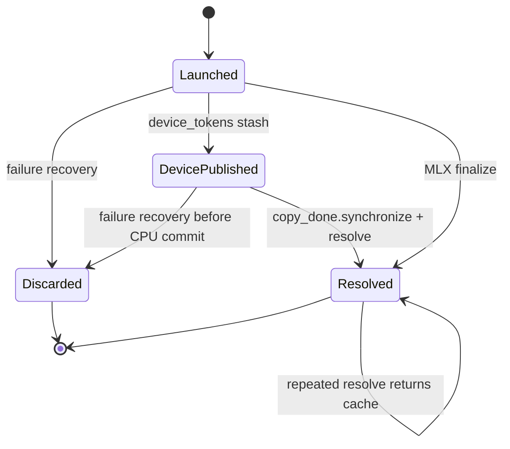

这里的 `device_tokens` 是教学抽象；真实 SRT 是 device tensor。`copy_done` 不是 token 数据，只是“CPU buffer 可以安全读取”的完成凭证。

同一个模型输出会分成两个消费方向：

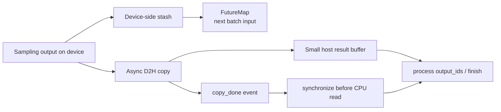

Host buffer 只保存 next-token 等结果，不复制模型权重或整个 KV cache；它的容量与在途 batch 结果大小相关，而不是必须大于 GPU memory。

### 4.5 `_QueuedResult` 与 `result_queue`

队列项保存：

- `batch.copy()`：launch 时的可变状态快照；
- `BatchForward`：runner 输入的不可变视图；
- `MiniBatchResult`：event、device token 与后端 handle；
- 本轮 retract / abort 管理事件；
- device token 是否已经写入 FutureMap。

完整字段表：

| 字段 | 为什么不能省略 |
|---|---|
| `batch` | process 时需要 launch snapshot，尤其是 chunk `seq_len` 和 request 顺序 |
| `forward` | 对外观察、测试、更新 `last_prefill_batch/last_decode_batch` |
| `result` | 保存尚未 CPU resolve 的 event、token 和后端 handle |
| `retracted_rids` | 把本轮调度管理事件带到对应 `StepResult` |
| `aborted_rids` | 同上 |
| `device_published` | 通用路径 launch 时已 stash；MLX finalize 后才需要 stash，防止重复 |

`result_queue` 必须 FIFO：GPU launch 可以向前，CPU 可见状态必须按 batch 顺序提交。

```text
turn 中间: queue = [B0, B1]
process:   只能 resolve/pop B0
turn 返回: queue = [B1]
```

为什么 turn 内允许 2、返回时通常只剩 1：

```text
进入 turn: [B0]
launch B1: [B0, B1]
process B0: [B1]
返回 turn: [B1]
```

队列不是 GPU work queue 的完整副本，而是“尚未按 CPU 顺序提交的 batch results”。

### 4.6 Scheduler 的 batch 字段与所有权

Scheduler 同时有多个 batch 相关字段，它们代表不同阶段：

| 字段 | 持有什么 | 作用 |
|---|---|---|
| `running_batch` | 当前具有 decode 资格的请求集合 | 下一次无 prefill 时构造 DECODE |
| `last_batch` | 上一轮刚 launch 的可变 batch | 下一 turn 先 settle/merge/filter |
| `chunked_req` | 尚未完成 prompt 的唯一 chunk request | 下一 turn 继续 EXTEND |
| `_result_queue` | 尚未 CPU process 的 launch snapshots | FIFO 提交、持有 in-flight 资源 |

同一个 `Req` 可以同时出现在多个容器中，但含义不同：

```text
running_batch:  表示它有资格被继续调度
last_batch:     表示 batch 生命周期待 settle
result_queue:   表示某次 launch 的结果尚未 CPU 提交，也是资源 owner
```

因此不能通过“req 已经从 running_batch 过滤掉”推断它可以释放；必须再检查 result queue owner。

### 4.7 `_inflight_refs` 与 `_deferred_finished`

同一请求可能同时被 B0 和已 launch 的 B1 快照引用：

```text
inflight_refs[req-A] = 2
```

B0 处理后发现 `req-A` 达到长度上限：

1. 状态变为 `FINISHED`；
2. 放入 `_deferred_finished`；
3. B1 结果仍按 FIFO resolve，但丢弃 req-A 的多算 token；
4. 最后一个队列 owner 退出后，才释放 request row、KV page、FutureMap row 和 runner state。

引用计数不是普通 Python 引用计数，而是显式的调度资源所有权：

```text
_inflight_refs[req]
  = sum(req 出现在每个 _QueuedResult.batch.reqs 中的次数)
```

资源释放顺序：

```text
mark FINISHED
  -> deferred_finished.add(req)
  -> 逐个 pop owner
  -> inflight_refs[req] == 0
  -> FutureMap.clear(row)
  -> free private KV pages / release cache lock
  -> ReqToTokenPool.free(row)
  -> runner.remove_request(rid)
```

### 4.8 `OverlapTurnResult`

`overlap_step()` 返回的不是单一 batch，而是一次 event-loop turn 的观察结果：

| 字段 | 含义 |
|---|---|
| `launched_batches` | 本 turn 新提交给 runner 的 batch；MLX chain break 时可能多于一个阶段 |
| `processed_results` | 本 turn 已按 FIFO 写回 CPU request 状态的结果 |
| `queued_batches` | turn 返回时仍在途的 forward snapshots |
| `sync_reason` | 为什么本轮不能保持常规 overlap，如 `decode_memory/non_decode/request_finished` |
| `memory` | turn 结束时的 allocator/cache 快照 |

因此 `launched_batches[0]` 和 `processed_results[0].batch` 通常不是同一个 batch：前者是 B1，后者是 B0。这正是 overlap 的可观察定义。

## 5. 通用 SRT-shaped event-loop

通用路径的单轮控制流是：

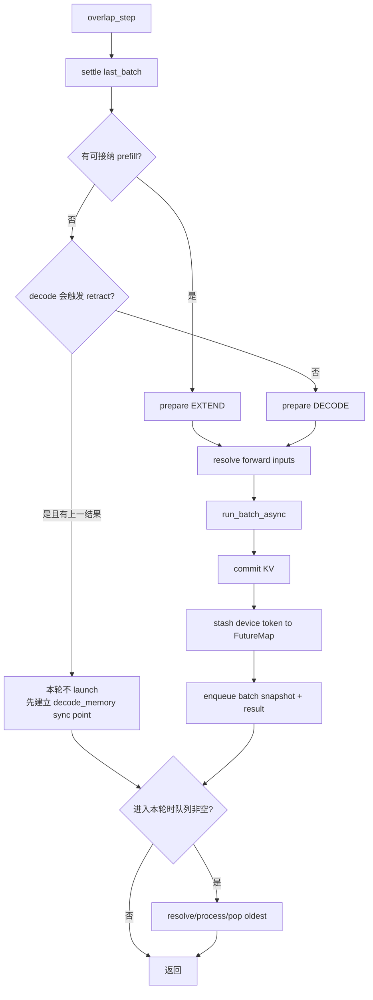

伪代码：

```python
had_previous = bool(result_queue)
settle_last_batch()
batch = get_new_prefill_batch() or get_decode_batch()

if batch is not None:
    resolve_forward_inputs(batch, future_map)
    result = runner.run_batch_async(batch.to_forward_batch())
    batch.commit_allocated()
    future_map.stash(batch.req_pool_indices, result.device_tokens)
    result_queue.append((batch.copy(), result))
    last_batch = batch

if had_previous:
    process_oldest_fifo_result()
```

顺序里最关键的两点：

1. 当前 batch 的 launch 在上一 batch 的 `copy_done.synchronize()` 之前；
2. 当前 decode 输入来自 FutureMap，不依赖上一 token 已追加到 CPU `output_ids`。

### 5.1 通用路径：一个 turn 展开到方法和字段

下面是 `_overlap_step_future_map()` 的方法级时序。假设进入 turn 时 `result_queue=[B0]`，本轮成功构造并 launch B1：

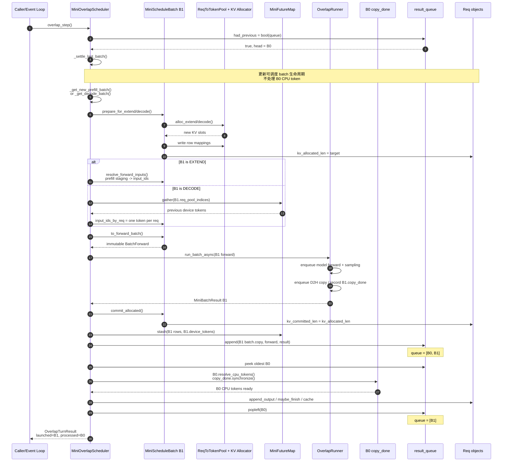

步骤 11～15 是 GPU/device 方向的“向前推进”；步骤 16～19 才是上一结果的 CPU 提交。`had_previous` 在 turn 开头固定，因此冷启动时新 enqueue 的 B0 不会在同一 turn 立刻被 process。

需要特别注意 `last_batch` 和 `result_queue` 的结算不是一回事：

```text
_settle_last_batch()
    处理 batch 是否进入 running_batch 的调度生命周期

_process_oldest()
    等待 D2H，追加 output_ids，判断 finish，提交用户可见状态
```

### 5.2 从 prefill 到稳定 decode 的完整跨 turn 时序

请求：prompt `[1, 2]`，模型依次生成 `10, 11, 12, 13`。

假设 request 获得 `req_pool_idx=0`，page size 为 1，slot 0 保留，prompt 使用 slots 1、2。时间轴如下：

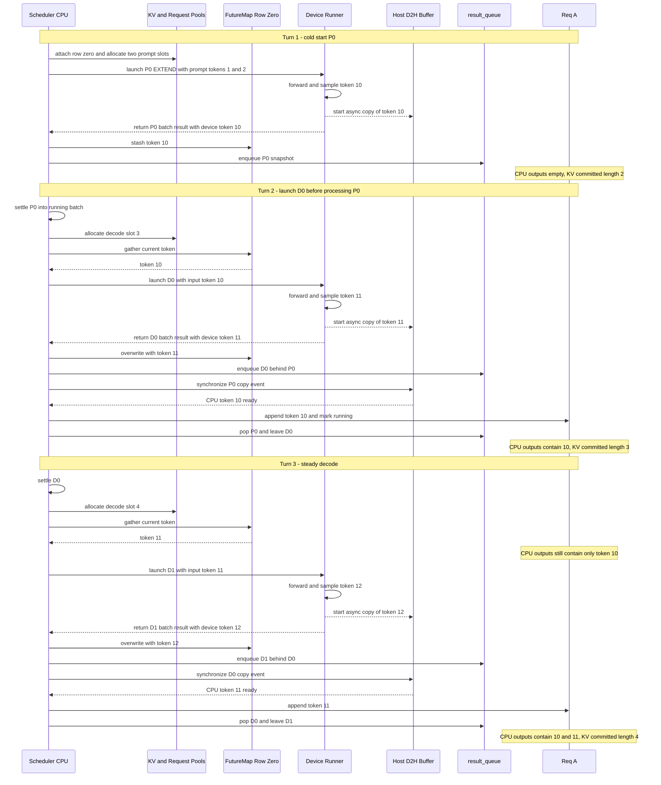

同一时刻存在三个不同的“最后 token”：

| 观察位置 | Turn 3 launch D1 后的值 | 含义 |
|---|---:|---|
| `Req.output_ids[-1]` | `10` | CPU 尚只提交到 P0 |
| D0 CPU buffer | `11` | 正在等待/即将 process 的上一结果 |
| `FutureMap[row=0]` | `12` | D1 已发布、供下一轮使用的新 device token |

这不是状态冲突，而是流水线的三个进度水位。

#### Turn 1：launch P0

```text
schedule: EXTEND input [1,2]
launch:   P0 -> device token 10
stash:    FutureMap[row] = 10
queue:    [P0]
CPU:      output_ids = []
```

#### Turn 2：launch D0，再 process P0

```text
gather:   D0 input = FutureMap[row] = 10
launch:   D0 -> device token 11
stash:    FutureMap[row] = 11
queue:    [P0,D0]
process:  P0 -> output_ids = [10]
pop:      queue = [D0]
```

#### Turn 3：launch D1，再 process D0

```text
gather:   D1 input = 11
launch:   D1 -> device token 12
queue:    [D0,D1]
process:  D0 -> output_ids = [10,11]
pop:      queue = [D1]
```

这里 D1 使用 `11` 时，CPU 的 `output_ids` 仍只有 `[10]`。这就是跨 iteration 的设备侧接力。

### 5.3 不同请求的并行

假设 B0 含 `A/B`，新请求 `C` 到达：

```text
上一结果: B0 decode(A,B) 正在 D2H / 等待 CPU process
当前调度: P1 prefill(C)
本轮顺序: launch P1(C) -> process B0(A,B)
```

新 prefill 不需要依赖 A/B 的 token，因此通用路径可以先 launch 它。真实 SRT 也允许这种主线；是否禁用连续 prefill overlap 是额外策略开关，不是数据依赖要求。

### 5.4 Decode 内存同步点

如果当前 decode 必须 retract 请求才能获得 page，而上一结果尚未 CPU 提交，就不能先改变请求组成。当前实现：

```text
检测到 decode_memory
本轮不 launch 新 batch
process/pop 上一结果
下一轮再走正常 evict -> retract -> abort 闭环
```

它避免对仍被旧 batch snapshot 持有的请求提前释放或重排。

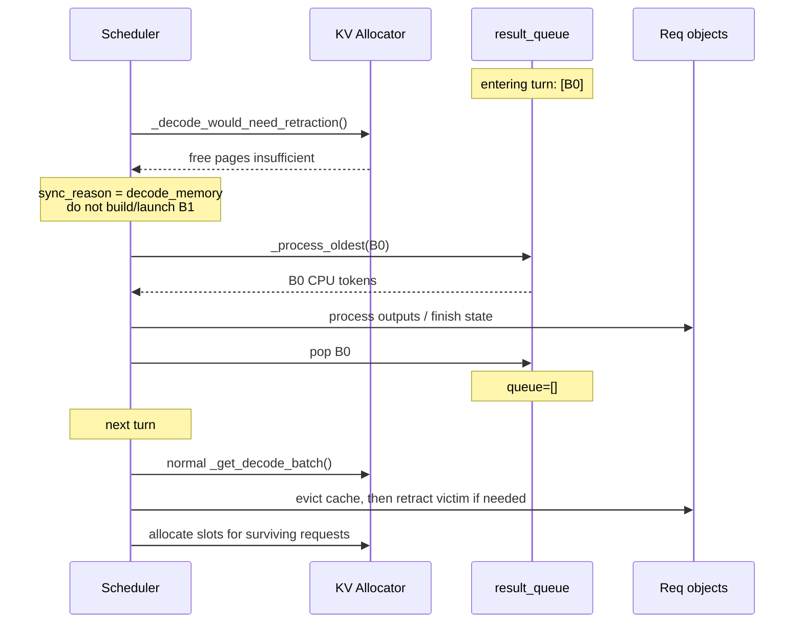

之所以分成两个 turn，是因为 retract 会释放 row/KV 并改变 batch composition，而 B0 snapshot 还依赖旧 composition。

### 5.5 Chunked prefill

连续 chunk 可以形成：

```text
launch chunk-2 -> process chunk-1
launch chunk-3 -> process chunk-2
```

cache 必须使用旧 batch snapshot 中的 `seq_len`，不能用已被后继 chunk 推进的实时 `Req.kv_committed_len`。因此 `_cache_unfinished_req(..., committed_limit=snapshot_seq_len)` 只缓存该结果真正确认的完整 page 边界。

### 5.6 Finish 与多算一个 token

流水线允许后继在前驱 CPU finish 判断之前 launch：

```text
B0 token 使 short req 达到 max_new_tokens
B1 已经包含 short + long
process B0: short -> FINISHED，但保持资源
process B1: short token 丢弃；long token 正常提交
pop B1: short 的 inflight_refs 归零，释放资源
```

这是有效推测，不是输出错误。用户可见的 `short.output_ids` 不会超过停止条件。

两个请求 `short/long` 的精确时序：

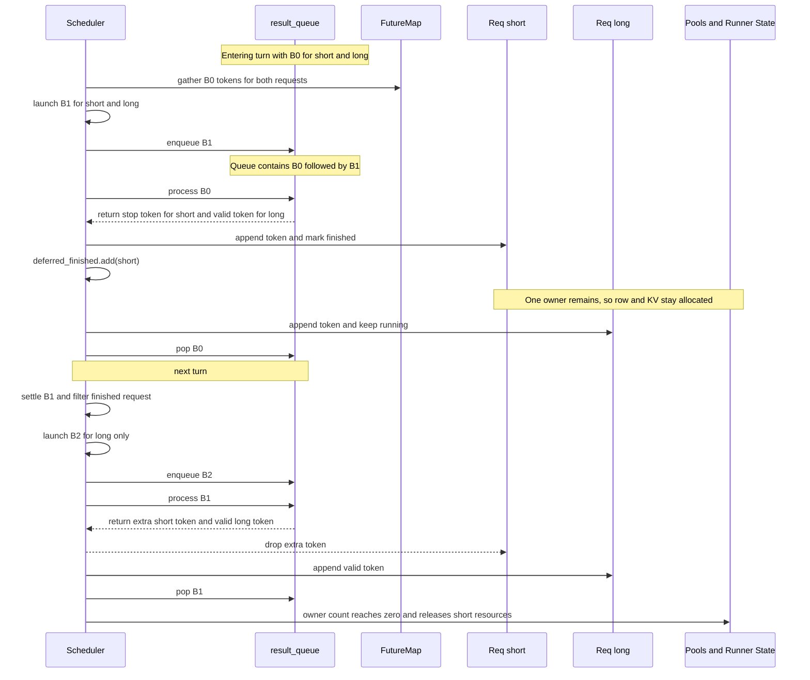

## 6. MLX specialization

MLX 后端设置 `overlap_backend = "mlx_chained"`。它不用通用路径的 Python token tuple 充当 device buffer，而是直接把 previous lazy decode handle 交给：

```python
decode_batch_start_chained(previous_decode_handle)
```

MLX 从 prefill 进入 decode 时会先打断 chain，因为 prefill result 必须 finalize 后才能建立正常请求输出状态：

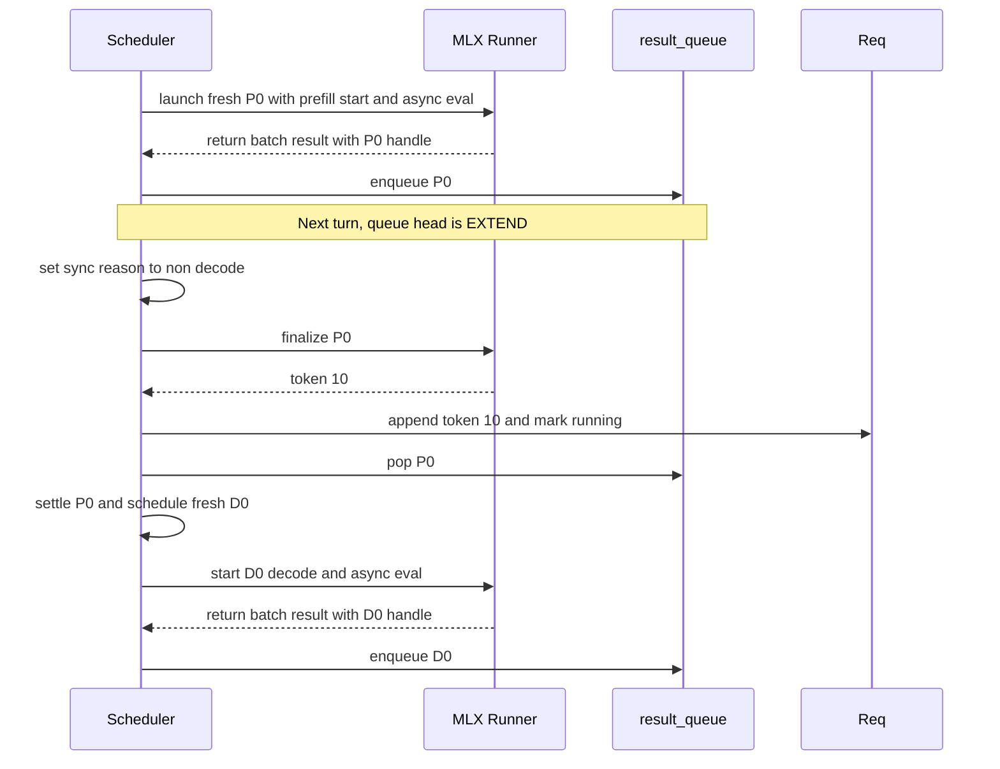

进入纯 decode 后，稳定时序如下：

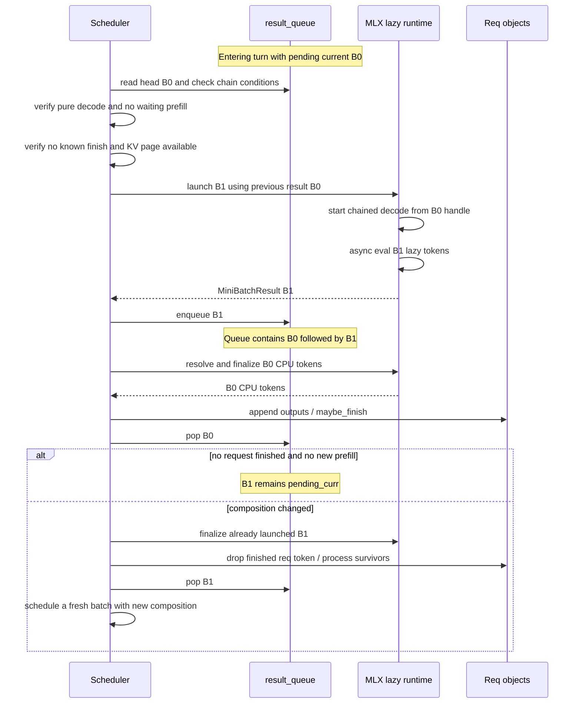

MLX chain 在以下情况断开并回到 fresh scheduling：

- 队首不是纯 decode；
- 有 waiting prefill；
- 前驱处理后有请求完成，后继组成需要缩小；
- decode page 不足；
- drain 或失败恢复。

两条后端路径共享 `MiniBatchResult`、FIFO snapshot、in-flight owner、延迟释放和 replay 规则，但 token 依赖表达不同：

| 维度 | 通用 FutureMap | MLX chained lazy |
|---|---|---|
| 下一 token 载体 | pool-indexed device buffer 抽象 | previous lazy handle |
| 当前 batch 如何取输入 | `gather(req_pool_indices)` | lazy graph 直接引用前图 |
| CPU materialize | completion event + resolve | MLX finalize / `.tolist()` |
| steady decode launch | 普通 `run_batch_async` | `run_batch_async(..., previous_result=...)` |

## 7. Manual transaction scheduler

`MiniManualOverlapScheduler` 是独立类，不与生产 driver 混用：

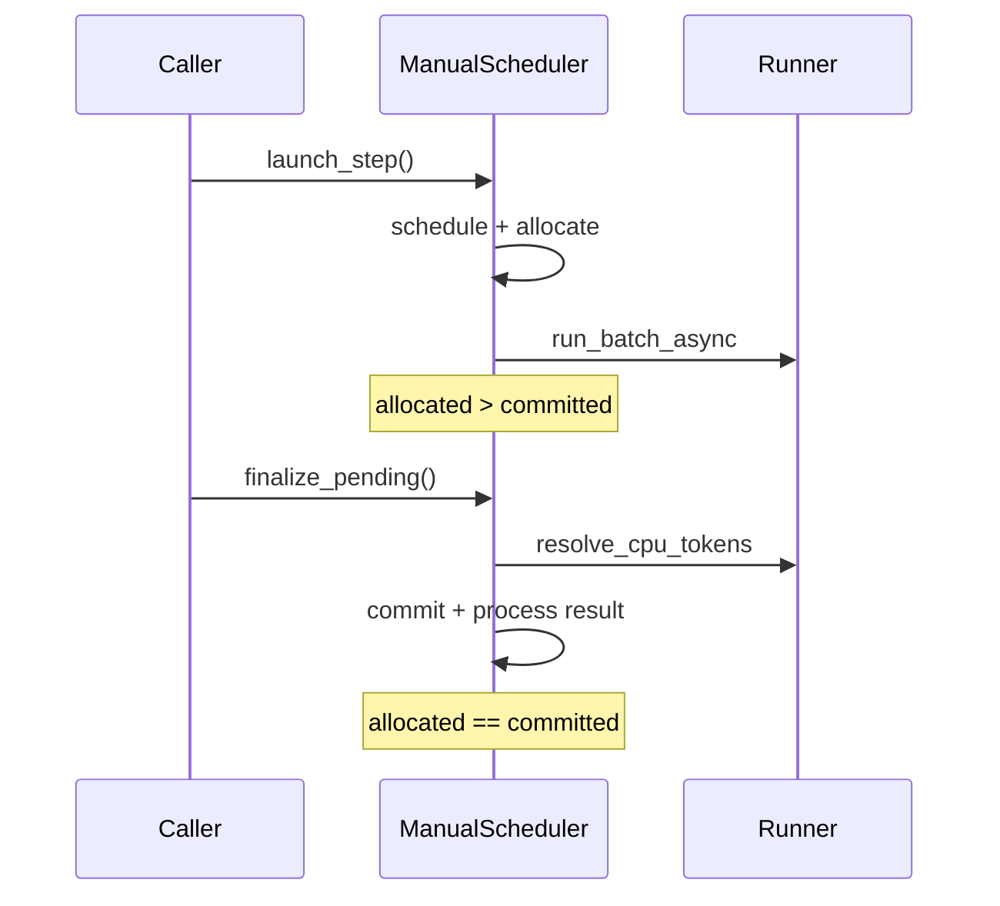

pending 存在时禁止第二次 launch。失败时只需 rollback 当前未提交 allocation；生产 overlap 失败则必须清理整条在途队列。

## 8. 失败恢复

假设队列是 `[B0, B1]`，B0 的 CPU resolve 抛异常。B1 依赖的请求状态和 KV 规划已经建立在 B0 之上，不能只丢 B0：

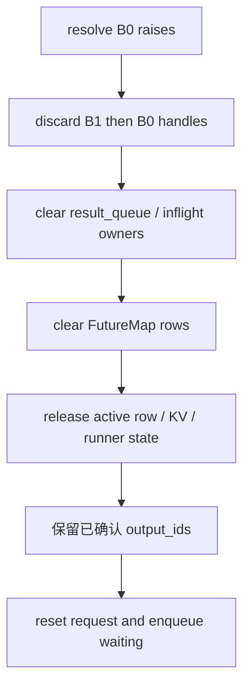

Replay 的输入是 `prompt + 已确认 output_ids`。设备上已产生、但尚未按 FIFO 提交的 token 不算确认结果。

## 9. 核心不变量

1. `result_queue` 返回时最多深度 1，turn 内最多深度 2。
2. CPU result 只能按 FIFO 提交。
3. 通用 decode 输入必须来自当前 request row 的 FutureMap token。
4. row 释放或重用前必须 `FutureMap.clear(row)`。
5. `_inflight_refs` 必须等于所有 queue snapshot 中 request 引用的计数。
6. `FINISHED` 请求若仍有 owner，只能进入 deferred set，不能释放 row/KV。
7. batch result 的 request 顺序、row、seq length 必须使用 launch snapshot。
8. 普通生产 overlap launch 成功后 `allocated == committed`；manual pending 才允许不相等。
9. 内存 retract 前必须先消除仍引用相关请求的旧结果。
10. 失败恢复只保留已经按 FIFO 写入 `output_ids` 的 token。

## 10. 场景与测试映射

| 场景 | 测试 |
|---|---|
| FutureMap stash/gather/clear/row reuse | `test_future_map_stash_gather_clear_and_row_reuse` |
| Manual allocate/commit 窗口 | `test_manual_scheduler_keeps_explicit_allocate_commit_window` |
| Manual 只允许一个 pending | `test_manual_scheduler_enforces_one_pending_batch` |
| Decode 在 prefill CPU process 前 launch | `test_future_map_launches_decode_before_processing_prefill_result` |
| 稳态 decode launch 当前批再处理上一批 | `test_steady_decode_launches_current_before_processing_previous` |
| 新 prefill 与上一 decode result processing 重叠 | `test_new_prefill_launches_before_previous_decode_is_processed` |
| Chunk snapshot 限制 cache commit 边界 | `test_chunked_prefill_batches_overlap_but_cache_only_snapshot_boundary` |
| 多请求 finish、多算 token 丢弃、延迟释放 | `test_finished_request_successor_stays_fifo_and_extra_token_is_skipped` |
| Decode 内存不足先同步上一结果 | `test_decode_memory_syncs_previous_before_normal_oom_handling` |
| 结果失败后清队列并 replay confirmed prefix | `test_result_failure_discards_queue_and_replays_confirmed_prefix` |
| Drain 只处理、不继续 launch | `test_drain_processes_inflight_result_without_launching_another` |
| MLX 保留 chained lazy specialization | `test_mlx_backend_keeps_chained_lazy_specialization` |
| 真实本地 MLX 生命周期 | `test_real_mlx_overlap_prefill_decode_lifecycle` |

运行：

```bash
uv run --extra test pytest tests/test_overlap_utils.py tests/test_overlap_scheduler.py -q
PYTHONPATH=src:../python ../python/.venv/bin/python -m pytest \
  tests/test_mlx_integration.py -q
```

## 11. 与当前 SGLang SRT 的对应与边界

| my-sglang | SGLang SRT | 对齐内容 |
|---|---|---|
| `MiniFutureMap.output_tokens_buf` | `FutureMap.output_tokens_buf` | pool-indexed 跨 iteration relay |
| `resolve_forward_inputs()` | 同名 helper | prefill staging / decode gather 在 forward 入口解析 |
| `MiniBatchResult.copy_done` | `GenerationBatchResult.copy_done` | 延迟 D2H completion |
| `_result_queue` | `Scheduler.result_queue` | `batch.copy() + result` FIFO |
| `overlap_step()` | `event_loop_overlap()` 单轮 | launch current，再 process previous |
| MLX backend branch | `event_loop_overlap_mlx()` | previous lazy decode handle 构建 successor |

教学版没有模拟：CUDA stream/event record 的真实时序、speculative extras、grammar barrier、DP/TP 同步、mixed batch、sampling/logprob、多模态和分布式 worker。它对齐的是 overlap 的控制流、数据依赖和资源生命周期，而不是复制生产代码的全部分支。

## 12. 阅读顺序

1. 先读 `MiniFutureMap` 和 `resolve_forward_inputs()`；
2. 再读 `MiniBatchResult.resolve_cpu_tokens()`；
3. 跟 `_overlap_step_future_map()` 的 launch-before-process 顺序；
4. 看 `_enqueue()`、`_process_oldest()` 和 `_defer_finish()` 的所有权；
5. 最后看 `_overlap_step_mlx()`，比较同一契约如何换成 lazy chained handle。
