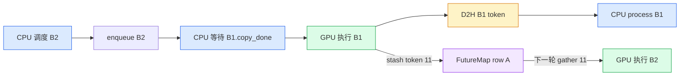
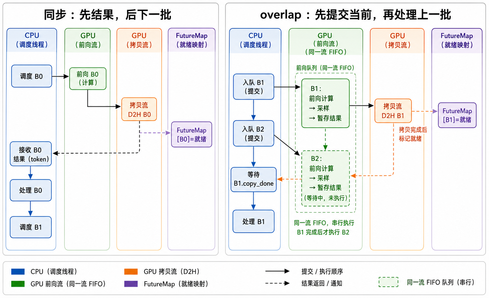
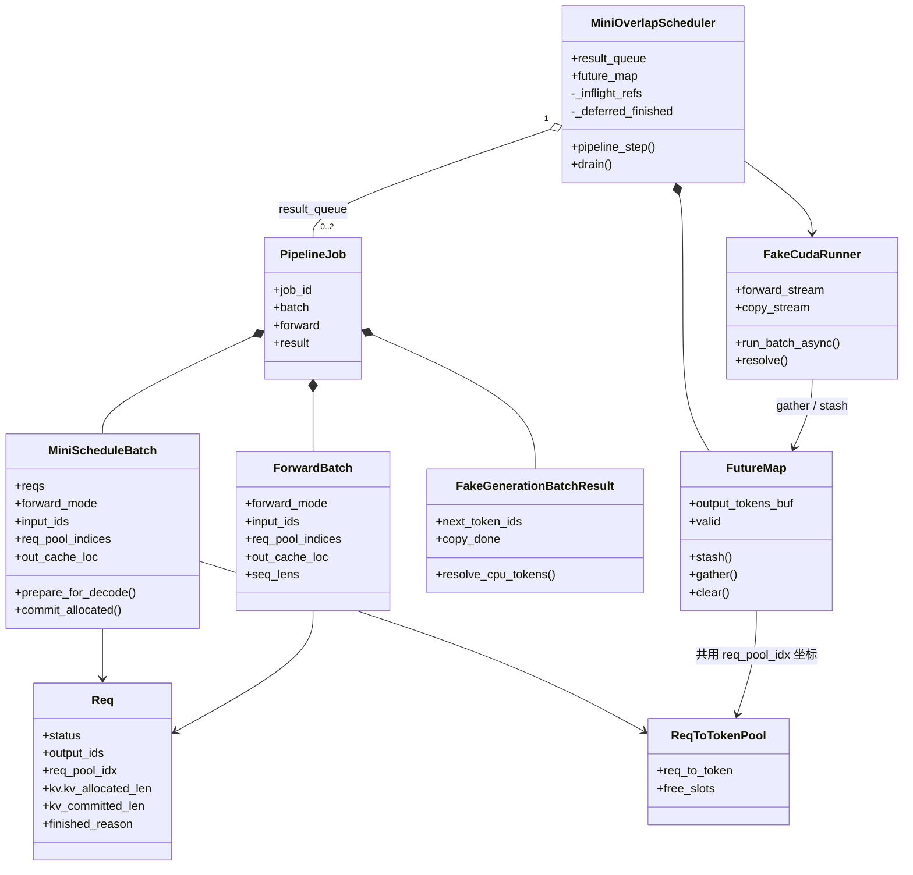
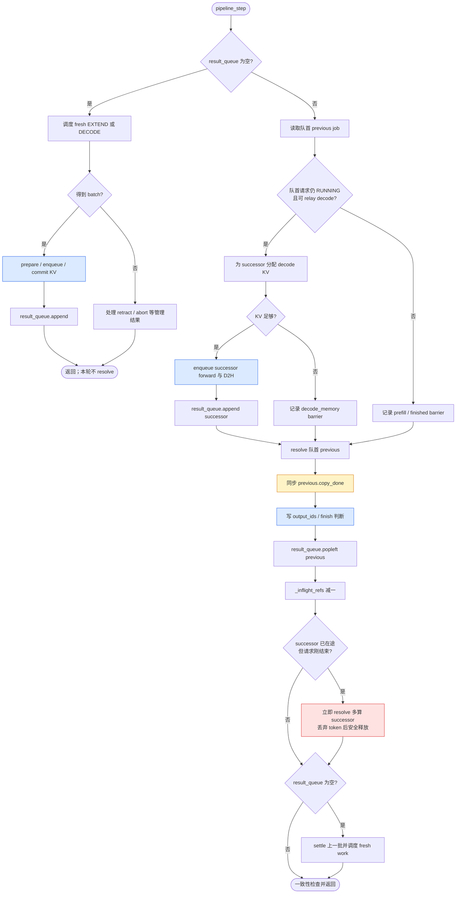
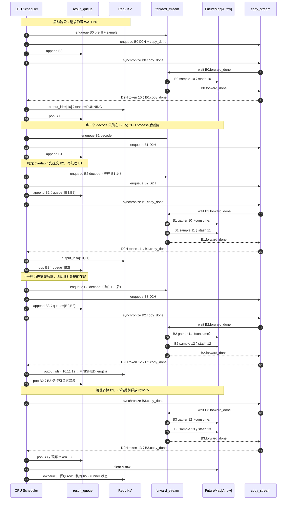
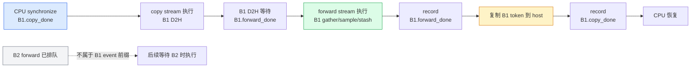
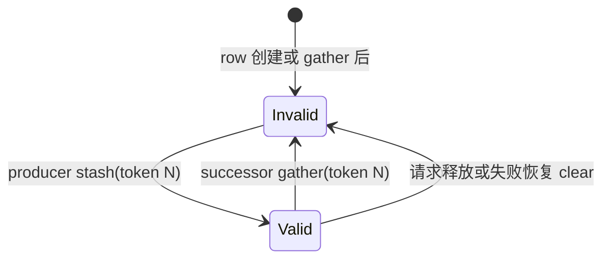
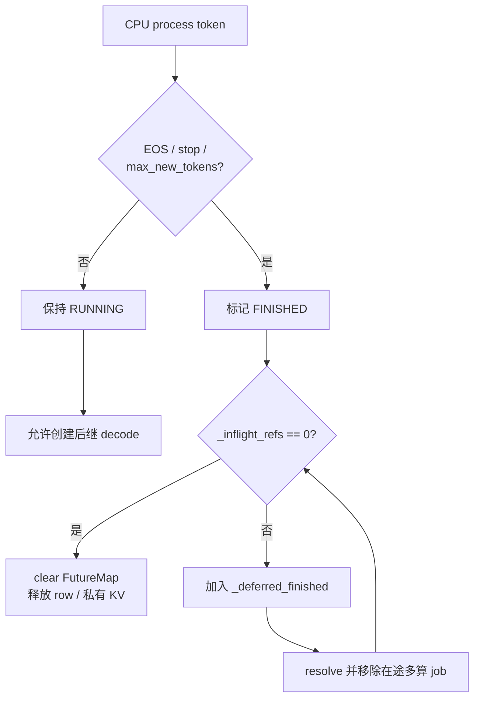
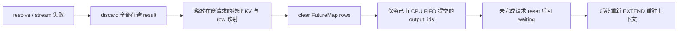

# Fake CUDA overlap pipeline

本文描述 `my-sglang` 当前实现：CPU 不运行 CUDA，但用确定性的 forward/copy
双逻辑 stream 和 event，对齐 SGLang 基础 generation overlap 的核心因果。

## 1. 先看结论

overlap 不是让同一请求的 B1、B2 forward 并行执行，而是把 CPU 调度/结果处理与
GPU FIFO 执行错开一拍：



关键顺序只有两条：

```text
CPU：launch current B2 -> resolve/process previous B1
GPU：B1 gather/sample/stash -> B2 gather/sample/stash
```

首个 prefill 不能直接进入这条稳定 relay。CPU 必须先 process prefill 结果，让请求
进入 `RUNNING`，之后才能创建第一个 decode batch。



图片中的 B2 是“已提交、等待同一条 forward FIFO 的工作”，不是与 B1 同时执行的
第二次 forward。这个区别是理解 overlap 的第一道关：它重叠的是 CPU 调度/提交与 GPU
已入队工作的进度，而不是打破单 stream 的 token 因果。

## 2. 核心模型图



`FutureMap[row]` 和 `ReqToTokenPool[row]` 只是共用稳定的 `req_pool_idx` 坐标，内容
完全不同：

| 对象 | `row` 中保存什么 | 消费者 |
|---|---|---|
| `FutureMap.output_tokens_buf[row]` | 上一个 batch 采样出的 token | 后继 decode 的 forward stream |
| `ReqToTokenPool.req_to_token[row, pos]` | 逻辑 token 位置对应的物理 KV slot | attention / KV 管理 |
| `Req.output_ids` | CPU 已按 FIFO 确认的用户输出 | finish 判断与最终返回 |

## 3. 一次 `pipeline_step()` 的详细流程



`launch` 成功后就提交 KV 水位，因为 forward 已经进入 pipeline；延迟到队首
`copy_done` 的是 CPU token、finish 判断与资源释放。

## 4. B0 到 B3 的完整时序

设请求 A 的 prompt 是 `[1,2]`，`max_new_tokens=3`，模型依次采样
`10,11,12,13`。B0 是 prefill，B1/B2 是有效 decode，B3 是 overlap 提前提交的
多算 decode。



这里能看出三件事：

1. `10` 既进入 CPU 的 `output_ids`，也通过 `FutureMap` 成为 B1 的设备侧输入。
2. `B1 stash(11)` 一定排在 `B2 gather(11)` 前，因为它们位于同一个 forward stream。
3. B3 虽然是多算，也必须执行/退出 result queue 后才能释放请求资源。

## 5. event 如何只推进必要前缀

Fake CUDA 不模拟真实耗时，只模拟 FIFO 和 event 依赖。等待 `B1.copy_done` 时的依赖链：



因此 `synchronize(B1.copy_done)` 不会顺带执行 B2。真实 CUDA 会自主异步推进，
不需要等 CPU 调用 `synchronize()` 才工作；但相同 stream 的 FIFO 和 event 依赖不变。

把它当作“只补齐到收据所需的账目”：`B1.copy_done` 的依赖只包含 B1 的 forward、
forward event、B1 的 D2H 和 copy event；虽然 B2 已排在后面，它不在这张收据的前缀中。
`test_fake_cuda_event_only_advances_required_forward_prefix` 就断言了这一点。

## 6. 四本账与不变量

| 账本 | 写入时机 | 读取时机 | 核心不变量 |
|---|---|---|---|
| `FutureMap` | forward sample 后 `stash` | 后继 decode `gather` | 每次 gather 必须对应一个更新后的 producer token |
| `result_queue` | batch enqueue 后 | CPU 严格 FIFO resolve/process/pop | 深度最多 2；不能越过队首提交结果 |
| `Req` | CPU process result | 下一轮调度、finish 判断 | `output_ids` 只包含 CPU 已确认 token |
| `_inflight_refs` | job 入队加一，出队减一 | 请求完成或失败清理 | owner 不为 0 时不能释放 row/KV |



教学版 `FutureMap.valid` 显式实现 consume-once。标准 SRT 生产路径不依赖这个 bool，
但 CI debug 同样会 poison/invalidate 已消费位置，用来发现“没有新 producer 就再次
gather”的错误。

## 7. finish、资源延迟释放与多算



CPU 在 launch B3 时还没看到 B2 的 token 12，所以无法提前知道请求会达到
`max_new_tokens=3`。B2 process 后请求才变成 `FINISHED`；此时 B3 已持有快照、row
和 KV，必须先安全 drain。B3 的 token 13 不会进入 `Req.output_ids`。

## 8. 失败恢复

resolve 或 Fake stream 执行失败时，不能只丢一个队首，否则 FutureMap、KV 水位和
在途 owner 会失去一致性。恢复按整条 pipeline 处理：



## 9. 与标准 SGLang SRT 的对应

| my-sglang | 标准 SRT | 对齐边界 |
|---|---|---|
| `FutureMap.output_tokens_buf` | 同名字段 | 基础 token relay 对齐 |
| `FutureMap.stash/gather` | `stash` / `resolve_forward_inputs` | 职责对齐；标准版还 relay seq lens 和高级 payload |
| `FakeCudaRunner.forward_stream` | scheduler/model forward stream | FIFO 因果对齐，不模拟真实性能 |
| `FakeCudaRunner.copy_stream` |异步 D2H copy stream | event 依赖对齐 |
| `FakeGenerationBatchResult.copy_done` | `GenerationBatchResult.copy_done` | CPU 可读边界对齐 |
| `result_queue` | `Scheduler.result_queue` | launch current、process previous 的 FIFO 对齐 |
| `pipeline_step()` | `Scheduler.event_loop_overlap()` 主循环 | 基础 generation 分支对齐 |

连续 prefill/chunk overlap 不塞进本章的基础 decode relay，单独见
[prefill overlap](prefill-overlap.md)。speculative decoding 与 grammar 不在本文范围。

## 10. 代码和测试入口

| 阅读顺序 | 文件 | 观察点 |
|---:|---|---|
| 1 | [`runner.py`](../src/my_sglang/runner.py) | stream FIFO、event、gather/stash、D2H |
| 2 | [`overlap_scheduler.py`](../src/my_sglang/overlap_scheduler.py) | enqueue current、finalize previous、owner 计数 |
| 3 | [`test_overlap_scheduler.py`](../tests/test_overlap_scheduler.py) | 顺序、队列深度、finish 多算与失败恢复断言 |
| 4 | [`newcomer-guide.md`](newcomer-guide.md) | 单请求 trace 的逐步解释 |
