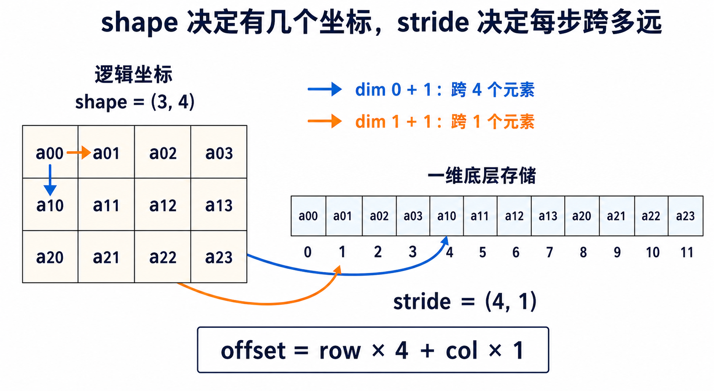

# PyTorch 基础概念：从 Tensor 到 stride

本文解释阅读 `my-sglang/examples/triton` 时反复出现的 PyTorch 概念。目标不是介绍完整的
PyTorch 训练框架，而是先回答这些最容易卡住的问题：tensor 的 shape 在说什么、`dim` 是
什么、`stride(0)` 为什么表示跨到下一行、广播和归约怎样改变 shape，以及 dtype 和 device
为什么必须匹配。

## 1. Tensor 不只是一堆数字

PyTorch 的 `Tensor`（张量）可以先理解为“带有描述信息的多维数组”。数字保存在底层存储中，
Tensor 还要记录应该怎样解释这些数字：

```python
import torch

x = torch.tensor(
    [[10, 11, 12], [20, 21, 22]],
    dtype=torch.float32,
    device="cpu",
)

print(x.shape)       # torch.Size([2, 3])
print(x.size())      # torch.Size([2, 3])
print(x.ndim)        # 2
print(x.numel())     # 6
print(x.dtype)       # torch.float32
print(x.device)      # cpu
print(x.stride())    # (3, 1)
```

| 属性 | 它回答的问题 | 上例结果 |
|---|---|---|
| `shape` | 每个维度分别有多少个位置？ | `(2, 3)` |
| `size()` | shape 的方法形式；也可以用 `size(d)` 读取某一维长度 | `(2, 3)` |
| `ndim` | 一共有几个维度？ | `2` |
| `numel()` | 一共有多少个元素？ | `6` |
| `dtype` | 每个元素用什么数据类型解释？ | `float32` |
| `device` | 数据放在 CPU 还是哪张 GPU 上？ | `cpu` |
| `stride()` | 每个维度前进一步，底层存储要跨多少个元素？ | `(3, 1)` |

这些概念不能混在一起。`shape=(2,3)` 描述逻辑外形，不表示数据一定使用二维内存；底层内存
仍可以看成一条连续的元素序列，shape 和 stride 决定如何从多维坐标找到其中某个元素。

## 2. dimension、axis 和 `dim` 是什么

dimension（维度）和 axis（轴）在这里通常表达同一个概念。PyTorch API 常把参数写成
`dim`。维度从 0 开始编号：

```text
x.shape == (2, 3)
           │  │
       dim 0  dim 1
```

对于二维张量，可以暂时把 `dim 0` 叫作行维，把 `dim 1` 叫作列维。但“行、列”只适合
二维情况；维度真正的含义应该由业务 shape 决定：

| shape | 各维常见含义 |
|---|---|
| `[rows, hidden]` | `dim 0` 是 token 行，`dim 1` 是 hidden feature。 |
| `[batch, sequence, hidden]` | `dim 0` 是 batch，`dim 1` 是 token，`dim 2` 是 hidden feature。 |
| `[batch, heads, context, head_dim]` | `dim 0`～`3` 分别是 batch、head、上下文位置和 head feature。 |

所以 `stride(2)` 不是固定代表某种方向。它表示“**第 2 个维度**的下标增加 1 时要跨多远”，
而且只有 `ndim >= 3` 时才存在。二维 Tensor 调用 `stride(2)` 会因为维度越界而报错。

PyTorch 还允许从后向前编号：

```text
正编号：     0       1       2
shape = [batch, sequence, hidden]
负编号：    -3      -2      -1
```

因此 `x.shape[-1]` 和 `x.shape[2]` 都表示最后的 hidden dimension。`dim=-1` 常用于表达
“不管前面有多少个 batch 维，都沿最后一维计算”。

## 3. shape、索引和切片

`shape[d]` 读取第 `d` 个维度的长度；`x[...]` 才是在读取 Tensor 的内容：

```python
x = torch.tensor([[10, 11, 12], [20, 21, 22]])

x.shape[0]   # 2：有两行
x.shape[1]   # 3：每行有三列
x[1, 2]      # tensor(22)：第 1 行、第 2 列
x[0]         # tensor([10, 11, 12])：取第 0 行
x[:, 1]      # tensor([11, 21])：所有行的第 1 列
```

冒号 `:` 表示保留该维度的全部位置。整数索引通常会消去对应维度：`x[0]` 从 shape `(2,3)`
变成 `(3,)`；切片通常保留维度：`x[0:1]` 的 shape 是 `(1,3)`。

### 基础索引和高级索引可能有不同的内存关系

基础索引通常产生共享底层存储的 view，高级索引通常产生一份新数据：

```python
x = torch.arange(6)

slice_view = x[1:4]       # 基础切片：通常是 view
index_copy = x[[1, 3, 4]] # 整数列表索引：通常是 copy
mask_copy = x[x > 2]      # 布尔索引：通常是 copy
```

因此修改 `slice_view` 可能同时改变 `x`，修改 `index_copy` 则不会写回 `x`。不过，像
`x[[1,3]] = 0` 这样的**索引赋值**会直接修改 `x`；不要把“读取产生 copy”和“赋值是否修改
左侧 Tensor”混为一谈。

## 4. stride：从逻辑坐标走到底层存储

先记住一句话：

> `shape` 决定每个维度有多少个位置；`stride(d)` 决定第 `d` 个维度前进一步时，内存地址
> 跨过多少个元素。



图中的 Tensor 有 3 行、每行 4 列：

```python
x.shape     # (3, 4)
x.stride()  # (4, 1)
```

- `stride(0) == 4`：第 0 维的下标加 1，也就是从 `x[0, col]` 到 `x[1, col]`，需要跨过
  4 个元素。
- `stride(1) == 1`：第 1 维的下标加 1，也就是从 `x[row, 0]` 到 `x[row, 1]`，需要跨过
  1 个元素。

不要把 `stride(1)` 误读成“stride 的值是 1”。括号里的 `1` 是维度编号；函数返回的结果
才是这个维度对应的内存距离。

对图中这份新创建、`storage_offset() == 0` 的 Tensor，二维元素的地址偏移可以写成：

```text
offset = row × stride(0) + col × stride(1)
```

例如 `x[2,3]` 的偏移是：

```text
2 × 4 + 3 × 1 = 11
```

这正是图中一维存储的第 11 号位置。PyTorch 的 stride 单位是**元素个数**，不是字节数；
底层在处理具体 dtype 时，才会把元素距离换算成字节地址。

对于任意 strided Tensor，更完整的底层存储位置公式是：

```text
storage position = storage_offset
                 + i0 × stride(0)
                 + i1 × stride(1)
                 + ...
```

`storage_offset()` 表示这个 Tensor 的第一个逻辑元素从共享 storage 的哪个位置开始。比如：

```python
base = torch.arange(12).reshape(3, 4)
view = base[1:, 1:]

view.shape             # (2, 3)
view.stride()          # (4, 1)
view.storage_offset()  # 5，对应 base[1, 1]
```

因此 `view[1,2]` 在底层 storage 中的位置是 `5 + 1×4 + 2×1 = 11`。shape、stride 和
storage offset 合在一起，才完整描述一个 view 怎样解释共享存储。

### 三维和四维 Tensor 的 stride

连续 Tensor 的最后一维通常 stride 为 1，越靠前的维度需要跨过的元素越多。比如：

```python
x = torch.empty((2, 3, 4))

x.shape     # (2, 3, 4)
x.stride()  # (12, 4, 1)
```

它的地址公式是：

```text
offset = i × 12 + j × 4 + k × 1
```

因此 `x[1,2,3]` 的偏移为 `1×12 + 2×4 + 3×1 = 23`。

Attention 示例中的 key shape 是 `[B,H,N,D]`。对应的一般地址公式为：

```text
offset = b × stride(0)
       + h × stride(1)
       + n × stride(2)
       + d × stride(3)
```

这就是 `07_attention.py` 要把 `key.stride(0)` 到 `key.stride(3)` 全部传给 Triton kernel
的原因：kernel 需要用逻辑坐标 `(b,h,n,d)` 算出真实 pointer offset。

### `values.stride(0)` 在 RMSNorm 中具体做什么

`04_rmsnorm.py` 把输入看成 `[n_rows, n_cols]`，一个 Triton program 处理一行：

```python
input_row_ptr = input_ptr + row_idx * input_row_stride
```

调用 kernel 时传入：

```python
values.stride(0)  # input_row_stride
output.stride(0)  # output_row_stride
```

因此 `row_idx * input_row_stride` 用来跳到输入第 `row_idx` 行的行首；输出 stride 则用来
找到输出对应行的行首。输入和输出分别传 stride，是因为二者是不同 Tensor，kernel 不应该
偷偷假设它们永远有相同布局。

这个示例只传行 stride，没有传列 stride，是因为它先要求 `values.is_contiguous()`。对标准
连续二维 Tensor，`stride(1) == 1`，所以行内第 `col` 个元素可以直接写成
`input_row_ptr + col`。

## 5. contiguous、转置、view 和 copy

Tensor 的逻辑顺序和底层存储顺序不一定相同。转置通常只修改 shape 和 stride，不搬动数据：

```python
x = torch.arange(12).reshape(3, 4)
y = x.T

x.shape, x.stride()  # (3, 4), (4, 1)
y.shape, y.stride()  # (4, 3), (1, 4)
```

`y[0,1]` 在逻辑上是下一行，但它映射回原存储中的 `x[1,0]`，所以需要跨 4 个元素。此时
`y.is_contiguous()` 通常是 `False`：按照 `y` 的逻辑顺序遍历元素时，地址不再是简单地每次
加 1。

```python
y.is_contiguous()  # False
z = y.contiguous()
z.is_contiguous()  # True
```

`contiguous()` 会在需要时创建一份按当前逻辑顺序重新排列的数据；如果原 Tensor 已经符合
目标连续布局，则可能直接返回原 Tensor。它不只是“改一个标记”。

几个容易混淆的操作：

| 操作 | 是否一定复制数据 | 作用 |
|---|---:|---|
| `transpose()` / `.T` | 否 | 通常只产生共享底层存储的新视图，并交换 shape/stride。 |
| `view(new_shape)` | 否 | 只在现有布局允许时用新 shape 观察同一份数据，否则报错。 |
| `reshape(new_shape)` | 否 | 能做 view 时复用存储，否则可能自动复制；不要依赖它一定共享数据。 |
| `permute(dims)` | 否 | 重新排列维度顺序，通常只修改 shape/stride。 |
| `flatten(...)` | 否 | 合并一段维度；可能返回 view，也可能复制。 |
| `unsqueeze(d)` / `squeeze(d)` | 否 | 插入或移除长度为 1 的维度。 |
| `contiguous()` | 否 | 已连续时可复用，否则复制成连续布局。 |
| `clone()` | 是 | 明确复制出一份新数据。 |

切片也可能产生带间隔的 view。例如 `x[:, 1:3]` 的逻辑内容只保留中间两列，但相邻两行之间
仍要跨过原来一整行的距离。除了 shape 和 stride，Tensor 还记录 `storage_offset()`，表示
这个 view 的第一个逻辑元素从底层存储的什么位置开始。

### view、共享存储和原地修改

view 和原 Tensor 看到的是同一份底层数据：

```python
base = torch.arange(6)
view = base.view(2, 3)

view[0, 0] = 99
base[0]             # tensor(99)
```

PyTorch 中名字以 `_` 结尾的方法通常表示原地操作，例如 `add_()`、`zero_()`。原地修改一个
view 时，其他共享这份 storage 的 Tensor 也可能看到变化。如果需要一份互不影响的数据，
应显式使用 `clone()`；仅仅换一个 Python 变量名不会复制 Tensor。

## 6. 广播：shape 不同也能逐元素计算

broadcasting（广播）允许 shape 不完全相同的 Tensor 做逐元素运算。PyTorch 从最后一维
向前对齐；对应维度必须相等、其中一个为 1，或者其中一方没有该维度。

RMSNorm reference 正好包含两个广播：

```python
values_fp32.shape  # [rows, hidden]
inv_rms.shape      # [rows, 1]
weight.shape       # [hidden]

output = values_fp32 * inv_rms * weight
```

对齐后可以这样看：

```text
values_fp32    [rows, hidden]
inv_rms        [rows,      1]  # 这一列沿 hidden 维广播
weight         [      hidden]  # 这一行沿 rows 维广播
结果           [rows, hidden]
```

广播不是把数学意义改成矩阵乘法；这里的 `*` 仍然是逐元素乘法。概念上好像把单行或单列
重复了很多份，但实现通常不需要真的物化这些重复数据。

### `expand` 为什么会产生 stride 0

`expand` 可以把长度为 1 的维度扩展成更大的逻辑维度，同时仍然复用同一个底层元素：

```python
x = torch.tensor([[1], [2], [3]])
y = x.expand(3, 4)

y.shape     # (3, 4)
y.stride()  # (1, 0)
```

`stride(1) == 0` 表示第 1 维的列下标虽然在变化，底层位置却不前进。因此 `y[0,0]` 到
`y[0,3]` 都读取 `x[0,0]`。这就是“广播好像重复了数据，但通常不需要真的复制”的底层解释。

由于多个逻辑位置可能指向同一个存储位置，不要直接对 expanded view 做逐元素原地写入。
如果确实需要一份可独立修改的完整数据，可以使用 `clone()`；`repeat(1,4)` 也会实际构造重复
数据，但它表达的是复制内容，不是零拷贝广播。

## 7. reduction、`dim` 和 `keepdim`

reduction（归约）是把一个维度上的多个数汇总成更少的数，例如 `sum`、`mean`、`max`。

```python
x = torch.tensor([[1.0, 2.0, 3.0], [10.0, 20.0, 30.0]])

x.mean(dim=1)                # shape [2]，每一行得到一个数
x.mean(dim=1, keepdim=True)  # shape [2, 1]，保留长度为 1 的列维
```

`keepdim=True` 不是让结果多算一个值，而是保留被归约的维度，长度设为 1。RMSNorm 使用：

```python
values_fp32.square().mean(dim=1, keepdim=True)
```

输入 `[rows, hidden]` 沿 hidden 维求平均后得到 `[rows,1]`，随后可以自然广播回
`[rows,hidden]`。如果没有 `keepdim=True`，结果是 `[rows]`；广播会尝试把这个长度与
`hidden` 对齐，通常不是想要的含义，甚至会直接报 shape 不匹配。

类似地，`torch.softmax(values, dim=1)` 表示每一行内部做 Softmax；
`torch.softmax(scores, dim=-1)` 表示沿最后一维做 Softmax。

如果已经得到 shape `[rows]`，也可以用 `x.unsqueeze(1)` 插入一个长度为 1 的维度，变成
`[rows,1]`；`squeeze(1)` 则只在第 1 维长度为 1 时把它移除。它们改变的是看待数据的 shape，
不是凭空增加或删除数值。

## 8. 逐元素运算、矩阵乘和 `einsum`

看到运算符时，先判断它在混合哪一维：

| 写法 | 类型 | shape 例子 |
|---|---|---|
| `x + y`、`x * y`、`x.square()` | 逐元素运算，可使用广播 | `[R,D] * [D] -> [R,D]` |
| `a @ b`、`torch.matmul(a,b)` | 矩阵乘或批量矩阵乘 | `[M,K] @ [K,N] -> [M,N]` |
| `torch.mean(x, dim=d)` | 沿指定维归约 | `[R,D] -> [R]` 或 `[R,1]` |
| `torch.einsum(...)` | 用字母显式描述保留和归约的维度 | `bhd,bhnd->bhn` |

Attention reference 中：

```python
torch.einsum("bhd,bhnd->bhn", query, key)
```

`b` 和 `h` 保留下来，`n` 出现在输出中，`d` 没出现在输出中，所以沿 `d` 做点积求和。
`einsum` 字母只是维度标签，不是变量名，也不要求一定使用这些特定字母。

## 9. dtype：元素用什么精度保存和计算

常见浮点 dtype 包括 `torch.float32`、`torch.float16` 和 `torch.bfloat16`。dtype 影响：

- 每个元素占用多少内存。
- 能表示的数值范围和精度。
- GPU 能使用哪些计算指令，以及性能如何。

```python
x.dtype                 # 查看 dtype
x.float()               # 转成 float32
x.to(torch.float16)     # 转成 float16
x.to(dtype=target_dtype)
```

RMSNorm reference 先用 `values.float()` 转成 FP32，再做平方和归约，因为许多项累加时 FP32
通常比 FP16/BF16 更不容易积累舍入误差；最后 `.to(values.dtype)` 转回调用者期望的输出
dtype。转换 dtype 通常意味着创建新数据，不能把它当作只改元信息的 view。

### dtype promotion 与累加精度

不同 dtype 参与同一个 PyTorch 运算时，框架会按照 type promotion 规则决定结果 dtype；
不要简单假设结果永远跟左侧或精度更高的一侧相同。拿不准时应直接检查：

```python
torch.result_type(x, y)  # 预测二元运算的结果 dtype
result = x + y
result.dtype
```

`my-sglang` 的 kernel wrapper 通常要求输入 dtype 完全相同，是为了让 kernel 的输入、输出和
reference 具有明确约定，而不是依赖隐式 promotion。

归约会累加很多元素，存储 dtype 和累加 dtype 也不一定要相同。需要明确控制精度时，可以先
像 RMSNorm reference 一样转成 FP32，或者在支持 `dtype=` 的归约 API 中显式指定累加 dtype。
不要因为输入是 FP16，就默认所有中间计算也必须使用 FP16。

注意 `torch.Tensor.to(...)` 和 Triton kernel 中的 `x.to(tl.float32)` 属于两个不同 API；
它们表达的意图相似，但一个运行在 PyTorch 侧，一个运行在 Triton program 中。

## 10. device：数据在哪里

`device` 描述 Tensor 位于 CPU 还是某个加速设备：

```python
cpu = torch.device("cpu")
cuda = torch.device("cuda")

x.device
x_cuda = x.to(cuda)
```

参与同一个算子的 Tensor 通常必须在同一 device 上。比如 CPU Tensor 和 CUDA Tensor 不能
直接相加；这就是示例在 launch kernel 前检查 `values.device == weight.device` 的原因。

CUDA 操作通常是异步提交的：Python 调用返回时，GPU 可能仍在工作。准确计时或在 CPU 上
依赖 GPU 已完成的结果时，可能需要 `torch.cuda.synchronize()`；但不要在每个普通算子后
无条件同步，否则会破坏 CPU/GPU overlap。

### Tensor、Python、NumPy 之间的边界

几个常见转换的目标不同：

```python
x_cpu = x_cuda.cpu()  # 把数据放到 CPU
value = scalar.item() # 单元素 Tensor 变成 Python 数字
array = x_cpu.numpy() # CPU Tensor 与 NumPy 数组之间转换
```

- `.item()` 只适用于恰好包含一个元素的 Tensor。
- CUDA Tensor 不能直接调用普通 `.numpy()`，要先转到 CPU。
- 从 CUDA 结果取得 Python 数字、CPU Tensor 或 NumPy 数据时，CPU 必须等相应 GPU 工作
  完成，因此这些操作可能成为隐式同步点。
- `.detach()` 只切断 autograd 关系，不等于复制数据；如果还要与原 Tensor 彻底分离，可以
  使用 `.detach().clone()`。

调试时偶尔读取一个标量很方便，但不要在高频推理循环中对每个 token 随意 `.item()`，否则
可能把本来异步的 GPU 流水线变成一轮一轮等待。

## 11. 常见 Tensor 创建函数

`my-sglang/examples/triton` 经常使用这些函数准备输入和输出：

| 函数 | 含义 | 注意点 |
|---|---|---|
| `torch.tensor(data)` | 从已有 Python 数据创建 Tensor | 可显式指定 dtype/device。 |
| `torch.arange(n)` | 创建 `0,1,...,n-1` | 常用于容易检查的顺序输入。 |
| `torch.randn(shape)` | 从标准正态分布采样 | 常用于数值测试输入。 |
| `torch.empty(shape)` | 只分配内存，不初始化内容 | 必须在读取前由 kernel 或其他操作完整写入。 |
| `torch.zeros(shape)` | 分配并用 0 初始化 | 比 `empty` 多了初始化工作。 |
| `torch.empty_like(x)` | 创建与 `x` 相同 shape、dtype、device 的未初始化 Tensor | 适合作为输出。 |
| `torch.randn_like(x)` | 创建与 `x` 属性相同的随机 Tensor | 适合作为同形输入。 |

`like` 主要表示继承另一个 Tensor 的属性，不表示共享它的数据。`torch.empty_like(x)` 得到的
output 不会自动包含 `x` 的值。

### `numel()`、`element_size()` 与逻辑数据量

`numel()` 返回元素数量，`element_size()` 返回每个元素占多少字节：

```python
x = torch.empty((1024,), dtype=torch.float32)

x.numel()        # 1024
x.element_size() # 4 bytes
logical_bytes = x.numel() * x.element_size()  # 4096 bytes
```

这正是 `02_fused_elementwise.py` 估算有效带宽时使用 `n * x.element_size()` 的原因。对于
共享 storage 的 view，这个乘积描述 view 覆盖的**逻辑数据量**，不一定等于程序新分配的
物理内存，也不能把同一 storage 被多个 view 引用的部分重复算成多份实际分配。

`torch.manual_seed(2)` 用于固定随机数生成器状态，使同一环境中的示例更容易复现。它不保证
所有设备、所有算法和所有 PyTorch 版本之间都得到逐 bit 相同的结果。

## 12. reference、误差和 `assert_close`

教学 kernel 通常同时写一个直接的 PyTorch reference：

```python
actual = rmsnorm(...)
expected = reference_rmsnorm(...)
torch.testing.assert_close(actual, expected, rtol=1e-5, atol=1e-6)
```

浮点计算受运算顺序和舍入影响，结果不一定逐 bit 相同。`assert_close` 接受绝对误差 `atol`
和相对误差 `rtol`；只有误差在容忍范围内才通过。容差应根据 dtype 和算法误差设置，不能为了
让错误实现通过而随意放大。

常见比较方式的用途不同：

| 方法 | 适合检查什么 |
|---|---|
| `torch.equal(a,b)` | shape 和每个值都应精确相等的离散结果。 |
| `torch.allclose(a,b,...)` | 返回布尔值，判断浮点结果是否在容差内。 |
| `torch.testing.assert_close(a,b,...)` | 测试中断言接近，并在失败时报告差异。 |

不要用 Python 的 `a == b` 判断两个多元素 Tensor 是否整体相等；它执行的是逐元素比较，结果
仍然是一个布尔 Tensor。

## 13. autograd 与推理模式的最小概念

当 Tensor 设置 `requires_grad=True` 时，PyTorch 会为相关运算记录反向传播所需的信息：

```python
x = torch.tensor([2.0], requires_grad=True)
y = x.square().sum()
y.backward()
x.grad  # tensor([4.])
```

训练需要这套 autograd 计算图；纯推理和 kernel 数值验证通常不需要。常见控制方式有：

```python
with torch.no_grad():
    output = model(inputs)

with torch.inference_mode():
    output = model(inputs)
```

`no_grad()` 暂停梯度记录；`inference_mode()` 面向纯推理，限制更强，并可省掉更多 autograd
相关开销。`detach()` 则让一个 Tensor 从当前计算图中分离，但它通常仍与原 Tensor 共享底层
数据。三者都不是“把 Tensor 移到 CPU”或“复制 Tensor”。

`model.eval()` 是另一件事：它让 Dropout、BatchNorm 等模块切换到评估行为，但**不会**关闭
梯度记录。实际模型推理通常既要 `model.eval()`，也要根据后续是否还需进入 autograd 来选择
`no_grad()` 或 `inference_mode()`。

这些示例默认不构建训练所需的反向传播图；它们关注的是 forward kernel 与 reference 的数值
一致性。完整的 `nn.Module`、optimizer 和训练循环仍然不是本文范围。

## 14. 回到 `my-sglang` 示例

| 看到的代码 | 应该联想到的 PyTorch 概念 |
|---|---|
| `values.ndim != 2` | kernel 只接受二维逻辑 shape。 |
| `weight.shape == (values.shape[1],)` | weight 长度必须等于 hidden dimension。 |
| `tensor.is_contiguous()` | kernel 是否可以采用当前假设的 pointer 访问方式。 |
| `values.stride(0)` | 相邻 token 行首之间的元素距离。 |
| `mean(dim=1, keepdim=True)` | 沿 hidden 维归约，同时保留广播所需的单列维。 |
| `values * inv_rms * weight` | 两次带广播的逐元素乘法。 |
| `x.element_size()` | 一个元素占多少字节，用于估算有效带宽。 |
| `torch.empty_like(values)` | 创建同 shape/dtype/device、等待 kernel 写入的输出。 |
| `.float()` 与 `.to(values.dtype)` | 用 FP32 计算，再恢复输出 dtype。 |
| `torch.matmul(a,b)` | 为 Triton 矩阵乘提供独立 reference。 |
| `torch.testing.assert_close(...)` | 在浮点容差内验证 kernel 结果。 |

建议先用本文建立 Tensor 心智模型，再阅读
[`04_rmsnorm.py`](../examples/triton/04_rmsnorm.py) 的逐行归约和
[`05_matmul.py`](../examples/triton/05_matmul.py) 的二维 stride 地址公式；最后再看
[`07_attention.py`](../examples/triton/07_attention.py) 的三维、四维 Tensor 寻址。

进一步核对 API 边界时，优先参考 PyTorch 官方的
[Tensor Views](https://docs.pytorch.org/docs/stable/tensor_view.html)、
[Broadcasting semantics](https://docs.pytorch.org/docs/stable/notes/broadcasting.html) 和
[Tensor storage](https://docs.pytorch.org/docs/stable/storage.html)，以及 autograd 的
[Locally disabling gradient computation](https://docs.pytorch.org/docs/stable/notes/autograd.html#locally-disabling-gradient-computation)。
