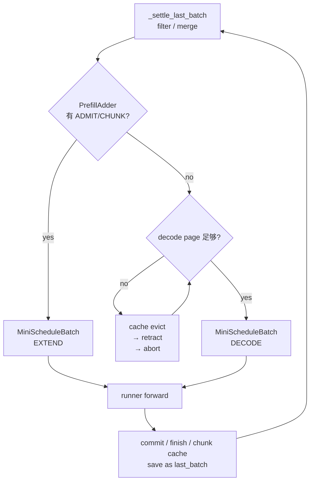
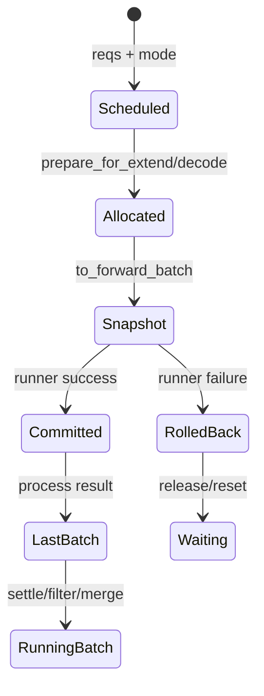
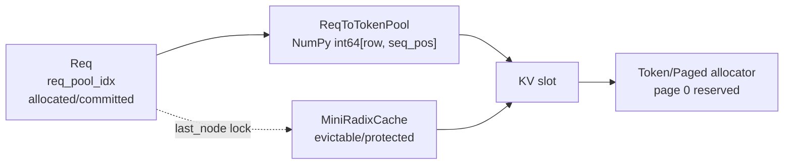
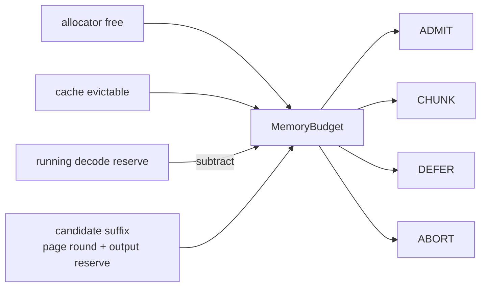
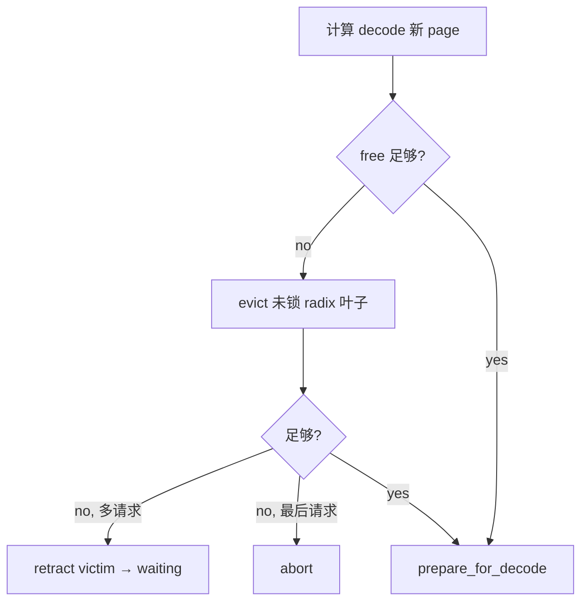
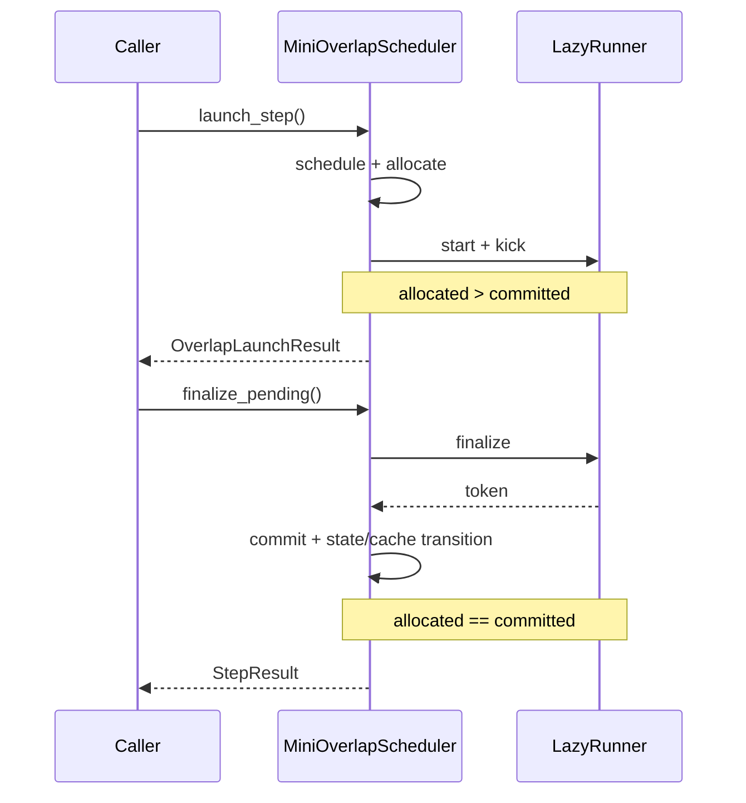

# Scheduler / KVCache 核心结构

这是一份先读文档：先用六张图建立全局结构，再去看字段和逐行流程。`my-sglang` 只追踪 CPU 上的索引和所有权，不保存每层真实 K/V 张量，但调度名词和方法边界尽量贴近 SGLang。

## 1. 调度主循环

[`MiniScheduler.step()`](../src/my_sglang/scheduler.py#L117) 一次只执行 EXTEND 或 DECODE；[`_settle_last_batch()`](../src/my_sglang/scheduler.py#L183) 在下一轮把上轮存活请求合入 `running_batch`。测试入口：[`test_prefill_priority_means_one_forward_batch_per_step`](../tests/test_scheduler.py#L102)。

## 2. `MiniScheduleBatch` 生命周期

`MiniScheduleBatch` 是唯一修改 allocation/mapping 的 batch 对象；`BatchForward` 只是 runner 可观察快照。核心方法：[`prepare_for_extend()`](../src/my_sglang/schedule_batch.py#L60)、[`prepare_for_decode()`](../src/my_sglang/schedule_batch.py#L99)、[`commit_allocated()`](../src/my_sglang/schedule_batch.py#L129)、[`rollback_uncommitted()`](../src/my_sglang/schedule_batch.py#L136)。

## 3. KV 索引与物理 page

唯一映射事实是 `req_to_token[row, seq_pos] = slot`。allocator 以 page 为分配/释放单位，并允许同一序列继续使用已分配尾页。代码入口：[`ReqToTokenPool`](../src/my_sglang/pools.py#L12)、[`BaseTokenToKVPoolAllocator`](../src/my_sglang/pools.py#L101)；测试入口：[`test_paged_allocator_reuses_tail_before_allocating_next_page`](../tests/test_pools.py#L41)。

## 4. Prefill admission 预算

[`PrefillAdder.add_requests()`](../src/my_sglang/schedule_policy.py#L80) 按 FCFS 消耗一次性预算，[`_get_new_prefill_batch()`](../src/my_sglang/scheduler.py#L199) 才真正绑定 row/cache prefix 和分配 slot。直接测试：[`test_prefill_adder_stops_at_first_fcfs_budget_defer`](../tests/test_schedule_policy.py#L18)。

## 5. Decode 压力与 unfinished chunk cache

压力闭环在 [`_get_decode_batch()`](../src/my_sglang/scheduler.py#L276)。另一方面，chunk 每次 forward 成功后，[`_cache_unfinished_req()`](../src/my_sglang/scheduler.py#L394) 会把 committed 的完整 page 插入 radix tree 并保持 lock，未满页尾部仍归请求。

测试入口：[`retract/re-admit`](../tests/test_scheduler.py#L304)、[`last-request abort`](../tests/test_scheduler.py#L334)、[`unfinished chunk cache`](../tests/test_scheduler.py#L228)。

## 6. Overlap 两阶段

[`launch_step()`](../src/my_sglang/overlap_scheduler.py#L83) 和 [`finalize_pending()`](../src/my_sglang/overlap_scheduler.py#L151) 必须成对调用。chunked extend 同样使用 `extend_start/kick/finalize`，所以能与 radix、paged allocator 组合。测试入口：[`allocated/committed`](../tests/test_overlap_scheduler.py#L90)、[`全组合`](../tests/test_overlap_scheduler.py#L132)。

## 与真实 SGLang 的对应关系

| my-sglang | SGLang 对应概念 | 这里重点观察 |
|---|---|---|
| `MiniScheduler` | `Scheduler.get_next_batch_to_run()` | prefill 优先、last/running batch |
| `MiniScheduleBatch` | `ScheduleBatch` | extend/decode allocation 与过滤 |
| `PrefillAdder` | `schedule_policy.PrefillAdder` | free、evictable、decode reserve |
| `ReqToTokenPool` | `mem_cache.memory_pool.ReqToTokenPool` | 二维逻辑位置映射 |
| paged allocator | `mem_cache.allocator` | page 对齐、尾页复用、释放 |
| `MiniRadixCache` | `RadixCache` | prefix ownership、lock、LRU |
| `MiniOverlapScheduler` | overlap event loop | allocation 与 commit 分离 |

继续阅读：[数据结构、所有权与不变量](data-structures.md) → [带数字的动态流程](dynamic-flows.md)。
