# Scheduler / KVCache 核心结构

这是一份先读文档：先用六张图建立全局结构，再去看字段和逐行流程。`my-sglang` 只追踪 CPU 上的索引和所有权，不保存每层真实 K/V 张量，但调度名词和方法边界尽量贴近 SGLang。

## 1. 调度主循环

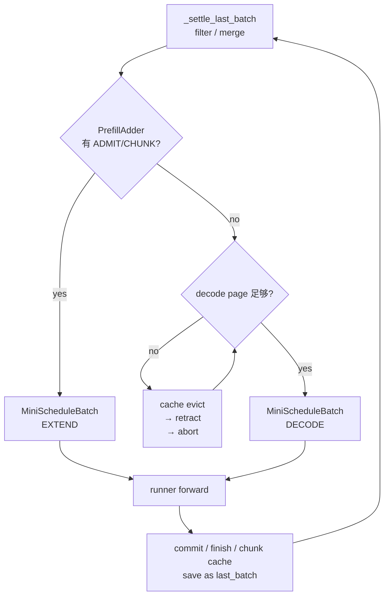

[`MiniScheduler.step()`](../src/my_sglang/scheduler.py#L117) 一次只执行 EXTEND 或 DECODE；[`_settle_last_batch()`](../src/my_sglang/scheduler.py#L183) 在下一轮把上轮存活请求合入 `running_batch`。测试入口：[`test_prefill_priority_means_one_forward_batch_per_step`](../tests/test_scheduler.py#L102)。

### 1.1 与标准 SGLang 的主循环差异

上图是**教学主线**，不是标准 SGLang 所有可选路径。它故意固定为“Prefill 优先；本轮只跑 EXTEND 或 DECODE”，这样 slot、page 与请求状态的因果关系最清楚。

| 维度 | `my-sglang` | 标准 SGLang | 影响 |
|---|---|---|---|
| 本轮 batch 模式 | 只会是 `EXTEND` 或 `DECODE` | 除 EXTEND / DECODE 外，还可通过 `mix_with_running()` 形成 `MIXED` batch | 真实一轮可同时带新 prefill 与已有请求的 decode 部分 |
| waiting 选择 | 固定 FCFS；第一个 `DEFER` 阻挡后续请求 | 可选 FCFS、LPM、DFS-weight、LOF、Random、Routing-key，并可叠加 priority | “谁先 admission”不一定按到达顺序 |
| 本轮外围工作 | 只做 KV 调度和 runner 调用 | 还处理超时/取消、LoRA、分布式与 disaggregation、采样等 | 这些不改变 slot 主线，却会改变实际可调度请求集合 |

```text
教学版：  waiting ──FCFS──> EXTEND 或 DECODE（二选一）
真实版：  waiting ──策略排序──> EXTEND / DECODE / MIXED
                              └─ 还受模型、缓存层、并行与运行时条件约束
```

真实代码证据：[`SchedulePolicy` 支持的策略](../../python/sglang/srt/managers/schedule_policy.py#L101)、[`mix_with_running()`](../../python/sglang/srt/managers/schedule_batch.py#L2377)、[`get_next_batch_to_run()`](../../python/sglang/srt/managers/scheduler.py#L2555)。后文第 4 节的 FCFS 预算叙述均特指教学版；第 6 节另说明 overlap 差异。

## 2. `MiniScheduleBatch` 生命周期

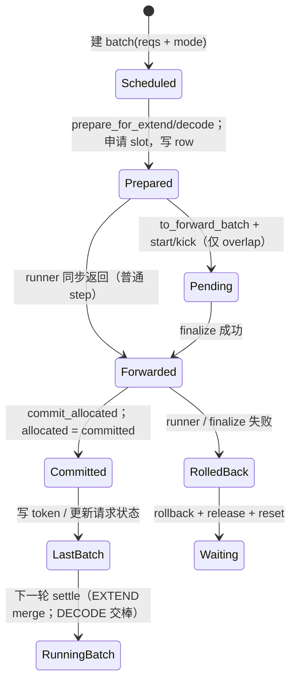

先给结论：`MiniScheduleBatch` 是**一次 forward 的可变工作单**，不是请求本身，也不是长期的 KV 容器。它收集本轮要跑的请求，申请本轮新增 KV slot，生成给 runner 的参数，并在成功/失败后推进或回滚这次申请。

```text
Req（跨多轮长期存在）
  rid / output_ids / req_pool_idx / KV 进度
          │ 被选中一次
          v
MiniScheduleBatch（只代表本轮 forward）
  reqs + mode + 本轮 input / 新 slot / 长度元数据
          │ 转为 tuple 化参数
          v
BatchForward（交给 runner 的结构化视图）
  不再负责分配、提交或回滚
```

### 2.1 谁创建、谁持有、何时消失

先记这一句：**`batch` 不是第三个长期容器，只是本轮的局部变量名；它会指向新对象，或直接指向 `running_batch`。** `last_batch` 与 `running_batch` 是 Scheduler 的两个字段；某些时刻会引用同一个对象，但用途不同。

```text
名称              谁持有                  它回答的问题
batch             当前 step 的局部变量     “本轮要 forward 的是哪一批？”
last_batch        Scheduler 字段           “上一轮完成、下一轮还要 settle 的是哪一批？”
running_batch     Scheduler 字段           “下一次 decode 的候选请求集合是什么？”
```

为避免把图中的对象和源码字段混为一谈，以下字母都只是**对象代号**；它们本身都是 `MiniScheduleBatch` 实例，不是额外的字段或类型：

```text
P  = 本轮新建的 Prefill / EXTEND batch
RunPrev  = 本轮开始时 `running_batch` 正在引用的对象；它可以为空，但不是本轮新建的 P
D        = DECODE 路径中被选中执行的 `running_batch`；此路径里 `D` 就是 `RunPrev`
RunEmpty = D 交给 `last_batch` 后，Scheduler 临时新建并放入 `running_batch` 的空对象
```

`RunPrev` 是按**时间**命名的：“本轮开始前就已由 `running_batch` 持有”；它不表示代码中的局部变量，也不暗示里面一定有请求。`D` 是按**用途**命名的：只有选择 decode 的那条路径才把同一个 `RunPrev` 叫作 `D`。箭头 `→` 表示“字段/变量引用这个对象”，**不是复制对象**。

先区分三个字段的**语义**，不要只按名字猜它们保存的是哪种 batch：

| 字段 | 它持有的对象 / 请求 | 何时消费 |
|---|---|---|
| `running_batch` | 已完成 prefill、状态为 `RUNNING` 的请求集合，即下一轮 decode 候选集合 | 没有新的 prefill 被接纳时，scheduler 将其设为 `DECODE` 并 `prepare_for_decode()` |
| `last_batch` | 刚刚完成 forward、但尚未在下一轮开头 settle 的 batch；它可以是 `EXTEND`，也可以是 `DECODE` | 下一轮最开始由 `_settle_last_batch()` 过滤、合并或交棒 |
| `chunked_req` | 尚未处理完全部 prompt 的唯一 chunked-prefill 请求 | 下一轮继续作为 `EXTEND`，在 prompt 全部完成前不会进入 `running_batch` |

因此，`running_batch` 是“**decode 候选**”的长期集合，而不是“上一轮所有请求”的暂存区；它本身仍是 `MiniScheduleBatch`，真正执行 decode 前才会被设为 `ForwardMode.DECODE`。`last_batch` 则只是一个**一轮延迟的交接站**：

```text
EXTEND forward 完成 → last_batch → settle 后：finished 被过滤，RUNNING 请求 merge 到 running_batch
DECODE forward 完成 → last_batch → settle 后：finished 被过滤，原对象直接交回 running_batch
未完成 chunk        → 不合入 running_batch，继续保留在 chunked_req
```

#### 2.1.1 EXTEND：新对象 P 的请求被合并进已有运行集合 RunPrev

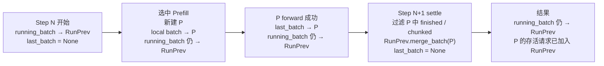

这条路径的重点是：**`running_batch` 不会指向 P。** 它一直引用本轮开始时已有的 `RunPrev`；settle 只是把 P 中仍要 decode 的请求追加到 `RunPrev.reqs`。因此 `last_batch = None` 后，P 不再由 Scheduler 字段持有，但请求本身已经在 `RunPrev` 中继续存活。

#### 2.1.2 DECODE：同一个对象 D 在 `last_batch` 与 `running_batch` 间交棒

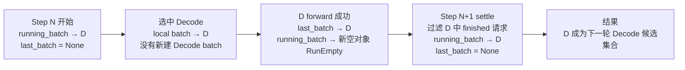

这条路径的重点是：**D 没有被复制。** `batch`、随后 `last_batch`、最后 `running_batch` 都依次引用同一个 D。中间先放入新空对象 `RunEmpty`，是为了保证“刚跑完的 D”必须等到下一轮 settle 后才能再次作为 decode 候选集合。

#### 2.1.3 Overlap：manual `_pending` 与 pipeline `result_queue`

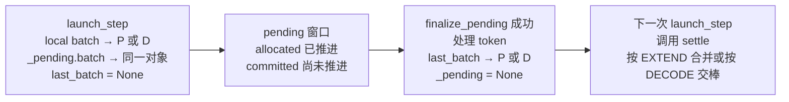

上图描述的是 manual driver：它用于观察 allocation/commit/rollback，不是真正的跨批流水。Production-shaped driver 改由 `result_queue` 持有不可变 forward snapshot；纯 decode 稳定态会先 chained launch B1，再 FIFO 处理 B0。两种 driver 在同一 scheduler 实例中禁止混用。

```text
manual:    launch B0 → pending B0 → finalize B0
pipeline:  queue[B0] → launch chained B1 → queue[B0,B1] → process/pop B0
```

#### 2.1.4 把两条交接路径放在一张图里

下面直接画对象是**何时创建、被哪个字段持有、又交给谁**。其中 `P` / `D` 都曾被本轮局部变量 `batch` 指向；图中不再使用 `Bp` / `Rd` 这类额外别名。

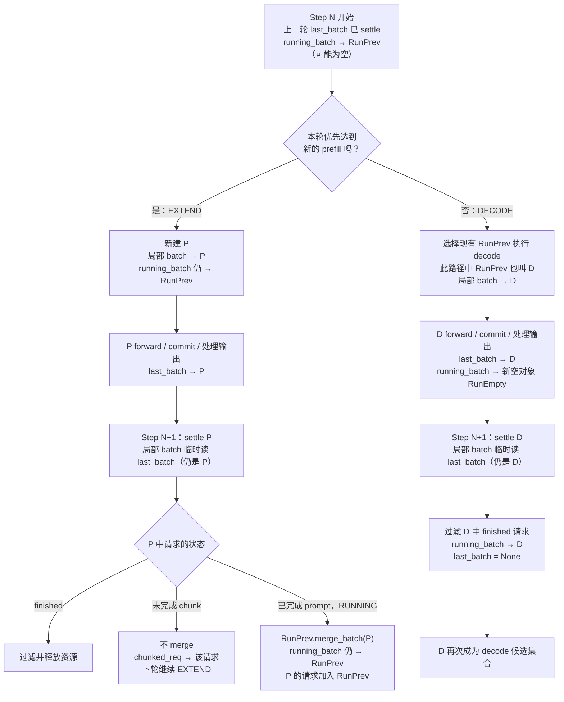

`chunked_req` 是 EXTEND 的例外：chunk 未完成时，`_settle_last_batch()` 会从 `P` 中排除它；它留在独立的 `chunked_req` 字段，下一轮继续 prefill，不会先合进 `running_batch`。

所谓 batch “消失”不是显式 `free`：当 `_settle_last_batch()` 把 `last_batch = None`，且局部 `batch` 离开 `step()` 作用域后，Scheduler 不再持有这个 batch 对象；其中存活的 `Req` 已被合并或交棒到 `running_batch`，finished 请求则已释放 row / KV。

Overlap 有两种临时持有者：manual 的 `_pending.batch`，以及 pipeline 的 FIFO job snapshot。Pipeline job 是在途请求的 owner；只有队列里不再有 successor 时，存活请求才回到 `running_batch`。

源码入口：[`_get_new_prefill_batch()`](../src/my_sglang/scheduler.py#L199)、[`_get_decode_batch()`](../src/my_sglang/scheduler.py#L276)、[`_settle_last_batch()`](../src/my_sglang/scheduler.py#L183)、[`launch_step()` / `finalize_pending()`](../src/my_sglang/overlap_scheduler.py#L90)。

### 2.2 每一步实际改了什么

| 时刻 | `Req` 上的变化 | `ReqToTokenPool[row, seq_pos]` | Batch 内字段 | 能否运行模型 |
|---|---|---|---|---|
| 建 batch 前 | 新请求已分到 `req_pool_idx`；命中 cache 的 prefix 已写入 | 只有 cache prefix（或空） | 只有 `reqs`、`forward_mode` | 否 |
| `prepare_for_extend()` | `kv_allocated_len: start → fill_len` | 写入新 suffix 的 slot | `input_ids_by_req`、`out_cache_locs_by_req`、`seq_lens`、`prefix_lens` | 可以 |
| `prepare_for_decode()` | 每个请求 `kv_allocated_len + 1` | 每行写一个新 slot | 每个请求一个 `last_token_id` 和一个 slot | 可以 |
| `to_forward_batch()` | 不改 `Req` | 不改表 | NumPy 数组 / list 转成 tuple 视图 | 可以 |
| runner 成功 + `commit_allocated()` | `kv_committed_len = kv_allocated_len` | 这些 slot 正式成为请求已完成 KV | 元数据不变 | 已完成 |
| runner 失败 + `rollback_uncommitted()` | `kv_allocated_len` 回到 `kv_committed_len` | 清掉未提交区间；只释放不与已提交尾页共用的 page | 本轮 allocation 作废 | 不可继续 |

> **边界纠正**：`MiniScheduleBatch` 负责本轮**新增** slot 的申请和写入；它不是所有 mapping 的唯一写入者。新请求命中 radix cache 时，调度器的 [`_attach_new_request()`](../src/my_sglang/scheduler.py#L367) 会先把已命中的 `prefix_indices` 写到 row；随后 batch 只补上未命中的 suffix。

### 2.3 `allocated` 与 `committed`：用一轮数字看清

假设请求 A 已命中 4 个 cache token，接下来 prefill 3 个新 token；其 row 中已有 `slot 4～7`。

```text
时刻                         KV 进度                         row 0（只画 0~6）
建 batch 前                  allocated = committed = 4       [4, 5, 6, 7, -1, -1, -1]
prepare_for_extend() 后      allocated = 7, committed = 4     [4, 5, 6, 7, 12, 13, 14]
runner 成功 + commit 后      allocated = committed = 7       [4, 5, 6, 7, 12, 13, 14]
runner 失败 + rollback 后    allocated = committed = 4       [4, 5, 6, 7, -1, -1, -1]
```

这里的 `allocated` 是“为本轮 forward 预先占住的**物理 KV slot** 数”；`committed` 是“模型已成功处理、可以作为下轮前缀使用的 KV slot 数”。二者相等时，没有悬而未决的分配。Overlap 的 `launch_step()` 之后会短暂看到 `allocated > committed`；`finalize_pending()` 成功才追平，失败则回滚。这正是两个字段同时存在的原因。

| 模式 | `prepare` 后 | runner 完成后 | 观察点 |
|---|---|---|---|
| 普通 `step()` | 短暂 `allocated > committed`，外部通常看不到 | 同一调用内立即 commit | 返回 `StepResult` 时通常已相等 |
| Overlap `launch_step()` | `allocated > committed` | 尚未 finalize，不能当作已完成 KV | `_pending` 存在 |
| Overlap `finalize_pending()` | 不再新增 allocation | 成功：二者相等；失败：回到旧 committed 值 | `_pending = None` |
| Pipeline `pipeline_step()` | launch 成功即 `allocated == committed` | `output_ids` / finish / cache 可滞后一批 | `result_queue` 深度 1；turn 内短暂为 2 |

对应测试直接断言了这条时间线：[`test_launch_allocates_and_finalize_commits_prefill_and_decode`](../tests/test_overlap_scheduler.py#L90)。

### 2.4 EXTEND、chunk 与 DECODE 如何走同一套生命周期

| 本轮类型 | `input_ids_by_req` | 新增 slot 数 | forward 后的请求去向 |
|---|---|---:|---|
| 首次 EXTEND / prefill | prompt 中未命中 cache 的部分 | `fill_len - kv_allocated_len` | 最后一个 chunk：生成首个 output，转 `RUNNING`；否则转 `PREFILLING` |
| 后续 chunk EXTEND | 下一个 prompt 分块 | 当前 chunk 长度 | 已完成完整 page 可写入 radix cache；未完成 chunk 留在 `chunked_req` |
| DECODE | 上一个生成 token（`last_token_id`） | 每个请求固定 1 | 追加新 output；结束则释放 row / KV，否则下轮继续 |

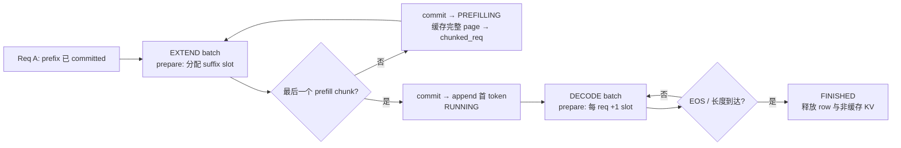

### 2.5 `BatchForward` 是什么，为什么还要再造一个对象

`MiniScheduleBatch` 有 allocator、pool、cache 等**可变控制面**；runner 只需要本轮输入、slot 和长度。因此 [`to_forward_batch()`](../src/my_sglang/schedule_batch.py#L167) 把它缩成 `BatchForward`：

| `BatchForward` 字段 | runner 用它做什么 |
|---|---|
| `mode`、`reqs` | 知道是 EXTEND 还是 DECODE，以及对应请求顺序 |
| `input_ids_by_req` | 本轮实际送入模型的 token；不是整个历史 prompt |
| `req_pool_indices`、`out_cache_locs` | 将本轮 token 写到正确的 KV 逻辑行 / 物理 slot |
| `seq_lens`、`extend_lens`、`chunk_starts_by_req` | 识别本轮后 token 边界和 chunk 位置 |
| `prefix_slot_ids_by_req` | 首次 prefill 命中 cache 时，告诉 runner 可复用的 KV 前缀 |

它是 `@dataclass(frozen=True)`，且数组被转为 tuple，防止 runner 改动 batch 的容器参数；但 `reqs` 内仍是同一批 `Req` 对象的引用，**不是对请求状态的深拷贝**。因此真正的 allocation、commit、rollback 仍必须回到 `MiniScheduleBatch` / scheduler 执行，不能由 runner 直接修改。

核心方法：[`prepare_for_extend()`](../src/my_sglang/schedule_batch.py#L60)、[`prepare_for_decode()`](../src/my_sglang/schedule_batch.py#L99)、[`commit_allocated()`](../src/my_sglang/schedule_batch.py#L129)、[`rollback_uncommitted()`](../src/my_sglang/schedule_batch.py#L136)、[`filter_batch()` / `merge_batch()`](../src/my_sglang/schedule_batch.py#L155)。

## 3. KV 索引与物理 page

先记住这条主线：**token 的序号是逻辑位置；slot 是 KV 的索引；page 是一次申请、释放和复用的最小块。** 这里的 `my-sglang` 只模拟索引和归属，真实模型的 K/V 张量不在这个教学实现里。

| 名词 | 它是什么 | 例子（`page_size = 4`） |
|---|---|---|
| `seq_pos` | token 在一个请求序列中的逻辑下标 | 第 0、1、2 个 token |
| `slot` | 该 token 的 KV 存放位置索引 | `4`、`5`、`6` |
| `page` | 连续 `page_size` 个 slot 的分配块 | page 1 = slot 4～7 |
| `req_pool_idx` | 请求在索引矩阵中的行号 | `req-A → row 0` |

### 3.1 KV Slot 到底是什么

**Slot 就是“某个 token 的 KV 缓存格号”。** 把 KV cache 想成一排储物柜：token 不直接拿着 K/V 张量，而是拿着一个柜号；attention backend 用这个整数索引读写该 token 对应的 K/V。这个项目中的 slot 是 `int64` 索引，**不是 token id、不是 GPU 指针、也不是一个 page**。

```text
请求 A 的第 2 个 token
         |
         |  req_to_token[row_A, 2] = 6
         v
      slot 6  ─────────────→ 真实 KV cache 中该 token 的 K/V 位置
      （柜号）                  （本教学项目不保存张量）

slot 6 所在 page：page_id = 6 // 4 = 1
slot 6 在页内的位置：page_offset = 6 % 4 = 2
```

| 容易混淆的对象 | 与 Slot 的关系 |
|---|---|
| token id | token 的内容编号；相同 token id 在两个请求中可落到不同 slot |
| `seq_pos` | token 在**本请求**中的逻辑位置；用它到行表里查 slot |
| page | 一组连续 slot；`page_size = 4` 时，一个 page 有 4 个 slot |
| 真实 K/V 张量 | slot 是访问它们的索引；`my-sglang` 不保存张量本身 |

Slot 的价值是把“请求里的第几个 token”和“KV cache 的实际占位”解耦：同一段新分配后缀通常顺序填 slot；命中 radix 前缀时，新请求可直接复用旧 slot，所以一个请求跨过“缓存前缀 → 新后缀”的边界时，slot 也可能跳号。

源码中，allocator 先产出 slot 列表，`prepare_for_extend()` / `prepare_for_decode()` 再把它写入 `req_to_token[row, seq_pos]`。见 [`alloc_extend()`](../src/my_sglang/pools.py#L149)、[`ReqToTokenPool.write()`](../src/my_sglang/pools.py#L52)、[`prepare_for_extend()`](../src/my_sglang/schedule_batch.py#L60)。

### 3.2 一个 page 长什么样

下面只是在画**索引编号**，不是实际 GPU 内存地址。`slot = page_id × page_size + page_offset`；page 0 留给 padding，分配器从 page 1 开始分配。

```text
page_size = 4

                 page 0（保留，不能分配）
              +------+------+------+------+
slot 索引      |  0   |  1   |  2   |  3   |
              +------+------+------+------+

                 page 1（一次整体申请）
              +------+------+------+------+
slot 索引      |  4   |  5   |  6   |  7   |
page_offset    |  0   |  1   |  2   |  3   |
              +------+------+------+------+

                 page 2（下一块）
              +------+------+------+------+
slot 索引      |  8   |  9   | 10   | 11   |
              +------+------+------+------+
```

### 3.3 请求的 KV 索引怎样落到 page

> **实现边界**：本节图中的 `NumPy int64[row, seq_pos]` 是 `my-sglang` 的教学实现，运行在 CPU。真实 SGLang 保留同一个 `(req_pool_idx, seq_pos) → slot` 关系，但 `ReqToTokenPool.req_to_token` 是运行设备上的 `torch.int32` tensor；CUDA 服务时它就在 GPU 上，供 attention / KV cache 路径直接索引。真实实现还保留 row 0 给 CUDA Graph 的 padding，真实请求从 row 1 起分配。见 [真实 SGLang `ReqToTokenPool`](../../python/sglang/srt/mem_cache/memory_pool.py#L229)。

`ReqToTokenPool` 的形状固定为 `[max_running_reqs, max_context_len]`。所以 **row 0 不会只有 4 格**：它有完整的 `max_context_len` 列；图只截取 16 格，未映射位置是 `-1`。调度时只关心 `[0, kv_allocated_len)` 这个已分配前缀。

| 参数 / 字段 | 管什么 | 与另一个概念的关系 |
|---|---|---|
| `max_running_reqs` | 矩阵有多少**行**，也就是同时最多有多少请求占用行 | 不是 reqId 的数量上限；请求结束，行可被下一个 reqId 复用 |
| `rid`（reqId） | 请求的业务身份，例如 `req-A` | `_rid_to_idx` 把它映射到暂时的 `req_pool_idx` |
| `req_pool_idx` | 一个活跃请求当前占用的行号 | 只是 0～`max_running_reqs - 1` 的临时槽位，不是请求 ID |
| `max_context_len` | 每行有多少**列**，也是单请求最大可映射 token 数 | `seq_pos` 必须在 `0～max_context_len - 1` 内 |
| `seq_pos` | token 在本请求内的第几个逻辑位置 | 它是列下标，不是 token id，也不是 slot |

```text
例：max_running_reqs = 3，max_context_len = 8

活跃请求身份表（请求结束后，row 可复用）       KV 索引矩阵（每个 row 固定 8 列）
rid       req_pool_idx                         seq_pos →  0   1   2   3   4   5   6   7
req-A  →  row 0                              row 0 / A | 4 | 5 | 6 | -1| -1| -1| -1| -1|
req-B  →  row 1                              row 1 / B |12 |13 | -1| -1| -1| -1| -1| -1|
（空闲）   row 2                              row 2     |-1 |-1 |-1 |-1 |-1 |-1 |-1 |-1|

req-A 结束：row 0 清空；新来的 req-C 可以占用 row 0。
req-A 的 seq_pos = 2：表示 A 的第 3 个 token，不表示全局第 3 个 token。
```

#### `my-sglang` 的 NumPy 矩阵在简化什么代码？

`req_to_token` 的本质只是“**请求逻辑位置 → KV slot**”的二维查找表；它不保存真实 K/V 张量，也没有引入新的调度规则。这里用 NumPy 是教学版把原本需要逐格循环的整数表操作，写成固定形状的整段操作。

| 实现 | 索引表类型 | 放在哪里 | 目的 |
|---|---|---|---|
| `my-sglang` | `np.ndarray[int64]` | CPU | 代码短、便于观察矩阵和切片 |
| 真实 SGLang | `torch.Tensor[int32]` | `device`（CUDA 时为 GPU） | 让 GPU 侧 attention / KV cache 路径直接使用索引；row 0 作为 CUDA Graph padding |

| 要做的事 | 不用 NumPy 时的直觉写法 | 这里的 NumPy 写法 |
|---|---|---|
| 初始化 / 释放一行 | 循环把每个格子设为 `-1` | `row.fill(-1)` |
| 为一段新 token 写 slot | 循环写 `start` 到 `end - 1` | `matrix[row, start:end] = slots` |
| 算 batch 中每个请求本轮新增多少 token | 对每个请求做 `target - start` | `seq_lens - prefix_lens` |
| 数有多少格已映射 | 双层循环数“不是 `-1`”的格子 | `np.count_nonzero(matrix >= 0)` |

```text
例：同一 batch 有 req-A、req-B

                 req-A  req-B
prefix_lens        5      0      # 本轮之前已有 / 命中的 KV 长度
seq_lens           8      2      # 本轮结束后应有的 KV 长度
--------------------------------
extend_lens        3      2      # 本轮各自要新增的 token 数

NumPy 的逐项相减： [8, 2] - [5, 0] = [3, 2]
等价 Python 循环：   [8 - 5, 2 - 0] = [3, 2]
```

`np.count_nonzero` 也不是在数“slot 数值本身有多大”。代码先计算 `matrix >= 0`，把已映射位置变成 `True`、`-1` 变成 `False`，再数 `True` 的个数：

```text
slot 表                 matrix >= 0                 已映射数
[[ 4,  5, -1],          [[ T,  T, F],
 [12, -1, -1]]    →      [ T,  F, F]]        →          3
```

因此，NumPy 在这个教学实现里是**CPU 侧索引代码的简化工具**：固定 `int64` 类型、连续切片和批量运算更好写；真正的 K/V 张量不在这里，送给 runner 前的快照也会转回普通 Python 整数。不要把它理解为标准 SGLang 的物理实现：标准 SGLang 用设备上的 `torch.int32` 索引 tensor，索引关系相同，但能直接服务 GPU kernel。

在 `MiniScheduler` 中，`ReqToTokenPool(max_running_reqs, max_context_len or max_total_tokens)` 建立这张表；写入超出 `max_context_len` 会直接报错。见 [`MiniScheduler.__init__()`](../src/my_sglang/scheduler.py#L44)、[`ReqToTokenPool.alloc()`](../src/my_sglang/pools.py#L26)、[`ReqToTokenPool.write()`](../src/my_sglang/pools.py#L54)。

下面用一个更接近实际的例子：`max_context_len = 32`、`page_size = 4`。`req-A` 命中 8-token radix 前缀，随后 prefill 6 个新 token，再 decode 2 个 token。假设其他运行请求已占用 page 3～6，allocator 当前可用队首是 page 7、8；因此 A 的逻辑 token 连续，slot 却在位置 8 跳号。

```text
请求 req-A  ── req_pool_idx = 0
row 0 的真实宽度 = max_context_len = 32；这里只画 seq_pos 0～15

ReqToTokenPool（逻辑位置连续；slot 可以跳号）
seq_pos       0     1     2     3  |  4     5     6     7  |  8    9    10   11 | 12   13 | 14   15 | 16...
             +-----+-----+-----+-----+-----+-----+-----+-----+-----+-----+-----+-----+-----+-----+-----+-----+-------
row 0 / A    |  4  |  5  |  6  |  7  |  8  |  9  | 10  | 11  | 28  | 29  | 30  | 31  | 32  | 33  | 34  | 35  | -1...
             +-----+-----+-----+-----+-----+-----+-----+-----+-----+-----+-----+-----+-----+-----+-----+-----+-------
来源          \____________ radix cache 前缀 ____________/ \________ 新分配 ________/ \_尾页复用_/  未映射
page          page 1（slot 4～7）    page 2（slot 8～11）    page 7（28～31）   page 8（32～35）

其他运行请求暂时占用 page 3～6；所以 req-A 不会拿到 slot 12～27。
后续 seq_pos 16 首次写入时，才会再申请一个新 page。
```

| 位置范围 | slot | 含义 |
|---|---|---|
| `seq_pos 0～7` | `4～11` | radix 命中的完整 page 前缀，不重新计算 K/V |
| `seq_pos 8～13` | `28～33` | 这次 prefill 新分配的 6 个位置 |
| `seq_pos 14～15` | `34～35` | decode 继续填 page 8 的尾页，不申请新 page |
| `seq_pos 16～31` | `-1` | 还未映射；请求结束后整行会清回 `-1` |

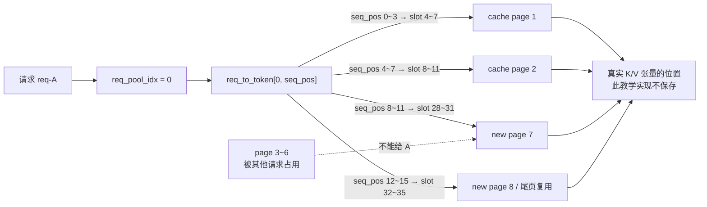

### 3.4 为什么 allocator 按 page 管，而不是按 token 管

| 情况 | slot 表中的变化 | page 的变化 |
|---|---|---|
| 命中 8-token radix 前缀 | 写入已存在的 slot `4～11` | **不申请 page**，直接复用 cache |
| prefill 6 个新 token | 写入 slot `28～33` | 申请 page 7、8；page 8 还剩 2 格 |
| 后续 decode 2 token | 写入 slot `34、35` | **不申请新 page**，填满 page 8 尾页 |
| 再 decode 1 token | 写入下一个 page 的首 slot | 申请一个新 page |
| 回滚失败的 forward | 清掉未提交的索引格 | 只归还没有被 committed 位置共用的 page |
| radix cache 缓存前缀 | 新请求的前缀格可直接指向旧 slot | 只缓存完整 page；未满尾页仍归请求 |

所以，`page_size` 越大，分配/回收次数越少，但序列尾部可能暂时占着未写满的一小段空间；`page_size = 1` 时就退化为“一 token 一 page”。

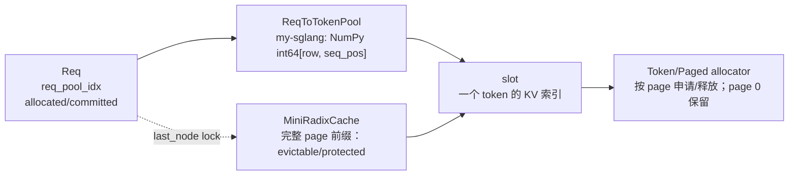

唯一映射事实是 `req_to_token[row, seq_pos] = slot`。allocator 以 page 为分配/释放单位，并允许同一序列继续使用已分配尾页；radix cache 只接管 page 对齐的完整前缀。代码入口：[`ReqToTokenPool`](../src/my_sglang/pools.py#L12)、[`BaseTokenToKVPoolAllocator`](../src/my_sglang/pools.py#L101)、[`MiniRadixCache`](../src/my_sglang/radix_cache.py#L100)；测试入口：[`test_paged_allocator_reuses_tail_before_allocating_next_page`](../tests/test_pools.py#L41)。

### 3.5 `MiniRadixCache` 与真实层级缓存的范围

本节前面的 slot / page 映射关系可以直接迁移到真实 SGLang；但 **cache 的存储层级不能直接迁移**。`MiniRadixCache` 只模拟本地 radix tree 的 prefix ownership、lock 和 LRU，不保存真实 K/V，也没有异步搬运。

```text
my-sglang
请求 ──> MiniRadixCache（本地 prefix → slot）──> 教学 allocator

标准 SGLang（按配置启用）
请求 ──> device radix cache ──> 可选 host / storage tier
                                  └─ prefetch / write-through / 回写确认
```

| 项目 | `MiniRadixCache` | 标准 SGLang 的层级缓存路径 |
|---|---|---|
| 保存的内容 | token prefix 到 slot 的归属关系 | 除 device slot 外，还可跟踪 host/storage 命中与搬运状态 |
| 命中后的动作 | 直接复用 prefix slot | 可能先 prefetch，等待所需层级数据就绪再 admission |
| 淘汰后的影响 | 释放本地 slot | 可能需要 write-through / host tier 的确认，释放时机更复杂 |
| 本文例子 | 默认只解释这一列 | 不展开传输协议；只保留“slot/page 对齐仍成立” |

因此，不要从本节的 `page_size = 4` 示例推导 HiCache 的 host/storage 配置或搬运粒度；它只是讲清本地 KV page 和 slot 关系。真实层级缓存入口见 [`HiRadixCache`](../../python/sglang/srt/mem_cache/hiradix_cache.py#L73) 与 scheduler 的 prefetch 检查（[`get_new_batch_prefill()`](../../python/sglang/srt/managers/scheduler.py#L2814)）。

## 4. Prefill admission 预算

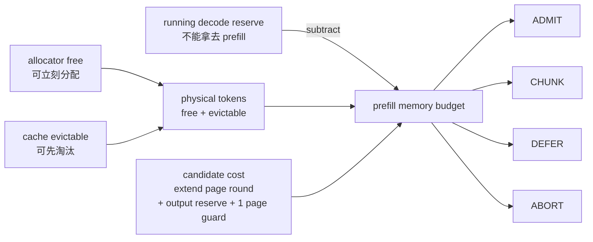

Prefill admission 要回答的不是“这个 prompt 放不放得下”这么简单，而是：**放它进来后，运行中的 decode 是否还留得出下一页 KV？** 所以它同时受“物理可用内存”“本批 prefill 吞吐上限”和“空闲 request row”三类约束。

### 4.1 预算从哪里来

| 预算 / 限制 | 公式或来源 | 含义 |
|---|---|---|
| `free_tokens` | allocator 的空闲 page × `page_size` | 可立刻给新请求的 KV 容量 |
| `evictable_tokens` | 未锁 radix cache 的 slot | 可以先淘汰，再转给新请求的容量 |
| `physical_tokens` | `free_tokens + evictable_tokens` | 机器实际能凑出的容量上限 |
| `decode_reserved_tokens` | 对每个 RUNNING 请求的未来输出预留，按 page 向上对齐后求和 | 不能被新 prefill 花掉，否则下一轮 decode 容易 OOM |
| `remaining_tokens` | `max(physical_tokens - decode_reserved_tokens, 0)` | admission 真正可花的 KV 内存预算 |
| `remaining_prefill_tokens` | 从 `max_prefill_tokens` 开始，每接收一个请求就扣其新 prefill 长度 | 限制本轮 forward 的计算量，不等同于 KV 内存 |
| `max_new_reqs` | 当前空闲 request row 数 | row 满时，即使 KV 够也只能 `DEFER` |

```text
物理内存： free 16 + evictable 8 = 24 token slots
decode 预留：running-A 需要 4 + running-B 需要 4 = 8
------------------------------------------------------
新 prefill 真正可花：remaining_tokens = 24 - 8 = 16
```

`decode_reserved_tokens` 默认只预留 `remaining_new_tokens × new_token_ratio`；被 retract 过的请求设有 `retracted_stain`，会按 100% 剩余输出预留，避免它重新准入后再次把 decode 推向内存压力。

### 4.2 一个候选请求要花多少

先从 radix cache 求 `prefix_len`。命中的前缀不必重算 KV，因此真正需要 extend 的长度是：

```text
full_extend = total_len - prefix_len
```

候选成本按 page 计算，而不是按 token 精确计算：

```text
candidate_cost = round_page(target - prefix_len)
               + round_page(ceil(remaining_new_tokens × reserve_ratio))  # 仅最后一段
               + page_size                                                # 每个新请求的对齐余量
```

| 成本项 | 为什么存在 |
|---|---|
| `round_page(extend)` | KV allocator 整页分配；写 1 个 token 也可能要拿一页 |
| `output_reserve` | prefill 完后仍要 decode，必须先给未来输出留下空间 |
| `+ page_size` guard | 给每个新请求再留一页对齐余量，避免刚 admission 就因页边界失败 |

例：`page_size = 4`，请求总长 12，命中 cache 前缀 6，剩余输出 4，`new_token_ratio = 0.5`：

```text
extend:         12 - 6 = 6  → round_page(6) = 8
output reserve: ceil(4 × .5) = 2 → round_page(2) = 4
one-page guard:                                      4
------------------------------------------------------
candidate_cost:                                     16
```

只有 `candidate_cost <= remaining_tokens` 才是正常 admission；这个例子正好消耗完上节的 16 token 预算。

### 4.3 四种决策按什么顺序出现

| 结果 | 条件 | 调度器下一步 |
|---|---|---|
| `ADMIT` | 完整 suffix 的成本与本批 prefill 上限都能满足；或完整 cache hit | 本轮完整 prefill，随后可进入 decode |
| `CHUNK` | 完整 suffix 太长，但可放下一个 chunk（优先 `chunked_prefill_size`） | 只跑到 `target_fill_len`，将请求保留为 `chunked_req`，下轮继续 |
| `DEFER` | 当前预算 / row 不够，但以后释放 KV 或完成请求后仍可能运行 | 留在 waiting queue；FCFS 下第一个 defer 会挡住后续 waiting 请求 |
| `ABORT` | 空系统首请求连最小一页都放不下；无 chunk 时整个 extend 也无法放进物理池 | 终止请求，避免永远等待 |

决策顺序如下：

```text
1. 查 radix prefix，计算 full_extend
2. 若固定 chunk 能放下 → CHUNK
3. 若完整 suffix 能放下且未超过本批 prefill 上限 → ADMIT
4. 空系统首请求 / 已开始的 chunk：只要物理 page 放得下，允许 ADMIT 或 CHUNK
   （防止 decode reserve 让系统永久不启动）
5. 尝试从大到小缩短 chunk
6. 连最小 page 都放不下 → ABORT；否则 → DEFER
```

第 4 步是一个刻意的“防饿死”例外：它可以暂时突破保守的 decode reserve，但之后的真实压力会由 eviction → retract → abort 闭环处理；它不是忽略内存上限。

### 4.4 FCFS 与真正分配的边界

`PrefillAdder.add_requests()` 只做**预算决策**，按 FCFS 逐个扣减本轮预算；第一个 waiting 请求因预算 `DEFER` 后，后面请求不能插队。真正的 row 绑定、cache prefix 固定和 slot 分配在 `_get_new_prefill_batch()` / `prepare_for_extend()` 才发生，所以 admission 通过不等于此刻已经写好了 KV 张量。

代码入口：[`MemoryBudget` / `PrefillAdder.__init__()`](../src/my_sglang/schedule_policy.py#L28)、[`_decide()`](../src/my_sglang/schedule_policy.py#L111)、[`_candidate_cost()`](../src/my_sglang/schedule_policy.py#L202)、[`add_requests()`](../src/my_sglang/schedule_policy.py#L80)、[`_get_new_prefill_batch()`](../src/my_sglang/scheduler.py#L199)。测试入口：[`FCFS defer`](../tests/test_schedule_policy.py#L18)、[`cache prefix + evictable`](../tests/test_schedule_policy.py#L40)、[`首个 chunk 防饿死`](../tests/test_schedule_policy.py#L62)、[`retract 后保守预留`](../tests/test_schedule_policy.py#L79)。

### 4.5 真实 SGLang：预算思想相同，策略和公式不逐项等价

第 4.1～4.4 节保留的是“**物理 KV − decode 预留 − 本轮 prefill 上限**”这条主思想，但上面的 `candidate_cost` 与四种结果是教学版的可读模型，不能当作标准 SGLang 的逐行公式。

| 维度 | 教学版 | 标准 SGLang | 学习结论 |
|---|---|---|---|
| 排序 | 固定 FCFS | `SchedulePolicy` 可在 admission 前重排 waiting queue | “第一个 DEFER 阻挡后续”只在教学版 / FCFS 情形成立 |
| decode 预留 | 直接使用固定 `new_token_ratio`；retract 后单请求 `retracted_stain = 100%` | 使用会因 retract 更新、正常 decode 逐步衰减的 `new_token_ratio_tracker` | 都是在避免 prefill 吃掉 decode 空间；调参方式不同 |
| 额外约束 | KV、prefill token、row | 还可受 batch size、priority preemption、LoRA、动态 chunk、HiCache prefetch、disaggregation 等限制 | admission 不是单一内存公式 |
| cache 命中 | 本地 radix 直接得到 `prefix_len` | 可能含 device / storage hit，预取未完成时会暂时跳过请求 | 命中不必然代表本轮立刻能跑 |

```text
教学版：按 FCFS 算一个“可否放入”的清晰预算
真实版：先排序 / 预取 / 检查运行时约束，再用同类 KV 预算挑选可运行集合
```

真实代码证据：[`PrefillAdder` 的运行时参数](../../python/sglang/srt/managers/scheduler.py#L2778)、[`SchedulePolicy.calc_priority()`](../../python/sglang/srt/managers/schedule_policy.py#L126)、[`HiCache prefetch 检查`](../../python/sglang/srt/managers/scheduler.py#L2814)、[`new_token_ratio_tracker` 的 retract/decay 更新](../../python/sglang/srt/managers/scheduler.py#L3010)。

## 5. Decode 压力与 unfinished chunk cache

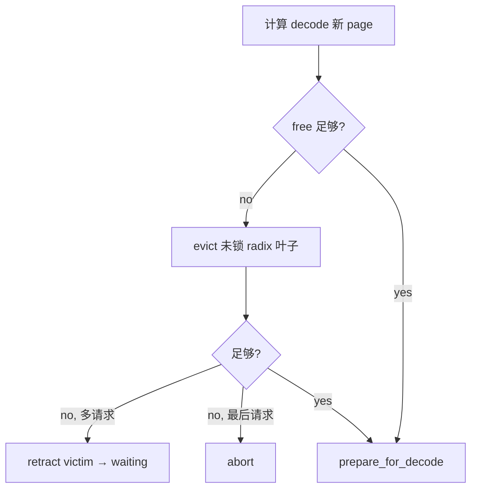

压力闭环在 [`_get_decode_batch()`](../src/my_sglang/scheduler.py#L276)。另一方面，chunk 每次 forward 成功后，[`_cache_unfinished_req()`](../src/my_sglang/scheduler.py#L394) 会把 committed 的完整 page 插入 radix tree 并保持 lock，未满页尾部仍归请求。

测试入口：[`retract/re-admit`](../tests/test_scheduler.py#L304)、[`last-request abort`](../tests/test_scheduler.py#L334)、[`unfinished chunk cache`](../tests/test_scheduler.py#L228)。

### 5.1 真实 SGLang：同样是闭环，资源与反馈更多

教学版故意把压力处理缩成“本地 KV page 不够”。真实 SGLang 的闭环仍是 `检查 → 释放可驱逐 cache → retract → 最后 abort`，但每一步管理的资源更多：层级 cache 的 write-through 状态、Mamba 等额外 allocator、指标/流式 abort 消息，以及下一轮 admission 的全局预留比例。

| 维度 | 教学版 | 标准 SGLang |
|---|---|---|
| 释放对象 | `MiniRadixCache` 的可驱逐本地 page | KV、可驱逐 cache，以及按模型配置存在的额外资源 |
| retract 后的预算反馈 | 被 retract 的请求带 `retracted_stain`，下次按 100% 预留 | `new_token_ratio_tracker` 根据这轮 retract 更新，后续成功 decode 再逐步衰减 |
| abort 可见性 | 标记请求结束 | 同时向 tokenizer / 客户端发送 abort 输出，并记录 metrics |
| unfinished chunk cache | 成功后仅缓存完整本地 page | 还可能等待层级 cache write-through 确认，才成为可驱逐空间 |

因此，`retract victim → waiting` 在本文中只表示“释放教学版的运行态 KV 后重新 admission”；它不等价于真实服务中所有资源都同步、立即释放完毕。真实实现的 KV 压力处理见 [`update_running_batch()`](../../python/sglang/srt/managers/scheduler.py#L3010)，而层级缓存会在 prefill 路径处理 write-through ack（[`get_new_batch_prefill()`](../../python/sglang/srt/managers/scheduler.py#L2998)）。

## 6. Overlap：两个教学层次

### 6.1 Manual transaction microscope

`launch_step()` / `finalize_pending()` 保留显式事务窗口：

```text
launch:   allocate + start/kick，allocated > committed
finalize: materialize token + commit，allocated == committed
failure:  rollback_uncommitted + request replay
```

这个 API 用来回答“本批预留了哪些 slot、失败如何回滚”，不宣称形成跨批流水。`step()` 只是两者的同步便利封装。

### 6.2 Production-shaped pipeline

`pipeline_step()` 使用深度最多为 2 的 FIFO `result_queue`。稳定纯 decode 中，它先把 B0 的 future token 交给 chained B1，再处理 B0：

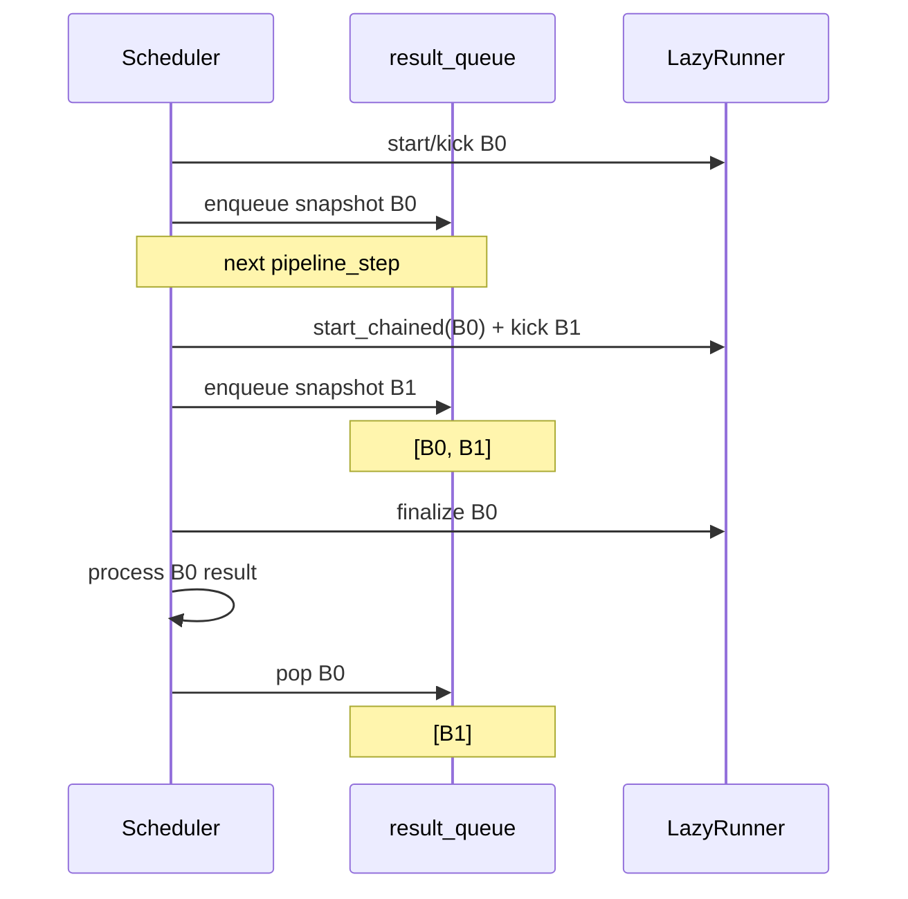

关键对象：

| 对象 | 教学职责 | 生产对应 |
|---|---|---|
| `PipelineJob` | 固定 launch 时的 batch snapshot、handle、请求顺序 | `batch.copy()` + batch result |
| `MiniFutureMap` | `req_pool_idx → FutureTokenRef` | device `FutureMap.output_tokens_buf` |
| `FutureTokenRef` | 指明 producer job 与 batch output index | 尚未回 CPU 的 device token |
| `inflight_ref_count` | 防止仍被 B1 引用的请求提前释放 | overlap over-allocation/resource lifetime |

Fresh decode 使用 CPU 已确认的 `last_token_id`；chained decode 的 `input_ids_by_req` 为空，`input_future_refs_by_req` 指向 B0 output。MLX adapter 把它转成 `MlxModelRunner.decode_batch_start_chained(previous)`，让 MLX lazy graph 直接依赖前一图。

### 6.3 Barrier 与请求结束

首版只 chain “纯 DECODE + 请求组成不变 + 没有 waiting prefill”。EXTEND/chunk、waiting prefill、decode 内存不足或 runner 不支持 chained decode 都建立 barrier。已经提交的工作不会伪装成可取消。

若 B1 已提交，而 B0 结算后请求达到 EOS/长度上限：

```text
B0 result: 逻辑 FINISHED，先不释放 row/KV/runner
B1 result: 丢弃多跑 token
B1 pop:    inflight_ref_count 归零，cache/release/remove
```

多请求 batch 只跳过 finished 请求，其他请求仍消费 B1 的有效结果。若 runner/finalize 异常，所有依赖 job 被同步丢弃，受影响请求保留已确认 `output_ids`、释放物理状态并回 waiting 重新 prefill。

### 6.4 KV 水位不要混用

| 路径 | launch 后 | result processing 后 |
|---|---|---|
| Manual | `allocated > committed` | commit 或 rollback |
| Pipeline 普通 EXTEND/DECODE | `allocated == committed` | 追加 output、finish、cache/release |
| 真实 speculative decode | 可能 `allocated > committed` | 按 accepted length 提交和释放 |

Pipeline 将“普通 KV 调度水位”和“CPU 结果是否已应用”拆开；不要再用 `allocated > committed` 表示普通生产 overlap 的 GPU 尚未返回。

通用 SGLang 入口是 [`event_loop_overlap()`](../../python/sglang/srt/managers/scheduler.py#L1535) 与 [`FutureMap`](../../python/sglang/srt/managers/overlap_utils.py#L99)；MLX 的两 job lazy chain 入口是 [`event_loop_overlap_mlx()`](../../python/sglang/srt/hardware_backend/mlx/scheduler_mixin.py#L107)。教学测试从 [`test_pipeline_launches_chained_decode_before_processing_previous_result`](../tests/test_overlap_scheduler.py) 开始。

## 与真实 SGLang 的对应关系

| my-sglang | SGLang 对应概念 | 可以迁移的主线 | 不能直接迁移的部分 |
|---|---|---|---|
| `MiniScheduler` | `Scheduler.get_next_batch_to_run()` | prefill 优先、last/running batch | 真实可策略排序、MIXED batch，且有运行时外围条件 |
| `MiniScheduleBatch` | `ScheduleBatch` | extend/decode allocation 与过滤 | 真实携带 GPU tensor、采样、多模态、推测解码等状态 |
| `PrefillAdder` | `schedule_policy.PrefillAdder` | free、evictable、decode reserve 的预算思想 | 固定 FCFS / 简化公式不等价于真实策略组合 |
| `ReqToTokenPool` | `mem_cache.memory_pool.ReqToTokenPool` | 二维逻辑位置到 slot 映射 | CPU NumPy vs device torch tensor |
| paged allocator | `mem_cache.allocator` | page 对齐、尾页复用、释放 | 后端与模型类型会影响真实分配细节 |
| `MiniRadixCache` | `RadixCache` / `HiRadixCache` | prefix ownership、lock、LRU | 无 host/storage tier、prefetch、write-through |
| `MiniOverlapScheduler.pipeline_step()` | overlap event loop / MLX overlap loop | FIFO result queue、future token、chained decode、延迟释放 | 不模拟 CUDA stream/event、sampling 或 speculative extras |

继续阅读：[数据结构、所有权与不变量](data-structures.md) → [带数字的动态流程](dynamic-flows.md)。
