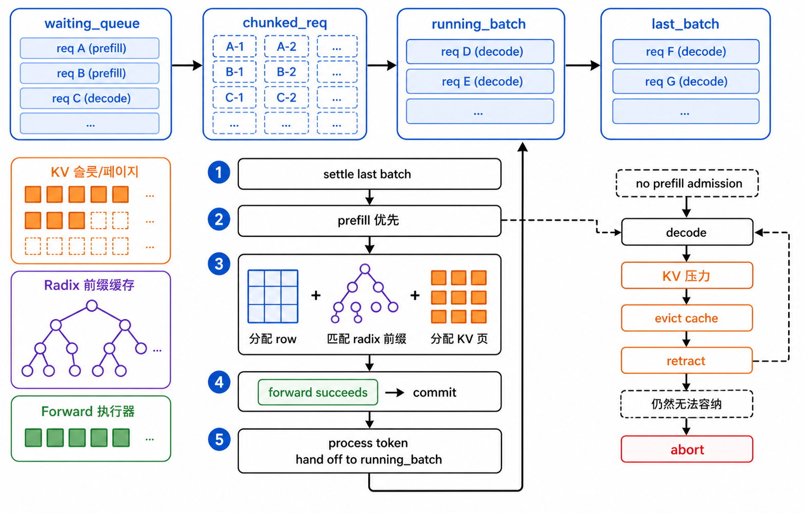
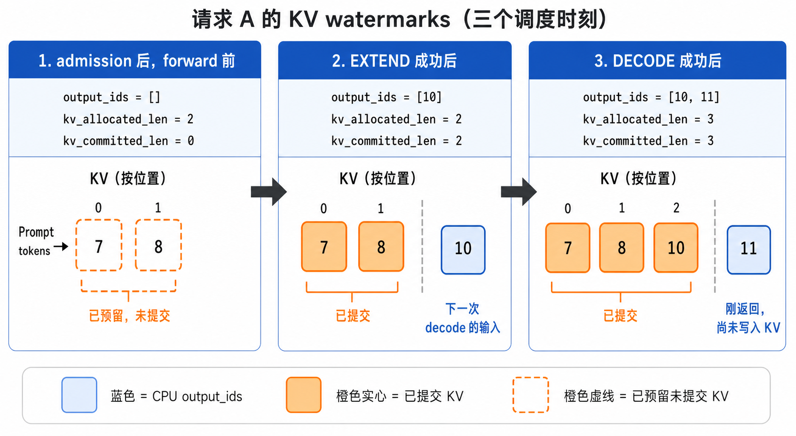

# Scheduler 与 KV：一轮调度到底做了什么

这一页只讲同步 `MiniScheduler`。把它读明白后，overlap 只是把“launch”和“处理结果”
拆到相邻两个 turn；请求选择、KV 分配和 finish 规则不变。字段定义请随时回查
[数据结构](data-structures.md)，不要在这里重新背表。

## 先记住四个长期容器

| 容器 | 里面是什么 | 可以做什么 | 不能做什么 |
|---|---|---|---|
| `waiting_queue` | 尚未拿到 row/KV 的新请求，或 retract 后待重建的请求 | 参与下一轮 prefill 准入 | 不能 decode |
| `chunked_req` | 唯一一个 prompt 尚未填完的请求 | 下一轮继续 EXTEND | 不能和普通请求一起 decode |
| `running_batch` | prompt 已完整处理、下一轮可以 decode 的请求 | 作为一批逐 token decode | 不保存上一轮的临时结果 |
| `last_batch` | 本轮刚执行完、等待下轮交接的可变 batch | 把仍存活的请求移交给 `running_batch` | 不是长期请求队列 |



一个请求的正常路线是：`waiting_queue -> EXTEND -> last_batch -> running_batch ->
DECODE -> FINISHED`。长 prompt 会暂时停在 `chunked_req`；发生 retract 的请求则从
`running_batch` 回到 `waiting_queue`，但已经确认的 `output_ids` 不会丢。

## `step()` 的四个阶段

### 1. 先结算上一批的容器归属

`_settle_last_batch()` 不会再运行模型。它只做交接：完整 EXTEND 后仍活跃的请求变成
`running_batch` 候选；未完成 chunk 留在 `chunked_req`；decode 后结束的请求从 batch
过滤掉。这个阶段解释了为什么“上一轮刚产生 token”与“这一轮能否 decode”不是同一
个动作。

### 2. prefill 优先做 admission

只要等待队列非空或有 `chunked_req`，scheduler 就先构造 `PrefillAdder`。它先算预算，
不分配任何 row 或 slot，依次给 FCFS 候选一个结论：

| 结论 | 本轮会发生什么 | 请求随后在哪里 |
|---|---|---|
| `ADMIT` | 全部剩余 prompt 进入 EXTEND | 本轮结果后进入 `RUNNING` 或结束 |
| `CHUNK` | 只处理一个 prompt 区间 | `chunked_req`，状态为 `PREFILLING` |
| `DEFER` | 不改请求、不分配资源 | 留在 `waiting_queue`；后面的请求不能越过它 |
| `ABORT` | 连最小可运行单元都放不下 | 直接 `FINISHED`，不会留下半分配资源 |

预算有两道独立的门：KV 容量门（空闲 slot 加可淘汰 cache，扣除 running decode
reserve）和本轮 `max_prefill_tokens` 吞吐门。完整公式和手算例子在
[数据结构的 MemoryBudget](data-structures.md#6-admission-的-memorybudget)。

### 3. 决策落地：row、prefix 与新增 KV

只有 `ADMIT`/`CHUNK` 才会进入 `_prepare_prefill_batch()`：新请求先分到稳定
`req_pool_idx`，再按 radix 命中拿到 `prefix_indices` 和锁；缺失 suffix 通过 allocator
按 page 分配 slot，并写进 `ReqToTokenPool[row, position]`。`prepare_for_extend()` 把
这些请求级信息展平成不可变的 `ForwardBatch`。

此时 `kv_allocated_len` 可能已经前进，而 `kv_committed_len` 还没有。同步 runner
成功返回后才执行 `commit_allocated()`；若 runner 抛错，`rollback_uncommitted()` 清掉
这段映射，并让请求留在可重试的状态。这个“先预留、成功再提交”的边界是错误恢复的
核心。

### 4. 没有 prefill 才尝试 decode

`_get_decode_batch()` 收集全部 `RUNNING` 请求；每个请求只需要为“上一个 output token”
新增一个 KV 位置。页面不够时处理顺序固定：

```text
先淘汰没有 lock 的 radix cache page
    -> 仍不够则 retract 一个 decode 请求
    -> 重算剩余请求需要的 page
    -> 最后一个请求也无法推进才 abort
```

retract 会释放 row、私有 KV 和 runner 状态，但保留逻辑 token。下一次 admission 时
`get_fill_ids()` 已包含确认的 output，因此它走 EXTEND 重建上下文，而不是重复把旧
token 返回给用户。

## 用一个 round 看 KV 水位

假设 A 的 prompt 是 `[7,8]`，第一次 EXTEND 返回 `10`：

| 时刻 | `output_ids` | `kv_allocated_len` / `kv_committed_len` | 含义 |
|---|---|---:|---|
| admission 后、forward 前 | `[]` | `2 / 0` | prompt 两个 slot 已预留，尚未成功执行 |
| EXTEND 成功后 | `[10]` | `2 / 2` | prompt 已写 KV；`10` 是新输出，留给下一 decode 作输入 |
| 下一次 decode 成功后 | `[10,11]` | `3 / 3` | token `10` 已写 KV，`11` 刚返回 |



图里的虚线橙框是唯一允许 `allocated > committed` 的短暂窗口：slot 已经属于这次
forward，但失败时仍可回滚。实线橙框表示 forward 已成功、后继计算可以依赖的 KV；
蓝框始终表示已由 CPU 确认的生成 token，不是 KV 内容。

所以 scheduler 从不把“模型刚采样出的 token”直接等同于“已经在 KV 中”。详细的
二维映射、page 尾复用与 cache 所有权见 [数据结构](data-structures.md)。

## 看懂后的自检

你应能不用代码回答：为什么有新 prompt 时老请求不 decode？为什么 `DEFER` 不让后续
请求插队？为什么 runner 失败不应留下 row/KV？为什么 retract 后还能恢复上下文？

只有这些问题中某一项卡住时，再按 [代码按需验证](code-reading-guide.md) 打开对应的
函数或测试。
