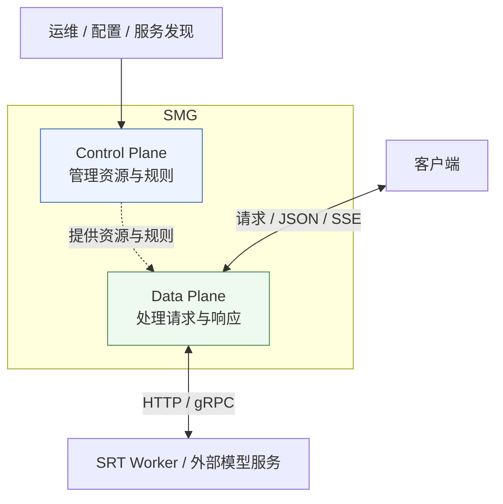
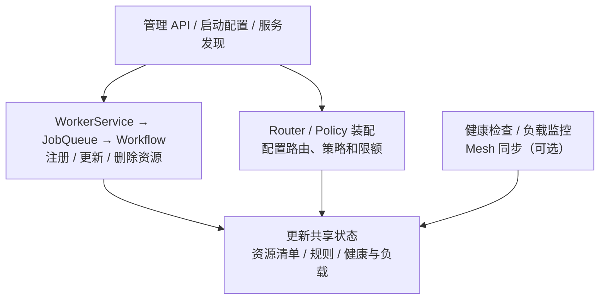
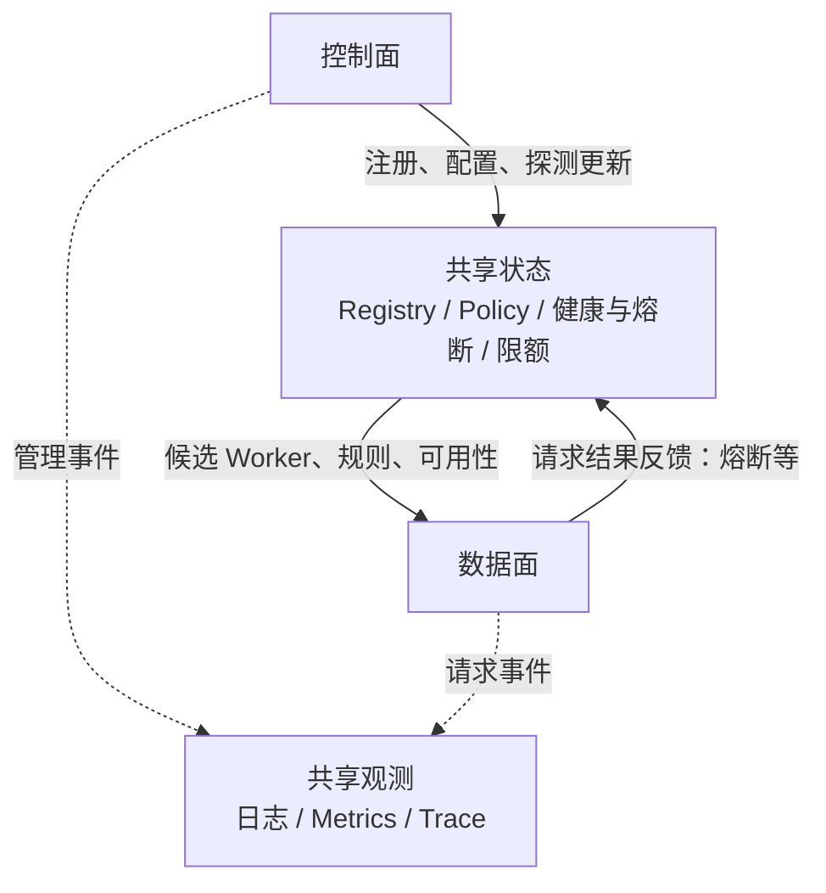

# SMG 能力边界与核心模块

SMG（SGL Model Gateway）位于客户端与模型服务之间：管理可用 Worker，把请求送到合适的 Worker，并处理协议、响应与故障。模型的 GPU 计算、逐 token 调度和 KV 内存管理由后端运行时负责。

本文按当前 checkout 的源码组织能力；“支持某能力”不代表每条路由都使用它。详细请求链路见[本地无 PD 全链路](local-chat-completions-flow.md)。

## 1. 整体能力边界

按“这段代码在做什么”划分，而不是把一个文件或结构体全部归入某一面：

| 分区 | 回答的问题 | 典型动作 |
|---|---|---|
| Control Plane（控制面） | 有哪些资源、允许怎么用？ | 注册/移除 Worker、设置策略、加载 Tokenizer、更新健康状态 |
| Data Plane（数据面） | 当前这条请求怎么处理？ | 鉴权限流、选 Worker、转发、重试、返回 JSON/SSE |
| 共享状态与观测 | 两面通过什么联系？ | Registry、策略状态、熔断状态、日志/指标/Trace |

### 图一：只看系统边界



SMG 选目标并转发；SRT 内部执行 GPU 计算、batch 调度和 KV 管理。控制面与数据面可以共处同一个 SMG 进程。

### 图二：Control Plane 管什么



这里的资源包括 Worker、Tokenizer、MCP 服务和 WASM 模块。后台持续维护状态，供数据面使用。

### 图三：Data Plane 怎么处理一条请求

```mermaid
flowchart TB
    client["客户端"]
    entry["Axum / 中间件<br/>校验、鉴权、限流、排队"]
    select["RouterManager / Router / Policy<br/>选路由实现、选 Worker"]
    call["Router<br/>协议处理、上游调用、重试"]
    worker["SRT Worker / 外部模型服务"]
    response["响应处理<br/>JSON / SSE / 错误处理"]
    client --> entry --> select --> call --> worker
    worker --> response --> client
```

Tokenizer、Parser、MCP 工具循环、会话存储、WASM 按具体路径参与请求处理。`PD Router` 协调的是 **Prefill/Decode 分离**，执行这类推理请求同样属于数据面。

### 图四：两面通过什么联系



共享状态通常是进程内对象；图中的箭头表示读写关系，不表示独立数据库或跨进程通信。

### 跨面的模块怎么分

| 对象/能力 | 控制面动作 | 数据面动作 |
|---|---|---|
| RouterManager / Policy | 创建 Router、注册策略、设置默认项 | 每条请求选 Router、执行 `select_worker()` |
| WorkerRegistry | 注册/移除 Worker、更新元数据及健康状态 | 查询候选 Worker、检查可用性 |
| Tokenizer / MCP / WASM | 加载 Tokenizer、注册工具服务或扩展模块 | 编解码 token、执行工具调用循环、处理请求扩展 |
| 熔断器 / 负载 | 设置参数、后台探测及刷新负载 | 发请求前检查熔断；用请求结果更新状态 |
| 存储 | 初始化连接、选择存储后端 | 读写用户的会话、响应和工具执行记录 |
| Mesh | 同步网关间的资源、策略等状态 | 请求处理可能读取同步后的状态；跨节点限流等能力按配置参与 |
| 日志/指标/Trace | 记录注册、初始化、健康变化 | 记录请求耗时、错误、流结束等 |

源码依据：[启动装配](../../sgl-model-gateway/src/server.rs#L810)、[请求内选路由](../../sgl-model-gateway/src/routers/router_manager.rs#L527)、[请求内选 Worker](../../sgl-model-gateway/src/routers/http/router.rs#L133)、[请求结果反馈](../../sgl-model-gateway/src/routers/http/router.rs#L328)、[流式结果跟踪](../../sgl-model-gateway/src/routers/http/router.rs#L644)。

这意味着：**选 Worker 是数据面；准备可选 Worker 和选择规则是控制面。** 用户会话数据的读写也属于数据面，不能仅因它“写数据库”就归入控制面。

| 范围 | SMG 负责 | 边界外由谁负责 |
|---|---|---|
| 请求分配 | 选模型路由、选 Worker、重试和转发 | SRT Scheduler 决定 Worker 内怎么组 batch |
| 缓存感知 | 根据前缀等信息，提高请求落到合适 Worker 的机会 | SRT 分配、保存和释放实际 KV tensor |
| PD | 选择 prefill/decode Worker，协调请求和 bootstrap 信息 | 后端执行 prefill/decode 和实际 KV 传输 |
| 协议处理 | OpenAI API、HTTP/gRPC 适配、流式输出；部分路径做 tokenize/parser | 后端执行模型 forward 与 sampling |
| Worker 生命周期 | 探测已有服务、注册、移除、检查健康、发现实例 | 机器/GPU 供给及容器扩缩容由部署平台负责 |
| 工具与历史 | 支持的 Responses 路径可编排 MCP、保存响应/会话 | MCP 服务执行工具；数据库承担持久存储 |

源码边界入口：[路由工厂](../../sgl-model-gateway/src/routers/factory.rs#L22)、[HTTP 选 Worker](../../sgl-model-gateway/src/routers/http/router.rs#L133)、[PD Router](../../sgl-model-gateway/src/routers/http/pd_router.rs)、[SRT Scheduler](../../python/sglang/srt/managers/scheduler.py)。

## 2. 核心模块：先认识这六组

| 模块 | 大白话职责 | 源码入口 |
|---|---|---|
| 入口与配置 | 接什么 API、监听哪里、开启哪些能力 | [`main.rs`](../../sgl-model-gateway/src/main.rs)、[`server.rs:545`](../../sgl-model-gateway/src/server.rs#L545)、[`config/`](../../sgl-model-gateway/src/config/) |
| RouterManager / Router | 前者选路由实现，后者组织请求处理和上游通信 | [`router_manager.rs`](../../sgl-model-gateway/src/routers/router_manager.rs)、[`RouterTrait`](../../sgl-model-gateway/src/routers/mod.rs#L41)、[`factory.rs`](../../sgl-model-gateway/src/routers/factory.rs) |
| Worker / WorkerRegistry | 记录有哪些 Worker、地址/模型/类型以及是否可用 | [`worker.rs`](../../sgl-model-gateway/src/core/worker.rs)、[`worker_registry.rs:180`](../../sgl-model-gateway/src/core/worker_registry.rs#L180) |
| Policy / PolicyRegistry | 决定候选 Worker 中选谁；保存默认和按模型配置的策略 | [`policies/mod.rs:38`](../../sgl-model-gateway/src/policies/mod.rs#L38)、[`policies/registry.rs`](../../sgl-model-gateway/src/policies/registry.rs) |
| 控制面任务 | 把注册/删除等操作交给后台执行，并编排具体步骤 | [`worker_service.rs`](../../sgl-model-gateway/src/core/worker_service.rs)、[`job_queue.rs:121`](../../sgl-model-gateway/src/core/job_queue.rs#L121)、[`steps/workflow_engines.rs:56`](../../sgl-model-gateway/src/core/steps/workflow_engines.rs#L56) |
| 可靠性与观测 | 控制并发、重试、熔断；记录发生了什么 | [`middleware.rs`](../../sgl-model-gateway/src/middleware.rs)、[`core/retry.rs`](../../sgl-model-gateway/src/core/retry.rs)、[`core/circuit_breaker.rs`](../../sgl-model-gateway/src/core/circuit_breaker.rs)、[`observability/`](../../sgl-model-gateway/src/observability/) |

`AppContext` 把共享的 registry、HTTP client、配置、queue 和其他组件接在一起。可以把它看作“共享组件清单”，字段见 [`app_context.rs:40`](../../sgl-model-gateway/src/app_context.rs#L40)。

## 3. 两条主线如何交汇

```text
控制面：初始化并持续维护可用资源

启动配置 / 管理 API / 服务发现
             |
             v
         提交 Job
             |
             v
         JobQueue --限并发--> Workflow Engine
                                  |
                                  v
                          探测 / 注册 / 更新
                                  |
                                  v
                            WorkerRegistry
                                  |
                                  | 提供候选 Worker
                                  v
数据面：处理推理请求

Client -> Axum -> RouterManager -> Router + Policy -> Worker
  ^                                    |
  +------------ JSON / SSE -------------+
```

| 容易混淆的点 | 实际关系 |
|---|---|
| `JobQueue` 是 chat 请求队列吗？ | 它排 Worker、Tokenizer、MCP、WASM 等管理任务；推理入口排队由中间件负责 |
| `JobQueue` 和 Workflow 是一回事吗？ | Queue 管排队、并发和任务状态；Workflow 管一个任务内部的步骤与依赖 |
| Queue 会一个接一个执行完吗？ | 当前实现是单 dispatcher 分发、多个 task 并发执行；默认队列容量 1000、并发许可 200 |
| `subscribe_all(LoggingSubscriber)` 在做什么？ | 给各 Workflow Engine 注册事件日志监听器，便于观察后台任务 |

证据：[Job 类型与调度](../../sgl-model-gateway/src/core/job_queue.rs#L32)、[dispatcher](../../sgl-model-gateway/src/core/job_queue.rs#L140)、[workflow 日志订阅](../../sgl-model-gateway/src/core/steps/workflow_engines.rs#L137)。

## 4. 路由能力是几个独立维度

```text
一次请求的选择
  |
  +-- 管理模式：单 Router / IGW 多 Router
  |
  +-- 后端拓扑：Regular 单 Worker / PD 双角色 Worker
  |
  +-- 上游协议：HTTP / gRPC
  |
  +-- 选择策略：round_robin / random / cache_aware / ...
```

| 路由实现 | 做什么 | 源码 |
|---|---|---|
| HTTP Regular | 选一个 Worker，转发请求 JSON 和响应 bytes | [`http/router.rs`](../../sgl-model-gateway/src/routers/http/router.rs) |
| HTTP PD | 选择 prefill/decode Worker，组织双侧请求和响应处理 | [`http/pd_router.rs`](../../sgl-model-gateway/src/routers/http/pd_router.rs) |
| gRPC Regular | 在网关准备 token 请求，通过 pipeline 调用一个 Worker并处理结果 | [`grpc/router.rs`](../../sgl-model-gateway/src/routers/grpc/router.rs)、[`grpc/pipeline.rs`](../../sgl-model-gateway/src/routers/grpc/pipeline.rs) |
| gRPC PD | 通过 gRPC pipeline 协调 prefill/decode | [`grpc/pd_router.rs`](../../sgl-model-gateway/src/routers/grpc/pd_router.rs) |
| OpenAI backend | 接入外部 OpenAI-compatible 服务 | [`openai/router.rs`](../../sgl-model-gateway/src/routers/openai/router.rs) |

“HTTP/gRPC”在这里主要指 **SMG 到 Worker** 的协议；客户端仍可通过 HTTP `/v1/chat/completions` 访问网关。

IGW 负责多 Router 协调；PD 负责 prefill/decode 拆分，两者是不同开关。策略接口统一在 [`LoadBalancingPolicy`](../../sgl-model-gateway/src/policies/mod.rs#L38)；具体算法包括轮询、随机、缓存感知、负载感知和前缀哈希等，能否使用还取决于路由提供的信息和配置。

## 5. 按需使用的辅助能力

| 能力 | 用来做什么 | 入口 / 使用边界 |
|---|---|---|
| Tokenizer / Parser | 模板处理、token 编解码、推理内容/工具调用解析 | [`routers/tokenize/`](../../sgl-model-gateway/src/routers/tokenize/)、[`routers/parse/`](../../sgl-model-gateway/src/routers/parse/)、[gRPC chat preparation](../../sgl-model-gateway/src/routers/grpc/regular/stages/chat/preparation.rs)；普通 HTTP chat 转发通常由 Worker 完成模板与 tokenize |
| MCP | 对接工具服务，支持工具执行循环 | [`openai/responses/mcp.rs`](../../sgl-model-gateway/src/routers/openai/responses/mcp.rs)；按支持的 API/路由及配置启用 |
| 响应/会话存储 | 保存和读取 Responses、Conversations 等状态 | [`routers/conversations/`](../../sgl-model-gateway/src/routers/conversations/)、[`AppContext`](../../sgl-model-gateway/src/app_context.rs#L40) 的 storage 字段；不等于缓存所有 chat 回复 |
| WASM | 在请求处理链中挂可编程扩展 | [`wasm/`](../../sgl-model-gateway/src/wasm/)、[`middleware.rs`](../../sgl-model-gateway/src/middleware.rs) |
| 服务发现 | 从 Kubernetes 等配置来源发现 Worker 并更新注册信息 | [`service_discovery.rs`](../../sgl-model-gateway/src/service_discovery.rs) |
| Mesh / HA | 多网关间同步相关状态，并提供集群管理接口 | [`routers/mesh/`](../../sgl-model-gateway/src/routers/mesh/)、[`server.rs`](../../sgl-model-gateway/src/server.rs#L745) 的 Mesh 初始化；单机主线可先跳过 |

部分实现来自依赖 crate，例如 `llm-tokenizer`、`wfaas`、`smg-mcp`、`data-connector`、`smg-mesh`；本仓库负责接入和组织它们。依赖声明见 [`Cargo.toml`](../../sgl-model-gateway/Cargo.toml#L80)，公开模块/重导出见 [`lib.rs`](../../sgl-model-gateway/src/lib.rs)。

## 6. 对外接口按用途看

| 用途 | 代表接口 |
|---|---|
| 推理 | `/v1/chat/completions`、`/generate`、`/v1/completions`、`/v1/embeddings`、`/v1/rerank`、`/v1/classify` |
| 响应与会话 | `/v1/responses`、`/v1/conversations` |
| 编解码/解析 | `/v1/tokenize`、`/v1/detokenize`、`/parse/reasoning`、`/parse/function_call` |
| 资源管理 | `/workers`、`/v1/tokenizers`、`/wasm` |
| 运维 | `/readiness`、`/liveness`、`/health`、`/v1/loads`、`/ha/...` |

注册入口是 [`server.rs:545`](../../sgl-model-gateway/src/server.rs#L545)。接口已注册不代表每个后端都实现它；部分 `RouterTrait` 默认方法返回 `501 Not Implemented`，见 [`routers/mod.rs`](../../sgl-model-gateway/src/routers/mod.rs#L41)。

## 7. 从哪里开始读

```text
本页：知道能力边界
  -> smg-learning-path.md：按阶段学习
  -> local-chat-completions-flow.md：跟一条真实调用链
  -> smg-fake-worker-lab.md：本地用日志验证
```

- [SMG 学习路线](smg-learning-path.md)
- [以 SMG 为入口：本地无 PD 请求全链路](local-chat-completions-flow.md)
- [用 Fake Worker 本地调试 SMG](smg-fake-worker-lab.md)
