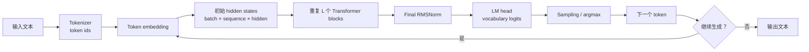
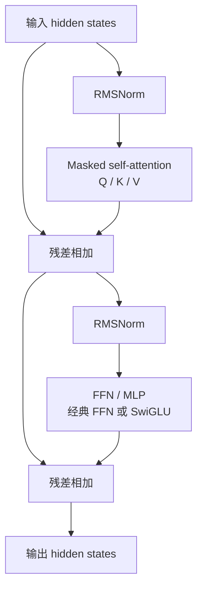
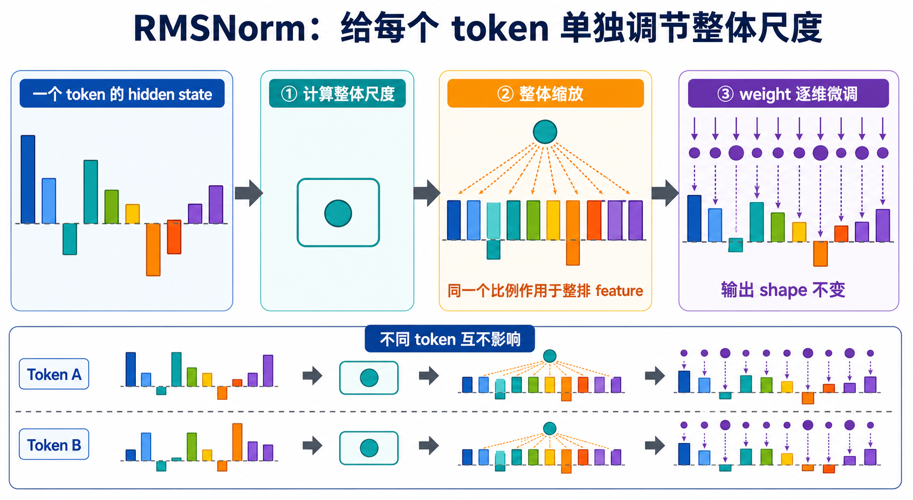

# Transformer 基础概念

本文用直观语言解释阅读 `my-sglang` 和 Triton 示例时容易混淆的 Transformer 术语。需要
公式、shape 和逐句读法时看 [Transformer 核心数学](transformer-math.md)；需要沿完整数据流
理解教学 kernel 时看 [Triton 示例中的 Transformer 数据流](triton-transformer.md)。

## 先认识 hidden state

**hidden state（隐藏状态）**是模型在某一层、为某一个 token 保存的内部特征向量。它不是
“隐藏起来、不能访问的数据”，而是相对于最终 token 概率而言的中间表示。

可以把一个 token 想成一张不断被加工的特征卡片：输入时它主要携带 token 本身的含义和位置；
经过每一层 Attention 后，它吸收其他可见 token 的上下文；经过 FFN 后，卡片内部的特征又被
重新组合。每层都会产生一份新的 hidden state。

```text
token "cat"
    ↓ tokenizer / embedding
初始 hidden state：这个 token 自身的语义和位置信息
    ↓ 多层 Attention + FFN
后续 hidden state：结合句子上下文后的语义表示
    ↓ LM head
对下一个 token 的候选分数
```

通常会用下面的 shape 表示一批 hidden states：

```text
[batch, sequence, hidden]
```

| 维度 | 含义 | 例子 |
|---|---|---|
| `batch` | 同时处理多少条请求或样本 | 2 条句子 |
| `sequence` | 每条输入中有多少个 token | 16 个 token |
| `hidden` | 每个 token 的内部特征数，也常记为模型宽度 `D` | 4096 个特征 |

例如 `[2, 16, 4096]` 表示：有 2 条序列，每条 16 个 token，每个 token 在当前层都有一个
长度为 4096 的 hidden state。Attention 主要让不同 token 的 hidden state 相互交换信息；
FFN 则独立加工每个 token 自己的 4096 个特征。

需要区分几个容易混淆的词：

| 词 | 它是什么 | 与 hidden state 的关系 |
|---|---|---|
| token id | tokenizer 输出的整数编号 | 模型输入前的离散索引，例如某个词对应 `1234`。 |
| token embedding | 由 token id 查表得到的初始向量 | 第一份 hidden state 的主要来源。 |
| position information | token 在序列中的位置信息，例如 RoPE | 让模型区分相同 token 出现在不同位置。 |
| hidden state | 某层中 token 的上下文相关内部向量 | 每经过一个 block 都会更新。 |
| logits | 映射到整个词表后的候选分数 | 由最后一层 hidden state 产生，不是 hidden state 本身。 |

## 一套完整的 decoder-only Transformer

`my-sglang` 服务的 LLM 通常是 **decoder-only Transformer**。它只根据左侧已经可见的 token
预测下一个 token；下面是从文本输入到生成 token 的完整主链。



其中“重复 L 个 Transformer blocks”是模型的主体。以现代 LLM 常见的 **pre-norm** 结构为例，
一个 block 的信息流如下：



这里的两个“残差相加”很重要：block 不要求每次从零重建 token 表示，而是在旧 hidden state
上叠加 Attention 或 FFN 学到的增量。这既保留原始信息，也让深层网络更容易训练。

### 一个 block 内部各部分做什么

| 部分 | 输入与输出 | 直观作用 |
|---|---|---|
| RMSNorm | 每个 token 的 hidden state | 稳定特征数值范围，帮助深层网络训练和推理。 |
| Q、K、V 投影 | hidden state 变成 query、key、value | 为 Attention 准备三种不同角色的特征。 |
| RoPE / 位置编码 | 加到或旋转 Q、K 的位置相关部分 | 让 Attention 知道 token 的相对位置。 |
| Masked self-attention | 所有 token 的 Q/K/V | 每个 token 聚合自己左边和当前位置的上下文，不能读取未来 token。 |
| Output projection | 多个 attention heads 合并后的结果 | 把 Attention 结果放回模型的 hidden 维度。 |
| FFN / MLP | 每个 token 的 hidden state | 在 token 内部混合 feature 维度，不直接混合不同 token。 |
| Residual connection | block 的输入与子层输出 | 保留旧表示并叠加本层新增信息。 |

## RMSNorm 是什么

RMSNorm（Root Mean Square Normalization，均方根归一化）可以先理解成 hidden state 的
“自动音量旋钮”。一个 token 的 hidden state 是一长排数字：有时整排数字整体偏大，像音量
突然太响；有时整体偏小，像音量太轻。这样的结果连续经过很多层后，会让后面的 Attention、
FFN 和残差计算更难保持稳定。

RMSNorm 会先观察**当前 token 的整排 hidden features 总体有多大**，然后用一个共同的比例
把整排数字调到较稳定的尺度。它不是把每个数字都改成同一个值，也不会抹掉这些 feature
原本表达的内容；可以把它理解为整体调节音量，而不是重写声音本身。完成统一缩放后，模型
还有一组训练得到的 `weight`，可以再分别调整每个 feature 的强弱。



可以沿着图的上半部分从左到右理解一次 RMSNorm：

1. **输入 hidden state**：不同颜色的柱子代表一个 token 的不同 feature。柱子在虚线上方或
   下方表示数值有正有负，柱子高低表示绝对值大小。
2. **计算整体尺度**：RMSNorm 查看这一整排数字，计算出一个 RMS。图中的青色圆点表示它是
   一个行级标量，而不是另一排 hidden features。
3. **整体缩放**：同一个缩放比例作用于整排 feature，所以这些柱子会一起放大或缩小；这一步
   不会把每个 feature 分别归一化，也不会改变 feature 的数量。
4. **`weight` 逐维微调**：统一缩放之后，每个 feature 再乘自己的可学习权重。图中的紫色
   圆点大小不同，表示不同 feature 的 `weight` 可以不同。

因此图中输入和输出都有同样数量的柱子，也就是 shape 不变。RMSNorm 改变的是数值尺度，
不是 hidden dimension。

### RMSNorm 沿哪个维度计算

输入通常写成 `[batch, sequence, hidden]`。RMSNorm 只查看最后的 `hidden` 维，并且对每个
token 各算各的：

```text
[batch, sequence, hidden]
                  └────┘
             RMSNorm 只观察这一排 features
```

图的下半部分把 Token A 和 Token B 分成两行：每一行都有自己的青色圆点，也就是各自计算
自己的 RMS。假如一句话里有 16 个 token，就会做 16 次互相独立的 RMSNorm。第一个 token
数值偏大，不会导致第二个 token 跟着缩小。因此 RMSNorm 不负责在 token 之间传递信息；
token 之间的信息交换仍然由 Attention 完成。

实现 kernel 时，常把前面的维度展平为 `rows = batch × sequence`，于是输入变成
`[rows, hidden]`。此时“一个 program 处理一行”就是“一个 program 处理一个 token”。

### RMSNorm 与 LayerNorm 的区别

二者都会按 token、沿 hidden dimension 调整数值，但做法不同：

| 方法 | 它会做什么 | 直观理解 |
|---|---|---|
| LayerNorm | 先减去整排数字的平均值，再调整尺度 | 既移动“中心”，又调整“音量”。 |
| RMSNorm | 不减平均值，只根据整排数字的均方根调整尺度 | 只调整“音量”，不移动“中心”。 |

所以，RMSNorm 不是 LayerNorm 的另一个名字。RMSNorm 省去了“求平均值再逐项减掉”的步骤，
计算更简单；但具体模型使用哪一种由模型架构和训练权重共同决定，不能在已有模型中随意互换。

### RMSNorm 在 Transformer block 中的位置

前面的 block 图采用现代 LLM 常见的 pre-norm 结构。这里的 `pre` 表示“放在子层之前”：
先做 RMSNorm，再把结果送入 Attention；完成第一次残差相加后，又先做 RMSNorm，再送入
FFN。所有 block 结束后通常还有一次 Final RMSNorm，然后 LM head 才把 hidden states
投影成 logits。

```text
x ──RMSNorm──Attention──加回 x──RMSNorm──FFN──残差相加──> block 输出
```

RMSNorm 的输出进入 Attention 或 FFN，但残差主路仍保留原来的 $x$。也就是说，子层收到的
是“音量整理过”的输入，而那条负责保存旧信息的残差路径没有被 RMSNorm 替换掉。
RMSNorm 的公式、epsilon 数值下限和 LayerNorm 对比见
[Transformer 核心数学](transformer-math.md#math-rmsnorm)。

### 从 hidden state 到下一个 token

最后一个 block 输出的 hidden states 仍是模型内部特征，不是文字。`Final RMSNorm` 之后，
`LM head` 会把每个 token 的 hidden 维度映射到词表大小：

```text
batch × sequence × hidden
        ↓ LM head
batch × sequence × vocabulary
```

最后一维的每个数对应一个候选 token 的分数，即 logits。生成时通常只取当前序列最后一个位置的
logits，再依照 temperature、top-k、top-p 或 argmax 等策略选择下一个 token。新 token 加入
序列后，模型继续下一轮 decode。

### Prefill、decode 与 KV cache

服务 LLM 时，完整流程通常分成两个阶段：

| 阶段 | 处理什么 | Attention 计算特点 |
|---|---|---|
| Prefill | 一次处理用户给出的整段 prompt | 为 prompt 的每个位置计算 K/V，并建立 KV cache。 |
| Decode | 每轮处理刚生成的一个 token | 只计算新 token 的 Q/K/V；历史 K/V 从 cache 读取。 |

KV cache 保存的是每一层、每个历史 token 的 key 和 value，不保存完整的 hidden state。它避免了
每生成一个 token 就重新计算整个 prompt，因此是 LLM 推理服务性能的核心。`my-sglang` 中的
调度、KV page、radix cache 和 prefill/decode 区分都围绕这条数据流设计。

服务系统还要把数学上的“第几个历史 token”映射到实际内存位置：

```text
(request row, sequence position)
              ↓ ReqToTokenPool
       physical KV slot
              ↓
       key_cache[slot] / value_cache[slot]
```

Prefill 的一个请求通常贡献多个展平 token，因此会写多个 `out_cache_loc`；decode 通常每个
请求只贡献一个 token，因此每请求新写一个 slot。Attention 再用 request row 和 `seq_len`
读取这个请求从位置 0 到当前位置的历史 slots。完整可运行的数据交接见
[从 ForwardBatch 到下一个 token](model-execution-bridge.md)。

## 原始 Transformer 与现代 LLM 的关系

最初的 Transformer 是 **encoder–decoder** 结构，常用于机器翻译：encoder 读取源语言序列，
decoder 在生成目标语言时同时读取已经生成的目标 token 和 encoder 输出。其 decoder 多了一层
cross-attention，用于关注 encoder 的结果。

```text
原始 encoder–decoder Transformer
源文本 -> encoder stack -> encoder states
目标前缀 -> decoder masked self-attention -> cross-attention -> FFN -> 下一个目标 token

现代 decoder-only LLM
文本前缀 -> decoder blocks（masked self-attention + FFN）-> 下一个 token
```

本项目和前文的 FFN、KV cache、decode 讨论默认指第二种 decoder-only LLM。它没有独立的
encoder 或 cross-attention；如果模型是 encoder–decoder 或多模态模型，主链会额外增加相应
的编码器和跨注意力模块。

## FFN 和 MLP 有什么区别

在 Transformer 语境中，FFN 和 MLP 经常指同一个模块，但两个名称强调的角度不同：

| 术语 | 全称 | 强调重点 | 使用范围 |
|---|---|---|---|
| MLP | Multi-Layer Perceptron | 多个线性层与非线性激活组成的网络结构 | 通用神经网络概念 |
| FFN | Feed-Forward Network | 数据只从输入流向输出的前馈计算；在 Transformer 中特指 Attention 旁边的逐 token 子层 | Transformer 模块角色 |
| Gated MLP | Gated Multi-Layer Perceptron | 使用两个输入投影和逐元素门控的 MLP | 现代 LLM 常见的 FFN 实现 |

因此，一个 Transformer FFN 通常由 MLP 实现。代码中的 `mlp`、`ffn`、
`feed_forward` 往往只是不同命名，判断含义时应看它包含的投影和激活，而不能只看变量名。

### 经典 FFN

经典 FFN 可以理解成“先把一张较窄的特征卡片展开，在更大的工作区里加工，再折回原来的
宽度”：第一层从 hidden dimension 升到更大的 FFN 中间维度，中间经过 GELU 或 SiLU 等
非线性激活，第二层再降回 hidden dimension。降回原宽度后，结果才能与残差主路相加。

```text
x [D] -> up projection [D_ff] -> GELU/SiLU -> down projection [D] -> y
```


上图中两端较短的向量都是 $D$ 维，中间较长的向量是 $D_{ff}$ 维。视觉上的“变宽”表示
特征维度扩张，不表示 sequence 中新增了 token。

如果去掉中间的非线性激活，两个线性变换可以合并为一个线性变换，多层结构的表达能力会
受到限制。这就是 FFN 不能只有连续矩阵乘的原因。完整公式与 shape 见
[经典 FFN](transformer-math.md#math-classic-ffn)。

### 现代 LLM 中的门控 MLP

LLaMA 等模型常使用 SwiGLU 风格的门控 FFN。输入会分成两条支路：`gate_proj` 产生“哪些
特征应该通过”的门控信号，`up_proj` 产生真正要被加工的内容。gate 分支经过 SiLU 后，两条
支路按位置相乘，最后由 `down_proj` 降回 hidden dimension。

```text
                +-> gate_proj -> SiLU --+
x [D] ----------+                        × -> down_proj -> y [D]
                +-> up_proj -------------+
```


图中的 `g × u` 表示两个中间向量按位置配对相乘，不是把两个向量再做一次矩阵乘法。

`gate_proj` 决定哪些中间特征应通过，`up_proj` 提供被门控的特征值，二者逐元素相乘后再由
`down_proj` 投影回 $D$。所以门控 MLP 仍然是 FFN，只是它不再是“一个升维投影、一个激活、
一个降维投影”的最简单结构。完整公式见
[SwiGLU 门控 FFN](transformer-math.md#math-swiglu)。

### FFN 与 Attention 的职责不同

二者在一个 Transformer block 中承担不同的信息混合：

| 模块 | 主要混合哪一维 | 作用 |
|---|---|---|
| Attention | token / sequence 维 | 让一个 token 根据其他可见 token 的信息更新表示。 |
| FFN / MLP | feature / hidden 维 | 独立变换每个 token 内部的特征。 |

设输入 shape 为 `[batch, sequence, hidden]`。忽略并行实现细节时，同一个 FFN 权重会独立
应用于每个 `[hidden]` token 向量；FFN 本身不会让不同 token 相互通信。不同 token 之间的
信息传递主要由 Attention 完成。


左图的弧线代表一个 token 可以聚合其他可见 token 的信息；右图的三个小网络结构相同、权重
共享，但它们之间没有连线，表示 FFN 对每个 token 独立执行。

### 与 Triton 示例的关系

`examples/triton` 没有直接实现完整 FFN，而是把它拆成基础原语：

| 示例 | 对应 FFN 的哪一部分 |
|---|---|
| `02_fused_elementwise.py` | bias add 和 SiLU；展示非线性与算子融合。 |
| `05_matmul.py` | `gate_proj`、`up_proj` 或 `down_proj` 所需的矩阵乘。 |
| `06_autotune_matmul.py` | 数学公式相同，但为矩阵形状选择更合适的 GPU tile。 |

示例 02 的 `silu(x + bias)` 只有一条输入分支；完整 SwiGLU 还需要另一条 `up_proj` 分支，
并在 SiLU 之后做逐元素乘法。因此示例 02 是 FFN 中激活与 fusion 的教学片段，不是完整的
经典 FFN 或门控 MLP。各示例在完整 block 中的位置见
[Triton 示例中的 Transformer 数据流](triton-transformer.md#triton-ffn)。
