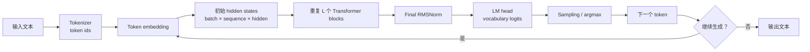
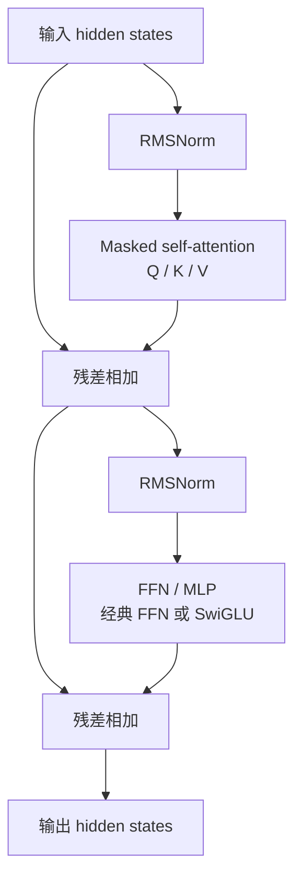
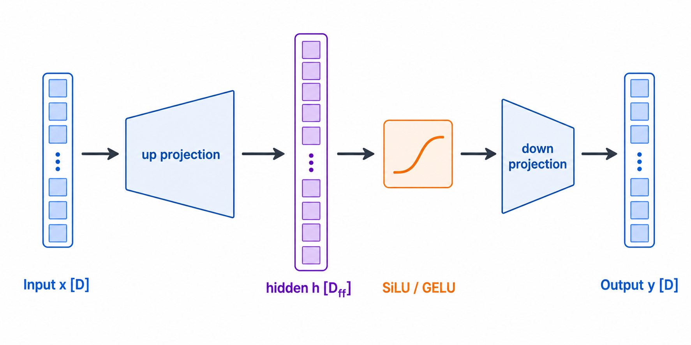
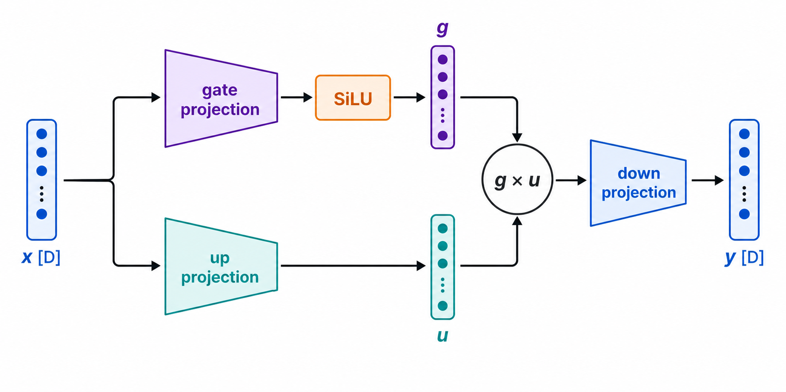
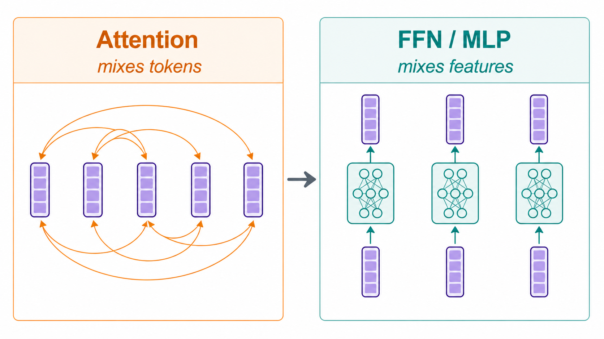

# Transformer 基础概念

本文解释阅读 `my-sglang` 和 Triton 示例时容易混淆的 Transformer 术语。算子公式与
Triton 变量的逐项对应见
[Triton 示例中的 Transformer 公式](triton-transformer-formulas.md)。

## 先认识 hidden state

**hidden state（隐藏状态）**是模型在某一层、为某一个 token 保存的内部特征向量。它不是
“隐藏起来、不能访问的数据”，而是相对于最终 token 概率而言的中间表示。

可以把一个 token 想成一张不断被加工的特征卡片：输入时它主要携带 token 本身的含义和位置；
经过每一层 Attention 后，它吸收其他可见 token 的上下文；经过 FFN 后，卡片内部的特征又被
重新组合。每层都会产生一份新的 hidden state。

```text
token "cat"
    ↓ tokenizer / embedding
初始 hidden state：这个 token 自身的语义和位置信息
    ↓ 多层 Attention + FFN
后续 hidden state：结合句子上下文后的语义表示
    ↓ LM head
对下一个 token 的候选分数
```

通常会用下面的 shape 表示一批 hidden states：

```text
[batch, sequence, hidden]
```

| 维度 | 含义 | 例子 |
|---|---|---|
| `batch` | 同时处理多少条请求或样本 | 2 条句子 |
| `sequence` | 每条输入中有多少个 token | 16 个 token |
| `hidden` | 每个 token 的内部特征数，也常记为模型宽度 `D` | 4096 个特征 |

例如 `[2, 16, 4096]` 表示：有 2 条序列，每条 16 个 token，每个 token 在当前层都有一个
长度为 4096 的 hidden state。Attention 主要让不同 token 的 hidden state 相互交换信息；
FFN 则独立加工每个 token 自己的 4096 个特征。

需要区分几个容易混淆的词：

| 词 | 它是什么 | 与 hidden state 的关系 |
|---|---|---|
| token id | tokenizer 输出的整数编号 | 模型输入前的离散索引，例如某个词对应 `1234`。 |
| token embedding | 由 token id 查表得到的初始向量 | 第一份 hidden state 的主要来源。 |
| position information | token 在序列中的位置信息，例如 RoPE | 让模型区分相同 token 出现在不同位置。 |
| hidden state | 某层中 token 的上下文相关内部向量 | 每经过一个 block 都会更新。 |
| logits | 映射到整个词表后的候选分数 | 由最后一层 hidden state 产生，不是 hidden state 本身。 |

## 一套完整的 decoder-only Transformer

`my-sglang` 服务的 LLM 通常是 **decoder-only Transformer**。它只根据左侧已经可见的 token
预测下一个 token；下面是从文本输入到生成 token 的完整主链。



其中“重复 L 个 Transformer blocks”是模型的主体。以现代 LLM 常见的 **pre-norm** 结构为例，
一个 block 的信息流如下：



这里的两个“残差相加”很重要：block 不要求每次从零重建 token 表示，而是在旧 hidden state
上叠加 Attention 或 FFN 学到的增量。这既保留原始信息，也让深层网络更容易训练。

### 一个 block 内部各部分做什么

| 部分 | 输入与输出 | 直观作用 |
|---|---|---|
| RMSNorm | 每个 token 的 hidden state | 稳定特征数值范围，帮助深层网络训练和推理。 |
| Q、K、V 投影 | hidden state 变成 query、key、value | 为 Attention 准备三种不同角色的特征。 |
| RoPE / 位置编码 | 加到或旋转 Q、K 的位置相关部分 | 让 Attention 知道 token 的相对位置。 |
| Masked self-attention | 所有 token 的 Q/K/V | 每个 token 聚合自己左边和当前位置的上下文，不能读取未来 token。 |
| Output projection | 多个 attention heads 合并后的结果 | 把 Attention 结果放回模型的 hidden 维度。 |
| FFN / MLP | 每个 token 的 hidden state | 在 token 内部混合 feature 维度，不直接混合不同 token。 |
| Residual connection | block 的输入与子层输出 | 保留旧表示并叠加本层新增信息。 |

### 从 hidden state 到下一个 token

最后一个 block 输出的 hidden states 仍是模型内部特征，不是文字。`Final RMSNorm` 之后，
`LM head` 会把每个 token 的 hidden 维度映射到词表大小：

```text
batch × sequence × hidden
        ↓ LM head
batch × sequence × vocabulary
```

最后一维的每个数对应一个候选 token 的分数，即 logits。生成时通常只取当前序列最后一个位置的
logits，再依照 temperature、top-k、top-p 或 argmax 等策略选择下一个 token。新 token 加入
序列后，模型继续下一轮 decode。

### Prefill、decode 与 KV cache

服务 LLM 时，完整流程通常分成两个阶段：

| 阶段 | 处理什么 | Attention 计算特点 |
|---|---|---|
| Prefill | 一次处理用户给出的整段 prompt | 为 prompt 的每个位置计算 K/V，并建立 KV cache。 |
| Decode | 每轮处理刚生成的一个 token | 只计算新 token 的 Q/K/V；历史 K/V 从 cache 读取。 |

KV cache 保存的是每一层、每个历史 token 的 key 和 value，不保存完整的 hidden state。它避免了
每生成一个 token 就重新计算整个 prompt，因此是 LLM 推理服务性能的核心。`my-sglang` 中的
调度、KV page、radix cache 和 prefill/decode 区分都围绕这条数据流设计。

## 原始 Transformer 与现代 LLM 的关系

最初的 Transformer 是 **encoder–decoder** 结构，常用于机器翻译：encoder 读取源语言序列，
decoder 在生成目标语言时同时读取已经生成的目标 token 和 encoder 输出。其 decoder 多了一层
cross-attention，用于关注 encoder 的结果。

```text
原始 encoder–decoder Transformer
源文本 -> encoder stack -> encoder states
目标前缀 -> decoder masked self-attention -> cross-attention -> FFN -> 下一个目标 token

现代 decoder-only LLM
文本前缀 -> decoder blocks（masked self-attention + FFN）-> 下一个 token
```

本项目和前文的 FFN、KV cache、decode 讨论默认指第二种 decoder-only LLM。它没有独立的
encoder 或 cross-attention；如果模型是 encoder–decoder 或多模态模型，主链会额外增加相应
的编码器和跨注意力模块。

## FFN 和 MLP 有什么区别

在 Transformer 语境中，FFN 和 MLP 经常指同一个模块，但两个名称强调的角度不同：

| 术语 | 全称 | 强调重点 | 使用范围 |
|---|---|---|---|
| MLP | Multi-Layer Perceptron | 多个线性层与非线性激活组成的网络结构 | 通用神经网络概念 |
| FFN | Feed-Forward Network | 数据只从输入流向输出的前馈计算；在 Transformer 中特指 Attention 旁边的逐 token 子层 | Transformer 模块角色 |
| Gated MLP | Gated Multi-Layer Perceptron | 使用两个输入投影和逐元素门控的 MLP | 现代 LLM 常见的 FFN 实现 |

因此，一个 Transformer FFN 通常由 MLP 实现。代码中的 `mlp`、`ffn`、
`feed_forward` 往往只是不同命名，判断含义时应看它包含的投影和激活，而不能只看变量名。

### 公式中的符号怎么读

后文公式会反复使用下面这些写法：

| 符号 | 常见读法 | 表达的意思 |
|---|---|---|
| $x\in\mathbb{R}^{D}$ | “x 属于 D 维实数空间” | `x` 是一个包含 $D$ 个实数的向量。 |
| $W\in\mathbb{R}^{D\times D_{ff}}$ | “W 属于 D 乘 D-ff 维实数矩阵空间” | `W` 是一个有 $D$ 行、$D_{ff}$ 列的矩阵。这里的“乘”描述 shape，不是现在执行乘法。 |
| $xW$ | “x 乘 W” | 向量与矩阵相乘，也就是一次线性投影。它会混合 `x` 的各个特征。 |
| $xW+b$ | “x 乘 W 加 b” | 在线性投影结果上逐元素加 bias。 |
| $\phi(z)$ | “phi 作用于 z” | 对 `z` 应用激活函数；$\phi$ 是函数名，不是一个普通乘数。 |
| $\operatorname{SiLU}(z)$ | “z 的 SiLU”或“SiLU 作用于 z” | 对 `z` 的每个元素应用 SiLU 激活。 |
| $a\odot b$ | “a 与 b 逐元素相乘” | 两个相同 shape 的向量对应位置相乘，不是矩阵乘法。 |
| $W_1$、$b_1$ | “W one（W 一）”“b one（b 一）” | 下标用于区分第一层和第二层的参数，不表示幂。 |

公式通常从最内层开始理解。例如 $\phi(xW_1+b_1)$ 的计算顺序是：先算 $xW_1$，再加
$b_1$，最后应用 $\phi$。括号不仅便于阅读，也规定了运算顺序。

### 经典 FFN

对单个 token 的 hidden state
$x\in\mathbb{R}^{D}$，经典两层 FFN 可以写成：

$$
h = \phi(xW_1+b_1),
$$

读作：“$h$ 等于 phi 作用于 $x$ 乘 $W_1$ 加 $b_1$。”

它表达的计算是：先用第一层权重 $W_1$ 把输入特征从 $D$ 维投影到 $D_{ff}$ 维，再加第一层
bias $b_1$，最后逐元素应用激活函数 $\phi$。结果 $h$ 是 FFN 的中间表示，其 shape 为
`[D_ff]`。

$$
y = hW_2+b_2,
$$

读作：“$y$ 等于 $h$ 乘 $W_2$ 加 $b_2$。”

它表达的计算是：用第二层权重 $W_2$ 把中间表示 $h$ 从 $D_{ff}$ 维投影回 $D$ 维，再加
第二层 bias $b_2$。最终 $y$ 与输入 $x$ 具有相同的 hidden dimension，因此可以继续进入
残差连接或下一个 Transformer 子层。

其中：

- $D$ 是模型的 hidden dimension。
- $W_1\in\mathbb{R}^{D\times D_{ff}}$ 先把特征升维到 $D_{ff}$。
- $\phi$ 通常是 GELU 或 SiLU，负责引入非线性。
- $W_2\in\mathbb{R}^{D_{ff}\times D}$ 再把特征投影回 hidden dimension。

```text
x [D] -> up projection [D_ff] -> GELU/SiLU -> down projection [D] -> y
```



上图中两端较短的向量都是 $D$ 维，中间较长的向量是 $D_{ff}$ 维。视觉上的“变宽”表示
特征维度扩张，不表示 sequence 中新增了 token。

如果去掉中间的非线性激活，两个线性变换可以合并为一个线性变换，多层结构的表达能力会
受到限制。这就是 FFN 不能只有连续矩阵乘的原因。

### 现代 LLM 中的门控 MLP

LLaMA 等模型常使用 SwiGLU 风格的门控 FFN：

$$
g = \operatorname{SiLU}(xW_{gate}),
$$

读作：“$g$ 等于 SiLU 作用于 $x$ 乘 $W_{gate}$。”

它表达 `gate_proj` 分支：先把 $x$ 投影到 FFN 中间维度，再用 SiLU 产生门控值 $g$。
$g$ 的每个位置决定对应中间特征应保留、减弱还是改变符号。

$$
u = xW_{up},
$$

读作：“$u$ 等于 $x$ 乘 $W_{up}$。”

它表达 `up_proj` 分支：把同一个输入 $x$ 投影到与 $g$ 相同的中间维度，得到真正要被门控
的特征 $u$。这一分支没有先经过 SiLU。

$$
y = (g\odot u)W_{down},
$$

读作：“$y$ 等于 $g$ 与 $u$ 逐元素相乘，再乘 $W_{down}$。”

它表达的计算顺序是：先让门控值 $g$ 与内容特征 $u$ 对应位置相乘，再通过
`down_proj` 把中间维度投影回 hidden dimension。括号中的 $g\odot u$ 是逐元素乘法，
括号外与 $W_{down}$ 的运算才是矩阵乘法。

其中 $\odot$ 表示逐元素乘法。

```text
                +-> gate_proj -> SiLU --+
x [D] ----------+                        × -> down_proj -> y [D]
                +-> up_proj -------------+
```



图中的 `g × u` 对应公式 $g\odot u$。这里画成乘号是为了强调两个中间向量按位置配对，不是
把两个向量再做一次矩阵乘法。

`gate_proj` 决定哪些中间特征应通过，`up_proj` 提供被门控的特征值，二者逐元素相乘后再由
`down_proj` 投影回 $D$。所以门控 MLP 仍然是 FFN，只是它不再是“一个升维投影、一个激活、
一个降维投影”的最简单结构。

### FFN 与 Attention 的职责不同

二者在一个 Transformer block 中承担不同的信息混合：

| 模块 | 主要混合哪一维 | 作用 |
|---|---|---|
| Attention | token / sequence 维 | 让一个 token 根据其他可见 token 的信息更新表示。 |
| FFN / MLP | feature / hidden 维 | 独立变换每个 token 内部的特征。 |

设输入 shape 为 `[batch, sequence, hidden]`。忽略并行实现细节时，同一个 FFN 权重会独立
应用于每个 `[hidden]` token 向量；FFN 本身不会让不同 token 相互通信。不同 token 之间的
信息传递主要由 Attention 完成。



左图的弧线代表一个 token 可以聚合其他可见 token 的信息；右图的三个小网络结构相同、权重
共享，但它们之间没有连线，表示 FFN 对每个 token 独立执行。

### 与 Triton 示例的关系

`examples/triton` 没有直接实现完整 FFN，而是把它拆成基础原语：

| 示例 | 对应 FFN 的哪一部分 |
|---|---|
| `02_fused_elementwise.py` | bias add 和 SiLU；展示非线性与算子融合。 |
| `05_matmul.py` | `gate_proj`、`up_proj` 或 `down_proj` 所需的矩阵乘。 |
| `06_autotune_matmul.py` | 数学公式相同，但为矩阵形状选择更合适的 GPU tile。 |

示例 02 的 `silu(x + bias)` 只有一条输入分支；完整 SwiGLU 还需要另一条 `up_proj` 分支，
并在 SiLU 之后做逐元素乘法。因此示例 02 是 FFN 中激活与 fusion 的教学片段，不是完整的
经典 FFN 或门控 MLP。
