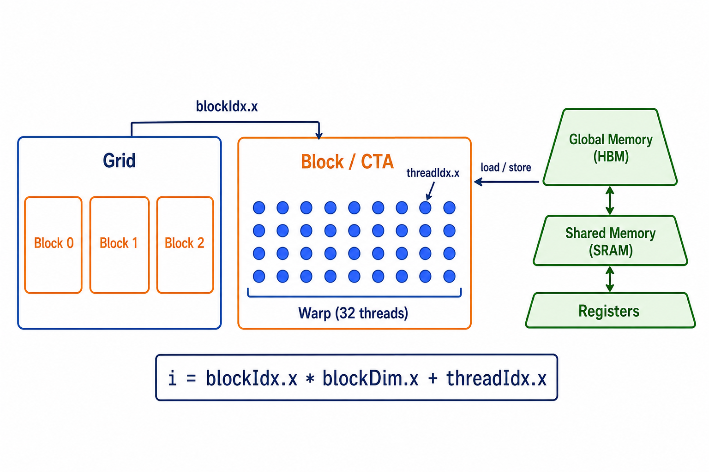

# Triton 基础：从 GPU/CUDA 到 CPU 模拟

目标：读完后能解释一个简单 Triton kernel 的数据怎样流动，并知道哪些结论必须留到
真实 GPU 上验证。

```text
数学公式                    z[i] = x[i] + y[i]
                              │
CUDA 执行模型        Grid -> Block -> Thread -> 一个或多个元素
                              │
Triton 编程模型      Grid -> Program -> logical lanes -> offsets
                              │
本项目 CPU 模拟      for pid -> NumPy offsets -> masked load/store
```

## 1. GPU 为什么需要 kernel

GPU 的强项是并行处理大量相同规则的数据；弱点仍是从显存取数据的成本。

```text
HBM / Global Memory     容量大、远离计算单元、访问昂贵
          │ load/store
SRAM / Shared Memory    芯片内、较快、容量小
          │
Registers               最靠近计算、容量最小
```

例如 `out = (x + y) * scale`：若拆成两个 kernel，中间 `x + y` 要写入 HBM 后再读回；
若在一个 kernel 内完成，临时值可留在计算过程中。这是 fusion 的动机。这里的 CPU 示例
只验证两种写法得到同样结果，**不证明任何加速比**。

## 2. CUDA：显式描述硬件层级

CUDA 用 grid 启动许多 block，每个 block 内有多个 thread。最小 vector add 常写成：



图中左侧回答“谁处理数据”：`Grid` 包含多个 `Block/CTA`，一个 block 内有多个
thread，硬件通常以 32 个 thread 组成一个 warp 调度。右侧回答“数据在哪里”：thread
通过 load/store 从 HBM 读取数据；同一 block 的 thread 可协作使用 SRAM，而寄存器保存
最靠近计算的临时值。最下方公式把 block 和 thread 的编号合成为向量元素下标。

```cpp
__global__ void add(float* x, float* y, float* out, int n) {
  int i = blockIdx.x * blockDim.x + threadIdx.x;
  if (i < n) out[i] = x[i] + y[i];
}
// grid = ceil_div(n, threads_per_block)
```

| CUDA 概念 | 大白话 | vector add 中的作用 |
|---|---|---|
| Kernel | GPU 上重复执行的规则 | `add` 函数 |
| Grid | 这次启动的所有 block | 覆盖整个向量 |
| Block / CTA | 一组可协作的 threads | 处理一段连续下标 |
| Thread | 单个并行执行单元 | 算一个 `i` |
| Warp | GPU 通常以 32 threads 为组调度 | 影响真实性能和分支行为 |
| `blockIdx/threadIdx` | block 和 thread 的编号 | 计算 `i` |

## 3. Triton：以数据块而不是单 thread 编程

Triton 把“这一组元素怎么做”写成一个 program：

```python
@triton.jit
def add(x_ptr, y_ptr, out_ptr, n: tl.constexpr, BLOCK: tl.constexpr):
    pid = tl.program_id(0)
    offsets = pid * BLOCK + tl.arange(0, BLOCK)
    mask = offsets < n
    x = tl.load(x_ptr + offsets, mask=mask)
    y = tl.load(y_ptr + offsets, mask=mask)
    tl.store(out_ptr + offsets, x + y, mask=mask)

# grid = (triton.cdiv(n, BLOCK),)
```

```text
n=1003, BLOCK=256

program 0: offsets 0..255       全部有效
program 1: offsets 256..511     全部有效
program 2: offsets 512..767     全部有效
program 3: offsets 768..1023    只有 768..1002 有效，mask 屏蔽其余位置
```

| Triton 概念 | 作用 | CPU 示例中的等价物 |
|---|---|---|
| `grid` | 启动多少个 program | `range(ceil_div(n, block_size))` |
| `tl.program_id(0)` | 当前 program 编号 | `pid` |
| `tl.arange(0, BLOCK)` | program 内的一组逻辑下标 | `np.arange(block_size)` |
| `offsets` | 本 program 所有元素下标 | `pid * block_size + arange` |
| `mask` | 哪些下标不越界 | `offsets < n` |
| `tl.load/store` | 对全局内存读写 | masked NumPy gather/scatter |
| `tl.max/sum` | program 内归约 | `np.max/np.sum` |

## 4. CUDA 和 Triton 的关系：近似映射，不是一一映射

```text
CUDA:     一个 block 里有很多真实 threads，硬件按 warp 调度
                         │
Triton:   一个 program 描述一个数据 tile，编译器决定其 thread/warp 实现
                         │
CPU:      一个 pid 顺序执行一个 NumPy 向量操作
```

| CUDA | Triton | 结论 |
|---|---|---|
| Grid | `grid` | 都决定工作单元数量 |
| `blockIdx.x` | `tl.program_id(0)` | 一维例子中可直接类比 |
| Block / CTA | Program instance | 常可建立直觉，但不是语言保证的一一映射 |
| Thread / lane | `tl.arange` 的 logical lane | **一个 offsets 元素不等于一个 CUDA thread** |
| Warp | `num_warps` 编译参数 | Triton 交给编译器映射，CPU 无对应物 |
| Global memory | 指针 + `tl.load/store` | CPU 用 NumPy 数组模拟访问语义 |
| Register / SRAM | `tl.tensor` 与编译器布局 | 不能由本目录观察或控制 |

因此，`BLOCK_SIZE=256` 表示一个 program 的逻辑 tile 大小；它不等于“创建 256 个
CUDA threads”。真实映射还受 dtype、layout、GPU 架构和 `num_warps` 影响。

## 5. 从 elementwise 到 LLM 小算子

```text
vector add
  └─ 每个 offsets 独立计算
       │
fused vector
  └─ 临时值不必作为独立数组写回
       │
row softmax
  └─ 一行一个 program；先 max，再 sum，再写回
       │
RMSNorm
  └─ 一行平方和归约，再与 weight 融合写回
```

softmax 的稳定计算式：

```text
m       = max(x)
softmax = exp(x - m) / sum(exp(x - m))
```

RMSNorm 的本例计算式：

```text
inv_rms = 1 / sqrt(mean(x * x) + eps)
out     = x * inv_rms * weight
```

两者都先让一个 program 负责一行。为让 CPU 示例与这一直觉一致，要求
`block_size >= cols`；真实 Triton 为超长行会采用多个 tile、分阶段归约等更复杂策略，
不属于本入门范围。

## 6. CPU 模拟到底验证什么

| 可以从本目录得出的结论 | 不能从本目录得出的结论 |
|---|---|
| offsets 是否覆盖了全部元素 | GPU kernel 是否更快 |
| 尾块 mask 是否避免越界 | HBM 是否合并访问 |
| 归约和融合的数值是否正确 | warp 是否分歧、寄存器是否溢出 |
| Triton 伪代码的数据依赖是否合理 | `BLOCK_SIZE`/`num_warps` 的最优值 |

运行入口和四个例子的顺序见 [examples/triton](../examples/triton/README.md)。
