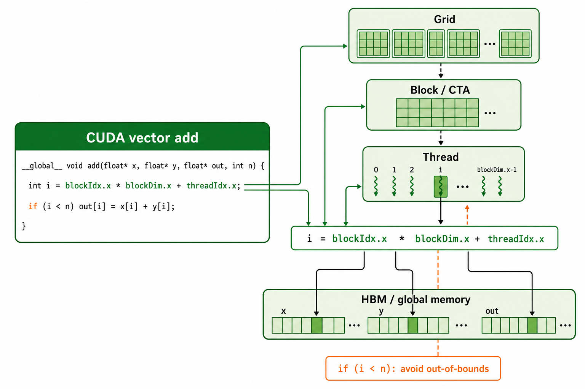
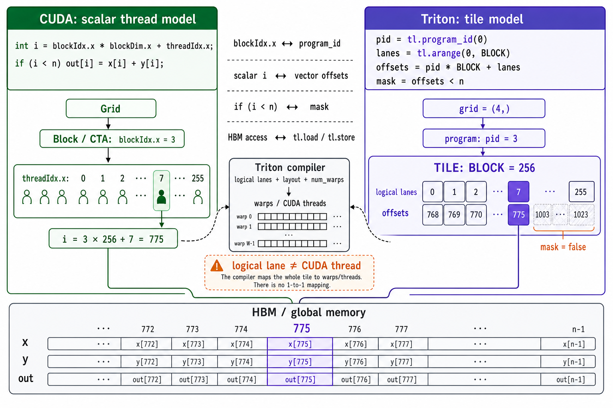

# Triton 与 CUDA：代码概念映射

本文用 CUDA vector-add 解释 Triton 的 program、tile 和 logical lane。当前代码默认
在 Docker 的 Triton CPU interpreter 中做数值验证；不用 NumPy，也不要把这个结果当成
CUDA 编译或 GPU 性能证据。

## 1. 先把 CUDA vector add 看懂



```cpp
__global__ void add(float* x, float* y, float* out, int n) {
  int i = blockIdx.x * blockDim.x + threadIdx.x;
  if (i < n) out[i] = x[i] + y[i];
}
// grid = ceil_div(n, threads_per_block)
```

它只做一件事：**每个 CUDA thread 算一个下标 `i`，从 HBM 读 `x[i]` 和 `y[i]`，再写
`out[i]`。** 为了让足够多的 thread 覆盖整个向量，CUDA 把它们分成下面三层。

| 概念 | 在 add 代码中的位置 | 它到底做什么 |
|---|---|---|
| Kernel | `__global__ void add(...)` | GPU 上执行的函数；CPU 发起一次 launch 后，它会被很多 thread 并行执行。 |
| Grid | `ceil_div(n, threads_per_block)` 个 block | 本次 launch 的全部工作；目标是覆盖 `0..n-1`。 |
| Block / CTA | `blockIdx.x` 选中的一组 thread | Grid 的一个工作块；同一 block 的 thread 可协作、可共享 shared memory。 |
| Thread | `threadIdx.x` 选中的一个执行者 | 本例恰好负责一个元素 `i`。 |
| `blockDim.x` | 每个 block 的 thread 数 | 把 block 编号转换为该 block 覆盖的起始下标。 |
| 全局内存 / HBM | `x[i]`、`y[i]`、`out[i]` | GPU 显存；本例的 thread 从这里读两个数、写一个数。 |
| 边界判断 | `if (i < n)` | 最后一个 block 通常不能整除；越界 thread 必须不访问 HBM。 |

```text
blockIdx.x = 3, blockDim.x = 256, threadIdx.x = 7
                        │
                        └── i = 3 * 256 + 7 = 775
                            读 x[775], y[775]  →  写 out[775]
```

### 不要把一维 vector add 想成行和列

这里的 `.x` 只是 CUDA 的 **x 维坐标**，不表示矩阵的“列”；这个 kernel 也没有“当前行”。

| 变量 | 正确理解 | 常见误解 |
|---|---|---|
| `blockIdx.x = 3` | 第 3 个数据块 | 当前行号 |
| `blockDim.x = 256` | 每个数据块有 256 个 thread，覆盖 256 个连续元素 | 向量总列数 |
| `threadIdx.x = 7` | 当前数据块内第 7 个 thread | 二维表格的单元格坐标 |
| `n = 1003` | 整个向量的总元素数 | `blockDim.x` |

```text
n = 1003, blockDim.x = 256

block 0: 元素 0........255
block 1: 元素 256......511
block 2: 元素 512......767
block 3: 元素 768......1002
                 ↑
      blockIdx.x=3, threadIdx.x=7  →  i=775
```

因此应把它理解为“第 3 个、长度为 256 的分段中的第 7 个位置”。二维矩阵 kernel 才常用
`blockIdx.y` 类比行、`blockIdx.x` 类比列；这份 vector add 只有一维。

先建立这个模型，再看 Triton：Triton 不让你逐 thread 写 `i`，而是让你一次描述一个数据块
（tile）要做什么，再交给编译器映射到 CUDA 的 warps 和 threads。

## 2. 再看 Triton vector add

运行文件：[examples/triton/01_vector_add.py](../examples/triton/01_vector_add.py)。

```python
program_id = tl.program_id(axis=0)
offsets = program_id * BLOCK_SIZE + tl.arange(0, BLOCK_SIZE)
mask = offsets < n_elements
x = tl.load(x_ptr + offsets, mask=mask, other=0.0)
tl.store(output_ptr + offsets, x + y, mask=mask)
```

`n=1003, BLOCK_SIZE=256` 时：

```text
grid = (ceil_div(1003, 256),) = (4,)

program 0  -> offsets 0..255
program 1  -> offsets 256..511
program 2  -> offsets 512..767
program 3  -> offsets 768..1023  ── mask 只允许 768..1002 读写
```

| 源码 | CUDA 层面的意思 |
|---|---|
| `@triton.jit` | 声明 Triton kernel；CUDA 模式下编译执行，interpreter 模式下在 CPU 逐 op 解释。 |
| `kernel[grid](...)` | 按 grid 启动 program instances。 |
| `tl.program_id(0)` | 当前 program 的一维工作编号。 |
| `tl.arange` | 形成该 program 要处理的逻辑元素向量。 |
| `mask` | 尾块屏蔽越界 lane；没有它会非法访问 HBM。 |
| `num_warps=4` | 给编译器的并行度提示，不改变数学结果。 |

## 3. 已理解 CUDA 后，再看两者怎样对应



这不是逐词翻译。左边 CUDA 是“每个 thread 怎样算一个 `i`”；右边 Triton 是“一个
program 怎样处理一整个 tile”。二者最终都编译成在 GPU 上读写 HBM 的机器指令。

以图中的 `pid=3、BLOCK=256` 为例，Triton 源码表达了四层逻辑：

| 层次 | 图中的值 | 含义 |
|---|---|---|
| Program | `pid = 3` | grid 中第 3 个 program instance。 |
| Tile | `BLOCK = 256` | 这个 program 一次负责的逻辑数据块，共 256 个元素位置。 |
| Logical lanes | `0, 1, 2, ..., 255` | `tl.arange` 生成的 tile 内相对位置；它们是逻辑索引，不是 256 个 CUDA thread。 |
| Offsets | `768, 769, ..., 1023` | `pid * BLOCK + lanes` 得到的全局元素下标，用于计算 HBM 地址。 |

```text
lane 7 是 tile 内位置
   │
   └── offset = pid * BLOCK + lane
              = 3 * 256 + 7
              = 775                 → 访问 x[775]、y[775]、out[775]
```

Tile 是 Triton 程序员描述工作的单位；logical lane 是 tile 内的坐标。Triton 编译器再结合
layout 和 `num_warps`，把整个 tile 降到真实 warps/threads。因此不能把 lane 7 理解为
CUDA 的 `threadIdx.x=7`，即使这个简单例子里两边最终都算到了元素 775。

| CUDA 中你亲自写的东西 | Triton 中你写的东西 | 正确理解 |
|---|---|---|
| `grid` 启动多个 block | `grid` 启动多个 program instance | 都决定有多少份工作，不要求底层 launch 形状完全相同。 |
| `blockIdx.x` 选择一个 block | `tl.program_id(0)` 选择一个 program | 一维 vector add 中可直接建立这个类比。 |
| `threadIdx.x` 选择一个 thread | 无逐 thread 的源代码变量 | Triton 把 thread/warp 的分配交给编译器。 |
| `blockDim.x` 和 `threadIdx.x` 拼出单个 `i` | `tl.arange` 形成一组 `offsets` | `offsets` 是 tile 的逻辑 lane；一个 lane **不等于**一个 CUDA thread。 |
| `if (i < n)` 防越界 | `mask = offsets < n` | 都屏蔽尾部无效元素，避免非法 HBM 访问。 |
| `x[i]` / `out[i]` | `tl.load(ptr + offsets)` / `tl.store(...)` | 都是 global-memory/HBM 访问，只是 Triton 一次表达多个逻辑元素。 |
| 直接组织 threads 和 warps | `num_warps` 作为编译提示 | `num_warps` 影响实现和性能，不改变数学结果。 |

**边界：** 一个 Triton program 常可帮助你类比一个 CUDA block/CTA，但这不是 Triton
语言保证的一一映射；真实实现还取决于 GPU 架构、dtype、layout 和编译器决策。

## 当前验证方式：Docker CPU interpreter

```bash
docker build --platform linux/amd64 \
  -f my-sglang/docker/triton-interpreter.Dockerfile \
  -t my-sglang-triton:interpreter my-sglang
docker run --rm --platform linux/amd64 my-sglang-triton:interpreter
```

预期最后输出 `PASS all Triton CPU-interpreter lessons`。脚本将 Triton 输出与
PyTorch CPU reference 对比；这只验证 kernel 语义和边界 mask。

## 性能要从硬件事实出发

```text
HBM 读取 x,y ──> program 内计算 ──> HBM 写回 out
                   ↑
          少一次中间 HBM 往返，fusion 才可能变快
```

| 可以用真实 GPU 实测 | 仍需 profiler/benchmark 才能下结论 |
|---|---|
| kernel 可编译、可启动、结果正确 | 最优 `BLOCK_SIZE` / `num_warps` |
| mask 是否正确处理尾块 | HBM 是否合并访问、是否带宽受限 |
| 不同配置的端到端耗时 | 寄存器压力、occupancy、warp 分歧的根因 |

测量时先 `torch.cuda.synchronize()`，做 warmup，再用 CUDA event 或 benchmark 工具多次测量。
不要把一次 Python 调用耗时、CPU interpreter 结果或 NumPy 对比结果当成 Triton 性能数据。
