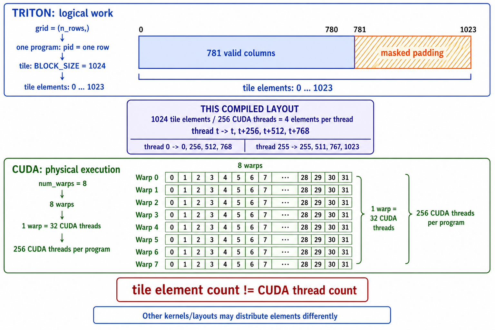

# Triton 与 CUDA：代码概念映射

本文用 CUDA vector-add 解释 Triton 的 program、tile 和 tile element。当前代码默认
在 Docker 的 Triton CPU interpreter 中做数值验证；不用 NumPy，也不要把这个结果当成
CUDA 编译或 GPU 性能证据。

## 1. 先把两套概念分开

先记住一句话：**Triton 源码描述逻辑数据块，CUDA warps/threads 负责在 GPU 上执行它。**

```text
Triton 程序员描述的逻辑工作
grid -> program -> tile -> Triton logical positions
                         │
                         │ Triton 编译器映射整个 tile
                         ▼
CUDA GPU 的物理执行资源
       program -> num_warps 个 warp -> 每个 warp 32 个 CUDA threads
```

`warp` 的拼写是 **warp**，不是 `wrap`。它们分属两套模型：

| 概念 | 属于哪层 | 大白话 | 它不是什么 |
|---|---|---|---|
| Grid | Triton launch | 这次 launch 总共启动多少个 program。 | 不是 CUDA thread 数。 |
| Program instance | Triton 逻辑工作 | kernel 的一份实例；`tl.program_id` 标识当前是哪份工作。 | 不是一个 CUDA thread。 |
| Tile | Triton 逻辑数据 | 一个 program 一次描述的数据块。 | 不是一组物理 threads。 |
| Tile element / position | Triton 逻辑数据 | `tl.arange` 产生的 tile tensor 元素位置。 | 不是 CUDA thread，也不是 CUDA warp lane。 |
| Warp | CUDA 物理执行 | NVIDIA GPU 上一组同步调度的 32 个 threads。 | 不是 tile，也不是 32 个 Triton programs。 |
| CUDA thread | CUDA 物理执行 | 实际执行 GPU 指令的单个执行上下文，CUDA 源码中有 `threadIdx`。 | 不等于一个 Triton logical position。 |
| CUDA warp lane | CUDA 物理执行 | 一个 thread 在 warp 内的位置，范围是 `0..31`。 | 不是 `tl.arange(0, BLOCK_SIZE)` 的元素编号。 |

> **用词纠正：** 本文不再把 `tl.arange` 元素称为 logical lane，而是称为
> **tile element / tile position**。`lane` 只留给 CUDA warp lane，即 warp 内的 thread 编号。

下图以 `03_row_softmax.py` 的默认参数为例。蓝色上半部是 **1024 个数据元素**，
绿色下半部是 **256 个执行者**；两个数字本来就不需要相等：



### 1024 个 tile elements 与 256 个 threads 的关系

在当前 `BLOCK_SIZE=1024、num_warps=8` 的编译结果中：

```text
8 warps × 32 threads/warp = 256 threads
1024 tile elements ÷ 256 threads = 4 elements/thread
```

对 CUDA thread `t`，当前编译 layout 的具体分配是：

```text
thread t -> t, t+256, t+512, t+768

thread 0   -> 0,   256, 512, 768
thread 1   -> 1,   257, 513, 769
thread 255 -> 255, 511, 767, 1023
```

这是“256 个工人处理 1024 个数据位置”，而不是“1024 个逻辑资源对应 256 个物理资源”。
每个 thread 用寄存器保存自己的 4 个元素值，先做局部计算，再与其他 threads 协作做
`tl.max` 和 `tl.sum` 归约。

真实列只有 `0..780`，所以 thread `0..12` 各有 4 个有效元素；thread `13..255` 的第 4 个元素
落在 `781..1023`，会被 mask。有效元素总数正好是：

```text
13 threads × 4 valid elements + 243 threads × 3 valid elements = 781
```

当前 Triton 3.7.1 针对 SM80 离线编译生成的 TTGIR 中，布局证据是：

```text
#blocked = #ttg.blocked<{sizePerThread = [1], threadsPerWarp = [32],
                        warpsPerCTA = [8], order = [0]}>
```

这个基础 layout 一轮覆盖 `1×32×8=256` 个元素；1024 元素的 tensor 把它重复 4 轮，
所以每个 thread 最终拥有 4 个元素。对应 PTX 也直接构造了 `t`、`t+256`、`t+512`、
`t+768` 四个下标。

**边界：** “每 thread 4 个元素”是这个 kernel、shape、`num_warps` 和当前 layout 的结果，
不是 Triton 语法永远保证的固定关系。换一个 tile shape、`num_warps` 或 layout，每个 thread 拥有的
元素数和具体下标都可能变化。

## 2. 先把 CUDA vector add 看懂


```cpp
__global__ void add(float* x, float* y, float* out, int n) {
  int i = blockIdx.x * blockDim.x + threadIdx.x;
  if (i < n) out[i] = x[i] + y[i];
}
// grid = ceil_div(n, threads_per_block)
```

它只做一件事：**每个 CUDA thread 算一个下标 `i`，从 HBM 读 `x[i]` 和 `y[i]`，再写
`out[i]`。** 为了让足够多的 thread 覆盖整个向量，CUDA 把它们分成下面三层。

| 概念 | 在 add 代码中的位置 | 它到底做什么 |
|---|---|---|
| Kernel | `__global__ void add(...)` | GPU 上执行的函数；CPU 发起一次 launch 后，它会被很多 thread 并行执行。 |
| Grid | `ceil_div(n, threads_per_block)` 个 block | 本次 launch 的全部工作；目标是覆盖 `0..n-1`。 |
| Block / CTA | `blockIdx.x` 选中的一组 thread | Grid 的一个工作块；同一 block 的 thread 可协作、可共享 shared memory。 |
| Warp | block 内每 32 个 thread 组成的调度组 | CUDA 代码通常不直接为它编号，但 GPU 以 warp 为核心单位调度 threads。 |
| Thread | `threadIdx.x` 选中的一个执行者 | 本例恰好负责一个元素 `i`。 |
| `blockDim.x` | 每个 block 的 thread 数 | 把 block 编号转换为该 block 覆盖的起始下标。 |
| 全局内存 / HBM | `x[i]`、`y[i]`、`out[i]` | GPU 显存；本例的 thread 从这里读两个数、写一个数。 |
| 边界判断 | `if (i < n)` | 最后一个 block 通常不能整除；越界 thread 必须不访问 HBM。 |

```text
blockIdx.x = 3, blockDim.x = 256, threadIdx.x = 7
                        │
                        └── i = 3 * 256 + 7 = 775
                            读 x[775], y[775]  →  写 out[775]
```

### 不要把一维 vector add 想成行和列

这里的 `.x` 只是 CUDA 的 **x 维坐标**，不表示矩阵的“列”；这个 kernel 也没有“当前行”。

| 变量 | 正确理解 | 常见误解 |
|---|---|---|
| `blockIdx.x = 3` | 第 3 个数据块 | 当前行号 |
| `blockDim.x = 256` | 每个数据块有 256 个 thread，覆盖 256 个连续元素 | 向量总列数 |
| `threadIdx.x = 7` | 当前数据块内第 7 个 thread | 二维表格的单元格坐标 |
| `n = 1003` | 整个向量的总元素数 | `blockDim.x` |

```text
n = 1003, blockDim.x = 256

block 0: 元素 0........255
block 1: 元素 256......511
block 2: 元素 512......767
block 3: 元素 768......1002
                 ↑
      blockIdx.x=3, threadIdx.x=7  →  i=775
```

因此应把它理解为“第 3 个、长度为 256 的分段中的第 7 个位置”。二维矩阵 kernel 才常用
`blockIdx.y` 类比行、`blockIdx.x` 类比列；这份 vector add 只有一维。

先建立这个模型，再看 Triton：Triton 不让你逐 thread 写 `i`，而是让你一次描述一个数据块
（tile）要做什么，再交给编译器映射到 CUDA 的 warps 和 threads。

## 3. 再看 Triton vector add

运行文件：[examples/triton/01_vector_add.py](../examples/triton/01_vector_add.py)。

```python
program_id = tl.program_id(axis=0)
offsets = program_id * BLOCK_SIZE + tl.arange(0, BLOCK_SIZE)
mask = offsets < n_elements
x = tl.load(x_ptr + offsets, mask=mask, other=0.0)
tl.store(output_ptr + offsets, x + y, mask=mask)
```

`n=1003, BLOCK_SIZE=256` 时：

```text
grid = (ceil_div(1003, 256),) = (4,)

program 0  -> offsets 0..255
program 1  -> offsets 256..511
program 2  -> offsets 512..767
program 3  -> offsets 768..1023  ── mask 只允许 768..1002 读写
```

| 源码 | CUDA 层面的意思 |
|---|---|
| `@triton.jit` | 声明 Triton kernel；CUDA 模式下编译执行，interpreter 模式下在 CPU 逐 op 解释。 |
| `kernel[grid](...)` | 按 grid 启动 program instances。 |
| `tl.program_id(0)` | 当前 program 的一维工作编号。 |
| `tl.arange` | 形成该 program 要处理的逻辑位置向量，它不创建 CUDA threads。 |
| `mask` | 尾块屏蔽越界 tile elements；没有它会非法访问 HBM。 |
| `num_warps=4` | CUDA 后端为每个 program 配置 4 个 warps；影响执行资源和性能，不改变数学结果。 |

## 4. 已理解 CUDA 后，再看两者怎样对应


这不是逐词翻译。左边 CUDA 是“每个 thread 怎样算一个 `i`”；右边 Triton 是“一个
program 怎样处理一整个 tile”。二者最终都编译成在 GPU 上读写 HBM 的机器指令。

以图中的 `pid=3、BLOCK=256` 为例，Triton 源码表达了四层逻辑：

| 层次 | 图中的值 | 含义 |
|---|---|---|
| Program | `pid = 3` | grid 中第 3 个 program instance。 |
| Tile | `BLOCK = 256` | 这个 program 一次负责的逻辑数据块，共 256 个元素位置。 |
| Tile positions | `0, 1, 2, ..., 255` | `tl.arange` 生成的 tile 内相对位置；它们是数据索引，不是 256 个 CUDA thread。 |
| Offsets | `768, 769, ..., 1023` | `pid * BLOCK + positions` 得到的全局元素下标，用于计算 HBM 地址。 |

```text
position 7 是 tile 内位置
   │
   └── offset = pid * BLOCK + position
              = 3 * 256 + 7
              = 775                 → 访问 x[775]、y[775]、out[775]
```

Tile 是 Triton 程序员描述数据的单位；tile position 是其中一个数据元素的坐标。Triton 编译器再结合
layout 和 `num_warps`，把整个 tile 上的操作降到真实 warps/threads。因此不能把 tile position 7 理解为
CUDA 的 `threadIdx.x=7`，即使这个简单例子里两边最终都算到了元素 775。

| CUDA 中你亲自写的东西 | Triton 中你写的东西 | 正确理解 |
|---|---|---|
| `grid` 启动多个 block | `grid` 启动多个 program instance | 都决定有多少份工作，不要求底层 launch 形状完全相同。 |
| `blockIdx.x` 选择一个 block | `tl.program_id(0)` 选择一个 program | 一维 vector add 中可直接建立这个类比。 |
| `threadIdx.x` 选择一个 thread | 无逐 thread 的源代码变量 | Triton 把 thread/warp 的分配交给编译器。 |
| `blockDim.x` 和 `threadIdx.x` 拼出单个 `i` | `tl.arange` 形成一组 `offsets` | `offsets` 是 tile 的数据元素下标；一个 tile element **不等于**一个 CUDA thread。 |
| `if (i < n)` 防越界 | `mask = offsets < n` | 都屏蔽尾部无效元素，避免非法 HBM 访问。 |
| `x[i]` / `out[i]` | `tl.load(ptr + offsets)` / `tl.store(...)` | 都是 global-memory/HBM 访问，只是 Triton 一次表达多个逻辑元素。 |
| 直接组织 threads 和 warps | `num_warps` 作为编译/launch 配置 | 它指定每个 program 使用的 warps 数，影响实现和性能，不改变数学结果。 |

**边界：** 一个 Triton program 常可帮助你类比一个 CUDA block/CTA，但这不是 Triton
语言保证的一一映射；真实实现还取决于 GPU 架构、dtype、layout 和编译器决策。

## 5. 用 `03_row_softmax.py` 把数字对上

对应 launch 在 [`03_row_softmax.py`](../examples/triton/03_row_softmax.py) 中：

```python
row_softmax_kernel[(n_rows,)](
    ...,
    BLOCK_SIZE=block_size,
    num_warps=num_warps,
)
```

| 写法 | 谁接收 | kernel 内能否当变量读取 |
|---|---|---|
| `BLOCK_SIZE=block_size` | kernel 签名中的 `BLOCK_SIZE: tl.constexpr` | 能，它决定 `tl.arange` 生成的逻辑 tile 宽度。 |
| `num_warps=num_warps` | Triton launcher/编译器的保留配置 | 不能，kernel 签名中没有 `num_warps`；它只配置执行资源。 |

默认参数是 `rows=1023`、`cols=781`、`num_warps=8`：

| 代码/参数 | 得到的值 | 它控制什么 |
|---|---:|---|
| `grid=(n_rows,)` | 1023 | 启动 1023 个 Triton programs，每个 program 选择一行。 |
| `row_idx=tl.program_id(0)` | `0..1022` | 当前 program 处理哪一行。 |
| `BLOCK_SIZE=next_power_of_2(781)` | 1024 | 每行 tile 包含 1024 个 tile elements。 |
| `tl.arange(0, BLOCK_SIZE)` | `0..1023` | tile 内的逻辑列位置。 |
| `col_mask=col_offsets<781` | `0..780` 有效 | `781..1023` 是 padding，不能读写真实 tensor。 |
| `num_warps=8` | 8 warps | 真实 NVIDIA CUDA 后端为每个 program 配置 `8×32=256` 个 threads。 |

对 `program_id=5` 来说：

```text
逻辑数据：第 5 行的 1024 个 tile elements
             ├-> 0..780   真实列
             └-> 781..1023 padding，mask=False

物理执行：8 warps = 256 CUDA threads
             └-> 由编译器分配整个 tile 的 load、max、exp、sum、store
```

因此不能说“1024 tile elements 就需要 1024 threads”。在当前编译 layout 中，
每个 thread 正好负责 4 个 tile elements；上文已给出具体下标。

`num_warps` 不会改变 grid、行号、tile 大小、mask 或 Softmax 结果。它只改变真实 GPU 上
一个 program 使用多少执行资源。更多 warps 可能加快宽行归约，也可能增加寄存器/线程占用并降低
occupancy；最优值必须在真实 GPU 上 benchmark。

## 6. 当前验证方式：Docker CPU interpreter

```bash
docker build --platform linux/amd64 \
  -f my-sglang/docker/triton-interpreter.Dockerfile \
  -t my-sglang-triton:interpreter my-sglang
docker run --rm --platform linux/amd64 my-sglang-triton:interpreter
```

预期最后输出 `PASS all Triton CPU-interpreter lessons`。脚本将 Triton 输出与
PyTorch CPU reference 对比；这只验证 kernel 语义和边界 mask。

CPU interpreter 里没有真实 CUDA warp 或 thread。`num_warps=8` 可以作为启动配置保留，但不会
创建 8 个 CPU warps，其运行时间也不能用来判断 GPU 配置好坏。

## 7. 性能要从硬件事实出发

```text
HBM 读取 x,y ──> program 内计算 ──> HBM 写回 out
                   ↑
          少一次中间 HBM 往返，fusion 才可能变快
```

| 可以用真实 GPU 实测 | 仍需 profiler/benchmark 才能下结论 |
|---|---|
| kernel 可编译、可启动、结果正确 | 最优 `BLOCK_SIZE` / `num_warps` |
| mask 是否正确处理尾块 | HBM 是否合并访问、是否带宽受限 |
| 不同配置的端到端耗时 | 寄存器压力、occupancy、warp 分歧的根因 |

测量时先 `torch.cuda.synchronize()`，做 warmup，再用 CUDA event 或 benchmark 工具多次测量。
不要把一次 Python 调用耗时、CPU interpreter 结果或 NumPy 对比结果当成 Triton 性能数据。

## 参考

- [Triton `Config`：`num_warps=8` 使每个 kernel instance 由 `8×32=256` 个 threads 协作执行](https://triton-lang.org/main/python-api/generated/triton.Config.html)
- [Triton Tensor Layouts：tile elements 如何分布到 thread、warp 与寄存器](https://triton-lang.org/main/getting-started/tutorials/gluon/layouts.html)
- [Triton Fused Softmax：增加 `num_warps` 会让每行分布到更多 threads](https://triton-lang.org/main/getting-started/tutorials/02-fused-softmax.html)
