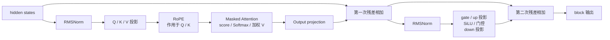

# Triton 示例中的 Transformer 数据流

本文不按课程编号讲，而是让数据沿一个 decoder-only Transformer block 从头走到尾，并说明
`examples/triton/02`～`07` 分别落在哪一步。这里重点回答“数据现在在哪里、这个 kernel 做了
什么、下一步去哪里”。完整公式和逐句读法统一放在
[Transformer 核心数学](transformer-math.md)；hidden state、block、FFN 和 KV cache 的直观
概念见 [Transformer 基础概念](transformer-concept.md)。

阅读 pointer、stride、program、tile 或 logical lane 时，可以分别参考
[PyTorch 基础概念](pytorch-concept.md) 和
[Triton 与 CUDA：代码概念映射](triton-cuda-basics.md)。

## 1. 先看完整数据流

现代 LLM 常见的 pre-norm block 可以按下面的顺序阅读：



所有 blocks 结束后，通常还有 `Final RMSNorm -> LM head -> logits`。教学示例没有拼出完整
模型，而是提供可以复用的计算原语：

| 数据流步骤 | 对应示例 | 覆盖情况 |
|---|---|---|
| RMSNorm | `04_rmsnorm.py` | 有独立 kernel。 |
| Q/K/V、output、FFN、LM head 投影 | `05_matmul.py`、`06_autotune_matmul.py` | 有通用矩阵乘，没有组装模型权重。 |
| RoPE | 无 | 当前课程未实现。 |
| Attention score、缩放、Softmax、加权 V | `07_attention.py` | 有 decode 单-query online Attention。 |
| 独立按行 Softmax | `03_row_softmax.py` | 有完整一行的基础实现。 |
| SiLU 与 elementwise fusion | `02_fused_elementwise.py` | 有 `silu(x+bias)`，不是完整 SwiGLU。 |
| residual add | `01_vector_add.py` 可提供加法原语 | 没有与完整 block 组装。 |

课程编号反映的是 Triton 学习难度；本篇顺序反映的是 Transformer 真实数据流。两种顺序服务
不同目的，不需要强行一致。

## 2. 输入 hidden states

进入 block 的数据通常是 `[batch, sequence, hidden]`。kernel 常把前两个维度展平成 token
行，得到 `[rows, hidden]`：

```text
rows = batch × sequence
每一行 = 一个 token 的 hidden state
每一列 = 一个 hidden feature
```

展平不意味着不同 token 被混在一起。它只是让 kernel 用一个行号选择 token，再沿列维处理
该 token 的 features。RMSNorm 和 FFN 对每行独立；Attention 才会让不同 token 交换信息。

## 3. 第一次 RMSNorm：`04_rmsnorm.py`

数据流的第一步是先整理每个 token 的整体数值尺度，再把结果交给 Q/K/V 投影。对应数学见
[RMSNorm](transformer-math.md#math-rmsnorm)。

示例输入为 `[n_rows,n_cols]`，其中 `n_cols` 就是 hidden dimension。launch grid 是
`(n_rows,)`，所以一个 Triton program 完整处理一行：

1. `row_idx` 选择当前 token 行。
2. `row_idx * input_row_stride` 找到这一行首地址。
3. `col_offsets` 覆盖 hidden features，尾部 padding lanes 由 mask 屏蔽。
4. 输入转成 FP32，整行计算 `mean_square`。
5. `tl.rsqrt(mean_square + eps)` 得到该行共享的 `inv_rms`。
6. 每个 feature 乘同一个 `inv_rms`，再乘自己的可学习 `weight`。
7. 只把真实 hidden columns 写回 output。

| 数学角色 | Triton 变量 | 是标量还是向量 |
|---|---|---|
| 当前 token 的 features | `x_fp32` | `[BLOCK_SIZE]` 向量 |
| 整行的 mean square | `mean_square` | 行级标量 |
| 整行共享的 inverse RMS | `inv_rms` | 行级标量 |
| 每个 feature 的可学习缩放 | `weight` | `[BLOCK_SIZE]` 向量 |
| 归一化结果 | `output` | `[BLOCK_SIZE]` 向量 |

`eps` 是所有行共享的固定标量。它在开平方前加到 mean square 上：全零行不会走到
`0 × inf -> NaN`，极小输入的放大倍数也受到限制。实际模型必须使用模型配置中的 epsilon，
不能把教学示例的默认 `1e-5` 当作所有模型的固定值。

平方和用 FP32 归约，是为了减少 FP16/BF16 大量累加时的舍入误差。padding lane 加载 0，
所以不会增加平方和；分母仍除以真实 `n_cols`，不能除以补齐后的 `BLOCK_SIZE`。

## 4. Q、K、V 线性投影：`05_matmul.py` 与 `06_autotune_matmul.py`

RMSNorm 输出仍是 hidden states。下一步用三组不同权重分别生成 Q、K、V。数学与 shape 见
[Q、K、V](transformer-math.md#math-qkv)。

当前课程没有名为 `q_proj`、`k_proj`、`v_proj` 的完整模型层，而是提供一个通用矩阵乘：

```text
hidden rows [M, K] × projection weight [K, N] -> projected rows [M, N]
```

把它放回模型时，`M` 是本轮 token 数，`K` 是输入 hidden dimension，`N` 是该投影的输出
dimension。同一个 matmul 原语可以分别调用三次，也可以由更高级实现融合 Q/K/V 投影。

### `05_matmul.py` 怎样计算一个输出 tile

二维 grid 中：

- `pid_m` 选择输出矩阵的行 tile。
- `pid_n` 选择输出矩阵的列 tile。
- `offs_k` 沿共同的 K 维分段前进。
- `tl.dot(a,b,accumulator)` 把当前 K tile 的部分积累加起来。
- M/N/K 尾部都用独立 mask 补 0，避免越界且不改变点积。

一个 program 不计算整个矩阵，只负责 `[BLOCK_SIZE_M,BLOCK_SIZE_N]` 输出块。所有 programs
合在一起才覆盖完整输出。

### `06_autotune_matmul.py` 改变什么

Autotune 不改变 Q/K/V 的数学含义。它只在不同 `BLOCK_SIZE_M/N/K`、`num_warps` 等配置中
选择更适合当前 shape 和 GPU 的实现。相同公式可以因为 tile 大小、访存合并、寄存器压力和
并行度不同而有明显性能差异。

## 5. RoPE 与 KV cache：当前示例的边界

Q/K/V 投影之后，现代 LLM 通常先对 Q 和 K 应用 RoPE，再进入 Attention。RoPE 的旋转公式
见 [RoPE](transformer-math.md#math-rope)。当前 `02`～`07` 没有 RoPE
kernel，因此 `07_attention.py` 假设传入的 query 和 key 已经包含所需位置信息。

服务场景还会把新 token 的 K/V 写入 KV cache。decode 时：

```text
当前 token：重新计算 Q、K、V
历史 token：直接读取 KV cache 中的 K、V
```

`07_attention.py` 直接接收连续的 K/V Tensor，没有实现 paged KV cache、radix cache、GQA
head 映射或写 cache 的过程。它讲的是 Attention 核心计算，不是完整 serving Attention。

## 6. Attention：`07_attention.py`

示例 07 的输入 shape 为：

```text
query       [B, H, D]
key/value   [B, H, N, D]
output      [B, H, D]
```

这里每个 `(batch,head)` 只有一个当前 query，所以 grid 展平为 `B × H` 个 programs。完整
Attention 数学见 [Scaled dot-product Attention](transformer-math.md#math-attention)。

### 6.1 query 与历史 keys 算 score

每个 program 先加载一个长度为 `head_dim` 的 query，再按 `BLOCK_N` 分块读取历史 keys。
`query * keys` 逐 feature 相乘，随后沿 feature 维求和，得到当前上下文 tile 的一排 scores。

score 会乘传入的 `scale = 1/sqrt(head_dim)`。如果没有这个缩放，head dimension 越大，点积
通常越容易出现过大的幅度，Softmax 会过早接近“只有一个位置是 1，其余全是 0”。

### 6.2 causal mask 在哪里

示例没有显式生成一张 causal mask。它假设调用者传入的 K/V 已经只包含当前 query 允许看到
的位置。若把未来 token 也传进来，它同样会参与计算。

生产实现必须通过 mask、有效长度或 KV cache 范围保证“当前位置不能读取未来”。数学定义见
[causal mask](transformer-math.md#math-causal-mask)。

### 6.3 独立 Softmax 基础：`03_row_softmax.py`

如果 scores 能完整放在一个 program 中，可以像示例 03 一样按行处理：

1. `tl.max` 找整行最大值。
2. 每个 score 减去最大值。
3. `tl.exp` 计算指数。
4. `tl.sum` 得到整行分母。
5. 每个指数除以同一个分母。

padding lane 加载为 `-inf`，因为它的指数为 0，既不会抬高最大值，也不会进入分母。稳定
Softmax 的推导见 [Softmax](transformer-math.md#math-softmax)。

### 6.4 上下文太长时使用 online Softmax

示例 07 不把全部 N 个 scores 写到 HBM，而是一边读取 K/V tiles，一边维护：

| Triton 变量 | 保存什么 |
|---|---|
| `running_max` | 已处理 scores 的最大值。 |
| `running_sum` | 在当前最大值基准下的指数和。 |
| `accumulator` | 同一基准下的加权 V 和。 |
| `old_scale` | 最大值更新后，旧状态需要乘的重标定系数。 |

最大值变大时，旧的 `running_sum` 和 `accumulator` 必须一起缩放；否则新旧 tiles 不在同一个
指数基准上。完整递推公式见
[online Softmax](transformer-math.md#math-online-softmax)。

### 6.5 用 Attention 权重汇总 V

每个 score tile 完成指数化后，示例立即与对应 value tile 做加权累加。所有 tiles 处理完成，
`accumulator / running_sum` 得到当前 head 的输出 `[D]`。这一步沿上下文 N 维汇总信息，输出
不再保留 N 维。

## 7. 多头合并、output projection 与第一次残差

完整模型会把所有 heads 的结果拼接，再用 `o_proj` 投影回 hidden dimension。它仍然可以使用
`05_matmul.py` 或 `06_autotune_matmul.py` 展示的矩阵乘原语。数学见
[多头合并与输出投影](transformer-math.md#math-attention-output)。

投影结果随后与进入 block 的原 hidden states 逐元素相加。`01_vector_add.py` 可以表达加法
原语，但课程没有保存 residual 主路并把整段 block 组装起来。这里必须保证两边 shape 都是
`[batch,sequence,hidden]`；残差相加不是 concat。

## 8. 第二次 RMSNorm

第一次残差相加得到新的 hidden states。pre-norm 架构会再次执行 RMSNorm，再把结果送入
FFN。数学和 kernel 都与第 3 节相同，只是输入换成 Attention 残差之后的 hidden states。

真实模型的两次 RMSNorm 通常使用两组不同的可学习 `weight`。可以复用同一个 kernel 实现，
但不能误以为两处共享同一份模型参数。

<a id="triton-ffn"></a>

## 9. FFN / SwiGLU：matmul 与 elementwise fusion 再次组合

FFN 不直接混合不同 token；它独立加工每个 token 的 hidden features。完整数学见
[FFN、SiLU 与 SwiGLU](transformer-math.md#math-ffn)。

### 9.1 gate projection 与 up projection

同一份归一化输入经过两次矩阵乘，分别得到 gate 分支和 up 分支。二者 shape 都是
`[token_rows,D_ff]`。这两次 projection 可以由 `05_matmul.py` 的原语表达。

### 9.2 SiLU：`02_fused_elementwise.py`

示例 02 计算 `silu(x + bias)`：先做逐元素 bias add，再做 SiLU，并在一个 kernel 中只写一次
最终结果。中间的 `x + bias` 留在 program 内，不写到 HBM 后再读回来，这就是 fusion 的直接
收益。

但它不是完整 SwiGLU：示例只有一条输入分支，真实门控 FFN 还需要 up projection 的输出。

### 9.3 门控逐元素乘法

gate 分支经过 SiLU 后，要与 up 分支按位置相乘。这个操作不做矩阵归约，也不混合 token；
两个输入必须具有相同的 `[token_rows,D_ff]` shape。当前课程没有单独实现这一完整双分支
fusion。

### 9.4 down projection

门控结果再通过一次矩阵乘，从 `D_ff` 降回 `D`。这一步仍可复用示例 05/06 的 matmul。降回
hidden dimension 后，才能与 FFN 子层的残差主路逐元素相加。

### 9.5 第二次残差相加

down projection 输出与进入 FFN 子层前的 hidden states 相加，得到 block 最终输出。课程同样
没有组装这一残差，但 shape 不变量必须成立：`[B,T,D] + [B,T,D] -> [B,T,D]`。

## 10. 所有 blocks 之后：Final RMSNorm 与 LM head

最后一个 block 输出后，完整 LLM 通常还会执行：

```text
Final RMSNorm -> vocabulary projection -> logits -> sampling
```

Final RMSNorm 可以复用示例 04 的 kernel；vocabulary projection 可以使用 matmul 原语。当前
课程没有创建 vocabulary weight、完整 logits Tensor 或 sampling kernel。对应数学见
[Final RMSNorm 与 LM head](transformer-math.md#math-lm-head)。

## 11. 按数据流对照全部示例

| 顺序 | Transformer 步骤 | 可复用示例 | 仍缺什么 |
|---:|---|---|---|
| 1 | 第一层 RMSNorm | 04 | 完整模型参数加载。 |
| 2 | Q/K/V projection | 05、06 | 三组真实权重与可能的融合。 |
| 3 | RoPE | 无 | 位置旋转 kernel。 |
| 4 | 写入/读取 KV cache | 07 只读取连续 K/V | cache 写入、paged layout、变长请求。 |
| 5 | score 与缩放 | 07 | GQA/MQA head 映射等生产细节。 |
| 6 | Softmax | 03、07 | 03 是整行；07 是 online。 |
| 7 | 加权 V | 07 | 生产级调度与 cache layout。 |
| 8 | output projection | 05、06 | 真实 `o_proj` 权重。 |
| 9 | 第一条 residual | 01 可表达加法 | 未组装 block。 |
| 10 | 第二层 RMSNorm | 04 | 另一组 RMSNorm weight。 |
| 11 | gate/up projection | 05、06 | 双分支组装或融合。 |
| 12 | SiLU 与门控 | 02 覆盖 SiLU fusion | 缺 up 分支和门控乘法。 |
| 13 | down projection | 05、06 | 真实 `down_proj` 权重。 |
| 14 | 第二条 residual | 01 可表达加法 | 未组装 block。 |
| 15 | Final RMSNorm / LM head | 04、05/06 | 完整模型尾部与 sampling。 |

## 12. 阅读 kernel 时沿数据流做 shape 检查

遇到 pointer 表达式时，先写逻辑 shape，再看当前 program 负责哪一块：

| 示例 | 当前 program 内的主要值 | 逻辑 shape |
|---|---|---|
| 02 | `offsets`、`x`、`bias`、`output` | `[BLOCK_SIZE]` |
| 03 | `row`、`softmax` | `[BLOCK_SIZE]` |
| 04 | `x_fp32`、`weight`、`output` | `[BLOCK_SIZE]` |
| 05/06 | `a`、`b`、`accumulator` | `[BM,BK]`、`[BK,BN]`、`[BM,BN]` |
| 07 | `query`、`keys`、`scores`、`values`、`accumulator` | `[BD]`、`[BN,BD]`、`[BN]`、`[BN,BD]`、`[BD]` |

建议按这个顺序检查：

1. 输入 shape 是否对应当前数据流步骤。
2. grid 用哪个 program id 选择 token、head、行或输出 tile。
3. offsets 是否覆盖目标 shape，stride 是否把逻辑坐标映射到正确地址。
4. mask 是否只保留真实元素，padding 值是否对当前归约是中性值。
5. reduction 到底消掉哪一维。
6. 最终 store 的 shape 是否正好等于下一步所需输入。

这样可以把 Transformer 的数学、Triton 的地址计算和完整模型尚未覆盖的边界分开理解。
