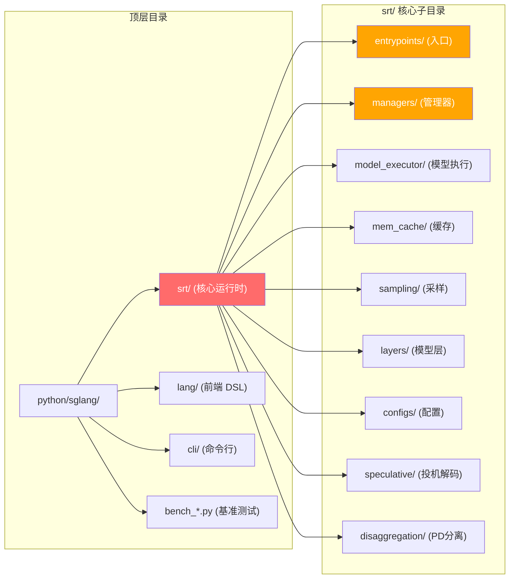
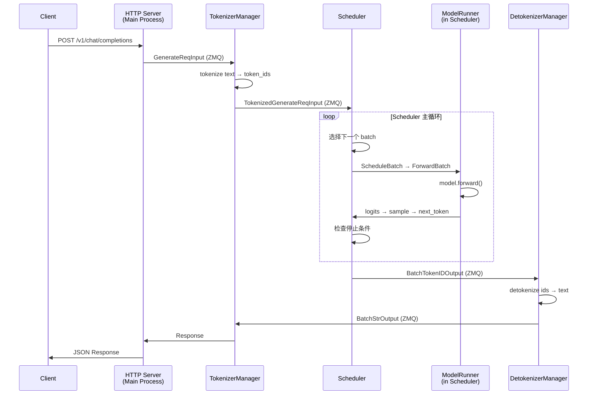
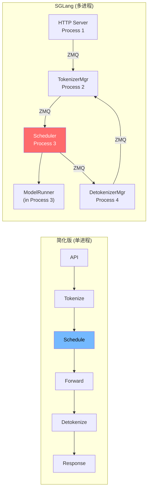

# Week 1: 项目骨架与请求生命周期

> 目标：理解 SGLang 的多进程架构、进程间通信机制、一个请求从进入到返回的完整路径。
> 时间：~10 小时 (5 天 × 2h)
>
> **配套资源**: [动手实验 - ZMQ 流水线 demo](../04-practice/exercises.md#实验-3-zmq-多进程通信流水线) | [FAQ: event_loop 变体](../05-reference/faq.md#q4-event_loop_normal-vs-event_loop_overlap--什么时候用哪个) | [调试技巧](../05-reference/debugging-guide.md)

> **如果你觉得本页仍然偏概览**：直接看 [Week 1 详细讲义](./week1-detailed.md)。那里按 5 天拆好了读码路径、命令和验收标准。

### 大文件阅读技巧 (必看!)

SGLang 的核心文件动辄 2000-4000 行，不要试图从头读到尾。正确方法：

1. **先 grep 找入口**: `grep -n "def event_loop\|def forward" 文件.py` — 找到关键函数
2. **只读一个函数**: 找到函数后，只看它调用了谁，先不深入被调用的函数
3. **画调用树**: `A() → B() → C()`，先建立骨架再深入
4. **忽略 90% 代码**: 大部分是边界处理、特殊模式、兼容逻辑。初学只需看主路径
5. **善用 IDE 跳转**: VS Code 按住 Cmd+点击跳转到定义

> 💡 **初学者提示**: 如果你打开 `scheduler.py` 发现 4000 行被吓到了 —— 这很正常。你只需要看 `event_loop_normal`（20行）和 `get_next_batch_to_run`（核心决策），其他的随用随查。

---

## Day 1-2: 项目结构与入口 (4h)

### 学习目标
- 理清项目目录布局
- 理解 `sglang serve` 命令如何启动整个系统
- 掌握 Engine 类的初始化流程

### 项目目录结构



### 源码阅读指引

#### Step 1: CLI 入口
**文件**: `python/sglang/cli/main.py`

这是 `sglang serve` 命令的入口。找到 `serve` 子命令，它最终调用 `launch_server()`。

#### Step 2: Server 启动
**文件**: `python/sglang/srt/entrypoints/engine.py`

重点关注 `Engine.__init__()` 方法（~line 199）：

```python
# === 实际代码精简版 (engine.py:199-256) ===
class Engine:
    def __init__(self, **kwargs):
        # 1. 解析启动参数 (模型路径、端口号、GPU数量等)
        server_args = ServerArgs(**kwargs)

        # 2. 核心！启动所有子进程
        (
            tokenizer_manager,    # TokenizerManager 实例 (在主进程中)
            template_manager,     # 模板管理
            port_args,            # 各进程通信的端口/地址
            scheduler_init_result,# Scheduler 进程的初始化结果
            subprocess_watchdog,  # 子进程看门狗 (监控是否崩溃)
        ) = self._launch_subprocesses(server_args=server_args, ...)

        # 3. 初始化 ZMQ 通信 socket
        context = zmq.Context(2)
        self.send_to_rpc = get_zmq_socket(
            context, zmq.DEALER, self.port_args.rpc_ipc_name, True
        )
```

> 💡 **初学者提示**: 不需要理解每一行。关键是看到 `_launch_subprocesses` 这个方法 —— 它是整个系统启动的核心。其他都是辅助。

**阅读重点**:
- `_launch_subprocesses()` (~line 750) — 启动 Scheduler 和 Detokenizer 子进程
- `_launch_scheduler_processes()` (~line 579) — 创建 Scheduler 进程
- `_launch_detokenizer_subprocesses()` (~line 693) — 创建 Detokenizer 进程

> 💡 **初学者提示**: `TokenizerManager` 不是子进程，它运行在主进程中。只有 Scheduler 和 Detokenizer 是独立子进程。这跟文档开头架构图对应。

#### Step 3: HTTP Server
**文件**: `python/sglang/srt/entrypoints/http_server.py`

重点关注:
- FastAPI app 的路由注册 (`/v1/chat/completions`, `/v1/completions` 等)
- `generate_request()` 函数 — 如何将 HTTP 请求转为内部数据结构
- 流式 vs 非流式响应的处理

### 动手练习 1.1
```bash
# 在项目根目录，用 grep 找到所有 ZMQ socket 地址的定义
grep -rn "ipc://" python/sglang/srt/entrypoints/engine.py

# 画出你理解的进程拓扑图，标注每个 ZMQ 通道的方向和用途
# 与本文档开头的架构图对比
```

---

## Day 3-4: 多进程架构与 ZMQ 通信 (4h)

### 学习目标
- 理解各核心角色 (HTTP Server / TokenizerManager / Scheduler+ModelRunner / DetokenizerManager) 各自的职责
- 掌握 ZMQ 的 pub-sub / push-pull 模式在 SGLang 中的应用
- 理解 `io_struct.py` 中的通信数据结构

### ZMQ 是什么？(3 分钟入门)

如果你没用过 ZMQ，可以把它想象成一个**跨进程的消息管道**：

```
普通 Python Queue:      进程 A ──Queue()──→ 进程 B   (同一台机器, 同一个父进程内)
ZMQ:                    进程 A ──ipc://地址──→ 进程 B  (任意进程, 甚至可以跨机器)
```

**生活类比**: ZMQ 就像快递系统 —— 发件人(进程A)把包裹投到某个快递站地址，收件人(进程B)从那个地址取件。两边不需要认识对方，只需要知道地址就行。

在 Mac 上试一试 (可选，帮助理解)：
```python
# terminal 1: 接收方
import zmq
ctx = zmq.Context()
sock = ctx.socket(zmq.PULL)
sock.bind("ipc:///tmp/test_zmq")
print("等待消息...")
print(sock.recv_json())  # 阻塞等待

# terminal 2: 发送方
import zmq
ctx = zmq.Context()
sock = ctx.socket(zmq.PUSH)
sock.connect("ipc:///tmp/test_zmq")
sock.send_json({"msg": "hello from sender!"})
print("发送完毕")
```

SGLang 中的 ZMQ 用法：
- **PUSH/PULL**: 单向传递（TokenizerManager → Scheduler）
- **PUB/SUB**: 一对多广播（Scheduler → 多个 DetokenizerManager）
- **地址格式**: `ipc:///tmp/xxxxx`（本机进程间）或 `tcp://ip:port`（跨机器）

### 多进程通信拓扑



### 源码阅读指引

#### 通信数据结构
**文件**: `python/sglang/srt/managers/io_struct.py`

这个文件定义了所有进程间传递的消息类型。重点关注:

```python
# 客户端 → TokenizerManager
class GenerateReqInput:
    text: str / List[str]          # 原始文本
    input_ids: List[int]           # 或直接传 token ids
    sampling_params: dict          # 采样参数
    stream: bool                   # 是否流式

# TokenizerManager → Scheduler
class TokenizedGenerateReqInput:
    rid: str                       # 请求 ID
    input_ids: List[int]           # token 化后的 ids
    sampling_params: SamplingParams
    pixel_values: optional         # 图像数据

# Scheduler → DetokenizerManager
class BatchTokenIDOutput:
    rids: List[str]                # 请求 ID 列表
    output_ids: List[int]          # 新生成的 token ids
    finished_reasons: List         # 完成原因

# DetokenizerManager → TokenizerManager
class BatchStrOutput:
    rids: List[str]
    output_strs: List[str]         # 解码后的文本
```

#### 对比单进程简化版
在最朴素的单进程实现中，这些数据都在进程内直接传递。SGLang 将它们序列化后通过 ZMQ 跨进程发送，这是为了:
1. **隔离** — Tokenizer/Detokenizer 不占用 GPU 进程的 CPU
2. **可扩展** — 可以多开 Tokenizer 进程做 Data Parallel
3. **稳定性** — 一个进程崩溃不影响其他进程

### 动手练习 1.2

**练习 A: 查看所有通信数据类**
```bash
# 列出 io_struct.py 中所有的数据类
grep -n "^class " python/sglang/srt/managers/io_struct.py

# 对每个类，标注: 发送方 → 接收方
# 例如: GenerateReqInput: HTTP Server → TokenizerManager
```

**练习 B: 亲手创建一个请求对象** (在 Mac 上可直接运行!)
```bash
PYTHONPATH="sglang-learning-docs:python" python/.venv/bin/python
```
```python
# conftest.py 是 Mac 兼容层，stub 了所有 CUDA 模块使代码能在 CPU 上 import
# 详见 mac-debug.md
import conftest

# 创建一个和用户发 HTTP 请求时一模一样的内部对象
from sglang.srt.managers.io_struct import GenerateReqInput

req = GenerateReqInput(
    text="Hello, how are you?",  # 用户输入的文本
    sampling_params={"temperature": 0.7, "max_new_tokens": 50},
    stream=False,
)
print(f"用户输入: {req.text}")
print(f"采样参数: {req.sampling_params}")
print(f"是否流式: {req.stream}")
# 思考: 这个对象接下来会被发给谁？(答案: TokenizerManager)
```

> 💡 **初学者提示**: 动手创建对象比看代码有效 10 倍。你能 `print(dir(req))` 看看它还有哪些字段。

---

## Day 5: 请求生命周期完整走读 (2h)

### 学习目标
- 从一个 `/v1/chat/completions` 请求出发，跟踪其在代码中的完整路径
- 建立对系统的端到端理解

### 请求生命周期详细流程

```mermaid
flowchart TD
    A["1. HTTP 请求进入<br/><small>http_server.py: v1_chat_completions()</small>"] --> B

    B["2. 构建 GenerateReqInput<br/><small>http_server.py → openai/serving_chat.py</small>"] --> C

    C["3. TokenizerManager 接收<br/><small>tokenizer_manager.py: handle_generate_request()</small>"]
    C --> C1["3a. 文本 tokenize<br/><small>tokenizer.encode(text)</small>"]
    C1 --> C2["3b. 创建 TokenizedGenerateReqInput"]
    C2 --> D

    D["4. Scheduler 接收请求<br/><small>scheduler.py: process_input_requests()</small>"]
    D --> D1["4a. 创建 Req 对象<br/><small>schedule_batch.py: Req.__init__()</small>"]
    D1 --> D2["4b. 加入等待队列<br/><small>self.waiting_queue.append(req)</small>"]
    D2 --> E

    E["5. Scheduler 主循环<br/><small>scheduler.py: event_loop_normal()</small>"]
    E --> E1{"5a. get_next_batch_to_run()"}
    E1 -->|"有请求"| E2["5b. RadixCache 前缀匹配<br/><small>radix_cache.py: match_prefix()</small>"]
    E2 --> E3["5c. 分配 KV Cache 内存<br/><small>memory_pool.py: alloc()</small>"]
    E3 --> E4["5d. 组装 ScheduleBatch"]
    E4 --> F

    F["6. ModelRunner 前向计算<br/><small>model_runner.py: forward()</small>"]
    F --> F1["6a. ScheduleBatch → ForwardBatch"]
    F1 --> F2["6b. model.forward(input_ids, ...)"]
    F2 --> F3["6c. logits → sample → next_token_ids"]
    F3 --> G

    G["7. 输出处理<br/><small>scheduler.py: process_batch_result()</small>"]
    G --> G1{"7a. 是否完成?"}
    G1 -->|"未完成"| E
    G1 -->|"完成"| H

    H["8. DetokenizerManager<br/><small>detokenizer_manager.py: handle_batch_token_id_out()</small>"]
    H --> H1["8a. token_ids → text"]
    H1 --> I

    I["9. 返回响应<br/><small>JSON: {choices: [{message: {content: ...}}]}</small>"]

    style A fill:#3498db,color:#fff
    style E fill:#ff6b6b,color:#fff
    style F fill:#7bed9f,color:#000
    style I fill:#3498db,color:#fff
```



### 源码跟踪路径

按以下顺序阅读代码，跟踪一个请求的完整路径:

```
1. http_server.py     → v1_chat_completions() / generate_request()
2. openai/serving_chat.py → v1_chat_generate_request()  [构建 GenerateReqInput]
3. tokenizer_manager.py   → handle_generate_request()   [tokenize]
4. scheduler.py           → process_input_requests()     [创建 Req, 入队]
5. scheduler.py           → get_next_batch_to_run()      [选 batch]
6. scheduler.py           → run_batch()                  [执行]
7. model_runner.py        → forward()                    [模型前向]
8. scheduler.py           → process_batch_result()       [处理输出]
9. detokenizer_manager.py → handle_batch_token_id_out()  [detokenize]
```

### 动手练习 1.3

**练习 A: 请求追踪**
```bash
# 在 scheduler.py 中找到主事件循环
grep -n "event_loop" python/sglang/srt/managers/scheduler.py

# 找到 get_next_batch_to_run 的实现
grep -n "def get_next_batch_to_run" python/sglang/srt/managers/scheduler.py

# 找到请求入队的位置
grep -n "waiting_queue" python/sglang/srt/managers/scheduler.py | head -20
```

**练习 B: 画自己的生命周期图**

不看本文档，尝试自己画一个请求从进入到返回的流程图 (可以用纸笔)。
然后与上面的流程图对比，找出遗漏的环节。

---

## Week 1 自查清单

完成本周学习后，你应该能回答以下问题:

- [ ] SGLang 启动时会创建哪些核心角色/进程？各自的职责是什么？
- [ ] 进程间通过什么机制通信？用了 ZMQ 的哪些模式？
- [ ] `GenerateReqInput` 和 `TokenizedGenerateReqInput` 有什么区别？为什么要分两步？
- [ ] Scheduler 的主循环做了哪几件事？
- [ ] 一个 `/v1/chat/completions` 请求从进入到返回经过了哪些进程和函数？
- [ ] 对比单进程简化版，SGLang 多了哪些架构层次？为什么要这样设计？
- [ ] `ForwardMode.EXTEND` 和 `ForwardMode.DECODE` 分别对应什么阶段？

### 与单进程简化版的差异总结



**核心差异:**
1. **多进程隔离** — CPU 密集 (tokenize) 和 GPU 密集 (forward) 分离
2. **异步通信** — ZMQ 解耦，支持 overlap 计算和通信
3. **数据结构更丰富** — Req 对象携带缓存元数据、多模态数据等
4. **可扩展** — 支持多 Scheduler (Data Parallel)、多 ModelRunner (Tensor Parallel)
5. **组件化** — Scheduler 拆分为 scheduler_components/ 下 18+ 个独立组件
