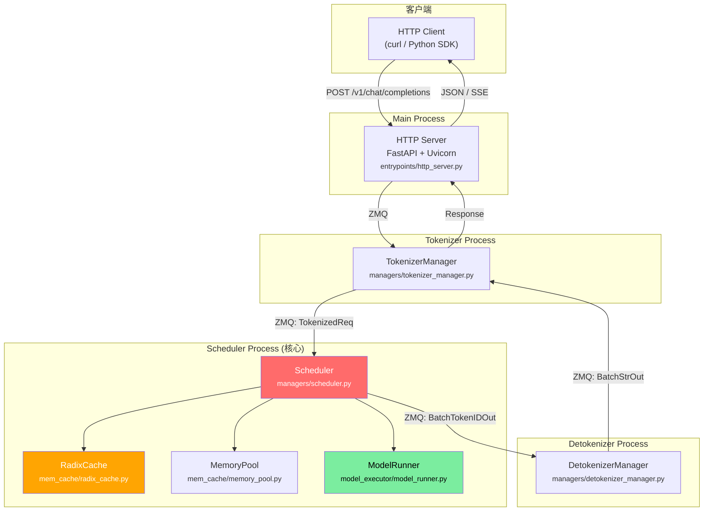
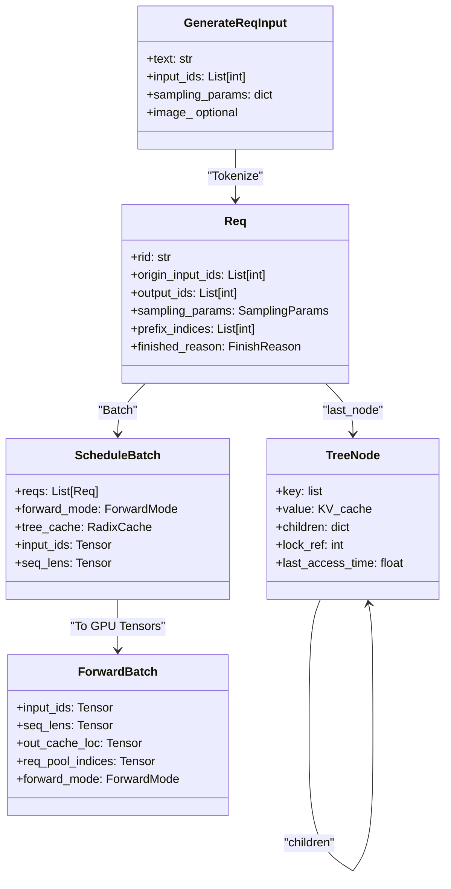

# SGLang 源码学习路径 - 总览

> 目标：8 周 (每天 ~2h)，从零开始掌握 SGLang 核心运行时并完成第一次代码贡献。
> Phase 1 (Week 1-4)：macOS，不涉及 CUDA 算子编译，以代码阅读 + CPU 模式调试为主。
> Phase 2 (Week 5-8)：NVIDIA GPU，启动 Server、跑 Benchmark、写测试、提 PR。
>
> **前置条件**: 如果你对 Tokenizer、矩阵乘法、Softmax、Python 多进程/虚拟环境不熟悉，请先阅读 **[prerequisites.md](../05-reference/prerequisites.md)**（约 2-3 小时）。
> Week 1 需要更细步骤时，看 **[week1-detailed.md](./week1-detailed.md)**。

---

## 零、前置概念速查 (只懂 Python 也能看懂)

如果你对以下概念不太熟悉，先花 5 分钟读完这张表：

| 概念 | 大白话解释 | Python 类比 |
|---|---|---|
| **Token** | 模型不认识文字，只认识数字。"Hello world" 会被拆成 [15496, 995] 这样的整数列表 | 类似 `"abc".encode()` 把字符串变成字节 |
| **Tokenize / Detokenize** | 文字→数字 叫 tokenize；数字→文字 叫 detokenize | `str.encode()` / `bytes.decode()` |
| **KV Cache** | 模型生成文字时会产生中间计算结果。把它存起来，下次就不用重新算了 | 类似 `@functools.lru_cache` — 缓存函数的返回值 |
| **Tensor** | 多维数组，就是 `numpy.ndarray` 的 GPU 版本 | `numpy.array([[1,2],[3,4]])` |
| **logits** | 模型对"下一个词是什么"的打分（还没变成概率）。越大代表越可能 | 类似 `[0.1, 2.5, -1.0, ...]` — 长度 = 词表大小 |
| **Sampling (采样)** | 根据 logits 选出下一个 token。temperature 越高越随机 | `random.choices(vocab, weights=softmax(logits))` |
| **进程 (Process)** | 操作系统的独立运行单元，有自己的内存空间。不同进程间需要通信才能交换数据 | `multiprocessing.Process` — 和线程不同，进程之间内存隔离 |
| **ZMQ (ZeroMQ)** | 一个高性能的消息传递库。进程 A 把消息发到一个"地址"，进程 B 从那个地址收 | 像 `queue.Queue()`，但可以跨进程、跨机器使用 |
| **IPC** | Inter-Process Communication，进程间通信的统称 | `multiprocessing.Queue` / `socket` / `pipe` |
| **Prefill** | 模型第一次读完整个 prompt（用户输入）的过程，计算量大 | 类似"读完一整本书" |
| **Decode** | 之后一个字一个字往外蹦的过程，每次只生成 1 个 token | 类似"一个字一个字写答案" |
| **Batch** | 把多个请求打包一起送给模型计算，充分利用 GPU 并行能力 | 类似 `[task1, task2, task3]` 批量处理 |
| **GPU / CUDA** | GPU 是并行计算的硬件；CUDA 是 NVIDIA 的 GPU 编程框架。本教程在 Mac 上不需要 GPU | 你暂时不需要关心这些，跳过即可 |

> **记住**: SGLang 的核心逻辑都是 Python，只有最底层的算子才涉及 CUDA。你完全可以只看 Python 层理解整个系统。

---

## 一、SGLang 整体架构



---

## 二、简化版 → SGLang 概念映射

下表左侧描述的是"最朴素的单进程实现方式"，右侧是 SGLang 的做法。通过左右对比，你可以理解 SGLang 为什么要这样设计。

| 朴素实现 | SGLang 完整版 | 文件位置 | 复杂度提升点 |
|---|---|---|---|
| 单进程 Server | 多进程架构 (4 核心角色) | `entrypoints/engine.py` | ZMQ IPC, 进程编排 |
| 简单 FIFO 调度 | Scheduler + 策略 | `managers/scheduler.py` | Continuous Batching, Chunked Prefill |
| 简单 KV Cache | RadixCache 前缀树 | `mem_cache/radix_cache.py` | 前缀共享, LRU/LFU 淘汰, Page 管理 |
| 简单 Tokenizer | TokenizerManager | `managers/tokenizer_manager.py` | 异步批量, 多模态处理 |
| 直接 forward | ModelRunner + ForwardBatch | `model_executor/model_runner.py` | CUDA Graph, TP/PP, 量化 |
| greedy/sample | SamplingParams + Penaltylib | `sampling/` | 结构化输出, 约束解码 |
| 无 | 投机解码 (Speculative) | `speculative/` | EAGLE, N-gram |
| 无 | PD 分离 (Disaggregation) | `disaggregation/` | Prefill/Decode 分离部署 |

---

## 三、8 周学习计划概览

```mermaid
gantt
    title SGLang 8周学习路线 (每天2小时)
    dateFormat  X
    axisFormat %s

    section Phase 1: 源码理解 (Mac)
    项目结构与入口          :w1a, 0, 2
    多进程架构与 ZMQ 通信    :w1b, 2, 4
    请求生命周期完整走读      :w1c, 4, 7
    动手: Mac 环境搭建+调试   :crit, w1d, 7, 10
    Scheduler 主循环         :w2a, 10, 13
    RadixCache 前缀树        :w2b, 13, 16
    内存池与 KV 管理          :w2c, 16, 18
    动手: 手写简化 RadixCache :crit, w2d, 18, 20
    ModelRunner 前向流程      :w3a, 20, 23
    ForwardBatch 数据流       :w3b, 23, 25
    Sampling 与约束解码       :w3c, 25, 27
    动手: Trace 一次完整推理  :crit, w3d, 27, 30
    投机解码 (EAGLE)          :w4a, 30, 33
    PD 分离架构               :w4b, 33, 35
    分布式并行 (TP/PP/DP)     :w4c, 35, 37
    动手: 画完整数据流图      :crit, w4d, 37, 40

    section Phase 2: GPU 实战 (NVIDIA GPU)
    GPU 环境搭建              :milestone, gpu, 40, 40
    Server 启动与观察         :w5a, 40, 43
    Benchmark 实战            :w5b, 43, 47
    性能调优实验              :crit, w5c, 47, 50
    Torch Profiler 实战       :w6a, 50, 53
    故障注入与排查            :w6b, 53, 55
    真实 PR 分析              :crit, w6c, 55, 60
    测试体系与 CI             :w7a, 60, 63
    代码质量工具              :w7b, 63, 65
    第一次代码修改            :crit, w7c, 65, 70
    毕业项目                  :w8a, 70, 76
    提交 PR                   :crit, w8b, 76, 78
    回顾与自评                :w8c, 78, 80
```

---

## 四、核心数据结构总览



---

## 五、关键源码文件清单 (按优先级)

### P0 - 必读 (骨架理解)
| 文件 | 行数 | 说明 |
|---|---|---|
| `srt/entrypoints/engine.py` | ~1426 | 引擎启动, 进程编排 |
| `srt/managers/scheduler.py` | ~4023 | **核心调度循环** (含 scheduler_components/ 组件) |
| `srt/managers/schedule_batch.py` | ~2749 | Req / ScheduleBatch 数据结构 |
| `srt/managers/io_struct.py` | ~2169 | 进程间通信数据结构 |
| `srt/mem_cache/radix_cache.py` | ~798 | RadixCache 前缀缓存 |

### P1 - 重要 (执行理解)
| 文件 | 行数 | 说明 |
|---|---|---|
| `srt/model_executor/model_runner.py` | ~3617 | 模型前向执行 |
| `srt/model_executor/forward_batch_info.py` | ~1368 | ForwardBatch / ForwardMode 定义 |
| `srt/managers/tokenizer_manager.py` | ~2943 | Tokenize 流程 |
| `srt/managers/detokenizer_manager.py` | ~449 | Detokenize 流程 |
| `srt/mem_cache/memory_pool.py` | ~2226 | 内存池管理 (MHA/MLA) |

### P2 - 进阶 (按兴趣选读)
| 文件 | 说明 |
|---|---|
| `srt/speculative/eagle_worker.py` | EAGLE 投机解码 (v1) |
| `srt/speculative/eagle_worker_v2.py` | EAGLE 投机解码 (v2) |
| `srt/disaggregation/prefill.py` / `decode.py` | PD 分离 |
| `srt/disaggregation/nixl/` / `mooncake/` | KV 传输后端 |
| `srt/distributed/parallel_state.py` | 分布式并行 |
| `srt/layers/sampler.py` | 采样层 |
| `srt/mem_cache/allocator/` | KV 内存分配器 (Token/Paged) |
| `srt/constrained/` | 约束解码/结构化输出 |

---

## 六、学习原则

### Phase 1 (Week 1-4, Mac)
1. **先骨架后细节** — 先理解 4 个核心角色 (HTTP/Tokenizer/Scheduler/Detokenizer) 的协作流程，再深入单个模块
2. **对照简化版** — 每学一个模块，回想"最朴素的单进程方式"会怎么做，再看 SGLang 的做法
3. **反馈闭环** — 每个阶段都有动手验证环节，不是纯看代码
4. **跳过 CUDA** — 遇到 `sgl-kernel/`、CUDA Graph、FlashInfer 等底层算子代码可以跳过
5. **画图驱动** — 用 Mermaid 画出自己理解的数据流图，与文档对比验证

### Phase 2 (Week 5-8, GPU)
6. **理论验证** — 用 GPU 实测验证 Phase 1 的纸面计算和架构理解
7. **从读到写** — 从阅读 PR 过渡到自己写代码，从理解者变为贡献者
8. **实验驱动** — 通过改参数、注入故障、做 profiling 来建立直觉
9. **完整闭环** — 毕业项目走完 设计→实现→测试→PR 的完整流程

---

接下来请按 Week 1 → Week 8 的顺序逐步学习。

**Phase 1 (Mac)**: Week 1-4，每周文档包含学习目标、核心概念讲解、源码阅读指引、动手练习、自查清单。
**Phase 2 (GPU)**: Week 5-8，需要 NVIDIA GPU 环境，请先完成 [GPU 环境搭建](../setup/gpu-setup.md)。
