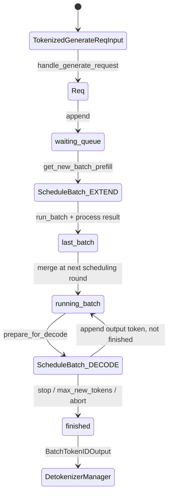

# Week 1 详细讲义：从请求到第一个 token

> 目标：5 天内把 SGLang 的主干跑通。先知道“谁调用谁、数据怎么走”，不要陷入 CUDA、量化、多卡细节。
>
> **配套资源**: [Transformer 基本架构](../05-reference/transformer.md#transformer-basics-sglang) | [动手实验 - ZMQ 流水线 demo](../04-practice/exercises.md#practice-zmq-pipeline-demo) | [FAQ: event_loop 变体](../05-reference/faq.md#faq-event-loop-variants)

## 一句话结论

| 本周问题 | 最短答案 |
|---|---|
| SGLang 服务怎么起来？ | `sglang serve` 解析参数后启动 HTTP Server，HTTP Server 内部创建 Engine，Engine 拉起 Scheduler/Detokenizer 子进程。 |
| 核心进程有哪些？ | 主进程：HTTP Server + Engine + TokenizerManager；子进程：Scheduler、DetokenizerManager。 |
| 一个请求怎么走？ | HTTP JSON -> `GenerateReqInput` -> tokenize -> `TokenizedGenerateReqInput` -> `Req` -> `ScheduleBatch` -> `ForwardBatch` -> token id -> text -> HTTP response。 |
| Week 1 不看什么？ | 不看 CUDA kernel、FlashInfer、量化、多卡、PD 分离、投机解码。 |

## 1. 总图

```text
Client
  |
  | HTTP /v1/chat/completions
  v
Main Process
+-------------------------------------------------------------+
| http_server.py                                              |
|   -> OpenAI serving layer                                   |
|   -> GenerateReqInput                                       |
|                                                             |
| Engine                                                      |
|   -> TokenizerManager                                       |
|      text/input_ids -> TokenizedGenerateReqInput            |
+---------------------------+---------------------------------+
                            |
                            | ZMQ
                            v
Scheduler Process
+-------------------------------------------------------------+
| scheduler.py                                                |
|   TokenizedGenerateReqInput -> Req                          |
|   waiting_queue/running_batch -> ScheduleBatch              |
|   ScheduleBatch -> model_worker.forward_batch_generation()  |
+---------------------------+---------------------------------+
                            |
                            | ZMQ BatchTokenIDOutput
                            v
Detokenizer Process
+-------------------------------------------------------------+
| detokenizer_manager.py                                      |
|   token ids -> text                                         |
+---------------------------+---------------------------------+
                            |
                            | BatchStrOutput
                            v
TokenizerManager -> HTTP response -> Client
```

## 2. Day-by-Day

| 天 | 目标 | 必读代码 | 产出 |
|---|---|---|---|
| Day 1 | 看懂启动链路 | `python/sglang/cli/main.py`, `python/sglang/cli/serve.py`, `python/sglang/srt/entrypoints/http_server.py`, `python/sglang/srt/entrypoints/engine.py` | 画出 `sglang serve` 到 Engine 的调用链 |
| Day 2 | 看懂进程角色 | `engine.py:Engine`, `_launch_subprocesses`, `_launch_scheduler_processes`, `_launch_detokenizer_subprocesses` | 列出主进程/子进程职责 |
| Day 3 | 看懂消息类型 | `python/sglang/srt/managers/io_struct.py` | 解释 4 个核心消息类 |
| Day 4 | 看懂 Scheduler 主循环 | `scheduler.py:event_loop_normal`, `process_input_requests`, `handle_generate_request`, `get_next_batch_to_run` | 画出 waiting/running/batch 状态变化 |
| Day 5 | 串起请求生命周期 | `tokenizer_manager.py:generate_request`, `scheduler.py:run_batch`, `process_batch_result`, `model_runner.py:forward` | 自己复述全链路，不看文档 |

## 3. 启动链路

```text
sglang serve ...
  -> python/sglang/cli/main.py:main()
  -> python/sglang/cli/serve.py:serve()
  -> sglang.launch_server.run_server()
  -> python/sglang/srt/entrypoints/http_server.py:launch_server()
  -> create TokenizerManager
  -> create Engine
  -> Engine._launch_subprocesses()
       -> Scheduler subprocess
       -> Detokenizer subprocess
```

关键证据：

| 文件 | 代码点 | 说明 |
|---|---|---|
| `python/sglang/cli/main.py` | `if args.subcommand == "serve"` | CLI 分发到 `sglang.cli.serve.serve` |
| `python/sglang/cli/serve.py` | `run_server(server_args)` | 标准 LLM Server 入口 |
| `python/sglang/srt/entrypoints/http_server.py` | `launch_server()` | HTTP 服务入口 |
| `python/sglang/srt/entrypoints/engine.py` | `class Engine` | 引擎入口，负责拉起子进程和 ZMQ |

## 4. 进程职责

| 角色 | 进程 | 主要职责 | Week 1 读法 |
|---|---|---|---|
| HTTP Server | 主进程 | 接收 OpenAI API 请求，返回 JSON/SSE | 只看路由和 `GenerateReqInput` 构造 |
| Engine | 主进程 | 管理生命周期、创建 ZMQ socket、启动子进程 | 只看 `__init__` 和 `_launch_*` |
| TokenizerManager | 主进程 | text <-> token ids，维护请求状态，等待输出 | 只看 `generate_request()` |
| Scheduler | 子进程 | 排队、组 batch、KV cache、调用模型执行 | 只看主循环和请求入队 |
| ModelRunner/worker | Scheduler 侧 | 把 batch 转成模型 forward | Week 1 只知道它存在 |
| DetokenizerManager | 子进程 | token ids -> text | 只看输入输出数据类 |

注意：TokenizerManager 在当前 Engine 注释里明确属于主进程，不要把它当成独立子进程。

## 5. 消息与数据结构

```text
HTTP JSON
  |
  v
GenerateReqInput
  |  TokenizerManager tokenize
  v
TokenizedGenerateReqInput
  |  Scheduler.handle_generate_request
  v
Req
  |  Scheduler.get_next_batch_to_run
  v
ScheduleBatch
  |  model worker / ModelRunner
  v
ForwardBatch
  |
  v
BatchTokenIDOutput
  |  DetokenizerManager
  v
BatchStrOutput
```

| 数据结构 | 文件 | 大白话 |
|---|---|---|
| `GenerateReqInput` | `managers/io_struct.py` | HTTP 层收到的原始请求，还可能是文本 |
| `TokenizedGenerateReqInput` | `managers/io_struct.py` | Tokenizer 处理后的请求，已经有 token ids |
| `Req` | `managers/schedule_batch.py` | Scheduler 内部请求对象，带缓存、状态、停止条件 |
| `ScheduleBatch` | `managers/schedule_batch.py` | Scheduler 选出来的一批请求 |
| `ForwardBatch` | `model_executor/forward_batch_info.py` | 真正喂给模型执行侧的 Tensor 形态 batch |
| `BatchTokenIDOutput` | `managers/io_struct.py` | Scheduler 输出的新 token id |
| `BatchStrOutput` | `managers/io_struct.py` | Detokenizer 输出的文本 |

## 6. Scheduler 主循环

源码核心在 `python/sglang/srt/managers/scheduler.py:event_loop_normal()`。

```text
while True:
  recv_reqs = request_receiver.recv_requests()
  process_input_requests(recv_reqs)

  batch = get_next_batch_to_run()

  if batch:
    result = run_batch(batch)
    process_batch_result(batch, result)
  else:
    on_idle()
```

| 步骤 | 函数 | 学习重点 |
|---|---|---|
| 收请求 | `request_receiver.recv_requests()` | 从 TokenizerManager/RPC 拿消息 |
| 分发请求 | `process_input_requests()` | 调 `_request_dispatcher`，生成内部动作 |
| 生成 Req | `handle_generate_request()` | `TokenizedGenerateReqInput -> Req` |
| 选 batch | `get_next_batch_to_run()` | prefill/decode/chunked prefill 的主入口 |
| 执行 | `run_batch()` | 调模型 worker，返回 token/logprob/embedding |
| 处理结果 | `process_batch_result()` | decode/extend 分流，输出给 Detokenizer |

## 7. Scheduler 内部对象：Req、队列和 ScheduleBatch

Week 1 需要先把 Scheduler 里的几个对象分清楚。后面 Week 2 会深入 cache 和调度策略，但这里先建立主线心智模型。

更详细的状态流转专题见：[Req 到 ScheduleBatch 的状态流转导读](../02-core-systems/request-batch-state-flow.md)。该索引串联 Scheduler 生命周期、Prefill/KV 分配和 Decode/请求隔离三个子专题，分别展开每一步的创建者、持有者、offset 和 KV slot 映射。

### 7.1 一句话关系

```text
TokenizedGenerateReqInput
  -> Req
  -> waiting_queue
  -> ScheduleBatch(EXTEND / Prefill)
  -> last_batch
  -> running_batch
  -> ScheduleBatch(DECODE)
  -> output_ids 增长
  -> finished / DetokenizerManager
```

| 名字 | 类型 | 大白话 |
|---|---|---|
| `Req` | 单个请求对象 | Scheduler 内部真正追踪的请求状态 |
| `waiting_queue` | `List[Req]` | 新请求排队区，通常还没完成 prefill |
| `running_batch` | `ScheduleBatch` | 已经有历史 KV、可以继续 decode 的请求集合 |
| `last_batch` | `ScheduleBatch` | 上一轮刚跑完的 batch，用于 prefill -> running 的过渡 |
| `cur_batch` | `ScheduleBatch | None` | 当前正在跑或刚选出的 batch，调试/统计常用 |
| `ScheduleBatch` | 一批 `Req` + tensor 元数据 | Scheduler 本轮要交给 model worker 执行的 batch |
| `ForwardBatch` | tensor 化执行对象 | ModelRunner/attention backend 真正消费的执行参数 |

### 7.2 `Req` 里先看哪些字段

源码：`python/sglang/srt/managers/schedule_batch.py:class Req`

| 字段 | 含义 | 为什么重要 |
|---|---|---|
| `rid` | request id | 串联日志、输出、abort |
| `origin_input_ids` | prompt token ids | 请求的原始输入上下文 |
| `output_ids` | 已生成 token ids | decode 每轮增长，最终 detokenize |
| `sampling_params` | 采样参数 | `max_new_tokens`、stop、temperature 等 |
| `finished_reason` | 是否完成以及原因 | 决定请求是否从 running 中移除 |
| `prefix_indices` | prefix cache 命中的 KV indices | 命中部分不用重复 prefill |
| `extend_input_len` | 本轮 EXTEND 要算多少 token | 影响 prefill token budget |
| `fill_len` | 本轮逻辑上下文有效长度 | 通常来自 `origin_input_ids + output_ids` |
| `req_pool_idx` | 请求在 ReqToTokenPool 的行号 | 把请求 token 位置映射到 KV slot |
| `kv_committed_len` | 已提交 KV 长度 | decode 能读到的历史 KV 范围 |
| `kv_allocated_len` | 已分配 KV 长度 | spec/chunk 等场景可能大于 committed |

初学时可以先记住：

```text
origin_input_ids = 原始 prompt
output_ids       = 已经生成的输出
origin_input_ids + output_ids = 当前完整逻辑上下文
```

### 7.3 `waiting_queue`：新请求先到这里

`handle_generate_request()` 把 `TokenizedGenerateReqInput` 变成 `Req` 后，通常会追加到：

```python
self.waiting_queue.append(req)
```

`waiting_queue` 里的请求还没有稳定进入 decode。它们可能处在几种情况：

| 情况 | 说明 |
|---|---|
| 完全新请求 | prompt 还没 prefill |
| 等待 token budget | 当前 prefill token 数太多，排到下一轮 |
| 等待 KV 空间 | 内存池暂时放不下 |
| chunked prefill 后续块 | 长 prompt 被拆成多个 chunk |
| priority/preemption 影响 | 优先级调度可能改变排队顺序 |

Week 1 不需要掌握所有策略，只要知道：`waiting_queue` 是“还没被本轮接纳执行的请求池”。

### 7.4 `ScheduleBatch(EXTEND)`：从 waiting_queue 选出来做 prefill

`get_next_batch_to_run()` 会调用 prefill 相关逻辑，从 `waiting_queue` 挑一批请求。核心动作是：

```text
1. 对 waiting_queue 计算优先级
2. 对每个 req 调 init_next_round_input(tree_cache)
3. 做 prefix cache match，得到 req.prefix_indices
4. PrefillAdder 判断 token budget / KV budget
5. 选中的 req 组成 new_batch
6. new_batch.prepare_for_extend()
```

`prepare_for_extend()` 会把每个请求要算的 token 切出来：

```python
input_ids = [r.get_fill_ids()[len(r.prefix_indices):] for r in reqs]
```

含义：

```text
完整上下文 = origin_input_ids + output_ids
已命中前缀 = prefix_indices
本轮只算 = 没命中的 suffix
```

这就是为什么 `ScheduleBatch` 不只是 `List[Req]`。它还带有：

| 字段 | 用途 |
|---|---|
| `forward_mode` | 本轮是 `EXTEND`、`DECODE`、`MIXED`、`IDLE` 等 |
| `input_ids` | 本轮真正送模型的 token tensor |
| `seq_lens` | 每个请求当前逻辑序列长度 |
| `req_pool_indices` | 每个请求对应 `ReqToTokenPool` 哪一行 |
| `out_cache_loc` | 本轮新写入 KV 的 slot |
| `prefix_lens` | 每个请求命中的 prefix 长度 |
| `extend_lens` | 每个请求本轮实际 extend 长度 |

### 7.5 `last_batch`：prefill 跑完后怎么进入 running

`run_batch(new_batch)` 执行完 EXTEND 后，结果会进入 `process_batch_result_prefill()`：

```text
模型返回 next_token
req.output_ids.append(next_token)
req.update_finish_state()
```

未完成的请求不能丢，它们已经有 prompt KV，可以继续 decode。SGLang 会通过 `last_batch` 把刚跑完的 prefill batch 合并进 `running_batch`。

可以理解成：

```text
new_batch 跑完 prefill
  -> 暂存在 last_batch
  -> 下一轮 get_next_batch_to_run 开头
  -> merge 到 running_batch
```

为什么不直接叫 `running_batch`？因为调度循环里有 overlap、chunked prefill、prefill-only、pipeline 等情况，`last_batch` 是一个过渡缓冲。

### 7.6 `running_batch`：正在 decode 的请求集合

`running_batch` 里的请求已经有历史 KV。下一轮如果没有更高优先级的 prefill 要插入，Scheduler 会对它执行 decode：

```text
running_batch.prepare_for_decode()
run_batch(running_batch)
process_batch_result_decode()
```

decode 的特点：

| 项 | 含义 |
|---|---|
| 输入 token | 通常是每个 req 最新生成的 1 个 token |
| 历史上下文 | 通过 KV cache 读取，不重新喂完整 prompt |
| 输出 | 每个 req 再生成一个 token |
| 状态更新 | `req.output_ids.append(next_token)` |
| 完成检查 | stop token/string、max_new_tokens、abort |

如果某个 req finished，会被 `filter_batch()` 从 `running_batch` 中移除，并释放或缓存 KV。

### 7.7 `ScheduleBatch(DECODE)`：为什么仍然需要 batch

即使 decode 每个请求通常只输入 1 个 token，也要 batch 化，因为 GPU/MLX/worker 一次会处理多个请求：

```text
Req A 最新 token -> \
Req B 最新 token ->  ScheduleBatch(DECODE) -> model forward -> next tokens
Req C 最新 token -> /
```

`ScheduleBatch(DECODE)` 负责把这些请求的：

```text
req_pool_idx
seq_lens
out_cache_loc
sampling_info
grammar/logprob/hidden states flags
```

打包给执行侧。执行侧才能知道：

```text
每个请求历史 KV 在哪里
本轮新 KV 写到哪里
每个请求应该用什么采样参数
```

### 7.8 状态流图



### 7.9 EXTEND / DECODE / MIXED / IDLE 先记这些

| `forward_mode` | 大白话 | Week 1 理解 |
|---|---|---|
| `EXTEND` | 新请求 prefill，或长 prompt 继续 prefill | 主要来自 `waiting_queue` |
| `DECODE` | 老请求继续生成下一个 token | 主要来自 `running_batch` |
| `MIXED` | prefill 新请求时顺便带上老请求 decode | 性能优化，先知道存在 |
| `IDLE` | 没有可跑 batch | Scheduler 空转/等待 |

`MIXED` 的直觉：

```text
一批新请求要做 EXTEND
同时 running_batch 里还有老请求要 decode
为了减少 GPU 空档，可以把两类请求混在同一轮执行
```

### 7.10 Week 1 读码顺序

不要直接读完 `schedule_batch.py`。按这个顺序查：

```bash
# 1. Scheduler 里队列在哪里初始化
rg -n "waiting_queue|running_batch|last_batch|cur_batch" python/sglang/srt/managers/scheduler.py

# 2. 新请求怎么变成 Req 并入队
rg -n "def handle_generate_request|waiting_queue.append" python/sglang/srt/managers/scheduler.py

# 3. 下一轮 batch 怎么选
rg -n "def get_next_batch_to_run|def get_new_batch_prefill|def update_running_batch" \
  python/sglang/srt/managers/scheduler.py

# 4. ScheduleBatch 怎么准备 EXTEND / DECODE
rg -n "class ScheduleBatch|def prepare_for_extend|def prepare_for_decode|def mix_with_running" \
  python/sglang/srt/managers/schedule_batch.py

# 5. Req 的核心字段
rg -n "class Req|origin_input_ids|output_ids|prefix_indices|kv_committed_len" \
  python/sglang/srt/managers/schedule_batch.py
```

## 8. Prefill 和 Decode

| 阶段 | 触发场景 | 算什么 | 性能瓶颈 |
|---|---|---|---|
| Prefill/Extend | 新请求刚进来 | 整段 prompt | 计算量大，吞吐看并行 |
| Decode | 已经读完 prompt，继续生成 | 每轮 1 个或少量 token | 访存和调度更关键 |

```text
请求: "北京今天..."

Prefill:
  一口气读完整个 prompt，写入 KV Cache

Decode:
  第 1 轮 -> 生成 token A
  第 2 轮 -> 生成 token B
  第 3 轮 -> 生成 token C
```

Week 1 只需要记住：`ScheduleBatch.forward_mode` 会告诉系统本轮是 prefill/extend 还是 decode。

## 9. 动手命令

```bash
# 1. 找 CLI 入口
rg -n "def main|subcommand == \"serve\"|def serve|run_server" python/sglang/cli python/sglang

# 2. 找 Engine 启动子进程
rg -n "class Engine|def _launch_subprocesses|def _launch_scheduler_processes|def _launch_detokenizer_subprocesses" \
  python/sglang/srt/entrypoints/engine.py

# 3. 找核心消息类
rg -n "^class (GenerateReqInput|TokenizedGenerateReqInput|BatchTokenIDOutput|BatchStrOutput)" \
  python/sglang/srt/managers/io_struct.py

# 4. 找 Scheduler 主路径
rg -n "def event_loop_normal|def process_input_requests|def handle_generate_request|def get_next_batch_to_run|def run_batch|def process_batch_result" \
  python/sglang/srt/managers/scheduler.py

# 5. 找 ScheduleBatch 和队列状态
rg -n "waiting_queue|running_batch|last_batch|class Req|class ScheduleBatch|prepare_for_extend|prepare_for_decode" \
  python/sglang/srt/managers/scheduler.py python/sglang/srt/managers/schedule_batch.py
```

## 10. 本周验收

| 验收项 | 合格标准 |
|---|---|
| 启动链路 | 能从 `sglang serve` 说到 `Engine._launch_subprocesses()` |
| 进程拓扑 | 能说清主进程里有 HTTP/Engine/TokenizerManager，Scheduler/Detokenizer 是子进程 |
| 数据结构 | 能说清 `GenerateReqInput`、`TokenizedGenerateReqInput`、`Req`、`ScheduleBatch` 的区别 |
| 主循环 | 能默写 `recv -> process -> schedule -> run -> process_result` |
| Scheduler 状态 | 能解释 `waiting_queue`、`last_batch`、`running_batch` 的关系 |
| ScheduleBatch | 能区分 `EXTEND` 和 `DECODE` batch 各自从哪里来、要做什么 |
| 请求生命周期 | 能画出请求从 HTTP 到返回文本的全链路 |

## 11. 常见误区

| 误区 | 正解 |
|---|---|
| 一上来读完整个 `scheduler.py` | 先读 `event_loop_normal()`，再顺藤摸瓜 |
| 把 TokenizerManager 当子进程 | 当前 Engine 注释说明它和 HTTP/Engine 在主进程 |
| Week 1 研究 CUDA Graph | 跳过，Week 3/5 再看 |
| 分不清 `Req` 和 `GenerateReqInput` | 前者是 Scheduler 内部对象，后者是 HTTP/TokenizerManager 入口对象 |
| 以为 `ScheduleBatch` 只是 `List[Req]` | 它还携带 forward mode、seq_lens、req_pool_indices、out_cache_loc 等执行元数据 |
| 以为 `running_batch` 是正在跑的线程 | 它是已 prefill、可继续 decode 的请求集合 |
| 觉得 ZMQ 很神秘 | 先理解成跨进程 Queue，细节以后补 |
