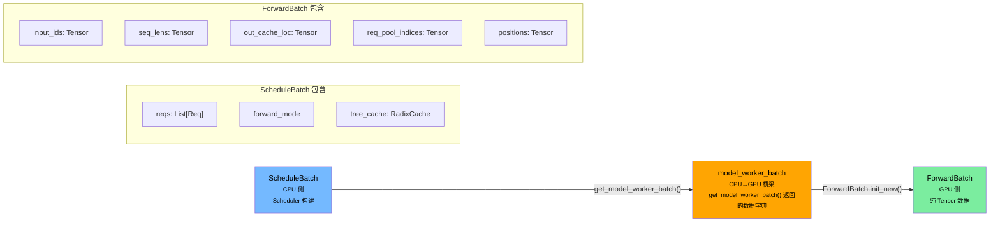
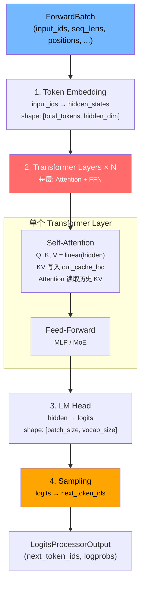
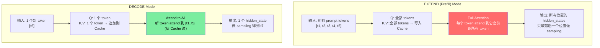
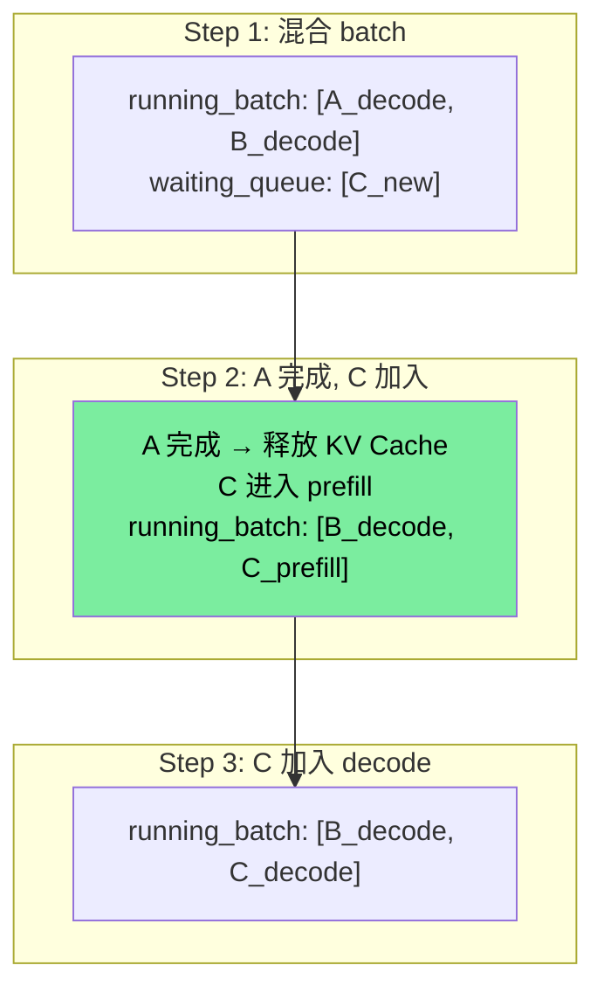
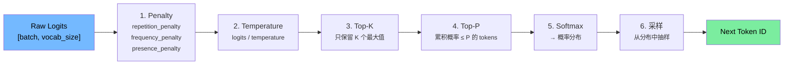
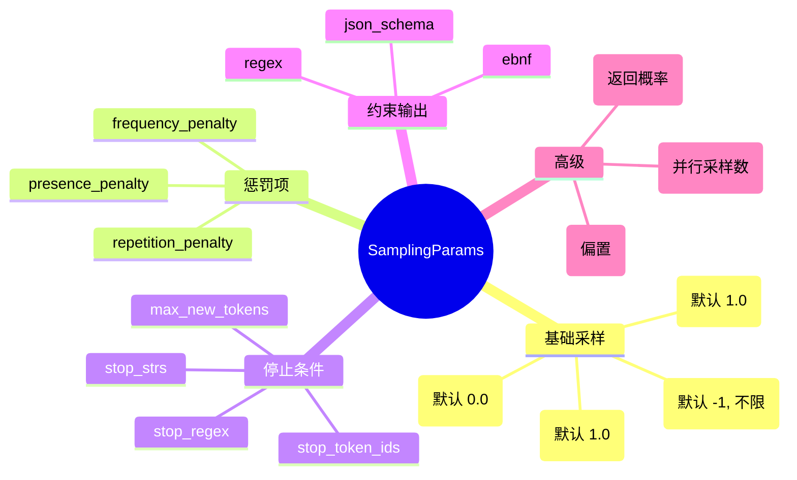
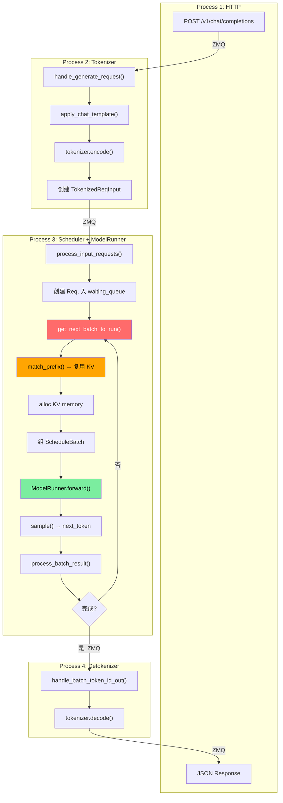

# Week 3: 模型执行与采样

> 目标：理解 ModelRunner 如何执行前向计算、ForwardBatch 的数据流、采样策略、Continuous Batching 的实现。
> 时间：~10 小时 (5 天 × 2h)
> 前置：[Week 2](../02-core-systems/scheduler-and-cache.md) 完成，已掌握 Scheduler 和 RadixCache
>
> **配套资源**: [性能直觉: Prefill vs Decode 定量分析](../05-reference/performance-intuition.md#二prefill-vs-decode为什么性质完全不同) | [FAQ: ScheduleBatch vs ForwardBatch](../05-reference/faq.md#q1-schedulebatch-vs-forwardbatch-vs-modelworkerbatch--为什么要三种) | [FAQ: ForwardMode 各值含义](../05-reference/faq.md#q5-forwardmode-各值含义)

> **如果你只会基础 Python**：先看 [Week 3 详细讲义](./week3-detailed.md)。那里用 Mermaid 图拆了 `ScheduleBatch -> ForwardBatch -> logits -> next_token`。

---

## Day 1-2: ModelRunner 前向流程 (4h)

### 学习目标
- 理解 ScheduleBatch → ForwardBatch 的转换流程
- 理解 ModelRunner.forward() 的执行流程
- 了解 EXTEND (prefill) 和 DECODE 两种 forward mode 的区别

### 数据转换流水线



> **注意**: `get_model_worker_batch()` 返回的不是一个独立类，而是将 ScheduleBatch 中的数据提取为可序列化的格式（用于跨进程传输到 TpModelWorker）。在单进程场景下可以理解为一个轻量级的数据包装。

### 30 秒理解 Transformer (给只懂 Python 的人)

LLM (大语言模型) 的核心结构叫 **Transformer**，它生成文字的过程可以这样理解：

```
输入: "今天天气"  →  模型预测下一个字: "很" (概率最高)
输入: "今天天气很"  →  模型预测下一个字: "好"
...重复直到生成完整答案
```

Transformer 内部做的事：

| 步骤 | 做什么 | Python 类比 |
|---|---|---|
| 1. Embedding | 把 token_id 查表变成一个向量 (一组数字) | `vocab_table[token_id]` → `[0.2, -0.1, ...]` |
| 2. Self-Attention | 每个词"看看"前面所有词，决定该关注谁 | 像写作文时回头看前面写了什么，保持连贯 |
| 3. FFN (前馈网络) | 对每个词做一次"思考"变换 | `result = relu(x @ W1) @ W2` |
| 4. 重复 N 层 | 上面 2-3 步重复几十层，层数越多模型越大 | 像思考了 N 轮，每轮理解更深 |
| 5. 输出 logits | 对整个词表打分，分最高的就是预测的下一个词 | `scores[vocab_size]`，取 argmax 或按概率采样 |

**Q, K, V 是什么？** Self-Attention 的实现细节：
- **Q (Query)**: "我在找什么信息？" — 当前位置的提问
- **K (Key)**: "我有什么信息？" — 每个历史位置的标签
- **V (Value)**: "我的具体内容" — 每个历史位置的实际数据
- 计算: `attention = softmax(Q × K^T) × V` — 用 Q 和 K 算相关度，加权求和 V

**KV Cache 为什么重要？** 生成第 100 个字时，前 99 个字的 K 和 V 不会变。所以存起来（Cache），下次直接用，不用重新算。

### ModelRunner 前向计算



### EXTEND vs DECODE 的 Attention 差异



### 定量理解: 为什么 Prefill 是计算密集，Decode 是内存密集

> 💡 **初学者提示**: 下面这一段涉及 GPU 性能分析的数学推导。如果觉得难以理解，可以先跳过，在完成 Week 2 后阅读专门的 [性能直觉章节](../05-reference/performance-intuition.md)，那里有更完整的铺垫。**核心结论记住即可：Prefill 拼算力（compute-bound），Decode 拼带宽（memory-bound）。**

这是理解整个 LLM Serving 系统设计的**最关键 insight**。

**Prefill (EXTEND) — Compute-bound:**

```
输入 N 个 token 的 Self-Attention:
  Q × K^T: shape [N, d] × [d, N] → 计算量 = 2×N×N×d
  读数据:  Q 和 K 各 N×d×2 bytes

  算术强度 = 计算量 / 数据量 = (2×N×N×d) / (4×N×d) = N/2

  当 N=1024: 算术强度 = 512
  GPU 平衡点 (A100) = 156
  512 >> 156 → GPU 的计算单元跑满，带宽有余 → Compute-bound!
```

**Decode — Memory-bound:**

```
输入 1 个新 token:
  Q × K^T: shape [1, d] × [d, S] → 计算量 = 2×S×d  (S=历史序列长度)
  读数据:  需要读整个 KV Cache = S×d×2 bytes

  算术强度 = (2×S×d) / (S×d×2) = 1

  1 << 156 → GPU 大部分时间在等显存搬数据 → Memory-bound!
```

**数字对比 (Llama-3-8B, 一层 Attention, d=128, heads=32):**

| | Prefill (N=512) | Decode (S=512) |
|---|---|---|
| 计算量 | 512 × 512 × 128 × 2 = 67M FLOPS | 1 × 512 × 128 × 2 = 131K FLOPS |
| 数据读取 | 512 × 128 × 4 = 256 KB | 512 × 128 × 2 = 128 KB |
| 算术强度 | 256 | 1 |
| 瓶颈 | 算力 | 带宽 |

**对 Serving 的影响:**
1. **Batch size 对 decode 有帮助**: batch 越大，共享的模型权重读取开销被摊薄
2. **Prefill 和 decode 不宜混排**: prefill 抢算力，decode 抢带宽，需求冲突
3. **Chunked Prefill**: 把大 prefill 切碎，穿插 decode，避免 decode 延迟尖刺

> 详细的定量推导和 napkin math 见 [performance-intuition.md](../05-reference/performance-intuition.md)

### 源码阅读指引

**文件**: `python/sglang/srt/model_executor/model_runner.py`

#### 1. forward() 方法的实际结构

> 💡 **初学者提示**: `forward()` 在 ~line 3216，但它内部做的事其实很简单 —— 调用 `_forward_raw()`，后者根据 `forward_mode` 分派到不同的子方法。

```python
# 实际的分派逻辑在 _forward_raw() 中 (~line 3385):
if forward_batch.forward_mode.is_decode():
    ret = self.forward_decode(forward_batch, ...)      # Decode 模式
elif forward_batch.forward_mode.is_extend():
    ret = self.forward_extend(forward_batch, ...)      # Prefill/Extend 模式
elif forward_batch.forward_mode.is_idle():
    ret = self.forward_idle(forward_batch, ...)        # 空闲 (DP Attention)
```

**阅读路径**: `forward()` → `_forward_raw()` → `forward_decode()` 或 `forward_extend()`

每个子方法内部做的事：
1. 初始化 attention backend
2. 调用 `self.model.forward(input_ids, positions, forward_batch)` — 真正的模型计算
3. 返回 logits

> 💡 **初学者提示**: `self.model` 是具体的模型实现（如 LlamaForCausalLM），定义在 `python/sglang/srt/models/` 目录下。你暂时不需要深入模型内部，只需知道它接收 `input_ids` 返回 `logits`。

#### 2. ForwardBatch 构建
**文件**: `python/sglang/srt/model_executor/forward_batch_info.py`

重点关注 `ForwardBatch` 类的字段和 `from_model_worker_batch()` 方法。

#### 3. TpModelWorker
**文件**: `python/sglang/srt/managers/tp_worker.py`

这是 Scheduler 调用 ModelRunner 的中间层:
```python
class TpModelWorker:
    def forward_batch_generation(self, forward_batch: ForwardBatch):
        # ForwardBatch 已经由上层构建好
        logits_output = self.model_runner.forward(forward_batch)
        next_token_ids = self.model_runner.sample(logits_output, forward_batch)
        return next_token_ids
```

### 动手练习 3.1

```bash
# 找到 ForwardMode 的所有枚举值
grep -n "class ForwardMode" python/sglang/srt/model_executor/forward_batch_info.py
grep -A 20 "class ForwardMode" python/sglang/srt/model_executor/forward_batch_info.py

# 找到 forward_batch 中 EXTEND 和 DECODE 的不同处理
grep -n "is_extend\|is_decode\|forward_mode" python/sglang/srt/model_executor/model_runner.py | head -20

# 找到 sample() 方法
grep -n "def sample" python/sglang/srt/model_executor/model_runner.py
```

---

## Day 3: Continuous Batching (2h)

### 学习目标
- 理解 Continuous Batching (连续批处理) 的原理
- 理解为什么它比 Static Batching 更高效
- 理解 SGLang 中的实现方式

> 💡 **初学者提示 — Continuous Batching 类比**:
>
> 想象一个餐厅厨房：
> - **Static Batching (传统)**: 一桌 4 个菜必须全做完才能上下一桌。如果有人点了道大菜，其他 3 个快菜做好了也得等着。
> - **Continuous Batching (SGLang)**: 哪个菜好了就上哪个，空出来的锅位立刻做下一桌的菜。厨房永远满负荷。

### Static vs Continuous Batching

```mermaid
gantt
    title Static Batching (传统方式)
    dateFormat X
    axisFormat %s

    section Req A (短)
    Prefill    :a1, 0, 2
    Decode x3  :a2, 2, 5
    等待 B 完成 :crit, a3, 5, 10

    section Req B (长)
    Prefill    :b1, 0, 3
    Decode x7  :b2, 3, 10

    section GPU 利用率
    100%       :g1, 0, 5
    50% 浪费!  :crit, g2, 5, 10
```

```mermaid
gantt
    title Continuous Batching (SGLang)
    dateFormat X
    axisFormat %s

    section Req A
    Prefill   :a1, 0, 2
    Decode x3 :a2, 2, 5

    section Req B
    Prefill   :b1, 0, 3
    Decode x7 :b2, 3, 10

    section Req C (A完成后立即加入)
    Prefill   :c1, 5, 7
    Decode x3 :c2, 7, 10

    section GPU 利用率
    100%      :done, g1, 0, 10
```





### SGLang 的 Continuous Batching 实现



**关键**: Scheduler 每一步都可以:
1. 移除已完成的请求 (释放资源)
2. 加入新的请求 (利用释放的资源)
3. 混合 prefill 和 decode 请求 (Chunked Prefill)

### 源码阅读指引

在 `scheduler.py` 中搜索以下关键函数:
- `get_new_batch_prefill()` — 如何从 waiting_queue 选请求组成 prefill batch
- `get_new_batch_decode()` — 如何构建 decode batch
- 搜索 `running_batch` — 理解 running batch 的管理

---

## Day 4: 采样策略 (2h)

### 学习目标
- 理解 SamplingParams 的主要参数
- 理解 Temperature、Top-K、Top-P 的实现
- 理解约束解码 (Constrained Decoding) 的基本原理

> 💡 **初学者提示 — 采样是什么？**
>
> 模型输出 logits 后（对每个词打的分），需要"选一个词"作为结果。这就是采样。
> - `temperature=0`: 永远选分最高的词 (greedy)，输出确定性的
> - `temperature=1`: 按概率随机选，输出多样化
> - `top_p=0.9`: 只从累积概率前 90% 的词里选，避免选到太离谱的词
>
> 下面的流水线图展示了从 logits 到最终 token 的完整处理步骤：

### 采样流水线



### SamplingParams 关键参数



### 源码阅读指引

**文件**: `python/sglang/srt/sampling/sampling_params.py`
- 浏览所有参数定义和默认值

**文件**: `python/sglang/srt/layers/sampler.py`
- 搜索 `def forward` — 采样的主逻辑

**文件**: `python/sglang/srt/sampling/penaltylib/`
- 各种 penalty 的实现

### 动手练习 3.2

```bash
# 找到 sampler 的 forward 方法
grep -n "def forward" python/sglang/srt/layers/sampler.py

# 找到 temperature 的应用位置
grep -rn "temperature" python/sglang/srt/layers/sampler.py

# 找到约束解码的入口
grep -rn "constrained\|grammar\|json_schema" python/sglang/srt/layers/sampler.py
```

---

## Day 5: 端到端 Trace 练习 (2h)

### 学习目标
- 将 Week 1-3 的知识串联起来
- 完成一次完整推理的代码 Trace

### 练习: 追踪一个 Chat Completion 请求

选一个简单的请求场景:
```json
{
  "model": "meta-llama/Llama-3-8B",
  "messages": [
    {"role": "system", "content": "You are helpful."},
    {"role": "user", "content": "Hi"}
  ],
  "max_tokens": 10,
  "temperature": 0.7
}
```

在代码中追踪它的完整路径，填写下表:

| 阶段 | 文件:函数 | 输入 | 输出 | 关键操作 |
|---|---|---|---|---|
| HTTP 接收 | `http_server.py:v1_chat_completions` | JSON body | GenerateReqInput | 解析参数 |
| 构建请求 | `serving_chat.py:?` | GenerateReqInput | ? | 应用 chat template |
| Tokenize | `tokenizer_manager.py:?` | ? | TokenizedReqInput | tokenizer.encode() |
| 入队 | `scheduler.py:?` | ? | Req 对象 | 加入 waiting_queue |
| 前缀匹配 | `radix_cache.py:?` | token_ids | hit_len, node | 树遍历 |
| 内存分配 | `memory_pool.py:?` | num_tokens | page indices | 页分配 |
| 组 batch | `scheduler.py:?` | List[Req] | ScheduleBatch | 设置 forward_mode |
| 前向计算 | `model_runner.py:?` | ForwardBatch | logits | model.forward() |
| 采样 | `sampler.py:?` | logits | next_token_id | temp+top_p+sample |
| 检查停止 | `scheduler.py:?` | output_ids | finished? | max_tokens/stop |
| Detokenize | `detokenizer_manager.py:?` | token_ids | text | tokenizer.decode() |
| 返回 | `http_server.py` | text | JSON response | 格式化 |

**任务**: 把 `?` 替换为实际的函数名，把关键操作补充完整。

### 完整数据流图 (自己画后对比)



---

## Week 3 自查清单

- [ ] ScheduleBatch、ModelWorkerBatch、ForwardBatch 三者的区别是什么？
- [ ] ForwardMode 有哪些值？(EXTEND, DECODE, MIXED, IDLE, TARGET_VERIFY, DRAFT_EXTEND, DRAFT_EXTEND_V2, PREBUILT) 各自在什么场景触发？
- [ ] ModelRunner.forward() 的输入和输出分别是什么？
- [ ] EXTEND 和 DECODE 模式下，Attention 的计算有何不同？
- [ ] Continuous Batching 相比 Static Batching 的优势是什么？
- [ ] Temperature、Top-K、Top-P 在采样流程中的先后顺序是什么？
- [ ] 如何在代码中追踪一个请求从进入到返回的完整路径？
- [ ] 约束解码 (JSON schema / regex) 在哪个环节介入？
