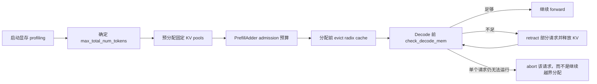
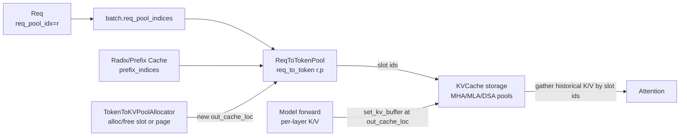

# Prefill Batch 与 KV 分配

> 本篇关注 `TokenizedGenerateReqInput -> Req -> waiting_queue ->
> ScheduleBatch(EXTEND)`，重点解释 `Req.req_pool_idx`、`ReqToTokenPool`、
> `TokenToKVPoolAllocator` 和物理 KV cache 之间的两级映射。
>
> 上一篇：[Scheduler 与 Batch 生命周期](./scheduler-batch-lifecycle.md) ·
> 总索引：[Req 到 ScheduleBatch](./request-batch-state-flow.md)

## 先看结论：SGLang 的 KV 寻址是两级映射

对于请求 A 的逻辑 token position `p`，attention 最终需要找到所有层对应的
K/V。主链路是：

```text
Req A
  req_pool_idx = r
        |
        | 选择 ReqToTokenPool 的第 r 行
        v
ReqToTokenPool.req_to_token[r, p]
        |
        | 得到全局 KV slot s
        v
第 L 层 TokenToKVPool/KVCache 的 slot s
  K_L[s], V_L[s]
```

可以把它类比成操作系统的页表：

```text
req_pool_idx + token position  ~= 虚拟地址
ReqToTokenPool                 ~= 页表
KV slot                        ~= 物理页框号
各层 KV buffer                 ~= 物理内存
```

这个类比只用于理解寻址，不代表实现完全采用 CPU 页表机制。

四个概念必须分开：

| 概念 | 它是什么 | 它不是什么 |
|---|---|---|
| `req_pool_idx` | 某个活跃请求占用的映射表行号 | `rid`、batch 下标、KV slot |
| `ReqToTokenPool` | `[request row, logical position] -> KV slot` 的整型表 | token id 表、真实 K/V 数据 |
| `TokenToKVPoolAllocator` | KV slot/page 编号的分配器 | 逻辑请求映射表 |
| `MHATokenToKVPool` 等 `KVCache` | 持有各层真实 K/V tensor 的物理池 | 请求对象或请求队列 |

## 为什么需要两级映射

如果每个请求的 KV 必须占用一段连续显存，那么请求长度增长、请求结束、prefix
共享都会造成大量搬运和碎片。两级映射允许：

- 同一请求的不同 token 使用不连续 KV slots；
- decode 时只为新 token 追加一个 slot 或一个 page；
- 多个请求的 prefix 行可以指向相同 KV slots；
- 请求结束时回收“请求行”和“物理 KV”这两类不同资源；
- radix cache 保留物理 KV，同时释放原请求的行号；
- batch 可以通过一组 `req_pool_indices` 并行查询多个请求的历史 KV。

因此 `ReqToTokenPool` 解决的是“逻辑序列如何排列”，物理 KV pool 解决的是
“K/V 数据放在哪里”。

## 从请求入队到 admission

`Scheduler.handle_generate_request()` 将 tokenizer 侧对象转换为内部 `Req`：

```text
TokenizedGenerateReqInput
  rid / input_ids / sampling_params / stream / ...
                    |
                    v
Req
  origin_input_ids
  output_ids = []
  prefix_indices = []
  req_pool_idx = None
  kv_committed_len = 0
  kv_allocated_len = 0
  finished_reason = None
```

此时请求通常不占用 `ReqToTokenPool` 行，也不拥有新 KV slot。它通过
`_add_request_to_queue()` 进入 `waiting_queue`。

`waiting_queue` 不是简单 FIFO。Scheduler 会结合以下条件决定谁进入本轮：

- `schedule_policy` 和显式 priority；
- `max_prefill_tokens`、`chunked_prefill_size` 等 token budget；
- 当前可用/可驱逐 KV 空间，以及 running 请求的未来输出预留；
- prefix cache 命中量；
- 最大运行请求数、LoRA 兼容性、分布式同步约束等。

主路径是：

```text
get_next_batch_to_run()
  -> get_new_batch_prefill()
     -> _get_new_batch_prefill_raw()
        -> policy.calc_priority(waiting_queue, running_batch)
        -> for req in waiting_queue:
             req.init_next_round_input(tree_cache)
             PrefillAdder.add_one_req(req, ...)
        -> can_run_list
        -> ScheduleBatch.init_new(can_run_list, ...)
        -> batch.prepare_for_extend()
```

`PrefillAdder` 是 admission controller。请求进入 waiting queue 不代表立刻分配
请求行或 KV；只有进入 `can_run_list` 并执行 `prepare_for_extend()` 后，实际分配
才发生。

## Prefix match 与本轮 suffix

`Req.init_next_round_input(tree_cache)` 先重建本轮完整逻辑输入：

```python
full_untruncated_fill_ids = origin_input_ids + output_ids
```

然后调用 `tree_cache.match_prefix(...)`。匹配结果中的
`device_indices` 被写入：

```python
req.prefix_indices = match_result.device_indices
```

`prefix_indices` 的元素不是 token id，而是已经存在的 KV slot id。例如：

```text
ReqA token ids:       [101, 20, 30, 40, 50]
命中 token positions: [  0,  1,  2]
ReqA.prefix_indices:  [ 17, 83, 84]
```

这表示前三个 token 的 K/V 已经存在于全局物理 slots 17、83、84。它们可以不
连续，也可能同时被其他请求的映射行引用。

源码把最大可匹配长度限制为 `input_len - 1`，确保至少保留一个 token 进入
本轮计算，以便产生下一个 token 的 logits；返回 input logprob 时还可能进一步
缩短可匹配前缀。

本轮真正需要计算的长度为：

```text
extend_input_len = fill_len - len(prefix_indices)
```

长 prompt 还可能受到 `chunked_prefill_size` 限制：一次 EXTEND 只处理 suffix
的一段，其余部分后续继续。chunked 请求可以复用已有的 `req_pool_idx`，不需要
每个 chunk 都换一行。

## `ReqToTokenPool` 的具体结构

基础实现位于 `memory_pool.py:ReqToTokenPool`：

```python
self.size = max_running_requests
self._alloc_size = size + 1
self.req_to_token = torch.zeros(
    (size + 1, max_context_len),
    dtype=torch.int32,
    device=device,
)
self.free_slots = list(range(1, size + 1))
```

实际 `max_context_len` 通常是模型 context length 加 speculative decode 等路径
所需的额外 headroom。

### 行和列分别表示什么

```text
shape = [max request rows + padding row, max logical sequence length]

                     logical token position
                 0      1      2      3      4   ...
req row 0      [  0,     0,     0,     0,     0, ...]  padding/dummy
req row 1      [ 17,    83,    84,   201,   305, ...]
req row 2      [ 42,    43,   100,     0,     0, ...]
req row 3      [ ...                                  ]
```

- 行号是 `req_pool_idx`；
- 列号是请求内部的逻辑 token position；
- 单元格是物理 KV slot id；
- 表本身是 GPU 上的 `int32` tensor，attention backend 可以直接读取；
- `free_slots` 是行号的空闲列表，管理“还能容纳多少活跃请求”。

名字 `req_to_token` 容易误解。这里存的不是 vocabulary token id，而是 token
对应的 KV cache location。

### 为什么第 0 行不分配给真实请求

`ReqToTokenPool` 多分配一行，真实行号从 1 开始。CUDA graph 为固定 batch
shape 做 padding 时，dummy request 的 `req_pool_indices` 可以填 0，使无效读写
落在第 0 行而不影响真实请求。

物理 KV pool 也保留 slot/page 0，用于 padded token 的 dummy 写入。两个 0 都是
保护性 padding，但一个是“请求映射行 0”，另一个是“物理 KV slot/page 0”，
不能混为同一个对象。

### `req_pool_idx` 的分配与复用

`ReqToTokenPool.alloc(reqs)` 的逻辑是：

1. 已有 `req.req_pool_idx` 的 chunked/committed 请求复用原行；
2. 对 `req_pool_idx is None` 的请求，从 `free_slots` 取新行号；
3. 将行号写回每个 `Req.req_pool_idx`；
4. 返回与 `reqs` 顺序一致的行号列表。

例如：

```text
free_slots = [1,2,3,4,...]
ReqA.req_pool_idx = None
ReqB.req_pool_idx = None

alloc([A,B]) -> [1,2]
A.req_pool_idx = 1
B.req_pool_idx = 2
free_slots = [3,4,...]
```

请求完成时 `ReqToTokenPool.free(req)` 会把该行号放回 `free_slots`，并设置：

```python
req.req_pool_idx = None
```

释放时不要求把整行 tensor 清零。旧数值即使还留在行内也已经失效；只有重新
取得该行所有权并按有效长度写入后才能读取。这也是为什么绝不能缓存一个已经
释放请求的 `req_pool_idx` 并继续使用。

### `Req.req_pool_idx` 与 `batch.req_pool_indices`

两者内容相关，但类型和粒度不同：

```text
ReqA.req_pool_idx = 5       # Python int，属于 Req
ReqB.req_pool_idx = 9

batch.reqs = [ReqA, ReqB]
batch.req_pool_indices = tensor([5, 9], device="cuda")
batch.req_pool_indices_cpu = tensor([5, 9], device="cpu")
```

- `Req.req_pool_idx` 是单个请求的长期 row handle；
- `batch.req_pool_indices` 是本次 batch 按行顺序打包后的 device tensor；
- `req_pool_indices_cpu` 是需要在 CPU 侧使用时的镜像；
- batch row 0 只是 `batch.reqs[0]`，其 `req_pool_idx` 完全可能是 5，而不是 0。

## “TokenToKVPool” 实际包含 allocator 和 storage

代码中相关命名有历史层次，阅读时应拆成两部分。

### 1. `TokenToKVPoolAllocator`：管理 slot/page id

`BaseTokenToKVPoolAllocator` 定义：

```python
alloc(need_size) -> KV slot indices
free(indices)
available_size()
get_kvcache()
```

基础 `TokenToKVPoolAllocator` 的 `page_size=1`，空闲集合大致是：

```text
free slots = [1, 2, 3, ..., size]
slot 0 reserved for padding
```

`alloc(3)` 可能返回 `tensor([30,31,32])`；`free(...)` 只是把编号归还分配器。
allocator 不保存 token id，也不保存 request-to-position 映射。

当 `page_size > 1` 时使用 `PagedTokenToKVPoolAllocator`。它按 page 管理空闲
资源，但 `alloc_extend()` / `alloc_decode()` 仍向上层返回逐 token 的 slot
indices。一个请求可以继续使用已有 page 的剩余位置，或者分配新 page。

### 2. `KVCache`：持有真实 K/V tensor

allocator 的 `_kvcache` 指向物理存储实现。常见类型包括：

- `MHATokenToKVPool`：标准 multi-head attention，每层通常分别持有
  `k_buffer` 和 `v_buffer`；
- `MLATokenToKVPool`：MLA 的压缩 KV 表示，每层主要持有一个 `kv_buffer`；
- `DSATokenToKVPool`、SWA/hybrid pool：针对特定 attention/state 布局。

以普通 MHA、NHD layout 为例，每层的逻辑形状近似：

```text
K[layer]: [num_kv_slots + padding, kv_heads, key_head_dim]
V[layer]: [num_kv_slots + padding, kv_heads, value_head_dim]
```

所有层共享同一套 slot 编号。例如 slot 30 表示：

```text
layer 0: K0[30], V0[30]
layer 1: K1[30], V1[30]
...
layer L: KL[30], VL[30]
```

模型每一层计算出本轮 token 的 K/V 后调用 `set_kv_buffer(..., loc,
cache_k, cache_v)`，用同一个 `loc=out_cache_loc` 写入该层对应 buffer。

因此更精确的对象关系是：

```text
ReqToTokenPool
  只保存 slot id
       |
       v
TokenToKVPoolAllocator ---- owns/manages free slot ids
       |
       +---- _kvcache ----> MHATokenToKVPool / MLATokenToKVPool / ...
                            真正保存每层 K/V tensor
```

日常讨论中常把后两者合称 “TokenToKVPool” 或 “KV pool”，但定位内存问题时
必须区分“slot 编号分配错误”和“物理 K/V 读写错误”。

## EXTEND 如何组织多个 Req

假设选中三个请求：

```text
ReqA: full=[a0,a1,a2,a3,a4], prefix slots=[10,11], suffix=[a2,a3,a4]
ReqB: full=[b0,b1,b2],       prefix slots=[],      suffix=[b0,b1,b2]
ReqC: full=[c0,c1,c2,c3],    prefix slots=[20,21,22], suffix=[c3]
```

请求顺序是 batch 行级语义：

```text
batch.reqs = [ReqA, ReqB, ReqC]
batch row 0 -> ReqA
batch row 1 -> ReqB
batch row 2 -> ReqC
```

EXTEND token 按请求平铺：

```text
prefix_lens = [2, 0, 3]
extend_lens = [3, 3, 1]
seq_lens    = [5, 3, 4]

input_ids(flat):
  offset:  0   1   2 |  3   4   5 |  6
          a2  a3  a4 | b0  b1  b2 | c3
          <-- ReqA ->| <-- ReqB ->|ReqC
```

必须区分四种下标：

| 下标 | 示例 | 作用域 |
|---|---|---|
| batch row | ReqA 是 row 0 | 本轮 batch |
| `req_pool_idx` | ReqA 占映射表 row 2 | Req 活跃期间 |
| logical token position | `a2` 在 A 中是 position 2 | 请求序列 |
| flat batch offset | `a2` 在本轮 EXTEND 是 offset 0 | 本轮 flat input/output |

它们可能数值恰好相同，但语义完全不同。

## EXTEND batch 与 KV slot

### `alloc_for_extend()`：一次完整的两级分配

`ScheduleBatch.prepare_for_extend()` 计算 lengths 后调用
`alloc_for_extend(batch)`。主过程如下：

```text
1. prefix_tensors = [req.prefix_indices for req in batch.reqs]
2. ReqToTokenPool.alloc(reqs) 分配/复用请求行
3. TokenToKVPoolAllocator.alloc(...) 分配 suffix 的物理 KV slots
4. write_cache_indices(...) 把 prefix slots + new slots 写入每个请求行
5. 返回 out_cache_loc、req_pool_indices(device)、req_pool_indices_cpu
```

继续上例，假设请求行和新 slots 为：

```text
ReqA.req_pool_idx = 2
ReqB.req_pool_idx = 5
ReqC.req_pool_idx = 9

batch.req_pool_indices = [2,5,9]

out_cache_loc(flat):
  flat offset:  0   1   2 |  3   4   5 |  6
  KV slot:     30  31  32 | 33  34  35 | 36
               <-- ReqA ->| <-- ReqB ->|ReqC
```

`write_cache_indices()` 按 `prefix_lens/extend_lens` 切分 flat
`out_cache_loc`，最终写成：

```text
ReqToTokenPool.req_to_token

row 2 / ReqA:
  token_pos:   0   1 |  2   3   4
  KV slot:    10  11 | 30  31  32
              prefix | new suffix

row 5 / ReqB:
  token_pos:   0   1   2
  KV slot:    33  34  35

row 9 / ReqC:
  token_pos:   0   1   2 |  3
  KV slot:    20  21  22 | 36
              prefix     | new suffix
```

此时只完成了“地址分配和映射写入”。真实 K/V 内容要等模型 forward 的每个
attention layer 使用 `out_cache_loc` 写入物理 pool。

### `out_cache_loc` 为什么是 flat 的

模型输入把各请求 suffix 拼成一个 flat token 维度，模型产出的 K/V 第一维也
按同样顺序排列。因此：

```text
cache_k[flat offset i] -> physical K buffer[out_cache_loc[i]]
cache_v[flat offset i] -> physical V buffer[out_cache_loc[i]]
```

`write_cache_indices()` 和 `set_kv_buffer()` 使用同一套 flat 对齐关系：前者建立
以后读取历史 KV 的映射，后者在本轮写入真实数据。

## Attention 如何读取历史 KV

以 ReqA、`seq_len=5` 为例，backend 先通过请求行得到：

```python
kv_slots = req_to_token[2, :5]
# tensor([10, 11, 30, 31, 32])
```

然后各层用这些 slot ids gather/scatter 物理 buffer：

```text
layer L 的历史 K = K_buffer[L][[10,11,30,31,32]]
layer L 的历史 V = V_buffer[L][[10,11,30,31,32]]
```

具体 backend 可能使用 paged metadata、Triton kernel、FlashAttention 或其他
紧凑表示，不一定真的执行这两行 PyTorch indexing；但逻辑寻址关系一致。

## Decode 如何追加一个 KV slot

prefill 完成后，A 的映射行为：

```text
position: 0   1   2   3   4
slot:    10  11  30  31  32
```

假设下一次 decode 前 `seq_lens=5`。`alloc_for_decode(batch,
token_per_req=1)`：

1. 为每个请求分配一个新 slot，例如 A 得到 40；
2. 写入 `req_to_token[A.req_pool_idx, 5] = 40`；
3. 返回 `out_cache_loc=[40,...]`；
4. `prepare_for_decode()` 将相应 seq length 加 1；
5. forward 各层把当前 decode token 的 K/V 写到 slot 40。

结果是：

```text
position: 0   1   2   3   4 |  5
slot:    10  11  30  31  32 | 40
```

这里的 position 5 对应“本次作为模型输入的上一个已采样 token”的 K/V；本次
forward 新采样出的 token 会成为下一次 decode 的输入。不要把 sampled token
产生时间和它的 KV 写入时间混在一起。

## page size 大于 1 时有什么变化

当 `page_size=1` 时，allocator 独立管理每个 token slot。`page_size>1` 时：

- allocator 的空闲单位变成 page；
- 一个 page 包含 `page_size` 个连续物理 slots；
- 请求末尾 page 尚有空位时，decode 可以继续使用该 page；
- 需要新 page 时才从 `free_pages` 取一个；
- `ReqToTokenPool` 仍按每个 logical token position 保存最终 slot id；
- `out_cache_loc` 对模型仍表现为逐 token 的写入位置。

所以 paging 改变的是物理分配和释放粒度，并没有把
`ReqToTokenPool.req_to_token` 变成“每列一个 page id”的表。

物理 pool 会为 padding page 预留空间，真实 page 从 1 开始。释放时 paged
allocator 根据 slot id 反推出 page，并按唯一 page 回收，避免同一页重复 free。

## Prefix sharing：多个请求可以指向同一 slot

假设 A 已经把 `[x0,x1,x2]` 插入 radix cache，对应 slots `[70,71,72]`。B、C
都命中该 prefix：

```text
ReqB row 4: [70,71,72, 90,91,...]
ReqC row 8: [70,71,72,120, ...]
             ^^^^^^^^^
             shared prefix KV
```

这说明映射不是一对一：

- 一个 request row 的多个 position 指向多个 slots；
- 一个物理 slot 也可能被多个 request rows/radix node 引用；
- 不能因为释放 B 的请求行就无条件释放 `[70,71,72]`；
- radix cache 的 node、lock/ref 和 eviction 逻辑负责共享 prefix 的物理生命周期。

`req.cache_protected_len` 用于区分已经由 cache 保护的区间和请求仍需负责的
partial/新增区间，尤其在 `page_size>1` 时不能简单用
`len(prefix_indices)` 代替所有权边界。

## 请求完成时：行和物理 KV 分开释放

完成路径大致是：

```text
release_kv_cache(req, tree_cache)
  -> tree_cache.cache_finished_req(req)
       插入/复用 radix prefix
       释放重复 slots、未缓存 tail 或全部 KV（cache disabled）
       释放 cache node lock
  -> 释放 speculative/overallocated tail
  -> req_to_token_pool.free(req)
       req.req_pool_idx = None
```

关键点是：

- `ReqToTokenPool.free(req)` 只回收请求映射行；
- `TokenToKVPoolAllocator.free(indices)` 才回收物理 KV slots/pages；
- 若 KV 已转交给 radix cache，它可以在请求结束后继续存在；
- 若 cache disabled，完成路径会回收请求已提交的物理 KV；
- speculative decode 可能预分配多于最终接受长度的 slots，
  `kv_committed_len` 与 `kv_allocated_len` 用来划分有效和 overallocated 区间。

因此检查显存泄漏时，看到 `req.req_pool_idx=None` 只能证明请求行已释放，不能
单独证明物理 KV 已释放；反过来，物理 slots 已缓存保留也不代表请求仍在运行。

## `kv_committed_len` 与 `kv_allocated_len`

这两个 Req 字段补充了映射表本身无法表达的所有权信息：

| 字段 | 含义 |
|---|---|
| `kv_committed_len` | 已确认属于请求有效历史/cache 候选的逻辑 KV 长度 |
| `kv_allocated_len` | 请求行中已经预留的 KV 范围上界 |

普通非 speculative 路径中它们通常同步增长；overlap/speculative 路径可能提前
多分配，于是：

```text
kv_committed_len < kv_allocated_len
```

请求完成、retract 或 speculative acceptance 确定后，多出的区间才能安全归还
allocator。

## KV cache 预算与 GPU OOM 防护

SGLang 不是等到 CUDA allocator 抛 OOM 才处理 KV cache。它把保护拆成多个
阶段：启动时确定静态池上限，prefill admission 前做预算，实际分配前驱逐可
驱逐 prefix，decode 前再次检查，不够时 retract 请求，最后才进入明确的失败
路径。



这套机制主要防止 KV pool 被过度承诺。GPU 上还有 model weights、activations、
CUDA graph buffers、通信 workspace 和临时 tensor，因此它不能从数学上保证所有
CUDA OOM 都不会发生；`mem_fraction_static` 和 chunked prefill 负责给这些非 KV
内存留出 headroom。

### 第一层：启动时确定静态显存边界

`ServerArgs._handle_gpu_memory_settings()` 把 `mem_fraction_static` 定义为：

```text
mem_fraction_static
  = (model weights + KV cache pools) / GPU memory capacity

1 - mem_fraction_static
  ~= activations + CUDA graph buffers + runtime headroom
```

默认值会根据 GPU 容量、`chunked_prefill_size`、decode CUDA graph 最大 batch、
并行规模、speculative decoding 和多模态模型等因素估算。如果显式指定：

- 值越大：静态 KV pool 可以更大，但留给 activation/graph/临时 tensor 的空间
  越少；
- 值越小：KV token 容量降低，但运行时更不容易因为动态峰值 OOM。

模型加载后，`ModelRunnerKVCacheMixin._profile_available_bytes()` 读取实际剩余
显存，并计算可以用于 memory pools 的预算。普通路径可以近似理解为：

```text
kv_budget_bytes
  = post_model_load_free_bytes
    - pre_model_load_free_bytes * (1 - mem_fraction_static)
```

不同架构再通过 `MemoryPoolConfigurator` 将字节预算换算成 token 容量。标准
MHA/MLA 路径使用：

```text
bytes_per_token = 所有本 rank KV layers 中一个 token 的 KV 字节数
max_total_num_tokens
  = floor(kv_budget_bytes / bytes_per_token)
  -> 再向下按 page_size 对齐
```

标准 MHA 的 `bytes_per_token` 近似为：

```text
local_kv_heads
  * (key_head_dim + value_head_dim)
  * local_kv_layer_count
  * kv_dtype_bytes
```

MLA、DSA、SWA、Mamba/linear state 和 DeepSeek V4 的池结构不同，由专用
configurator 联合计算，不应套用普通 MHA 公式。

随后还会应用两类上限：

- `--max-total-tokens` 只能把 profiled token capacity 调小，不能强行超过实际
  profiling 结果；
- pipeline parallel 各 rank 取容量最小值，避免某一 rank 先耗尽。

若最终容量不大于 0，初始化直接失败并提示调整显存配置，而不是带着无效 pool
进入服务阶段。

### 为什么预分配 KV pool 能降低 OOM 风险

确定 `max_total_num_tokens` 后，`_init_pools()` 创建固定大小的
`MHATokenToKVPool`、`MLATokenToKVPool` 等物理 tensor。运行过程中 decode
主要是在预分配 pool 中申请和归还 slot/page id，而不是每生成一个 token 都向
CUDA allocator 申请一块新 K/V tensor。

因此运行时 KV 容量问题通常表现为：

```text
TokenToKVPoolAllocator.available_size() 不足
```

而不是物理 GPU 显存突然无限增长。allocator 的上限就是启动时已经落地的静态
pool 容量。

### 第二层：区分四种预算

调度时至少同时存在四种不同约束：

| 预算 | 典型变量/接口 | 防止什么问题 |
|---|---|---|
| 请求行 | `ReqToTokenPool.available_size()`、`max_running_requests` | 活跃请求数超过映射表行数 |
| 物理 KV token | `TokenToKVPoolAllocator.available_size()` | KV slots/pages 过度分配 |
| 单轮 prefill token | `max_prefill_tokens`、`chunked_prefill_size` | prefill activation 峰值过大或长 prompt 阻塞 |
| 未来 decode 预留 | `PrefillAdder.rem_total_tokens`、`new_token_ratio` | prompt 都能放入，但下一轮 decode 无 slot 可用 |

这四个量不能互相替代。例如 KV pool 还剩 50K slots，不代表本轮可以一次性
prefill 50K tokens：模型中间 activation 可能先 OOM。反过来，单轮 prefill
很小也不代表可以无限接纳请求，因为它们未来的 decode 仍会持续占用 KV。

还要区分：

```text
available_size
  = allocator 当前已经空闲、可立即分配的 slots

evictable_size
  = radix/prefix cache 中没有被活跃请求锁住、需要时可驱逐的 slots

protected/locked cache
  = 活跃请求仍依赖，不能计入可用预算
```

`PrefillAdder` 通常把 `available + evictable` 当作潜在容量，而不是只看当前
`available_size()`；真正分配前会把需要的 evictable cache 转成 free slots。

### 第三层：Prefill admission 防止过度承诺

`PrefillAdder` 初始化时先为已有 `running_batch` 估计未来 decode 消耗：

```text
running_reserved
  ~= sum(
       min(remaining_max_new_tokens, CLIP_MAX_NEW_TOKENS)
       * new_token_ratio
     )

rem_total_tokens
  = available_slots + evictable_cache_slots - running_reserved
```

这里的 `CLIP_MAX_NEW_TOKENS` 默认由
`SGLANG_CLIP_MAX_NEW_TOKENS_ESTIMATION` 控制，避免一个极大的用户上限让估计
无限膨胀。

对一个准备新接纳、且能在本轮完成 prefill 的请求，检查会更保守，近似为：

```text
required
  = ceil_to_page(uncached_prompt_suffix)
    + min(max_new_tokens, CLIP_MAX_NEW_TOKENS)
    + one_page_alignment_overhead
```

也就是说，`new_token_ratio` 主要用于估算已经运行请求的剩余输出；新请求进入
时会先按截断后的 `max_new_tokens` 预留，而不是一开始就只保留一个很小比例。
chunked prefill 尚未完成的中间 chunk 暂不预留最终 decode 输出，等最后一个
chunk 被接纳时再纳入。

`PrefillAdder._update_prefill_budget()` 每接纳一个请求就同步扣减：

- 本轮 input token budget；
- 当前实际 KV 分配预算；
- 包含未来输出的 total token budget；
- page alignment overhead；
- hybrid SWA/Mamba 等专用 pool 的独立预算。

预算不足时返回 `AddReqResult.NO_TOKEN`，Scheduler 停止继续接纳，而不是先构造
一个超大 batch 再尝试分配。

### `new_token_ratio` 为什么需要动态变化

如果永远为每个 running request 保留全部 `max_new_tokens`，调度会非常保守，
大量 KV pool 长期只是“账面预留”；如果完全不预留，prompt admission 很容易
把 pool 填满，下一轮 decode 就无法前进。

`NewTokenRatioTracker` 在两者之间做反馈控制：

```text
初始化：init_ratio * schedule_conservativeness，上限为 1
稳定运行：每次 decay_step() 逐步下降到 min_ratio
发生 retract：根据当前请求已生成长度和额外 decode 步数重新估计
```

因此：

- 较高 ratio：吞吐/并发更保守，但 decode retract 更少；
- 较低 ratio：允许接纳更多 prefill，但流量分布超出估计时更可能 retract；
- `--schedule-conservativeness` 增大初始预留，适合频繁出现 retract 的场景。

它只影响调度账本，不会扩大实际 KV pool。

### 第四层：实际分配前先驱逐可驱逐 prefix

预算允许后，真正申请 slots 仍统一通过 `alloc_token_slots()` 或 paged 版本。
其顺序是：

```text
evict_from_tree_cache(tree_cache, num_tokens)
  -> 若 allocator 当前 free slots 不足
  -> tree_cache.evict(...) 驱逐未锁定的 radix nodes
  -> 对应 KV slots/pages 归还 allocator

allocator.alloc(num_tokens)
```

这说明 prefix cache 占满“未使用显存”本身不是 OOM：未被活跃请求保护的 cache
是可回收容量。只有：

```text
free + evictable < 本次真实分配需求
```

才表示当前 KV pool 无法满足请求。

如果经过驱逐后 allocator 仍返回 `None`，prefill 分配会抛出带
`available/evictable` 信息的明确错误。正常情况下 admission 已经阻止这种
情况；该错误是预算与实际分配不一致时的最后保护，而不是常规流控手段。

### 第五层：Decode 前检查并 retract

decode 请求已经运行，不能简单留在 waiting queue。每次准备 decode 前，
`update_running_batch()` 调用：

```python
batch.check_decode_mem()
```

它会：

1. 用 `new_tokens_required_next_decode()` 计算下一步真实所需 slots；
2. speculative v2 按 reserve、page alignment、`kv_allocated_len` 计算增量；
3. 先尝试 `evict_from_tree_cache()`；
4. 再检查 allocator 的 `available_size()` 是否足够。

如果仍不够，`retract_decode()` 从 running batch 中移除部分请求：

```text
running Req
  -> release_kv_cache(..., is_insert=False)
  -> 立即释放请求行和 KV，不把它们插入 radix cache
  -> req.reset_for_retract()
  -> 重新加入 waiting_queue，之后重新 prefill
```

非 speculative 路径会根据已生成长度和原 prompt 长度排序选择 retract 对象；
当前实现会反复 retract，直到剩余 batch 的下一步 decode 能放下。retract 是用
额外重算换取服务继续运行，不等同于请求失败。

如果其他请求全部 retract 后，最后一个请求的下一 decode 仍无法容纳，当前
实现会给它设置 OOM abort 并释放资源，而不是继续提交一个必然越界的 forward。

### Chunked prefill 主要防的是 activation 峰值

KV pool 是静态大头，但长 prompt forward 还会产生与本轮 token 数相关的
activation/workspace。`chunked_prefill_size` 把一个长 suffix 拆成多轮，
`max_prefill_tokens` 限制一轮 admission 的总输入规模，从而降低瞬时显存峰值。

两者的侧重点不同：

```text
max_total_num_tokens
  -> 整个服务生命周期可驻留多少 token KV

max_prefill_tokens / chunked_prefill_size
  -> 单次 forward 同时处理多少 prompt tokens
```

若日志显示 allocator KV slots 尚多，但 CUDA 在长 prefill 中 OOM，优先怀疑
activation headroom 和 chunk size，而不是 `ReqToTokenPool` 行数。

### 一次内存压力场景

假设物理 KV pool 容量为 1000 token slots：

```text
allocator free                 = 120
radix cache evictable          = 180
活跃请求锁定/已使用            = 700
潜在可用于新工作 free+evictable = 300
```

已有 running requests 的未来 decode 估计预留 140，则：

```text
PrefillAdder.rem_total_tokens = 120 + 180 - 140 = 160
```

新请求需要：

```text
uncached suffix(page aligned) = 80
future output reserve         = 64
page overhead                 = 16
total                         = 160
```

源码使用严格边界避免把预算正好耗尽，这个请求会被留在 waiting queue。若只看
`free+evictable=300` 而忽略 running reserve，就会错误接纳，导致下一次 decode
没有空间。

如果实际输出比估计更长，使下一轮 decode 需要 32 slots、但 free 只有 20：

```text
check_decode_mem
  -> 先驱逐仍可驱逐的 radix cache
  -> 仍不足则 retract 一个请求
  -> 释放其 KV 后重新检查
  -> 剩余 batch 继续 decode
```

### 调参时看哪个旋钮

| 现象 | 优先检查/调整 | 原因 |
|---|---|---|
| 启动时提示无法分配 KV pool | 提高 `--mem-fraction-static`，减小模型/并行 rank 负担 | 静态区给 weights+KV 的预算不足 |
| 运行时长 prefill CUDA OOM，但 KV slots 尚多 | 降低 `--mem-fraction-static`、`--chunked-prefill-size` 或 `--max-prefill-tokens` | 给 activation/workspace 留更多动态空间 |
| 经常发生 decode retract | 增大 `--schedule-conservativeness`，或降低并发/prefill admission | 为 running decode 留更多 KV 预算 |
| KV pool 希望明确限制 | 设置更小的 `--max-total-tokens` | 它是 profiled capacity 的上限 |
| request row 耗尽 | 降低/合理设置 `--max-running-requests` | `ReqToTokenPool` 行数与 token slots 是独立容量 |
| 单个超长 prompt 造成峰值 | 使用更小的 `--chunked-prefill-size` | 把 activation 峰值分散到多轮 |
| prefix cache 占用很多 | 先看 `evictable` 与 `protected`，不要只看 cache 总量 | evictable cache 会在真实分配前自动回收 |

`--mem-fraction-static` 的方向尤其容易搞反：启动时静态池不足可以调大；运行时
activation OOM 应调小。调低它会减少 `max_total_num_tokens`，这是用并发容量换
运行时 headroom。

### 防 OOM 的边界

这套预算在以下假设成立时工作最好：模型和 backend 的 per-token KV 大小可准确
计算，activation 峰值与启动 heuristics 接近，请求输出分布可被
`new_token_ratio` 覆盖。以下情况仍可能出现真实 CUDA OOM：

- 自定义 kernel/backend 使用了未计入估算的大型 workspace；
- CUDA graph capture、通信或多模态 encoder 峰值超过预留；
- 用户把 `mem_fraction_static` 设得过高；
- 并发模式、speculative 参数或超长 prefill 使动态峰值显著变化；
- pool 外存在显存泄漏或跨 stream tensor 生命周期异常。

因此 SGLang 的策略是“固定 KV 上限 + 运行时流控 + 必要时降级/retract”，而不
是声称可以屏蔽所有 GPU OOM。

## 一个完整例子

假设：

```text
ReqToTokenPool: 4 个真实 request rows，row 0 保留
物理 KV slots: 1..12，slot 0 保留
radix cache 已保存 token [7,8] -> slots [3,4]
```

新请求 A=`[7,8,9,10]`，B=`[20,21]`：

### 1. Prefix match

```text
A.prefix_indices=[3,4], suffix=[9,10]
B.prefix_indices=[],    suffix=[20,21]
```

### 2. 分配请求行

```text
A.req_pool_idx=1
B.req_pool_idx=2
batch.req_pool_indices=[1,2]
```

### 3. 分配 suffix slots

假设 allocator 返回：

```text
out_cache_loc=[5,6,7,8]
```

flat 对齐是：

```text
A: token 9 -> slot 5
A: token10 -> slot 6
B: token20 -> slot 7
B: token21 -> slot 8
```

### 4. 写映射表

```text
row 1 / A: [3,4,5,6]
row 2 / B: [7,8]
```

### 5. Forward 写物理 K/V

对每一层 L：

```text
K_L[[5,6,7,8]] <- 本轮 flat tokens 的 K
V_L[[5,6,7,8]] <- 本轮 flat tokens 的 V
```

slots 3、4 无需重写，因为来自 prefix cache。

### 6. A decode 一步

prefill 采样 `a0`。下一轮 A 以 `a0` 为输入做 decode，假设新分配 slot 9：

```text
row 1 / A: [3,4,5,6,9]
K_L[9], V_L[9] <- token a0 在各层的 KV
```

decode forward 再采样 `a1`，但 `a1` 的 KV 要到下一轮把 `a1` 作为输入时写入。

### 7. 请求结束

若 A 的 `[7,8,9,10,a0,...]` 被插入 radix cache，row 1 可以立即归还给
`ReqToTokenPool`，而 cache 接管的 slots 仍保留；没有被 cache 接管的 tail 和
overallocated slots 归还物理 allocator。

## 常见误解

| 误解 | 正确理解 |
|---|---|
| `req_pool_idx` 是请求在 batch 中的下标 | 它是 `ReqToTokenPool` 的行号，batch row 另有顺序 |
| `req_pool_idx` 等于 KV slot | 它先选映射表行，该行每个 position 才保存 KV slot |
| `ReqToTokenPool` 存 token ids | 它存的是 `int32` KV location ids |
| 一行就是一块连续 KV | 一行可指向任意 slots/pages，物理位置可以不连续 |
| 每个请求独占 prefix KV | radix prefix slots 可以被多个请求行共享 |
| free request row 会自动 free 全部 KV | 行和物理 KV 的释放是两套操作，prefix cache 还可能接管 KV |
| `TokenToKVPoolAllocator` 保存真实 K/V | allocator 管编号，`KVCache` 子类保存真实 tensor |
| `prefix_indices` 等于 `out_cache_loc` | 前者是已存在的命中 slots，后者是本轮新写入 slots |
| flat offset 等于 logical position | flat offset 只属于当前 batch，logical position 属于请求 |
| 请求入 batch 后 KV 已写好 | `prepare_for_extend()` 先分配地址，forward 才写每层 K/V |
| paged 模式的映射表存 page id | 映射表仍保存逐 token slot id，只是 allocator 按 page 管理 |

## 调试时如何检查

遇到 KV 错位或非法访问，可以按以下不变量逐层检查：

```text
1. len(batch.reqs) == len(batch.req_pool_indices)
2. batch.req_pool_indices[i] == batch.reqs[i].req_pool_idx
3. 对每个 req，有效 logical range 不超过 ReqToTokenPool 行宽
4. req_to_token[row, :seq_len] 中的有效 slot 均在物理 pool 范围内
5. EXTEND 中 len(out_cache_loc) == sum(extend_lens)
6. flat input、out_cache_loc 和每层 cache_k/cache_v 的 token 顺序一致
7. 同一新分配 slot 不应同时属于无共享关系的两个 token
8. free row 后，不再有 batch/future work 使用该 req_pool_idx
9. free physical slot/page 前，不再有 request row 或 radix node 引用它
```

只打印 `req_pool_idx` 不足以定位问题；至少应同时记录 `rid`、batch row、
`seq_len`、`prefix_len`、`req_to_token` 有效切片和 `out_cache_loc`。

## 总览图



一句话总结：`Req` 用 `req_pool_idx` 找到自己的映射行，映射行把逻辑 token
position 翻译成全局 KV slot，allocator 管理这些 slot 的空闲状态，KVCache
则在每一层真正保存 slot 对应的 K/V 数据。

## 源码阅读地图

| 主题 | 文件 / 函数 |
|---|---|
| Req 内存字段 | `managers/schedule_batch.py:Req.__init__` |
| 请求本轮输入与 prefix match | `schedule_batch.py:Req.init_next_round_input` |
| Prefill admission | `scheduler.py:get_new_batch_prefill` / `_get_new_batch_prefill_raw` |
| 策略与预算 | `schedule_policy.py:SchedulePolicy` / `PrefillAdder` |
| Pool 初始化 | `model_executor/model_runner_kv_cache_mixin.py:_init_pools` |
| 请求映射表 | `mem_cache/memory_pool.py:ReqToTokenPool` |
| KV allocator 接口 | `mem_cache/allocator/base.py:BaseTokenToKVPoolAllocator` |
| 单 token allocator | `mem_cache/allocator/token.py:TokenToKVPoolAllocator` |
| paged allocator | `mem_cache/allocator/paged.py:PagedTokenToKVPoolAllocator` |
| 物理 KV 抽象 | `mem_cache/memory_pool.py:KVCache` |
| MHA 物理 pool | `mem_cache/memory_pool.py:MHATokenToKVPool` |
| MLA 物理 pool | `mem_cache/memory_pool.py:MLATokenToKVPool` |
| 静态显存比例与动态 headroom | `server_args.py:_handle_gpu_memory_settings` |
| 启动显存 profiling | `model_executor/model_runner_kv_cache_mixin.py:_profile_available_bytes` / `_resolve_memory_pool_config` |
| bytes 到 token capacity | `model_executor/pool_configurator.py:MemoryPoolConfigurator` 及各子类 |
| 准备 EXTEND | `schedule_batch.py:ScheduleBatch.prepare_for_extend` |
| EXTEND 两级分配 | `mem_cache/common.py:alloc_for_extend` / `write_cache_indices` |
| DECODE 追加 slot | `mem_cache/common.py:alloc_for_decode` |
| Prefill admission 预算 | `managers/schedule_policy.py:PrefillAdder` |
| Prefix eviction | `mem_cache/common.py:evict_from_tree_cache` |
| Decode 内存检查/retract | `schedule_batch.py:ScheduleBatch.check_decode_mem` / `retract_decode` |
| KV 写入 | `memory_pool.py:*TokenToKVPool.set_kv_buffer` |
| 完成释放 | `mem_cache/common.py:release_kv_cache` |
| Radix cache 接管 KV | `mem_cache/radix_cache.py:cache_finished_req` / `cache_unfinished_req` |
| 动态输出预算 | `scheduler_components/new_token_ratio_tracker.py` |

下一篇：[Decode Batch、请求隔离与 MIXED](./decode-batch-and-isolation.md)
