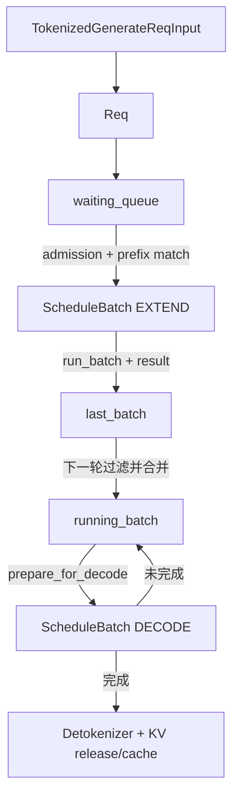

# Req 到 ScheduleBatch：状态流转导读

> 目标：建立 `Req -> waiting_queue -> ScheduleBatch(EXTEND) -> last_batch -> running_batch -> ScheduleBatch(DECODE)` 的整体心智模型。
>
> 适合阅读时机：读完 Week 1 主流程后，准备深入 Week 2 Scheduler、cache 和 batch 之前。

原专题接近 1000 行，现拆为一个稳定入口和三个可独立阅读的子专题。

## 阅读导航

| 子专题 | 重点问题 | 建议阅读场景 |
|---|---|---|
| [Scheduler 与 Batch 生命周期](./scheduler-batch-lifecycle.md) | Scheduler 每轮做什么；`cur_batch`、`last_batch`、`running_batch` 如何配合；CPU/GPU 如何流水 | 想理解主循环、continuous batching、normal/overlap |
| [Prefill Batch 与 KV 分配](./prefill-batch-and-kv.md) | 新请求如何准入；EXTEND 如何组织多个 Req；prefix hit 和 KV slot 如何映射 | 想理解 `waiting_queue`、`PrefillAdder`、`prepare_for_extend()` |
| [Decode Batch、请求隔离与 MIXED](./decode-batch-and-isolation.md) | running 请求如何逐 token 推进；同 batch 请求为何不会互相 attend；MIXED 如何组合 | 想理解 `prepare_for_decode()`、attention metadata、sampling 隔离 |
| [Scheduler 状态日志 11 个典型场景](./scheduler-status-log-scenarios.md) | 如何从 `scheduler.status` 反推 EXTEND/DECODE、队列、ReqToTokenPool、KV pool 和 RadixCache 状态 | 想用真实日志校验心智模型 |

推荐顺序：先读生命周期，再读 Prefill/KV，最后读 Decode/隔离；调试时配合状态日志场景手册验证理解。

## 一句话总览

SGLang 的 Scheduler 不会“收到一个请求就单独 forward 到结束”。它把请求包装成 `Req` 放入 `waiting_queue`，按 token budget、KV budget 和 prefix cache 命中情况选出一批请求组成 `ScheduleBatch(EXTEND)`。EXTEND 结束后，未完成请求通过 `last_batch` 合入长期存在的 `running_batch`；之后 `running_batch` 被准备成 `ScheduleBatch(DECODE)`，每轮通常让每个请求推进一个 token。



## 对象速查

| 名字 | 本质 | 生命周期 | 最重要的语义 |
|---|---|---|---|
| `Req` | 单请求可变状态 | 从入队到完成 | 输入、输出、采样、prefix hit、KV 映射和 finish 状态 |
| `waiting_queue` | 尚未获准 prefill 的 `Req` 集合 | engine 运行期间 | 等待的是资源准入，不只是 FIFO 排队 |
| `ScheduleBatch(EXTEND)` | 一次 prefill/extend forward 视图 | 一次 forward 附近 | 只计算未命中的 suffix，可包含长 prompt 的一个 chunk |
| `cur_batch` | 本轮实际执行 batch 的引用 | 当前 Scheduler iteration | 回答“这一轮执行什么” |
| `last_batch` | 上一轮 forward batch 的过渡引用 | 上一轮到下一轮开头 | 承接 EXTEND→DECODE；overlap 下也代表前一流水级 |
| `running_batch` | 已有历史 KV、仍需生成的请求集合 | 跨多个 decode iteration | continuous batching 的长期状态 |
| `ScheduleBatch(DECODE)` | 一次 decode forward 视图 | 单次 forward | 普通路径通常就是准备后的 `running_batch` |
| `ForwardBatch` | 模型执行侧的低层 tensor 视图 | 单次 model forward | 把 Scheduler 元数据转换为 attention/backend 输入 |
| `GenerationBatchResult` | 单次生成 forward 的结果载体 | forward 到结果处理结束 | 跨越 GPU→CPU 结果边界 |

`ScheduleBatch` 持有 `Req` 引用。`req.output_ids.append(...)` 更新的是同一个请求对象，不是复制出来的新状态。

## 三条必须分清的边界

### 调度颗粒度

Scheduler 的一次决策对应一次 `ScheduleBatch` forward，而不是一个请求的完整生命周期。普通 decode 中，一个请求会跨越几十到几千轮调度。

### 逻辑状态与执行视图

`running_batch` 表示长期存活的 decode 请求集合；`cur_batch` 表示这一轮选中了什么。纯 decode 时二者可能是同一个对象：

```text
cur_batch is running_batch
```

执行新 prefill 时则可能是：

```text
cur_batch is not running_batch
last_batch is cur_batch  # 循环尾部
```

### 请求位置与 KV 位置

```text
ReqToTokenPool[req_pool_idx, token_pos] -> KV slot
TokenToKVPool[KV slot]                  -> 实际 K/V
```

`token_pos` 是请求内部位置；EXTEND flat offset 是本轮 batch 平铺位置；KV slot 是真实缓存位置。三者不能混用。

## 按问题跳转

- Scheduler 如何选择新 prefill 还是继续 decode？见 [Scheduler 主循环](./scheduler-batch-lifecycle.md#scheduler-主循环与调度颗粒度)。
- CPU/GPU 泳道和 CUDA 异步关系是什么？见 [CPU/GPU 泳道图](./scheduler-batch-lifecycle.md#cpu--gpu-泳道图)。
- 为什么需要 `last_batch`？见 [`last_batch` 的过渡作用](./scheduler-batch-lifecycle.md#last_batch-的过渡作用)。
- 新请求如何进入 EXTEND batch？见 [从请求入队到 admission](./prefill-batch-and-kv.md#从请求入队到-admission)。
- Prefix cache 命中后到底 forward 哪些 token？见 [Prefix match 与 suffix](./prefill-batch-and-kv.md#prefix-match-与本轮-suffix)。
- EXTEND 的 flat token 如何对应 KV？见 [EXTEND 与 KV slot](./prefill-batch-and-kv.md#extend-batch-与-kv-slot)。
- SGLang 如何计算 KV budget 并避免耗尽 GPU 显存？见 [KV cache 预算与 GPU OOM 防护](./prefill-batch-and-kv.md#kv-cache-预算与-gpu-oom-防护)。
- Decode 为什么只输入最新 token？见 [running_batch 到 DECODE](./decode-batch-and-isolation.md#running_batch-到-schedulebatchdecode)。
- 同一个 decode batch 的请求为何不会互相 attend？见 [请求隔离](./decode-batch-and-isolation.md#decode-batch-里多个-req-为什么不会互相影响)。
- EXTEND 和 DECODE 可以混合吗？见 [MIXED batch](./decode-batch-and-isolation.md#mixed-把-prefill-和-decode-放进同一轮)。
- `scheduler.status` 里的 `req_pool_indices`、`out_cache_loc_len`、`active_rows` 怎么读？见 [Scheduler 状态日志 11 个典型场景](./scheduler-status-log-scenarios.md)。

## 最小记忆版

```text
1. Req 是单请求状态机。
2. waiting_queue 保存尚未完成 prefill admission 的 Req。
3. ScheduleBatch(EXTEND) 只 forward 未命中的 suffix。
4. EXTEND 跑完后先成为 last_batch，下一轮再合入 running_batch。
5. running_batch 保存已有历史 KV、仍需继续生成的 Req。
6. ScheduleBatch(DECODE) 通常是 running_batch 的单轮执行视图；历史通过 KV cache 读取。
```

## 源码总入口

| 主题 | 文件 / 函数 |
|---|---|
| Scheduler 主循环 | `scheduler.py:event_loop_normal` / `event_loop_overlap` |
| 选择下一批 | `scheduler.py:get_next_batch_to_run` |
| Prefill admission | `scheduler.py:get_new_batch_prefill` / `_get_new_batch_prefill_raw` |
| Batch 数据结构 | `schedule_batch.py:Req` / `ScheduleBatch` |
| EXTEND/DECODE KV 分配 | `mem_cache/common.py:alloc_for_extend` / `alloc_for_decode` |
| 执行侧 batch | `model_executor/forward_batch_info.py:ForwardBatch.init_new` |
| 结果处理 | `managers/scheduler_components/batch_result_processor.py` |
