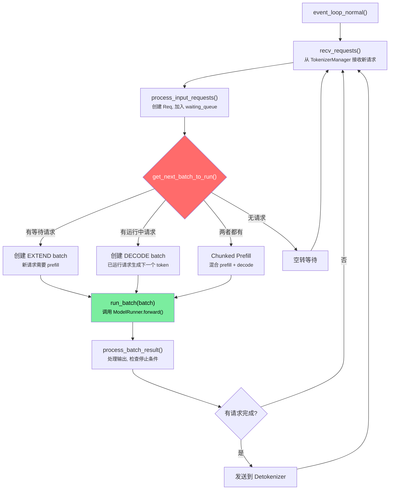
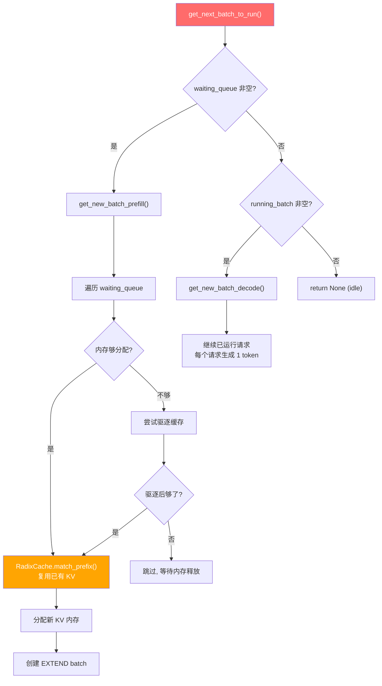
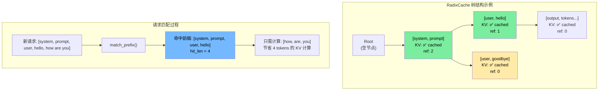
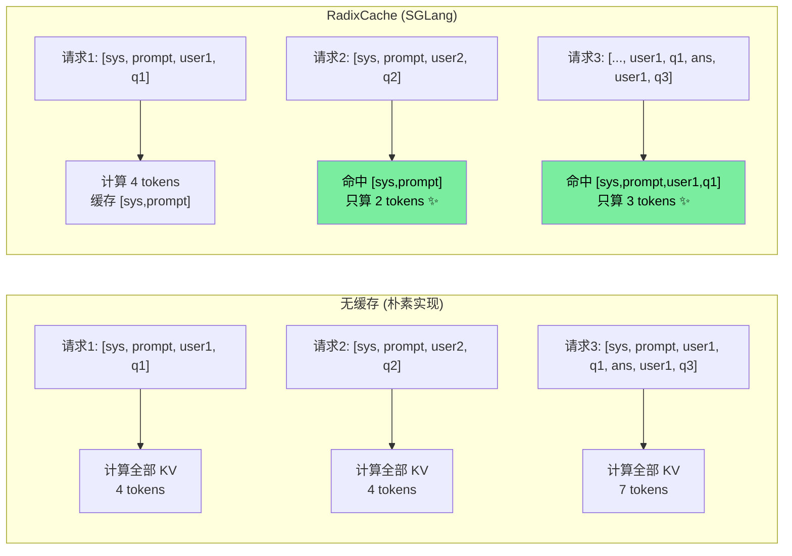
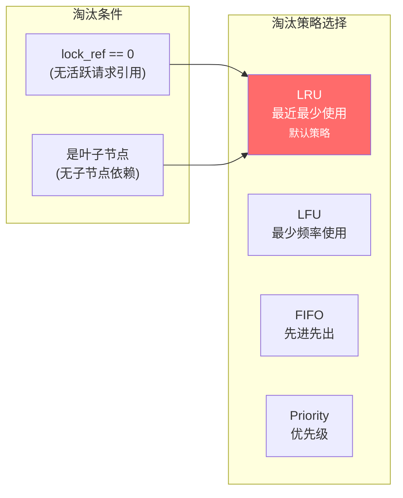
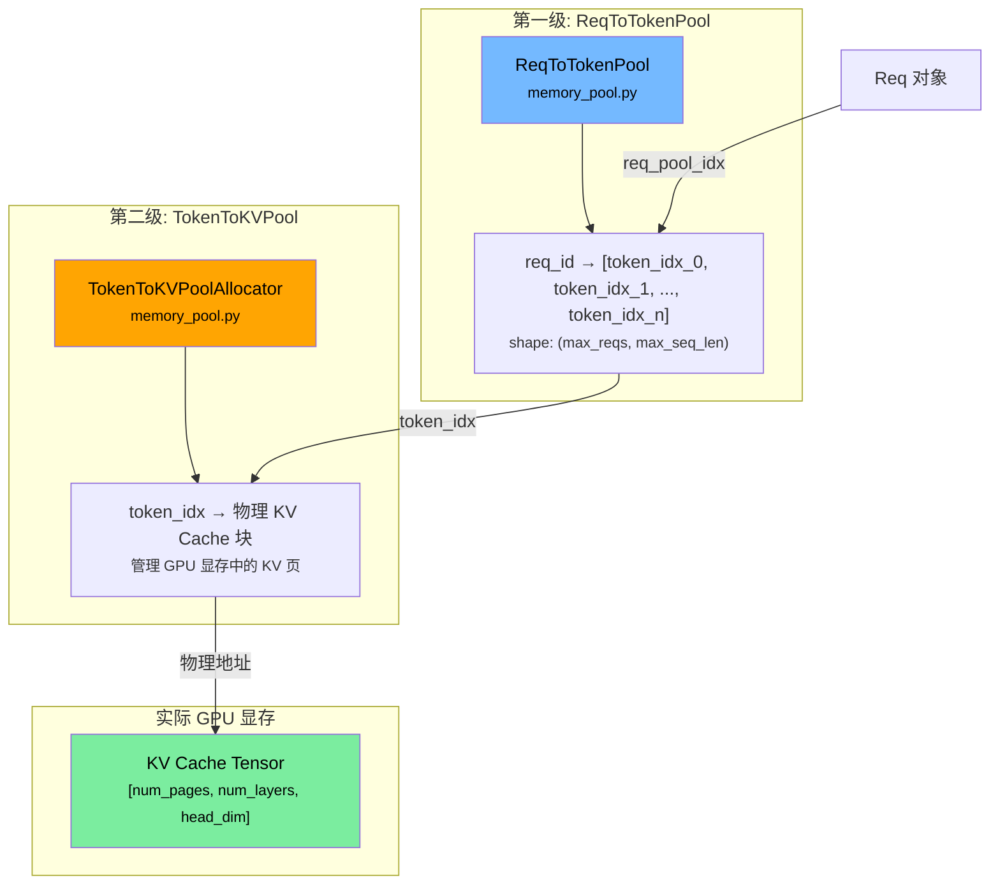
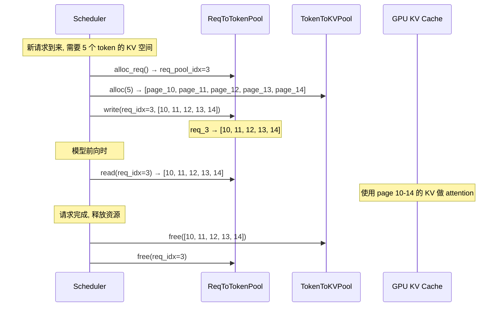
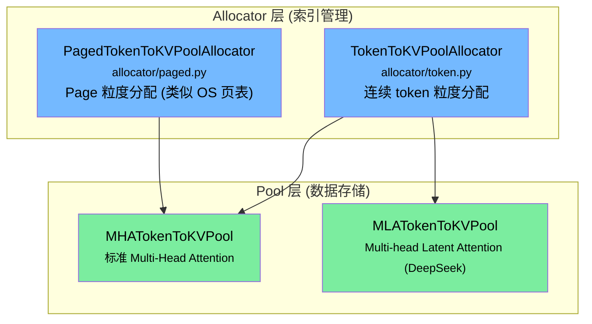
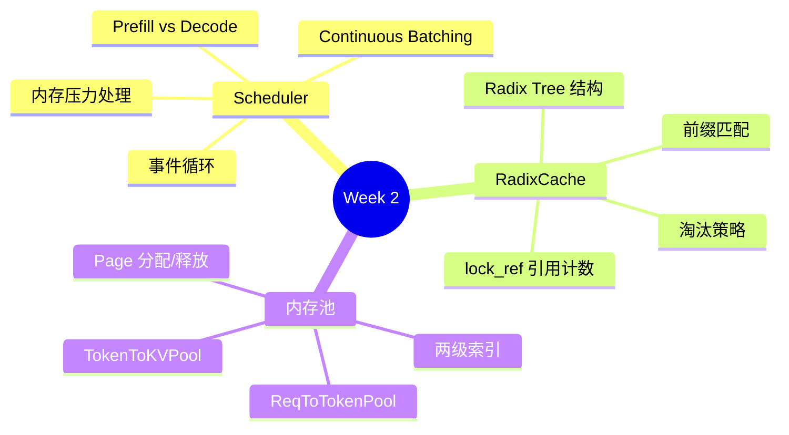

# Week 2: Scheduler 调度器与 RadixCache 前缀缓存

> 目标：深入理解 Scheduler 主循环的调度策略、RadixCache 的前缀树结构和淘汰机制、内存池管理。
> 时间：~10 小时 (5 天 × 2h)
> 前置：[Week 1](../01-architecture/foundations.md) 完成，已了解多进程架构和请求生命周期
>
> **配套资源**: [动手实验 - Scheduler demo](../04-practice/exercises.md#实验-1-scheduler-主循环模拟) | [动手实验 - RadixCache demo](../04-practice/exercises.md#实验-2-radixcache-前缀缓存交互) | [性能直觉: 为什么 Batching 这么重要](../05-reference/performance-intuition.md#三为什么-batching-能拯救-decode) | [FAQ: RadixCache vs KVPool](../05-reference/faq.md#q3-radixcache-vs-tokentokVPool--都叫缓存但完全不同)

> **如果你只会基础 Python**：先看 [Week 2 详细讲义](./week2-detailed.md)。那里用 Mermaid 图拆了 Scheduler、队列状态、RadixCache 和内存池。

---

## Day 1-2: Scheduler 核心循环 (4h)

### 学习目标
- 理解 Scheduler 的事件循环 (`event_loop_normal`)
- 掌握 `get_next_batch_to_run()` 的调度逻辑
- 理解 Prefill (EXTEND) 和 Decode 批次的区别

### Scheduler 事件循环



### 源码阅读指引

**文件**: `python/sglang/srt/managers/scheduler.py`

#### 1. 事件循环入口

> 💡 **初学者提示**: SGLang 有两个事件循环：`event_loop_normal` 和 `event_loop_overlap`。初学只看 `event_loop_normal`（串行模式）。`event_loop_overlap` 是让 CPU 调度和 GPU 计算重叠执行的性能优化，Week 5+ 再了解。

搜索 `def event_loop_normal` (~line 1425)。下面是**实际代码**（带注释）：

```python
def event_loop_normal(self):
    """A normal scheduler loop."""
    while True:  # 永远不停的主循环 —— 这就是 Scheduler 的"心跳"

        # ① 收请求: 从 TokenizerManager 通过 ZMQ 接收新请求
        recv_reqs = self.request_receiver.recv_requests()

        # ② 处理请求: 把收到的原始请求转化为内部的 Req 对象，加入等待队列
        self.process_input_requests(recv_reqs)

        if self._engine_paused:  # 暂停状态下不做推理
            continue

        # ③ 调度决策: 从等待队列和运行中的请求中，选出下一个要执行的 batch
        batch = self.get_next_batch_to_run()
        self.cur_batch = batch

        # ④ 执行: 如果有 batch，就送去 ModelRunner 做前向计算
        if batch:
            result = self.run_batch(batch)
            # ⑤ 处理结果: 检查哪些请求完成了，发送给 Detokenizer
            self.process_batch_result(batch, result)
        else:
            # 没有请求时做一些清理工作
            self.on_idle()

        self.last_batch = batch
```

> 💡 **初学者提示**: 整个 Scheduler 4000 行代码的**灵魂**就是这 20 行。理解了这个循环，你就理解了 SGLang 调度器 80% 的设计思路。其余代码都是细节处理。

注意实际代码中 `self.request_receiver.recv_requests()` 而不是简单的 `self.recv_requests()` —— 这是因为接收功能被拆到了 `scheduler_components/request_receiver.py` 组件中。

#### 2. 调度策略: get_next_batch_to_run
搜索 `def get_next_batch_to_run` (~line 2404) — 这是调度器的核心决策。

> 💡 **初学者提示**: 这个函数实际有 120+ 行，涉及很多边界处理。初学只需理解主路径：先尝试 prefill 新请求，否则继续 decode 已有请求。下面的流程图是简化后的核心决策逻辑。

实际代码的精简主路径：
```python
def get_next_batch_to_run(self):
    # ... 很多边界处理 (先不看) ...

    # 核心决策就两行:
    new_batch = self.get_new_batch_prefill()  # 尝试凑一个 prefill batch

    if new_batch is not None:
        ret = new_batch            # 有新请求要 prefill → 优先做 prefill
    else:
        if not self.running_batch.is_empty():
            ret = self.running_batch   # 没有新请求 → 继续 decode 已有请求
        else:
            ret = None                 # 什么都没有 → 空闲
    return ret
```



#### 3. Prefill vs Decode 的关键区别

> 💡 **初学者提示 — Chunked Prefill 是什么？**
>
> 如果一个 prompt 特别长（比如 10000 tokens），一次全部 prefill 会霸占 GPU 很久。Chunked Prefill 就是把长 prompt 切成小块（chunks），每次只处理一小块，中间穿插其他 decode 请求。这样长 prompt 不会饿死短请求。

| | Prefill (EXTEND) | Decode |
|---|---|---|
| **触发** | 新请求进入 | 已在运行的请求 |
| **输入** | 所有 prompt tokens | 上一步生成的 1 个 token |
| **计算量** | 大 (处理整个 prompt) | 小 (只处理 1 token) |
| **KV Cache** | 写入新的 KV | 读取已有 KV + 写 1 个新 KV |
| **朴素实现对应** | prefill 阶段 | decode 阶段 |

### 动手练习 2.1

```bash
# 找到 Scheduler 类的所有 mixin
grep -rn "class Scheduler" python/sglang/srt/managers/scheduler.py | head -5

# 列出 scheduler 目录下所有 mixin 文件
ls python/sglang/srt/managers/scheduler_*

# 阅读 process_input_requests 的实现
# 理解: 新请求如何转化为 Req 对象
grep -n "def process_input_requests" python/sglang/srt/managers/scheduler.py
```

> 💡 **初学者提示 — Mixin 是什么？**
> 
> 你会看到 `class Scheduler(SchedulerDisaggregationDecodeMixin, SchedulerPPMixin, ...)`，这用到了 Python 的**多继承**。Mixin 就是"功能插件"——每个 Mixin 给 Scheduler 添加一组相关功能（如 PD 分离、Pipeline Parallel 等）。你可以暂时忽略所有 Mixin，只看 Scheduler 类自己的方法。
> ```python
> # 类比: Mixin 就像给手机装 App
> class 手机(相机App, 音乐App, 地图App):
>     def 打电话(self): ...  # 核心功能在这里
> # 你学"打电话"时不需要了解"相机App"怎么实现的
> ```

**思考题**: 当内存不足时，Scheduler 如何决定驱逐哪些缓存？请在代码中找到相关逻辑。

---

## Day 3-4: RadixCache 前缀缓存 (4h)

### 学习目标
- 理解 Radix Tree (基数树) 的数据结构
- 理解前缀匹配如何节省重复计算
- 掌握 LRU/LFU 等淘汰策略

### Radix Tree 是什么？(5 分钟直觉)

**生活类比**: 想象一本通讯录，按姓名的拼音首字母索引：

```
通讯录:
  "张" → "张三", "张伟", "张明"
  "李" → "李四", "李华"

你要找 "张伟" — 先翻到 "张" 那一页，再在里面找 "伟"
你不需要从头到尾翻整本通讯录！
```

RadixCache 做的事一模一样，只是把"姓名拼音"换成了"token 序列"：

```python
# 用 Python dict 理解 Radix Tree 的本质
# (实际实现更复杂，但核心思路一样)

tree = {}
# 插入序列 [1, 2, 3, 4]
tree[(1,2)] = {"kv_cache": "...", "children": {(3,4): {"kv_cache": "..."}}}
# 插入序列 [1, 2, 5, 6]  
# 发现 [1,2] 已经存在！只需要添加 [5,6] 分支

# 查找 [1, 2, 3, 4, 7, 8]
# 沿树匹配: [1,2] ✓ → [3,4] ✓ → [7,8] 没有了
# 命中长度 = 4, 只需计算 [7,8] 这 2 个 token 的 KV
```

**为什么这很有价值？** 在多轮对话中，每次用户发新消息，system prompt + 历史对话都是相同的前缀。有了 RadixCache，这些重复前缀的 KV 计算结果直接复用，省掉大量 GPU 时间。

### RadixCache 核心原理



### 前缀复用的价值



### 源码阅读指引

**文件**: `python/sglang/srt/mem_cache/radix_cache.py`

#### 1. TreeNode 数据结构
```python
class TreeNode:
    key: list          # 此节点存储的 token 序列片段
    value: tensor      # 对应的 KV cache (GPU 内存索引)
    children: dict     # 子节点: {first_token: TreeNode}
    lock_ref: int      # 引用计数 (>0 时不可驱逐)
    last_access_time: float  # 最近访问时间 (LRU)
    hit_count: int     # 命中次数 (LFU)
```

#### 2. 核心方法

**match_prefix()** — 给定 token 序列，在树中找最长匹配前缀:
```python
def match_prefix(self, key: List[int]) -> MatchResult:
    # 从根节点开始
    # 逐层匹配 children
    # 返回: (匹配长度, 最后命中的节点, KV cache 索引)
```

**insert()** — 将新的 token 序列插入树中:
```python
def insert(self, key: List[int], value: tensor):
    # 1. 找到已有前缀的末尾节点
    # 2. 为新的后缀创建新节点
    # 3. 关联 KV cache value
```

**evict()** — 淘汰缓存释放内存:
```python
def evict(self, num_tokens: int):
    # 根据策略 (LRU/LFU) 选择 lock_ref==0 的叶子节点
    # 释放其 KV cache 内存
    # 从树中删除节点
```

#### 3. 淘汰策略



### 动手练习 2.2: 手写简化版 RadixCache

在 `sglang-learning-docs/` 下创建一个 `practice_radix_cache.py`，实现简化版:

```python
"""
练习: 实现简化版 RadixCache

要求:
1. TreeNode 包含 key, value, children, ref_count
2. match_prefix(tokens) -> (hit_len, node)
3. insert(tokens, value)
4. evict_lru() - 淘汰最近最少使用的叶子节点
5. __repr__ 能打印树结构

测试用例:
  cache = SimpleRadixCache()
  cache.insert([1, 2, 3, 4], "kv_1234")
  cache.insert([1, 2, 5, 6], "kv_1256")

  hit_len, _ = cache.match_prefix([1, 2, 3, 4, 7, 8])
  assert hit_len == 4  # 命中 [1,2,3,4]

  hit_len, _ = cache.match_prefix([1, 2, 5])
  assert hit_len == 2  # 命中 [1,2] (公共前缀)

  hit_len, _ = cache.match_prefix([9, 10])
  assert hit_len == 0  # 无命中
"""

class TreeNode:
    def __init__(self):
        self.children = {}  # {token: TreeNode}
        self.key = []
        self.value = None
        self.ref_count = 0
        self.last_access = 0

class SimpleRadixCache:
    def __init__(self):
        self.root = TreeNode()
        self.time = 0

    def match_prefix(self, tokens):
        """返回 (命中长度, 最后命中的节点)"""
        # TODO: 实现
        pass

    def insert(self, tokens, value):
        """插入 token 序列和对应的 value"""
        # TODO: 实现
        pass

    def evict_lru(self):
        """淘汰一个 LRU 叶子节点"""
        # TODO: 实现
        pass

# 实现后，与 SGLang 的 radix_cache.py 对比，思考:
# 1. SGLang 的 RadixKey 为什么还有 extra_key？(提示: LoRA)
# 2. SGLang 如何处理 page_size > 1 的情况？
# 3. lock_ref 的增减时机是什么？
```

---

## Day 5: 内存池管理 (2h)

### 学习目标
- 理解 `ReqToTokenPool` 和 `TokenToKVPool` 的两级索引
- 理解内存分配与回收的流程

### 两级内存池架构



> 💡 **初学者提示**: "两级索引"本质上和操作系统的**虚拟内存/页表**是一个思路。如果你学过操作系统就会觉得很亲切；没学过也没关系，下面用快递柜类比解释。
>
> 想象一个快递柜场景：
> - **第一级 (ReqToTokenPool)**: 一张表记录"张三的包裹在格子 5, 8, 12 号"
> - **第二级 (TokenToKVPool)**: 管理哪些格子空着可以分配，哪些已被占用
> - 张三取完快递后：先释放格子 5, 8, 12 (第二级)，再删除张三的记录 (第一级)

### 为什么需要两级索引？



**关键理解**:
- `ReqToTokenPool`: 请求级别索引，追踪每个请求用了哪些 token 位置
- `TokenToKVPool`: token 级别索引，管理 GPU 上物理 KV Cache 页的分配/释放
- 两级间接寻址使得 KV 页可以**不连续分配**，类似操作系统的页表

### Scheduler 组件化架构

当前 Scheduler 已拆分为 `scheduler_components/` 子目录下的独立组件:

```
python/sglang/srt/managers/scheduler_components/
├── request_receiver.py      # 接收请求
├── output_sender.py         # 发送输出
├── output_streamer.py       # 流式输出
├── batch_result_processor.py # 批次结果处理
├── metrics_reporter.py      # 指标上报
├── ipc_channels.py          # ZMQ 通道管理
├── new_token_ratio_tracker.py # Token 比率追踪
├── pool_stats_observer.py   # 内存池状态观测
├── idle_sleeper.py          # 空闲休眠
├── ...                      # 等 18+ 个组件
```

**设计思想**: 将 4000+ 行的 Scheduler 通过 mixin 和组件拆解，每个组件负责一个独立的职责。阅读时先关注主循环 (`event_loop_normal`)，再按需深入各组件。

### 内存分配器分层

内存管理实际上分为 **Allocator** 和 **Pool** 两层:



### 源码阅读指引

**文件**: `python/sglang/srt/mem_cache/memory_pool.py`

重点关注:
1. `ReqToTokenPool.__init__()` — 初始化请求池
2. `TokenToKVPoolAllocator.alloc()` (在 `allocator/token.py`) — 分配 KV 页
3. `TokenToKVPoolAllocator.free()` — 释放 KV 页
4. 搜索 `available_size()` — 如何判断内存是否够用

**文件**: `python/sglang/srt/mem_cache/allocator/`
- `base.py` — 分配器抽象基类 `BaseTokenToKVPoolAllocator`
- `token.py` — 连续 token 级别分配
- `paged.py` — Page 级别分配 (减少碎片)

### 动手练习 2.3

```bash
# 找到内存分配在 scheduler 中的调用点
grep -n "alloc" python/sglang/srt/managers/scheduler.py | grep -i "token\|cache\|mem" | head -20

# 找到内存释放的调用点
grep -n "free" python/sglang/srt/managers/scheduler.py | grep -i "token\|cache\|mem" | head -20

# 思考: 什么时候分配？什么时候释放？
```

---

## Week 2 自查清单

- [ ] Scheduler 的 `event_loop_normal()` 每次循环做了哪几步？
- [ ] `get_next_batch_to_run()` 如何区分 prefill 和 decode 请求？
- [ ] RadixCache 是什么数据结构？解决了什么问题？
- [ ] `match_prefix()` 的时间复杂度是多少？
- [ ] TreeNode 的 `lock_ref` 是什么意思？什么时候增加/减少？
- [ ] 为什么需要两级内存池 (ReqToToken + TokenToKV)？
- [ ] 当内存不足时，Scheduler 的处理策略是什么？
- [ ] 对比朴素实现: 最简单的 KV Cache 管理（如一个大数组直接索引）与 SGLang 的两级内存池有何不同？

### 本周核心收获


