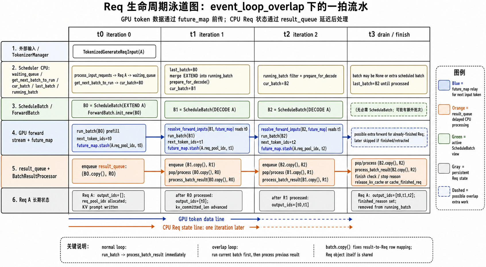
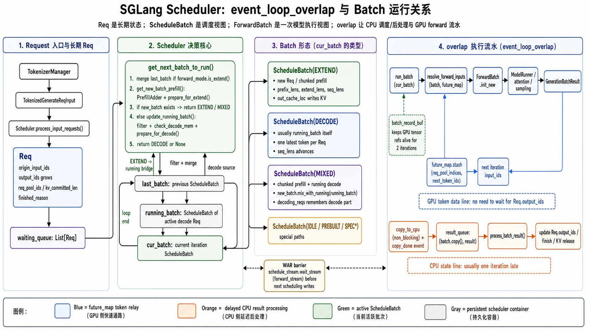
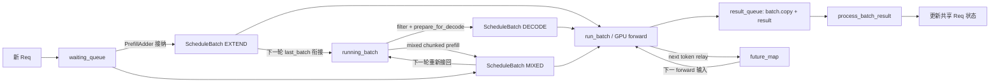

# Scheduler 与 Batch 生命周期

> 本篇关注调度控制面：Scheduler 每轮如何选择和执行 batch，以及
> `waiting_queue`、`cur_batch`、`last_batch`、`running_batch`、`result_queue`
> 如何在 normal/overlap 两种主循环中配合。
>
> 上级索引：[Req 到 ScheduleBatch：状态流转导读](./request-batch-state-flow.md)

## 先建立三个层次

阅读 Scheduler 时，最容易混淆的是把请求、batch 对象和一次 forward
当成同一件事。它们实际上处于不同层次：

1. `Req` 是请求的长期状态，记录输入、`output_ids`、完成原因、KV
   位置等。一个 `Req` 会跨越多次 forward。
2. `ScheduleBatch` 是某一次或某一阶段的调度视图，包含一组 `Req`
   以及本次 forward 需要的批量 tensor。
3. `GenerationBatchResult` / `EmbeddingBatchResult` 是一次 forward 的结果。
   overlap 模式会把结果延迟到下一轮 CPU 后处理。

因此，“同一个请求”会先后出现在多个 batch 视图中；而
`running_batch` 也会反复原地过滤、合并和重新准备，不能把它理解成一份
不可变的 forward 记录。

### `ScheduleBatch` 与 `ForwardBatch`

Scheduler 操作的主要是 `ScheduleBatch`。进入 model worker 后，执行层会通过
`ForwardBatch.init_new(schedule_batch, ...)` 构造更贴近模型执行的
`ForwardBatch`，交给 ModelRunner、attention backend 和 logits processor。

```text
Req 集合与调度状态
  -> ScheduleBatch（Scheduler 选择、合并、分配 KV）
  -> ForwardBatch（一次模型执行的参数视图）
  -> GenerationBatchResult / EmbeddingBatchResult
  -> BatchResultProcessor 更新 Req
```

`ForwardBatch` 不是 `running_batch` 的另一种名字，它通常只服务于一次模型
执行；本文后续未特别注明时，“batch”均指 `ScheduleBatch`。

### 常见 `ForwardMode`

| mode | 含义 | 通常从哪里来 | 结果走哪类处理路径 |
|---|---|---|---|
| `EXTEND` | prompt/prefix 后继续扩展，也就是常说的 prefill | 新请求或 chunked prefill | prefill |
| `DECODE` | 已有历史 KV，继续生成 | `running_batch.prepare_for_decode()` | decode |
| `MIXED` | 同一次 forward 同时包含 extend 和 decode 请求 | `new_batch.mix_with_running()` | extend/prefill |
| `IDLE` | DP 等场景中本 rank 无实际序列 | adapter 构造的空工作 | idle |
| `TARGET_VERIFY` / `DRAFT_EXTEND*` | speculative decoding 的验证/草稿阶段 | speculative worker | 按 `is_extend/is_decode` 和专用逻辑分派 |
| `PREBUILT` | disaggregated decode 中 KV 已准备好的过渡 batch | disaggregation 路径 | prebuilt |

源码中的 `forward_mode.is_extend()` 不只匹配字面上的 `EXTEND`，还包括
`MIXED`、部分 speculative mode、`SPLIT_PREFILL` 和 `DLLM_EXTEND`。因此
`last_batch` 的“EXTEND -> running”衔接实际覆盖的是这一组 extend-like batch。

## 核心对象和容器

| 名称 | 保存什么 | 主要作用 | 是否长期存在 |
|---|---|---|---|
| `waiting_queue` | `List[Req]` | 尚未获准执行本轮 prefill 的请求 | 请求被接纳前 |
| `chunked_req` | 一个分块 prefill 的 `Req` | 记录尚未完成全部 prompt 的请求 | 跨多个 EXTEND forward |
| `running_batch` | `ScheduleBatch` | 已有可用 KV、仍需继续 decode 的请求集合 | 跨多个 iteration |
| `cur_batch` | `Optional[ScheduleBatch]` | 本轮选中并将交给 `run_batch()` 的 batch | 当前 iteration |
| `last_batch` | `Optional[ScheduleBatch]` | 上轮选中的 batch，供本轮调度衔接 | 相邻两个 iteration |
| `result_queue` | `(batch.copy(), result)` 的队列 | overlap 下保存尚未 CPU 后处理的 forward 结果 | 通常落后一轮 |
| `batch_record_buf` | batch 及其字段引用的双缓冲 | overlap 下保证跨 stream GPU tensor 的生命周期 | 两个 ring slot |

这些名字不代表互斥所有权。例如纯 decode 时经常有：

```python
cur_batch is running_batch
last_batch is running_batch
```

在相邻轮次中，三个名字甚至可能同时指向同一个、已经被
`prepare_for_decode()` 原地更新过的 `ScheduleBatch`。

## Scheduler 主循环与调度颗粒度

一次 Scheduler iteration 对应一次 batch 选择和至多一次 model forward。普通
自回归 decode 中，这次 forward 通常让 batch 内每个请求推进一个 token；一个
请求会跨越多轮 iteration。

### `get_next_batch_to_run()` 的真实顺序

主流程可以压缩为：

```text
1. 根据 last_batch 完成 EXTEND -> running 的结构衔接
2. 尝试从 waiting_queue 构造 new_batch，并 prepare_for_extend()
3. 若 new_batch 存在，优先返回它
4. 否则过滤 running_batch、检查 decode KV 空间并 prepare_for_decode()
5. 返回 running_batch，或在没有工作时返回 None
```

更接近源码的伪代码如下：

```python
if last_batch and last_batch.forward_mode.is_extend():
    last_batch.filter_batch(chunked_req_to_exclude=...)
    if not last_batch.is_empty():
        if running_batch.is_empty():
            running_batch = last_batch
        else:
            running_batch.merge_batch(last_batch)

new_batch = get_new_batch_prefill()

if new_batch is not None:
    return new_batch                 # prefill 优先

if running_batch can decode:
    running_batch = update_running_batch(running_batch)
    # filter -> check_decode_mem/retract -> prepare_for_decode
    return running_batch

return None
```

这里有两个重要结论：

- `last_batch` 主要是 EXTEND 到 running 的桥。DECODE 不需要再次合入
  `running_batch`，因为它通常本来就是同一个对象。
- “进入 running”不等于“复制出一个新的 batch”。当原
  `running_batch` 为空时，源码直接执行 `running_batch = last_batch`；否则
  才调用 `merge_batch()` 原地合并。

### Prefill batch 如何产生

`get_new_batch_prefill()` 使用 `PrefillAdder` 在 token、KV、请求数、LoRA
等约束下从 `waiting_queue` 选择 `can_run_list`，然后：

```text
can_run_list
  -> ScheduleBatch.init_new(...)
  -> prepare_for_extend()
  -> ScheduleBatch(EXTEND)
```

`prepare_for_extend()` 会计算 `prefix_lens`、`extend_lens`、`seq_lens`，分配
req pool/KV slots，并准备本轮 prompt token。此时 batch 是本次 prefill
forward 的执行视图，还不是长期 decode 集合。

### Decode batch 如何产生

当没有新 prefill batch 可运行时，`update_running_batch()` 会：

1. `filter_batch()` 删除完成或已 retract 的请求；
2. `check_decode_mem()`，空间不足时 retract 一部分请求回 waiting；
3. `prepare_for_decode()`，把 batch 切换为 `ForwardMode.DECODE` 并准备下一步。

这个过程通常直接修改 `running_batch` 本身，再把同一对象作为
`cur_batch` 返回。

## CPU / GPU 泳道图

normal 和 overlap 都由 CPU Scheduler 提交 GPU 工作，差别在于 CPU 在什么时刻
消费结果。normal 在本轮提交后立即处理本轮结果；overlap 先提交下一轮工作，
再处理上一轮结果。后续两节分别展开这两种时序。

## normal 主循环

`event_loop_normal()` 的稳定骨架是：

```python
while True:
    recv_reqs = request_receiver.recv_requests()
    process_input_requests(recv_reqs)

    batch = get_next_batch_to_run()
    cur_batch = batch

    if batch:
        result = run_batch(batch)
        process_batch_result(batch, result)
    else:
        on_idle()

    last_batch = batch
```

一次 iteration 对应一次 batch 选择和至多一次 model forward。普通自回归
decode 中，一次 forward 通常让 batch 中每个请求产生一个 token，一个请求
会跨越多轮 iteration。

normal 模式的关键性质是：本轮结果在设置 `last_batch`、进入下一轮调度前
已经完成 CPU 后处理。因此下一轮看到的 `Req.output_ids`、finish state 和
grammar state 都是最新的。

### normal 示例：单请求生成 3 个 token

假设 A 的 prompt 为 `[p0..p4]`，最终生成 `[t0,t1,t2]`：

```text
iteration 0
  waiting_queue=[A]
  new EXTEND(A) -> run -> process result(t0)
  A.output_ids=[t0]
  last_batch=EXTEND(A)

iteration 1
  get_next: EXTEND(A) 成为 running_batch
  running_batch.prepare_for_decode()
  cur_batch is running_batch -> run -> process result(t1)
  A.output_ids=[t0,t1]
  last_batch is running_batch

iteration 2
  get_next: filter + prepare running_batch
  run -> process result(t2) -> A finished，释放/缓存 KV
  A.output_ids=[t0,t1,t2]

iteration 3
  get_next: running_batch.filter_batch() 删除 A
  batch=None -> on_idle()
```

注意 EXTEND forward 不只是写 prompt KV，通常还会给出第一个输出 token
`t0`；第一次 DECODE forward 的输入是这个 `t0`。

## overlap 主循环：逐行理解

`event_loop_overlap()` 的目标是让 CPU 调度/结果处理和 GPU forward 重叠。
核心代码可以简化为：

```python
result_queue = deque()

while True:
    process_input_requests(recv_requests())

    if war_barrier_enabled:
        schedule_stream.wait_stream(forward_stream)

    batch = get_next_batch_to_run()
    cur_batch = batch
    disable_overlap = is_disable_overlap_for_batch(batch)

    if disable_overlap:
        pop_and_process()  # 先处理上一轮

    if batch:
        result = run_batch(batch)
        result_queue.append((batch.copy(), result))
    else:
        result = None

    if last_batch:
        if not disable_overlap:
            pop_and_process()  # 正常路径在本轮 launch 后处理上一轮
    elif batch is None:
        on_idle()

    launch_batch_sample_if_needed(result)
    last_batch = batch
```

### 稳态时每一轮发生什么

设 `B0`、`B1`、`B2` 是连续三次 forward 的 batch：

| iteration | `get_next` 返回 | `run_batch` 后队列 | 本轮处理 | 轮末队列 | `last_batch` |
|---|---|---|---|---|---|
| 0（预热） | `B0` | `[R0]` | 无 | `[R0]` | `B0` |
| 1 | `B1` | `[R0,R1]` | `R0` | `[R1]` | `B1` |
| 2 | `B2` | `[R1,R2]` | `R1` | `[R2]` | `B2` |
| 3（无新 batch） | `None` | `[R2]` | `R2` | `[]` | `None` |
| 4（完全 idle） | `None` | `[]` | 无，`on_idle()` | `[]` | `None` |

其中 `Rn` 实际保存的是：

```python
(Bn.copy(), result_of_Bn)
```

所以 steady state 下 `result_queue` 通常在轮末保留一个尚未处理的结果。它是
“一拍延迟”的 CPU 后处理队列，不是跨进程队列。

### overlap 与 normal 最关键的时序差异

在 overlap iteration 1 中，顺序是：

```text
get_next_batch_to_run() 使用 last_batch=B0 构造/更新 B1
run_batch(B1) 提交下一次 GPU 工作
process_batch_result(B0.copy(), R0) 才更新 B0 中 Req 的 CPU 状态
```

也就是说，下一轮调度允许发生在上一轮 `Req.output_ids.append()` 和 finish
检查之前。这就是源码中多处 overlap 特判的来源：

- 结果处理器可能发现某个请求已经完成/retract，于是跳过流水线中为它多准备
  的结果；
- 某些 slot 在前一轮后处理完成前不能立即复用；
- `mix_with_running()` 计算长度时，overlap 和 normal 使用不同的 `delta`；
- grammar 或其他必须依赖 CPU 状态的路径可能主动关闭当前重叠。

但下一次 GPU forward 又必须得到上一轮采样出的 token。这个数据依赖不是靠
等待 `Req.output_ids` 更新解决，而是通过 `future_map` 在 GPU 路径中转发：

```text
forward B0 产生 next_token_ids
  -> future_map.stash(req_pool_indices, next_token_ids)
  -> B1 forward 入口 resolve_forward_inputs(...)
  -> 得到 B1 实际 input_ids
```

因此要同时记住两条时间线：

```text
GPU token 数据线：B0 result -> future_map -> B1 input（不等 CPU list）
CPU 请求状态线： B0 result -> result_queue -> 下一 iteration 后处理 Req
```

### overlap 示例：单请求 A

仍假设 A 生成 `t0,t1,t2`：

```text
iteration 0
  get_next -> B0=EXTEND(A)
  run B0，GPU 产生 t0；t0 stash 到 future_map
  enqueue (B0.copy(), R0)
  A.output_ids 仍为 []

iteration 1
  get_next 先把 last_batch=B0 衔接到 running_batch
  prepare DECODE；forward 入口从 future_map 取得 t0
  run B1=DECODE(A)，产生 t1，并 enqueue R1
  pop/process R0：此时 A.output_ids 才变为 [t0]

iteration 2
  get_next 基于 running_batch 准备下一次 DECODE
  forward 入口取得 t1，run B2，产生 t2，并 enqueue R2
  pop/process R1：A.output_ids 变为 [t0,t1]

iteration 3
  流水线可能已经为 A 准备了下一步，再处理 R2
  process R2 后 A.output_ids=[t0,t1,t2]，finish state 生效
  已经在流水线中多出的工作由 overlap 的 finished/retracted 检查丢弃，
  相应 KV 在完成清理路径释放
```

最后一段说明了 overlap 的典型代价：为了不让 CPU 后处理阻断 GPU，可能对
刚完成的请求多推进一拍。实际是否多 launch 一次还受 batch 组合、停止条件、
speculative decoding 等路径影响。



## `last_batch` 的过渡作用

`last_batch` 把上轮实际执行的 batch 暴露给下一轮调度。最重要的用途是把
extend-like batch 过滤后接入 `running_batch`；overlap 下它还表示结果流水线的
前一拍，但真正不可随原 batch 一起修改的结果映射由队列中的 `batch.copy()`
承担。

### `cur_batch`、`last_batch`、`running_batch` 与队列副本的关系

### 纯 EXTEND 后转 DECODE

原 `running_batch` 为空时：

```text
iteration N:
  batch = EXTEND(A,B)
  cur_batch = batch
  enqueue batch.copy()
  last_batch = batch

iteration N+1 / get_next:
  running_batch = last_batch      # 不是深拷贝
  running_batch.prepare_for_decode()
  cur_batch = running_batch
```

此时队列中的 `batch.copy()` 保留 N 轮结果处理需要的 `forward_mode`、请求顺序
和相关字段；原 batch 对象则可以安全地被改成 DECODE 视图。

### 纯 DECODE

```text
running_batch --filter/prepare_for_decode--> cur_batch
       ^                                      |
       +--------------- last_batch -----------+
```

通常三个引用指向同一个 `ScheduleBatch`。每次 forward 入队的副本才是对应
那次结果的稳定视图。

### 已有 running，同时插入新 prefill

假设 A 正在 decode，新请求 B 到达：

```text
开始：running_batch=DECODE(A), waiting_queue=[B]

iteration N:
  get_new_batch_prefill -> EXTEND(B)
  cur_batch=EXTEND(B)
  running_batch 仍保存 A，本轮普通模式下 A 暂停一次 decode

iteration N+1:
  get_next 先把 last_batch 中完成 prefill 的 B 合入 running_batch
  running_batch=DECODE(A,B)
  若没有新的 prefill，则 prepare_for_decode 后共同执行
```

“prefill 优先”指本轮返回新 EXTEND batch，并不意味着旧 `running_batch`
消失。

## MIXED batch：prefill 与 decode 同一次 forward

启用 mixed chunked prefill 且满足限制时，新 EXTEND batch 会调用：

```python
running_batch.prepare_for_decode()
new_batch.mix_with_running(running_batch)
new_batch.decoding_reqs = running_batch.reqs
running_batch = ScheduleBatch(reqs=[])
```

例如 A、B 正在 decode，C 做一段 chunked prefill：

```text
new_batch 初始:       EXTEND(C)
旧 running_batch:     DECODE(A,B)
mix 后 cur_batch:     MIXED(C,A,B)
decoding_reqs:        [A,B]
新的 running_batch:   empty placeholder
```

`mix_with_running()` 会合并请求和批量 tensor，同时记录哪些请求来自 decode
部分。`ForwardMode.MIXED` 属于 extend 类结果处理路径；`decoding_reqs` 用来避免
把 A、B 当成普通 prefill 请求做错误的 prefix cache 操作。

下一轮 `get_next_batch_to_run()` 会把这个 MIXED/extend batch 经
`last_batch` 过滤后重新放回 `running_batch`。因此这里是“把旧 running 的
内容搬进本次 mixed batch，再由 last_batch 接回”，不是丢失正在生成的请求。

## `batch.copy()` 到底复制了什么

`ScheduleBatch.copy()` 的注释明确限定了目标：只保留
`process_batch_result()` 会使用的字段。它具有以下语义：

- 新建一个 `ScheduleBatch` 外壳；
- `reqs=self.reqs[:]`，复制 list 容器，固定该次 forward 的请求顺序和成员；
- list 中的每个 `Req` 仍是共享对象，结果处理正是要更新这些长期请求状态；
- `req_pool_indices`、`out_cache_loc`、`spec_info` 等字段大多只是引用传递；
- 它不是 `copy.deepcopy()`，也不会复制一套 GPU tensor/storage。

这个 copy 发生在 `run_batch(batch)` 返回之后。因此它记录的是该次 forward
结束时、供结果处理使用的 batch 视图；它不是 forward 之前全部字段的快照。
需要保存完整 pre-forward/forward 中 tensor 引用的任务由后面介绍的
`batch_record_buf` 承担。

为什么至少要复制 `reqs` list？假设不复制：

```text
B0 forward 的请求顺序: [A,B]
下一轮原 batch.filter_batch()/merge_batch() 后: [B,C]
R0 返回的 next_token_ids 仍对应 [A,B]
```

若结果处理器读取被原地修改的 list，就会把 token 对错请求。浅拷贝 list
把本次 forward 的映射固定为 `[A,B]`，同时仍允许处理器更新真实的 A、B。

## forward 结果与 GPU 对象生命周期

overlap generation 路径会在 forward stream 上调用：

```python
batch_result.copy_done = Event()
batch_result.copy_to_cpu(...)
result_queue.append((batch.copy(), batch_result))
```

`copy_to_cpu()` 对后处理需要的 tensor 发起 non-blocking D2H，并把结果对象中
相应字段替换为 CPU tensor，最后记录 `copy_done` event。结果处理器消费时先：

```python
result.copy_done.synchronize()
```

所以应把生命周期理解为：

```text
GPU result tensor
  -> forward stream 上提交 D2H
  -> result 字段改指 CPU tensor
  -> copy_done.record()
  -> 下一轮 result processor synchronize()
  -> CPU 读取并更新 Req
```

原 GPU tensor 的普通 Python 引用可以在 D2H 提交后解除；PyTorch allocator
负责遵守 stream 上尚未完成的使用。但不能据此提前清空整个 `batch_result`：
队列仍需要 CPU tensor、event 和其他元数据，部分路径还可能保留
`delay_sample_func`、`next_draft_input`、`extra_keep_alive_refs` 等 GPU 相关引用。

延迟采样完成后，源码会主动清除 `delay_sample_func`，并把
`logits_output.next_token_logits` 置空，正是为了避免 closure 和大 tensor
通过 `result_queue`/`batch_record_buf` 多存活一轮。

### 为什么还有 `batch_record_buf`

只保留 `batch.copy()` 不能解决所有 GPU 生命周期问题，因为它只覆盖结果处理
所需字段，而且 batch 本体下一轮会被原地改写。`record_batch_in_overlap()` 会对
dataclass 全字段做引用快照，并在双缓冲 `batch_record_buf` 中固定两个 iteration：

```text
batch.copy()       服务于“结果属于哪次 forward、对应哪些 Req”
batch_record_buf   服务于“forward stream 尚在读取的 tensor 不被 GC/复用”
```

这两个结构解决的问题不同，不能互相替代。

## stream、事件和 WAR barrier

overlap 路径至少涉及调度侧和 forward 侧两个 stream。典型依赖是：

- forward stream 等待 schedule stream 已准备好的输入；
- 某些配置下，下一轮 schedule stream 写共享 GPU buffer 前，通过
  `schedule_stream.wait_stream(forward_stream)` 避免覆盖上一轮 forward 尚在读的
  数据，即 WAR（write-after-read）保护；
- D2H 完成由 `copy_done` event 精确同步，CPU 不需要在 launch 后立刻做全设备
  synchronize。

因此 overlap 不是“完全没有同步”，而是把同步缩小到真实的数据依赖处。

## 哪些情况会临时关闭 overlap

`is_disable_overlap_for_batch()` 当前主要覆盖：

- 配置要求连续两个 prefill 不重叠：先处理第一个 prefill 的结果，以改善它的
  TTFT；
- spec v2 + grammar decode 等必须同步 CPU grammar 状态的组合。

关闭当前轮 overlap 时，顺序变成：

```text
get_next current batch
pop/process previous result
run current batch and enqueue current result
```

轮末不会再次 pop，所以当前结果仍留给下一轮。它只是切断“上一轮结果处理”和
“当前轮 forward”之间的重叠，并没有切换到另一套主循环。

## 空闲、暂停和队列排空

在 overlap 模式下，`batch is None` 不一定代表完全空闲：队列中可能还有上一轮
结果。只有上一轮也没有 batch 时才直接 `on_idle()`。常见排空过程是：

```text
最后一个有效 iteration: enqueue Rn, last_batch=Bn
下一 iteration: batch=None, process Rn, last_batch=None
再下一 iteration: batch=None, result_queue 为空, on_idle()
```

暂停/恢复还需要保留或显式 drain `result_queue`，不能只观察
`running_batch`/`waiting_queue` 判断所有工作已经完成。

## 常见误解

### `last_batch` 是上一轮不可变快照

不是。它通常指向上一轮使用的可变 `ScheduleBatch`，下一轮可能成为
`running_batch` 并被原地修改。不可变程度更高的结果映射视图是队列中的
`batch.copy()`。

### `batch.copy()` 复制了 GPU 结果

不是。GPU forward 结果在 `batch_result` 中；`batch.copy()` 主要固定调度元数据
和 `Req` 顺序，而且是浅拷贝。

### overlap 下一轮必须等 CPU 把 token 写入 `Req.output_ids`

不是。GPU 输入通过 `future_map` relay；`Req.output_ids` 的 CPU 更新允许晚一轮。

### 一个请求只属于一个 batch

不是。`Req` 是共享的长期对象，可以从 waiting 进入 EXTEND，再进入 running，
也可以临时进入 MIXED batch；不同 batch/snapshot 可以同时引用同一个 `Req`。

## 一张总览图





normal 模式可以把图中的 `result_queue` 理解为长度为零的同步路径：forward
返回后立即处理结果。overlap 模式则让结果处理稳定落后一拍，同时用
`future_map` 保持 GPU token 数据链连续。

## 源码阅读地图

| 主题 | 文件 / 函数 |
|---|---|
| 状态初始化 | `scheduler.py:init_running_status` |
| normal 主循环 | `scheduler.py:event_loop_normal` |
| overlap 主循环 | `scheduler.py:event_loop_overlap` |
| overlap 临时关闭判断 | `scheduler.py:is_disable_overlap_for_batch` |
| 选择下一批 | `scheduler.py:get_next_batch_to_run` |
| 构造 prefill batch | `scheduler.py:get_new_batch_prefill` |
| 更新 decode batch | `scheduler.py:update_running_batch` |
| 执行 batch / D2H | `scheduler.py:run_batch` |
| 延迟采样 | `scheduler.py:launch_batch_sample_if_needed` |
| 处理结果 | `scheduler.py:process_batch_result` |
| batch 浅拷贝 | `schedule_batch.py:ScheduleBatch.copy` |
| EXTEND 准备 | `schedule_batch.py:ScheduleBatch.prepare_for_extend` |
| DECODE 准备 | `schedule_batch.py:ScheduleBatch.prepare_for_decode` |
| MIXED 合并 | `schedule_batch.py:ScheduleBatch.mix_with_running` |
| D2H 和 copy event | `managers/utils.py:GenerationBatchResult.copy_to_cpu` |
| token relay | `managers/overlap_utils.py:FutureMap`、`resolve_forward_inputs` |

下一篇：[Prefill Batch 与 KV 分配](./prefill-batch-and-kv.md)
