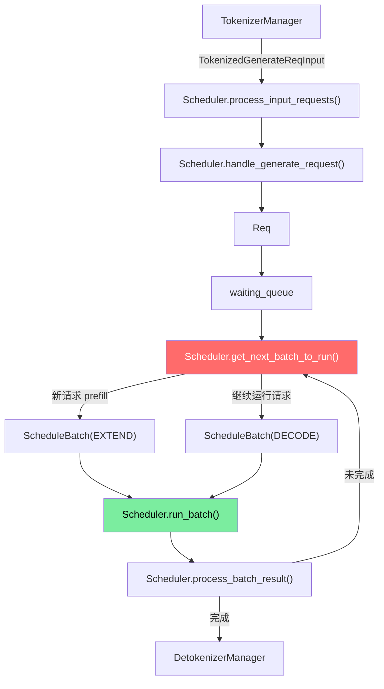
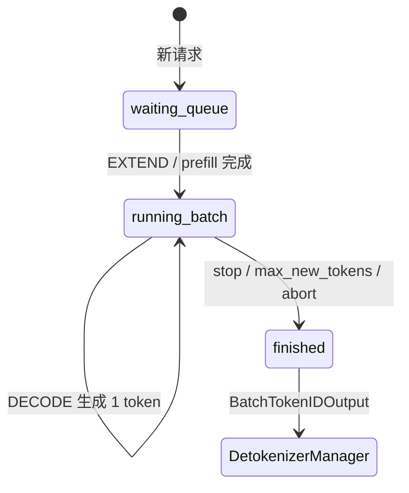
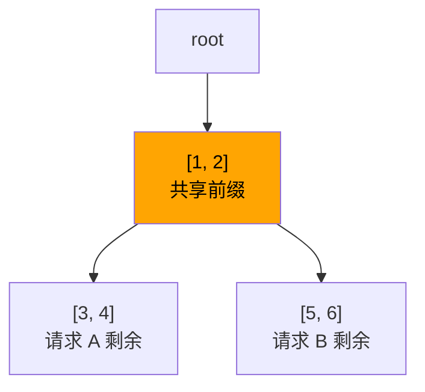
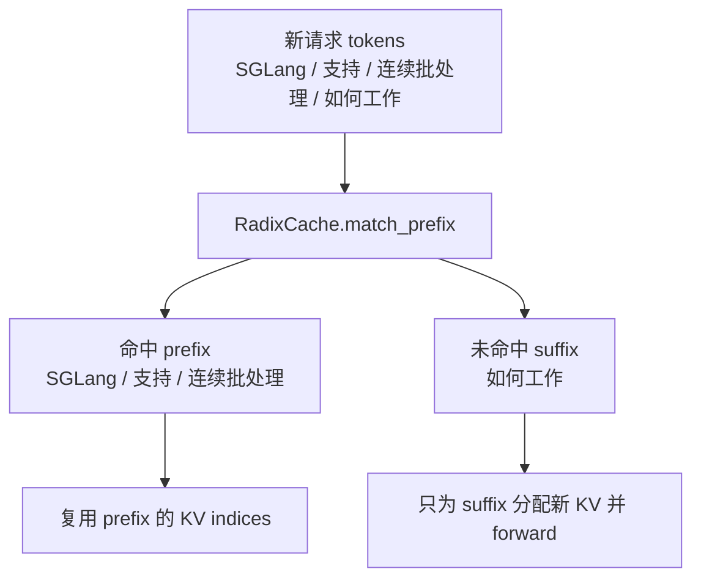
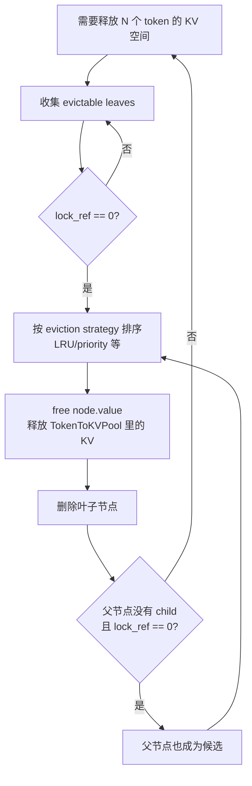
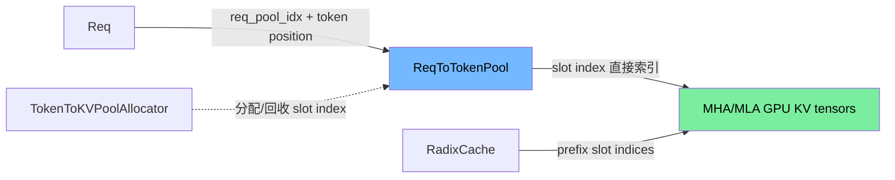
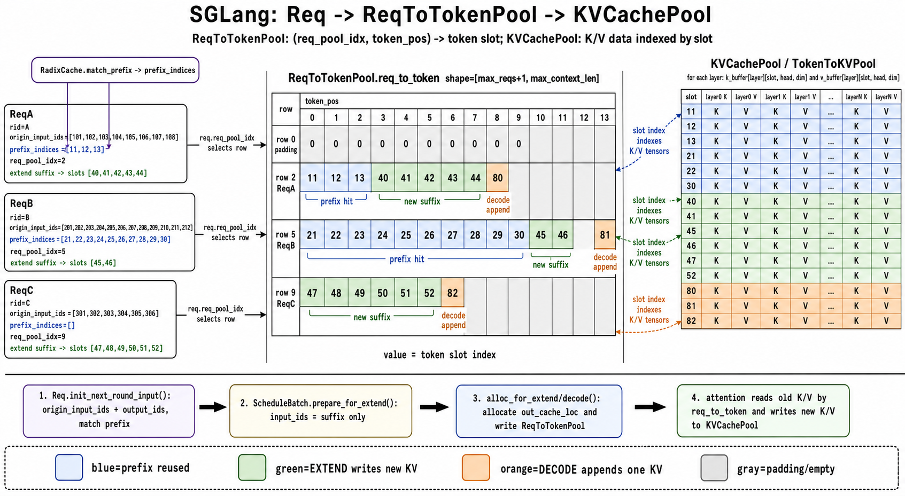

# Week 2 详细讲义：Scheduler 和 RadixCache

> 目标：把“请求怎么排队、怎么成 batch、怎么复用 KV Cache”讲清楚。只会基础 Python 也能按步骤读。

## 一句话结论

| 问题 | 答案 |
|---|---|
| Scheduler 是什么？ | 一个无限循环：收请求、入队、选 batch、执行、处理结果。 |
| `waiting_queue` 是什么？ | 新请求排队区，还没完成 prefill。 |
| `running_batch` 是什么？ | 已经 prefill 完，正在 decode 的请求集合。 |
| RadixCache 是什么？ | 用 token 前缀树复用历史 KV Cache，避免重复算 prompt。 |
| 内存池管什么？ | 管 KV Cache 的物理位置，不管“文本内容”。 |

## 1. 本周只看这条主线



## 2. Day-by-Day

| 天 | 目标 | 只读这些 | 验收 |
|---|---|---|---|
| Day 1 | 看懂 Scheduler 心跳 | `scheduler.py:event_loop_normal` | 能默写 `recv -> process -> schedule -> run -> result` |
| Day 2 | 看懂请求入队 | `process_input_requests`, `handle_generate_request`, `Req` | 能说清 `TokenizedGenerateReqInput -> Req -> waiting_queue` |
| Day 3 | 看懂 batch 选择 | `get_next_batch_to_run`, `ScheduleBatch` | 能区分 EXTEND/DECODE |
| Day 4 | 看懂 RadixCache | `radix_cache.py:match_prefix`, `insert`, `evict` | 能手画一棵 token 前缀树 |
| Day 5 | 看懂内存池关系 | `memory_pool.py`, `schedule_batch.py` 字段 | 能区分“逻辑请求”和“KV 物理槽位” |

## 3. 最小数据结构

| 名字                          | 文件                                     | 你先理解成                                     |
| --------------------------- | -------------------------------------- | ----------------------------------------- |
| `TokenizedGenerateReqInput` | `managers/io_struct.py`                | Tokenizer 发来的“已转 token 请求”                |
| `Req`                       | `managers/schedule_batch.py`           | Scheduler 内部的单个请求状态                       |
| `ScheduleBatch`             | `managers/schedule_batch.py`           | 一批要执行的 `Req`                              |
| `ForwardMode`               | `model_executor/forward_batch_info.py` | 本轮是 prefill 还是 decode                     |
| `RadixCache`                | `mem_cache/radix_cache.py`             | token 前缀 -> KV Cache 位置                   |
| `TokenToKVPool`             | `mem_cache/memory_pool.py`             | token index -> 真实 KV 存储                   |
| `ReqToTokenPool`            | `mem_cache/memory_pool.py`             | req index + token position -> token index |

## 4. Scheduler 心跳

源码：`python/sglang/srt/managers/scheduler.py:event_loop_normal()`

```text
while True:
  1. recv_requests()
  2. process_input_requests()
  3. get_next_batch_to_run()
  4. run_batch()
  5. process_batch_result()
```

| 步骤 | 大白话 | 结果 |
|---|---|---|
| `recv_requests` | 从 ZMQ 收包 | 得到外部消息 |
| `process_input_requests` | 按消息类型分发 | 新请求变 `Req` |
| `get_next_batch_to_run` | 决定下一轮算谁 | 得到 `ScheduleBatch` |
| `run_batch` | 调模型执行 | 得到 next token/logprob |
| `process_batch_result` | 更新请求状态 | 完成就输出，没完成继续 decode |

## 5. 请求状态变化



| 状态 | 表示 |
|---|---|
| waiting | prompt 还没完整处理 |
| running | prompt 已处理，正在逐 token 生成 |
| finished | 命中 stop、长度上限、abort 等结束条件 |

## 6. EXTEND 和 DECODE

| 对比         | EXTEND / Prefill           | DECODE                     |
| ---------- | -------------------------- | -------------------------- |
| 谁触发        | 新请求                        | 已运行请求                      |
| 输入 token 数 | prompt 多个 token            | 通常 1 个 token               |
| KV Cache   | 大量写入                       | 读历史 + 追加新 token            |
| 延迟影响       | 影响 TTFT                    | 影响 ITL/TPS                 |
| 代码判断       | `forward_mode.is_extend()` | `forward_mode.is_decode()` |

```text
prompt = [10, 20, 30]

EXTEND:
  输入 [10, 20, 30]
  写 KV for 10/20/30
  采样得到 40

DECODE:
  输入 [40]
  读 KV for 10/20/30
  写 KV for 40
  采样得到 50
```

## 7. RadixCache 细讲：前缀树如何复用 KV Cache

先记一句话：**RadixCache 不是存文本，也不是存 logits；它存的是“某段 token 前缀已经算好的 KV Cache 位置”。**

### 7.1 为什么需要 RadixCache

多轮对话常常长这样：

```text
第 1 轮 prompt:
[system, history_1, user_1]

第 2 轮 prompt:
[system, history_1, assistant_1, user_2]

第 3 轮 prompt:
[system, history_1, assistant_1, user_2, assistant_2, user_3]
```

前面大量 token 是重复的。如果每次都重新 prefill，GPU 会反复算同一段上下文。

| 没有 RadixCache | 有 RadixCache |
|---|---|
| 每个 prompt 从头算 | 命中公共前缀，少算一段 |
| 长系统提示反复消耗 prefill | system prompt 的 KV 可复用 |
| 多轮对话 TTFT 更高 | 命中越多，TTFT 越低 |

### 7.2 Radix Tree 是什么

普通 Trie 一条边通常存 1 个 token；Radix Tree 会把连续 token 压缩成一段。

```text
普通 Trie:
root -> 1 -> 2 -> 3 -> 4
             └-> 5 -> 6

Radix Tree:
root -> [1, 2]
          ├-> [3, 4]
          └-> [5, 6]
```

好处：

| 设计           | 好处          |
| ------------ | ----------- |
| 边上存 token 片段 | 树更浅         |
| 公共前缀只存一次     | 多请求复用同一段 KV |
| 节点边界可 split  | 部分命中时能精确切开  |



### 7.3 TreeNode 里到底存什么

真实源码在 `python/sglang/srt/mem_cache/radix_cache.py:TreeNode`。

| 字段 | 大白话 |
|---|---|
| `key` | 这条边代表的 token 片段，例如 `[1,2]` |
| `value` | 这段 token 对应的 KV cache token indices |
| `children` | 后续分支 |
| `parent` | 父节点 |
| `lock_ref` | 有多少运行中请求正在引用它，非 0 不能驱逐 |
| `last_access_time` | LRU/优先级淘汰时使用 |
| `hit_count` | 命中次数，统计/策略可用 |

关键区分：

```text
key   = token 内容，用来匹配前缀
value = KV 位置，用来复用已经算好的 K/V
```

### 7.4 `match_prefix`：找最长已缓存前缀

例子：树里已有两条缓存：

```text
["SGLang", "支持", "连续批处理", "前缀缓存"]
["SGLang", "支持", "投机解码", "EAGLE"]
```

新请求：

```text
["SGLang", "支持", "连续批处理", "如何工作"]
```

匹配过程：

| 当前树边                | 输入剩余                | 结果                               |
| ------------------- | ------------------- | -------------------------------- |
| `["SGLang", "支持"]`  | 完整新请求               | 全匹配，继续                           |
| `["连续批处理", "前缀缓存"]` | `["连续批处理", "如何工作"]` | 只匹配 `["连续批处理"]`                  |
| 命中结束                | `["如何工作"]`          | 最长命中 `["SGLang", "支持", "连续批处理"]` |

命中后：

```text
hit prefix = ["SGLang", "支持", "连续批处理"]
miss suffix = ["如何工作"]
```

SGLang 可以复用命中前缀的 KV，只需要对 `["如何工作"]` 做新的 prefill。



### 7.5 节点 split：为什么匹配到一半要切开

RadixCache 使用的是**路径压缩后的 Radix Tree**。没有分叉的一串 token 会放在同一个节点里。例如第一次缓存下面的前缀时：

```text
root
└── ["SGLang", "支持", "连续批处理", "前缀缓存"]
```

后来出现另一个请求：

```text
["SGLang", "支持", "投机解码"]
```

它只匹配到已有节点内部的 `["SGLang", "支持"]`，于是树需要在这个精确边界 split：

```text
root
└── ["SGLang", "支持"]
    ├── ["连续批处理", "前缀缓存"]
    └── ["投机解码"]
```

split 拆的是 Radix Tree 元数据：

```text
child.key   -> 公共 token 片段 + 旧 suffix token 片段
child.value -> 公共 slot-index 片段 + 旧 suffix slot-index 片段
```

源码中的 `value[:split_len].clone()` 只复制很小的 slot-index tensor。它不会复制或搬动 `k_buffer` / `v_buffer` 中的真实 KV；拆分前后仍然指向相同的 KV slots。

| 不 split | split 后 |
|---|---|
| 命中终点落在压缩节点内部 | 公共前缀成为独立节点 |
| 无法精确表示 `last_node`、锁和驱逐边界 | 可以对公共前缀独立引用、锁定和管理 |
| 新 suffix 无法作为兄弟分支挂载 | 不同 suffix 从公共父节点分叉 |

#### 为什么不一开始就拆成单 token 节点

把每个 token 都做成节点会退化为普通 Trie。这样虽然永远不需要在节点内部 split，但会为每个 token 创建 Python 对象、`children` 字典、父子指针、时间戳、引用计数、priority、hash 和 LRU/驱逐元数据，遍历深度也更大。

第一次只有一条序列时，未来在哪里分叉尚不可知。把整条无分叉路径压成一个节点就是当时的最小结构；新序列真正产生分叉时再延迟 split，才能只为实际存在的分叉创建节点。因此它已经是“相对于当前分叉点最小化”的结构，而不是遗漏了提前优化。

`match_prefix()` 和 `insert()` 都可能触发 split：match 需要精确返回终止节点，insert 需要挂接新的 suffix。若 `page_size > 1`，key 会先做 page alignment，匹配和 split 粒度也受 page 边界约束，不一定能在任意单 token 位置拆分。

### 7.6 `insert`：把新算出的 KV 写进树

继续上面的例子。新请求已经命中 `["SGLang", "支持"]`，模型只需要为 `["投机解码"]` 计算新的 KV。

插入后树变成：

```text
root
└── ["SGLang", "支持"]
    ├── ["连续批处理", "前缀缓存"]
    └── ["投机解码"]
```

注意：插入的不是“输出文本”，而是：

```text
token 片段 -> 这段 token 的 KV cache indices
```

### 7.7 `lock_ref`：为什么有些缓存不能删

当某个请求正在 decode，它还要继续读自己的历史 KV。如果这时把它命中的 RadixCache 节点驱逐掉，请求就坏了。

所以节点有 `lock_ref`：

| `lock_ref` | 含义 | 能不能驱逐 |
|---|---|---|
| `0` | 没有运行中请求引用 | 可以 |
| `> 0` | 有请求正在用 | 不可以 |

示例：

```text
请求 A 命中节点 [1,2,3]
  -> inc_lock_ref([1,2,3])
  -> [1,2,3] 和祖先节点 lock_ref +1

请求 A 完成
  -> dec_lock_ref([1,2,3])
  -> 引用计数 -1
```

### 7.8 `evict`：内存不够时删谁

KV Cache 在 GPU 显存里，空间有限。内存不够时，RadixCache 会找可驱逐叶子节点。



删除时真正释放的是：

```text
node.value 指向的 KV token indices
```

也就是通知 `TokenToKVPoolAllocator.free(...)`：这些 KV 槽位可以复用了。

### 7.9 和 Scheduler 的关系

RadixCache 不主动跑模型，它只给 Scheduler 提供两个信息：

| 信息                 | Scheduler 怎么用                 |
| ------------------ | ----------------------------- |
| 命中了多少 prefix       | 已命中的 token 不再重复 prefill       |
| 命中的 KV indices 在哪里 | 填到请求的 KV 映射里，让 attention 能读历史 |

简化流程：

```text
新请求 tokens
  -> match_prefix(tokens)
  -> 得到 cached prefix KV indices
  -> 只为 miss suffix 分配 KV
  -> EXTEND 只算 miss suffix
  -> 请求完成或推进后 insert 新 KV
```

### 7.10 和 `TokenToKVPool` 的关系

| 组件 | 关心的问题 | 类比 |
|---|---|---|
| RadixCache | “哪些 token 前缀已经算过？” | 图书目录 |
| KV Pool tensors | “KV 数值具体放在哪个显存槽？” | 书架 |
| TokenToKVPoolAllocator | “哪些显存槽空闲？” | 空位清单 |
| ReqToTokenPool | “某请求第几个 token 对应哪个槽？” | 借书记录 |

一条缓存记录可以理解成：注意实际运行时key其实是tokenize

```text
RadixCache:
  key   = ["SGLang", "支持", "连续批处理"]
  value = [kv_slot_4812, kv_slot_95, kv_slot_7306]

KV Pool tensors:
  kv_slot_4812 -> 每层 k_buffer/v_buffer 第一维的下标 4812
```

### 7.11 手算例子

按顺序插入三个请求：

```text
A = ["SGLang", "支持", "连续批处理", "前缀缓存"]
B = ["SGLang", "支持", "投机解码", "EAGLE"]
C = ["SGLang", "支持", "连续批处理", "如何工作"]
```

| 请求  | 命中                          | 新算                  | 插入后变化                  |
| --- | --------------------------- | ------------------- | ---------------------- |
| A   | `[]`                        | 完整序列                | 建出一条压缩路径               |
| B   | `["SGLang", "支持"]`          | `["投机解码", "EAGLE"]` | 在公共前缀后增加新分支            |
| C   | `["SGLang", "支持", "连续批处理"]` | `["如何工作"]`          | 在已有压缩节点内部 split，再增加新分支 |

最终树：

```text
root
└── ["SGLang", "支持"]
    ├── ["连续批处理"]
    │   ├── ["前缀缓存"]
    │   └── ["如何工作"]
    └── ["投机解码", "EAGLE"]
```

| 操作 | 做什么 |
|---|---|
| `match_prefix` | 找输入 token 和树中已有 token 的最长公共前缀 |
| `insert` | 把新算出来的 KV 对应 token 插入树 |
| `evict` | 内存不够时，删掉可驱逐节点 |

## 8. RadixCache 和内存池别混

| 名字                      | 管“什么”                   | 类比   |
| ----------------------- | ----------------------- | ---- |
| RadixCache              | 哪些 token 前缀已经算过         | 书签目录 |
| ReqToTokenPool          | 某个请求每个位置对应哪个 token slot | 座位表  |
| TokenToKVPoolAllocator  | 哪些 token slots 空闲       | 空位清单 |
| MHA/MLA KV Pool tensors | 每个 token slot 的 K/V 数值  | 仓库货架 |



本节只做概念分界；真实 tensor shape、slot 字节数和生命周期见 [9.6 全局映射关系](#96-全局映射关系逻辑-tokenslot真实-kv-tensor)。

## 9. 请求、队列、映射和 GPU KV 总图

这一节把单个 `Req` 如何整合成 `ScheduleBatch`、每个 offset 怎么算、以及它们如何对接 `ReqToTokenPool` / `TokenToKVPool` / GPU KV tensors 串起来看。这里全部用 ASCII 图，方便在终端和笔记里直接复制。

如果你要先单独吃透 `Req -> waiting_queue -> ScheduleBatch(EXTEND) -> last_batch -> running_batch -> ScheduleBatch(DECODE)` 这条状态主线，见专题文档：[Req 到 ScheduleBatch 的状态流转专题](./request-batch-state-flow.md)。

### 9.1 一张总图：Req 到 ScheduleBatch 到 KV slot

```text
HTTP / TokenizerManager
        |
        | TokenizedGenerateReqInput(input_ids, sampling_params, rid, ...)
        v
+-----------------------------------+
| Scheduler.handle_generate_request |
+-----------------------------------+
        |
        | create Req
        v
+-----------------------------------------------------------------------+
| Req                                                                   |
|   rid                                                                 |
|   origin_input_ids = prompt tokens                                    |
|   output_ids       = generated tokens, grows after every forward      |
|   full_untruncated_fill_ids = origin_input_ids + output_ids           |
|   prefix_indices   = KV token slots hit from RadixCache               |
|   req_pool_idx     = row index in ReqToTokenPool                      |
|   fill_len / extend_input_len / kv_committed_len / kv_allocated_len   |
+-----------------------------------------------------------------------+
        |
        | append
        v
+----------------+
| waiting_queue  |    new / not fully prefilling requests
+----------------+
        |
        | get_next_batch_to_run()
        |   for each req:
        |     req.init_next_round_input(tree_cache)
        |       full_untruncated_fill_ids = origin_input_ids + output_ids
        |       RadixCache.match_prefix(full_untruncated_fill_ids)
        |       prefix_indices = matched KV token slots
        |       extend_input_len = fill_len - len(prefix_indices)
        v
+--------------------------------------------------------------------------------+
| ScheduleBatch(EXTEND)                                                          |
|   reqs = [Req0, Req1, Req2, ...]                                                |
|   batch row i <-------------------------> reqs[i]                               |
|   req_pool_indices[i]  = reqs[i].req_pool_idx                                   |
|   seq_lens[i]         = reqs[i].fill_len                                        |
|   prefix_lens[i]      = len(reqs[i].prefix_indices)                             |
|   extend_lens[i]      = reqs[i].extend_input_len                                |
|   input_ids(flat)     = concat(req.get_fill_ids()[prefix_len:fill_len])         |
|   out_cache_loc(flat) = newly allocated KV token slots for the flat suffix      |
+--------------------------------------------------------------------------------+
        |
        | ForwardBatch.init_new(batch)
        v
+---------------------------------------------------------------+
| ModelRunner / Attention                                       |
|   read old KV by req_to_token / prefix_indices                |
|   write new K/V to TokenToKVPool slots in out_cache_loc       |
|   sample next_token_id                                       |
+---------------------------------------------------------------+
        |
        | process_batch_result_prefill/decode
        v
+---------------------------------------------------------------+
| Req updated                                                   |
|   output_ids.append(next_token_id)                            |
|   update_finish_state()                                       |
|   unfinished -> running_batch                                 |
|   finished   -> Detokenizer + release/cache KV                |
+---------------------------------------------------------------+
```

关键点：

| 阶段 | `Req` 里重要字段 | 含义 |
|---|---|---|
| 入队 | `origin_input_ids` | 原始 prompt token，后面一直保留 |
| prefix match | `prefix_indices` | 已命中的 KV slot 列表 |
| prefill/extend | `extend_input_len` / `fill_len` | 本轮还需要实际 forward 的 token 范围 |
| decode | `output_ids` | 已生成 token，下一轮上下文的一部分 |
| KV 管理 | `req_pool_idx` / `kv_committed_len` / `kv_allocated_len` | 这个请求占用哪些 KV slot、有效长度是多少 |

### 9.2 `Req` 和 `ScheduleBatch` 的关系

`ScheduleBatch` 不是复制 `Req`，而是持有一批 `Req` 的引用，并为这一轮 forward 额外构造 batch 级 tensor。

```text
Scheduler queues

waiting_queue
  [ ReqA, ReqB, ReqC, ... ]       new requests, usually need EXTEND/prefill

running_batch
  ScheduleBatch(
    reqs = [ ReqX, ReqY, ... ]    already has historical KV, can DECODE
  )


One selected batch

ScheduleBatch.reqs
  index:      0       1       2
              |       |       |
              v       v       v
            ReqA    ReqB    ReqC
              |       |       |
              |       |       +-- req_pool_idx = 9
              |       +---------- req_pool_idx = 5
              +------------------ req_pool_idx = 2

Batch tensors/lists use the same order:

req_pool_indices = [ 2,  5,  9 ]    # row i maps to reqs[i].req_pool_idx
seq_lens         = [ 8, 12,  6 ]    # row i maps to reqs[i]'s current sequence length
prefix_lens      = [ 3, 10,  0 ]    # EXTEND only
extend_lens      = [ 5,  2,  6 ]    # EXTEND only
```

最重要的关联规则：

| 规则 | 含义 |
|---|---|
| `batch.reqs[i]` | 第 `i` 行 batch 对应哪个请求 |
| `batch.req_pool_indices[i]` | 第 `i` 个请求在 `ReqToTokenPool` 的哪一行 |
| `batch.seq_lens[i]` | 第 `i` 个请求当前逻辑上下文长度 |
| `batch.prefix_lens[i]` | 第 `i` 个请求命中的 prefix KV 长度 |
| `batch.extend_lens[i]` | 第 `i` 个请求本轮真正要 forward 的 token 数 |
| `batch.out_cache_loc` | 本轮新分配的 KV token slots，EXTEND 时是 flat，一段段对应每个 req |

### 9.3 EXTEND：多个 Req 如何拼成 flat input_ids 和 out_cache_loc

源码依据：`ScheduleBatch.prepare_for_extend()`。

核心逻辑：

```python
# 1. 提取每个请求中未被 prefix cache 命中的、需要本次 extend/prefill 计算的 token ids。
# 注意：这里仍是按请求分组的 list，并不是 flat 后的一维数组。
input_ids = [r.get_fill_ids()[len(r.prefix_indices):] for r in reqs]

# 2. 计算整个 extend batch 本次需要实际计算的 token 总数。
extend_num_tokens = sum(len(ids) for ids in input_ids)

# 3. 获取每个请求当前 fill 后的总序列长度，
# 通常表示该请求已有 prefix + 本次 extend 后的总长度。
seq_lens = [r.fill_len for r in reqs]

# 4. 获取每个请求已经命中 prefix cache 的 token 数量，
# 也就是可以直接复用 KV cache 的前缀长度，不一定等于完整 prompt 长度。
prefix_lens = [len(r.prefix_indices) for r in reqs]

# 5. 获取每个请求本次 extend/prefill 需要实际送入模型计算的 token 数。
extend_lens = [r.extend_input_len for r in reqs]

# 6. 为本次 extend batch 分配 KV cache 写入位置和 request pool 索引。
out_cache_loc, req_pool_indices, req_pool_indices_cpu = alloc_for_extend(self)
```

假设本轮选中 3 个请求：

```text
ReqA:
  get_fill_ids()   = [a0, a1, a2, a3, a4, a5, a6, a7]
  prefix_indices   = [11, 12, 13]              # len = 3
  suffix to run    = [a3, a4, a5, a6, a7]      # len = 5
  fill_len         = 8

ReqB:
  get_fill_ids()   = [b0, b1, b2, b3, b4, b5, b6, b7, b8, b9, b10, b11]
  prefix_indices   = [21, 22, 23, 24, 25, 26, 27, 28, 29, 30]  # len = 10
  suffix to run    = [b10, b11]                # len = 2
  fill_len         = 12

ReqC:
  get_fill_ids()   = [c0, c1, c2, c3, c4, c5]
  prefix_indices   = []                        # len = 0
  suffix to run    = [c0, c1, c2, c3, c4, c5]  # len = 6
  fill_len         = 6
```

`ScheduleBatch.prepare_for_extend()` 会组织成：

```text
batch.reqs:
  row 0 -> ReqA
  row 1 -> ReqB
  row 2 -> ReqC

prefix_lens:
  [3, 10, 0]

extend_lens:
  [5, 2, 6]

seq_lens:
  [8, 12, 6]

prefill_input_ids_cpu / input_ids(flat):
  flat offset:   0   1   2   3   4 |  5   6 |  7   8   9  10  11  12
                a3  a4  a5  a6  a7 | b10 b11| c0  c1  c2  c3  c4  c5
                <------ ReqA -----> |<-ReqB->| <--------- ReqC -------->

extend_num_tokens = 5 + 2 + 6 = 13
```

这里的 flat offset 不是请求里的 token position。它只是“本轮 batch 的平铺输入数组下标”。每个请求在 flat 数组里的起点由前面请求的 `extend_lens` 累加得到：

```text
flat_start[ReqA] = 0
flat_start[ReqB] = extend_lens[0] = 5
flat_start[ReqC] = extend_lens[0] + extend_lens[1] = 7
```

### 9.4 EXTEND：out_cache_loc 如何写回 ReqToTokenPool

源码依据：`alloc_for_extend()` 和 `write_cache_indices()`。

`alloc_for_extend()` 做两类分配：

```text
1. alloc_req_slots(...)
   给每个没有 req_pool_idx 的 Req 分配 ReqToTokenPool 行号。

2. alloc_token_slots(...) 或 alloc_paged_token_slots_extend(...)
   给本轮所有 suffix token 分配 TokenToKVPool token slots。
```

继续上面的例子，假设分配结果是：

```text
req_pool_indices:
  ReqA -> row 2
  ReqB -> row 5
  ReqC -> row 9

out_cache_loc(flat):
  flat offset:   0   1   2   3   4 |  5   6 |  7   8   9  10  11  12
  token slot:   40  41  42  43  44 | 45  46 | 47  48  49  50  51  52
                <------ ReqA -----> |<-ReqB->| <--------- ReqC -------->
```

`write_cache_indices()` 会把 prefix hit 和新分配的 suffix slots 写进 `ReqToTokenPool.req_to_token`：

```text
ReqToTokenPool.req_to_token

row 2 for ReqA:
  token_pos:    0   1   2 |  3   4   5   6   7
  token slot:  11  12  13 | 40  41  42  43  44
              <prefix hit>|<----- newly allocated suffix ----->

row 5 for ReqB:
  token_pos:    0   1   2   3   4   5   6   7   8   9 | 10  11
  token slot:  21  22  23  24  25  26  27  28  29  30 | 45  46
              <---------------- prefix hit ------------------>|<-new->

row 9 for ReqC:
  token_pos:    0   1   2   3   4   5
  token slot:  47  48  49  50  51  52
              <------ all newly allocated ------>
```

可以把 EXTEND 记成：

```text
prefix part:
  token positions [0, prefix_len)
  come from req.prefix_indices
  already have KV in TokenToKVPool

suffix part:
  token positions [prefix_len, seq_len)
  come from out_cache_loc flat slices
  model forward will write new K/V into these slots
```

### 9.5 DECODE：为什么每次只喂 1 个 token，但仍然要 ScheduleBatch

源码依据：`ScheduleBatch.prepare_for_decode()` 和 `alloc_for_decode()`。

decode 时，每个请求历史上下文已经在 KV cache 里，模型通常只需要本轮最新 token 作为输入。历史 token 不重新送进模型，attention 通过 `ReqToTokenPool` 找到旧 K/V。

```text
running_batch before decode

batch.reqs:
  row 0 -> ReqA, req_pool_idx = 2, seq_len = 9
  row 1 -> ReqB, req_pool_idx = 5, seq_len = 13
  row 2 -> ReqC, req_pool_idx = 9, seq_len = 7

input token for each row:
  ReqA -> ReqA.output_ids[-1]
  ReqB -> ReqB.output_ids[-1]
  ReqC -> ReqC.output_ids[-1]
```

`alloc_for_decode()` 分配每个请求的新 KV slot。假设：

```text
out_cache_loc:
  row:          0   1   2
  req:        ReqA ReqB ReqC
  new slot:    80  81  82
```

写回 `ReqToTokenPool` 的位置是 decode 前的 `seq_lens`：

```text
ReqToTokenPool.req_to_token

row 2 for ReqA:
  old seq_len = 9
  write token_pos 9  -> slot 80
  then seq_len becomes 10

row 5 for ReqB:
  old seq_len = 13
  write token_pos 13 -> slot 81
  then seq_len becomes 14

row 9 for ReqC:
  old seq_len = 7
  write token_pos 7  -> slot 82
  then seq_len becomes 8
```

ASCII 流程：

```text
ScheduleBatch(DECODE)
  reqs              = [ReqA, ReqB, ReqC]
  req_pool_indices  = [2, 5, 9]
  seq_lens before   = [9, 13, 7]
  input_ids         = [lastA, lastB, lastC]
  out_cache_loc     = [80, 81, 82]
          |
          | req_to_token_pool.write((req_pool_indices, seq_lens), out_cache_loc)
          v
ReqToTokenPool rows:
  row 2 pos 9  = 80
  row 5 pos 13 = 81
  row 9 pos 7  = 82
          |
          | model forward writes K/V of input_ids into slots 80/81/82
          v
TokenToKVPool / KV tensors
```

所以 decode “只喂 1 个 token”不是因为 Scheduler 忘了历史上下文，而是历史上下文已经通过 KV slot 映射保留在 GPU cache 里。

关于多个请求放在同一个 `ScheduleBatch(DECODE)` 时为什么不会互相 attend，以及 Transformer/attention backend 如何表达 per-request mask，见：[Decode batch 里多个 Req 为什么不会互相影响](./decode-batch-and-isolation.md#decode-batch-里多个-req-为什么不会互相影响)。

### 9.6 全局映射关系：逻辑 token、slot、真实 KV tensor



```text
                    logical world                         index / data world

Req
  origin_input_ids + output_ids
        |
        | token_pos: 0, 1, 2, ...
        v
+-------------------+       token slot index       +-------------------------+
| ReqToTokenPool    | ---------------------------> | GPU KV tensors          |
| req_to_token      |                              | k_buffer[layer][slot]   |
| row=req_pool_idx  |                              | v_buffer[layer][slot]   |
| col=token_pos     |                              +-------------------------+
+-------------------+                                           ^
                                                                |
RadixCache                                                      | same slot index
 token prefix -> prefix_indices --------------------------------+

TokenToKVPoolAllocator
  free_pages / release_pages -> 只管理哪些 slot index 可分配或回收
```

三层含义：

| 层 | 代表 | 回答的问题 |
|---|---|---|
| 逻辑 token 层 | `origin_input_ids + output_ids` | 当前请求完整上下文是什么？ |
| 映射层 | `ReqToTokenPool` / `prefix_indices` | 请求第几个 token 对应哪个 KV token slot？ |
| 物理层 | `MHATokenToKVPool` / `MLATokenToKVPool` 的 GPU tensors | K/V 数值实际在哪个 slot？ |

`TokenToKVPoolAllocator` 不是另一张“slot index → 物理地址”映射表。普通布局下 slot index 直接是每层 K/V tensor 第一维的下标。allocator 只维护可用 index；CUDA 也不会自己根据 token 判断“有没有命中”。命中由 Scheduler/RadixCache 用 token 序列查出来，attention kernel 再使用得到的 slot indices 读取历史 K/V。

#### 9.6.1 真实 KV tensor 保存什么

对普通 MHA/GQA，当前 worker 为每层分别持有 K 和 V：

```text
k_buffer[layer]: [size + page_size, local_kv_heads, key_head_dim]
v_buffer[layer]: [size + page_size, local_kv_heads, value_head_dim]
```

假设某个 token 被分到 slot `4812`，那么“这个 token 的 KV slot”表示：

```text
k_buffer[first_layer][4812], v_buffer[first_layer][4812]
k_buffer[next_layer][4812],  v_buffer[next_layer][4812]
...
k_buffer[last_layer][4812],  v_buffer[last_layer][4812]
```

它缓存的是每层 attention 已经算出的历史 K/V，不包含 token 文本、token id、Q、attention score 或最终 hidden state。decode 新 token 时只计算新 Q/K/V；新 Q 读取这些历史 K/V，新 K/V 再写入一个新 slot。

MLA 的布局不同：每层使用形如 `[size + page_size, 1, kv_lora_rank + qk_rope_head_dim]` 的压缩 `kv_buffer`，不能套用普通 MHA 的双 buffer 大小公式。

#### 9.6.2 request slot、token slot 和 page 各有多大

这三种 slot/page 不是同一个东西：

| 名称 | 源码表示 | 大小/粒度 |
|---|---|---|
| request slot | `ReqToTokenPool.req_to_token` 的一行 | `max_context_len * sizeof(int32)` |
| token/KV slot | 所有相关层中相同第一维下标的 K/V 行 | 由层数、KV heads、head dim 和 dtype 决定 |
| page | allocator 管理的一组连续 token slots | `page_size * token_slot_bytes` |

例如 `max_context_len = 8192`，一个 request slot 是：

```text
8192 * 4 bytes = 32 KiB
```

普通 MHA/GQA 在单个 GPU worker 上，一个 token slot 的近似大小为：

```text
token_slot_bytes =
  local_layer_num
  * local_kv_head_num
  * (key_head_dim + value_head_dim)
  * dtype_bytes
```

例如当前 worker 负责 32 层、8 个 KV heads，K/V head dim 都是 128，存储类型为 BF16：

```text
32 * 8 * (128 + 128) * 2 bytes
= 131072 bytes
= 128 KiB / token slot
```

若该 worker 分配 60000 个这样的 token slots，仅 KV tensor 主体约占 `7.32 GiB`。Tensor Parallel 下应使用当前 worker 的本地层数和本地 KV head 数，不能直接拿全模型 head 数计算单卡占用。

当 `page_size == 1` 时，一个 page 恰好等于一个 token slot；当 `page_size > 1` 时，allocator 按整页分配多个连续 slots，最后一页可能未填满并产生内部碎片。attention 和 `ReqToTokenPool` 最终仍然使用展开后的 token slot indices。

#### 9.6.3 为什么请求结束后 KV 不一定释放

request row 和 KV slots 的生命周期不同：

```text
请求运行中
  ReqToTokenPool row 持有位置 -> slot 的映射
        |
请求完成，cache_finished_req()
        |
        +-- token prefix 与 slot indices 插入 RadixCache
        +-- 已与树中缓存重复的新 slots 被释放
        +-- ReqToTokenPool request row 被释放
        |
RadixCache 继续拥有保留下来的 KV slots
        |
缓存节点以后被 evict，KV slots 才回到 allocator
```

因此“请求结束就先 free 所有 KV slots，再 free request row”只适用于不保留 prefix cache 的简化情况。正常启用 RadixCache 时，请求行可以复用，但缓存 KV 可能继续跨请求存在；多个新请求也可以让各自的 request row 指向相同的公共前缀 slots。

### 9.7 参数和 offset 速查表

| 名字 | 所属对象 | 粒度 | 含义 |
|---|---|---|---|
| `reqs[i]` | `ScheduleBatch` | batch row | 第 `i` 行对应的 `Req` |
| `req.req_pool_idx` | `Req` | request | 该请求在 `ReqToTokenPool` 的行号 |
| `req_pool_indices[i]` | `ScheduleBatch` | batch row | `reqs[i].req_pool_idx` 的 tensor 版本 |
| `token_pos` | `ReqToTokenPool` | request-local position | 请求内部第几个 token |
| `seq_lens[i]` | `ScheduleBatch` | batch row | 第 `i` 个请求当前逻辑长度 |
| `prefix_lens[i]` | `ScheduleBatch` | batch row | 第 `i` 个请求 prefix cache 命中长度 |
| `extend_lens[i]` | `ScheduleBatch` | batch row | 第 `i` 个请求本轮 suffix 长度 |
| `flat offset` | `input_ids/out_cache_loc` | batch-local position | EXTEND flat 数组里的偏移，等于前面请求 `extend_lens` 累加 |
| `out_cache_loc[k]` | `ScheduleBatch` | KV token slot | 本轮第 `k` 个新 token 要写到哪个 KV slot |
| `prefix_indices` | `Req` | KV token slots | prefix cache 命中的旧 KV slots |
| `kv_committed_len` | `Req` | request | 已经可作为历史上下文读取的 KV 长度 |
| `kv_allocated_len` | `Req` | request | 已经分配的 KV 长度，spec/chunk 可能大于 committed |

最容易混淆的两个 offset：

```text
token_pos:
  请求自己的位置。
  ReqA token_pos 0 表示 ReqA 的第 0 个 token。

flat offset:
  本轮 batch 平铺数组的位置。
  input_ids flat offset 0 只是本轮第一个要 forward 的 suffix token，
  不一定是某个请求的 token_pos 0。
```

### 9.8 两种 cache 不要混

| 场景 | 是否叫 cache hit | 谁保证历史 KV 可用 |
|---|---|---|
| 同一个活跃请求 decode 下一 token | 通常不叫 prefix cache hit | `req_pool_idx`、`ReqToTokenPool`、`kv_committed_len` 保证还占着这些 slot |
| 新请求复用已有公共 prompt | 是 prefix cache hit | `RadixCache.match_prefix()` 返回 `prefix_indices` |
| 请求结束后保留给别人复用 | 插入全局 prefix cache | `cache_finished_req()` 把 token prefix 和 KV indices 插入 RadixCache |
| 显存不足驱逐缓存 | cache miss 或重新计算 | `evict()` 释放 `lock_ref == 0` 的缓存节点 |

所以 `origin_input_ids + output_ids` 是逻辑账本；`ReqToTokenPool` 是位置到 slot 的映射；`TokenToKVPoolAllocator` 管理空闲 slot indices；GPU KV tensors 存放 attention 真正读取的 K/V 数值。

### 9.9 源码依据：主链路函数地图

这张图按普通 generation 主链路整理，不展开 disaggregation、HiCache host/storage、Mamba、SWA、speculative decoding、pipeline parallel 的全部分支。那些分支会复用同一批概念，但生命周期更复杂。

| 阶段 | 函数 / 文件 | 源码里做的事 |
|---|---|---|
| 收请求 | `Scheduler.process_input_requests` / `scheduler.py` | 分发外部消息，generation 请求进入 `handle_generate_request` |
| 建请求对象 | `Scheduler.handle_generate_request` / `scheduler.py` | 创建 `Req`，填充输入、采样参数、session、priority 等状态 |
| 入队 | `self.waiting_queue.append(req)` / `scheduler.py` | 新请求先进入 `waiting_queue` |
| 选下一轮 | `Scheduler.get_next_batch_to_run` / `scheduler.py` | 合并上一轮 prefill 到 `running_batch`，再决定 prefill 或 decode |
| prefix match | `Req.init_next_round_input` / `schedule_batch.py` | 构造 `full_untruncated_fill_ids = origin_input_ids + output_ids`，调用 `tree_cache.match_prefix` |
| admission | `PrefillAdder.add_one_req` / `schedule_policy.py` | 根据 token budget、KV 空间、chunked prefill 等决定请求是否进入本轮 |
| EXTEND tensor 化 | `ScheduleBatch.prepare_for_extend` / `schedule_batch.py` | 只取 `get_fill_ids()[len(prefix_indices):]` 作为要 forward 的 suffix |
| EXTEND 分配 KV | `alloc_for_extend` / `mem_cache/common.py` | 分配 `req_pool_idx` 和新 KV slot，写 `ReqToTokenPool` |
| DECODE tensor 化 | `ScheduleBatch.prepare_for_decode` / `schedule_batch.py` | decode 阶段按当前 `seq_lens` 为每个请求准备下一个 token 的位置 |
| DECODE 分配 KV | `alloc_for_decode` / `mem_cache/common.py` | 每个请求通常分配 1 个新 KV slot，写到 `req_to_token_pool[(req_pool_idx, seq_len)]` |
| 模型执行 | `Scheduler.run_batch` / `scheduler.py` | 把 `ScheduleBatch` 交给 model worker / runner，得到 logits 和 next token |
| 更新输出 | `BatchResultProcessor.process_batch_result_prefill/decode` | 把 `next_token_id` 追加到 `req.output_ids`，然后检查 finish |
| 完成释放 | `release_kv_cache` / `mem_cache/common.py` | 调 `tree_cache.cache_finished_req`，插入 prefix cache，并释放 overallocated KV |
| 输出文本 | `DetokenizerManager` / `detokenizer_manager.py` | 用 `output_ids` 增量 detokenize 或输出最终文本 |

### 9.10 字段归属：哪些是请求级，哪些是全局级

| 对象 | 字段 | 生命周期 | 作用 |
|---|---|---|---|
| `Req` | `origin_input_ids` | 请求创建到结束 | 原始 prompt token，逻辑上下文根 |
| `Req` | `output_ids` | 生成过程中增长 | 已生成 token；finish、detokenize、下一轮上下文都依赖它 |
| `Req` | `full_untruncated_fill_ids` / `fill_len` | 每轮调度前刷新 | 本轮用于 prefix match 和 extend 的完整逻辑序列及有效长度 |
| `Req` | `prefix_indices` | 每轮 prefix match 后刷新 | 已命中前缀对应的 KV indices |
| `Req` | `req_pool_idx` | 请求占用 KV 映射期间有效 | 指向 `ReqToTokenPool` 的行 |
| `Req` | `kv_committed_len` | prefill/decode 后更新 | 已经提交、可作为历史上下文读取的 KV 长度 |
| `Req` | `kv_allocated_len` | 分配 KV 后更新 | 已分配 KV 长度，spec/chunk 等场景可能大于 committed |
| `Scheduler` | `waiting_queue` | engine 运行期间 | 尚未完成 prefill/admission 的请求列表 |
| `Scheduler` | `running_batch` | engine 运行期间 | 已有历史 KV、可继续 decode 的请求集合 |
| `Scheduler` | `last_batch` / `cur_batch` | 每轮 forward 附近 | 处理 prefill 到 decode 的过渡、overlap、统计和中间状态 |
| `ScheduleBatch` | `reqs` | 单个 batch | 本轮要 forward 的请求列表 |
| `ScheduleBatch` | `input_ids` / `seq_lens` / `req_pool_indices` / `out_cache_loc` | 单个 batch | 传给模型侧/attention 的 Tensor 或 Tensor 索引 |
| `ReqToTokenPool` | `req_to_token` | engine 运行期间 | `(req_pool_idx, token_pos) -> token_index` |
| `TokenToKVPoolAllocator` | free/allocated token indices | engine 运行期间 | 管理哪些 KV token slot 可用 |
| `RadixCache` / `ChunkCache` | token prefix tree | engine 运行期间 | `token prefix -> KV indices`，用于跨请求复用 |

### 9.11 真实执行顺序：从一次 prefill 到多次 decode

```text
1. TokenizerManager 发来 TokenizedGenerateReqInput
2. Scheduler.handle_generate_request 创建 Req
3. Req 进入 waiting_queue
4. get_next_batch_to_run:
   4.1 对 waiting_queue 计算优先级
   4.2 req.init_next_round_input(tree_cache)
       full_untruncated_fill_ids = origin_input_ids + output_ids
       match_prefix(...) -> prefix_indices
   4.3 PrefillAdder.add_one_req 决定是否进入本轮
   4.4 ScheduleBatch.prepare_for_extend
       input_ids = get_fill_ids()[len(prefix_indices):]
       alloc_for_extend(...) 写 ReqToTokenPool
5. run_batch 执行 EXTEND
6. process_batch_result_prefill:
   req.output_ids.append(next_token_id)
   req.update_finish_state()
7. 未完成请求并入 running_batch
8. 下一轮 get_next_batch_to_run:
   running_batch.prepare_for_decode()
   alloc_for_decode(...) 为每个 req 分配 1 个新 KV slot
9. run_batch 执行 DECODE
10. process_batch_result_decode:
    req.output_ids.append(next_token_id)
    req.update_finish_state()
11. 重复 8-10，直到 stop / max_new_tokens / abort
12. release_kv_cache:
    cache_finished_req(req) 可把 committed KV 插入 RadixCache
    释放 overallocated KV 和 req_pool_idx
```

注意第 4 步和第 8 步的区别：

| 路径 | 模型输入 | KV 读写 |
|---|---|---|
| EXTEND | 未命中的 prompt/suffix token | 写入这一段 token 的 KV；命中的 prefix 只通过 `prefix_indices` 复用 |
| DECODE | 每个请求通常 1 个最新 token | 读 `ReqToTokenPool` 指向的历史 KV，再写入新 token 的 KV |
| MIXED | 新请求 prefill + 老请求 decode 混在一批 | `mix_with_running` 把 running 部分当成 extend_len=1 合并进 batch |

### 9.12 还没展开的高级分支

这张图覆盖普通 Scheduler + prefix cache + KV pool 主链路。下面这些也在源码里，但建议单独成专题，否则 Week2 会太重：

| 分支 | 相关状态 | 为什么复杂 |
|---|---|---|
| chunked prefill | `chunked_req`、`inflight_middle_chunks`、`stash_chunked_request` | 一个 prompt 可能拆成多轮 EXTEND，中间要暂存已算 KV |
| overlap scheduler | `last_batch`、`cur_batch`、`future_map` | CPU 调度和 GPU forward 有流水，`output_ids` 可能有一轮延迟 |
| [speculative decoding](../03-advanced/speculative-source.md) | `spec_info`、`kv_allocated_len > kv_committed_len` | 草稿 token 可能被拒绝，KV 会有 over-allocation |
| [disaggregation](../03-advanced/disaggregation-source.md) | prefill/decode 分离队列 | prefill worker 和 decode worker 的 KV 转移、bootstrap、metadata 独立 |
| [HiCache / hierarchical cache](../03-advanced/hicache-source.md) | `host_hit_length`、`storage_hit_length` | KV 可能在 GPU、CPU host、远端/storage 多层之间搬运 |
| [SWA](../03-advanced/swa-source.md) / [Mamba](../03-advanced/mamba-source.md) | `swa_*`、`mamba_*` 字段 | 不是所有层/状态都按普通 full attention KV 管理 |
| streaming session | `session`、session slot | session 可以复用已 committed 的 KV，生命周期不完全等同单个 Req |

高级源码篇入口：[复杂 Cache 与 Decode 扩展总览](../03-advanced/source-deep-dive.md)。

## 10. 初学者读码顺序

不要从文件第 1 行读到最后一行。按下面顺序跳读：

| 顺序 | 命令 |
|---|---|
| 1. 找主循环 | `rg -n "def event_loop_normal" python/sglang/srt/managers/scheduler.py` |
| 2. 找请求处理 | `rg -n "def process_input_requests|def handle_generate_request" python/sglang/srt/managers/scheduler.py` |
| 3. 找 batch 选择 | `rg -n "def get_next_batch_to_run" python/sglang/srt/managers/scheduler.py` |
| 4. 找数据结构 | `rg -n "class Req|class ScheduleBatch" python/sglang/srt/managers/schedule_batch.py` |
| 5. 找 cache 三板斧 | `rg -n "def match_prefix|def insert|def evict" python/sglang/srt/mem_cache/radix_cache.py` |

## 11. 动手练习

| 练习 | 命令 | 看什么 |
|---|---|---|
| Scheduler demo | `python sglang-learning-docs/06_demo_scheduler.py` | waiting/running 如何变化 |
| Radix demo | `python sglang-learning-docs/06_demo_radix_cache.py` | prefix match 如何减少 miss suffix |
| 真实单测 | `PYTHONPATH="python" python/.venv/bin/python -m pytest test/registered/unit/mem_cache/test_radix_cache_unit.py -v` | SGLang RadixCache 的边界行为 |

## 12. 练习参考答案方向

| 问题 | 参考答案 |
|---|---|
| 为什么新请求先进入 `waiting_queue`？ | 因为 prompt 还没 prefill，不能直接 decode。 |
| 为什么 prefill 后进入 `running_batch`？ | 因为 KV Cache 已经有 prompt 的历史状态，后续只需逐 token decode。 |
| RadixCache 命中后省了什么？ | 省掉公共前缀 token 的 forward 计算和 KV 写入。 |
| 内存不足先做什么？ | 尝试驱逐 `lock_ref == 0` 的缓存节点，不能驱逐正在被请求引用的 KV。 |
| `lock_ref` 是什么？ | 节点被正在运行请求引用的次数，非 0 表示不能淘汰。 |

## 13. 本周验收

| 验收项 | 合格标准 |
|---|---|
| 主循环 | 能说清 5 步心跳 |
| 请求状态 | 能画出 waiting -> running -> finished |
| batch 类型 | 能解释 EXTEND/DECODE 的区别 |
| RadixCache | 能手画 `[1,2,3]`、`[1,2,4]` 的共享树 |
| 内存池 | 能区分 RadixCache、ReqToTokenPool、TokenToKVPool |
