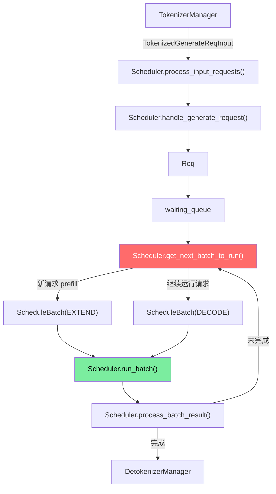
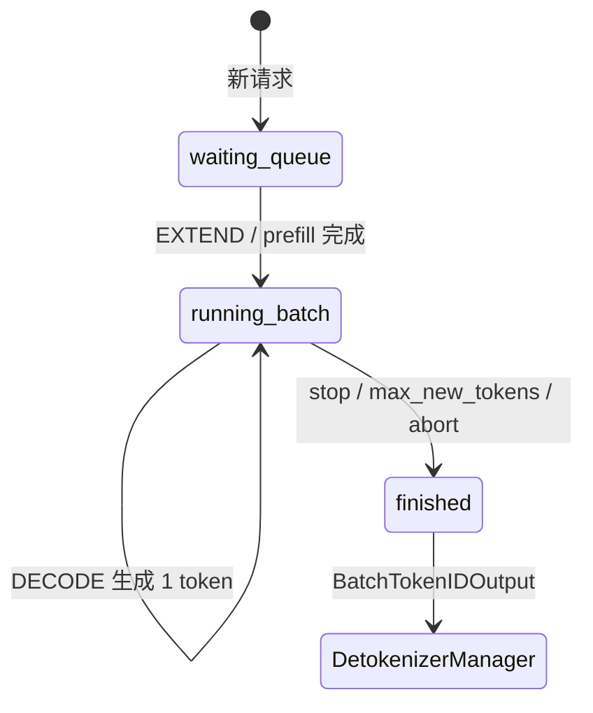
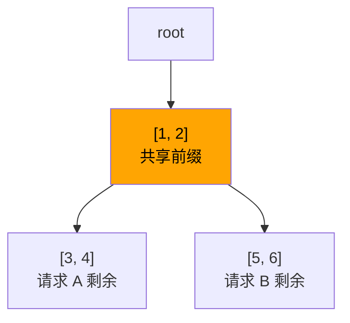
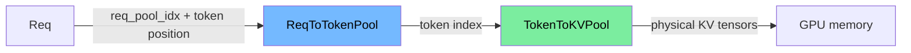

# Week 2 详细讲义：Scheduler 和 RadixCache

> 目标：把“请求怎么排队、怎么成 batch、怎么复用 KV Cache”讲清楚。只会基础 Python 也能按步骤读。

## 一句话结论

| 问题 | 答案 |
|---|---|
| Scheduler 是什么？ | 一个无限循环：收请求、入队、选 batch、执行、处理结果。 |
| `waiting_queue` 是什么？ | 新请求排队区，还没完成 prefill。 |
| `running_batch` 是什么？ | 已经 prefill 完，正在 decode 的请求集合。 |
| RadixCache 是什么？ | 用 token 前缀树复用历史 KV Cache，避免重复算 prompt。 |
| 内存池管什么？ | 管 KV Cache 的物理位置，不管“文本内容”。 |

## 1. 本周只看这条主线



## 2. Day-by-Day

| 天 | 目标 | 只读这些 | 验收 |
|---|---|---|---|
| Day 1 | 看懂 Scheduler 心跳 | `scheduler.py:event_loop_normal` | 能默写 `recv -> process -> schedule -> run -> result` |
| Day 2 | 看懂请求入队 | `process_input_requests`, `handle_generate_request`, `Req` | 能说清 `TokenizedGenerateReqInput -> Req -> waiting_queue` |
| Day 3 | 看懂 batch 选择 | `get_next_batch_to_run`, `ScheduleBatch` | 能区分 EXTEND/DECODE |
| Day 4 | 看懂 RadixCache | `radix_cache.py:match_prefix`, `insert`, `evict` | 能手画一棵 token 前缀树 |
| Day 5 | 看懂内存池关系 | `memory_pool.py`, `schedule_batch.py` 字段 | 能区分“逻辑请求”和“KV 物理槽位” |

## 3. 最小数据结构

| 名字 | 文件 | 你先理解成 |
|---|---|---|
| `TokenizedGenerateReqInput` | `managers/io_struct.py` | Tokenizer 发来的“已转 token 请求” |
| `Req` | `managers/schedule_batch.py` | Scheduler 内部的单个请求状态 |
| `ScheduleBatch` | `managers/schedule_batch.py` | 一批要执行的 `Req` |
| `ForwardMode` | `model_executor/forward_batch_info.py` | 本轮是 prefill 还是 decode |
| `RadixCache` | `mem_cache/radix_cache.py` | token 前缀 -> KV Cache 位置 |
| `TokenToKVPool` | `mem_cache/memory_pool.py` | token index -> 真实 KV 存储 |
| `ReqToTokenPool` | `mem_cache/memory_pool.py` | req index + token position -> token index |

## 4. Scheduler 心跳

源码：`python/sglang/srt/managers/scheduler.py:event_loop_normal()`

```text
while True:
  1. recv_requests()
  2. process_input_requests()
  3. get_next_batch_to_run()
  4. run_batch()
  5. process_batch_result()
```

| 步骤 | 大白话 | 结果 |
|---|---|---|
| `recv_requests` | 从 ZMQ 收包 | 得到外部消息 |
| `process_input_requests` | 按消息类型分发 | 新请求变 `Req` |
| `get_next_batch_to_run` | 决定下一轮算谁 | 得到 `ScheduleBatch` |
| `run_batch` | 调模型执行 | 得到 next token/logprob |
| `process_batch_result` | 更新请求状态 | 完成就输出，没完成继续 decode |

## 5. 请求状态变化



| 状态 | 表示 |
|---|---|
| waiting | prompt 还没完整处理 |
| running | prompt 已处理，正在逐 token 生成 |
| finished | 命中 stop、长度上限、abort 等结束条件 |

## 6. EXTEND 和 DECODE

| 对比 | EXTEND / Prefill | DECODE |
|---|---|---|
| 谁触发 | 新请求 | 已运行请求 |
| 输入 token 数 | prompt 多个 token | 通常 1 个 token |
| KV Cache | 大量写入 | 读历史 + 追加新 token |
| 延迟影响 | 影响 TTFT | 影响 ITL/TPS |
| 代码判断 | `forward_mode.is_extend()` | `forward_mode.is_decode()` |

```text
prompt = [10, 20, 30]

EXTEND:
  输入 [10, 20, 30]
  写 KV for 10/20/30
  采样得到 40

DECODE:
  输入 [40]
  读 KV for 10/20/30
  写 KV for 40
  采样得到 50
```

## 7. RadixCache 最小模型



| 操作 | 做什么 |
|---|---|
| `match_prefix` | 找输入 token 和树中已有 token 的最长公共前缀 |
| `insert` | 把新算出来的 KV 对应 token 插入树 |
| `evict` | 内存不够时，删掉可驱逐节点 |

## 8. RadixCache 和内存池别混

| 名字 | 管“什么” | 类比 |
|---|---|---|
| RadixCache | 哪些 token 前缀已经算过 | 书签目录 |
| ReqToTokenPool | 某个请求每个位置对应哪个 token slot | 座位表 |
| TokenToKVPool | 每个 token slot 的 KV 真放在哪 | 仓库货架 |



## 9. 初学者读码顺序

不要从文件第 1 行读到最后一行。按下面顺序跳读：

| 顺序 | 命令 |
|---|---|
| 1. 找主循环 | `rg -n "def event_loop_normal" python/sglang/srt/managers/scheduler.py` |
| 2. 找请求处理 | `rg -n "def process_input_requests|def handle_generate_request" python/sglang/srt/managers/scheduler.py` |
| 3. 找 batch 选择 | `rg -n "def get_next_batch_to_run" python/sglang/srt/managers/scheduler.py` |
| 4. 找数据结构 | `rg -n "class Req|class ScheduleBatch" python/sglang/srt/managers/schedule_batch.py` |
| 5. 找 cache 三板斧 | `rg -n "def match_prefix|def insert|def evict" python/sglang/srt/mem_cache/radix_cache.py` |

## 10. 动手练习

| 练习 | 命令 | 看什么 |
|---|---|---|
| Scheduler demo | `python sglang-learning-docs/06_demo_scheduler.py` | waiting/running 如何变化 |
| Radix demo | `python sglang-learning-docs/06_demo_radix_cache.py` | prefix match 如何减少 miss suffix |
| 真实单测 | `PYTHONPATH="sglang-learning-docs:python" python/.venv/bin/python -m pytest test/registered/unit/mem_cache/test_radix_cache_unit.py -v` | SGLang RadixCache 的边界行为 |

## 11. 练习参考答案方向

| 问题 | 参考答案 |
|---|---|
| 为什么新请求先进入 `waiting_queue`？ | 因为 prompt 还没 prefill，不能直接 decode。 |
| 为什么 prefill 后进入 `running_batch`？ | 因为 KV Cache 已经有 prompt 的历史状态，后续只需逐 token decode。 |
| RadixCache 命中后省了什么？ | 省掉公共前缀 token 的 forward 计算和 KV 写入。 |
| 内存不足先做什么？ | 尝试驱逐 `lock_ref == 0` 的缓存节点，不能驱逐正在被请求引用的 KV。 |
| `lock_ref` 是什么？ | 节点被正在运行请求引用的次数，非 0 表示不能淘汰。 |

## 12. 本周验收

| 验收项 | 合格标准 |
|---|---|
| 主循环 | 能说清 5 步心跳 |
| 请求状态 | 能画出 waiting -> running -> finished |
| batch 类型 | 能解释 EXTEND/DECODE 的区别 |
| RadixCache | 能手画 `[1,2,3]`、`[1,2,4]` 的共享树 |
| 内存池 | 能区分 RadixCache、ReqToTokenPool、TokenToKVPool |
