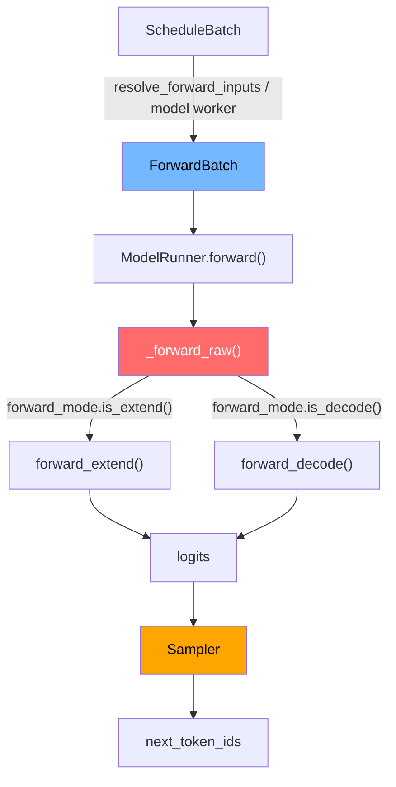
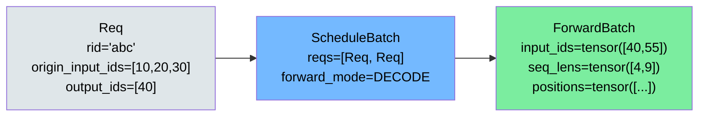
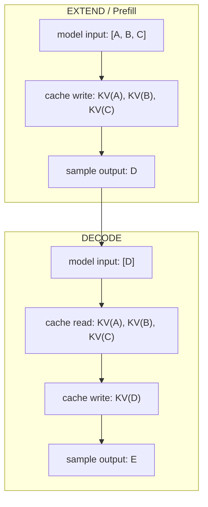
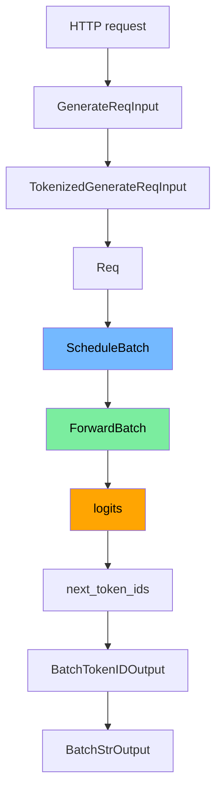

# Week 3 详细讲义：ModelRunner、ForwardBatch 和采样

> 目标：把 Scheduler 选出来的 batch 怎么变成模型输入、模型怎么产出 token 讲清楚。只看 Python 主链路，不钻 CUDA kernel。
>
> **配套资源**: [性能直觉: Prefill vs Decode 定量分析](../05-reference/performance-intuition.md#perf-prefill-vs-decode) | [FAQ: ScheduleBatch vs ForwardBatch](../05-reference/faq.md#faq-schedulebatch-vs-forwardbatch) | [FAQ: ForwardMode 各值含义](../05-reference/faq.md#faq-forwardmode-values)

## 一句话结论

| 问题 | 答案 |
|---|---|
| Week 3 学什么？ | `ScheduleBatch -> ForwardBatch -> model.forward -> logits -> sample -> next_token` |
| `ForwardBatch` 是什么？ | 给模型执行侧用的 Tensor 版 batch。 |
| logits 是什么？ | 模型对“下一个 token”的打分数组。 |
| sampling 是什么？ | 从 logits 里选下一个 token。 |
| Week 3 不看什么？ | 具体模型权重、CUDA kernel、FlashInfer 内部实现。 |

## 1. 总图



## 2. Day-by-Day

| 天 | 目标 | 只读这些 | 验收 |
|---|---|---|---|
| Day 1 | 看懂 batch 转换 | `ScheduleBatch`, `ForwardBatch`, `ForwardMode` | 能说清 CPU 对象和 Tensor batch 的区别 |
| Day 2 | 看懂 ModelRunner 主入口 | `model_runner.py:forward`, `_forward_raw` | 能画出 forward 分派路径 |
| Day 3 | 看懂 EXTEND/DECODE 执行差异 | `forward_extend`, `forward_decode` | 能解释为什么 decode 只喂 1 个新 token |
| Day 4 | 看懂 logits 和采样 | `layers/sampler.py`, `SamplingParams` | 能解释 temperature/top_p/max_new_tokens |
| Day 5 | 端到端串联 | Week1-3 全链路 | 能从 HTTP 请求讲到 next token |

## 3. CPU 对象 vs Tensor 对象

| 层 | 数据结构 | 形态 | 谁用 |
|---|---|---|---|
| Scheduler | `Req` | Python 对象 | 调度逻辑 |
| Scheduler | `ScheduleBatch` | `List[Req]` + 元数据 | 选 batch |
| Model worker | `ForwardBatch` | `torch.Tensor` 为主 | 模型 forward |



## 4. ForwardMode 先记这几个

| mode | 大白话 | 本周是否重点 |
|---|---|---|
| `EXTEND` | prefill，新请求读 prompt | 是 |
| `DECODE` | 逐 token 生成 | 是 |
| `IDLE` | 空 batch/同步用 | 知道即可 |
| speculative 相关 mode | 投机解码 | Week4 再看 |

查源码：

```bash
rg -n "class ForwardMode" python/sglang/srt/model_executor/forward_batch_info.py
```

## 5. ModelRunner 主路径

源码位置：

| 函数 | 文件 | 作用 |
|---|---|---|
| `ModelRunner.forward` | `model_executor/model_runner.py` | 前向入口 |
| `_forward_raw` | `model_executor/model_runner.py` | 根据 mode 分派 |
| `forward_extend` | `model_executor/model_runner.py` | prefill/extend |
| `forward_decode` | `model_executor/model_runner.py` | decode |
| `Sampler.forward` | `layers/sampler.py` | logits -> token |

最小伪代码：

```python
def forward(forward_batch):
    return self._forward_raw(forward_batch)

def _forward_raw(forward_batch):
    if forward_batch.forward_mode.is_decode():
        return self.forward_decode(forward_batch)
    if forward_batch.forward_mode.is_extend():
        return self.forward_extend(forward_batch)
```

## 6. EXTEND 和 DECODE 的输入差异

| 场景 | 输入给模型 | 为什么 |
|---|---|---|
| EXTEND | prompt 的多个 token | 第一次需要建立完整 KV Cache |
| DECODE | 新生成的 1 个 token | 历史 KV 已在 cache，不用重复算 |



## 7. logits 是什么

```text
vocab = ["我", "你", "他", "好", "坏", ...]
logits = [0.1, 2.4, -0.3, 5.1, 0.0, ...]

分数最高的是 "好"，但 sampling 不一定永远选最高。
```

| 概念 | 大白话 |
|---|---|
| logits | 未归一化分数 |
| softmax | 把分数变概率 |
| temperature | 控制随机性 |
| top_p | 只在累计概率前 p 的候选里选 |
| max_new_tokens | 最多生成几个新 token |

## 8. 采样最小模型

```python
import math
import random

def softmax(xs):
    exps = [math.exp(x) for x in xs]
    total = sum(exps)
    return [x / total for x in exps]

vocab = ["A", "B", "C"]
logits = [1.0, 2.0, 0.5]
probs = softmax(logits)
print(list(zip(vocab, probs)))
print(random.choices(vocab, weights=probs, k=1)[0])
```

SGLang 真实采样更复杂，因为要处理：

| 功能 | 说明 |
|---|---|
| temperature/top_p/top_k | 控制随机性和候选集合 |
| repetition penalty | 降低重复 token 概率 |
| grammar/constrained decoding | 约束 JSON、工具调用等格式 |
| logprob | 返回 token 概率信息 |

## 9. 初学者读码顺序

| 顺序 | 命令 |
|---|---|
| 1. 找 ForwardMode | `rg -n "class ForwardMode" python/sglang/srt/model_executor/forward_batch_info.py` |
| 2. 找 ForwardBatch | `rg -n "class ForwardBatch" python/sglang/srt/model_executor/forward_batch_info.py` |
| 3. 找 ModelRunner 入口 | `rg -n "def forward\\(|def _forward_raw|def forward_decode|def forward_extend" python/sglang/srt/model_executor/model_runner.py` |
| 4. 找 sampler | `rg -n "class Sampler|def forward" python/sglang/srt/layers/sampler.py` |
| 5. 找 SamplingParams | `rg -n "class SamplingParams" python/sglang/srt/sampling/sampling_params.py` |

## 10. 端到端数据流



## 11. 动手练习

| 练习 | 命令 | 看什么 |
|---|---|---|
| 看 ForwardMode | `PYTHONPATH="python" python/.venv/bin/python -c "from sglang.srt.model_executor.forward_batch_info import ForwardMode; print(list(ForwardMode))"` | mode 枚举 |
| 跑 Scheduler demo | `python sglang-learning-docs/06_demo_scheduler.py` | EXTEND 后进入 DECODE |
| 看采样参数 | `PYTHONPATH="python" python/.venv/bin/python -c "from sglang.srt.sampling.sampling_params import SamplingParams; print(SamplingParams(max_new_tokens=8, temperature=0.7))"` | 参数默认值 |

## 12. 练习参考答案方向

| 问题 | 参考答案 |
|---|---|
| 为什么需要 `ForwardBatch`？ | 模型执行需要 Tensor，不适合直接吃 Python `Req` 对象。 |
| 为什么 decode 通常只输入 1 个 token？ | 历史 token 的 KV 已缓存，只要处理新增 token。 |
| logits 和概率有什么区别？ | logits 是原始分数，softmax 后才是概率。 |
| temperature 越小会怎样？ | 分布更尖，更接近贪心选择。 |
| top_p 有什么用？ | 截掉长尾低概率 token，减少乱选。 |

## 13. 本周验收

| 验收项 | 合格标准 |
|---|---|
| 数据转换 | 能说清 `ScheduleBatch -> ForwardBatch` |
| forward 路径 | 能说清 `forward -> _forward_raw -> forward_extend/decode` |
| EXTEND/DECODE | 能解释输入 token 数和 KV Cache 差异 |
| logits/sampling | 能用 softmax 例子解释下一个 token 怎么选 |
| 端到端 | 能从 HTTP 请求讲到 `next_token_ids` |
