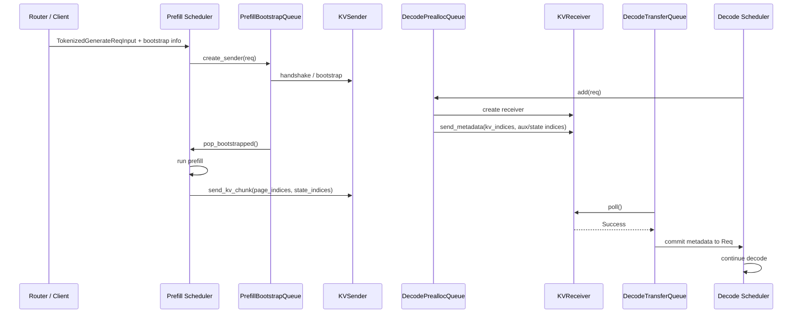

# 高级源码篇：Disaggregation 请求与 KV 传输

> 目标：看懂 Prefill/Decode 分离后，`Req` 如何从普通 queue 变成跨实例 KV transfer 状态机。

## 核心结论

Disaggregation 把普通链路：

```text
Scheduler -> prefill -> running_batch -> decode
```

拆成：

```text
Prefill Scheduler -> 生成 prompt KV -> KVSender 发送
Decode Scheduler -> 预分配 KV slot -> KVReceiver 接收 -> prebuilt/decode
```

这里不是“传 token”，而是传已经算好的 KV cache 和少量 metadata。token 序列仍然保存在 `Req.origin_input_ids + Req.output_ids` 里，物理 KV 由 transfer backend 写到 decode 端预分配的 slot。

## 总流程



## 关键对象

| 对象 | 文件 | 作用 |
|---|---|---|
| `DisaggregationMode` | `disaggregation/utils.py` | 区分 `prefill` 和 `decode` engine |
| `BaseKVSender` / `BaseKVReceiver` | `disaggregation/base/conn.py` | 传输后端统一接口 |
| `PrefillBootstrapQueue` | `disaggregation/prefill.py` | Prefill 端等待 bootstrap 完成的队列 |
| `DecodePreallocQueue` | `disaggregation/decode.py` | Decode 端先分配 KV slot 和 metadata buffer |
| `DecodeTransferQueue` | `disaggregation/decode.py` | Decode 端等待 KV 传输完成 |
| `MetadataBuffers` | `disaggregation/utils.py` | 传 output token、logprob、hidden states、bootstrap room 等辅助 metadata |
| `ReqToMetadataIdxAllocator` | `disaggregation/utils.py` | 管理 metadata buffer 行号 |
| `KVPoll` | `disaggregation/base/conn.py` | transfer 状态：Bootstrapping、Transferring、Success、Failed |

## Prefill 端生命周期

源码入口：`python/sglang/srt/disaggregation/prefill.py`

```text
1. PrefillBootstrapQueue.add(req)
2. create_sender(req)
   - 根据 backend 创建 KVSender
   - 设置 req.disagg_kv_sender
   - 设置 req.pending_bootstrap = True
3. pop_bootstrapped()
   - poll sender
   - 成功后分配 metadata_buffer_index
   - finalize_bootstrap(req)
   - 设置 req.start_send_idx = decode_prefix_len
4. Scheduler 正常 prefill
5. process_batch_result_disagg_prefill()
   - append 第一个 output token
   - set metadata buffer
   - send_kv_chunk(req)
6. process_disagg_prefill_inflight_queue()
   - poll transfer
   - Success 后清理 sender / metadata buffer
```

`send_kv_chunk` 是 Prefill 端的关键函数。它根据 `req.start_send_idx`、`end_idx`、`page_size` 决定发哪些 page，并把额外状态一起发出：

| 状态 | 什么时候出现 |
|---|---|
| KV page indices | 普通 attention KV |
| Mamba state indices | Hybrid/Mamba 模型 |
| SWA state indices | SWA KV pool |
| DSA/MLA state | 特定 attention backend / compressed state |

## Decode 端生命周期

源码入口：`python/sglang/srt/disaggregation/decode.py`

```text
1. DecodePreallocQueue.add(req)
2. _create_receiver_and_enqueue(req)
   - 根据 backend 创建 KVReceiver
3. _resolve_pending_reqs()
   - 确认 prefill parallel info
   - kv_receiver.init(prefill_dp_rank)
4. pop_preallocated()
   - prefix match
   - 预分配 req_pool_idx / KV slot / metadata buffer
   - kv_receiver.send_metadata(kv_indices, metadata_buffer_index, state_indices)
   - 请求转入 DecodeTransferQueue
5. DecodeTransferQueue.pop_transferred()
   - poll receiver
   - metadata gate 防止 KV Success 但 metadata 还没写好
   - _commit_transfer_to_req()
6. Decode Scheduler 构造 prebuilt/decode batch，继续逐 token 生成
```

## 为什么 Decode 要先 prealloc

Prefill 端不能随便把 KV 写到 decode 端任意位置。Decode 端必须先确定：

```text
这个 req 在 decode 端的 req_pool_idx 是哪一行
这个 req 的每个 token_pos 对应哪些 token_index
这些 token_index 对应哪些 GPU KV slot
metadata 放在哪个 metadata buffer 行
```

所以 decode 端先通过 `DecodePreallocQueue` 分配空间，再把这些目标位置通过 `send_metadata` 通知 prefill 端。

## MetadataBuffers

`MetadataBuffers` 解决“KV 之外的小信息怎么传”的问题。它包含：

| buffer | 作用 |
|---|---|
| `output_ids` | prefill 产生的第一个 output token |
| `cached_tokens` | cache hit 统计 |
| `output_token_logprobs_*` | logprob 输出 |
| `output_top_logprobs_*` | top logprobs |
| `output_hidden_states` | hidden states |
| `bootstrap_room` | 防止 metadata 串请求 |

Decode 端 `_commit_transfer_to_req` 会检查 `bootstrap_room`，如果 metadata 行不是当前请求的 room，会认为发生上下文污染并失败。

## Backend 抽象

`get_kv_class()` 根据 `TransferBackend` 选择具体实现：

| backend | 目录 | 典型用途 |
|---|---|---|
| `fake` | `disaggregation/fake/` | 单测和无真实传输调试 |
| `mooncake` | `disaggregation/mooncake/` | 生产 RDMA 传输 |
| `nixl` | `disaggregation/nixl/` | NIXL/UCX 传输 |
| `mori` | `disaggregation/mori/` | Mori 后端 |
| `ascend` | `disaggregation/ascend/` | Ascend/NPU 路径 |

上层 Scheduler 不直接关心 RDMA/UCX 细节，只认 `init`、`send_metadata`、`send`、`poll`、`failure_exception`。

## 和普通主链路的差异

| 普通模式 | Disaggregation 模式 |
|---|---|
| `running_batch` 直接从 prefill 过渡到 decode | prefill 完成后进入 transfer queue，decode 端接收后才继续 |
| KV slot 在同一个 engine 内分配和读取 | decode 端预分配，prefill 端远程写入 |
| `Req` 生命周期单进程维护 | `Req` 上有 `bootstrap_*`、`disagg_kv_sender/receiver`、metadata index |
| failure 多为 OOM/abort | 还可能 bootstrap fail、transfer fail、metadata mismatch |

## 读码顺序

```bash
rg -n "class PrefillBootstrapQueue|def send_kv_chunk|process_batch_result_disagg_prefill" python/sglang/srt/disaggregation/prefill.py
rg -n "class DecodePreallocQueue|class DecodeTransferQueue|def pop_preallocated|def pop_transferred" python/sglang/srt/disaggregation/decode.py
rg -n "class BaseKVSender|class BaseKVReceiver|class KVPoll" python/sglang/srt/disaggregation/base/conn.py
rg -n "class MetadataBuffers|def get_kv_class" python/sglang/srt/disaggregation/utils.py
```
