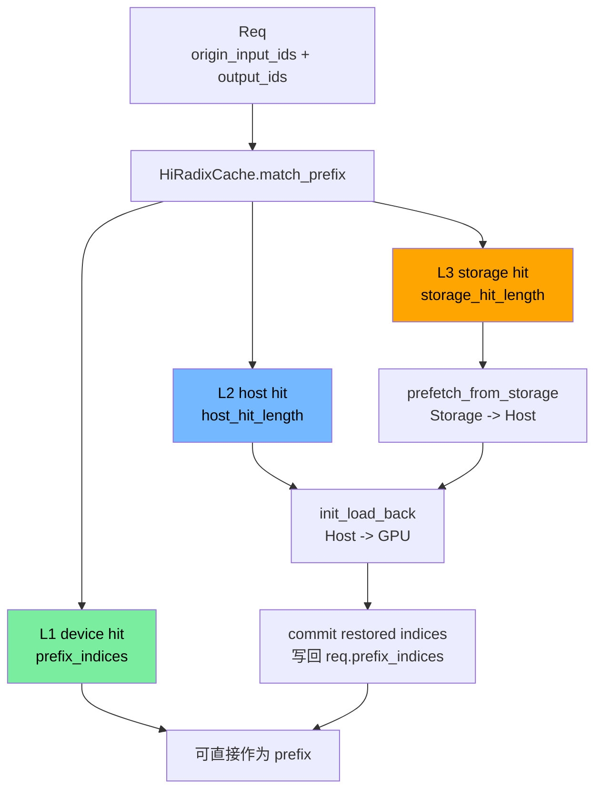

# 高级源码篇：HiCache 分层 KV Cache

> 目标：看懂 GPU KV 不够时，SGLang 如何把 KV 扩展到 host/storage，并在 decode 前恢复。

## 核心结论

普通 RadixCache 的命中只有一层：

```text
token prefix -> GPU KV indices
```

HiCache 把它扩展成多层：

```text
L1 device: GPU KV slot
L2 host: CPU/host KV backup
L3 storage: 文件/远端/外部存储后端
```

命中不等于马上能 decode。只有 L1 device 命中可以直接读；L2/L3 命中需要 load back 或 prefetch，恢复到 GPU slot 后才能进入 decode。

## 总图



## 关键对象

| 对象 | 文件 | 作用 |
|---|---|---|
| `HiRadixCache` | `mem_cache/hiradix_cache.py` | 支持 device/host/storage 的 radix cache |
| `HiCacheStorage` | `mem_cache/hicache_storage.py` | L3 storage 抽象接口 |
| `HiCacheFile` | `mem_cache/hicache_storage.py` | 文件型 storage 实现 |
| `DecodePrefixMatch` | `disaggregation/decode_hicache_mixin.py` | decode 端 prefix match 结果，拆成 L1/L2/L3 |
| `DecodeHiCachePreallocMixin` | `disaggregation/decode_hicache_mixin.py` | prealloc 阶段发起 L3 prefetch / 预留 restore 空间 |
| `DecodeHiCacheTransferMixin` | `disaggregation/decode_hicache_mixin.py` | transfer 阶段执行 local restore 和 commit |

## HiRadixCache 状态

`HiRadixCache` 在普通 `RadixCache` 基础上增加：

| 字段 | 含义 |
|---|---|
| `token_to_kv_pool_host` | host 侧 KV pool |
| `enable_storage` | 是否启用 L3 storage |
| `hicache_storage` / controller | storage 后端和控制队列 |
| `ongoing_prefetch` | 正在进行的 L3 -> L2 prefetch |
| `ongoing_load_back` | 正在进行的 L2 -> L1 load back |
| `ongoing_backup` | 正在进行的 host/storage backup |
| `prefetch_loaded_tokens_by_reqid` | 每个请求实际从 storage 加载了多少 token |

## Decode 端恢复路径

源码入口：`python/sglang/srt/disaggregation/decode_hicache_mixin.py`

```text
1. DecodePreallocQueue._match_prefix_and_lock(req)
2. _build_decode_prefix_match(req, match_result)
   - l1_prefix_len = len(device_indices)
   - l2_host_hit_length = result.host_hit_length
   - l3_storage_hit_length = query_storage_hit_length(...)
3. _start_hicache_prefetch(req, prefix_match)
   - 如果 L3 命中，先发起 storage -> host prefetch
4. _process_hicache_local_restores()
   - 等 prefetch 完成
   - init_load_back(host_hit_length)
   - 等 load_back event 完成
5. _commit_hicache_local_restore_to_req()
   - 把 restored kv indices 拼到 req.prefix_indices
   - 更新 req.last_node / cache lock
```

## `DecodePrefixMatch` 怎么读

| 字段 | 含义 |
|---|---|
| `prefix_indices` | L1 GPU 已经命中的 KV indices |
| `l2_host_hit_length` | host 侧命中的 token 数 |
| `l3_storage_hit_length` | storage 侧命中的 token 数 |
| `last_host_node` | host/storage 相关 radix node |
| `prefetch_registered` | 是否已经注册 L3 prefetch |
| `decode_prefix_len` | L1 + L2 + L3 总命中长度 |
| `restore_token_count` | 需要 load back 到 GPU 的 token 数 |

## L3 prefetch 和 L2 load back 的区别

| 操作 | 方向 | 目的 |
|---|---|---|
| `prefetch_from_storage` | storage -> host | 把 L3 命中页提前拉到 host |
| `init_load_back` | host -> GPU | 把 L2/L3 命中的 KV 恢复成 GPU slot |
| `is_load_back_event_done` | 检查 GPU restore | 防止 decode 读到尚未写完的 KV |
| `pop_prefetch_loaded_tokens` | 取 prefetch 结果 | 记录实际 L3 命中/加载数量 |

## 与 Disaggregation 的交叉

Disaggregation decode 端有两类 KV 来源：

| 来源 | 处理方式 |
|---|---|
| Prefill server 传来的 KV | `KVReceiver` 写入 decode 端预分配 slot |
| Decode 本地 HiCache 命中的 prefix | 通过 HiCache restore/load back 写入本地 slot |

所以 decode 端必须 gate 两件事：

```text
远端 transfer 完成
本地 HiCache restore 完成
```

`HiCacheRestoreGatedKVReceiver` 的作用就是：即使 transfer backend 报 Success，如果 HiCache local restore 仍是 PENDING，也不能把请求交给 decode。

## 常见坑

| 现象 | 可能原因 |
|---|---|
| prefix 命中了但不能 decode | 命中在 L2/L3，还没 load back 到 GPU |
| storage 命中数不稳定 | prefetch policy、timeout、page 对齐影响 |
| cache lock 泄漏 | restore 后没有正确 `dec_lock_ref` 或 cleanup |
| device OOM | restore token 也要占 GPU KV slot，需要纳入 prealloc budget |

## 读码顺序

```bash
rg -n "class HiRadixCache|ongoing_prefetch|init_load_back|prefetch_from_storage" python/sglang/srt/mem_cache/hiradix_cache.py
rg -n "class DecodePrefixMatch|DecodeHiCachePreallocMixin|DecodeHiCacheTransferMixin" python/sglang/srt/disaggregation/decode_hicache_mixin.py
rg -n "class HiCacheStorage|class HiCacheFile|batch_get_v2|batch_set_v2" python/sglang/srt/mem_cache/hicache_storage.py
```
