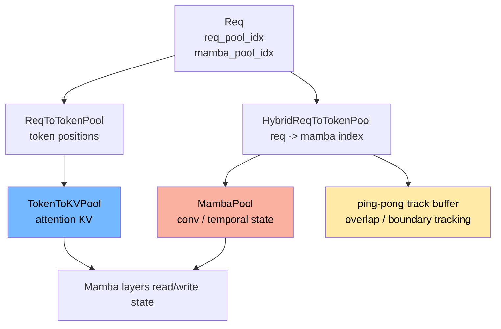

# 高级源码篇：Mamba / Hybrid State Cache

> 目标：看懂 Mamba/Hybrid 模型为什么不只需要 KV cache，还要维护 recurrent state，以及它如何接入 Req/Batch/cache。

## 核心结论

Transformer attention 的历史状态主要是 KV cache；Mamba 类模型还有 recurrent state，例如 conv state、temporal/SSM state。

所以 Hybrid/Mamba 路径需要两套映射：

```text
attention token 映射:
  req_pool_idx + token_pos -> token_index -> KV slot

mamba state 映射:
  req_pool_idx -> mamba_pool_idx -> MambaPool state slot
```

## 总图



## 关键对象

| 对象 | 文件 | 作用 |
|---|---|---|
| `MambaPool` | `mem_cache/memory_pool.py` | 存 Mamba recurrent state |
| `HybridReqToTokenPool` | `mem_cache/memory_pool.py` | 普通 req->token 映射 + req->mamba 映射 |
| `MambaSlotAllocator` | `mem_cache/allocator/mamba.py` | 管理 Mamba state slot |
| `MambaRadixCache` | `mem_cache/mamba_radix_cache.py` | 支持 Mamba state 的 radix cache |
| `HiMambaRadixCache` | `mem_cache/hi_mamba_radix_cache.py` | Mamba + HiCache 分层路径 |
| `set_mamba_track_indices_from_reqs` | `managers/schedule_batch.py` | 从 req 收集 batch 级 Mamba track tensor |

## MambaPool 存什么

`MambaPool.State` 里主要是：

| 字段 | 含义 |
|---|---|
| `conv` | 每个 Mamba layer 的 convolution state |
| `temporal` | temporal / SSM state |

如果启用 speculative Mamba，还会有：

| 字段 | 含义 |
|---|---|
| `intermediate_ssm` | spec 路径中的中间 SSM state |
| `intermediate_conv_window` | spec 路径中的中间 conv window |

## HybridReqToTokenPool 怎么分配

源码入口：`HybridReqToTokenPool.alloc`

```text
1. 先按普通 ReqToTokenPool 分配 req_pool_idx
2. 如果 req.mamba_pool_idx 已存在，复用
3. 否则 mamba_allocator.alloc(1)
4. req.mamba_pool_idx = 新 slot
5. req.mamba_needs_clear = True
6. 写 req_index_to_mamba_index_mapping[req_pool_idx]
7. 如启用 extra buffer，分配 ping-pong track buffer
```

所以 Mamba state 生命周期绑定在请求上，但通过 `req_pool_idx` 暴露给 batch/model 侧。

## ping-pong track buffer

overlap/spec/chunked 场景中，Mamba state 不能简单原地覆盖，否则 CPU 调度和 GPU forward 可能读写同一个 state slot。

`HybridReqToTokenPool` 因此维护：

```text
req.mamba_ping_pong_track_buffer
req.mamba_next_track_idx
req_index_to_mamba_ping_pong_track_buffer_mapping
```

核心操作：

| 函数 | 作用 |
|---|---|
| `_alloc_ping_pong_buffer` | 给 req 分配 1 或 2 个额外 track slot |
| `get_mamba_ping_pong_keep_idx` | 决定当前要保留哪个 slot |
| `donate_mamba_ping_pong_slot` | 把旧 slot 交给 radix cache 或分支继续用 |
| `free_mamba_cache` | 释放 main mamba slot 和可释放的 ping-pong slot |

## MambaRadixCache 做了什么

普通 radix cache 的 value 只关心 KV indices；Mamba radix cache 还需要处理 Mamba state：

```text
token prefix -> KV indices + mamba state anchor
```

它会在 cache insert、match、evict 时同步处理：

| 操作 | Mamba 特殊点 |
|---|---|
| match prefix | 可能需要 COW / donate mamba slot |
| cache unfinished req | 保存当前 Mamba state 作为 prefix state |
| cache finished req | 释放请求自有 state 或转移给 tree |
| evict | 同时释放 KV 和 Mamba state |

## 与 ScheduleBatch 的关系

`ScheduleBatch.prepare_for_extend` 中会收集：

```text
mamba_track_indices
mamba_track_mask
mamba_track_seqlens
mamba_cow_src_indices
mamba_cow_dst_indices
mamba_clear_indices
```

这些字段让 model forward stream 能在正确时机执行：

| 字段 | 作用 |
|---|---|
| `mamba_track_indices` | 本 batch 每个 req 对应哪个 Mamba track slot |
| `mamba_track_mask` | 哪些 req 需要 track |
| `mamba_cow_*` | 延迟执行 copy-on-write |
| `mamba_clear_indices` | 新 slot 使用前清零 |

## 与 Speculative 的关系

Speculative decode 一次可能接受多个 token。对 Mamba 来说，accepted token 是否跨过 track boundary 会影响 state 提交。

`batch_result_processor.py` 里有 Mamba 相关逻辑：

```text
_mamba_prefix_cache_update
_mamba_check_track_boundary
mamba_lazy_post_decode_at_boundary
```

这就是为什么 speculative 文档里说：不仅 KV 需要处理 over-allocation，Mamba state 也需要按 accepted token 更新。

## 读码顺序

```bash
rg -n "class MambaPool|class HybridReqToTokenPool|donate_mamba_ping_pong_slot|free_mamba_cache" python/sglang/srt/mem_cache/memory_pool.py
rg -n "class MambaRadixCache|cache_finished_req|cache_unfinished_req|donate" python/sglang/srt/mem_cache/mamba_radix_cache.py
rg -n "set_mamba_track_indices_from_reqs|mamba_cow|mamba_clear|_mamba_radix_cache_v2" python/sglang/srt/managers/schedule_batch.py
rg -n "_mamba_prefix_cache_update|_mamba_check_track_boundary" python/sglang/srt/managers/scheduler_components/batch_result_processor.py
```
