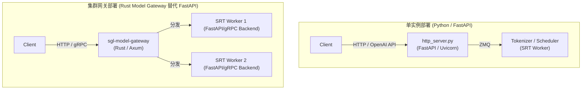

# 进阶专题：SGLang Model Gateway 与多模型路由网关

> **目标**：理清集群级路由网关 `sgl-model-gateway` 的核心定位，理解它与单机路由 `sgl-router` 的演进关系，以及它如何与 Python 端的 FastAPI 入口和 SRT Scheduler 协同分工。
> **适用阶段**：Phase 2 (Week 5+) 涉及多机多卡部署、或想探索 Rust 高性能网关设计的读者。

---

## 一、 核心概念定位

在 SGLang 的多机/集群部署架构中，存在两个容易混淆的路由概念：`sgl-router` 与 `sgl-model-gateway`。它们是**演进与继承**的关系。

### 1.1 sgl-router (旧/轻量级单模型路由)
* **路径**：[experimental/sgl-router](file:///Users/stream/codes/llms/sglang/experimental/sgl-router)
* **定位**：面向**单模型（Single Model）**部署的轻量级、KV 缓存感知的路由服务。
* **工作机制**：当你启动了多个运行同一个大模型的 SGLang Worker 实例时，`sgl-router` 作为一个中间层，将用户请求分发给这些 Worker。它采用 **Cache-aware 策略**，将具有相同 Prompt 前缀的请求优先发送到同一个 Worker，从而最大化利用每个 Worker 内部的 [RadixCache](file:///Users/stream/codes/llms/sglang/sglang-learning-docs/02-core-systems/scheduler-and-cache.md#day-3-4-radixcache-前缀缓存-4h)。

### 1.2 sgl-model-gateway (新/企业级多模型网关)
* **路径**：[sgl-model-gateway](file:///Users/stream/codes/llms/sglang/sgl-model-gateway)
* **定位**：SGLang 的**企业级多模型路由控制面与数据面网关**。
* **工作机制**：它是 `sgl-router` 的**升级版和超集**。采用纯 Rust（基于 Axum + Tokio）重写，不仅保留了 `sgl-router` 的所有缓存感知算法，还支持多模型混合路由、高可用熔断限流机制、以及 Rust 原生的 Tokenizer 与工具调用解析。

### 1.3 它们之间的包命名关系
虽然 Rust 项目的主目录为 `sgl-model-gateway`（编译出的二进制别名为 `smg` 或 `amg`），但为了保持向后兼容性，其 Python 绑定包（在 `bindings/python` 中）发布时仍然命名为 **`sglang_router` / `sglang-router`**。
当你执行：
```bash
python3 -m sglang_router.launch_router --worker-urls http://... --policy cache_aware
```
后台拉起的实际上已经是 `sgl-model-gateway` 的高性能 Rust 核心了。

---

## 二、 Model Gateway 与 FastAPI 的关系

在 SGLang 的单机部署中，API 流量入口是由 Python 的 **FastAPI + Uvicorn** 实现的。而在集群部署中，**Model Gateway 彻底替代并接管了 FastAPI 层**，并使用 Rust 进行了重写。



### 2.1 为什么用 Rust Axum 替换 Python FastAPI？
* **消除 Python GIL 限制**：FastAPI 运行在 Python 下，在面对并发的短连接解析、高吞吐的流式推送（SSE）时，CPU 极易成为瓶颈。Rust 基于多线程异步协程（Tokio），网络 I/O 吞吐比 FastAPI 高出一个数量级。
* **计算下沉**：原先在 Python 进程中执行的 **Jinja 对话模板格式化**、**Hugging Face 文本 Token 化** 等操作，被网关层使用纯 Rust 实现的 `tokenizers` 绑定完全接管，直接将 `token_ids` 组装好发给后端，避免了 Python Worker 的 CPU 占用。

### 2.2 替换逻辑对比表

| 任务 | Python 原逻辑 | Model Gateway 替代方案 (Rust) |
|---|---|---|
| **API Web 容器** | FastAPI / Pydantic 参数校验 | **Axum + Tower HTTP** / 高性能 JSON 解析与连接池 |
| **Token 编码** | `transformers.AutoTokenizer` | **HF Tokenizers (Rust bindings)** 内存级快速 Tokenize |
| **高可用与防御** | 依靠外部 Nginx、Celery 等组件 | 内置 **Token Bucket 限流器**、**熔断器** 与**重试机制** |
| **流式解析** | Python 文本正则解析 | 纯 Rust 实现的 **Reasoning Parser** / **Tool Parser** |

---

## 三、 Model Gateway 与 Python SRT Scheduler 的分工

Model Gateway 并没有代替 Worker 内部的 Scheduler 主循环（`event_loop_normal`/`event_loop_overlap`），它们是**宏观调度与微观调度**的协同分工。

### 3.1 “分诊台与诊室助手”的心智模型

```
                             [ 患 者 (HTTP/gRPC 请求) ]
                                         |
                                         v
+---------------------------------------------------------------------------------+
|                       Model Gateway (分诊台 / 挂号处)                             |
|  - 负责把患者分配给哪位医生 (选择负载最低、或者有病历缓存的 Worker 实例)               |
|  - 如果来看病的人太多，先在挂号大厅排队 (令牌桶限流、Request Queue)                 |
+---------------------------------------------------------------------------------+
                                  |           |
                     分发给医生 A  |           | 分发给医生 B
                                  v           v
+-----------------------------------+       +-----------------------------------+
|      SRT Worker A (诊室 A)         |       |      SRT Worker B (诊室 B)         |
|                                   |       |                                   |
|   +---------------------------+   |       |   +---------------------------+   |
|   | 诊室助手 (Scheduler)       |   |       |   | 诊室助手 (Scheduler)       |   |
|   | - 整理诊室门外的患者队伍  |   |       |   | - 整理诊室门外的患者队伍  |   |
|   | - 给患者分配病历本与座位  |   |       |   | - 给患者分配病历本与座位  |   |
|   |   (KV Cache Allocation)   |   |       |   |   (KV Cache Allocation)   |   |
|   | - 每次叫几个患者一起进去  |   |       |   | - 每次叫几个患者一起进去  |   |
|   |   (Continuous Batching)   |   |       |   |   (Continuous Batching)   |   |
|   | - overlap 逻辑:            |   |       |   | - overlap 逻辑:            |   |
|   |   医生看病时，助手准备    |   |       |   |   医生看病时，助手准备    |   |
|   |   下一批患者的病历        |   |       |   |   下一批患者的病历        |   |
|   +---------------------------+   |       |   +---------------------------+   |
|                 |                 |       |                 |                 |
|                 v                 |       |                 v                 |
|   +---------------------------+   |       |   +---------------------------+   |
|   | 医 生 (GPU / ModelRunner)  |   |       |   | 医 生 (GPU / ModelRunner)  |   |
|   | - 真正做诊断 (执行 Forward) |   |       |   | - 真正做诊断 (执行 Forward) |   |
|   +---------------------------+   |       |   +---------------------------+   |
+-----------------------------------+       +-----------------------------------+
```

### 3.2 职责划分对比表

| 调度级别 | 模块 | 职责与功能 |
|---|---|---|
| 🌐 **集群请求级调度** (宏观) | **Model Gateway (Rust)** | **1. 跨实例负载均衡**：决定将请求发给哪台机器。<br/>**2. 缓存感知路由**：把有公共前缀的请求送给同一个 Worker，提高其 RadixCache 命中率。<br/>**3. 熔断与流量隔离**：当某台 GPU 发生 OOM 崩溃时，自动将流量切走并实施重试。 |
| 🐍 **Token/Tensor 级调度** (微观) | **SRT Scheduler (Python)** | **1. 连续批处理 (Continuous Batching)**：决定是将请求做 Prefill (EXTEND) 还是 Decode。<br/>**2. 显存物理块管理**：直接操作 [TokenToKVPool](file:///Users/stream/codes/llms/sglang/sglang-learning-docs/02-core-systems/scheduler-and-cache.md#day-5-内存池管理-2h)，将 Token 映射到 GPU 的非连续物理页。<br/>**3. CPU-GPU 重叠 (Overlap)**：调用 CUDA Stream/Event，让 GPU 运算与 CPU 组装 Batch 同时运行。 |

---

## 💡 总结自测

1. 既然 Model Gateway 也是用 Rust 写的，它为什么不能直接取代 Python 端的 SRT Scheduler？
2. 简述 `sgl-model-gateway` 相比 `sgl-router` 最大的两个核心功能升级。
3. Gateway 是通过什么方式，在不接触 GPU 显存的前提下，提高后端 Worker 的 RadixCache 命中率的？
