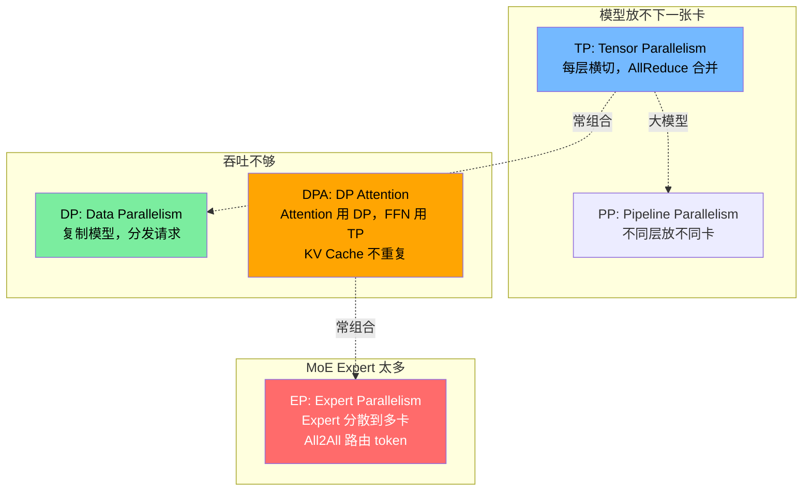
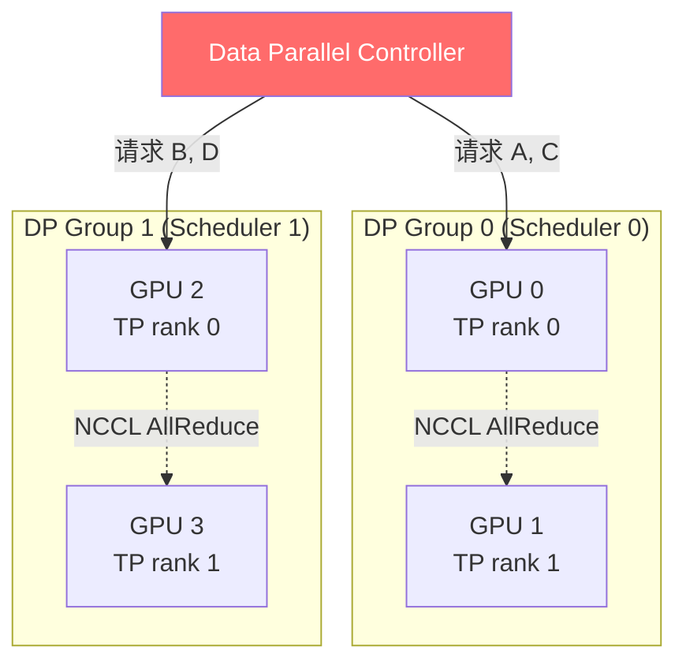
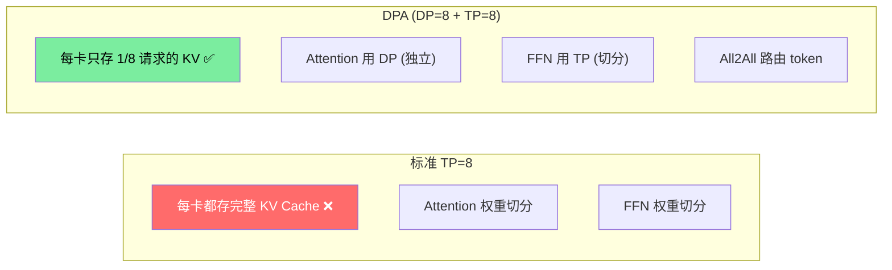
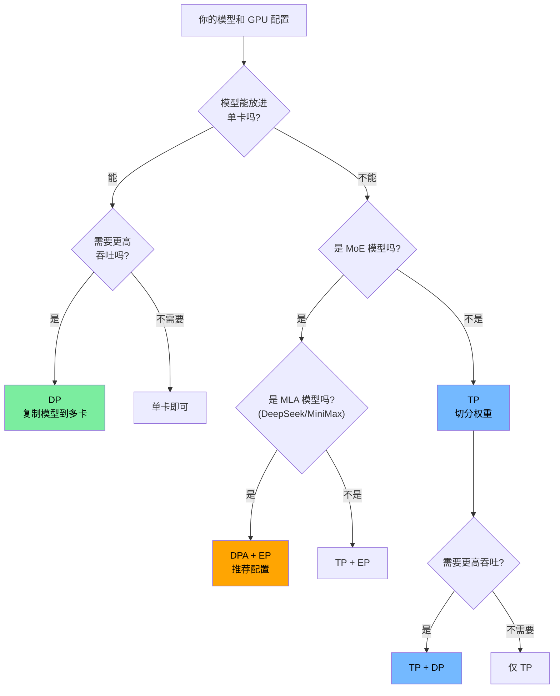

# 高级教程：多卡分布式推理 (TP/DP/DPA/EP)

> **定位**: 毕业后选修，需要多张 NVIDIA GPU
> **预计用时**: 6-10 小时
> **前提**: 完成 8 周主线课程，熟练掌握单卡 Server 启动和 Benchmark
> **环境**: 2+ 张 NVIDIA GPU（同一节点或多节点）

---

## 一、为什么需要多卡？

```
单卡瓶颈:
  模型太大 → 一张卡装不下 (70B FP16 = 140GB > A100 80GB)
  吞吐不够 → 一张卡并发能力有限
  延迟太高 → MoE 模型的 expert 太多

解决方案:
  TP (Tensor Parallelism)     → 模型太大，切权重
  DP (Data Parallelism)       → 吞吐不够，复制模型
  DPA (DP Attention)          → MLA 模型 KV Cache 去重
  EP (Expert Parallelism)     → MoE expert 太多，分散到多卡
```

### 四种并行的关系



---

## 二、Tensor Parallelism (TP) 实战

### 2.1 原理回顾

TP 把每一层的权重矩阵按列或行切分到多张 GPU，每张卡算一部分，然后用 AllReduce 合并结果。

```
Linear(4096, 4096) on 2 GPUs:
  GPU 0: Linear(4096, 2048)  ← 左半列
  GPU 1: Linear(4096, 2048)  ← 右半列
  结果: AllReduce(GPU0_output, GPU1_output)
```

**适用场景**: 模型太大放不下单卡，或想用多卡加速 Prefill

### 2.2 启动 TP=2 的 Server

```bash
# 需要 2 张 GPU
python3 -m sglang.launch_server \
    --model-path Qwen/Qwen2.5-7B-Instruct \
    --tp-size 2 \
    --port 30000
```

**观察启动日志**:
```
# 你会看到:
# - 2 个 TpWorker 进程启动
# - 每张卡加载约一半的权重
# - NCCL 初始化 (GPU 间通信)
```

### 2.3 验证 TP 正确性

```python
import openai

client = openai.Client(base_url="http://localhost:30000/v1", api_key="none")

# TP=2 的输出应该和 TP=1 完全一致 (相同 seed)
resp = client.chat.completions.create(
    model="default",
    messages=[{"role": "user", "content": "What is 2+3?"}],
    max_tokens=32,
    temperature=0  # greedy, 确保确定性
)
print(resp.choices[0].message.content)
```

### 2.4 实验：TP=1 vs TP=2 性能对比

```bash
# TP=1 benchmark
python3 -m sglang.launch_server --model-path Qwen/Qwen2.5-7B-Instruct --tp-size 1 --port 30000
python3 -m sglang.bench_serving --port 30000 --dataset-name random \
    --num-prompts 50 --random-input-len 512 --random-output-len 128

# TP=2 benchmark (重启 Server)
python3 -m sglang.launch_server --model-path Qwen/Qwen2.5-7B-Instruct --tp-size 2 --port 30000
python3 -m sglang.bench_serving --port 30000 --dataset-name random \
    --num-prompts 50 --random-input-len 512 --random-output-len 128
```

**观察**:
- TP=2 的 TTFT 是否约为 TP=1 的一半？(Prefill 是 compute-bound)
- TP=2 的 TPS 是否有提升？(Decode 是 memory-bound，TP 增加了总带宽)
- TP=2 的 AllReduce 通信开销有多大？

### 2.5 源码阅读

| 关键文件 | 内容 |
|---------|------|
| `python/sglang/srt/managers/tp_worker.py` | TP Worker 主逻辑 |
| `python/sglang/srt/distributed/parallel_state.py` | 并行组初始化 |
| `python/sglang/srt/distributed/communication_op.py` | AllReduce 等集合通信 |
| `python/sglang/srt/distributed/device_communicators/pynccl.py` | NCCL 封装 |

```bash
# 找到 TP 切分逻辑
grep -rn "tensor_model_parallel\|column_parallel\|row_parallel" \
    python/sglang/srt/layers/ --include="*.py" | head -10

# 找到 AllReduce 调用
grep -rn "all_reduce\|tensor_model_parallel_all_reduce" \
    python/sglang/srt/layers/ --include="*.py" | head -10
```

### 动手练习 A.1

> **TP 扩展性实验** (需要 4 张 GPU)
>
> 分别用 TP=1, 2, 4 运行 benchmark，记录:
>
> | TP | TTFT (ms) | TPS | Throughput | 每卡显存 |
> |---|---|---|---|---|
> | 1 | | | | |
> | 2 | | | | |
> | 4 | | | | |
>
> 问题：TP 从 2 到 4 的 TTFT 提升不如 1 到 2 大，为什么？
> (提示: AllReduce 通信量随 TP 增加而增加)

---

## 三、Data Parallelism (DP) 实战

### 3.1 原理回顾

DP 把完整模型复制到多组 GPU 上，每组独立处理不同的请求。

```
DP=2 (每组 1 卡):
  Group 0: GPU 0 — 完整模型 — 处理请求 A, C, E
  Group 1: GPU 1 — 完整模型 — 处理请求 B, D, F
  Router: 按策略分发请求到不同 Group
```

**适用场景**: 模型能放进单卡，需要线性扩大吞吐

### 3.2 启动 DP=2 的 Server

```bash
# 需要 2 张 GPU，每张能放下整个模型
python3 -m sglang.launch_server \
    --model-path Qwen/Qwen2.5-1.5B-Instruct \
    --dp-size 2 \
    --port 30000
```

**观察**:
- 启动了 2 个 Scheduler 进程
- 每个 Scheduler 有自己的 ModelRunner
- Data Parallel Controller 负责请求分发

### 3.3 负载均衡策略

```bash
# 不同负载均衡策略
python3 -m sglang.launch_server \
    --model-path Qwen/Qwen2.5-1.5B-Instruct \
    --dp-size 2 \
    --load-balance-method round_robin \  # 轮询
    --port 30000

# 可选策略:
# round_robin     — 轮询分发
# total_requests  — 发给当前请求最少的 group
# total_tokens    — 发给当前 token 最少的 group
# auto            — 自动选择
```

### 3.4 实验：DP 扩展性

```bash
# DP=1
python3 -m sglang.launch_server --model-path Qwen/Qwen2.5-1.5B-Instruct --dp-size 1 --port 30000
python3 -m sglang.bench_serving --port 30000 --dataset-name random \
    --num-prompts 200 --random-input-len 256 --random-output-len 128

# DP=2
python3 -m sglang.launch_server --model-path Qwen/Qwen2.5-1.5B-Instruct --dp-size 2 --port 30000
python3 -m sglang.bench_serving --port 30000 --dataset-name random \
    --num-prompts 200 --random-input-len 256 --random-output-len 128
```

**观察**:
- Throughput 是否接近翻倍？
- 单请求延迟是否不变？(DP 不影响单请求延迟)

### 3.5 TP + DP 组合

大模型 + 高吞吐场景，常用 TP + DP 组合：

```bash
# 4 张 GPU: TP=2, DP=2
# Group 0: GPU 0,1 (TP=2)
# Group 1: GPU 2,3 (TP=2)
python3 -m sglang.launch_server \
    --model-path Qwen/Qwen2.5-7B-Instruct \
    --tp-size 2 \
    --dp-size 2 \
    --port 30000
```



### 源码阅读

| 关键文件 | 内容 |
|---------|------|
| `python/sglang/srt/managers/data_parallel_controller.py` | DP Controller，请求分发 |
| `python/sglang/srt/server_args.py` (`dp_size`, `load_balance_method`) | DP 配置参数 |

```bash
# DP Controller 的分发逻辑
grep -n "def select\|round_robin\|total_requests\|total_tokens" \
    python/sglang/srt/managers/data_parallel_controller.py | head -15
```

---

## 四、Data Parallelism Attention (DPA) — 进阶

### 4.1 为什么需要 DPA？

标准 TP 对 MLA 模型 (DeepSeek, MiniMax) 效率低：

```
问题: DeepSeek MLA 只有 1 个 KV head
  TP=8 时: 每张卡都存完整 KV Cache (无法切分!)
  8 张卡 × 完整 KV Cache = 8 倍浪费

DPA 的做法:
  Attention: 用 DP (每张卡只存自己 batch 的 KV Cache)
  FFN:       用 TP (权重切分)
  结果: KV Cache 不重复，显存大幅节省
```



### 4.2 启动 DPA

```bash
# DPA 需要: dp_size > 1 且 tp_size % dp_size == 0
# 8 张 GPU: TP=8, DP=8
python3 -m sglang.launch_server \
    --model-path deepseek-ai/DeepSeek-V3 \
    --tp-size 8 \
    --dp-size 8 \
    --enable-dp-attention \
    --port 30000
```

**约束**: `tp_size` 必须是 `dp_size` 的整数倍。

### 4.3 DPA + EP 组合 (DeepSeek 推荐)

对 MoE 模型，DPA 通常配合 EP 使用：

```bash
# DeepSeek-V3 推荐配置
python3 -m sglang.launch_server \
    --model-path deepseek-ai/DeepSeek-V3 \
    --tp-size 8 \
    --dp-size 8 \
    --ep-size 8 \
    --enable-dp-attention \
    --moe-a2a-backend deepep \
    --moe-runner-backend deep_gemm \
    --port 30000
```

### 4.4 源码阅读

| 关键文件 | 内容 |
|---------|------|
| `python/sglang/srt/layers/dp_attention.py` | DPA 实现 |
| `python/sglang/srt/server_args.py` (`enable_dp_attention`) | DPA 开关 |

---

## 五、Expert Parallelism (EP) — 进阶

### 5.1 原理

MoE 模型 (DeepSeek-V3 有 256 个 expert) 无法在单卡放下所有 expert。EP 把 expert 分散到多卡：

```
DeepSeek-V3: 256 experts, EP=8
  GPU 0: expert 0-31
  GPU 1: expert 32-63
  ...
  GPU 7: expert 224-255

每个 token 由 Router 决定发给哪几个 expert
→ All2All: token 发到对应 GPU 上的 expert 计算
→ All2All: 结果收回
```

### 5.2 EP 相关参数

```bash
# Expert Parallelism 参数
--ep-size 8              # EP 并行度 (expert 分到几张卡)
--moe-a2a-backend deepep # All2All 通信后端
    # deepep   — GPU 加速 all-to-all (推荐)
    # mooncake — RDMA all-to-all
    # none     — 不用 EP
--moe-runner-backend deep_gemm  # MoE 计算后端
    # deep_gemm — DeepGEMM (推荐)
    # triton    — Triton kernel
    # auto      — 自动选择
--moe-dp-size 1          # MoE 级别的 DP
--moe-dense-tp-size 1    # MoE 中 dense 层的 TP 大小
```

### 5.3 源码阅读

```bash
# MoE 相关层
find python/sglang/srt/layers -name "*moe*" -o -name "*expert*" | head -10

# All2All 通信
grep -rn "all_to_all\|deepep\|dispatch\|combine" \
    python/sglang/srt/layers/ --include="*.py" -l | head -10
```

---

## 六、Pipeline Parallelism (PP)

### 6.1 原理

PP 把模型的不同层放在不同 GPU 上，形成流水线：

```
PP=2:
  GPU 0: Layer 0-15  (前半)
  GPU 1: Layer 16-31 (后半)

数据流:
  Input → GPU 0 → 激活值传输 → GPU 1 → Output
```

**适用场景**: 模型太大但 TP 的 AllReduce 通信开销太大（如跨节点）

### 6.2 启动 PP

```bash
# PP=2
python3 -m sglang.launch_server \
    --model-path Qwen/Qwen2.5-7B-Instruct \
    --pp-size 2 \
    --port 30000
```

### 6.3 TP + PP 组合

```bash
# 4 GPU: TP=2, PP=2
# GPU 0,1: Layer 0-15 (TP=2)
# GPU 2,3: Layer 16-31 (TP=2)
python3 -m sglang.launch_server \
    --model-path meta-llama/Llama-3.1-70B-Instruct \
    --tp-size 2 \
    --pp-size 2 \
    --port 30000
```

### 6.4 源码阅读

参考文档: `docs/advanced_features/pipeline_parallelism.md`

---

## 七、多节点部署

### 7.1 多节点 TP

当模型需要跨多台机器的 GPU 时：

```bash
# Node 0 (master)
python3 -m sglang.launch_server \
    --model-path meta-llama/Llama-3.1-70B-Instruct \
    --tp-size 4 \
    --dist-init-addr node0-ip:50000 \
    --nnodes 2 \
    --node-rank 0 \
    --port 30000

# Node 1
python3 -m sglang.launch_server \
    --model-path meta-llama/Llama-3.1-70B-Instruct \
    --tp-size 4 \
    --dist-init-addr node0-ip:50000 \
    --nnodes 2 \
    --node-rank 1 \
    --port 30000
```

### 7.2 多节点关键参数

| 参数 | 含义 | 示例 |
|------|------|------|
| `--dist-init-addr` | 分布式初始化地址 (master 节点) | `node0:50000` |
| `--nnodes` | 总节点数 | `2` |
| `--node-rank` | 当前节点编号 (从 0 开始) | `0` |

---

## 八、并行策略选择指南

### 8.1 决策树



### 8.2 常见配置速查

| 场景 | 模型 | GPU | 推荐配置 |
|------|------|-----|---------|
| 单卡推理 | 7B | 1×A100 | 默认 |
| 单卡高吞吐 | 7B | 2×A100 | `--dp 2` |
| 中型模型 | 70B | 2×A100 | `--tp 2` |
| 中型+高吞吐 | 70B | 4×A100 | `--tp 2 --dp 2` |
| 大模型 | 70B | 8×A100 | `--tp 8` |
| DeepSeek-V3 | 671B MoE | 8×H100 | `--tp 8 --dp 8 --ep 8 --enable-dp-attention` |
| 跨节点 | 70B | 2×4×A100 | `--tp 4 --nnodes 2` |

---

## 九、自查清单

- [ ] TP 的 AllReduce 通信量随什么增长？
- [ ] DP 和 TP 分别影响 Throughput 还是 Latency？
- [ ] DPA 相比普通 TP 在什么模型上优势最大？为什么？
- [ ] EP 的 All2All 通信模式和 TP 的 AllReduce 有什么区别？
- [ ] PP 适用于什么场景？为什么 SGLang 中用得较少？
- [ ] 给定 8 张 A100 和 DeepSeek-V3，你会选什么并行策略？

---

## 十、参考文档

- SGLang 官方: `docs/advanced_features/dp_dpa_smg_guide.md`
- SGLang 官方: `docs/advanced_features/pipeline_parallelism.md`
- SGLang 官方: `docs/references/multi_node_deployment/multi_node.md`
- Week 4 基础: [speculative-and-distributed.md](./speculative-and-distributed.md) — 并行概念入门

---

> **相关教程**: [高级教程：PD 分离部署](./pd-disaggregation.md)
