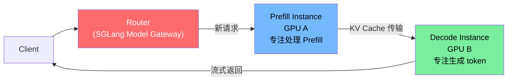
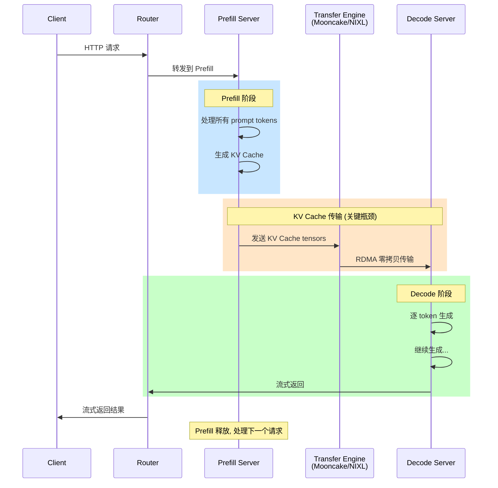
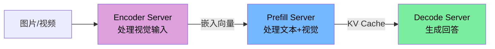
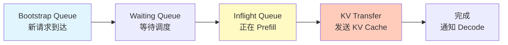
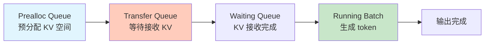

# 高级教程：PD 分离部署 (Prefill-Decode Disaggregation)

> **定位**: 毕业后选修，面向生产部署场景
> **预计用时**: 6-10 小时
> **前提**: 完成 8 周主线课程 + 理解 [多卡分布式推理](./multi-gpu.md)
> **环境**: 2+ 张 NVIDIA GPU，推荐有 RDMA/InfiniBand 网络

---

## 一、为什么需要 PD 分离？

### 1.1 问题：Prefill 干扰 Decode

在统一调度的 Server 中，Prefill 和 Decode 共享 GPU：

```
Timeline (统一调度):
  GPU: [Decode batch][Prefill (长!)][Decode batch][Prefill (长!)]
                     ↑                            ↑
                 Decode 被阻塞               Decode 又被阻塞
                 TPOT 飙升 ⚠️                TPOT 飙升 ⚠️

  用户体验: 输出卡顿 → 流畅 → 卡顿 → 流畅
```

### 1.2 解决：分开部署



**收益**:
- Decode 不再被 Prefill 打断，TPOT 稳定
- Prefill 和 Decode 可以独立扩缩容
- 可以为 Prefill/Decode 选择不同的 GPU 型号

**代价**:
- KV Cache 传输开销（需要高速网络）
- 系统复杂度增加（多个 Server + Router）

### 1.3 PD 分离的完整数据流



---

## 二、传输后端

KV Cache 传输是 PD 分离的**关键瓶颈**。SGLang 支持多种传输后端：

| 后端 | 特点 | 适用场景 |
|------|------|---------|
| **Mooncake** | 基于 RDMA，支持 NVLink | 生产推荐，需要安装 `mooncake-transfer-engine` |
| **NIXL** | 基于 UCX，多种传输插件 | NVIDIA 官方方案 |
| **Fake** | 不传输，用于测试 | 开发调试 |

### 安装传输后端

```bash
# Mooncake (推荐)
pip install mooncake-transfer-engine

# 或 NIXL
pip install nixl
```

---

## 三、单节点 PD 分离实战

### 3.1 最小化部署 (2 张 GPU)

```bash
# 终端 1: Prefill Server (GPU 0)
python3 -m sglang.launch_server \
    --model-path meta-llama/Llama-3.1-8B-Instruct \
    --disaggregation-mode prefill \
    --port 30000 \
    --disaggregation-transfer-backend mooncake \
    --disaggregation-ib-device mlx5_roce0

# 终端 2: Decode Server (GPU 1)
python3 -m sglang.launch_server \
    --model-path meta-llama/Llama-3.1-8B-Instruct \
    --disaggregation-mode decode \
    --port 30001 \
    --base-gpu-id 1 \
    --disaggregation-transfer-backend mooncake \
    --disaggregation-ib-device mlx5_roce0

# 终端 3: Router
python3 -m sglang_router.launch_router \
    --pd-disaggregation \
    --prefill http://127.0.0.1:30000 \
    --decode http://127.0.0.1:30001 \
    --host 0.0.0.0 \
    --port 8000
```

### 3.2 验证部署

```python
import openai

# 通过 Router 访问 (端口 8000)
client = openai.Client(base_url="http://localhost:8000/v1", api_key="none")

resp = client.chat.completions.create(
    model="default",
    messages=[{"role": "user", "content": "Hello! Tell me about SGLang."}],
    max_tokens=64
)
print(resp.choices[0].message.content)
```

### 3.3 观察日志

启动后观察三个终端的日志：

**Prefill Server 日志**:
```
# 收到请求 → Prefill → 发送 KV Cache
[Prefill] Processing request rid=xxx, input_len=15
[Prefill] KV transfer started, size=xxx MB
[Prefill] KV transfer completed in 2.3ms
```

**Decode Server 日志**:
```
# 接收 KV Cache → 开始 Decode
[Decode] Received KV cache for rid=xxx
[Decode] Generating tokens...
[Decode] Request completed, output_len=64
```

**Router 日志**:
```
# 请求路由
[Router] New request → Prefill server
[Router] KV transfer done → Decode server
```

---

## 四、PD 分离关键参数

### 4.1 Prefill Server 参数

| 参数 | 含义 | 示例 |
|------|------|------|
| `--disaggregation-mode prefill` | 设为 Prefill 模式 | 必须 |
| `--disaggregation-transfer-backend` | 传输后端 | `mooncake` / `nixl` |
| `--disaggregation-ib-device` | InfiniBand/RDMA 设备 | `mlx5_roce0` |
| `--disaggregation-bootstrap-port` | Bootstrap 端口 | `8998` (默认) |

### 4.2 Decode Server 参数

| 参数 | 含义 | 示例 |
|------|------|------|
| `--disaggregation-mode decode` | 设为 Decode 模式 | 必须 |
| `--base-gpu-id` | 起始 GPU ID | `1` (单节点多卡时) |
| `--disaggregation-decode-enable-radix-cache` | Decode 端启用缓存 | 可选 |
| `--max-running-requests` | 最大并发 Decode 请求 | `128` |
| `--num-reserved-decode-tokens` | 预留 Decode token 空间 | `512` |

### 4.3 Router 参数

```bash
python3 -m sglang_router.launch_router \
    --pd-disaggregation \
    --prefill http://prefill-host:30000 \
    --decode http://decode-host:30001 \
    --host 0.0.0.0 \
    --port 8000
```

---

## 五、PD 分离 + 分布式并行

### 5.1 PD + TP

大模型需要 TP 来放进 GPU，同时用 PD 分离：

```bash
# Prefill: 2 GPU (TP=2)
python3 -m sglang.launch_server \
    --model-path meta-llama/Llama-3.1-70B-Instruct \
    --disaggregation-mode prefill \
    --tp-size 2 \
    --port 30000 \
    --disaggregation-transfer-backend mooncake

# Decode: 2 GPU (TP=2)
python3 -m sglang.launch_server \
    --model-path meta-llama/Llama-3.1-70B-Instruct \
    --disaggregation-mode decode \
    --tp-size 2 \
    --base-gpu-id 2 \
    --port 30001 \
    --disaggregation-transfer-backend mooncake
```

### 5.2 PD + DPA + EP (DeepSeek 生产配置)

```bash
# Prefill 节点 (2 节点, 每节点 8 GPU)
python3 -m sglang.launch_server \
    --model-path deepseek-ai/DeepSeek-V3-0324 \
    --disaggregation-mode prefill \
    --tp-size 16 \
    --dp-size 8 \
    --enable-dp-attention \
    --moe-a2a-backend deepep \
    --dist-init-addr prefill-master:5000 \
    --nnodes 2 \
    --node-rank 0 \
    --port 30000

# Decode 节点 (2 节点, 每节点 8 GPU)
python3 -m sglang.launch_server \
    --model-path deepseek-ai/DeepSeek-V3-0324 \
    --disaggregation-mode decode \
    --tp-size 16 \
    --dp-size 8 \
    --enable-dp-attention \
    --moe-a2a-backend deepep \
    --dist-init-addr decode-master:5000 \
    --nnodes 2 \
    --node-rank 0 \
    --port 30001 \
    --max-running-requests 128
```

---

## 六、EPD 分离 (Encoder-Prefill-Decode)

多模态模型 (如 VLM) 可以进一步把 Encoder 也分离出来：



```bash
# Encoder Server
python3 -m sglang.launch_server \
    --model-path Qwen/Qwen3-VL-8B-Instruct \
    --encoder-only \
    --encoder-transfer-backend mooncake \
    --port 30000

# Language-only Prefill Server
python3 -m sglang.launch_server \
    --model-path Qwen/Qwen3-VL-8B-Instruct \
    --language-only \
    --encoder-urls http://127.0.0.1:30000 \
    --encoder-transfer-backend mooncake \
    --port 30002

# Decode Server
python3 -m sglang.launch_server \
    --model-path Qwen/Qwen3-VL-8B-Instruct \
    --disaggregation-mode decode \
    --port 30003
```

---

## 七、性能实验

### 7.1 PD 分离 vs 统一调度

```bash
# 实验 1: 统一调度 (baseline)
python3 -m sglang.launch_server \
    --model-path meta-llama/Llama-3.1-8B-Instruct \
    --port 30000

python3 -m sglang.bench_serving --port 30000 --dataset-name random \
    --num-prompts 200 --random-input-len 512 --random-output-len 128

# 实验 2: PD 分离 (需要 2 GPU)
# 启动 Prefill + Decode + Router (如第三节)

python3 -m sglang.bench_serving --port 8000 --dataset-name random \
    --num-prompts 200 --random-input-len 512 --random-output-len 128
```

**对比指标**:

| 指标 | 统一调度 | PD 分离 | 预期 |
|------|---------|---------|------|
| TTFT | | | PD 更低（Prefill 不被 Decode 干扰） |
| TPOT (P99) | | | PD 更稳定 |
| Throughput | | | 统一更高（少了传输开销） |

### 7.2 KV 传输延迟分析

```python
# 估算 KV Cache 传输量
# Llama-8B, input_len=512:
#   KV Cache = 2 (K,V) × 32 (layers) × 512 (seq_len)
#              × 8 (kv_heads) × 128 (head_dim) × 2 (FP16 bytes)
#            = 512 MB

# InfiniBand 200Gbps (25GB/s): 512MB / 25GB/s ≈ 20ms
# NVLink 900GB/s: 512MB / 900GB/s ≈ 0.6ms
```

**思考**: KV 传输延迟主要取决于网络带宽。在什么 input 长度下，传输延迟超过 Prefill 计算时间？

---

## 八、源码架构

### 8.1 目录结构

```
python/sglang/srt/disaggregation/
├── prefill.py                # Prefill Server 生命周期
├── decode.py                 # Decode Server 生命周期
├── kv_events.py              # KV Cache 传输事件追踪
│
├── base/                     # 基础连接器
│   └── conn.py
├── mooncake/                 # Mooncake 传输引擎
│   ├── conn.py
│   ├── transfer_engine.py
│   └── utils.py
├── nixl/                     # NIXL 传输引擎
│   └── conn.py
├── fake/                     # 测试用假传输
│   └── conn.py
│
├── common/                   # 公共工具
│   ├── conn.py               # KVManager/Receiver
│   ├── staging_handler.py    # GPU staging buffer
│   └── utils.py
│
├── decode_hicache_mixin.py   # HiCache: 分层缓存 (GPU+CPU+SSD)
└── decode_kvcache_offload_manager.py  # KV offload 管理
```

### 8.2 关键流程

```bash
# Prefill Server 的关键方法
grep -n "class\|def " python/sglang/srt/disaggregation/prefill.py | head -20

# Decode Server 的关键方法
grep -n "class\|def " python/sglang/srt/disaggregation/decode.py | head -20

# KV 传输的核心接口
grep -n "class\|def transfer\|def send\|def recv" \
    python/sglang/srt/disaggregation/common/conn.py | head -15
```

### 8.3 Prefill Server 内部状态机



### 8.4 Decode Server 内部状态机



---

## 九、HiCache — KV Cache 分层缓存

HiCache 是 Decode Server 的优化：把不活跃的 KV Cache 从 GPU 卸载到 CPU 或 SSD：

```
GPU (热数据) → CPU (温数据) → SSD (冷数据)
                ↑                 ↑
            卸载/恢复          卸载/恢复
```

**启用方式**:
```bash
python3 -m sglang.launch_server \
    --model-path meta-llama/Llama-3.1-8B-Instruct \
    --disaggregation-mode decode \
    --disaggregation-decode-enable-offload-kvcache \
    --port 30001
```

**效果**: Decode Server 能支持更多并发请求（KV Cache 不全在 GPU 上）。

---

## 十、自查清单

- [ ] PD 分离的核心动机是什么？解决了统一调度的什么问题？
- [ ] KV Cache 传输的瓶颈是什么？延迟取决于哪些因素？
- [ ] Mooncake 和 NIXL 传输后端的区别是什么？
- [ ] PD 分离对 TTFT 和 TPOT 分别有什么影响？
- [ ] 什么场景下 PD 分离的收益最大？什么场景下不值得？
- [ ] EPD 分离相比 PD 分离多了什么？适用于什么模型？
- [ ] HiCache 的分层卸载策略解决了什么问题？

---

## 十一、参考文档

- SGLang 官方: `docs/advanced_features/pd_disaggregation.md` — 完整部署指南
- SGLang 官方: `docs/advanced_features/epd_disaggregation.md` — EPD 分离
- SGLang 官方: `docs/references/multi_node_deployment/` — 多节点部署案例
- Week 4 基础: [speculative-and-distributed.md](./speculative-and-distributed.md) — PD 分离概念入门
- 相关教程: [多卡分布式推理](./multi-gpu.md) — TP/DP/EP 基础

---

> 掌握 PD 分离后，你已经具备了 SGLang 生产部署的核心知识。
> 继续探索：阅读 `docs/` 目录下的官方文档，关注 GitHub 上的最新 PR。
