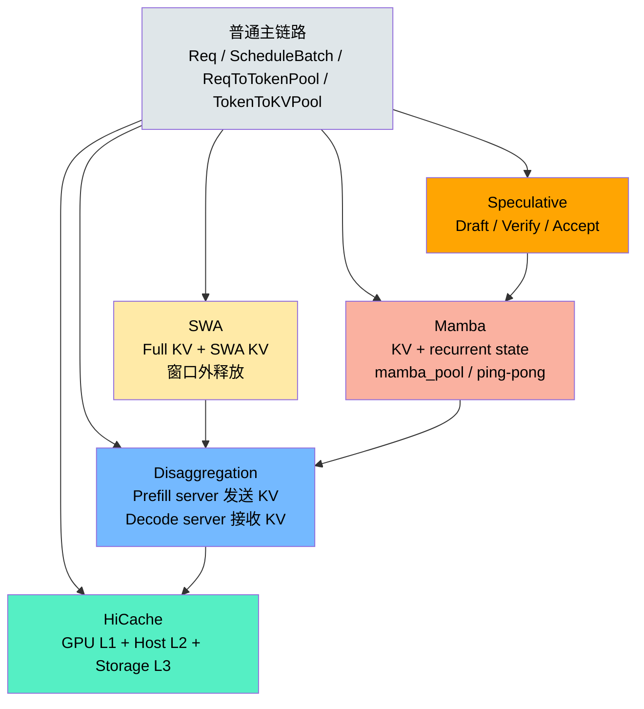

# 高级源码篇：复杂 Cache 与 Decode 扩展总览

> 定位：Week2/Week3 之后的源码专题。目标不是先学会部署，而是看懂高级路径如何改写普通 `Req -> ScheduleBatch -> KV Pool -> ForwardBatch` 主链路。
>
> 前置：[Week2 Scheduler 和 RadixCache](../02-core-systems/week2-detailed.md)、[Week3 ModelRunner 和采样](../02-core-systems/week3-detailed.md)

## 阅读顺序

| 顺序 | 文档 | 先解决的问题 |
|---|---|---|
| 1 | [disaggregation-source.md](./disaggregation-source.md) | Prefill 和 Decode 分离后，请求、KV、metadata 怎么跨实例走 |
| 2 | [hicache-source.md](./hicache-source.md) | KV 不只在 GPU，L2 host / L3 storage 怎么命中和恢复 |
| 3 | [speculative-source.md](./speculative-source.md) | 一次 decode 接受多个 token 时，`output_ids` 和 KV 长度怎么维护 |
| 4 | [swa-source.md](./swa-source.md) | Sliding Window Attention 为什么能提前释放部分 KV |
| 5 | [mamba-source.md](./mamba-source.md) | Mamba/Hybrid 模型为什么还要额外状态池，不只是 KV cache |

## 总图



## 一句话区分

| 机制 | 它改变了什么 | 主要新增状态 |
|---|---|---|
| Disaggregation | 把 prefill 和 decode 拆到不同 engine，中间传 KV | `bootstrap_room`、`kv_sender/kv_receiver`、`MetadataBuffers`、decode prealloc/transfer queue |
| HiCache | 把 prefix cache 扩成 GPU/Host/Storage 多层 | `host_hit_length`、`storage_hit_length`、`ongoing_prefetch`、`ongoing_load_back` |
| Speculative | 一次 target forward 验证多个 draft token | `spec_info`、`accept_lens`、`num_correct_drafts`、`kv_allocated_len > kv_committed_len` |
| SWA | SWA 层只保留滑动窗口范围的 KV | `swa_evicted_seqlen`、`swa_host_hit_length`、`free_swa`、tombstone |
| Mamba | 除 attention KV 外，还维护 recurrent state | `mamba_pool_idx`、`MambaPool`、`HybridReqToTokenPool`、ping-pong track buffer |

## 共同心智模型

这些高级路径都没有推翻 Week2 的基本模型：

```text
token 序列: origin_input_ids + output_ids
请求映射: req_pool_idx + token_pos -> token_index
物理存储: token_index -> GPU/Host/Storage 上的 KV 或状态
```

它们真正改变的是：

| 改变点 | 普通路径 | 高级路径 |
|---|---|---|
| KV 位置 | 只考虑 GPU KV pool | 可能在 GPU、host、storage、远端 decode worker |
| token 数 | 每次 decode 通常 1 个 token | spec 可一次接受多个 token |
| 状态类型 | attention K/V | Mamba state、SWA KV、DSA/MLA 等额外状态 |
| 生命周期 | 请求结束后插入/释放 | 可跨 engine、跨层级、跨窗口、跨 draft/verify 回滚 |

## 源码入口

| 专题 | 起点 |
|---|---|
| Disaggregation | `python/sglang/srt/disaggregation/prefill.py`、`decode.py`、`base/conn.py` |
| HiCache | `python/sglang/srt/mem_cache/hiradix_cache.py`、`hicache_storage.py`、`disaggregation/decode_hicache_mixin.py` |
| Speculative | `python/sglang/srt/speculative/spec_info.py`、`eagle_info.py`、`eagle_worker_v2.py` |
| SWA | `python/sglang/srt/mem_cache/swa_radix_cache.py`、`swa_memory_pool.py`、`schedule_batch.py:maybe_evict_swa` |
| Mamba | `python/sglang/srt/mem_cache/memory_pool.py:HybridReqToTokenPool`、`mamba_radix_cache.py`、`hi_mamba_radix_cache.py` |
