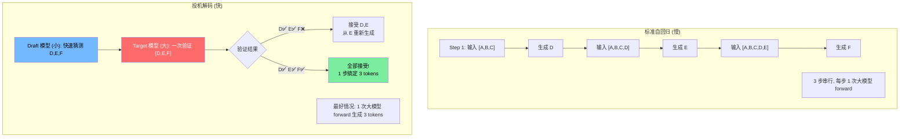
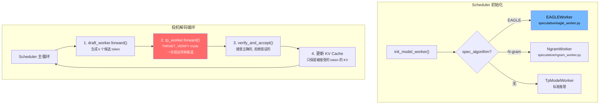
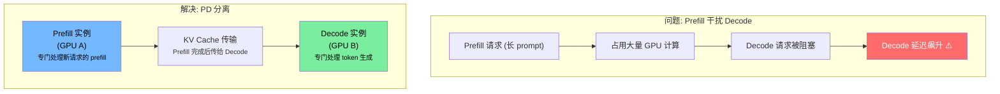
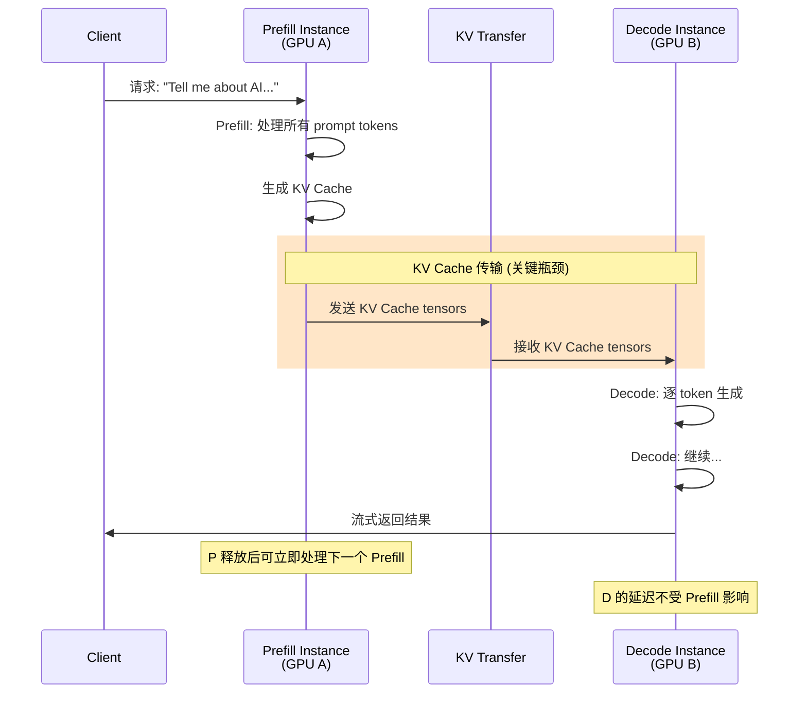
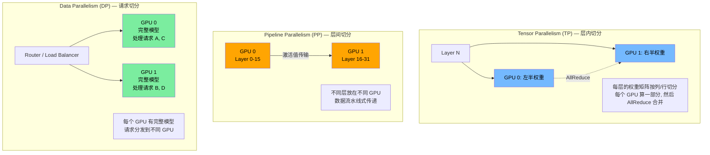
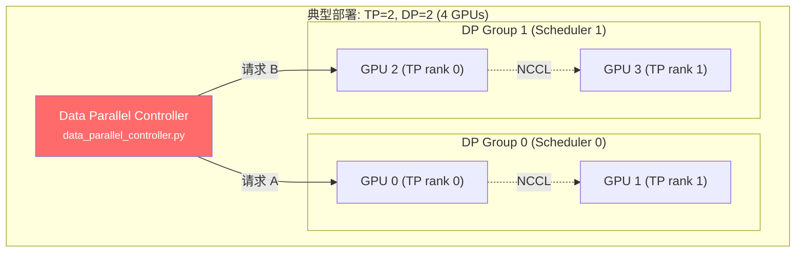
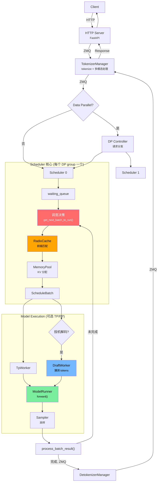
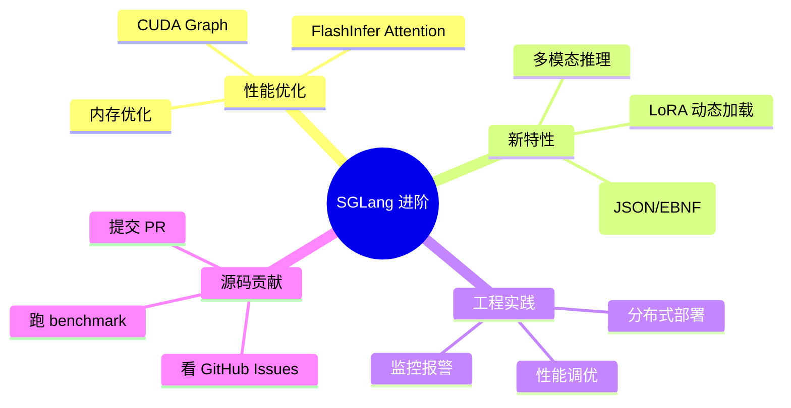

# Week 4: 高级特性与源码实战

> 目标：了解投机解码、PD 分离、分布式并行的核心思想；完成端到端的知识串联。
> 时间：~10 小时 (5 天 × 2h)
> 前置：[Week 1](../01-architecture/foundations.md)-[Week 3](../02-core-systems/model-execution.md) 完成，已掌握 Scheduler、Cache、ModelRunner
>
> **配套资源**: [性能直觉: 投机解码为什么有效](../05-reference/performance-intuition.md#六设计决策的定量理由) | [FAQ: TP vs PP vs DP](../05-reference/faq.md#q7-tp-vs-pp-vs-dp--三种并行的区别)
>
> **注意**: 本周为"概念导览"层级，每个高级特性只用 ~2h 介绍核心思想。如需深入某个方向（如投机解码的 EAGLE 实现），建议额外投入 1-2 周专题学习。

---

## Day 1-2: 投机解码 (Speculative Decoding) (4h)

### 学习目标
- 理解投机解码为什么能加速生成
- 掌握 EAGLE 算法的核心流程
- 理解 Draft-Verify 范式在 SGLang 中的实现

### 生活类比：先猜后验

想象一个场景 —— **老师逐字听写 vs 学生先写老师再批改**：

```
传统方式 (逐字听写):
  老师念一个字 → 学生写一个字 → 老师再念下一个字 → ...
  速度: 完全串行，老师念多快就多快

投机解码方式 (先猜后验):
  学生 (draft): "我猜接下来是 今天天气很好"  (快速猜 5 个字)
  老师 (target): 一次性批改 "今天天气很好"
  老师: "今天天气" ✓✓✓✓, "很" ✗ → 应该是 "不"
  结果: 一次批改就确认了 4 个字！比逐字念快多了
```

**关键洞察**: 大模型（老师）验证一批 token 的速度 ≈ 生成 1 个 token 的速度（因为 GPU 并行计算）。所以用小模型快速猜，大模型一次性验证，总速度就快了。

### 投机解码核心思想



### EAGLE 算法流程

```mermaid
sequenceDiagram
    participant D as Draft Model<br/>(小模型/EAGLE head)
    participant T as Target Model<br/>(完整大模型)
    participant S as Scheduler

    Note over S: 已有 context [t1, t2, t3]

    rect rgb(200, 220, 255)
    Note over D: Draft Phase
    D->>D: forward([t3]) → 猜测 t4'
    D->>D: forward([t4']) → 猜测 t5'
    D->>D: forward([t5']) → 猜测 t6'
    Note over D: 猜测序列: [t4', t5', t6']
    end

    rect rgb(255, 220, 200)
    Note over T: Verify Phase
    T->>T: forward([t3, t4', t5', t6'])<br/>一次 prefill 验证全部
    Note over T: 得到每个位置的真实 logits
    end

    rect rgb(200, 255, 220)
    Note over S: Accept/Reject
    S->>S: 比较 draft vs target 的 logits
    S->>S: t4': P_target(t4') ≥ P_draft(t4') → ✅ 接受
    S->>S: t5': P_target(t5') ≥ P_draft(t5') → ✅ 接受
    S->>S: t6': P_target(t6') < P_draft(t6') → ❌ 拒绝
    S->>S: 从 target logits[5] 重新采样 → t6''
    Note over S: 最终接受: [t4', t5', t6'']<br/>3 tokens, 但只用了 1 次 target forward!
    end

    style D fill:#74b9ff,color:#000
    style T fill:#ff6b6b,color:#fff
```

### SGLang 中的实现



### 源码阅读指引

**文件**: `python/sglang/srt/speculative/eagle_worker.py`
- 搜索 `class EAGLEWorker` (注意全大写)
- 关注 `forward_draft_*` 方法 — 如何生成 draft tokens
- 关注 `verify_*` 方法 — 如何验证

**文件**: `python/sglang/srt/speculative/eagle_worker_v2.py`
- EAGLE v2 版本，使用 `DRAFT_EXTEND_V2` ForwardMode
- 相比 v1 优化了 draft 阶段的效率

**文件**: `python/sglang/srt/managers/scheduler.py`
- 搜索 `spec_algorithm` — 看 Scheduler 如何区分投机/标准模式
- 搜索 `TARGET_VERIFY` — 验证 phase 的处理

### 动手练习 4.1

```bash
# 找到 ForwardMode 中投机解码相关的模式
grep -n "VERIFY\|DRAFT" python/sglang/srt/model_executor/forward_batch_info.py

# 找到 EAGLE worker 的核心方法
grep -n "def forward" python/sglang/srt/speculative/eagle_worker.py | head -10

# 思考: 投机解码在什么场景下收益最大？什么时候反而变慢？
# 提示: 考虑 draft 模型的准确率和 overhead
```

---

## Day 3: PD 分离 (Prefill-Decode Disaggregation) (2h)

### 学习目标
- 理解为什么要将 Prefill 和 Decode 分离到不同实例
- 掌握 PD 分离的通信流程

> 💡 **初学者提示**: PD 分离是一个**部署优化**，不是模型本身的改进。它解决的问题是：在生产环境中，当大量新请求涌入时，prefill 的重计算会拖慢正在生成回答的请求（decode）。把它们分开部署，各干各的，互不干扰。如果你只有 1 张 GPU 做学习，这部分了解概念即可。

### 为什么要 PD 分离？



### PD 分离流程



### 源码阅读指引

**目录**: `python/sglang/srt/disaggregation/`

核心文件:
- `prefill.py` — Prefill 实例的逻辑
- `decode.py` — Decode 实例的逻辑
- `encode_server.py` — KV Cache 编码和发送
- `encode_receiver.py` — KV Cache 接收和解码
- `kv_events.py` — KV Cache 传输事件

KV 传输后端 (可插拔):
- `nixl/` — NIXL 高性能传输 (NVIDIA)
- `mooncake/` — Mooncake 传输后端
- `mori/` — Mori 传输后端
- `base/` — 基础传输实现
- `common/` — 公共工具

其他:
- `decode_hicache_mixin.py` — HiCache: KV Cache 分层缓存 (GPU+CPU+SSD)
- `decode_kvcache_offload_manager.py` — KV Cache offload 到 CPU/SSD

重点理解:
1. Prefill 实例如何将 KV Cache 传输给 Decode 实例
2. Decode 实例如何接收 KV Cache 并继续生成
3. 不同传输后端的适用场景 (同机 vs 跨机)

### 动手练习 4.2

```bash
# 找到 PD 分离的入口
grep -rn "disaggregation" python/sglang/srt/entrypoints/engine.py | head -10

# 找到 KV transfer 的核心逻辑
grep -n "def transfer\|def send\|def recv" python/sglang/srt/disaggregation/encode_server.py | head -10

# 阅读 docs 中的设计文档
cat docs/advanced_features/pd_disaggregation.md | head -100
```

---

## Day 4: 分布式并行 (TP/PP/DP) (2h)

### 学习目标
- 理解 Tensor Parallelism、Pipeline Parallelism、Data Parallelism 的区别
- 了解 SGLang 中的实现方式

> 💡 **初学者提示 — 为什么需要并行？**
>
> 大模型太大了（如 70B 参数 = ~140GB），一张 GPU（最大 80GB）装不下。需要把模型"拆"到多张 GPU 上。拆法不同就是不同的并行策略：
> - **TP (Tensor Parallel)**: 把每一层横着切，每个 GPU 算一部分。像几个人合力搬一块大桌子。
> - **PP (Pipeline Parallel)**: 把模型竖着切，前 16 层在 GPU 0，后 16 层在 GPU 1。像流水线工人。
> - **DP (Data Parallel)**: 每个 GPU 放完整模型的副本，各处理不同的请求。像开多个窗口并行服务。
>
> 如果模型小（如 7B），一张 GPU 就够，不需要 TP/PP。DP 在任何规模都有用（扩大吞吐量）。

### 三种并行方式



### SGLang 中的组合使用



### 源码阅读指引

**文件**: `python/sglang/srt/distributed/parallel_state.py`
- TP/PP 的初始化逻辑

**文件**: `python/sglang/srt/managers/data_parallel_controller.py`
- DP 控制器如何将请求分发到不同 Scheduler

**文件**: `python/sglang/srt/managers/tp_worker.py`
- TP Worker 如何在多 GPU 间协调

### 动手练习 4.3

```bash
# 找到 TP 初始化
grep -n "tensor_parallel\|tp_size\|tp_rank" python/sglang/srt/managers/tp_worker.py | head -15

# 找到 DP 请求分发逻辑
grep -n "def select\|def dispatch\|round_robin" python/sglang/srt/managers/data_parallel_controller.py | head -10

# 思考: TP=4 和 DP=4 在什么场景下各有优势？
```

---

## Day 5: 知识串联与综合实战 (2h)

### 学习目标
- 将 4 周学到的知识串联成完整的系统理解
- 画出自己理解的完整架构图
- 整理关键设计决策背后的原因

### 最终综合架构图



### 关键设计决策总结

| 设计决策 | 为什么这样做 | 代价 |
|---|---|---|
| **多进程架构** | CPU/GPU 解耦，tokenize 不占 GPU 时间 | ZMQ 通信开销，复杂度增加 |
| **RadixCache** | 前缀复用，对话/batch 场景省大量计算 | 内存占用，树维护开销 |
| **Continuous Batching** | GPU 利用率接近 100% | 调度逻辑复杂 |
| **两级内存池** | 非连续 KV 分配，减少碎片 | 间接寻址开销 |
| **投机解码** | 减少大模型 forward 次数 | 需要额外的 draft 模型 |
| **PD 分离** | Prefill 不干扰 Decode 延迟 | KV 传输开销，系统复杂度 |
| **ZMQ IPC** | 低延迟，零拷贝，灵活拓扑 | 调试困难，序列化开销 |

### 最终练习: 画自己的架构图

**任务**: 不看任何文档，在纸上或用工具画出你对 SGLang 的完整理解:

1. 画出所有进程和它们的通信关系
2. 画出一个请求的完整生命周期
3. 标注 RadixCache 在哪个环节发挥作用
4. 标注 Continuous Batching 的体现
5. (可选) 标注投机解码的 draft-verify 循环

画完后与 `00-overview.md` 中的架构图对比，检查遗漏。

---

## Week 4 自查清单

- [ ] 投机解码的 Draft-Verify 范式是什么？为什么能加速？
- [ ] EAGLE 算法相比 N-gram 的优势是什么？
- [ ] PD 分离解决了什么问题？KV Cache 传输是如何实现的？
- [ ] TP、PP、DP 三种并行各适用于什么场景？
- [ ] SGLang 中如何组合使用多种并行策略？
- [ ] 你能不看代码画出 SGLang 的完整架构图吗？
- [ ] 对比朴素的单进程推理服务，SGLang 的核心技术创新有哪些？

---

## 4 周学习完成后的自我评估

### 水平检查: 能否回答这些问题

**初级 (Week 1)**
- [ ] SGLang 有哪些进程？用什么通信？
- [ ] 一个请求经历哪些阶段？

**中级 (Week 2-3)**
- [ ] RadixCache 如何实现前缀复用？
- [ ] Continuous Batching 的调度策略是什么？
- [ ] EXTEND 和 DECODE 的 Attention 有何不同？

**高级 (Week 4)**
- [ ] 投机解码的正确性如何保证？
- [ ] PD 分离的瓶颈在哪里？
- [ ] 如果要给 SGLang 加一个新的调度策略，需要改哪些文件？

### 后续深入方向



---

## 进入 Phase 2: GPU 实战

恭喜完成 Phase 1！你已经在 Mac 上理解了 SGLang 的完整架构。但目前你还没有：
- 真正启动过一个 SGLang Server
- 用实测数据验证过你的纸面计算
- 写过一行 SGLang 代码

**Phase 2 (Week 5-8)** 将在 NVIDIA GPU 上完成这些。你需要：

1. **准备 GPU 环境** — 按 [gpu-setup.md](../setup/gpu-setup.md) 搭建
2. **Week 5**: 启动 Server、跑 Benchmark、实验调优参数
3. **Week 6**: 用 Profiler 看 GPU 内部行为、做故障排查、分析真实 PR
4. **Week 7**: 理解测试体系和 CI，完成第一次代码修改
5. **Week 8**: 独立完成一个小特性，提交你的第一个 PR

> **下一步**: [GPU 环境搭建指南](../setup/gpu-setup.md) → [Week 5: Server 启动与性能基准](./10-week5-server-and-benchmark.md)
