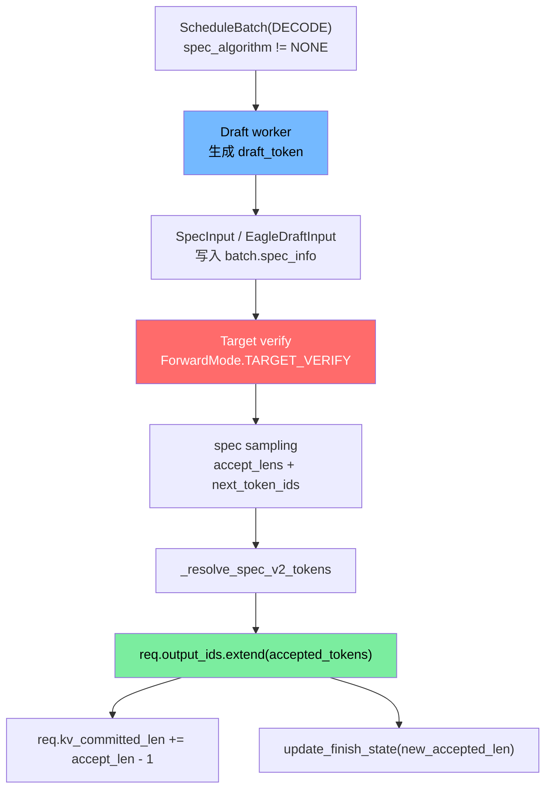

# 高级源码篇：Speculative Decoding

> 目标：看懂一次 decode 接受多个 token 时，`Req.output_ids`、KV 分配、finish 检查和 metrics 怎么保持一致。

## 核心结论

普通 decode：

```text
target model forward -> 1 next_token -> req.output_ids.append(token)
```

Speculative decode：

```text
draft 先猜多个 token
target 一次 verify
accept_lens 决定每个 req 接受几个 token
req.output_ids.extend(accepted_tokens)
只把 accepted KV 视为 committed
```

关键风险是：draft/verify 会临时分配比最终接受更多的 KV，所以 `kv_allocated_len` 可能大于 `kv_committed_len`，请求结束或回退时必须释放多余 KV。

## 算法入口

| 对象 | 文件 | 作用 |
|---|---|---|
| `SpeculativeAlgorithm` | `speculative/spec_info.py` | 算法枚举和 worker 工厂 |
| `SpecInput` / `SpecInputType` | `speculative/spec_info.py` | draft/verify 输入的统一基类 |
| `EagleVerifyInput` | `speculative/eagle_info.py` | EAGLE verify 阶段输入 |
| `EAGLEWorkerV2` | `speculative/eagle_worker_v2.py` | EAGLE v2 worker |
| `NGRAMWorker` | `speculative/ngram_worker.py` | N-gram speculative |
| `ForwardMode.TARGET_VERIFY` | `model_executor/forward_batch_info.py` | target verify forward mode |
| `ForwardMode.DRAFT_EXTEND_V2` | `model_executor/forward_batch_info.py` | draft extend v2 mode |

## 总流程



## v1 / v2 的主要区别

| 路径 | 特点 |
|---|---|
| spec v1 | verify 阶段内部已经处理部分 `output_ids`、grammar、finish，batch result processor 需要跳过重复处理 |
| spec v2 | batch result processor 统一解析 `accept_lens`，把 accepted token list 写回 `Req` |

源码里 `ScheduleBatch.is_spec_v2()` 通过 `spec_algorithm.supports_spec_v2()` 判断。EAGLE、Standalone、NGRAM 都走 v2。

## EAGLE verify 如何分配 KV

`EagleVerifyInput.prepare_for_verify()` 会：

```text
1. batch.input_ids = draft_token
2. 为 draft_token 分配 out_cache_loc
3. assign_req_to_token_pool_func(...)
   把 verify 阶段临时 KV slot 写进 ReqToTokenPool
4. 构造 attention 参数，让 target model 一次验证多个位置
```

这里分配的是“候选 token 的 KV”。最终接受多少由 target sampling 决定，不接受的尾部在释放/回退路径里处理。

## accept_lens 怎么落回 Req

源码入口：`SchedulerBatchResultProcessor._resolve_spec_v2_tokens`

```text
1. result.accept_lens 从 GPU/CPU result 取出
2. num_correct_drafts = sum(accept_lens) - batch_size
3. stride = result.speculative_num_draft_tokens
4. 对每个 req:
   accepted = next_token_ids[i * stride : i * stride + accept_lens[i]]
5. req.kv_committed_len += accept_lens[i] - 1
6. 更新 spec metrics:
   spec_verify_ct
   spec_num_correct_drafts
   spec_correct_drafts_histogram
```

为什么 `accept_lens - 1`：普通 decode 本轮已经预期会提交 1 个 token；spec 额外多接受的 draft token 才需要再增加 committed 长度。

## finish 检查为什么要传 `new_accepted_len`

Speculative 一次可能接受多个 token，stop token / stop string 可能出现在 accepted token 的中间。

`Req.update_finish_state(new_accepted_len)` 会：

```text
new_accepted_tokens = output_ids[-new_accepted_len:]
检查 token stop
检查 vocab boundary
检查 stop string / regex
```

如果只检查最后一个 token，会漏掉中间的 stop。

## 与 KV cache 的关系

| 字段 | 普通 decode | speculative decode |
|---|---|---|
| `output_ids` | append 1 个 token | extend 多个 accepted token |
| `kv_committed_len` | 每轮 +1 | + accepted_len，内部按路径拆分更新 |
| `kv_allocated_len` | 通常等于 committed | 可能大于 committed，因为 draft/verify 先分配候选 KV |
| `pop_overallocated_kv_cache` | 通常无多余 | 请求结束时释放未提交候选 KV |
| `check_decode_mem` | 估算每 req 1 token | 需要按 draft token 数、topk、page size 估算 |

## 与 grammar/logprob/reasoning 的关系

| 子系统 | spec 下的变化 |
|---|---|
| grammar | v2 中对 accepted token list 逐个 `accept_token` |
| logprob | accepted token 多个时，logprob 也按 token list 对齐 |
| reasoning tokens | 每个 accepted token 都可能影响 reasoning 计数 |
| Mamba | accepted token 跨 track boundary 时，需要更新 Mamba prefix cache / ping-pong 状态 |

## 读码顺序

```bash
rg -n "class SpeculativeAlgorithm|supports_spec_v2|create_worker" python/sglang/srt/speculative/spec_info.py
rg -n "class EagleVerifyInput|prepare_for_verify" python/sglang/srt/speculative/eagle_info.py
rg -n "_resolve_spec_v2_tokens|process_batch_result_decode|accept_lens" python/sglang/srt/managers/scheduler_components/batch_result_processor.py
rg -n "TARGET_VERIFY|DRAFT_EXTEND_V2" python/sglang/srt/model_executor/forward_batch_info.py
rg -n "new_tokens_required_next_decode|check_decode_mem|is_spec_v2" python/sglang/srt/managers/schedule_batch.py
```
