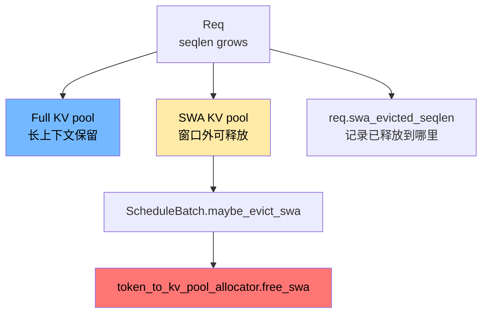

# 高级源码篇：SWA Sliding Window Attention Cache

> 目标：看懂 SWA 为什么不是普通 KV cache 的简单子集，以及窗口外 KV 如何释放。

## 核心结论

SWA 层只需要最近一个 sliding window 内的 KV。对于 SWA 层，窗口外 token 的 KV 可以比 full attention 层更早释放。

因此 SWA 路径把 KV 分成两类：

```text
full attention KV: 仍按完整上下文保留
SWA KV: 只保留滑动窗口需要的尾部
```

## 总图



## 关键对象

| 对象 | 文件 | 作用 |
|---|---|---|
| `SWAKVPool` | `mem_cache/swa_memory_pool.py` | full KV pool + SWA sub-pool 的组合 |
| `BaseSWAKVPool` | `mem_cache/base_swa_memory_pool.py` | SWA pool 抽象 |
| `SWATokenToKVPoolAllocator` | `mem_cache/allocator/swa.py` | 同时管理 full 和 SWA slot |
| `SWARadixCache` | `mem_cache/swa_radix_cache.py` | 支持 SWA tombstone/lock 的 prefix cache |
| `ScheduleBatch.maybe_evict_swa` | `managers/schedule_batch.py` | 每轮调度时释放窗口外 SWA KV |
| `Req.swa_evicted_seqlen` | `managers/schedule_batch.py` | 本请求 SWA KV 已释放到的序列位置 |

## SWAKVPool 做了什么

`SWAKVPool` 持有两个 pool：

| pool | 存什么 |
|---|---|
| inherited full pool | full attention 层的 KV |
| `swa_kv_pool` | SWA attention 层的 KV |

模型层写 KV 时，`SWAKVPool.set_kv_buffer` 根据 `layer_id` 判断这一层是不是 SWA 层：

```text
full layer -> 写 full loc
SWA layer  -> 先 full loc -> swa loc，再写 swa_kv_pool
```

`full_to_swa_index_mapping` 负责把普通 token slot 映射到 SWA sub-pool slot。

## 什么时候释放 SWA KV

源码入口：`ScheduleBatch.maybe_evict_swa`

```text
1. 如果 tree_cache.supports_swa()
2. 取 sliding_window_size
3. 对每个 req:
   - 计算 pre_len / decode 位置
   - 如果窗口已经滑过一段 token
   - 调 _evict_swa(req, pre_len)
4. _evict_swa:
   - 计算 new_swa_evicted_seqlen
   - 从 req_to_token_pool 取要释放的 slots
   - token_to_kv_pool_allocator.free_swa(free_slots)
   - 更新 req.swa_evicted_seqlen
```

`swa_evicted_seqlen` 是关键保护：它避免同一段 SWA KV 被重复释放。

## cache_protected_len 和 tombstone

SWA 与 radix cache 交叉时更复杂：

| 概念 | 含义 |
|---|---|
| `cache_protected_len` | radix tree 已保护/管理的前缀长度 |
| `swa_evicted_seqlen` | SWA pool 已经释放到的位置 |
| tombstone | tree 中仍有逻辑节点，但某些 SWA KV 已释放 |
| `dec_swa_lock_only` | 只释放 SWA 部分 lock，让窗口外 SWA 节点可被回收 |

普通 radix 节点如果正在被请求引用，不能驱逐。但 SWA 的窗口滑过后，SWA 部分已经不再需要，即使 full KV 还要保留，也可以单独降低 SWA lock。

## 与 chunked prefill / overlap 的注意点

`maybe_evict_swa` 里有额外判断，因为：

| 场景 | 风险 |
|---|---|
| overlap scheduler | 上一个 extend batch 可能还在 GPU 上跑，不能过早释放 SWA |
| chunked prefill | 前一个 chunk 的 KV 可能仍在被后续 chunk 依赖 |
| page_size > 1 | 释放边界必须 page aligned |

所以 `_evict_swa` 不是简单的 `seqlen - window`，还要考虑 `page_size`、`cache_protected_len`、eviction interval。

## 与 HiCache/Disaggregation 的关系

Disaggregation 传输不只传 full KV，也可能传 SWA state。`send_kv_chunk` 和 decode prealloc 中都能看到 SWA payload 的处理。

HiCache 中 SWA host hit 也单独计数：

```text
req.swa_host_hit_length
match_result.swa_host_hit_length
```

这意味着“prefix hit”需要拆成 full、SWA、Mamba 等多个 component 共同判断。

## 读码顺序

```bash
rg -n "class SWAKVPool|translate_loc_from_full_to_swa|set_kv_buffer" python/sglang/srt/mem_cache/swa_memory_pool.py
rg -n "class SWATokenToKVPoolAllocator|free_swa|swa_available_size" python/sglang/srt/mem_cache/allocator/swa.py
rg -n "class SWARadixCache|tombstone|dec_swa_lock_only" python/sglang/srt/mem_cache/swa_radix_cache.py
rg -n "maybe_evict_swa|_evict_swa|swa_evicted_seqlen" python/sglang/srt/managers/schedule_batch.py
```
