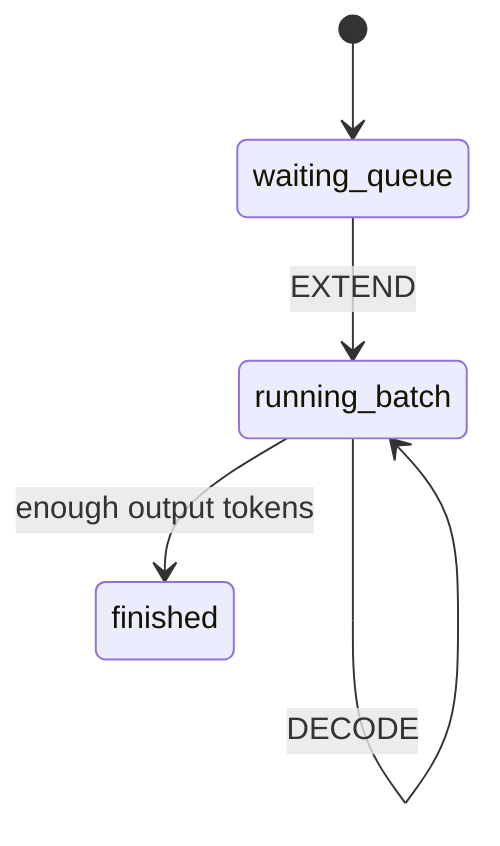

# 练习答案与参考实现方向

> 目标：不是给唯一答案，而是告诉你“做到什么程度算对”。先自己做，再对照。

## 总览

| 练习 | 对应文档 | 验收标准 |
|---|---|---|
| ZMQ 流水线 | Week 1 / exercises | 能说清 4 个角色如何传消息 |
| Scheduler demo | Week 2 | 能解释 waiting/running/finished |
| RadixCache demo | Week 2 | 能解释 prefix match 和 miss suffix |
| ForwardMode 探索 | Week 3 | 能区分 EXTEND/DECODE |
| 采样参数探索 | Week 3 | 能解释 temperature/top_p/max_new_tokens |
| 第一次代码修改 | Week 7 | 能改、测、提交一个小变更 |

## 1. ZMQ 流水线

运行：

```bash
python/.venv/bin/python sglang-learning-docs/06_demo_zmq_pipeline.py
```

参考输出形态：

```text
[http] send request
[tokenizer] text='Hi' -> token_ids=[72, 105]
[scheduler] input_ids=[72, 105] -> output_ids=[72, 105, 33]
[detokenizer] output_ids=[72, 105, 33] -> text='Hi!'
[http] response={'rid': 'req-1', 'text': 'Hi!'}
```

| 问题 | 参考答案 |
|---|---|
| Tokenizer 做了什么？ | 文本转 token ids。demo 用 `ord()` 模拟。 |
| Scheduler 做了什么？ | 模拟模型生成，把 `!` 的 token id 追加到输出。 |
| Detokenizer 做了什么？ | token ids 转回文本。demo 用 `chr()` 模拟。 |
| 为什么真实 SGLang 用 ZMQ？ | 跨进程解耦，Scheduler 崩/慢不会直接阻塞 HTTP 逻辑。 |

## 2. Scheduler demo

运行：

```bash
python sglang-learning-docs/06_demo_scheduler.py
```

正确心智模型：



| 观察点 | 对了说明 |
|---|---|
| 第一步是 `mode=extend` | 新请求必须先 prefill |
| 后续是 `mode=decode` | 请求进入 running 后逐 token 生成 |
| 短请求先完成 | 每个请求有自己的 `max_new_tokens` |
| 完成后从 running 移除 | finished 请求不再参与 decode |

## 3. RadixCache demo

运行：

```bash
python sglang-learning-docs/06_demo_radix_cache.py
```

参考判断：

| 输入 | 命中 | 需要新算 |
|---|---|---|
| `[1,2,3,4,5,99]` | `[1,2,3,4,5]` | `[99]` |
| `[1,2,3,6]` | `[1,2,3,6]` | `[]` |
| `[1,2,0]` | `[1,2]` | `[0]` |
| `[9,8,7,6]` | `[9,8,7]` | `[6]` |

核心结论：

```text
命中越长，需要 prefill 的 token 越少，TTFT 越低。
```

## 4. Week 2 手写 RadixCache

如果你实现了简化版，最低要求：

| 方法 | 必须做到 |
|---|---|
| `insert(tokens)` | 能插入 token 序列 |
| `match_prefix(tokens)` | 返回最长公共前缀 |
| `evict()` | 能删掉一个未被锁定的叶子节点 |

参考伪代码：

```python
class Node:
    def __init__(self):
        self.children = {}
        self.lock_ref = 0
        self.is_leaf = False

def insert(root, tokens):
    node = root
    for token in tokens:
        node = node.children.setdefault(token, Node())
    node.is_leaf = True

def match_prefix(root, tokens):
    node = root
    matched = []
    for token in tokens:
        if token not in node.children:
            break
        matched.append(token)
        node = node.children[token]
    return matched
```

## 5. ForwardMode 探索

运行：

```bash
PYTHONPATH="sglang-learning-docs:python" python/.venv/bin/python -c \
'import conftest; from sglang.srt.model_executor.forward_batch_info import ForwardMode; print(list(ForwardMode))'
```

验收：

| Mode | 你需要会解释 |
|---|---|
| EXTEND | 新请求 prefill |
| DECODE | 逐 token 生成 |
| IDLE | 空转/同步 |
| 其他投机相关 | 暂时知道 Week4 再看 |

## 6. SamplingParams 探索

运行：

```bash
PYTHONPATH="sglang-learning-docs:python" python/.venv/bin/python -c \
'import conftest; from sglang.srt.sampling.sampling_params import SamplingParams; print(SamplingParams(max_new_tokens=8, temperature=0.7))'
```

| 参数 | 参考解释 |
|---|---|
| `max_new_tokens` | 最多生成几个 token |
| `temperature` | 越低越确定，越高越随机 |
| `top_p` | 只在累计概率前 p 的 token 中选 |
| `stop` | 碰到指定文本/条件就停止 |

## 7. 第一次代码修改参考路线

推荐做一个最小变更：给 demo 增加一个字段或测试。

| 路线 | 文件 | 合格标准 |
|---|---|---|
| A | `06_demo_scheduler.py` | 增加 `arrival_step`，模拟请求中途到达 |
| B | `06_demo_radix_cache.py` | 打印 cache hit ratio |
| C | `06_demo_zmq_pipeline.py` | 改成生成两个 token，例如 `Hi!!` |

验证命令：

```bash
python sglang-learning-docs/06_demo_scheduler.py
python sglang-learning-docs/06_demo_radix_cache.py
python/.venv/bin/python sglang-learning-docs/06_demo_zmq_pipeline.py
```

提交前检查：

```bash
git diff -- sglang-learning-docs
python -m py_compile sglang-learning-docs/06_demo_scheduler.py sglang-learning-docs/06_demo_radix_cache.py
python/.venv/bin/python -m py_compile sglang-learning-docs/06_demo_zmq_pipeline.py
```

