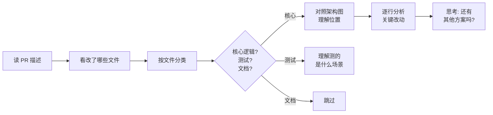
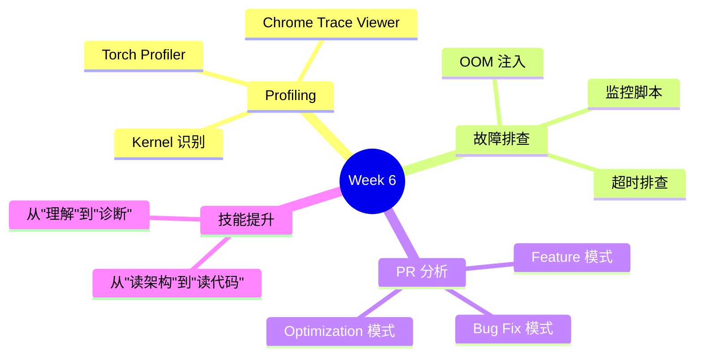

# Week 6: Profiling 与故障排查

> **阶段**: Phase 2 — GPU 实战
> **预计用时**: 10 小时 (5 天 × 2h)
> **前提**: 完成 Week 5 (能熟练启动 Server 和运行 Benchmark)
> **环境**: NVIDIA GPU

---

## 学习目标

```
Week 5: 你学会了启动 Server 和测量性能
Week 6: 你要学会看到 GPU 内部在做什么，以及系统出问题时怎么排查
```

本周结束后你应该能：
1. 用 Torch Profiler 生成 trace 并识别关键 GPU kernel
2. 理解 Prefill 和 Decode 的 trace 差异
3. 对 SGLang Server 进行故障注入和排查
4. 独立分析一个真实 PR 的变更

---

## Day 1-2: Torch Profiler 实战 (4h)

### 学习目标

- 生成 SGLang 的 profiling trace
- 用 Chrome Trace Viewer 分析 GPU 行为
- 识别 attention / linear / sampling 等关键 kernel

### 1.1 生成 Profiling Trace

SGLang 支持通过 API 触发 profiling：

```bash
# 启动 Server
python3 -m sglang.launch_server \
    --model-path Qwen/Qwen2.5-1.5B-Instruct \
    --port 30000
```

```python
# 触发 profiling
import requests

# 开始 profile
requests.post("http://localhost:30000/start_profile")

# 发送一些请求制造负载
import openai
client = openai.Client(base_url="http://localhost:30000/v1", api_key="none")
for i in range(5):
    client.chat.completions.create(
        model="default",
        messages=[{"role": "user", "content": f"Write a short poem about topic {i}"}],
        max_tokens=64
    )

# 停止 profile，获取 trace 文件路径
resp = requests.post("http://localhost:30000/stop_profile")
print(resp.json())  # 包含 trace 文件路径
```

### 1.2 分析 Trace

```bash
# trace 文件通常在 /tmp/ 或当前目录下
# 用 Chrome 打开: chrome://tracing
# 或用 Perfetto: https://ui.perfetto.dev
```

**在 trace 中你会看到**:

```
Timeline:
├── CPU Thread
│   ├── forward()                    ← ModelRunner.forward
│   ├── get_next_batch_to_run()      ← Scheduler 调度
│   └── sampling                     ← 采样
├── GPU Stream
│   ├── flash_attn_kernel            ← Attention 计算
│   ├── gemm_kernel                  ← Linear 层 (矩阵乘法)
│   ├── elementwise_kernel           ← 激活函数
│   └── topk_kernel                  ← Sampling
└── CUDA Graph
    └── replay()                     ← CUDA Graph 回放
```

### 1.3 识别关键 Kernel

| Kernel 名称 | 对应组件 | 学习对照 |
|-------------|---------|---------|
| `flash_attn_*` / `fmha_*` | Attention | Week 3: Q,K,V 计算 |
| `gemm_*` / `cutlass_*` | Linear 层 | Week 3: 矩阵乘法 |
| `rms_norm_kernel` | RMSNorm | Week 3: Transformer 层 |
| `rotary_embedding_*` | RoPE | 位置编码 |
| `topk_*` / `sampling_*` | Sampling | Week 3: 采样策略 |

### 1.4 Prefill vs Decode 的 Trace 对比

**Prefill (EXTEND) trace 特征**:
- `flash_attn` kernel 时间长 (处理整个输入序列)
- `gemm` kernel 时间长 (大矩阵乘法)
- GPU 利用率高，计算密集

**Decode trace 特征**:
- `flash_attn` kernel 时间短 (只处理 1 个新 token)
- `gemm` kernel 时间也短 (但受显存带宽限制)
- 如果用了 CUDA Graph：看到的是 `cudaGraphLaunch` 而不是单独的 kernel

```
回忆 Week 3 和 performance-intuition.md:
  Prefill = Compute-Bound (计算密集)
  Decode  = Memory-Bound (显存带宽瓶颈)
```

### 动手练习 6.1

> **对比 Prefill 和 Decode 的 GPU 占用**
>
> 1. 发送一个长输入 (input_len=2048, output_len=16) — 主要是 Prefill
> 2. 发送一个短输入 (input_len=16, output_len=256) — 主要是 Decode
> 3. 分别 profile，对比两个 trace 中 `flash_attn` 和 `gemm` 的耗时占比
>
> 问题：哪个场景 GPU 利用率更高？为什么？

---

## Day 3: 故障注入与排查 (2h)

### 学习目标

- 理解 SGLang 在各种异常情况下的行为
- 学会用日志和 metrics 定位问题
- 建立「出问题时先看什么」的直觉

### 3.1 实验：制造 OOM

```bash
# 启动 Server 时分配过多显存
python3 -m sglang.launch_server \
    --model-path Qwen/Qwen2.5-1.5B-Instruct \
    --port 30000 \
    --mem-fraction-static 0.95 \
    --max-running-requests 1024
```

```python
# 用大量并发请求 + 长输出触发 OOM
import openai
import concurrent.futures

client = openai.Client(base_url="http://localhost:30000/v1", api_key="none")

def send_long_request(i):
    try:
        resp = client.chat.completions.create(
            model="default",
            messages=[{"role": "user", "content": "Write a very long essay about AI. " * 20}],
            max_tokens=512
        )
        return f"Request {i}: OK"
    except Exception as e:
        return f"Request {i}: {type(e).__name__}: {e}"

with concurrent.futures.ThreadPoolExecutor(max_workers=50) as pool:
    results = list(pool.map(send_long_request, range(100)))

for r in results:
    if "OK" not in r:
        print(r)
```

**观察**:
- Server 日志中出现了什么错误？
- 请求是被拒绝还是直接崩溃？
- SGLang 的 OOM 保护机制是什么？(回忆 Week 2: 内存池管理)

### 3.2 实验：请求超时

```python
# 发送超长输入
import openai

client = openai.Client(
    base_url="http://localhost:30000/v1",
    api_key="none",
    timeout=5.0  # 5 秒超时
)

# 构造一个很长的输入
long_input = "Repeat after me: " + "hello world " * 5000

try:
    resp = client.chat.completions.create(
        model="default",
        messages=[{"role": "user", "content": long_input}],
        max_tokens=16
    )
except Exception as e:
    print(f"Error: {type(e).__name__}: {e}")
```

**观察**:
- 超时后客户端收到什么错误？
- Server 端的请求还在执行吗？
- 如何优雅处理超长输入？

### 3.3 实验：观察 KV Cache 使用率

```python
import requests
import time

# 持续监控 Server 状态
for i in range(30):
    info = requests.get("http://localhost:30000/get_server_info").json()
    # 查看关键指标
    print(f"[{i:2d}] "
          f"running={info.get('num_running_reqs', 'N/A'):3s} "
          f"waiting={info.get('num_waiting_reqs', 'N/A'):3s}")
    time.sleep(1)
```

**对照 Week 2 的知识**:
- `num_running_reqs`: 当前正在推理的请求数 (对应 Scheduler 的 running batch)
- `num_waiting_reqs`: 等待队列中的请求数 (Scheduler 还没开始处理的)

### 动手练习 6.2

> **写一个简单的监控脚本**
>
> 编写一个 Python 脚本，每 2 秒轮询 Server 状态，打印：
> - 当前运行中的请求数
> - 等待队列长度
> - 如果等待队列 > 10，打印警告
>
> 然后在另一个终端发送大量并发请求，观察监控输出的变化。

---

## Day 4-5: 源码精读 — 真实 PR 分析 (4h)

### 学习目标

- 学会阅读真实 PR 的技巧
- 理解「为什么这样改」而不仅仅是「改了什么」
- 为 Week 7 的代码贡献做准备

### 4.1 如何阅读一个 PR



**阅读技巧**:
1. **先读 PR 描述和 discussion** — 理解动机
2. **看文件列表** — 改了几个文件？涉及哪些组件？
3. **从测试开始** — 测试告诉你预期行为
4. **核心改动最后读** — 带着上下文理解

### 4.2 PR 分析练习

以下是三种典型 PR 的分析方法。在 SGLang GitHub 上找最近的 PR 练习：

#### PR 类型 1: Bug Fix (简单)

**特征**: 改 1-2 个文件，通常有 issue 链接

```bash
# 在本地查看最近的 bug fix PR
git log --oneline --grep="fix" --grep="bug" --all-match -10
# 或
git log --oneline --grep="\[Bugfix\]" -10

# 选一个 commit，查看完整改动
git show <commit-hash>
```

**分析模板**:
1. 这个 bug 的症状是什么？
2. Root cause 在哪一行？
3. 修复方案为什么是正确的？
4. 有没有加测试防止回归？

#### PR 类型 2: Feature (中等)

**特征**: 改 3-5 个文件，涉及 1-2 个组件

```bash
# 找 feature PR
git log --oneline --grep="\[Feature\]\|\[Feat\]" -10
```

**分析模板**:
1. 这个 feature 解决什么问题？
2. 改了哪些组件？(Scheduler? ModelRunner? HTTP?)
3. 数据流有变化吗？新增了什么数据结构？
4. 测试覆盖了哪些场景？

#### PR 类型 3: Performance Optimization (进阶)

**特征**: 可能改 kernel 或算子，有 benchmark 数据

```bash
# 找性能优化 PR
git log --oneline --grep="perf\|optim\|speed" -10
```

**分析模板**:
1. 优化的是 Prefill 还是 Decode？
2. 优化了哪一层？(Attention? Linear? Sampling?)
3. 有 benchmark 数据吗？提升多少？
4. 有没有 trade-off？(如：用更多显存换速度)

### 动手练习 6.3

> **完成一次 PR 分析报告**
>
> 从 SGLang 的 Git 历史中选一个中等复杂度的 PR (改 3-5 个文件)，写一份分析：
>
> ```markdown
> ## PR 分析: [PR 标题]
>
> ### 动机
> 这个 PR 解决什么问题？
>
> ### 涉及组件
> - [ ] Scheduler
> - [ ] ModelRunner
> - [ ] HTTP Server
> - [ ] 其他: ___
>
> ### 核心改动
> 1. 文件A: 改了什么，为什么
> 2. 文件B: 改了什么，为什么
>
> ### 测试
> 加了什么测试？覆盖了什么场景？
>
> ### 我的思考
> 如果是我来做，我会有什么不同的方案？
> ```

---

## Week 6 自查清单

- [ ] 能独立生成 SGLang 的 profiling trace 吗？
- [ ] 在 trace 中能区分 attention kernel 和 linear kernel 吗？
- [ ] Prefill 和 Decode 的 trace 有什么本质区别？
- [ ] Server OOM 时会发生什么？SGLang 有什么保护机制？
- [ ] 能从 Server 日志中定位一个简单的问题吗？
- [ ] 能独立阅读一个中等复杂度的 PR 并理解其动机和改动？

---

## 本周核心收获



---

> **下一步**: [Week 7: 测试与 CI](./12-week7-testing-and-ci.md) — 开始写代码和测试
