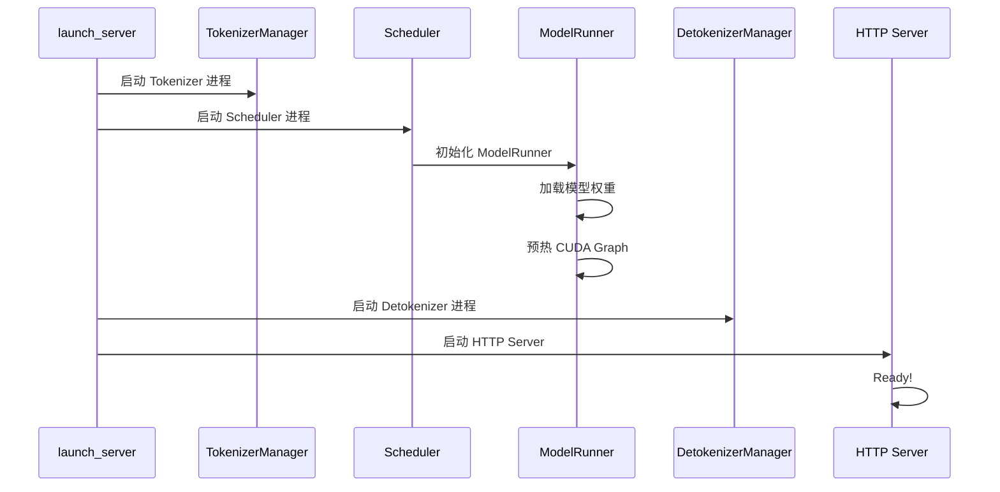
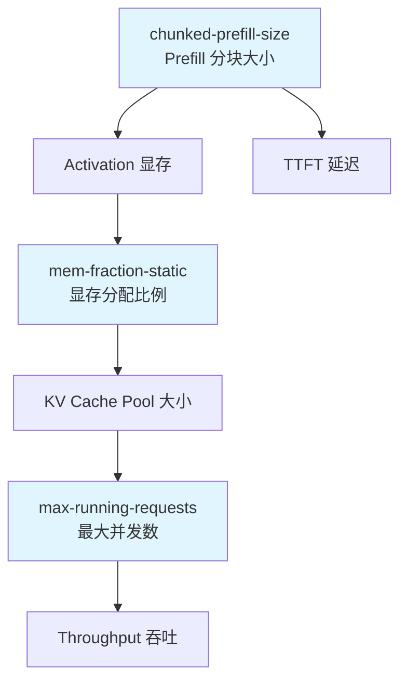
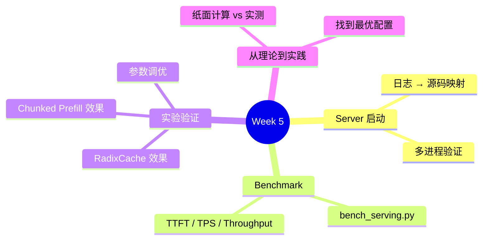

# Week 5: Server 启动与性能基准

> **阶段**: Phase 2 — GPU 实战
> **预计用时**: 10 小时 (5 天 × 2h)
> **前提**: 完成 Week 1-4 + [GPU 环境搭建](../setup/gpu-setup.md)
> **环境**: NVIDIA GPU (至少 1 张, 16GB+)

---

## 学习目标

```
Week 1-4: 你在 Mac 上读懂了 SGLang 的架构和源码
Week 5:   你要在 GPU 上亲手验证这些知识
```

本周结束后你应该能：
1. 熟练启动和配置 SGLang Server
2. 用 benchmark 工具测量 TTFT / TPS / Throughput
3. 通过实验验证 Week 1-4 的理论预测
4. 找到你的 GPU 上的最优配置

---

## Day 1-2: 启动与观察 SGLang Server (4h)

### 学习目标

- 理解 Server 启动过程中每一步对应的源码组件
- 学会通过日志观察多进程协作
- 理解关键启动参数如何影响系统行为

### 2.1 启动 Server 并对照源码

```bash
# 启动一个 Server (以 debug 级别日志)
python3 -m sglang.launch_server \
    --model-path Qwen/Qwen2.5-1.5B-Instruct \
    --port 30000 \
    --log-level debug
```

**观察启动日志，对照 Week 1 学到的架构**:



**对照源码路径** (回忆 Week 1 的知识)：

| 日志关键词 | 对应源码 | Week 1 对应章节 |
|-----------|---------|----------------|
| `Loading model` | `python/sglang/srt/model_executor/model_runner.py` | Day 1-2: 项目结构 |
| `Warmup CUDA Graph` | `python/sglang/srt/model_executor/cuda_graph_runner.py` | FAQ Q9 |
| `The server is fired up` | `python/sglang/srt/entrypoints/http_server.py` | Day 3-4: 多进程 |

### 2.2 验证多进程架构

```bash
# Server 运行时，在另一个终端查看进程
ps aux | grep sglang

# 你应该看到多个 Python 进程，对应：
# - HTTP Server (uvicorn)
# - TokenizerManager
# - Scheduler (+ ModelRunner)
# - DetokenizerManager
```

### 2.3 发送请求并观察完整生命周期

```python
# save as test_lifecycle.py
import openai
import time

client = openai.Client(base_url="http://localhost:30000/v1", api_key="none")

# 发送一个请求，观察 Server 日志中的处理流程
start = time.time()
resp = client.chat.completions.create(
    model="default",
    messages=[{"role": "user", "content": "Explain what is an LLM in one sentence."}],
    max_tokens=64
)
elapsed = time.time() - start

print(f"Response: {resp.choices[0].message.content}")
print(f"Total time: {elapsed:.3f}s")
print(f"Prompt tokens: {resp.usage.prompt_tokens}")
print(f"Completion tokens: {resp.usage.completion_tokens}")
```

**对照 Week 1 Day 5 的请求生命周期**：
1. HTTP Server 收到 JSON → `GenerateReqInput`
2. TokenizerManager 编码 → `TokenizedGenerateReqInput`
3. Scheduler 调度 → `Req` → `ScheduleBatch`
4. ModelRunner 执行 → Forward → Sampling
5. DetokenizerManager 解码 → 返回文本

### 动手练习 5.1

> **修改 `--max-running-requests` 观察调度行为**
>
> 1. 分别用 `--max-running-requests 1` 和 `--max-running-requests 64` 启动
> 2. 同时发送 10 个并发请求
> 3. 观察两种配置下的延迟差异
>
> ```python
> # 并发请求测试
> import openai
> import concurrent.futures
> import time
>
> client = openai.Client(base_url="http://localhost:30000/v1", api_key="none")
>
> def send_request(i):
>     start = time.time()
>     resp = client.chat.completions.create(
>         model="default",
>         messages=[{"role": "user", "content": f"Count from 1 to 10. Request #{i}"}],
>         max_tokens=32
>     )
>     return time.time() - start
>
> with concurrent.futures.ThreadPoolExecutor(max_workers=10) as pool:
>     times = list(pool.map(send_request, range(10)))
>
> print(f"Average: {sum(times)/len(times):.3f}s")
> print(f"Max:     {max(times):.3f}s")
> print(f"Min:     {min(times):.3f}s")
> ```
>
> **思考**: `max_running_requests=1` 时为什么每个请求延迟相似但总时间很长？
> (回忆 Week 2: Continuous Batching 和调度策略)

---

## Day 3-4: Benchmark 实战 (4h)

### 学习目标

- 学会使用 SGLang 的 benchmark 工具
- 实测 TTFT 和 TPS，对比 Week 3 的纸面计算
- 通过实验理解 RadixCache 和 Chunked Prefill 的实际效果

### 3.1 认识 Benchmark 工具

SGLang 自带的核心 benchmark 脚本：

```bash
# 主要 benchmark 脚本位置
python/sglang/bench_serving.py        # 在线 serving benchmark
python/sglang/bench_one_batch.py      # 单 batch 延迟测试
python/sglang/bench_offline_throughput.py  # 离线吞吐测试
```

### 3.2 运行 Latency Benchmark

```bash
# 确保 Server 在运行中

# 测量在线 serving 性能
python3 -m sglang.bench_serving \
    --backend sglang \
    --port 30000 \
    --dataset-name random \
    --num-prompts 100 \
    --random-input-len 256 \
    --random-output-len 128
```

**观察输出中的关键指标**:

| 指标 | 含义 | 对应学习内容 |
|------|------|-------------|
| TTFT (Time To First Token) | 首 token 延迟 | Week 3: Prefill 阶段 |
| TPS (Tokens Per Second) | 每秒生成 token 数 | Week 3: Decode 阶段 |
| Throughput (req/s) | 每秒完成请求数 | Week 2: Continuous Batching |
| E2E Latency | 端到端延迟 | performance-intuition.md |

### 3.3 实验：验证纸面计算

回忆 [performance-intuition.md](../05-reference/performance-intuition.md) 中的公式：

```
TTFT ≈ 2 × num_params × input_len / GPU_FLOPS
TPS  ≈ GPU_bandwidth / (2 × num_params / batch_size)
```

**实验**: 用不同 `input_len` 运行 benchmark，画出 TTFT vs input_len 的关系图。
是线性的吗？和你的计算吻合吗？

```bash
# 短输入
python3 -m sglang.bench_serving --port 30000 --dataset-name random \
    --num-prompts 50 --random-input-len 64 --random-output-len 64

# 中等输入
python3 -m sglang.bench_serving --port 30000 --dataset-name random \
    --num-prompts 50 --random-input-len 512 --random-output-len 64

# 长输入
python3 -m sglang.bench_serving --port 30000 --dataset-name random \
    --num-prompts 50 --random-input-len 2048 --random-output-len 64
```

### 3.4 实验：RadixCache 的效果

```bash
# 先用有 RadixCache 的 Server 测试 (默认开启)
python3 -m sglang.bench_serving --port 30000 --dataset-name random \
    --num-prompts 200 --random-input-len 512 --random-output-len 64

# 停掉 Server，用 --disable-radix-cache 重新启动
python3 -m sglang.launch_server \
    --model-path Qwen/Qwen2.5-1.5B-Instruct \
    --port 30000 \
    --disable-radix-cache

# 再跑同样的 benchmark
python3 -m sglang.bench_serving --port 30000 --dataset-name random \
    --num-prompts 200 --random-input-len 512 --random-output-len 64
```

**思考**: RadixCache 在 random 数据集上效果不明显？为什么？
(提示: random 数据集没有共享前缀。试试带共享前缀的请求)

```python
# 构造有共享前缀的请求来测试 RadixCache
import openai
import time

client = openai.Client(base_url="http://localhost:30000/v1", api_key="none")

SHARED_PREFIX = "You are a helpful assistant. " * 50  # 长共享前缀

questions = [
    "What is Python?",
    "What is Java?",
    "What is Rust?",
    "What is Go?",
    "What is C++?"
]

# 第一轮：冷启动
for q in questions:
    start = time.time()
    resp = client.chat.completions.create(
        model="default",
        messages=[{"role": "user", "content": SHARED_PREFIX + q}],
        max_tokens=32
    )
    print(f"[Round 1] {q[:20]:20s} TTFT={time.time()-start:.3f}s")

# 第二轮：RadixCache 命中
for q in questions:
    start = time.time()
    resp = client.chat.completions.create(
        model="default",
        messages=[{"role": "user", "content": SHARED_PREFIX + q}],
        max_tokens=32
    )
    print(f"[Round 2] {q[:20]:20s} TTFT={time.time()-start:.3f}s")
```

### 3.5 实验：Chunked Prefill 的效果

```bash
# 默认 chunked prefill
python3 -m sglang.launch_server \
    --model-path Qwen/Qwen2.5-1.5B-Instruct \
    --port 30000

# 测试长输入
python3 -m sglang.bench_serving --port 30000 --dataset-name random \
    --num-prompts 20 --random-input-len 4096 --random-output-len 64

# 关掉 chunked prefill (设置为 -1)
python3 -m sglang.launch_server \
    --model-path Qwen/Qwen2.5-1.5B-Instruct \
    --port 30000 \
    --chunked-prefill-size -1

# 同样的测试
python3 -m sglang.bench_serving --port 30000 --dataset-name random \
    --num-prompts 20 --random-input-len 4096 --random-output-len 64
```

**对比**: Chunked Prefill 对 TTFT 和 TPS 分别有什么影响？
(回忆 FAQ Q6: Chunked Prefill 的核心目的是降低长 Prefill 对 Decode 请求的干扰)

### 动手练习 5.2

> **制作一份性能报告**
>
> 在你的 GPU 上，运行以下配置组合，填写表格：
>
> | 配置 | TTFT (ms) | TPS | Throughput (req/s) |
> |------|-----------|-----|-------------------|
> | 默认配置 | | | |
> | disable-radix-cache | | | |
> | chunked-prefill-size=-1 | | | |
> | max-running-requests=1 | | | |
>
> 思考：哪些参数影响 TTFT？哪些影响 TPS？为什么？

---

## Day 5: 性能调优初体验 (2h)

### 学习目标

- 理解关键调优参数之间的关系
- 学会通过 metrics 端点监控 Server 状态
- 找到你的 GPU 上的最优配置

### 5.1 关键调优参数关系图



**核心关系**:
- `mem-fraction-static` 越大 → KV Cache 越多 → 能支持更多并发
- `chunked-prefill-size` 越小 → TTFT 越低 → 但 Prefill 总时间可能增加
- `max-running-requests` 越大 → 吞吐越高 → 但单请求延迟可能增大

### 5.2 监控 Server 状态

```bash
# SGLang 提供 metrics 端点
curl http://localhost:30000/get_model_info | python3 -m json.tool

# 查看运行状态
curl http://localhost:30000/get_server_info | python3 -m json.tool
```

### 5.3 调优实验

```bash
# 实验 1: 找到最大并发数
# 逐步增大 max-running-requests，观察什么时候开始 OOM
for n in 16 32 64 128 256; do
    echo "=== max-running-requests=$n ==="
    # 重启 Server 用新参数，运行 benchmark，记录结果
done

# 实验 2: 最优 chunked-prefill-size
# 不同场景有不同最优值
# 短请求密集：大 chunk 更好 (减少调度开销)
# 长请求混合：小 chunk 更好 (降低 TTFT)
```

### 动手练习 5.3

> **找到你的最优配置**
>
> 使用以下工作负载，找到 Throughput 最高的参数组合：
> - 100 个请求
> - 输入长度 256 tokens
> - 输出长度 128 tokens
>
> 你需要调整的参数：
> 1. `--mem-fraction-static` (试: 0.7, 0.8, 0.85, 0.9)
> 2. `--max-running-requests` (试: 32, 64, 128, 256)
>
> 记录结果，分析哪个参数对性能影响最大。

---

## Week 5 自查清单

完成本周学习后，你应该能回答：

- [ ] SGLang Server 启动时，依次执行了哪些步骤？每步对应哪个源码文件？
- [ ] `--mem-fraction-static` 设为 0.9 和 0.7，对系统有什么不同影响？
- [ ] RadixCache 在什么场景下效果最明显？什么场景下几乎无用？
- [ ] Chunked Prefill 主要优化什么指标？代价是什么？
- [ ] 你的 GPU 上，最优的 `max-running-requests` 大约是多少？怎么找到的？
- [ ] `bench_serving.py` 输出的 TTFT 和 TPS 分别对应哪个阶段的耗时？

---

## 本周核心收获



---

> **下一步**: [Week 6: Profiling 与故障排查](./11-week6-profiling-and-debugging.md) — 用 Profiler 看到 GPU 内部在做什么
