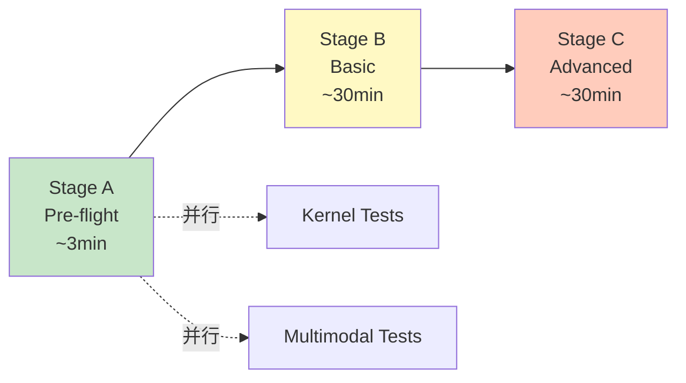
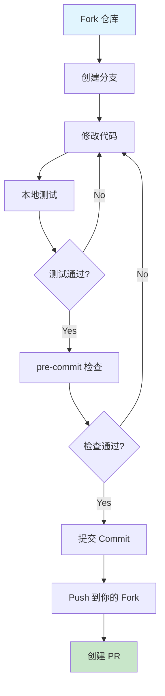
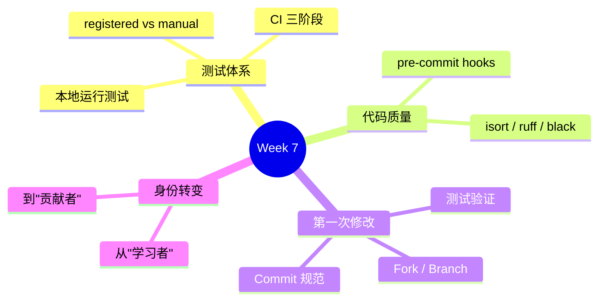

# Week 7: 测试体系与你的第一次代码修改

> **阶段**: Phase 2 — GPU 实战
> **预计用时**: 10 小时 (5 天 × 2h)
> **前提**: 完成 Week 6 (能分析 PR、排查问题)
> **环境**: NVIDIA GPU + 能访问 GitHub
> **第一次改代码建议**: 如果你还没独立改过代码，先走 [first-code-change.md](./first-code-change.md) 的 demo -> test 路线。

---

## 学习目标

```
Week 6: 你学会了分析和诊断
Week 7: 你要学会写代码、写测试、过 CI
```

本周结束后你应该能：
1. 理解 SGLang 的测试体系和 CI 流程
2. 本地运行和编写测试
3. 使用 pre-commit hooks 保证代码质量
4. 完成你的第一次代码修改

---

## Day 1-2: SGLang 测试体系 (4h)

### 学习目标

- 理解测试目录组织和 CI pipeline
- 在 GPU 上运行真实测试
- 学会给现有功能补测试

### 1.1 测试目录结构

```
test/
├── registered/          # CI 自动发现的测试 (主要位置)
│   ├── unit/            # 单元测试 (不需要 GPU Server)
│   ├── core/            # 核心功能测试
│   ├── models/          # 模型兼容性测试
│   └── ...
├── manual/              # 非 CI 测试 (本地调试用)
│   ├── attention/
│   ├── scheduler/
│   ├── distributed/
│   └── ...
├── run_suite.py         # CI 运行器
└── README.md            # 测试体系详细说明 ← 必读
```

**关键区别**:
- `registered/`: CI 会自动扫描运行，你写的新测试应该放这里
- `manual/`: 需要特殊环境或手动触发的测试

### 1.2 CI Pipeline: 三阶段流水线



| Stage | 内容 | 用时 | 失败影响 |
|-------|------|------|---------|
| A (Pre-flight) | Lint、格式检查、快速导入测试 | ~3 min | 阻止 B/C |
| B (Basic) | 核心功能、单元测试 | ~30 min | 阻止 C |
| C (Advanced) | 分布式、大模型、特殊功能 | ~30 min | PR 必须通过 |

### 1.3 本地运行测试

```bash
# 运行单个测试文件
python3 test/registered/unit/entrypoints/openai/test_protocol.py

# 运行单个测试方法
python3 test/registered/unit/entrypoints/openai/test_protocol.py TestOpenAIProtocol.test_simple_decode

# 用 pytest 运行 (也可以)
pytest test/registered/unit/entrypoints/openai/test_protocol.py -v

# 运行一组 suite (CI 方式)
python3 test/run_suite.py --suite base-b
```

### 1.4 在 GPU 上运行真实测试

```bash
# 这些测试需要 GPU，在 Mac 上跑不了

# 核心 endpoint 测试 (会启动一个 SGLang Server)
python3 test/registered/core/test_srt_endpoint.py

# 模型测试
python3 test/registered/models/test_qwen_models.py
```

**观察**:
- 测试框架自动启动和关闭 Server
- 测试使用 `DEFAULT_SMALL_MODEL_NAME_FOR_TEST` 选择小模型
- 测试结束时 Server 自动清理

### 1.5 理解测试注册机制

```python
# 每个 CI 测试文件末尾都有注册声明
# 参见 test/README.md 了解完整规则

# unittest 风格
if __name__ == "__main__":
    unittest.main()

# pytest 风格
if __name__ == "__main__":
    import sys
    sys.exit(pytest.main([__file__]))
```

### 动手练习 7.1

> **在 GPU 上运行 3 组不同的测试**
>
> 1. 运行一个 unit test (不需要 Server): `test/registered/unit/` 中选一个
> 2. 运行一个 core test (需要 Server): `test/registered/core/` 中选一个
> 3. 比较两种测试的运行时间和输出
>
> 问题：
> - unit test 和 core test 的主要区别是什么？
> - core test 是怎么启动和关闭 Server 的？(提示: 看 fixture 或 setUp/tearDown)

---

## Day 3: 代码质量工具 (2h)

### 学习目标

- 理解 pre-commit hooks 的作用
- 能本地运行格式化和 lint
- 了解代码提交前需要通过哪些检查

### 3.1 Pre-commit Hooks

SGLang 使用以下自动检查工具：

| 工具 | 作用 | 语言 |
|------|------|------|
| isort | import 排序 | Python |
| ruff | 快速 Linter | Python |
| black | 代码格式化 | Python |
| clang-format | 代码格式化 | C++/CUDA |
| codespell | 拼写检查 | 所有 |

### 3.2 安装和运行 Pre-commit

```bash
# 安装 pre-commit
pip install pre-commit

# 安装 hooks (首次)
pre-commit install

# 手动运行所有 hooks (对全部文件)
pre-commit run --all-files

# 只对暂存的文件运行
pre-commit run
```

### 3.3 常见格式问题和修复

```python
# 问题 1: import 顺序不对
# 修复前:
import sglang
import os
import sys
from sglang.srt.managers.scheduler import Scheduler

# isort 修复后:
import os
import sys

import sglang
from sglang.srt.managers.scheduler import Scheduler

# 问题 2: 行太长 (black 修复)
# 修复前:
result = some_function(very_long_argument_1, very_long_argument_2, very_long_argument_3, very_long_argument_4)

# 修复后:
result = some_function(
    very_long_argument_1,
    very_long_argument_2,
    very_long_argument_3,
    very_long_argument_4,
)
```

### 动手练习 7.2

> **体验 pre-commit 的自动修复**
>
> 1. 故意写一段格式不规范的 Python 代码 (乱序 import, 超长行)
> 2. 运行 `pre-commit run --files your_file.py`
> 3. 观察哪些被自动修复了，哪些需要手动改
> 4. 运行 `git diff` 看修复了什么

---

## Day 4-5: 你的第一次代码修改 (4h)

### 学习目标

- 完成从 fork 到提交的完整流程
- 理解 SGLang 的 commit 风格
- 本地验证你的修改

### 4.1 选择你的第一个任务

**推荐起步任务** (从易到难):

| 难度 | 任务类型 | 示例 |
|------|---------|------|
| L1 | 文档改进 | 修复 typo, 补充注释, 更新过时说明 |
| L2 | 测试补充 | 给没有测试的功能加单元测试 |
| L3 | 小 Bug Fix | 修复 GitHub Issues 中标记为 `good first issue` 的问题 |

```bash
# 查看 good first issues (如果有 gh 工具)
gh issue list --repo sgl-project/sglang --label "good first issue" --state open
```

### 4.2 开发流程



```bash
# Step 1: Fork (在 GitHub 网页上操作)

# Step 2: 添加你的 fork 为 remote
git remote add myfork https://github.com/YOUR_USERNAME/sglang.git

# Step 3: 创建分支
git checkout -b my-first-change

# Step 4: 修改代码
# ... 编辑文件 ...

# Step 5: 运行相关测试
python3 test/registered/unit/test_xxx.py

# Step 6: pre-commit 检查
pre-commit run --files path/to/changed/file.py

# Step 7: 提交
git add path/to/changed/file.py
git commit -m "[Category] Brief description of the change"

# Step 8: Push
git push myfork my-first-change
```

### 4.3 Commit Message 规范

观察 SGLang 的 commit 历史，常见格式：

```bash
git log --oneline -20
# 示例:
# [Bugfix] Clean up failed NIXL sender state
# [Feature] Add W4A16 MOE support
# [CPU] Explicitly enable AVX512 instruction set
```

**格式**: `[Category] 简短描述 (#PR号)`

常见 Category:
- `[Bugfix]` — 修复 bug
- `[Feature]` / `[Feat]` — 新功能
- `[Refactor]` — 重构
- `[Doc]` — 文档
- `[Test]` — 测试
- `[CI]` — CI/CD 相关

### 4.4 本地验证清单

提交前确认：

```markdown
- [ ] 修改的代码能正常运行
- [ ] 相关测试通过: `python3 test/registered/unit/test_xxx.py`
- [ ] pre-commit 通过: `pre-commit run --files ...`
- [ ] 没有引入新的 warning
- [ ] commit message 格式正确
- [ ] 没有包含不相关的改动 (用 `git diff --staged` 确认)
```

### 动手练习 7.3

> **完成你的第一次代码修改**
>
> 选择以下任务之一，完成完整流程：
>
> **Option A: 文档改进**
> - 找到文档或代码注释中的一个 typo 或过时说明
> - 修复它，提交 commit
>
> **Option B: 补写一个测试**
> - 在 `test/registered/unit/` 或 `test/manual/` 中
> - 选择一个你在 Week 2-3 学过的功能
> - 为它编写一个新的测试用例
>
> **Option C: Good First Issue**
> - 在 GitHub Issues 中找一个 `good first issue`
> - 分析问题、写修复、写测试
>
> 即使你暂时不想提 PR，也要走完 fork → branch → commit 的流程。

---

## Week 7 自查清单

- [ ] 能说出 `test/registered/` 和 `test/manual/` 的区别吗？
- [ ] CI 的 3 个 Stage 分别做什么？哪个 Stage 最快？
- [ ] 能在 GPU 上成功运行一个 core test 吗？
- [ ] pre-commit 包含哪些检查工具？
- [ ] 知道 SGLang 的 commit message 格式吗？
- [ ] 完成了至少一次完整的 branch → commit 流程吗？

---

## 本周核心收获



---

> **下一步**: [Week 8: 综合项目与毕业](./13-week8-capstone.md) — 独立完成一个特性
