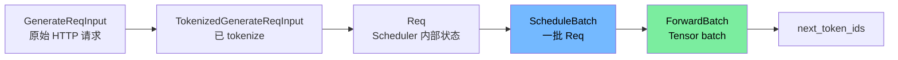
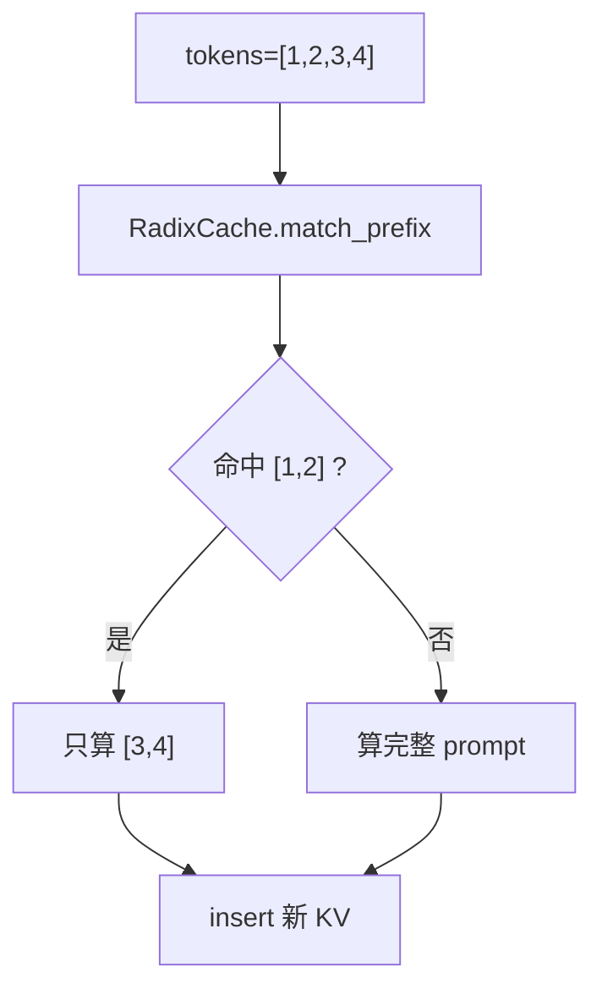
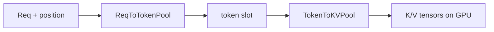

# 术语表：SGLang 源码高频词

> 用法：看到不懂的词先查这里。先记“大白话”，再看源码字段。

## 核心链路

| 术语 | 大白话 | 常见源码位置 |
|---|---|---|
| Token | 模型认识的数字，不是自然语言字符 | `input_ids`, `output_ids` |
| Tokenizer | 文本和 token 互转 | `tokenizer_manager.py` |
| Detokenizer | token 转回文本 | `detokenizer_manager.py` |
| Prefill / EXTEND | 第一次读完整 prompt | `ForwardMode.EXTEND` |
| Decode | 基于历史 KV 逐 token 生成 | `ForwardMode.DECODE` |
| KV Cache | Attention 的历史 K/V 中间结果 | `mem_cache/` |
| Batch | 一批请求一起算 | `ScheduleBatch`, `ForwardBatch` |
| Scheduler | 决定下一轮算哪些请求 | `scheduler.py` |
| ModelRunner | 真正调用模型 forward 的执行器 | `model_runner.py` |
| Sampler | 从 logits 选下一个 token | `layers/sampler.py` |

## 请求形态

| 术语 | 大白话 | 不要混淆 |
|---|---|---|
| `GenerateReqInput` | HTTP 层请求，可能还是文本 | 不是 Scheduler 内部请求 |
| `TokenizedGenerateReqInput` | 已经有 `input_ids` 的请求 | 还没有 KV 位置 |
| `Req` | Scheduler 内部的请求状态机 | 不适合跨进程随便传 |
| `ScheduleBatch` | Scheduler 选出来的一批请求 | 仍是 CPU/Python 对象 |
| `ForwardBatch` | 模型执行侧的 Tensor 形态 | 给 `ModelRunner` 用 |
| `BatchTokenIDOutput` | Scheduler 输出 token ids | 还不是文本 |
| `BatchStrOutput` | Detokenizer 输出文本 | 返回给 TokenizerManager/HTTP |

## 调度和缓存

| 术语 | 大白话 | 看源码先看 |
|---|---|---|
| `waiting_queue` | 新请求等 prefill 的队列 | `scheduler.py` |
| `running_batch` | 已 prefill、正在 decode 的请求集合 | `scheduler.py` |
| Chunked Prefill | 长 prompt 分块 prefill，避免堵住 decode | `get_next_batch_to_run()` |
| RadixCache | token 前缀树，判断哪些前缀算过 | `radix_cache.py` |
| `match_prefix` | 找最长已缓存前缀 | `RadixCache.match_prefix()` |
| `insert` | 把新 KV 前缀写入树 | `RadixCache.insert()` |
| `evict` | 内存不够时淘汰可删缓存 | `RadixCache.evict()` |
| `lock_ref` | 被运行中请求引用的次数 | `TreeNode.lock_ref` |

## 内存池

| 术语 | 大白话 | 类比 |
|---|---|---|
| ReqToTokenPool | 请求位置到 token slot 的映射 | 座位表 |
| TokenToKVPool | token slot 到真实 KV 的映射 | 仓库货架 |
| Page | 一组连续 token slot | 一排货架 |
| Allocator | 分配/释放 KV 空间 | 仓库管理员 |
| `out_cache_loc` | 本轮新 token 的 KV 写到哪里 | 新货物地址 |

## 模型执行

| 术语 | 大白话 | 看源码先看 |
|---|---|---|
| `input_ids` | 输入 token ids | `ForwardBatch.input_ids` |
| `seq_lens` | 每个请求当前总长度 | `ForwardBatch.seq_lens` |
| `positions` | token 在序列中的位置 | `ForwardBatch.positions` |
| logits | 下一个 token 的原始分数 | `logits_processor.py` |
| logprob | token 概率的 log 值 | `return_logprob` |
| temperature | 随机性开关 | `SamplingParams` |
| top_p | 截断低概率候选 | `SamplingParams` |
| greedy | 每次选最高分 token | temperature 接近 0 |

## 并行和高级特性

| 术语 | 大白话 | 什么时候学 |
|---|---|---|
| TP | 一个模型切到多张卡 | Week 4/高级 |
| DP | 多份模型处理不同请求 | Week 4/高级 |
| PP | 模型层按阶段切分 | 高级 |
| EP | MoE 专家并行 | 高级 |
| PD Disaggregation | Prefill 和 Decode 分开部署 | Week 4/高级 |
| Speculative Decoding | 小模型先猜，大模型验证 | Week 4 |
| CUDA Graph | 录制 GPU 执行图减少开销 | Week 5 后 |
| FlashInfer | 高性能 attention/kernel 后端 | Week 5 后 |

## 初学者最容易混

| 混淆项 | 正确区分 |
|---|---|
| RadixCache vs KVPool | RadixCache 是目录，KVPool 是实际仓库 |
| Prefill vs Decode | Prefill 读 prompt，Decode 生成新 token |
| ScheduleBatch vs ForwardBatch | 前者给 Scheduler，后者给模型执行 |
| TokenizerManager vs DetokenizerManager | 前者文本转 token，后者 token 转文本 |
| logits vs token | logits 是分数，token 是最终选中的数字 |
| request id vs req_pool_idx | request id 是业务标识，req_pool_idx 是内部槽位 |

