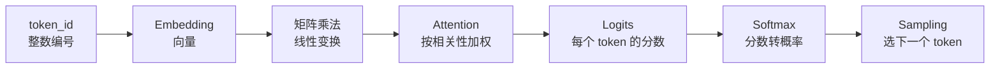
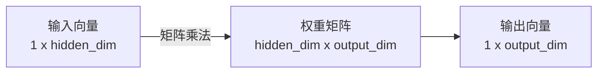
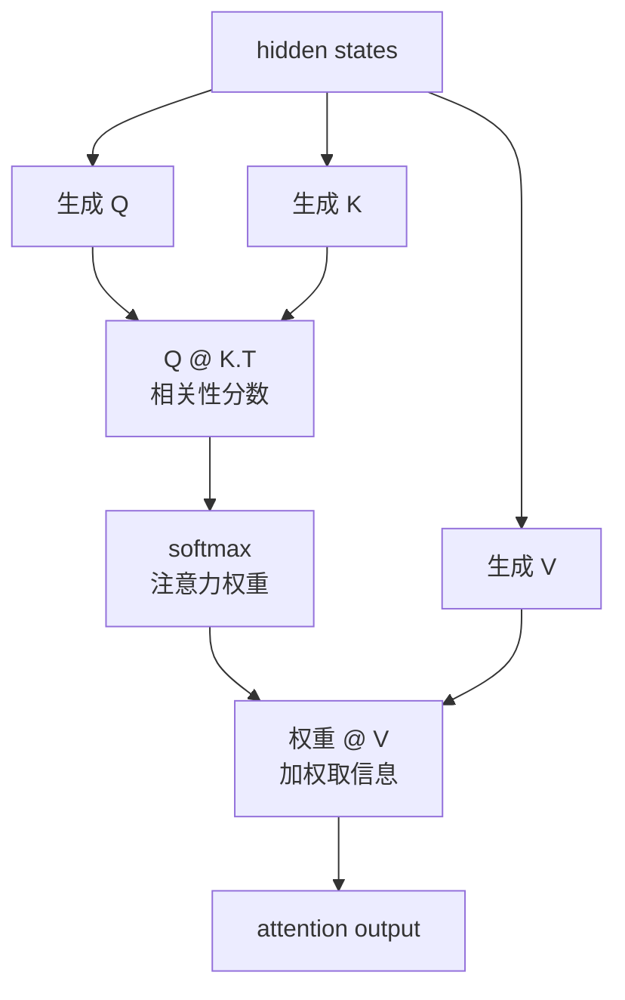
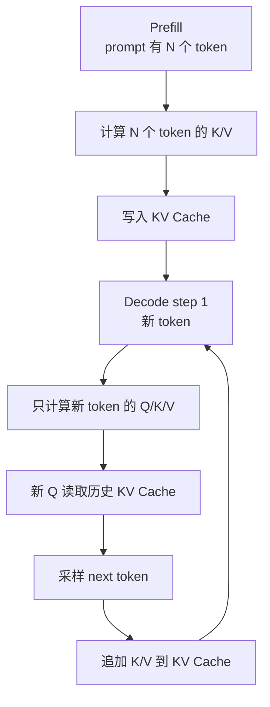

# LLM 推理数学基础：从零看懂向量、概率、Attention

> 目标：补齐阅读 SGLang 源码最需要的数学直觉。
> 读者假设：会基础 Python；线性代数、微积分、概率论都只了解一点，甚至没系统学过。
> 使用方式：先读图和表，再跑代码。不要一上来背公式。

## 0. 先看全图

LLM 推理里最常见的数学链路：



| 你要掌握 | 最小理解 |
|---|---|
| 向量 | 一串数字，表示一个 token 或一段状态 |
| 矩阵 | 一张数字表，用来批量变换向量 |
| 矩阵乘法 | 把输入向量变成输出向量 |
| 概率 | 多个候选 token 被选中的可能性 |
| Softmax | 把任意分数变成概率分布 |
| Attention | 当前 token 应该参考哪些历史 token |
| KV Cache | 把历史 Key/Value 存起来，decode 时复用 |

### 0.1 公式读法约定

下面会用 LaTeX 写公式。先记住几个符号：

| 符号 | 读法 | 大白话 |
|---|---|---|
| $x$ | x | 一个数、向量或张量，具体看上下文 |
| $\mathbf{x}$ | bold x / 向量 x | 一串数字，也就是向量 |
| $W$ | W 矩阵 | 一张权重表 |
| $W^\top$ | W transpose / W 转置 | 把矩阵行列互换 |
| $x_i$ | x sub i / x 的第 i 项 | 向量里的第 i 个数 |
| $\sum_i$ | sum over i / 对 i 求和 | 把很多项加起来 |
| $\in$ | belongs to / 属于 | 例如 $i \in [1,n]$ 表示 i 在 1 到 n 之间 |
| $\mathbb{R}^{m \times n}$ | R m by n | m 行 n 列的实数矩阵 |

公式不用一次背下来。读源码时更重要的是看懂：

```text
输入 shape 是什么
输出 shape 是什么
这个公式在做“查表、打分、归一化、加权、采样”里的哪一步
```

## 1. 数字的层级：标量、向量、矩阵、张量

| 名字 | 形状 | Python/Numpy 例子 | 大白话 |
|---|---|---|---|
| 标量 scalar | `()` | `3.14` | 一个数 |
| 向量 vector | `(3,)` | `[1, 2, 3]` | 一排数 |
| 矩阵 matrix | `(2, 3)` | `[[1,2,3], [4,5,6]]` | 二维表 |
| 张量 tensor | 任意维 | `(batch, seq, hidden)` | 多维数组 |

SGLang / PyTorch 里经常看到：

```text
input_ids:      (batch_size, seq_len)
hidden_states:  (batch_size, seq_len, hidden_dim)
logits:         (batch_size, seq_len, vocab_size)
```

最重要的是看懂 shape：

| shape | 含义 |
|---|---|
| `batch_size` | 一批里有多少个请求 |
| `seq_len` | 每个请求有多少 token |
| `hidden_dim` | 每个 token 用多少维向量表示 |
| `vocab_size` | 词表里有多少个 token |

## 2. 向量：一个 token 的“坐标”

`token_id` 只是编号，不能直接表示语义。Embedding 把编号变成向量。

```text
token_id = 9906
embedding_table[9906] = [0.12, -0.83, 0.44, ...]
```

公式：

$$
\mathbf{x}_t = E[\text{token\_id}_t]
$$

读法：

```text
x_t 等于从 embedding 表 E 里，取出 token_id_t 对应的那一行。
```

| 符号 | 含义 |
|---|---|
| $E$ | embedding 表，shape 通常是 `(vocab_size, hidden_dim)` |
| $\text{token\_id}_t$ | 第 t 个 token 的整数编号 |
| $\mathbf{x}_t$ | 第 t 个 token 的 embedding 向量 |

可以把向量理解成“很多个隐含特征的坐标”：

| 维度 | 可能学到的含义 |
|---|---|
| 第 1 维 | 偏英文还是中文 |
| 第 2 维 | 偏名词还是动词 |
| 第 3 维 | 情感正负 |
| 第 N 维 | 人类不一定能解释 |

注意：真实模型的每一维不一定能被人类清楚命名，但整体向量能参与计算。

## 3. 点积：两个向量有多“像”

点积就是两个向量逐位相乘再相加。

```text
a = [1, 2, 3]
b = [4, 5, 6]

a · b = 1*4 + 2*5 + 3*6 = 32
```

公式：

$$
\mathbf{a} \cdot \mathbf{b} = \sum_{i=1}^{d} a_i b_i
$$

读法：

```text
向量 a 点乘向量 b，等于把每一维的 a_i 和 b_i 相乘，再从第 1 维加到第 d 维。
```

| 符号 | 含义 |
|---|---|
| $d$ | 向量维度 |
| $a_i$ | 向量 a 的第 i 个数 |
| $b_i$ | 向量 b 的第 i 个数 |
| $\sum_{i=1}^{d}$ | 从第 1 项加到第 d 项 |

直觉：

| 点积结果 | 含义 |
|---|---|
| 大正数 | 方向相近，相关性强 |
| 接近 0 | 关系弱 |
| 负数 | 方向相反 |

Attention 里的 `Q @ K.T` 本质上就是很多点积：

```text
一个 Query 向量 · 每个 Key 向量 = 当前 token 对历史 token 的相关性分数
```

## 4. 矩阵乘法：批量做点积

矩阵乘法可以理解成“很多个点积一起算”。



shape 规则：

```text
(m, n) @ (n, k) = (m, k)
```

公式：

$$
C = A B,\quad C_{ij} = \sum_{r=1}^{n} A_{ir} B_{rj}
$$

读法：

```text
C 等于 A 乘 B。
C 的第 i 行第 j 列，等于 A 的第 i 行和 B 的第 j 列做点积。
```

shape 写法：

$$
A \in \mathbb{R}^{m \times n},\quad B \in \mathbb{R}^{n \times k},\quad C \in \mathbb{R}^{m \times k}
$$

读法：

```text
A 是 m 行 n 列，B 是 n 行 k 列，所以结果 C 是 m 行 k 列。
```

中间的 `n` 必须相同，结果保留两边外侧：

```text
(32, 128) @ (128, 50000) = (32, 50000)
```

可运行代码：

```python
import numpy as np

v = np.array([1.0, 2.0, 3.0])  # (3,)
W = np.array([
    [1, 0, 1],
    [0, 1, 1],
])  # (2, 3)

result = W @ v
print(result)  # [4. 5.]
```

为什么是 `[4, 5]`：

```text
第 1 行: 1*1 + 0*2 + 1*3 = 4
第 2 行: 0*1 + 1*2 + 1*3 = 5
```

在 LLM 中：

| 位置 | 矩阵乘法在做什么 |
|---|---|
| Embedding 后 | 把 token 向量投影到新空间 |
| Attention Q/K/V | 从 hidden state 生成 Query/Key/Value |
| MLP / FFN | 对每个 token 做非线性变换 |
| LM Head | 把 hidden state 变成 vocab_size 个分数 |

## 5. Logits：还不是概率，只是分数

模型最后会给词表里每个 token 一个分数：

```text
vocab = ["很", "不", "还"]
logits = [2.0, 1.0, 0.1]
```

| token | logit |
|---|---:|
| 很 | 2.0 |
| 不 | 1.0 |
| 还 | 0.1 |

logit 越大，越可能被选中。但 logit 不是概率：

```text
2.0 + 1.0 + 0.1 != 1
```

所以需要 softmax。

LM Head 常见公式：

$$
\mathbf{z}_t = \mathbf{h}_t W_{\text{lm}} + \mathbf{b}
$$

读法：

```text
第 t 个位置的 hidden state h_t，乘以 lm_head 权重 W_lm，再加偏置 b，得到 logits z_t。
```

| 符号 | 含义 |
|---|---|
| $\mathbf{h}_t$ | 第 t 个位置的 hidden state |
| $W_{\text{lm}}$ | LM Head 权重矩阵 |
| $\mathbf{b}$ | bias，偏置 |
| $\mathbf{z}_t$ | logits，长度等于 vocab_size |

## 6. Softmax：分数转概率

Softmax 做三件事：

| 目标 | 结果 |
|---|---|
| 所有值变成正数 | 概率不能为负 |
| 大分数得到更大权重 | 保留排序倾向 |
| 全部加起来等于 1 | 变成概率分布 |

公式：

$$
p_i = \frac{e^{z_i}}{\sum_{j=1}^{V} e^{z_j}}
$$

读法：

```text
第 i 个 token 的概率 p_i，
等于 e 的 z_i 次方，
除以所有 token 的 e 的 z_j 次方之和。
```

| 符号 | 含义 |
|---|---|
| $z_i$ | 第 i 个 token 的 logit 分数 |
| $p_i$ | 第 i 个 token 的概率 |
| $V$ | vocab size，词表大小 |
| $e^x$ | 指数函数，保证结果为正数 |

公式可以先不背，只看效果：

```python
import numpy as np

def softmax(x):
    e_x = np.exp(x - np.max(x))
    return e_x / e_x.sum()

logits = np.array([2.0, 1.0, 0.1])
probs = softmax(logits)
print(probs.round(3))  # [0.659 0.242 0.099]
print(probs.sum())     # 1.0
```

| token | logit | probability |
|---|---:|---:|
| 很 | 2.0 | 0.659 |
| 不 | 1.0 | 0.242 |
| 还 | 0.1 | 0.099 |

为什么代码里有 `x - np.max(x)`：

```text
这是数值稳定技巧，防止 exp(很大的数) 溢出。
不改变 softmax 的最终概率比例。
```

## 7. Temperature：控制随机性

Temperature 作用在 softmax 前：

$$
p_i = \frac{e^{z_i / T}}{\sum_{j=1}^{V} e^{z_j / T}}
$$

读法：

```text
先把每个 logit z_i 除以温度 T，再做 softmax。
T 越小，分数差距被放大；T 越大，分数差距被压平。
```

| temperature | 效果 | 大白话 |
|---|---|---|
| 很小，如 `0.1` | 分布很尖 | 几乎总选最高分 |
| `1.0` | 原始分布 | 正常随机性 |
| 较大，如 `2.0` | 分布更平 | 更随机 |

```python
import numpy as np

def softmax(x):
    e_x = np.exp(x - np.max(x))
    return e_x / e_x.sum()

logits = np.array([2.0, 1.0, 0.1])

for temp in [0.1, 0.5, 1.0, 2.0]:
    probs = softmax(logits / temp)
    print(f"temp={temp}: {probs.round(3)}")
```

和 SGLang 的关系：

```text
SamplingParams.temperature
  -> sampler 使用
  -> 影响 next_token_id 的随机性
```

## 8. 采样：按概率选 token

有了概率以后，不一定选最大值，也可以按概率随机抽。

```python
import random

vocab = ["很", "不", "还", "真", "挺"]
probs = [0.5, 0.2, 0.15, 0.1, 0.05]

for i in range(5):
    token = random.choices(vocab, weights=probs, k=1)[0]
    print(token)
```

| 策略 | 做什么 | 适合 |
|---|---|---|
| greedy | 永远选概率最高的 token | 稳定、可重复 |
| temperature | 调节概率分布尖锐程度 | 控制随机性 |
| top-k | 只从前 k 个候选里选 | 去掉低质量长尾 |
| top-p | 只从累计概率 p 以内的候选里选 | 常用生成策略 |

贪心解码公式：

$$
\text{next\_token} = \arg\max_i p_i
$$

读法：

```text
选择概率 p_i 最大的那个 token。
argmax 返回的不是最大概率值，而是最大概率对应的下标/token id。
```

按概率采样可以写成：

$$
\text{next\_token} \sim \text{Categorical}(\mathbf{p})
$$

读法：

```text
next_token 从概率分布 p 里随机抽一个。
概率越大的 token 越容易被抽到，但不是必然被选中。
```

Top-p 直觉：

```text
按概率从大到小排：
0.50, 0.20, 0.15, 0.10, 0.05

top_p = 0.9
保留到累计概率 >= 0.9:
0.50 + 0.20 + 0.15 + 0.10 = 0.95
```

## 9. Attention：当前 token 应该看谁

Attention 解决的问题：

```text
生成当前 token 时，历史上下文里哪些 token 更重要？
```

三个向量：

| 名字 | 英文 | 大白话 |
|---|---|---|
| Q | Query | 我现在想找什么信息 |
| K | Key | 我这个历史 token 有什么标签 |
| V | Value | 如果你关注我，就拿走这些内容 |

Q/K/V 生成公式：

$$
Q = X W_Q,\quad K = X W_K,\quad V = X W_V
$$

读法：

```text
用同一份输入 hidden states X，
分别乘以三个不同的权重矩阵，
得到 Q、K、V。
```

Attention 主公式：

$$
\text{Attention}(Q,K,V) = \text{softmax}\left(\frac{QK^\top}{\sqrt{d_k}}\right)V
$$

读法：

```text
先用 Q 乘 K 的转置，得到相关性分数。
再除以 sqrt(d_k)，避免分数过大。
然后对每一行做 softmax，得到注意力权重。
最后用这些权重乘 V，得到加权后的输出。
```

| 符号 | 含义 |
|---|---|
| $X$ | 输入 hidden states |
| $W_Q, W_K, W_V$ | 生成 Q/K/V 的权重矩阵 |
| $QK^\top$ | 每个 Query 和每个 Key 的相关性分数 |
| $d_k$ | Key 向量维度 |
| $\sqrt{d_k}$ | 缩放因子，防止 softmax 太尖 |

核心流程：



可运行小例子：

```python
import numpy as np

def softmax_2d(x):
    e_x = np.exp(x - x.max(axis=-1, keepdims=True))
    return e_x / e_x.sum(axis=-1, keepdims=True)

seq_len = 3
dim = 4
np.random.seed(0)

Q = np.random.randn(seq_len, dim)
K = np.random.randn(seq_len, dim)
V = np.random.randn(seq_len, dim)

scores = Q @ K.T
weights = softmax_2d(scores / np.sqrt(dim))
output = weights @ V

print("scores shape:", scores.shape)   # (3, 3)
print("weights row sums:", weights.sum(axis=1))
print("output shape:", output.shape)   # (3, 4)
```

看懂 shape：

| 变量 | shape | 含义 |
|---|---|---|
| `Q` | `(seq_len, dim)` | 每个 token 一个 Query |
| `K` | `(seq_len, dim)` | 每个 token 一个 Key |
| `V` | `(seq_len, dim)` | 每个 token 一个 Value |
| `Q @ K.T` | `(seq_len, seq_len)` | 每个 token 看每个 token 的分数 |
| `weights @ V` | `(seq_len, dim)` | 加权后的新表示 |

## 10. Causal Mask：为什么不能偷看未来

LLM 是自回归生成：

```text
用前面的 token 预测下一个 token
```

训练时虽然整段文本都在矩阵里，但第 2 个 token 不能看第 3 个 token，否则就作弊。

```text
位置 1 只能看 1
位置 2 只能看 1,2
位置 3 只能看 1,2,3
```

mask 直觉：

```text
允许看: 1
屏蔽掉: 0

      key1 key2 key3 key4
q1     1    0    0    0
q2     1    1    0    0
q3     1    1    1    0
q4     1    1    1    1
```

公式写法：

$$
\text{scores}_{ij} =
\begin{cases}
\frac{q_i \cdot k_j}{\sqrt{d_k}}, & j \le i \\
-\infty, & j > i
\end{cases}
$$

读法：

```text
如果 key 位置 j 不在 query 位置 i 的未来，就正常计算相关性分数。
如果 j 在 i 的未来，就把分数设成负无穷。
softmax 后，负无穷对应的概率会变成 0。
```

这就是 decoder-only LLM 能按顺序生成文本的原因。

## 11. Prefill 和 Decode 的数学差异

| 阶段 | 输入 | Attention 形态 | 成本直觉 |
|---|---|---|---|
| Prefill | 完整 prompt | 很多 Q 对很多 K | 一次性算大矩阵 |
| Decode | 新生成的 1 个 token | 1 个新 Q 看所有历史 K | 每步小，但会重复很多次 |

Prefill 的注意力可以粗略写成：

$$
Q_{1:N} K_{1:N}^{\top}
$$

读法：

```text
N 个 query 去看 N 个 key，所以相关性矩阵大约是 N x N。
```

Decode 第 t 步可以粗略写成：

$$
q_t K_{1:t}^{\top}
$$

读法：

```text
当前这 1 个 query，看从第 1 个到第 t 个的所有历史 key。
```

图：



SGLang 为什么重视这两个阶段：

| 机制 | 解决什么 |
|---|---|
| Continuous Batching | Decode 很多小步，把不同请求合起来跑 |
| Chunked Prefill | 长 prompt 不要一次堵住 decode |
| RadixCache | 共享前缀不用重复 prefill |
| KV Pool | 管理 K/V 在 GPU 显存里的位置 |

## 12. KV Cache：为什么能加速 decode

如果没有 KV Cache：

```text
每生成 1 个 token，都重新计算整个历史的 K/V
```

有 KV Cache：

```text
历史 token 的 K/V 已经算过
decode 时只算新 token 的 K/V
再让新 Q 去读历史 K/V
```

| 没有缓存 | 有 KV Cache |
|---|---|
| 重复计算历史 | 复用历史 |
| decode 越长越慢得更明显 | 每步成本稳定很多 |
| 显存压力小一点 | 需要保存 K/V，占显存 |

KV Cache 的代价：

$$
\text{KV bytes} \approx B \times L \times N_{\text{layer}} \times H_{\text{kv}} \times D_{\text{head}} \times 2 \times \text{bytes\_per\_element}
$$

读法：

```text
KV Cache 显存大约等于：
batch 数 B
乘以上下文长度 L
乘以层数
乘以 KV head 数
乘以每个 head 的维度
乘以 2，因为有 K 和 V 两份
再乘以每个元素占多少字节。
```

不要求现在会算，只要知道：

```text
上下文越长，请求越多，KV Cache 占用越大。
```

## 13. 现代大模型（Llama-era）的数学变体

在阅读 SGLang 源码（如 `model_executor/models/`）时，你会遇到现代大模型的一系列数学变体。这里我们补齐这五个核心变体的数学公式和它在推理时的计算细节。

<a id="math-rmsnorm"></a>

### 13.1 RMSNorm (Root Mean Square Normalization) 的数学

LayerNorm 要求输入向量的均值为 0，方差为 1。而 RMSNorm 舍弃了均值计算，只对方差（均方根）进行缩放。

给定一个 $d$ 维输入向量 $\mathbf{x} = (x_1, x_2, \dots, x_d)$，其均方根（RMS）定义为：
$$
\text{RMS}(\mathbf{x}) = \sqrt{\frac{1}{d} \sum_{i=1}^d x_i^2 + \epsilon}
$$
其中 $\epsilon$ 是一个极小的数（例如 $10^{-6}$），防止分母为 0。

RMSNorm 的输出 $\mathbf{y}$ 的每一维计算公式为：
$$
y_i = \frac{x_i}{\text{RMS}(\mathbf{x})} \cdot \gamma_i
$$
其中 $\gamma_i$ 是可学习的缩放参数（Scale）。

* **SGLang 优化关联**：在 Triton 算子层，RMSNorm 只需要一次 Reduce 求和（对所有 $x_i^2$），而 LayerNorm 需要求和算均值，再求和算方差。RMSNorm 大幅减少了 GPU 寄存器与 SRAM 的内存读写次数，加速了前向传播。

<a id="math-rope"></a>

### 13.2 RoPE (Rotary Position Embedding) 的数学

RoPE 的核心数学思想是：**用复数乘法或二维平面旋转来编码相对位置。**

对于二维向量 $\mathbf{x} = (x_1, x_2)$，如果我们想把它旋转 $\theta$ 角，相当于乘以一个旋转矩阵：
$$
R_{\theta} \mathbf{x} = \begin{pmatrix} \cos \theta & -\sin \theta \\ \sin \theta & \cos \theta \end{pmatrix} \begin{pmatrix} x_1 \\ x_2 \end{pmatrix} = \begin{pmatrix} x_1 \cos \theta - x_2 \sin \theta \\ x_2 \cos \theta + x_1 \sin \theta \end{pmatrix}
$$
在 $d$ 维空间中，RoPE 把 $d$ 维向量切成 $d/2$ 个二维向量，每个二维向量按不同的频率 $\theta_i$ 和词的位置 $m$ 进行旋转。对 Query 向量 $\mathbf{q}_m$（位置 $m$）和 Key 向量 $\mathbf{k}_n$（位置 $n$）进行旋转：
$$
\tilde{\mathbf{q}}_m = R_{\Theta, m} \mathbf{q}_m, \quad \tilde{\mathbf{k}}_n = R_{\Theta, n} \mathbf{k}_n
$$
**最神奇的数学性质**：当计算 Attention 分数（点积）时，相对位置信息自动显现：
$$
\tilde{\mathbf{q}}_m \cdot \tilde{\mathbf{k}}_n = (R_{\Theta, m} \mathbf{q}_m)^\top (R_{\Theta, n} \mathbf{k}_n) = \mathbf{q}_m^\top R_{\Theta, m}^\top R_{\Theta, n} \mathbf{k}_n = \mathbf{q}_m^\top R_{\Theta, n-m} \mathbf{k}_n
$$
这证明了点积的结果只依赖于它们的相对距离 $n - m$！

* **SGLang 优化关联**：在 SGLang 的 Attention 计算中，RoPE 的旋转是在 GPU 显存载入 Q 和 K 时，通过自定义 CUDA/Triton 算子（如 `rotary_embedding`）直接就地（in-place）计算的，随后旋转后的 K/V 被写入 KV Cache 物理内存池中。

<a id="math-gqa-mla"></a>

### 13.3 GQA (Grouped-Query Attention) 与 MLA (Multi-head Latent Attention) 的数学

注意力机制中多头计算的对比：

#### 13.3.1 GQA (分组查询注意力) 的维度追踪

在经典的多头注意力 (MHA) 中，Query、Key、Value 的头数是完全相等的。
而在分组查询注意力 (GQA) 中，Query 头被分为若干组，每一组内的所有 Query 头共用同一个 Key 头和 Value 头。

我们来追踪它的张量形状 (Tensor Shape) 转换过程。假设：
* 批量大小 $B = 2$
* 序列长度 $L = 1$ (Decode 阶段)
* Query 头数 $H_q = 32$
* Key/Value 头数 $H_{kv} = 8$ (即分为 8 组，每组包含 $H_q / H_{kv} = 4$ 个 Query 头)
* 头维度 $D = 128$

##### 📐 维度变化对比表：

| 机制 | 张量 | 原始 Shape | 分组 Reshape | 广播对齐 (Broadcast) |
|---|---|---|---|---|
| **MHA** | $Q$ | `[B, L, 32, D]` | 不需要 | 不需要 |
| | $K, V$ | `[B, L, 32, D]` | | |
| **GQA** | $Q$ | `[B, L, 32, D]` | `[B, L, 8, 4, D]` | 不需要 |
| | $K, V$ | `[B, L, 8, D]` | `[B, L, 8, 1, D]` | 广播为 `[B, L, 8, 4, D]` |

##### 💡 运算直觉：
在计算 $Q K^\top$ 时，GPU 内部会隐式地将 $K$ 的 `H_per_group` 维度（从 1 复制 4 次复制成 4）来与 $Q$ 对齐，然后进行点积。
对物理显存（KV Cache）而言，我们**只存储了 8 个头的 KV**，而不是 32 个，因此 **KV Cache 的显存直接暴降为原来的 1/4**！

---

#### 13.3.2 MLA (多头潜在注意力) 的数学与低维压缩

DeepSeek 提出的 MLA (Multi-head Latent Attention) 将显存优化推向了极致。它不仅对头进行分组，还对 KV 向量的维度进行“压编”。

##### 1. 经典 KV Cache 显存公式：
对于每个 Token，传统的 MHA/GQA 需要存储的 KV 大小为：
$$
\text{Size}_{\text{traditional}} = 2 \times H_{kv} \times D
$$
（乘以 2 是因为有 Key 和 Value 两份）。

##### 2. MLA 压缩存储：
MLA 引入了一个极小的“潜在维度” $d_c$ (比如 512)，而传统的 $H_q \times D$ 通常是 $128 \times 128 = 16384$。
在前向传播时，它通过一个压缩投影矩阵 $W^{DKV}$，将 $H_q \times D$ 维的输入隐状态 $\mathbf{h}_t$ 压缩为仅有 $d_c$ 维的向量 $\mathbf{c}_t^{KV}$：
$$
\mathbf{c}_t^{KV} = W^{DKV} \mathbf{h}_t \in \mathbb{R}^{d_c}
$$
我们在物理显存（KV Cache）中**只存储这个压缩后的低维向量 $\mathbf{c}_t^{KV}$**。

##### 3. 运行中解压：
当模型在 GPU 内部计算 Attention 的那一瞬间，它在高速 SRAM 中通过矩阵乘法，瞬间解压出每个头对应的 Key $\mathbf{k}_t^{C}$ 和 Value $\mathbf{v}_t^{C}$：
$$
\mathbf{k}_t^{C} = W^{UK} \mathbf{c}_t^{KV}, \quad \mathbf{v}_t^{C} = W^{UV} \mathbf{c}_t^{KV}
$$
由于 $W^{UK}$ 和 $W^{UV}$ 是固定权重，解压计算只发生在 GPU 寄存器和高速缓存里，**完全不占用物理显存存储空间**！

##### 4. 解决 RoPE (旋转位置编码) 兼容问题：
因为 RoPE 会对 Key 施加与位置相关的旋转变换，这破坏了矩阵乘法的结合律（我们不能在压缩空间中做旋转）。
所以，MLA 除了缓存 $\mathbf{c}_t^{KV}$ 之外，还会额外生成并缓存一个专门用于 RoPE 的、不被压缩的小 Key 向量 $\mathbf{k}_t^{R} \in \mathbb{R}^{D_R}$：
$$
\mathbf{k}_t^{R} = \text{RoPE}(W^{KR} \mathbf{h}_t)
$$

因此，每个 Token 的 **MLA KV Cache 实际存储** 变成了：
$$
\text{Size}_{\text{MLA}} = d_c + D_R
$$
对于 DeepSeek-V3，这一项比传统 MHA 的 $2 \times H_q \times D$ **小了 93% 以上**，这就是为什么它能支持超长上下文并保持极低显存消耗的数学奥秘。

* **SGLang 优化关联**：SGLang 为了适配 DeepSeek 的 MLA，专门在内存池中设计了 [MLATokenToKVPool](file:///Users/stream/codes/llms/sglang/sglang-learning-docs/02-core-systems/scheduler-and-cache.md#两级内存池架构)，由于它的缓存张量形状完全不同，其分配和对齐逻辑都经过了深度的定制优化。

<a id="math-swiglu"></a>

### 13.4 SwiGLU (Swish Gated Linear Unit) 的数学

传统的 MLP 层使用 GELU 激活函数：
$$
\text{MLP}(\mathbf{x}) = \text{GELU}(\mathbf{x} W_1) W_2
$$
而 SwiGLU 采用双通道门控结构：
$$
\text{SwiGLU}(\mathbf{x}) = \left( \text{Swish}(\mathbf{x} W_{\text{gate}}) \odot (\mathbf{x} W_{\text{down}}) \right) W_{\text{up}}
$$
其中，$\text{Swish}(x) = x \cdot \text{sigmoid}(\beta x)$，$\odot$ 表示矩阵逐元素相乘（Hadamard 积）。

* **SGLang 优化关联**：SwiGLU 一次前向包含三次矩阵乘法（Gate、Down、Up）。在 SGLang 运行中，这三个矩阵乘法通常会通过 Tensor Core 的融合算子（Fused Kernel）合为一个大矩阵乘法，从而减少 GPU 的算子发射开销（Kernel Launch Overhead）。

<a id="math-residual"></a>

### 13.5 Residual Connection 与 Pre-LN 的数学

* **Post-LN（经典 Transformer，不稳定）**：
  $$
  \mathbf{x}_{l+1} = \text{LayerNorm}(\mathbf{x}_l + \text{SubLayer}(\mathbf{x}_l))
  $$
* **Pre-LN（现代大模型，极稳定）**：
  $$
  \mathbf{x}_{l+1} = \mathbf{x}_l + \text{SubLayer}(\text{RMSNorm}(\mathbf{x}_l))
  $$
  这里，输入信号 $\mathbf{x}_l$ 在进入算子层之前先进行归一化。在计算残差相加 $\mathbf{x}_l + \dots$ 时，原汁原味的输入信号能直接流向下一层，从而避免了深层网络中梯度爆炸或消失的问题。

* **SGLang 优化关联**：为了减少数据在 GPU 全局显存（DRAM）和片上缓存（SRAM）之间的来回搬运，SGLang 在模型实现中会将 `RMSNorm` 和它前面的残差相加（Add）操作进行算子融合（Fused Add-RMSNorm），实现零成本的归一化与残差计算。

## 14. SGLang 源码阅读映射

| 数学概念 | SGLang 里看哪里 |
|---|---|
| token_id | `io_struct.py`, `input_ids`, `output_ids` |
| Embedding / Transformer | `model_executor/`, `models/` |
| Attention | `layers/attention/`, attention backend |
| KV Cache | `mem_cache/`, `memory_pool.py`, `radix_cache.py` |
| Logits | logits processor / model runner 输出 |
| Sampling | `sampling/`, `SamplingParams` |
| Prefill / Decode | `ForwardMode.EXTEND`, `ForwardMode.DECODE` |
| Batch shape | `ForwardBatch`, `ScheduleBatch` |

## 15. 你现在不需要学的内容

| 暂时不学 | 原因 |
|---|---|
| 反向传播 | SGLang 主要做推理，不训练 |
| 梯度下降 | 推理服务读源码前不是必需 |
| 微积分推导 | 看懂 forward 不需要先会求导 |
| Transformer 论文全部公式 | 先看懂数据流和 shape 更重要 |
| CUDA kernel 细节 | Week 5 以后再碰 |

## 16. 自查题

- [ ] `token_id` 为什么不能直接送进 Transformer？
- [ ] `(4, 8) @ (8, 16)` 的结果 shape 是什么？
- [ ] logits 和 probability 有什么区别？
- [ ] temperature 变小，输出更随机还是更确定？
- [ ] Attention 里的 Q/K/V 分别表示什么？
- [ ] 为什么 decode 需要 KV Cache？
- [ ] Prefill 和 Decode 的计算形态有什么不同？
- [ ] 旋转位置编码（RoPE）的核心数学特征是什么？为什么它能表示相对位置？
- [ ] 相比经典 MHA，GQA 和 MLA 主要是怎么节省 KV Cache 占用的？

能答上来，就足够继续读 SGLang 的 Scheduler、ModelRunner 和 KV Cache 文档。
