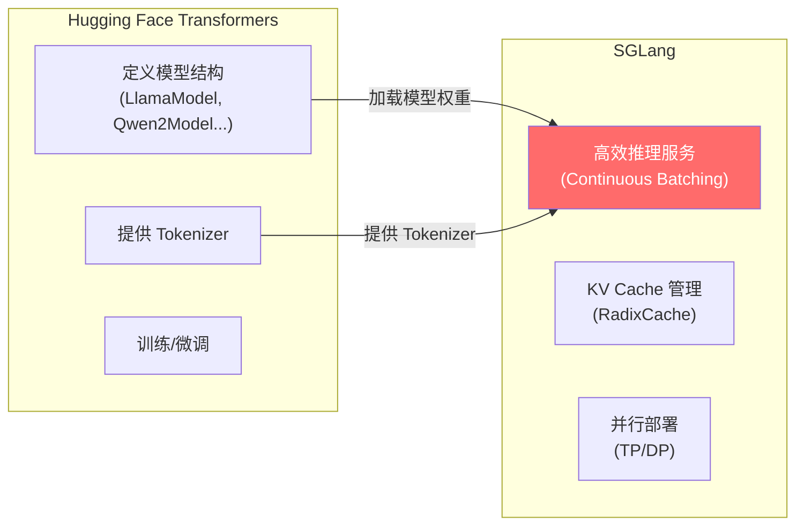

# 前置知识：Python 构建 + Transformers + 数学基础

> 目标：花 2-3 小时补齐看 SGLang 源码所需的背景知识。
> 受众：会写 Python 脚本，但没接触过 ML/深度学习的开发者。
> 方式：每个概念附带**可直接运行的代码**，不讲理论细节。
>
> **下一步**: 完成本文后，开始 [Week 1](../01-architecture/foundations.md) 或先搭建 [Mac 调试环境](../setup/mac-debug.md)。
> **进阶数学**: 如需了解 GPU 算力/带宽对性能的影响，见 [performance-intuition.md](../05-reference/performance-intuition.md)。

---

## Part 1: Python 构建基础

### 1.1 虚拟环境 (venv / uv)

**为什么不直接 `pip install`？**

直接装在系统 Python 里，不同项目的依赖会冲突（A 要 torch 2.0，B 要 torch 2.3）。虚拟环境 = 每个项目有自己独立的 `site-packages`。

```bash
# 创建虚拟环境 (uv 是更快的替代品，用法几乎和 venv 一样)
uv venv python/.venv --python 3.13

# 激活后，python/pip 指向虚拟环境里的版本
source python/.venv/bin/activate
which python  # → .../python/.venv/bin/python

# 安装包只影响这个虚拟环境
pip install numpy
```

### 1.2 PYTHONPATH 的作用

Python 在 `import` 时会在一系列目录中搜索模块。`PYTHONPATH` 可以往这个搜索列表里加目录。

```bash
# SGLang 的源码在 python/ 目录下，兼容层在 sglang-learning-docs/ 下
# 不设置 PYTHONPATH 的话，Python 找不到它们
PYTHONPATH="sglang-learning-docs:python" python -c "import sglang; print('找到了!')"
```

**为什么 SGLang 要这样做？** 因为 SGLang 用的是"开发模式"——直接从源码目录 import，而不是先 `pip install` 再用。这样你改了代码立刻生效，不用重新安装。

### 1.3 import 机制

```python
# Python 搜索模块的顺序:
import sys
print(sys.path)
# 1. 当前目录
# 2. PYTHONPATH 里的目录
# 3. 虚拟环境的 site-packages
# 4. 系统 Python 的标准库

# 包 vs 模块:
# sglang/srt/managers/scheduler.py  ← 这是一个模块
# sglang/srt/managers/               ← 这是一个包 (有 __init__.py)
# import sglang.srt.managers.scheduler  ← 完整路径导入
```

### 1.4 给 Java 开发者的 Python 速记

如果你有 Java 背景，下表帮你快速建立对应关系：

| Python | Java 对应 | 说明 |
|---|---|---|
| `self` | `this` | Python 要求显式写在方法第一个参数，Java 隐式存在 |
| `**kwargs` | `Map<String, Object>` | 接收任意关键字参数；`Foo(**kwargs)` ≈ 用 map 的值填构造函数参数 |
| `@dataclass` | `record` (Java 14+) 或 Lombok `@Data` | 自动生成 `__init__`、`__eq__`、`__repr__` |
| `with open(...) as f:` | try-with-resources | 自动关闭资源，Python 叫 context manager |
| 多继承 + Mixin | 多个带 `default` 方法的 interface | 但 Python Mixin 可带字段（状态），Java interface 不行 |
| `ABC` + `@abstractmethod` | `abstract class` / `interface` | Python 无 `interface` 关键字，用 `abc` 模块模拟 |
| `list[int]` / `dict[str, Any]` | `List<Integer>` / `Map<String, Object>` | 类型注解不影响运行，仅供阅读和 IDE 补全 |
| `lambda x: x + 1` | `x -> x + 1` | 匿名函数 |
| 装饰器 `@foo` | 注解 `@Foo` + AOP | 装饰器在运行时包装函数，比 Java 注解更动态 |

```python
# Mixin 示例 — Java 开发者容易困惑的多继承
class LogMixin:
    """类似 Java 中一个带 default 方法的 interface"""
    def log(self, msg):
        print(f"[{self.__class__.__name__}] {msg}")

class Scheduler(LogMixin, SomeMixin):
    """相当于 class Scheduler implements LogMixin, SomeMixin"""
    def run(self):
        self.log("running")  # 从 LogMixin 继承来的方法

# SGLang 中看到 class Scheduler(MixinA, MixinB, MixinC):
# 只需关注 Scheduler 自己的方法，Mixin 按需深入
```

> **Tips**: 遇到不认识的 Python 语法，搜 "Python xxx for Java developers" 通常能找到很好的对比文章。

### 1.5 常见 Python Pattern (SGLang 中大量使用)

```python
# 1. dataclass — 自动生成 __init__ 的数据容器
from dataclasses import dataclass

@dataclass
class ServerConfig:
    host: str = "0.0.0.0"
    port: int = 30000
    model_path: str = ""

config = ServerConfig(model_path="meta-llama/Llama-3-8B")
print(config.port)  # 30000

# 2. Type Hints — 标注类型，不影响运行，但帮助阅读和 IDE 补全
def tokenize(text: str) -> list[int]:
    return [ord(c) for c in text]  # 简化示意

# 3. Enum — 枚举类型，比字符串常量更安全
from enum import IntEnum, auto
class ForwardMode(IntEnum):
    EXTEND = auto()   # 1
    DECODE = auto()   # 2
    MIXED = auto()    # 3

# SGLang 用 ForwardMode 区分 prefill 和 decode 阶段
```

### 1.6 多进程基础

SGLang 用多进程（不是多线程）来并行处理。为什么？因为 Python 有 GIL（全局解释器锁），多线程无法真正并行计算。

```python
from multiprocessing import Process, Queue
import time

def worker(name, q):
    """子进程：从队列取任务，处理后放回结果"""
    while True:
        task = q.get()
        if task == "STOP":
            break
        print(f"[{name}] 处理: {task}")
        time.sleep(0.1)

# 主进程创建队列和子进程
q = Queue()
p = Process(target=worker, args=("Worker-1", q))
p.start()

q.put("任务A")
q.put("任务B")
q.put("STOP")
p.join()
# SGLang 的 ZMQ 本质上做的事和 Queue 一样，但更灵活、跨机器
```

---

## Part 2: Transformers 快速理解

### 2.1 LLM 是什么？

大语言模型 (LLM) 本质上就是一个函数：

```
输入: 一段文字 (如 "今天天气")
输出: 下一个字的概率分布 (如 {"很": 0.6, "不": 0.2, "还": 0.1, ...})
```

然后从概率分布中选一个字（采样），拼到输入后面，再重复。这就是"自回归生成"。

### 2.2 Tokenizer：文字 ↔ 数字

模型不认识文字，只认识数字。Tokenizer 负责转换。

```python
# 可在 Mac 上直接运行 (需先 pip install transformers)
from transformers import AutoTokenizer

# 加载一个 tokenizer (不需要 GPU，只是查表操作)
tokenizer = AutoTokenizer.from_pretrained("gpt2")

# 文字 → 数字 (encode)
text = "Hello, world!"
ids = tokenizer.encode(text)
print(f"文字: {text}")
print(f"Token IDs: {ids}")        # [15496, 11, 995, 0]
print(f"Token 数量: {len(ids)}")  # 4

# 数字 → 文字 (decode)
recovered = tokenizer.decode(ids)
print(f"恢复: {recovered}")       # "Hello, world!"

# 查看每个 token 对应什么
for id in ids:
    print(f"  {id} → '{tokenizer.decode([id])}'")
```

**关键理解**: 一个 token ≠ 一个字。英文中一个 token 约 4 个字母，中文中一个 token 约 1-2 个字。

### 2.3 Chat Template (对话模板)

ChatGPT 风格的对话有固定格式：

```python
messages = [
    {"role": "system", "content": "You are a helpful assistant."},
    {"role": "user", "content": "Hello!"},
    {"role": "assistant", "content": "Hi! How can I help?"},
    {"role": "user", "content": "What is 2+2?"},
]

# Chat template 把上面的结构转成模型能理解的纯文本:
# <|system|>You are a helpful assistant.<|end|>
# <|user|>Hello!<|end|>
# <|assistant|>Hi! How can I help?<|end|>
# <|user|>What is 2+2?<|end|>
# <|assistant|>

# SGLang 中 TokenizerManager 负责这个转换
```

### 2.4 模型文件的构成

从 Hugging Face 下载一个模型，里面有什么？

```
meta-llama/Llama-3-8B-Instruct/
├── config.json              # 模型结构 (层数、维度、注意力头数)
├── tokenizer.json           # Tokenizer 的词表和规则
├── model.safetensors        # 模型权重 (参数值，这个文件最大，几十 GB)
├── generation_config.json   # 生成参数默认值
└── special_tokens_map.json  # 特殊 token (EOS, PAD 等)
```

### 2.5 SGLang 和 Transformers 的关系



简单说：**Transformers 负责"定义模型长什么样"，SGLang 负责"让模型跑得又快又稳"**。

---

## Part 3: 基本数学知识

> 以下所有代码都可以直接运行，只需 `pip install numpy`。

### 3.1 向量和矩阵乘法

```python
import numpy as np

# 向量：一维数组
v = np.array([1.0, 2.0, 3.0])  # shape: (3,)

# 矩阵：二维数组
W = np.array([
    [1, 0, 1],
    [0, 1, 1],
])  # shape: (2, 3)

# 矩阵乘法: (2,3) × (3,) = (2,)
result = W @ v
print(result)  # [4., 5.]  即 [1*1+0*2+1*3, 0*1+1*2+1*3]

# 关键规则: (m, n) × (n, k) = (m, k)
# 例: (batch_size, hidden_dim) × (hidden_dim, vocab_size) = (batch_size, vocab_size)
# 这就是模型最后一层 (LM Head) 做的事！
```

**在 SGLang 中的应用**: 模型的每一层都是矩阵乘法。`hidden_states = input @ weight`。Tensor Parallelism 就是把 `weight` 按列切分到多个 GPU 上。

### 3.2 Softmax：分数 → 概率

```python
import numpy as np

def softmax(x):
    """把任意实数数组变成概率分布 (和为 1，都 > 0)"""
    e_x = np.exp(x - np.max(x))  # 减 max 防止数值溢出
    return e_x / e_x.sum()

# logits: 模型对每个词的"打分"
logits = np.array([2.0, 1.0, 0.1])

probs = softmax(logits)
print(f"logits: {logits}")
print(f"概率:   {probs.round(3)}")  # [0.659, 0.242, 0.099]
print(f"概率之和: {probs.sum():.1f}")  # 1.0

# 分数最高的词 (2.0) 得到最大概率 (0.659)
# 但不是 100%！其他词也有机会被选中 — 这就是"采样"的随机性来源
```

### 3.3 Temperature：控制随机性

```python
import numpy as np

def softmax(x):
    e_x = np.exp(x - np.max(x))
    return e_x / e_x.sum()

logits = np.array([2.0, 1.0, 0.1])

# Temperature 越低 → 概率分布越"尖" → 越倾向选最大值
# Temperature 越高 → 概率分布越"平" → 越随机
for temp in [0.1, 0.5, 1.0, 2.0]:
    probs = softmax(logits / temp)
    print(f"temp={temp:.1f}: {probs.round(3)}")

# temp=0.1: [1.000, 0.000, 0.000]  ← 几乎确定选第一个
# temp=0.5: [0.936, 0.063, 0.002]  ← 大概率选第一个
# temp=1.0: [0.659, 0.242, 0.099]  ← 有随机性
# temp=2.0: [0.480, 0.327, 0.193]  ← 很随机
```

**本质**: `temperature` 就是 `logits / temperature` 再 softmax。除以一个大数让差异变小，除以小数让差异变大。

### 3.4 Attention 的数学本质

```python
import numpy as np

def softmax_2d(x):
    """对每一行做 softmax"""
    e_x = np.exp(x - x.max(axis=-1, keepdims=True))
    return e_x / e_x.sum(axis=-1, keepdims=True)

# 假设序列长度=3，每个 token 有 4 维的向量表示
seq_len, d = 3, 4
np.random.seed(42)

# Q, K, V 都是从 hidden_states 线性变换来的
Q = np.random.randn(seq_len, d)  # "我在找什么?" (3, 4)
K = np.random.randn(seq_len, d)  # "我有什么标签?" (3, 4)
V = np.random.randn(seq_len, d)  # "我的实际内容" (3, 4)

# Step 1: Q × K^T → 相关性分数 (谁和谁相关)
scores = Q @ K.T  # (3, 4) × (4, 3) = (3, 3)
print("相关性分数 (Q×K^T):")
print(scores.round(2))

# Step 2: Softmax → 注意力权重 (归一化为概率)
weights = softmax_2d(scores / np.sqrt(d))  # 除以 sqrt(d) 是为了稳定数值
print("\n注意力权重 (softmax):")
print(weights.round(3))
# 每一行和为 1，表示"这个 token 应该关注哪些其他 token"

# Step 3: 权重 × V → 加权求和，得到输出
output = weights @ V  # (3, 3) × (3, 4) = (3, 4)
print(f"\n输出 shape: {output.shape}")  # (3, 4) — 和输入一样！

# 整个公式: Attention(Q, K, V) = softmax(Q×K^T / √d) × V
```

**在 SGLang 中**:
- **Prefill (EXTEND)**: 计算完整的 Q×K^T 矩阵（所有 token 之间）
- **Decode**: 只有 1 个新 Q，和所有历史 K 计算相关性
- **KV Cache**: 把算过的 K 和 V 存起来，decode 时直接用

### 3.5 概率采样

```python
import random

# 假设 softmax 后的概率分布
vocab = ["很", "不", "还", "真", "挺"]
probs = [0.5, 0.2, 0.15, 0.1, 0.05]

# 采样: 按概率随机选一个
# (这就是 SGLang sampler 做的核心事情)
for i in range(5):
    chosen = random.choices(vocab, weights=probs, k=1)[0]
    print(f"第{i+1}次采样: {chosen}")

# Top-P (nucleus sampling): 只从累积概率前 P 的词里选
def top_p_filter(vocab, probs, p=0.9):
    """只保留累积概率 ≤ p 的词"""
    sorted_pairs = sorted(zip(probs, vocab), reverse=True)
    cumsum = 0
    filtered = []
    for prob, word in sorted_pairs:
        cumsum += prob
        filtered.append((word, prob))
        if cumsum >= p:
            break
    return filtered

print(f"\nTop-P=0.9 过滤后: {top_p_filter(vocab, probs, 0.9)}")
# 只剩 "很"(0.5), "不"(0.2), "还"(0.15) — 累积=0.85+后面的=0.9
```

---

## 自查：你准备好了吗？

读完上面的内容后，你应该能回答：

- [ ] `PYTHONPATH="sglang-learning-docs:python"` 这行命令是在做什么？
- [ ] `tokenizer.encode("Hello world")` 的返回值是什么类型？
- [ ] `softmax([5.0, 1.0, 1.0])` 的结果中，第一个值大约是多少？(>0.9)
- [ ] `(32, 128) @ (128, 50000)` 的结果 shape 是什么？(`(32, 50000)`)
- [ ] Temperature=0.01 时，模型的输出会怎样？(几乎确定性，总选概率最高的)
- [ ] 为什么 SGLang 用多进程而不是多线程？(GIL)

全部能答上来 → 你已经准备好进入 Week 1 了！
